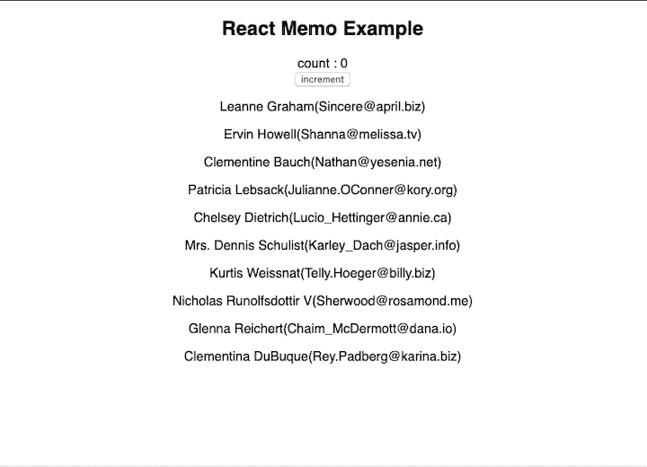
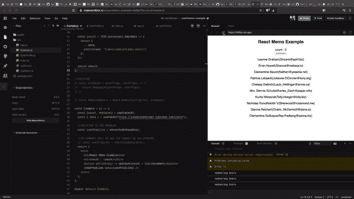
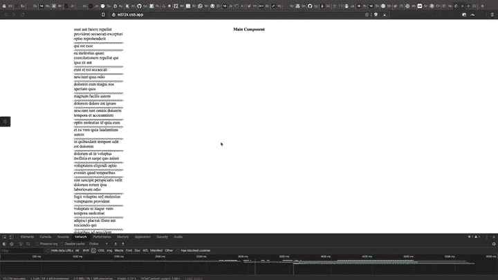
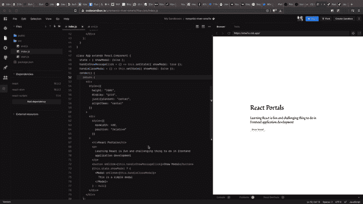
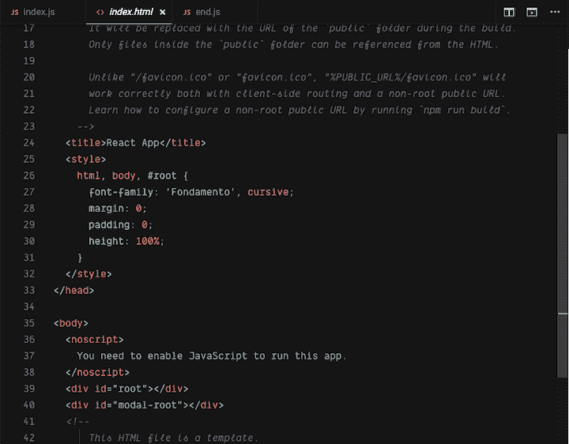

# React 顶级 API 可能会改变你编写组件的方式

> 原文：<https://blog.logrocket.com/react-top-level-apis-that-could-change-the-way-you-write-components/>

在本指南中，我们将探索一些 React 顶级 API，它们可能会彻底改变您在应用程序中编写组件的方式。

您可能会想，“我现在编写组件的方式有什么问题吗？”请允许我回顾一下我在编写 React 组件时遇到的一些棘手问题。也许有些你会听起来很熟悉。

众所周知，React 是基于组件的库，也就是说它有层次结构，所有东西都是组件。您很可能会遇到这样的情况:组件被不必要地重新呈现，导致应用程序延迟。此外，你会很快发现你的应用程序有很大一部分运行在多种不同类型的逻辑上，这进一步降低了你的应用程序的性能，损害了用户体验。

考虑另一个场景，您需要在应用程序中呈现一个模态。您已经将其设置为`position: absolute`和`z-index`，但是其中一个父元素具有`position: relative`或`z-index`，这将影响模态的定位。

有无数种方法可以解决这样的问题，但是我们将要探索的 7 个 React 顶级 API 可以改变您的观点，告诉您如何处理在编写 React 组件时遇到的常见障碍。

## `React.memo`

React 通过比较以前的渲染结果和当前的渲染结果来渲染组件。如果有差异，它将更新 V-DOM 并重新呈现组件。这种比较已经非常快了，但你可以通过使用更高阶的元件，如 [`React.memo`](https://reactjs.org/docs/react-api.html#reactmemo) ，进一步提升性能。

让我们看一个您可能在项目中遇到的简单用例。



这里我们有一个按钮和另一个呈现用户列表的组件。每当您单击一个按钮，计数就会增加。这可以是任何动作或计算。但是，需要注意的是，动作和呈现的用户数据之间没有关系。

当用户点击按钮时会发生什么？



如您所见，它再次呈现了用户数据。

每次父应用程序重新渲染时，应用程序中的所有子应用程序也会重新渲染。在您的应用程序发展到一定的复杂程度之前，这不会是一个大问题。一旦你到达顶点，你会开始注意到性能的下降。

`React.memo`通过记忆组件的结果并仅在属性改变时重新渲染来帮助解决这个问题。如果道具相同，它会返回之前的结果，而不是重新渲染组件。

用`React.memo`包装你的子组件。

```
const MemoizedUsers = React.memo(UserProfiles);

```

也可以通过自定义函数来检查道具是否相等。通常，反应做[浅比](https://reactjs.org/docs/shallow-compare.html)。

让我们通过一个自定义函数来检查深度比较。

```
import deepequal from "deep-equal";

const areEqual = (prevProps, nextProps) => {
  return deepequal(prevProps, nextProps);
};

const MemoizedUsers = React.memo(UserProfiles, areEqual);

```

查看下面的完整解决方案。

> react memo-ganeshmani 使用 deep-equal、react、react-dom、react-scripts 的示例

## `React.lazy`悬念

React 中的这个特性还处于试验阶段，但是了解这个概念仍然很有价值，这样您就可以了解如何解决它在不久的将来要解决的问题。

假设您有一个包含许多组件的页面。有些组件需要快速渲染，而优先级较低的组件可以稍后加载。

您可以通过延迟加载辅助组件来实现。

让我们看一个例子。假设我们的应用程序有两个组件:`Main`和`SidePage`。`Main`组件是用户交互的地方。`SidePage`包括一些与应用主要功能无关的图表。

我们可以通过在应用程序中动态导入`SidePage`组件来解决问题，这基本上就是拆分代码。我们的邮件应用程序逻辑将在主块中，惰性加载的组件将在 JS 文件的第二块中编译。

让我们看看他们的行动。我们的主要组件将包含以下代码。

* * *

### 更多来自 LogRocket 的精彩文章:

* * *

```
import React from "react";
import styled from "styled-components";
const Container = styled.div`
  grid-area: MainContainer;
`;
const MainComponent = () => {
  return (
    <Container>
      <h4>Main Component</h4>
    </Container>
  );
};
export default MainComponent;

```

次要组件包含以下内容。

```
import React from "react";
import styled from "styled-components";
import useFetch from "./useFetch";
const Container = styled.div`
  grid-area: ${props => props.name};
`;
const Lists = styled.ul`
  height: 100vh;
  overflow-y: scroll;
  list-style: none;
`;
const ListItem = styled.li`
  padding: 5px;
  box-shadow: 0 10px 6px -6px #777;
`;
const SecondaryComponent = ({ name }) => {
  const { response, error } = useFetch(
    "https://jsonplaceholder.typicode.com/posts",
    {}
  );
  return (
    <Container name={name}>
      <Lists>
        {response && response.map(item => <ListItem>{item.title}</ListItem>)}
      </Lists>
    </Container>
  );
};
export default SecondaryComponent;

```

这里，我们使用`useFetch`钩子从 API 获取一些数据，并将其加载到我们的`SidePage`组件中。

### `useFetch.js`

```
import React from "react";
const useFetch = (url, options) => {
  const [response, setResponse] = React.useState(null);
  const [error, setError] = React.useState(null);
  React.useEffect(() => {
    const fetchData = async () => {
      try {
        const res = await fetch(url, options);
        const json = await res.json();
        setResponse(json);
      } catch (error) {
        setError(error);
      }
    };
    fetchData();
  }, []);
  return { response, error };
};
export default useFetch;

```

现在惰性加载`App.js`中的`SidePage`组件。

```
import React, { lazy, Suspense } from "react";
import styled from "styled-components";
import MainComponent from "./Maincomponent";
import "./styles.css";
const Container = styled.div`
  height: 100vh;
  display: grid;
  max-width: 1440px;
  width: 1440px;
  justify-items: center;
  grid-template-columns: 0.5fr 2fr 0.5fr;
  grid-template-areas: 1fr;
  grid-template-areas: "LeftPane MainContainer RightPane";
`;
export default function App() {
  const SecondaryComponent = lazy(() => import("./SecondaryComponent"));
  return (
    <Container>
      <Suspense fallback={<h1>Loading…</h1>}>
        <SecondaryComponent name={"LeftPane"} />
      </Suspense>
      <MainComponent />
      {/* <SecondaryComponent name={"RightPane"} /> */}
    </Container>
  );
}

```

在上面的代码中，我们使用以下代码动态导入了`SidePage`组件:

```
  const SecondaryComponent = lazy(() => import("./SecondaryComponent"));

```

之后，我们使用悬念来呈现懒惰加载的组件。

```
<Suspense fallback={<h1>Loading…</h1>}>
        <SecondaryComponent name={"LeftPane"} />
</Suspense>

```

React Suspense 是一个高阶组件，它将等待组件渲染。我们提供的回退将一直呈现，直到动态导入的组件准备好呈现为止。



查看 [CodeSandbox](https://codesandbox.io/embed/react-lazy-suspense-e072k?fontsize=14&hidenavigation=1&theme=dark) 中的完整代码。

## `React.forwardRef`

React 引用提供了一种访问 React 组件中 DOM 元素的方法。通常，React 父组件和子组件通过 props 进行交互。要更改子组件，需要修改道具，这会重新呈现组件。

但是在某些情况下，您需要更改 DOM 元素，而不将它们放入 React 生命周期中。例子包括自动聚焦一个元素；访问元素的属性，如宽度和高度；以及绑定外部第三方库，如下图。

```
import React, { useRef, useEffect } from "react"

export default function App() {
  const inputRef = useRef(null)

  return (
    <div className="App">
      <input type="text" ref={inputRef} placeholder="Enter Element" />
    </div>
  )
}
```

```
现在让我们来看看如何在 React 中转发 refs。在上面的例子中，我们引用了组件中呈现的 DOM 元素。如果我们想在子组件中引用一个元素呢？我们能把裁判当成道具吗？
不幸的是，这在 React 组件中不起作用。我们需要将 ref 从父元素转发到子元素，以访问子 DOM 元素。
我们来实现`forwardRef`。上面的例子包括一个定制的输入组件。

```
import React, { forwardRef } from "react";
const Input = ({ type, value, placeholder }, ref) => {
  return (
    <div>
      <input type={type} ref={ref} value={value} placeholder={placeholder} />
    </div>
  );
};
export default forwardRef(Input);

```

这里，我们用`forwardRef`包装我们的`Input`组件。`Input`功能将有道具和裁判。ref 可以与我们想要访问的元素绑定。

```
import React, { useRef, useEffect } from "react";
import "./styles.css";
import Input from "./Input";
export default function App() {
  const inputRef = useRef(null);
  useEffect(() => {
    if (inputRef) {
      console.log("inputRef", inputRef);
      inputRef.current.value = 123;
    }
  }, [inputRef]);
  return (
    <div className="App">
      <Input type="text" ref={inputRef} placeholder="Enter Element" />
    </div>
  );
}

```

ganeshmani 使用 react、react-dom、react-scripts 的 react-forward-refs

反应`createPortal`
最后，让我们探索门户，为什么我们需要门户，以及如何在 React 中实现门户。
假设您需要在应用程序中呈现一个模态。您已经指定了`position: absolute`和`z-index`。但是其中一个父元素有`position: relative`或`z-index`，这将影响模态的定位。

模式组件在相对于其父组件位置的位置呈现。如果我们移除`position:relative`，一切都会正常工作。但是我们不能确定，因为我们可能需要在我们的应用程序中使用它。
在 React 中，我们可以通过使用`createPortal`来解决这个问题。基本上，我们将模态 DOM 元素从应用程序根元素中取出，并在`createPortal`的帮助下呈现组件。

之后，创建一个 div 元素，并将其附加到模式根 div 元素中。

```
el = document.createElement("div");

componentDidMount() {
    modalRoot.appendChild(this.el);
}

componentWillUnmount() {
    modalRoot.removeChild(this.el);
}

render() {
    return ReactDOM.createPortal(
       //component comes here,
      this.el
    );
  }

```

00254q4n6p 由 kentcdodds 使用 react、react-dom、react-scripts

摘要
这些顶级 API 将帮助您更有效地编写 React 组件，并且知道何时以及如何使用它们对您的开发周期至关重要。
在本指南中，我们讨论了一些最重要的组件，但是还有许多其他更高级的组件和顶级 API 需要探索。查看[官方文件](https://reactjs.org/docs/react-api.html)了解更多信息。
 [LogRocket](https://lp.logrocket.com/blg/react-signup-general) :全面了解您的生产 React 应用

## 调试 React 应用程序可能很困难，尤其是当用户遇到难以重现的问题时。如果您对监视和跟踪 Redux 状态、自动显示 JavaScript 错误以及跟踪缓慢的网络请求和组件加载时间感兴趣，

. 

[try LogRocket](https://lp.logrocket.com/blg/react-signup-general)

LogRocket 结合了会话回放、产品分析和错误跟踪，使软件团队能够创建理想的 web 和移动产品体验。这对你来说意味着什么？

 [](https://lp.logrocket.com/blg/react-signup-general) 
 [](https://lp.logrocket.com/blg/react-signup-general) 

LogRocket 不是猜测错误发生的原因，也不是要求用户提供截图和日志转储，而是让您回放问题，就像它们发生在您自己的浏览器中一样，以快速了解哪里出错了。

不再有嘈杂的警报。智能错误跟踪允许您对问题进行分类，然后从中学习。获得有影响的用户问题的通知，而不是误报。警报越少，有用的信号越多。

LogRocket Redux 中间件包为您的用户会话增加了一层额外的可见性。LogRocket 记录 Redux 存储中的所有操作和状态。

现代化您调试 React 应用的方式— [开始免费监控](https://lp.logrocket.com/blg/react-signup-general)。

Modernize how you debug your React apps —
[start monitoring for free](https://lp.logrocket.com/blg/react-signup-general).

```