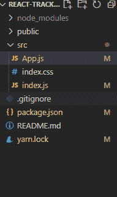
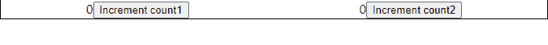
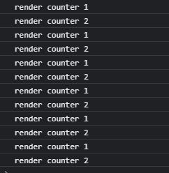
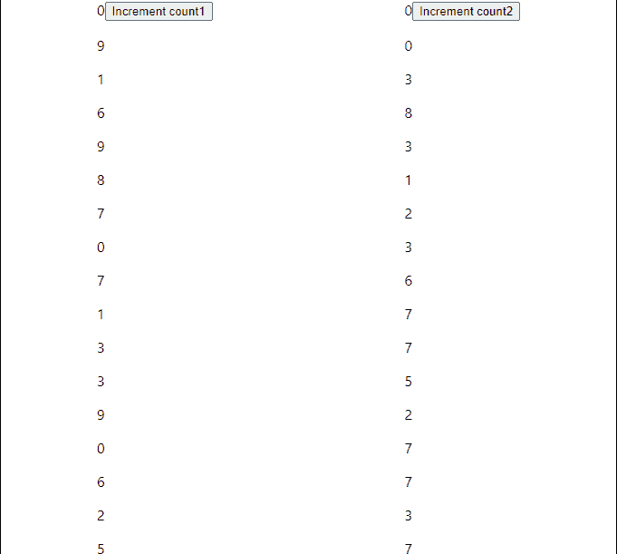
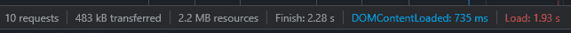
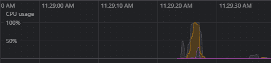
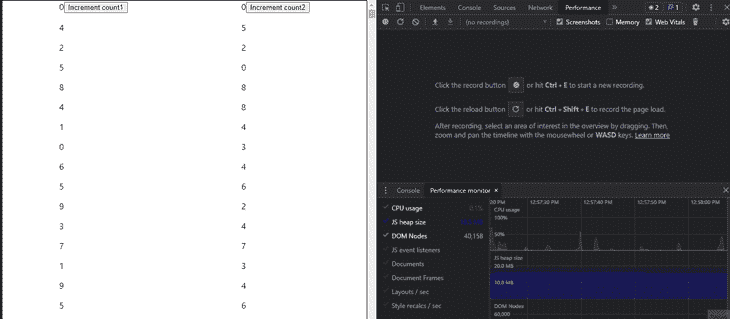
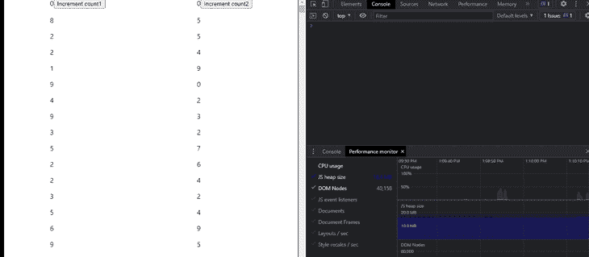

# React Tracked:管理状态并防止过多的重新渲染

> 原文：<https://blog.logrocket.com/react-tracked-manage-state-prevent-excessive-re-rendering/>

在过去的几年中，React 中的状态管理经历了重大的演变。有了像内置 React Context API 和 React Redux 这样的解决方案，保持全局状态和跟踪变化变得前所未有的简单。然而，在实现这些工具时，一个持续的挑战是优化性能和防止组件不必要的重新呈现。

而在较小的应用程序中，过多的重新渲染可能不会引起注意或者没有负面影响，随着应用程序的增长，每次重新渲染都可能导致 UI 延迟或滞后。在本教程中，我们将使用 [React Tracked](https://github.com/dai-shi/react-tracked) ，一个用于状态使用跟踪的库，通过防止不必要的重新渲染来优化我们的应用程序的性能。

## 安装 React Tracked

首先，在您的机器上建立一个新的 React 项目。在终端中打开项目，并添加以下命令来安装 React 跟踪库:

```
yarn add react-tracked scheduler 

```

现在，让我们通过给它以下结构来清理我们的项目:



## 设置我们的应用程序

让我们比较一下 React Tracked 和共享状态的普通 React 实现。我们将创建一个简单的全局上下文，它有两个计数器组件，每个组件使用一个值。

在`App.js`中添加以下代码:

```
import Counter1 from "./Counter1";
import Counter2 from "./Counter2";

import { SharedStateProvider } from "./store";

function App() {
  return (
    <>
      <SharedStateProvider>
        <div
          style={{
            display: "flex",
            flexDirection: "row",
            border: "1px solid black",
            justifyContent: "space-around",
          }}
        >
          <Counter1 />
          <Counter2 />
        </div>
      </SharedStateProvider>
    </>
  );
}

export default App;

```

要创建计数器组件，请在每个文件中添加以下代码:

### `Counter1`

```
import React from "react";
import { useSharedState } from "./store";

export default function Counter1() {
  const [state, setState] = useSharedState();

  const increment = () => {
    setState((prev) => ({ ...prev, count1: prev.count1 + 1 }));
  };

  return (
    <div>
      {state.count1}
      {console.log("render counter 1")}

      <button onClick={increment}>Increment count1</button>

    </div>
  );
}

```

### `Counter2`

```
import React from "react";
import { useSharedState } from "./store";

export default function Counter2() {
  const [state, setState] = useSharedState();

  const increment = () => {
    setState((prev) => ({ ...prev, count2: prev.count2 + 1 }));
  };

  return (
    <div>
      {state.count1}
      {console.log("render counter 2")}

      <button onClick={increment}>Increment count2</button>

    </div>
  );
}

```

### `store.js`

最后，让我们创建我们的`store.js`文件，它使用全局计数器上下文和计数器组件中状态的`useSharedState()`钩子:

```
import React, { createContext, useState, useContext } from "react";

const initialState = {
  count1: 0,
  count2: 0,
};

const useValue = () => useState(initialState);

const MyContext = createContext(null);

export const useSharedState = () => {
  const value = useContext(MyContext);
  return value;
};

export const SharedStateProvider = ({ children }) => (
  <MyContext.Provider value={useValue()}>{children}</MyContext.Provider>
);

```

要运行该项目，请添加以下命令:

```
yarn start

```

现在，我们将在浏览器屏幕上看到以下输出:



打开浏览器控制台，按下每个**增量**按钮三次。我们将收到以下输出:



无论状态是否更新，每个组件都会重新呈现。理想情况下，组件应该只在状态改变时才重新呈现。

在我们的示例中，总共应该有六次重新渲染，两个组件都有三次，但是，我们得到了 12 次，这表明两个组件在每次单击时都重新渲染了。

## 呈现一个大列表

现在，让我们尝试呈现一个大的元素列表。将下面的代码添加到`Counter1`和`Counter2`中，在每个组件中生成 10，000 个随机数的列表:

```
import React, { useEffect, useState } from "react";
import { useSharedState } from "./store";

export default function Counter1() {
  const [state, setState] = useSharedState();

  const [randomNumbers, setRandomNumbers] = useState([]);
  const increment = () => {
    setState((prev) => ({ ...prev, count1: prev.count1 + 1 }));
  };
  const generateHugeList = () => {
    let list = [];
    for (let i = 0; i < 10000; i++) {
      list.push(Math.floor(Math.random() * 10));
    }
    setRandomNumbers(list);
  };
  useEffect(() => {
   generateHugeList();
  }, []);
  return (
    <div>
      {state.count1}
      {console.log("render counter 1")}

      <button onClick={increment}>Increment count1</button>
      {randomNumbers.map((number) => {
        return <p>{number}</p>;
      })}
    </div>
  );
}

```

计数器组件在浏览器上呈现列表，产生类似如下的输出:



随着这些新元素的引入，我们的应用程序需要更多的时间来加载:



第一次加载时，CPU 使用率跃升至 100 %:



React 将在第一次渲染时将所有元素绘制到浏览器 DOM 中，因此 100%的 CPU 使用率是典型的。但是，在单击每个计数器组件上的**增量**按钮后，CPU 使用率保持在 100 %,这表明两个计数器都在不断地重新呈现:



## 防止重新渲染的选项

防止重新渲染的一个流行方法是[在 React Redux](https://blog.logrocket.com/getting-started-react-redux-firebase/) 中使用选择器，这是订阅 Redux 存储并在调度动作时运行的函数。选择器使用`===`作为严格的质量检查，每当数据改变时重新呈现组件。虽然这个过程对变量很有效，但每次数据改变时返回新引用的函数会不断地重新呈现。

另一方面，React Tracked 包装了上下文对象，并通过使用 JavaScript 代理的返回自己的提供者，以跟踪状态的单个属性的变化。

代理包装单个对象，截取或改变其基本操作。React Tracked 实现了检查组件内部状态的代理，只有当信息改变时才重新呈现它。要查看代理的运行情况，让我们在应用程序中实现 React Tracked。

## 呈现跟踪了反应的列表

首先，我们需要通过添加以下代码来修改我们之前创建的`store.js`文件:

```
import { useState } from "react";
import { createContainer } from "react-tracked";

const initialState = {
  count1: 0,
  count2: 0,
};

const useMyState = () => useState(initialState);

export const { Provider: SharedStateProvider, useTracked: useSharedState } =
  createContainer(useMyState);

```

在上面的代码中，我们导入了`createContainer()`，它返回一个 React 跟踪的提供者。`useTracked`钩子为我们的状态创建一个代理。

现在，让我们重新构建项目，并将之前的输出与 React Tracked 的输出进行比较:



例如，当我们选择**递增计数 1** 按钮时，在第一次渲染时，`Counter1`和`Counter2`都会被渲染。然而，在随后的点击中，只有`Counter1`被重新渲染，减少了 CPU 的使用，提高了我们应用的性能。

## 结论

在本教程中，我们探讨了由不必要的重新渲染导致的不必要的性能缺陷。虽然像 React Redux 和 React Context API 这样的工具可以很容易地跟踪应用程序状态的变化，但它们并没有提供一个简单的解决方案来最小化重新呈现。

使用 React Tracked 库，我们构建了一个应用程序，并最大限度地减少了重新呈现计数器组件的次数，从而减少了 CPU 的使用并提高了整体性能。我希望你喜欢这个教程！

## [LogRocket](https://lp.logrocket.com/blg/react-signup-general) :全面了解您的生产 React 应用

调试 React 应用程序可能很困难，尤其是当用户遇到难以重现的问题时。如果您对监视和跟踪 Redux 状态、自动显示 JavaScript 错误以及跟踪缓慢的网络请求和组件加载时间感兴趣，

[try LogRocket](https://lp.logrocket.com/blg/react-signup-general)

.

[ ](https://lp.logrocket.com/blg/react-signup-general) [](https://lp.logrocket.com/blg/react-signup-general) 

LogRocket 结合了会话回放、产品分析和错误跟踪，使软件团队能够创建理想的 web 和移动产品体验。这对你来说意味着什么？

LogRocket 不是猜测错误发生的原因，也不是要求用户提供截图和日志转储，而是让您回放问题，就像它们发生在您自己的浏览器中一样，以快速了解哪里出错了。

不再有嘈杂的警报。智能错误跟踪允许您对问题进行分类，然后从中学习。获得有影响的用户问题的通知，而不是误报。警报越少，有用的信号越多。

LogRocket Redux 中间件包为您的用户会话增加了一层额外的可见性。LogRocket 记录 Redux 存储中的所有操作和状态。

现代化您调试 React 应用的方式— [开始免费监控](https://lp.logrocket.com/blg/react-signup-general)。