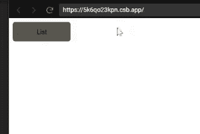
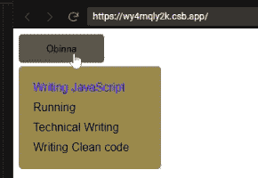
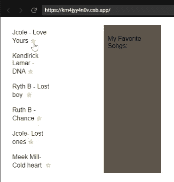
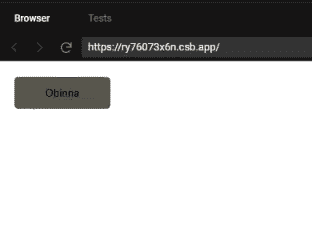

# 使用 React 转换组改进 UI - LogRocket 博客

> 原文：<https://blog.logrocket.com/react-transition-group/>

***编者按**:这个 React 过渡组教程最后一次更新是在 2022 年 9 月 22 日。*

过渡是创建交互式 ui 时最常被忽视的原则之一。幸运的是，在过去的几年里， [React](https://reactjs.org/) 和其他以组件为中心的框架已经改变了我们对 ui 以及如何构建 ui 的看法。

在本 [React 过渡组](https://reactcommunity.org/react-transition-group/)教程中，我们将向您展示如何使用 [`CSSTransition`](http://reactcommunity.org/react-transition-group/css-transition) 和 [`TransitionGroup`](http://reactcommunity.org/react-transition-group/transition-group) 组件，并复习一些简单的`react-transition-group`示例。

以下是我们将要介绍的内容:

要跟进，您应该:

## 什么是反应过渡族？

[React Transition Group](https://www.npmjs.com/package/react-transition-group) 使您能够以声明性和高效的方式将组件移入和移出 DOM，并最大限度地减少对样板代码的需求。

与许多其他 [React 动画库](https://blog.logrocket.com/the-top-5-react-animation-libraries-compared/)不同，例如 [React Spring](https://blog.logrocket.com/animations-with-react-spring/) ，React Transition Group 提供了用于定义动画的简单组件。该库本身并不定义样式，而是以有用的方式操纵 DOM，使得过渡和动画的实现更加舒适。

简而言之，React 过渡组提供了一种更直接的动画和过渡方法。

## 安装`react-transition-group`

要将 React 转换组安装到 React 应用程序中，请在终端中运行以下命令:

```
# npm
npm install react-transition-group --save

# yarn
yarn add react-transition-group

```

接下来，我们将详细了解 React 转换组可用的组件，并查看一些实用的`react-transition-group`示例。

## `CSSTransition`示例:使用 CSS 转换一个 React 组件

`CSSTransition`组件允许您使用 CSS 将过渡应用于进入和离开 DOM 的元素。您可以通过使用以下道具来实现这一点:

*   `in`，用于控制元素外观的布尔值
*   `timeout`，表示进入或离开 DOM 所需的毫秒数
*   `unmountOnExit`，表示当元素消失时，它实际上要完全离开 DOM。下面是它的代码片段:

### 带有反应转换组的简单列表示例

考虑以下代码块，分别代表使用`CSSTransition`前后的组件:

在`CSSTransition`之前:

```
import React, { Component } from "react";
import ReactDOM from "react-dom";
import "./styles.css";

class App extends Component {
  state = {
    showList: false
  };
  switch = () => {
    this.setState(prevState => ({
      showList: !prevState.showList
    }));
  };
  render() {
    return (
      <div className="container">
        <button className="display" onClick={this.switch}>
          List
        </button>
        {this.state.showList && (
          <div className="menu">
            <ul className="list">
              <li className="list-item">Feed the dog</li>
              <li className="list-item">Cut hair</li>
              <li className="list-item">Do the dishs</li>
              <li className="list-item">Buy grossries</li>
            </ul>
          </div>
        )}
      </div>
    );
  }
}

export default App;
const rootElement = document.getElementById("root");

ReactDOM.render(<App />, rootElement);

```

在`CSSTransition`之后:

```
import React, { Component } from "react";
import ReactDOM from "react-dom";
import cx from "classnames";
import { CSSTransition } from "react-transition-group";
import "./styles.css";

class App extends Component {
  state = {
    showList: true,
    highlightedHobby: false
  };
  switch = () => {
    this.setState(prevState => ({
      showList: !prevState.showList
    }));
  };
  listSwitch = () => {
    this.setState(state => ({
      highlightedHobby: !state.highlightedHobby
    }));
  };
  render() {
    return (
      <div className="container">
        <button className="display" onClick={this.switch}>
          Obinna
        </button>
        <CSSTransition
          in={this.state.showList}
          timeout={400}
          classNames="list-transition"
          unmountOnExit
          appear
          onEntered={this.listSwitch}
          onExit={this.listSwitch}
        >
          <div className="list-body">
            <ul className="list">
              <li
                className={cx("list-item", {
                  "list-item--active": this.state.highlightedHobby
                })}
              >
                Writing JavaScript
              </li>
              <li className="list-item"> Running</li>
              <li className="list-item"> Technical Writing</li>
              <li className="list-item"> Writing Clean code</li>
            </ul>
          </div>
        </CSSTransition>
      </div>
    );
  }
}
export default App;
const rootElement = document.getElementById("root");

ReactDOM.render(<App />, rootElement);

```

## 使用`CSSTransition`创建过渡

在上面的第一个代码示例中，我们有一个没有过渡的普通组件。只要单击 list 按钮，就会呈现一个有序列表，没有延迟，也没有额外的 CSS 样式。

下面是展示结果的 GIF 图:



但是当我们决定赋予这个例子更多的生命时，我们在使用`<CSSTransition>`标签的同时安装`react-transition-group`，并将`this.state.showList`中的信息作为道具传递给`in`，这使我们能够使用 CSS 添加一些过渡。这就是我们对上面的第二个代码块所做的。

以下是应用`CSSTransition`后的结果:



请注意元素是如何从隐藏状态平稳地过渡到完全显示的。现在让我们详细地看一下代码。

### `CSSTransition`超时道具

超时属性允许我们在列表离开 DOM 时应用一个转换。

```
<CSSTransition  
  timeout={400}
  // other props
>

```

然后我们前往`style.css`为过渡添加一些样式。`CSSTransition`给了我们四个键`classNames`用于元素的进入和离开:`enter`、`enter-active`、`exit`和`exit-active`。

```
/* This fires as soon as the element enters the DOM */
.list-transition-enter{
}
/* This is where we can add the transition*/
.list-transition-enter-active{
}
/* This fires as soon as the this.state.showList is false */
.list-transition-exit{
}
/* fires as element leaves the DOM*/
.list-transition-exit-active{
}

```

然后，在这些 CSS 类中，我们可以在类中添加一些很棒(但很简单)的 CSS，使子组件看起来像是从按钮中生长出来的。

```
/* This fires as soon as the element enters the DOM*/
.list-transition-enter {
/*We give the list the initial dimension of the list button*/
top: 0;
width: 120px;
max-height: 40px;
color: transparent;
background-color: #5a564c;
}
/* This is where we can add the transition*/
.list-transition-enter-active {
top: 45px;
width: 200px;
max-height: 200px;
background-color: #9e8949;
transition: all 400ms;
}
/* This fires as soon as the this.state.showList is false */
.list-transition-exit {
top: 45px;
width: 200px;
max-height: 200px;
background-color: #9e8949;
}
/* fires as element leaves the DOM*/
.list-transition-exit-active {
top: 0;
width: 120px;
max-height: 40px;
color: transparent;
background-color: #5a564c;
transition: all 400ms;
}

```

在上面的代码演示中，您会注意到`list-transition-enter`和`list-transition-exit-active`具有相同的值，因为它们是组件的开始和结束状态。然而，只有当`className`激活时，转换才会发生。

### 添加显示道具以显示加载时的过渡

列表的初始状态被设置为 false。但是如果我们希望它在页面装载到 DOM 时显示呢？我们可以通过将`showList`的状态更改为 true 来实现这一点，但是使用如下所示的`appear`道具时，过渡不会显示:

```
<CSSTransition
  in={this.state.showList}
  timeout={400}
  classNames="list-transition"
  unmountOnExit
  appear
>

```

在 CSS 文件中，`.list-transition-appear`的`classNames`样式将与`.list-transition-enter`和`.list-transition-exit-active`相同，因为它发生在组件安装时，并且它唯一的功能是允许过渡显示出来。

```
.list-transition-enter, .list-transition-appear {
/*We give the list the initial dimension of the list button*/
top: 0;
width: 120px;
max-height: 40px;
color: transparent;
background-color: #5a564c;
}
/* This is where we can add the transition*/
.list-transition-enter-active, .list-transition-appear-active {
top: 45px;
width: 200px;
max-height: 200px;
background-color: #9e8949;
transition: all 400ms;
}

```

### 使用`enter`和`exit`道具

有时，如果应用程序要求在组件的转换生命周期的某个部分禁用转换，我们可以在组件中这样做，而无需编辑 CSS 或禁用`classNames`。我们这样使用`enter`和`exit`道具:

```
<CSSTransition
  in={this.state.showList}
  timeout={400}
  classNames="list-transition"
  unmountOnExit
  appear
  enter = {false}
>

```

这将停止`.list-transition-active`和`.list-transition-enter`类的工作。

```
<CSSTransition
  in={this.state.showList}
  timeout={400}
  classNames="list-transition"
  unmountOnExit
  appear
  exit = {false}
>

```

### `CSSTransition`组中的更多生命周期道具

我们可以使用生命周期道具来瞄准产品化阶段的特定时间。这些生命周期正如其名称所暗示的那样:

*   `onEnter`当点击按钮并开始操作时触发
*   当信息进入 DOM 时触发
*   `onEntered`表明信息已经进入 DOM
*   `onExit`当元素退出操作开始时，基本上触发
*   当信息退出 DOM 时触发
*   `onExited`表明信息已经离开了 DOM

假设我们需要突出我喜欢做的最重要的活动。我们可以在列表呈现后突出显示颜色，并在突出显示之前添加一个延迟过渡。然后，我们的`CSSTransition`组件变成:

```
<CSSTransition
    in={this.state.showList}
    timeout={400}
    classNames="list-transition"
    unmountOnExit
    appear
    onEntered= {this.listSwitch}
    onExit={this.listSwitch}
>

```

`this.listSwitch`状态用于为我们想要突出显示的爱好设置一个条件类。所以当`highlightedHobby`是`true`时，我们将得到列表项的这个活动变量:

```
<li
className={cx('list-item', {
'list-item--active': this.state
.highlightedHobby,
})}
>Writing JavaScript</li>

```

条件`className`看起来是这样的:

```
.list-item--active{
  color: blue;
  transition: 500ms;
}

```

当它打开时，我们看到`Writing JavaScript`在`500ms`的延迟后变成蓝色，这比`list-item`的转变晚`100ms`，它又回到`onExit`。因为这发生得如此之快，我们看不到它离开；但是如果您使用开发人员工具检查该元素，您会注意到它。

## `TransitionGroup`和`CSSTransition`示例:将过渡应用到列表中的元素

在这个`react-transition-group`例子中，我们将演示如何用`TransitionGroup`和`CSSTransition`创建有趣的过渡。

考虑下面的代码块，它呈现了我最喜欢的音乐列表:

```
import React, { Component } from 'react';
import {
  CSSTransition,
  TransitionGroup,
} from 'react-transition-group';

import uuid from 'uuid';
import './lesson.css';

class App extends Component {
  items = [
    {
      name: 'Jcole - Love Yours',
      id: uuid(),
    },
    {
      name: 'Kendirick Lamar - DNA',
      id: uuid(),
    },
    {
      name: 'Ryth B - Lost boy ',
      id: uuid(),
    },
    {
      name: 'Ruth B -  Chance',
      id: uuid(),
    },
    {
      name: 'Jcole- Lost ones',
      id: uuid(),
    },
    {
      name: 'Meek Mill- Cold heart ',
      id: uuid(),
    },
  ];

  state = {
    favorites: [],
  };

  toggleInFavorites = id => {
    let favorites;
    const isItemInFavorites = this.state.favorites.find(
      favorite => favorite.id === id
    );

    if (isItemInFavorites) {
      // Item is already in favorites, remove it.
      favorites = this.state.favorites.filter(
        favorite => favorite.id !== id
      );
    } else {
      // Item is not in favorites, add it.
      favorites = [
        ...this.state.favorites,
        this.items.find(item => id === item.id),
      ];
    }
    this.setState({ favorites });
  };

  render() {
    return (
      <div className="container">
        <ul className="musicList">
          {this.items.map(({ id, name }) => (
            <li
              key={id}
              className="music"
              onClick={() =>
                this.toggleInFavorites(id)
              }
            >
              {name}
              <span className="star">
                {this.state.favorites.find(
                  favorite => favorite.id === id
                )
                  ? '★'
                  : '☆'}
              </span>
            </li>
          ))}
        </ul>
        <div className="favorites">
          <p>My Favorite Songs:</p>
          <TransitionGroup component="ul">
            {this.state.favorites.map(
              ({ id, name }) => (
                <CSSTransition
                  timeout={500}
                  classNames="fade"
                  key={id}
                >
                  <li className="favorite">{name}</li>
                </CSSTransition>
              )
            )}
          </TransitionGroup>
        </div>
      </div>
    );
  }
}

export default App;

```

从代码示例中，我们可以看到,`TransitionGroup`映射到 favorite music 数组，并返回每个带有`CSSTransition`组件的数组。

```
    <TransitionGroup component="ul">
      {this.state.favorites.map(
      ({ id, name }) => (
      <CSSTransition
      timeout={500}
      classNames="fade"
      key={id}
    >
    <li className="favorite">{name}</li>
    </CSSTransition>
    )
    )}
    </TransitionGroup>

```

从上面的代码示例中，我们可以看到`TransitionGroup`组件渲染一个组件，我们可以设置这个来渲染任何东西。可能是`UL`、`div`、`p`、`option`等。但是当我们不想渲染任何组件时，我们可以将其设置为`{null}`:

```
<TransitionGroup component={null}>

```

将上面的完整代码复制到 React 项目的 App.js 文件中，并在浏览器上运行该应用程序以查看列表。



现在我们已经看到了如何使用`<TransitionGroup>`将过渡应用到列表，让我们看看如何使用 JavaScript 添加过渡。

## 使用 JSS 的过渡

我们一直使用普通的 CSS 来实现我们的 CSS 转换；现在，我们将重构我们的 CSS 成为 JavaScript 对象。我们将从创建一个`styles.js`文件开始，并在对象中转换我们的样式，就像这样:

```
// Here we will turn all our Css into JavaScript Objects
const startTransitionStyles = {
top: 0,
width: '120px',
maxHeight: '40px',
color: 'transparent',
backgroundColor: '#5a564c',
};
const finishTransitionStyles = {
top: '45px',
width: '200px',
maxHeight: '200px',
backgroundColor: '#9e8949',
};
const styles = {
container: {
position: 'relative',
},
display: {
position: 'relative',
zindex: '1',
width: '120px',
height: '40px',
backgroundColor: '#5a564c',
border: 'none',
borderRadius: '5px',
outline: 'none',
cursor: 'pointer',
transition: 'backgroundColor 350ms',
},
displayActive: {
backgroundColor: '#000000',
},
listBody: {
position: 'absolute',
top: '45px',
Zindex: '1',
boxSizing: 'border-box',
width: '200px',
padding: '0 20px',
overflow: 'hidden',
backgroundColor: '#9e8949',
borderRadius: '5px',
},
list: {
padding: '0',
listStyleType: 'none',
},
listItem: {
padding: '5px 0',
},
listItemActive: {
color: 'blue',
transition: 'color 500ms',
},
listTransitionEnter: {
...startTransitionStyles,
},
listTransitionEnterActive: {
...finishTransitionStyles,
transition: 'all 400ms',
},
listTransitionExit: {
...finishTransitionStyles,
},
listTransitionExitActive: {
...startTransitionStyles,
transition: 'all 400ms',
},
};
export default styles;

```

上面的代码片段随后被导入到我们的`refactor.js`中:

```
import styles from './styles';

```

使用从`react-jss`导入的`InjectSheet`完成样式的实现:

```
import injectSheet from 'react-jss';

```

这给了我们`classes`道具，我们可以用它来访问`style.js`中的样式，就像这样:

```
render() {
const { classes } = this.props;
return (
<div className={classes.container}>
<button
  className={classes.display}
  onClick={this.switch}
>
Obinna
</button>
<CSSTransition
  in={this.state.showList}
  timeout={400}
  classNames="list-transition"
  unmountOnExit
  classNames={{
  enter: classes.listTransitionEnter,
  enterActive:
  classes.listTransitionEnterActive,
  exit: classes.listTransitionExit,
  exitActive:
  classes.listTransitionExitActive,
  }}
>
<div className={classes.listBody}>
  <ul className={classes.list}>
    <li className={classes.listItem}>
    Writing JavaScript
    </li>
    <li className={classes.listItem}>
    Running
    </li>
    <li className={classes.listItem}>
    Technical Writing
    </li>
    <li className={classes.listItem}>
    Writing Clean code
    </li>
  </ul>
</div>
</CSSTransition>
</div>
);

```

注意，我们在这里使用`classNames`而不是`className`，这样我们可以提供多个`classNames`。

通过传递带有`enter`、`enter-active`、`exit`和`enter-active`键的对象来添加转换，它们将引用 JSS 类名。

```
<CSSTransition
  in={this.state.showList}
  timeout={400}
  classNames="list-transition"
  unmountOnExit
  classNames={{
  enter: classes.listTransitionEnter,
  enterActive:classes.listTransitionEnterActive,
  exit: classes.listTransitionExit,
  exitActive:classes.listTransitionExitActive,
}}
>

```



## 结论

平滑的过渡使你的应用程序的用户体验更加动态，更受终端用户的欢迎。React Transition Group 帮助我们用更少、更容易理解的代码实现了这一点。编码快乐！

## 你的前端是否占用了用户的 CPU？

随着 web 前端变得越来越复杂，资源贪婪的特性对浏览器的要求越来越高。如果您对监控和跟踪生产环境中所有用户的客户端 CPU 使用、内存使用等感兴趣，

[try LogRocket](https://lp.logrocket.com/blg/css-signup)

.

[](https://lp.logrocket.com/blg/css-signup)[https://logrocket.com/signup/](https://lp.logrocket.com/blg/css-signup)

LogRocket 就像是网络和移动应用的 DVR，记录你的网络应用或网站上发生的一切。您可以汇总和报告关键的前端性能指标，重放用户会话和应用程序状态，记录网络请求，并自动显示所有错误，而不是猜测问题发生的原因。

现代化您调试 web 和移动应用的方式— [开始免费监控](https://lp.logrocket.com/blg/css-signup)。