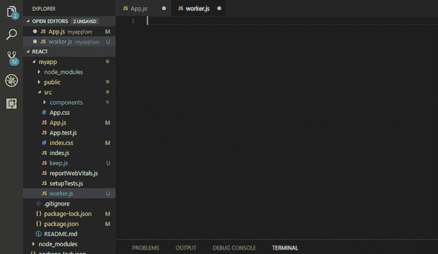

# 如何将 React useReducer 挂钩放入 web workers 

> 原文：<https://blog.logrocket.com/react-usereducer-hooks-web-workers/>

当一个网页加载时，它变得没有反应，直到所有的资源都完全加载。加载资源时，用户可能无法在页面上执行某些功能，如单击、选择或拖动元素。web workers 帮助我们解决了这个问题，使我们的应用程序变得动态，从而加载得更快。

在本教程中，我们将学习如何在 React 应用程序中使用 web workers。我们还将学习如何在带有`useWorkerizedReducer`的 web worker 中使用`useReducer`钩子。我们开始吧！

## 目录

## 什么是网络工作者？

web worker 是在后台运行的 JavaScript 脚本，不会干扰其他脚本的执行。

因为 JavaScript 是单线程语言，所以它不能同时运行几个脚本，这对于运行大型计算脚本来说是一个问题。web workers 帮助在后台加载繁重的计算脚本，而不会影响页面的性能。

## web worker 语法

```
const worker = new Worker(new URL("./worker.js", import.meta.url), {
 type: "module",
});

```

worker 构造函数接受两个参数；第一个是工作者文件名，第二个是工作者类型。工人类型可以是`classic`或`module`。如果没有指定类型，默认类型将是`classic`。

在本教程中，我们将使用`module type`,因为减速器只能在组件内部使用。为了在 web worker 组件中使用导入功能，我们必须将`import.meta.url`添加到`URL constructor`中。我们将在教程的后面演示这一点。

## 什么是`useReducer`钩？

`useReducer`是一个附加的 [React 钩子](https://blog.logrocket.com/react-hooks-cheat-sheet-unlock-solutions-to-common-problems-af4caf699e70/)，用于存储和更新状态。它接受三个参数，`reducer`，初始状态，最后一个参数，初始函数，这是可选的:

```
const [state, dispatch] = useReducer(reducer, initialArg, init);

```

`useReducer`返回一个包含当前状态值的数组，以及一个分派函数，您可以向该函数提供要执行的操作。

`dispatch`函数接受一个指定要执行的动作类型的对象。它本质上将动作类型传递给 reducer 函数，后者当然会更新状态。

## `reducer`功能

`reducer`是一个接受两个参数的函数，当前状态和一个动作对象。它使用接收到的动作来确定状态的变化并返回新的状态。

下面的代码演示了如何使用`reducer`函数来改变状态:

```
function reducer(state, action) {
  switch (action.type) {
    case 'increment':
      return {count: state.count + 1};
    case 'decrement':
      return {count: state.count - 1};

   default:
      throw new Error();
  }
}

```

每当`reducer`函数被动作类型触发时，它返回新的状态作为`reducer`函数内部的变化。

`action`是一种指示减速器如何改变状态的对象。它必须有一个`type`属性。可以在条件语句中使用`action`类型来决定状态如何变化，如上面的代码块所示。

要让 reducer 在 web worker 中运行，我们必须使用`useWorkerizedReducer`。

## `useWorkerizedReducer`

[`useWorkerizedReducer`类似于`useReducer`](https://github.com/surma/use-workerized-reducer) ，除了它允许 reducer 在一个 worker 中执行，允许我们创建一个动态的 React 应用程序。

`useWorkerizedReducer`还允许将长时间运行的计算放在 reducer 中，而不会影响应用程序的响应能力。`useWorkerizedReducer`负责向工人提供`useReducer`的能力。

通过将缩减器的状态复制到主线程，`useWorkerizedReducer`在工作线程和主线程之间架起了一座桥梁。reducer 操纵 worker 的状态对象，唯一的补丁将是`postMessage()`通过 [Immer 来保持主线程的状态副本当前](https://blog.logrocket.com/immer-and-immutable-js-how-do-they-compare/)。

## 构建一个简单的计数器应用程序

为了学习如何将`Reducer`放置在 web worker 中，让我们创建一个简单的`counter`程序，它将在当前状态改变时返回。要创建新程序，请打开命令行并输入以下命令:

```
npx create-react-app my-app
cd my-app
npm start

```

应用程序安装成功后，我们需要安装`useWorkerizedReducer`作为我们程序的依赖项来使用它。要安装`useWorkerizedReducer`，请在终端中运行以下命令:

```
npm i use-workerized-reducer

```

现在我们已经成功安装了`useWorkerizedReducer`，让我们继续创建一个`worker.js`模块文件。

## 正在创建`worker.js`

由于我们在`worker.js`文件中使用了`reducer`，我们将在`src`文件夹中创建`worker.js`文件。要创建`worker.js`文件，点击**创建新文件**，将文件命名为`worker.js`，然后将其保存在`src`文件夹中，如下图所示:



现在我们已经创建了`worker.js`文件，让我们在其中添加下面的`reducer`代码:

```
// worker.js
import { initWorkerizedReducer } from "use-workerized-reducer";

initWorkerizedReducer(
 "counter", // Name of the reducer
 async (state, action) => {
   // Reducers can be async!
   // Manipulate `state` directly. ImmerJS will take
   // care of maintaining referential equality.
   switch (action.type) {
     case "increment":
       state.counter += 1;
       break;
     case "decrement":
       state.counter -= 1;
       break;
     default:
       throw new Error();
   }
 }
);

```

从上面的代码中，我们从`use-workerized-reducer`中导入`initWorkerizedReducer`，这可以从`useWorkerizedReducer`依赖项中获得。

`initWorkerizedReducer()`带两个参数；第一个是`reducer name(counter)`，第二个是`async function`。

## 添加 web worker

现在我们已经准备好了`worker.js`文件，我们需要从`use-workerized-reducer/react`导入`useWorkerizedReducer`，这使我们能够从 worker 文件中调用`reducer`函数:

```
// main.js
import { render, h, Fragment } from "react";
import { useWorkerizedReducer } from "use-workerized-reducer/react";

// Spin up the worker running the reducers.
const worker = new Worker(new URL("./worker.js", import.meta.url), {
 type: "module",
});

function App() {
 // A worker can contain multiple reducers, each with a unique name.
 // `busy` is true if any action is still being processed.
 const [state, dispatch, busy] = useWorkerizedReducer(
   worker,
   "counter", // Reducer name
   { counter: 0 } // Initial state
 );

 return (
   <>
     Count: {state.counter}
     <button disabled={busy} onClick={() => dispatch({ type: "decrement" })}>
       -
     </button>
     <button disabled={busy} onClick={() => dispatch({ type: "increment" })}>
       +
     </button>
   </>
 );
}

export default App;

```

`useWorkerizedReducer`函数接受三个参数并返回一个值。当前状态是第一个参数，动作是第二个参数，初始状态是第三个参数。我们正在处理的数据是状态。一个`dispatch`函数执行一个传递给`reducer`函数的动作。

`Busy`将保持`true`，直到工作者的初始状态`counter`被成功复制到工作者。此后，如果动作仍在处理中，`Busy`返回 true，否则返回 false。

* * *

### 更多来自 LogRocket 的精彩文章:

* * *

`reducer`根据动作类型改变状态。动作类型`increment`、`decrement`和`reset`都是在被调度时更新应用状态的动作类型。

初始状态是`{ counter: 0 }`。当`increment`动作类型被分派时，我们简单地设置 count `{state.count + 1}`来增加状态。

## 运行程序

要启动该应用程序，请在命令行中输入以下命令:

```
npm start

```

## 结论

在本文中，我们简要介绍了 web worker 和 React 中的附加钩子`useReducer`，以及如何在 React 应用程序中构建和添加 web worker 文件。

我们还讨论了`useWorkerizedReducer`，它为 web 工作者带来了`useReducer`的功能。最后，我们介绍了在`useWorkerizedReducer`的帮助下在 web worker 内部使用 reducer。

我希望你喜欢这篇文章！如果你有任何问题，一定要留下评论。编码快乐！

## 使用 LogRocket 消除传统反应错误报告的噪音

[LogRocket](https://lp.logrocket.com/blg/react-signup-issue-free)

是一款 React analytics 解决方案，可保护您免受数百个误报错误警报的影响，只针对少数真正重要的项目。LogRocket 告诉您 React 应用程序中实际影响用户的最具影响力的 bug 和 UX 问题。

[ ](https://lp.logrocket.com/blg/react-signup-general) [  ](https://lp.logrocket.com/blg/react-signup-general) [LogRocket](https://lp.logrocket.com/blg/react-signup-issue-free)

自动聚合客户端错误、反应错误边界、还原状态、缓慢的组件加载时间、JS 异常、前端性能指标和用户交互。然后，LogRocket 使用机器学习来通知您影响大多数用户的最具影响力的问题，并提供您修复它所需的上下文。

关注重要的 React bug—[今天就试试 LogRocket】。](https://lp.logrocket.com/blg/react-signup-issue-free)