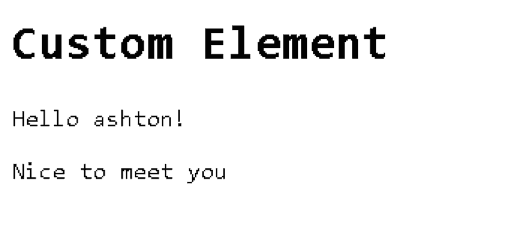
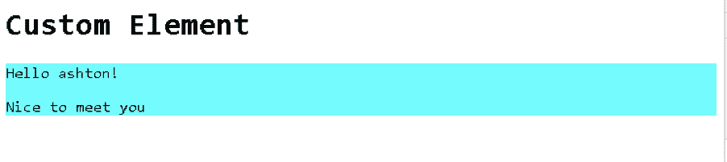
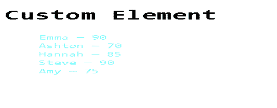
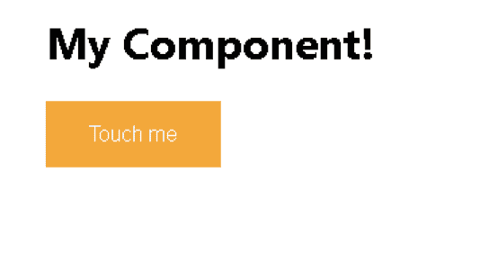
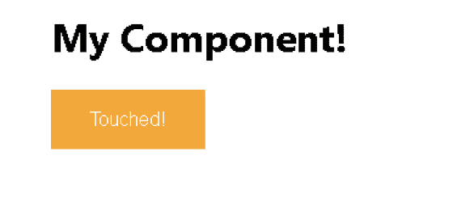
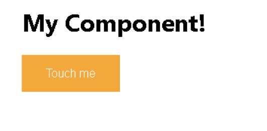
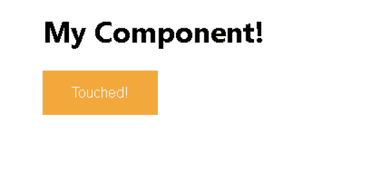

# React 与 web 组件

> 原文：<https://blog.logrocket.com/react-vs-web-components/>

在本文中，我们将讨论 web 组件和 React。在继续之前，这里需要注意的一点是 React 和 web 组件服务于不同的目的。Web 组件允许我们编写可重用的、强封装的定制元素。然而，React 是一个声明性的 JavaScript 库，它解决了 UI 开发中的状态管理问题。今天，我们将讨论组件的类型，React 和 web 组件中提供的样式库，以及它们的可访问性。

## 成分

如前所述，我们可以用 web 组件编写可重用的 UI 元素。但是你可能认为我们也可以使用 React 做同样的事情，例如，我们可以创建一个组件并在项目的其他地方重用它。区别在于，React 组件只能在 React 应用程序中重用。另一方面，web 组件可以在任何地方使用。它可以用于反应，角度，或 Vue 等。，因为它包含在 HTML 规范中并且是本机的。例如，使用 web 组件创建的自定义 header 元素可以跨各种库和框架使用。

既然已经讨论过了，那就让我们来讨论一下它们所提供的组件类型。

## web 组件的类型

web 组件有三种类型。

### 自定义元素

使用定制元素，我们可以创建一个新的定制 HTML 标签。它使用浏览器的 JavaScript API `customElements.define()`方法来做到这一点。自定义元素是一个 JavaScript 类，它扩展了`HTMLElement`。此外，定制元素的名称中需要一个连字符，这样 HTML 解析器才能识别它们。考虑下面的例子:

```
<!DOCTYPE html>
<html>
<head>
<title>Custom Element</title>
</head>
<body>
<div>
<h1>Custom Element</h1>
<test-element></test-element>
</div>

<script type="text/javascript">
class TestElement extends HTMLElement{
constructor() {
  super();
  this.setAttribute('name', 'ashton'); //setting an attribute

}
connectedCallback() {
    this.innerHTML = `<div><p>Hello ${this.getAttribute('name')}!</p><p>Nice to meet you</p></div>`;
  }
}
//register the custom element
customElements.define('test-element', TestElement);
</script>
</body>
</html>

```

#### 输出:



### 阴影 DOM

它允许你创建一个独立的组件，即`document.querySelector()`不会返回在影子 DOM 中定义的节点。此外，shadow DOM 中定义的样式也包含在其中，例如，作用域 CSS。如果您在阴影 DOM 中将 div 的背景颜色更改为蓝色，那么该 div 的背景将仅发生变化，其外部的 div 不会受到影响:

```
<!DOCTYPE html>
<html>
<head>
<title>Custom Element</title>
</head>
<body>
<div>
<h1>Custom Element</h1>
<test-element></test-element>
</div>

<script type="text/javascript">
class TestElement extends HTMLElement{
constructor() {
  super();
  this.setAttribute('name', 'ashton'); //setting an attribute
  const shadowRoot = this.attachShadow({mode: 'open'}); //attaches a shadow DOM tree to <test-element> and returns a reference

}
connectedCallback() {
    this.shadowRoot.innerHTML = `<style>
     div {
     background:cyan;
     }
    </style>
    <div><p>Hello ${this.getAttribute("name")}!</p><p>Nice to meet you</p></div>`;
  }
}
//register the custom element
customElements.define('test-element', TestElement);
</script>
</body>
</html>
```

#### 输出:



### 模板

模板允许我们在加载时使用`<template>`标签声明标记结构。该元素及其内容将不会呈现，直到我们手动获取其引用并将其附加到 DOM。它允许我们添加动态数据。因此，如果我们必须在不同的时间使用一些标记结构，我们可以使用模板，避免重复相同的代码:

```
<!DOCTYPE html>
<html>
<head>
<title>Custom Element</title>
</head>
<body>
<div>
<h1>Custom Element</h1>
<template id="student_template">
<style>
    li {
      color:cyan;
      list-style: none;
    }
  </style>
<li>
    <span class="name"></span> &mdash;
    <span class="score"></span>
</li>
</template>
<test-element></test-element>
<ul id="students"></ul>
</div>

<script type="text/javascript">
class TestElement extends HTMLElement{
constructor() {
  super()
  const shadowRoot = this.attachShadow({ mode: "open" });

}
connectedCallback() {
let students = [
{name: "Emma", score: 90},
{name: "Ashton", score: 70},
{name: "Hannah", score: 85},
{name: "Steve", score: 90},
{name: "Amy", score: 75},
]

    students.forEach(student=>{
    let template = document.getElementById("student_template");
    let templateContent = template.content.cloneNode(true);
    this.shadowRoot.appendChild(templateContent); //append a clone of the template content to the shadow root

    this.shadowRoot.querySelector('.name').innerHTML = student.name //add the name
    this.shadowRoot.querySelector('.score').innerHTML = student.score //add the score

    document.getElementById("students").appendChild(this.shadowRoot) //append the list to the ul students
    })
  }
}
//register the custom element
customElements.define('test-element', TestElement);
</script>
</body>
</html>
```

#### 输出:



## 反应组分

React 组件有两种主要类型。

### 类别组件

类组件只是一个扩展了`React.Component`类的 JS 类。它接受道具，管理组件的状态，并通过 render 函数返回 JSX 代码。Props 包含从父组件传递的数据。组件的数据可以存储在状态对象中。每当状态改变时，组件都会重新呈现。它还包含生命周期方法，这些方法从组件的创建开始，一直运行到组件被销毁。例如，`constructor()`是组件实例被初始化时调用的第一个方法，因此状态在这里被初始化。

让我们看一个例子:

```
import React from 'react';
import './style.css';

class MyComponent extends React.Component {

  constructor(props) {
    super(props);

    this.state = {
        value:"Touch me"
    };
  }
  buttonHandler=()=>{
    if (this.state.value=="Touch me"){
      this.setState({value:'Touched!'})
    }
    else {
      this.setState({value:'Touch me'})
    }
  }
  render() {
    return(
      <div>
          <h1>My Component!</h1>
          <button onClick={this.buttonHandler} className="button">{this.state.value}</button>
      </div>
    );
  }
}
export default MyComponent;
```



按下按钮时:



### 功能组件

简单地说，功能组件是一个返回 JSX 代码的 JavaScript 函数。以前，功能组件纯粹是表示性组件，因为它们不支持状态管理。然而，有了 React 钩子，我们现在也可以拥有状态和生命周期方法。

让我们用一个功能组件来做上面的例子:

```
import React, {useState} from 'react';
import './style.css';

const MyComponent = (props) =>{
    const [value, setValue] = useState("Touch me"); //creating a state using the useState hook

    const buttonHandler=()=>{
    if (value=="Touch me"){
      setValue("Touched!") //set the value to Touched! if it is Touch me, changing state
    }
    else {
      setValue("Touch me") //changing state
    }
    }

    return (
      <div>
          <h1>My Component!</h1>
          <button onClick={buttonHandler} className="button">{value}</button>
      </div>
    )

}
export default MyComponent;
```



When the button is pressed:


## 式样

说到构建组件，UI 是其中很大的一部分。你总是想创建漂亮的、吸引人的、用户友好的组件。然而，从头开始自己设计可能会有点乏味和耗时。此外，在 React 中，这变得更加困难，因为它不像 web 组件那样具有作用域样式。所以，你总是在寻找可以为你做这些工作的外部模块。

React 有一个庞大的生态系统。因此，与 web 组件相比，它有许多样式库和框架。

### 反应

#### 材料-用户界面

它是 React 中最流行的 UI 框架之一。它由谷歌创建和维护。它提供了几个 UI 组件、样式、主题、布局和图标等。它是非常通用的，并且正在投入持续的工作和努力来不断改进它。它的最新稳定版本是截至 2020 年 12 月的 v4.11.1。

#### 反应引导

React Bootstrap 是另一个流行的 React UI 框架，它取代了 Bootstrap JavaScript，并以 Bootstrap 为核心。它提供了各种组件、主题支持、布局等。它还有一个庞大的、不断增长的团队，其最新版本是支持 Bootstrap 4.5 的 v1.4.0。

#### 语义 UI 反应

它是语义 UI 的 React 集成。它提供了许多很酷的自定义元素，例如，按钮、容器、加载器和输入等。它拥有与语义 UI 相同的样式系统和主题。所以，如果你知道它，你不需要学习任何新的东西。此外，它还有允许我们访问底层标记的子组件，正因为如此，我们可以灵活地定制元素。

### Web 组件

#### 材料网组件

这是 Material-UI 框架的 web 组件版本。然而，这仍然是一项正在进行的工作。它的最新版本是 v0.20.0，预计在 1.0 发布之前会有重大变化。

#### web 组件中的引导

有一些模块允许您在 web 组件中使用 Bootstrap。然而，有些仍然不稳定或正在开发中，有些则不像 React-Bootstrap 那样提供那么多功能。例如，bootstrap-webcomponents 是对 web 组件 bootstrap 的重写，但它仍处于开发模式。Aybolit Bootstrap 提供了一组受 Bootstrap 启发的 web 组件，但它没有广泛的组件和功能。

#### Elix

它是一个开放的现成 web 组件集合，用于常见的 UI 模式，如传送带、按钮和菜单等。它还让您可以灵活地定制它们，甚至基于现有的 Elix 组件创建新元素。

## 可访问性(a11y)

当我们谈论网站的可访问性时，我们的意思是它可以很容易地被每个人使用。如果我们的网站是用 React 或 web 组件创建的，那么这些组件需要是可访问的。那么，问题来了，他们是吗？

React 允许我们创建完全可访问的网站。这通常可以使用标准的 HTML 技术来完成。例如，我们可以像在普通 HTML 中一样在 JSX 使用`aria-*`属性，也就是说，它们不需要区分大小写。在 React 中，我们额外添加了一个 div 来包装所有元素，但是这样会破坏 HTML 语义，不是吗？的确如此，但是我们可以通过使用`<React.Fragment>`标签轻松解决这个问题。

* * *

### 更多来自 LogRocket 的精彩文章:

* * *

可访问性的另一个方面是应用程序应该只能通过键盘使用。现在，React 在运行时不断地改变 HTML DOM，正因为如此，键盘焦点可能会丢失。然而，我们可以在组件的各种生命周期方法中以编程方式设置焦点。此外，每当屏幕(组件)改变时，我们可以使用`react-document-title`改变标题。

Web 组件也是可访问的，因为自定义元素可以扩展任何本机 HTML 元素，因此，它继承了它的所有特征，包括可访问性功能。此外，还有一种误解，认为在影子 DOM 中创建的元素是不可访问的。然而，事实并非如此，屏幕阅读器可以很容易地访问内容。

本文到此为止。下表总结了这些差异。

| **反应** | **网页组件** |
| --- | --- |
| 它是一个 JavaScript 库，用于为单页应用程序构建 UI 界面。 | 它是一组不同的技术，允许我们创建可重用和隔离的元素。 |
| 组件的类型包括功能性和类。 | 组件类型包括自定义元素、阴影 DOM 和模板。 |
| 基于状态变化的组件重渲染。 | 没有国家管理。 |
| 组件仅在 React 中可重用。 | 可互操作。 |
| 没有地方风格。 | CSS 可以使用影子 DOM 来限定范围。 |
| React 提供了单向数据流模式。 | 你必须自己实现数据绑定。 |
| 它的生态系统极其庞大和强大。它有一个庞大的社区和不断增长的工具和库。 | 生态系统没有 React 的生态系统庞大。 |

## [LogRocket](https://lp.logrocket.com/blg/react-signup-general) :全面了解您的生产 React 应用

调试 React 应用程序可能很困难，尤其是当用户遇到难以重现的问题时。如果您对监视和跟踪 Redux 状态、自动显示 JavaScript 错误以及跟踪缓慢的网络请求和组件加载时间感兴趣，

[try LogRocket](https://lp.logrocket.com/blg/react-signup-general)

.

[ ](https://lp.logrocket.com/blg/react-signup-general) [](https://lp.logrocket.com/blg/react-signup-general) 

LogRocket 结合了会话回放、产品分析和错误跟踪，使软件团队能够创建理想的 web 和移动产品体验。这对你来说意味着什么？

LogRocket 不是猜测错误发生的原因，也不是要求用户提供截图和日志转储，而是让您回放问题，就像它们发生在您自己的浏览器中一样，以快速了解哪里出错了。

不再有嘈杂的警报。智能错误跟踪允许您对问题进行分类，然后从中学习。获得有影响的用户问题的通知，而不是误报。警报越少，有用的信号越多。

LogRocket Redux 中间件包为您的用户会话增加了一层额外的可见性。LogRocket 记录 Redux 存储中的所有操作和状态。

现代化您调试 React 应用的方式— [开始免费监控](https://lp.logrocket.com/blg/react-signup-general)。