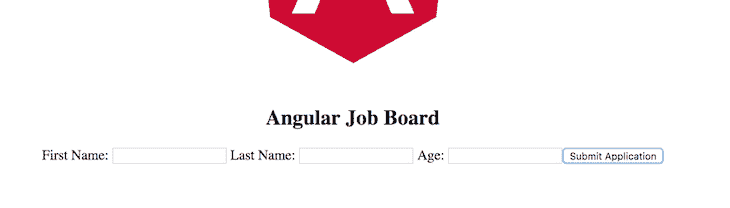
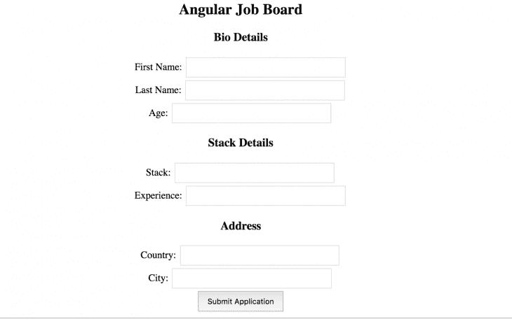

# Angular - LogRocket 博客中的表单组和表单控件

> 原文：<https://blog.logrocket.com/reactive-form-controls-form-groups-angular/>

使用 JavaScript 框架时，最好避免使用集群模板，因为表单逻辑位于组件类中。[Angular](https://angular.io/guide/reactive-forms)中的反应式表单允许你创建干净的表单，而不需要使用太多的指令。它们还减少了端到端测试的需要，因为验证表单非常容易。

简而言之，Angular 中的表单控件给了开发人员所有的控制权，没有任何东西是隐式的——关于输入和控件的每一个选择都必须是有意的，当然也是显式的。

在本教程中，我们将向您展示如何按表单组划分表单控件，以创建群集，从而提供一个平台来轻松地按组访问模板元素。我们将详细介绍以下内容:

为了说明 Angular 中表单组的概念，我们将介绍构建反应式表单的过程，以便您可以完全掌握如何使用表单组来设置它。

接下来，在 [GitHub](https://github.com/viclotana/ng-reactive) 上下载 starter 项目，并在 VS 代码中打开它。如果你还没有，你会想更新到最新版本， [Angular 11](https://angular.io/guide/updating-to-version-11) 。

## Angular 中的形状控制是什么？

在 [Angular](https://angular.io/) 中，表单控件是可以保存任何表单元素的数据值和验证信息的类。反应式表单中的每个表单输入都应该被表单控件绑定。这些是组成反应形式的基本单位。

## 什么是 Angular 中的形群？

表单组包装表单控件的集合。就像控件使您可以访问元素的状态一样，组也提供了相同的访问权限，但访问的是包装控件的状态。初始化时，表单组中的每个表单控件都由名称标识。

## `FormControl`和`FormGroup`在角度

是 Angular 中的一个类，用于跟踪单个表单控件的值和验证状态。Angular 表单中的三个基本构件之一——与`FormGroup`和`FormArray` — `FormControl`一起——扩展了`AbstractControl`类，使其能够访问值、验证状态、用户交互和事件。

`FormGroup`与`FormControl`一起使用，用于跟踪值并验证表单控制的状态。实际上，`FormGroup`将每个子控件`FormControl`的值聚合到一个对象中，使用每个控件名作为键。它通过减少其子级的状态值来计算其状态，这样，如果一个组中的一个控件无效，则整个组都无效。

## 在 Angular 中注册表单组

第一步是告诉 Angular，您希望通过将表单组导入到适当的组件中来使用它。

要查看这是如何工作的，导航到`employee.component.ts`文件并粘贴到下面的代码块中:

```
import { Component, OnInit } from '@angular/core';
import { FormControl, FormGroup } from '@angular/forms'
@Component({
  selector: 'app-employee',
  templateUrl: './employee.component.html',
  styleUrls: ['./employee.component.css']
})
export class EmployeeComponent implements OnInit {
  bioSection = new FormGroup({
    firstName: new FormControl(''),
    lastName: new FormControl(''),
    age: new FormControl('')
  });
constructor() { }
ngOnInit() {
  }
}
```

在这里，表单组被导入并初始化，以便将构成表单 bio 部分的一些表单控件组合在一起。为了反映这个组，您必须将模型与带有表单组名称的视图相关联，如下所示:

```
// copy inside the employee.component.html file
<form [formGroup]="bioSection" (ngSubmit)="callingFunction()">

  <label>
    First Name:
    <input type="text" formControlName="firstName">
  </label>
<label>
    Last Name:
    <input type="text" formControlName="lastName">
  </label>
<label>
    Age:
    <input type="text" formControlName="age">
  </label>
<button type="submit">Submit Application</button>
</form>
```

就像表单控件一样，表单组名用来标识视图中的表单组，提交时会触发`callingFunction`。

您的`app.component.html`文件应该如下所示:

```
<div style="text-align:center">
  <h2>Angular Job Board </h2>
  <app-employee></app-employee>
</div>
```

现在使用以下命令运行开发中的应用程序:

```
ng serve
```

应该是这样的:


```
成角度地嵌套形成组
Angular reactive forms API 可以将一个表单组嵌套在另一个表单组中。
将下面的代码块复制到`employee.component.ts`文件中:

```
import { Component, OnInit } from '@angular/core';
import { FormControl, FormGroup } from '@angular/forms'
@Component({
  selector: 'app-employee',
  templateUrl: './employee.component.html',
  styleUrls: ['./employee.component.css']
})
export class EmployeeComponent implements OnInit {
  bioSection = new FormGroup({
    firstName: new FormControl(''),
    lastName: new FormControl(''),
    age: new FormControl(''),
    stackDetails: new FormGroup({
      stack: new FormControl(''),
      experience: new FormControl('')
    }),
    address: new FormGroup({
        country: new FormControl(''),
        city: new FormControl('')
    })
  });
constructor() { }
ngOnInit() {
  }
  callingFunction() {
    console.log(this.bioSection.value);
   }
}
```

主要的表单组包装器是 bio 部分，其中嵌套了堆栈细节组和地址组。如您所见，嵌套表单组不是由赋值语句定义的，而是用冒号定义的，就像表单控件一样。
在视图中反映出来会是这样的:

```
// copy inside the employee.component.html file
<form [formGroup]="bioSection" (ngSubmit)="callingFunction()">
    <h3>Bio Details
</h3>

  <label>
    First Name:
    <input type="text" formControlName="firstName">
  </label> <br>
<label>
    Last Name:
    <input type="text" formControlName="lastName">
  </label> <br>
<label>
    Age:
    <input type="text" formControlName="age">
  </label>
<div formGroupName="stackDetails">
    <h3>Stack Details</h3>

    <label>
      Stack:
      <input type="text" formControlName="stack">
    </label> <br>

    <label>
      Experience:
      <input type="text" formControlName="experience">
    </label>
  </div>
<div formGroupName="address">
    <h3>Address</h3>

    <label>
      Country:
      <input type="text" formControlName="country">
    </label> <br>

    <label>
      City:
      <input type="text" formControlName="city">
    </label>
  </div>
<button type="submit">Submit Application</button>
</form>
```

模型和视图中的每个名称都匹配是至关重要的，所以要确保不要拼错表单控件的名称。当您保存并运行应用程序时，如果您确实遇到了任何错误，请阅读错误消息并纠正您一定使用的拼写错误。
您可以使用下面的样式说明来设置组件的样式:

```
input[type=text] {
    width: 30%;
    padding: 8px 14px;
    margin: 2px;
    box-sizing: border-box;
  }
  button {
      font-size: 12px;
      margin: 2px;
      padding: 8px 14px;
  }
```

如果您运行该应用程序，您应该会在浏览器中看到类似这样的内容:
 

When you use the form and submit, you will see your input results returned in the browser console. The complete code used in this tutorial is available on GitHub.
如何给一个`FormGroup`加上一个`FormControl`
要在`FormGroup` 中[添加、更新或删除控件，使用以下命令:](https://www.concretepage.com/angular/angular-formgroup-addcontrol-removecontrol)

*   `addControl()`添加控制并更新其值和有效性
*   `removeControl()`删除控件
*   `setControl()`替换现有控件
*   `contains()`检查与给定名称相关联的已启用控件
*   注册一个控件，但与其他方法不同的是，不更新它的值和有效性

如何设置`FormGroup`值
在 Angular 中，您可以[设置单个表单组](https://stackoverflow.com/questions/38655613/angular2-set-value-for-formgroup)的值，或者一次设置所有`FormGroup`的值。
使用`patchValue`仅设置一些值:

```
this.myFormGroup.patchValue({
  formControlName1: myValue1, 
  // formControlName2: myValue2
});
```

您不需要在此提供所有值；未设置值的字段将不受影响。
要同时设置所有的`FormGroup`值，使用`setValue`:

```
this.myFormGroup.setValue({
  formControlName1: myValue1, 
  formControlName2: myValue2
});
```

什么是`FormBuilder`有角？
设置表单控件可能会很繁琐，尤其是在处理很长的表单时。Angular 的 [`FormBuilder`](https://angular.io/api/forms/FormBuilder#description) 帮助您简化构建高级表单的过程，同时避免重复。
简而言之，`FormBuilder`提供了语法上的好处，减轻了创建`FormControl`、`FormGroup`或`FormArray`实例的负担，并减少了构建复杂表单所需的样板文件的数量。
关于如何构建复杂形状的更深入的探究和例子，请阅读我们全面的[角形构建器教程](https://blog.logrocket.com/form-builders-angular-8-validate-reactive-forms/)。
结论
在本教程中，我们涵盖了 Angular 中你需要知道的关于表单控件的一切，包括如何使用`FormControl`，如何用`FormGroup`对表单控件进行分组，以及为什么一次捕获控件的集合实例很重要。

## 像用户一样体验 Angular 应用程序

调试 Angular 应用程序可能很困难，尤其是当用户遇到难以重现的问题时。如果您对监视和跟踪生产中所有用户的角度状态和动作感兴趣，

[try LogRocket](https://lp.logrocket.com/blg/angular-signup)

. 

[](https://lp.logrocket.com/blg/angular-signup)[https://logrocket.com/signup/](https://lp.logrocket.com/blg/angular-signup)

LogRocket 就像是网络和移动应用程序的 DVR，记录你网站上发生的一切，包括网络请求、JavaScript 错误等等。您可以汇总并报告问题发生时应用程序的状态，而不是猜测问题发生的原因。

LogRocket NgRx 插件将角度状态和动作记录到 LogRocket 控制台，为您提供导致错误的环境，以及出现问题时应用程序的状态。

现代化调试 Angular 应用的方式- [开始免费监控](https://lp.logrocket.com/blg/angular-signup)。

```