# 如何用 Flask 或 Django 在 Python 中接收 webhooks

> 原文：<https://blog.logrocket.com/receive-webhooks-python-flask-or-django/>

您可能正在阅读这篇文章，因为您偶然发现了来自不同来源的链接，并点击打开了它。这需要你和你的浏览器之间的一些互动。就像用户与应用程序交互并获得反馈一样，web 应用程序也相互通信并共享信息。

想象一下，你终于在你最喜欢的电子商务网站上支付了购物车中的商品。如果支付是通过第三方支付平台，如贝宝，必须有一些机制来提醒电子商务网站你刚刚使用贝宝支付，对不对？

这就是 webhooks 的用武之地。

在本教程中，我们将演示如何在 Flask 和 Django 中接收 webhooks。

## 什么是 webhooks？

Webhooks 是事件发生时触发的超文本传输协议(HTTP)端点。它们允许基于特定事件将数据从一个应用程序发送到另一个应用程序。

Webhooks 通常用于响应特定的请求。例如，webhooks 通常用于:

*   基于特定事件向用户发送通知
*   向用户发送一次性密码
*   确认采购订单

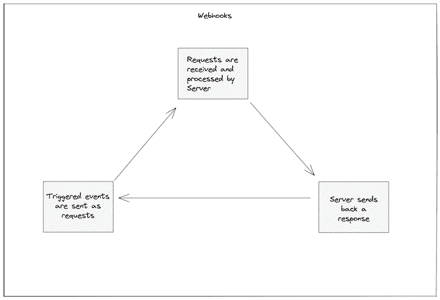

## 设置 Flask 和 Django

在这一节中，我们将介绍如何为 Flask 和 Django 设置开发环境。

但是首先，要开始使用 Python 进行开发，您需要安装以下要求:

一旦安装了 Python 和 pip，就可以继续安装 Flask 和 Django 了。

### 安装烧瓶

[Flask](http://flask.pocoo.org/) 是用 Python 开发的 web 微框架。 [Flask 很容易学习和使用](https://blog.logrocket.com/creating-python-rest-apis-flask-connexion-sqlalchemy/)，不需要特殊的工具或库。

Flask 框架轻量级且灵活，但高度结构化，这使得它成为许多 Python 开发人员的首选。

要安装烧瓶:

```
pip install flask

```

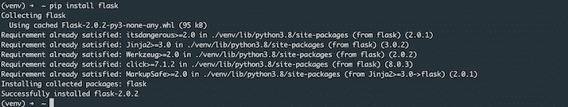

如果你看到类似上面截图的东西，说明你已经成功安装了 Flask。

### 安装 Django

Django 是一个基于 Python 的免费开源 web 框架，遵循模型-模板-视图架构模式。Django 是一个高级 Python web 框架，使您能够[高效地开发安全且可维护的网站](https://blog.logrocket.com/tag/django/)。

```
pip install django

```

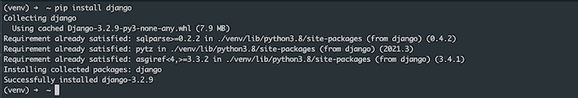

如果您得到类似上面的反馈，那么您已经成功安装了 Django。

## 在 Flask 中创建 webhook

Flask 是一个极简的 web 框架。因此，我们将为 webhook 创建一个单独的文件。

我们将在 Flask 中创建一个路由，允许我们在一个`/webhook`路径上接收数据。

Flask 有一个内置的`.route()`装饰器，它将一个函数绑定到一个 URL。该函数从 POST 请求中接收 JSON 格式的数据，并在终端上显示这些数据。

```
# app.py

from flask import Flask, request

app = Flask(__name__)

@app.route('/webhook', methods=['POST'])
def webhook():
    if request.method == 'POST':
        print("Data received from Webhook is: ", request.json)
        return "Webhook received!"

app.run(host='0.0.0.0', port=8000)

```

上面的代码片段代表了我们在 Flask 中的 webhook 应用程序。

将文件另存为`app.py`，并在终端中运行以下命令来启动 Flask 服务器:

```
python app.py

```

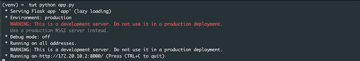

我们可以使用 POST 方法使用 [Postman](https://www.postman.com/) 向`/webhook`路由发送一些样本 JSON 数据。

确保您的地址与 Flask 服务器返回的地址相同:

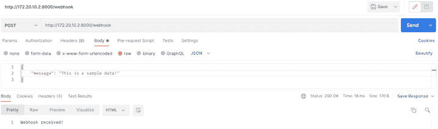

您还可以咨询运行在您终端上的 Flask 服务器，以查看正在运行的 webhook 应用程序的行为:

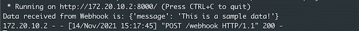

您可以对传入的数据做更多的事情，例如处理它或将它保存到数据库中。

## 在 Django 创建一个 webhook

要开始使用 Django，您需要对项目进行初始设置。这是为了自动生成一些代码，作为 Django 实例的设置集合，包括数据库配置、特定于 Django 的选项和特定于应用程序的设置。

运行以下命令为 webhook 应用程序创建一个项目:

```
django-admin startproject webhook_project

```

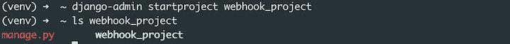

一旦完成，Django 就会创建一个包含一些文件的父目录。您可以运行`ls`或`tree`来查看目录的[内容:](https://docs.djangoproject.com/en/3.2/intro/tutorial01/)

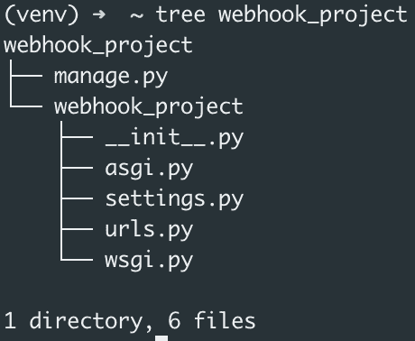

接下来，我们需要创建一个应用程序。

> 用 Django 编写的每个应用程序都由一个遵循特定约定的 Python 包组成。Django 附带了一个实用程序，可以自动生成应用程序的基本目录结构，因此您可以专注于编写代码，而不是创建目录。

要在项目目录中创建应用程序，请运行以下命令:

```
python manage.py startapp webhook

```

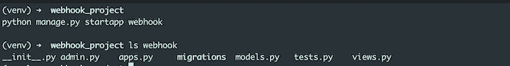

您可以看到 Django 自动生成了一些非常重要的文件供您使用。对于本教程，我们将主要关注编辑`views.py`文件。

为了使我们新创建的应用程序可以被项目访问，我们需要将它添加到`webhook_project/settings.py`文件中的`INSTALLED_APPS`列表中。

```
# webhook_project/settings.py
# ...

INSTALLED_APPS = [
    'django.contrib.admin',
    'django.contrib.auth',
    'django.contrib.contenttypes',
    'django.contrib.sessions',
    'django.contrib.messages',
    'django.contrib.staticfiles',
    'webhook' # <- Add this line
]

```

因为 Django 使用模型-视图-控制器(MVC)模式，所以我们只创建一个视图。

将以下代码行添加到`webhook/views.py`文件中:

```
# webhook/views.py
# ...
from django.http import HttpResponse
from django.views.decorators.csrf import csrf_exempt

@csrf_exempt
def webhook(request):
    if request.method == 'POST':
        print("Data received from Webhook is: ", request.body)
        return HttpResponse("Webhook received!")

```

装饰者将视图标记为不受跨站点请求伪造(CSRF)中间件的保护。

接下来，修改项目的`urls.py`文件，导入刚刚创建的视图，并将其附加到 urlpatterns。

```
# webhook_project/urls.py
# ...

from webhook.views import webhook

urlpatterns = [
    path('admin/', admin.site.urls),
    path('webhook', webhook),
]

```

我们传递两个参数给`path()` *方法。第一个是路线，第二个是我们之前创建的导入视图功能。*

 *您可以使用以下命令运行 Django 服务器:

```
 python manage.py runserver

```

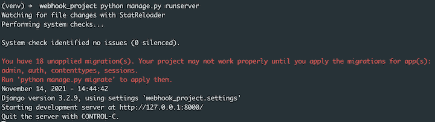

现在您可以使用[邮递员](https://www.postman.com/)用`POST`方法发送一些样本 JSON 数据到`/webhook`路径。

确保您的地址与 Django 服务器返回的地址相同。

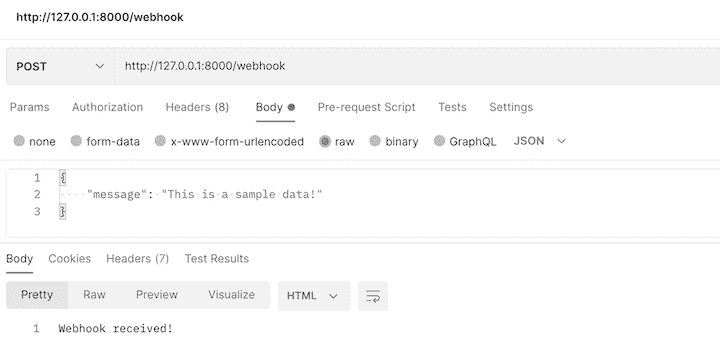

同样，您也可以从运行在您终端上的 Django 服务器确认，以查看您运行的 webhook 应用程序的行为。

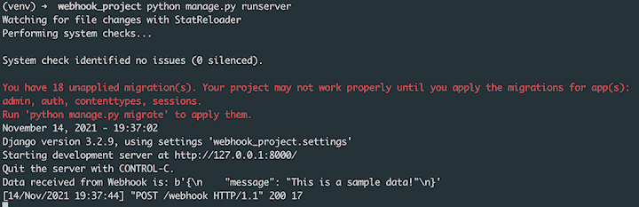

## 结论

理解 webhooks 如何工作对于构建可伸缩的 web 应用程序至关重要。您经常需要与其他系统和第三方工具集成，能够在 web 系统之间建立有效的通信可以节省您长期的大量精力。

在本教程中，我们向您介绍了 webhooks 的概念，并演示了如何使用 Flask 和 Django Web 框架在 Python 中创建 webhook。*