# 用 Bref PHP 和 SendGrid - LogRocket 博客接收电子邮件

> 原文：<https://blog.logrocket.com/receiving-emails-with-bref-php-and-sendgrid/>

Bref 是一个 composer 包，使得在 T2 的 AWS Lambda T3 上运行无服务器的 PHP 应用程序变得容易。它通过提供运行 PHP 应用程序所需的[层](https://docs.aws.amazon.com/lambda/latest/dg/configuration-layers.html)来实现这一点，因为 Lambda 本身并不支持这些层。

在本教程中，我们将构建和部署一个无服务器的 PHP 应用程序，它使用 [SendGrid Inbound Parse](https://sendgrid.com/docs/for-developers/parsing-email/inbound-email/) 以编程方式处理传入的电子邮件。

## 先决条件

要跟进，您需要:

*   PHP >= 7.2(使用最新版本的 Bref)
*   [作曲](https://get-composer.org)， [npm](https://www.npmjs.com/) ，安装[无服务器 CLI](https://www.serverless.com/framework/docs/getting-started/)
*   [为您的域/子域配置的 SendGrid 入站解析](https://sendgrid.com/docs/for-developers/parsing-email/setting-up-the-inbound-parse-webhook/)(以便 SendGrid 可以处理该域的所有传入电子邮件)
*   安装了 Ngrok (在本地开发时公开您的 Bref 应用程序)

## 安装 Bref 和应用程序依赖项

首先，为您的应用程序创建一个文件夹(我将我的命名为`bref-email-watch`)，并使用下面的命令进入目录:

```
$ mkdir bref-email-watch && cd bref-email-watch
```

安装包含 bref CLI、`phpdotenv`的应用程序依赖项，使我们能够从`.env`文件加载环境变量，以及`nexylan/slack`与 Slack 的 API 交互:

```
$ composer require bref/bref vlucas/phpdotenv nexylan/slack php-http/discovery
```

安装完依赖项后，通过在项目目录中运行`./vendor/bin/bref`来初始化 Bref，并从交互菜单中选择 HTTP 选项。

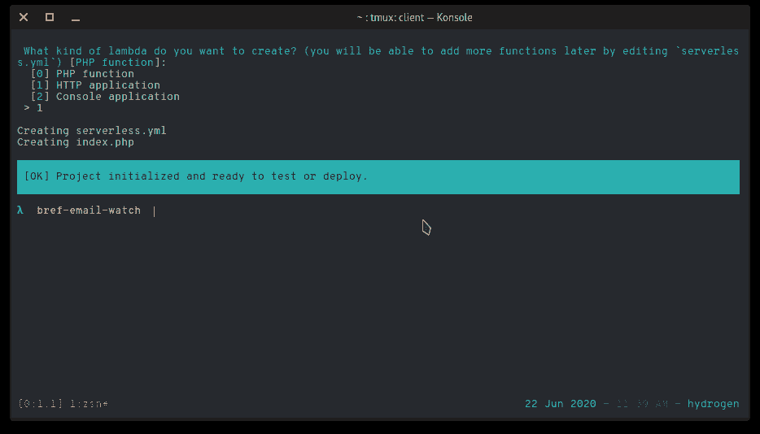

Output of “bref init” command

该命令将创建一个`serverless.yml`文件，作为无服务器框架如何部署您的应用程序的清单，以及一个`index.php`文件，作为应用程序的入口点。

接下来，在项目文件夹中创建一个`.env`文件，并添加 Slack hook URL:

```
SLACK_HOOK_URL="HERE_LIVES_YOUR_SLACK_HOOK_URL"
```

## 解析来自 SendGrid 的传入电子邮件

该应用程序的工作方式是，每次在配置的域上有新邮件时，从 SendGrid 接收 JSON 有效负载(以 HTTP `post`请求的形式)。我们将修改生成的 index.php 文件来解析这些有效负载，提取发送方和接收方(使用 regex 和 PHP 的`preg_match()`)，并向包含提取数据的相关通道发送 Slack 消息。

打开`index.php`文件，用下面的代码块替换其内容:

```
try {
    if (strtoupper($_SERVER['REQUEST_METHOD'] != 'POST')) {
        throw new Exception("Received non-post request on webhook handler");
    }

    if (json_last_error() != JSON_ERROR_NONE) {
        $em = "Error while parsing payload: ".json_last_error_msg();
        throw new Exception($em);
    }

    $from = $_POST['from'];
    $to = $_POST['to'];

    preg_match("#<(.*?)>#", $from, $sender);
    preg_match("#<(.*?)>#", $to, $recipient);
    $senderAddr = $sender[1];
    $recipientAddr = $recipient[1];

    $message = "*You've got mail!*\n";
    $message .= "*To:* ".$recipientAddr."\n";
    $message .= "*From:* ".$senderAddr;

    notifyOnSlack($message, true);

    // send OK back to SendGrid so they stop bothering our webhook
    header("Content-type: application/json; charset=utf-8");
    echo json_encode(["message" => "OK"]);
    exit(0);
} catch (Exception $e) {
    notifyOnSlack($e->getMessage());
    header("Content-type: application/json; charset=utf-8");
    http_response_code(400);
    echo json_encode(["message" => $e->getMessage()]);
    exit(0);
}
```

## 发送新电子邮件的延迟通知

在前面的代码块中，我们引用了一个还不存在的`notifyOnSlack`函数。这个函数负责将收到的`$message`参数发送给 Slack。要实现它，通过将以下代码添加到`index.php`文件的顶部(就在 try 块之前)，将在`.env`文件中声明的变量加载到您的应用程序中:

```
require_once './vendor/autoload.php';
$dotenv = Dotenv\Dotenv::createImmutable(__DIR__);
$dotenv->load();
```

接下来，连接函数实现，如下所示:

```
function notifyOnSlack($message, $markdown = false)
{
    $slackHookUrl = $_ENV["SLACK_HOOK_URL"];
    $options = [
        "channel" => "#general",
        "allow_markdown" => $markdown,
        "username" => "bref-email-watch",
    ];
    $client = new Nexy\Slack\Client(
        \Http\Discovery\Psr18ClientDiscovery::find(),
        \Http\Discovery\Psr17FactoryDiscovery::findRequestFactory(),
        \Http\Discovery\Psr17FactoryDiscovery::findStreamFactory(),
        $slackHookUrl,
        $options
    );
    $client->send($message);
}
```

该函数从。env 文件，然后设置选项，包括消息要发送到的通道，然后传递给 Slack 客户机。我们还通过传入 HTTPlug 发现服务来实例化客户端，这允许它找到并使用任何符合 PSR 标准的 HTTP 客户端。

## 本地测试无服务器功能

现在我们的应用程序已经设置好了，在端口 3000 上启动内置的 PHP 服务器，并在同一个端口上打开一个`ngrok`隧道:

```
$ php -S localhost:3000
$ ngrok http 3000
```

`ngrok`命令生成*转发 URL，*如下 *:*

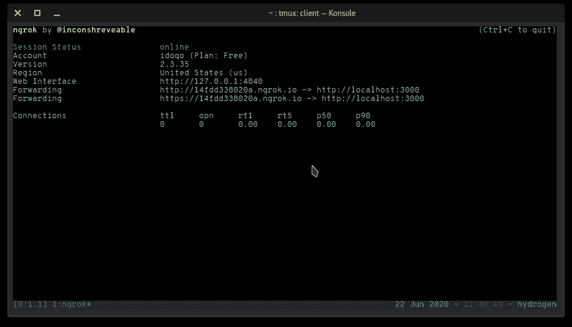

复制 URL 并访问您的 [SendGrid 的入站解析设置页面](https://app.sendgrid.com/settings/parse)。现在，点击*添加主机& URL* 按钮，将复制的 URL 粘贴到*目的地 URL* 字段中。

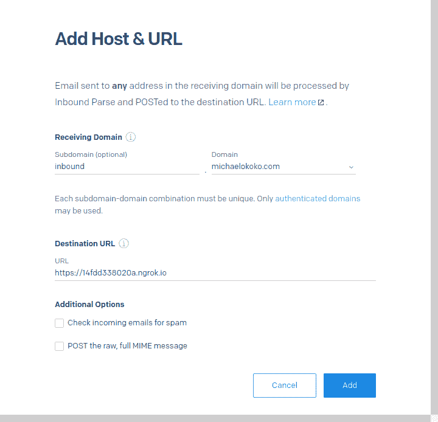

你可能希望[建立一个合适的子域](https://sendgrid.com/docs/ui/account-and-settings/how-to-set-up-domain-authentication/#setting-up-domain-authentication)，因为 SendGrid 会通知你的 webhook 每封到达该域名的*电子邮件(不考虑用户名)。*

接下来，向您指定的域中的电子邮件地址发送一封电子邮件，通知应该显示在 Slack 上，如下所示:

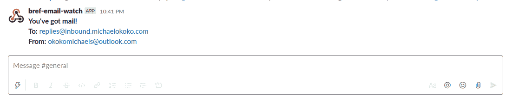

sample slack notification

## 配置 AWS 凭据

### 设置 IAM 角色

为了成功部署我们的应用程序，Bref 和无服务器 CLI 需要访问以下 AWS 资源:

*   希腊字母的第 11 个
*   InternationalAssociationofMachinists 国际机械师协会
*   APIGateway
*   S3
*   云的形成
*   CloudWatch 日志

如果您有一个具有这些权限的 IAM 用户，您可以继续使用他们的 AWS 访问密钥和密码，否则:

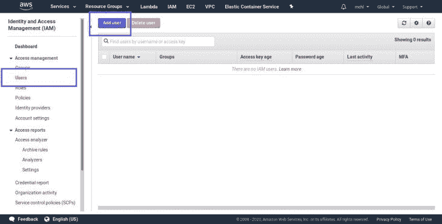

*   在新用户页面上，指定一个用户名以帮助您记住用户的用途，例如 bref-sendgrid-inbound，然后*启用编程访问*并点击*下一步*进入权限页面:

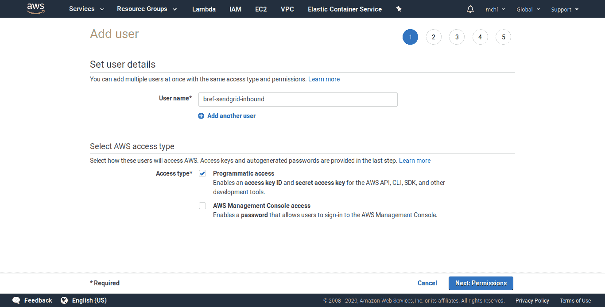

选择*直接附加现有策略*选项卡，点击*创建策略*按钮。这将打开一个新的浏览器选项卡，让您设置新的权限策略。

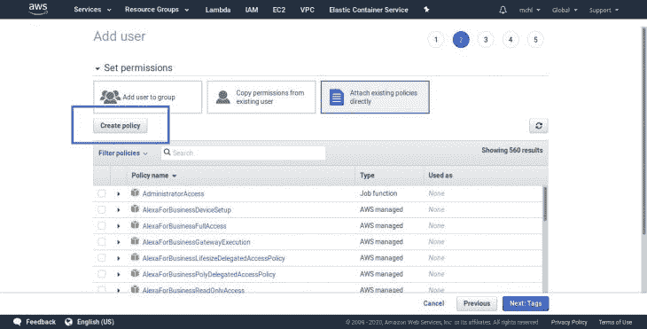

在*创建策略*页面上选择 *JSON* 选项卡，并粘贴下面的代码块:

```
{
        "Version": "2012-10-17",
        "Statement": [
            {
                "Sid": "VisualEditor0",
                "Effect": "Allow",
                "Action": [
                    "iam:*",
                    "s3:*",
                    "apigateway:*",
                    "lambda:*",
                    "cloudformation:*",
                    "logs:*"
                ],
                "Resource": "*"
            }
        ]
}
```

为策略指定一个描述性名称，检查它，并完成策略创建过程。

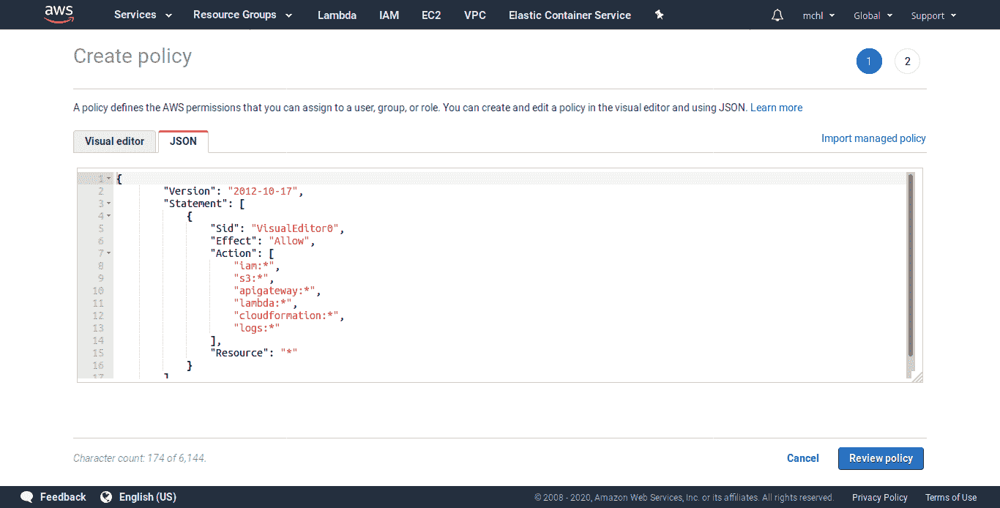

*   返回到*添加用户*页面，通过从列表中选择它来附加新策略。请注意，您可能需要刷新列表才能使您的更改生效。

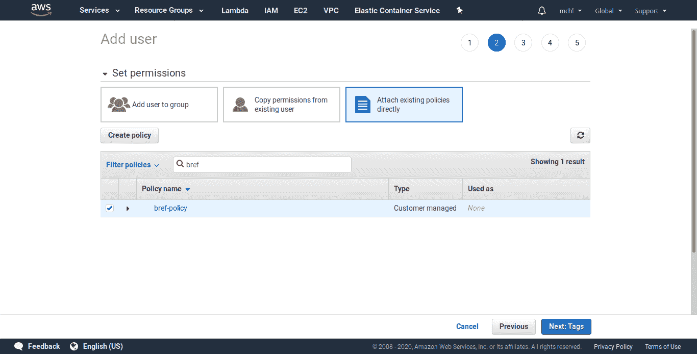

点击页面底部的*下一个*按钮，完成 IAM 用户的创建。查看用户的访问密钥 ID 以及密钥，并将其复制到临时位置。

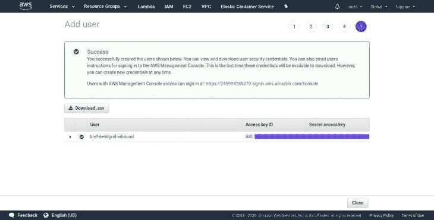

## 使用 AWS 凭据

回到您的终端，使用`serverless config`命令设置复制的凭证:

```
$ serverless config credentials --provider aws --key  AWS_ACCESS_KEY_ID  --secret AWS_SECRET --profile bref-sendgrid-inbound
```

以上命令将在保存您的 AWS 凭证的文件中添加一个新条目。记得更新您的`serverless.yml`文件中的`provider`部分，以匹配上面指定的配置文件以及您的 IAM 用户的区域。下面是修改后的`serverless.yml`配置的例子:

```
service: app

provider:
    name: aws
    region: us-west-2
    runtime: provided
    # "profile" should match the profile specified while configuring the serverless CLI
    profile: bref-sendgrid-inbound

plugins:
    - ./vendor/bref/bref

functions:
    api:
        handler: index.php
        description: ''
        timeout: 28 # in seconds (API Gateway has a timeout of 29 seconds)
        layers:
            - ${bref:layer.php-73-fpm}
        events:
            -   http: 'ANY /'
            -   http: 'ANY /{proxy+}'

# Exclude files from deployment
package:
    exclude:
        - 'node_modules/**'
        - 'tests/**'
```

部署到 Lambda

## 我们现在可以通过从项目目录运行下面的命令来部署我们的应用程序。

该命令在完成部署后会生成一个应用程序 URL，例如`[https://XXXXXXX.execute-api.us-west-2.amazonaws.com/dev](https://XXXXXXX.execute-api.us-west-2.amazonaws.com/dev)`。然后，您可以在您的*入站解析*设置页面上更新*目的地 URL* ，以匹配这个生成的 URL。

```
$ serverless deploy
```

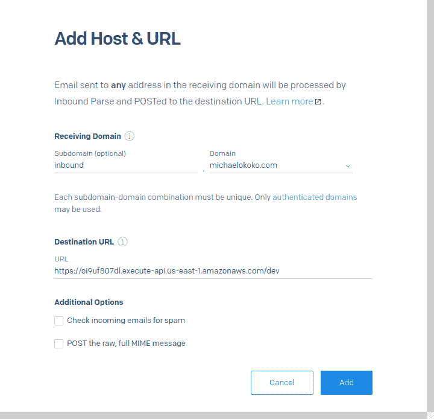

通过向`[[email protected]](/cdn-cgi/l/email-protection)_DOMAIN.COM`发送一封电子邮件来再次测试应用程序，您应该会得到一个类似于下面的 Slack 消息:


结论

## 处理电子邮件可能很有趣，虽然重点通常是发送它们，但通过代码接收它们也同样有趣。在本教程中，我们确切地看到了如何做到这一点，并探索了 Bref 无服务器库。你可以在 GitHub 上找到完整的项目。

如果你想进一步探索，Bref 和 T2 的无服务器框架文档是很好的地方。此外，您可以通过使用像 [lambda 授权器](https://docs.aws.amazon.com/apigateway/latest/developerguide/apigateway-use-lambda-authorizer.html)这样的特性来进一步学习限制对 Lambda 函数的访问。

使用 [LogRocket](https://lp.logrocket.com/blg/signup) 消除传统错误报告的干扰

## [LogRocket](https://lp.logrocket.com/blg/signup) 是一个数字体验分析解决方案，它可以保护您免受数百个假阳性错误警报的影响，只针对几个真正重要的项目。LogRocket 会告诉您应用程序中实际影响用户的最具影响力的 bug 和 UX 问题。

[](https://lp.logrocket.com/blg/signup)

然后，使用具有深层技术遥测的会话重放来确切地查看用户看到了什么以及是什么导致了问题，就像你在他们身后看一样。

LogRocket 自动聚合客户端错误、JS 异常、前端性能指标和用户交互。然后 LogRocket 使用机器学习来告诉你哪些问题正在影响大多数用户，并提供你需要修复它的上下文。

关注重要的 bug—[今天就试试 LogRocket】。](https://lp.logrocket.com/blg/signup-issue-free)

Focus on the bugs that matter — [try LogRocket today](https://lp.logrocket.com/blg/signup-issue-free).