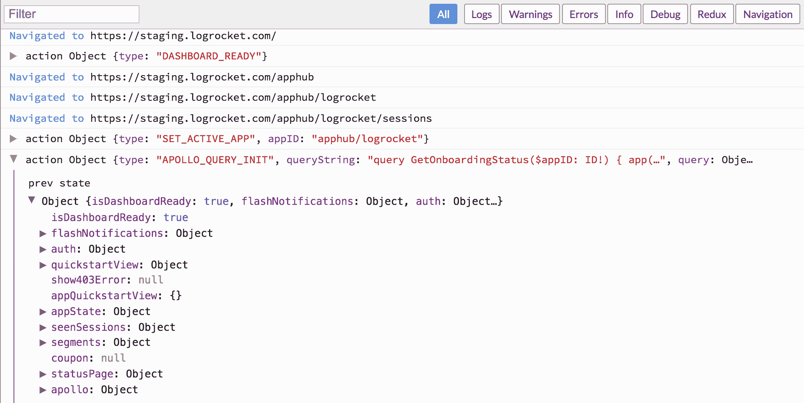
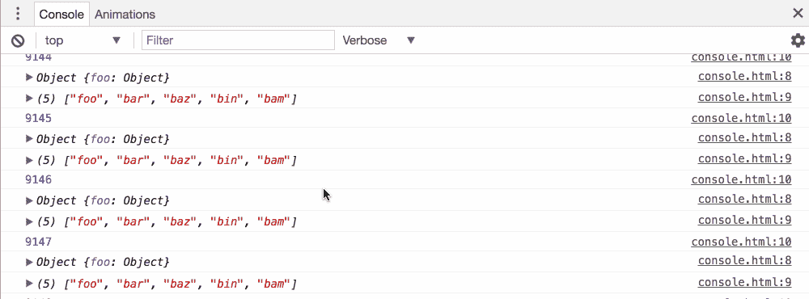
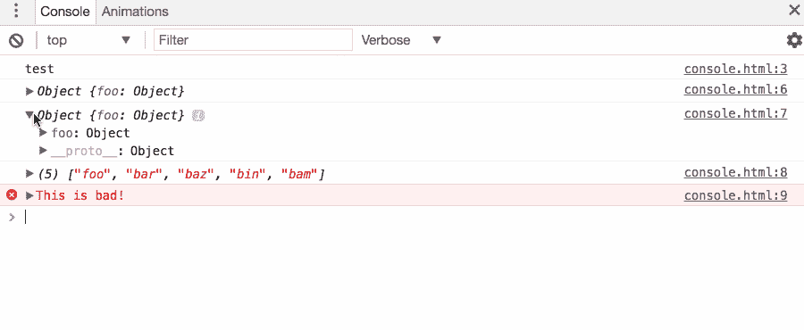
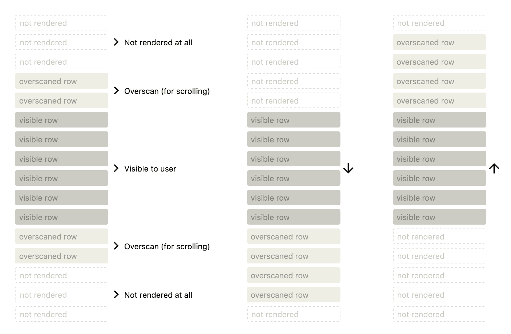
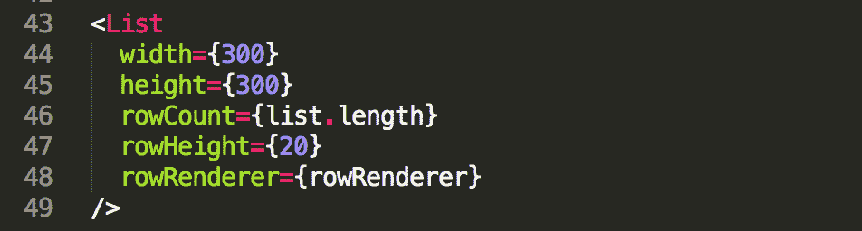
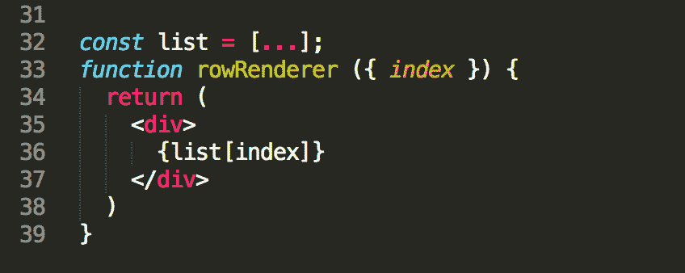
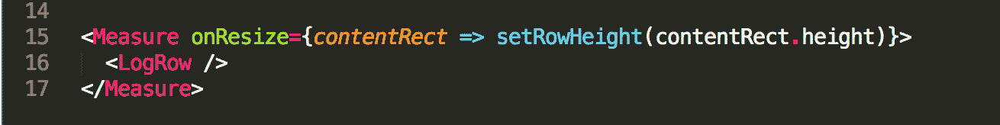
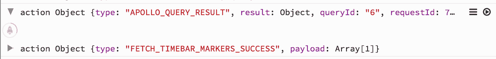

# 在 React - LogRocket 博客中重建 Chrome 控制台

> 原文：<https://blog.logrocket.com/recreating-the-chrome-console-in-react-123d6c4aa930/>

[日志火箭](https://logrocket.com)的核心特征之一是在生产网络应用中重放控制台和 Redux 日志。要做到这一点，您需要将 log 火箭 SDK 添加到向 log 火箭发送日志的应用程序中。然后，当检测到一个 bug 或用户问题时，您可以在 LogRocket 中重放日志，看看出了什么问题。

当我们第一次设计日志查看器时，我们经历了许多设计迭代，但最终决定复制 Chrome 控制台的外观和感觉。毕竟，开发人员已经习惯了使用这个界面，所以为什么要重新发明轮子呢？

事实证明，为 LogRocket 重新构建 Chrome 控制台并不是一项简单的任务，因为我们的用例包含了许多 Chrome 实现中没有的复杂性。在这篇文章中，我将讨论我们如何使用`apollo-client`、`react-virtualized`和`react-measure`来构建一个高性能和可维护的日志查看器。

### 初始设计关注点

我们的日志查看器的高级设计关注点如下:

**平滑滚动性能**

构建一个平滑滚动的长列表并不简单，但对于愉快的用户体验来说却至关重要。由于一个会话可能有数千个日志，我们知道我们需要构建一个虚拟列表，当 DOM 节点离开视区时，它们将被卸载到这个列表中。

**用户交互式 JSON 树**

Expanding objects in the Chrome Console

像 Chrome javascript 控制台一样，用户应该能够扩展记录的对象。这是一次重要的互动，因为开发者已经习惯了 Chrome 控制台的机制。

**惰性加载对象扩展**

像`console` API 一样，LogRocket 使得用 JavaScript 记录任何事情成为可能。这意味着我们需要支持任意大的对象或数组。很明显，我们不能一次加载所有的会话日志，因为这个查询可能非常庞大。相反，当用户扩展日志条目时，我们必须按需加载日志数据。

这背离了 Chrome 控制台的工作方式(所有数据都已经在内存中)，这意味着我们需要一个加载状态和失败查询的错误处理。

**持续状态**

当组件卸载和重新装载时，日志查看器的状态应该保持不变。基本上，状态不能保存在组件级别，应该保存在 Redux 中。

### 使用 React-Virtualized 构建虚拟列表

当呈现一个很长的列表时，在 DOM 中保存所有的条目通常是非常昂贵的，因为每个节点都需要固定数量的内存。为了解决这个问题，您可以构建一个*虚拟*列表，其中每个条目只有在实际可见时才会被呈现。

有许多 React 库可以帮助实现这一点，但是功能最丰富、最健壮的是`react-virtualized`。它提供了许多用于构建虚拟列表、网格和表格的实用组件。它有一个活跃的贡献者社区和一个非常有助于讨论问题的松散团队。

#### 它是如何工作的

react-virtualized only renders visible rows or rows in an “overscan” radius to make for smooth scrolling. Image by [@brian_d_vaughn](https://twitter.com/brian_d_vaughn)

`react-virtualized`绕过浏览器的布局引擎来确定项目的排列位置。当您滚动列表时，它会查看当前的滚动位置，并确定哪些项目在视窗中。然后，它呈现这些项目，并使用绝对定位将每一行放在正确的位置。因此，它可以自由地装载和卸载行，而不会影响后续行的定位。

这种方法的一个警告是，具有动态高度的行实现起来有点棘手。在标准的基于流的布局中，或者使用 Flexbox，如果列表中的项目高度增加，浏览器将向下推后续项目以腾出空间。然而，无论何时元素的高度发生变化，都需要通知`react-virtualized`，以便调整后续项目的`absolute`位置。

让我们来看看`<List />`组件的基本道具:

**宽度，高度**

为了进行计算，需要知道列表视窗的宽度和高度。如果您的列表的宽度或高度不固定，有一些辅助组件可以帮助您调整这些值。

* * *

### 更多来自 LogRocket 的精彩文章:

* * *

**行数**

列表中的行数。

**行高**

如果列表中的所有行都有固定的高度，则该值可以是一个数字。如果每行的高度不同，rowHeight 可以是一个函数，它通过索引返回给定行的高度。稍后将详细介绍。

**rowRenderer**

这是一个接受`index`(和一些其他非必要的道具)并返回要呈现的行的函数。一个简单的实现可能如下所示:

注意`react-virtualized`实际上并没有把列表本身作为道具。只需知道列表的长度，并有一个能够呈现给定行的`rowRenderer`函数就可以了！

### 我们的实施

我不打算描述我们的控制台实现的每个细节，因为它的大部分是`react-virtualized`的标准应用，但是有一些有趣的地方我们有所分歧。

#### 行高

如前所述，`react-virtualized`使用一个属性`rowHeight`,它是一个函数，返回给定索引的行的高度。

在这个 LogRocket 日志查看器的屏幕截图中，注意每行有两种状态:默认和扩展。当一行处于默认的预扩展状态时，它的高度固定在`22px`高度。但是，当一行被展开时，它的高度会随着用户展开对象的不同子树而变化。

我们需要一种方法来编写一个处理动态高度行的`rowHeight`函数——就像这样:

为了在上面的伪代码中实现`getExpandedRowHeight`,有两种可能的选择。

**保证被展开物体确定的高度**

为了实现这一点，我们需要从头开始设计对象树视图组件，使其高度成为展开的子树的纯函数。换句话说，我们可以编写一个函数，它接受一个对象中展开的子树的列表，并让它返回高度。

理论上这是可行的，但是有一些复杂的问题。很难考虑溢出到下一行的文本，因为这会增加对象的高度。此外，做出这种保证会使日志查看器的外观变得困难，因为像边距和填充这样的变化需要进行调整。

**使用** `**react-measure**`

相反，我们选择使用一个名为`react-measure`的库，它为编写知道自己高度的组件提供了一个有用的抽象。

`react-measure`包装一个给定的组件并接受一个 prop，`onResize`这个函数在组件的大小改变时被调用。

在我们的例子中，只要给定行的大小发生变化，我们就会调度一个 Redux 操作，将该行的高度存储在 Redux 中。然后在我们的`rowHeight`函数中，我们简单的从 Redux 中获取行的高度，`react-virtualized`就可以适当的渲染了。

这种方法有一个小的性能损失，因为`react-measure`使用了 DOM resize-observer API，它并不是在所有浏览器中都实现的，但实际上这是非常小的。

#### 阿波罗客户端

为了处理数据获取，我们使用了`apollo-client`,这是一个 GraphQL 客户端，在 React 应用程序中运行良好。当用户点击日志条目以查看完整对象时，日志条目进入具有固定高度的加载状态。

Apollo 向后端发出请求，然后填充 Redux 存储中的数据。这将触发`react-virtualized`更新，当数据被填充时，行高会改变。

#### 物体检验

为了让用户探索日志对象，我们查看了一些不同的现成组件，但最终选择了`react-inspector`。这个库包括许多用于记录对象和 DOM 节点的组件。然而，为了构建一个受控的版本(这样我们可以在 Redux 中保持状态)，我们最终还是分叉了这个库。

## [LogRocket](https://lp.logrocket.com/blg/react-signup-general) :全面了解您的生产 React 应用

调试 React 应用程序可能很困难，尤其是当用户遇到难以重现的问题时。如果您对监视和跟踪 Redux 状态、自动显示 JavaScript 错误以及跟踪缓慢的网络请求和组件加载时间感兴趣，

[try LogRocket](https://lp.logrocket.com/blg/react-signup-general)

.

  

LogRocket 结合了会话回放、产品分析和错误跟踪，使软件团队能够创建理想的 web 和移动产品体验。这对你来说意味着什么？

LogRocket 不是猜测错误发生的原因，也不是要求用户提供截图和日志转储，而是让您回放问题，就像它们发生在您自己的浏览器中一样，以快速了解哪里出错了。

不再有嘈杂的警报。智能错误跟踪允许您对问题进行分类，然后从中学习。获得有影响的用户问题的通知，而不是误报。警报越少，有用的信号越多。

LogRocket Redux 中间件包为您的用户会话增加了一层额外的可见性。LogRocket 记录 Redux 存储中的所有操作和状态。

现代化您调试 React 应用的方式— [开始免费监控](https://lp.logrocket.com/blg/react-signup-general)。