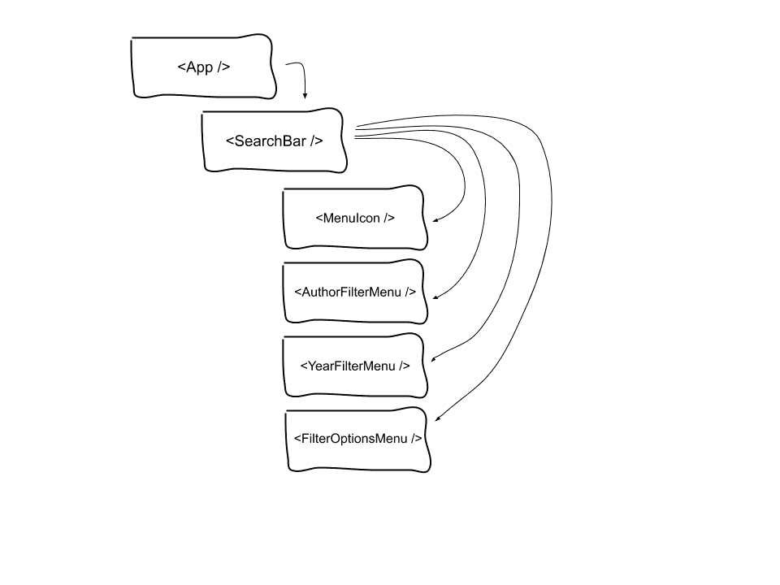
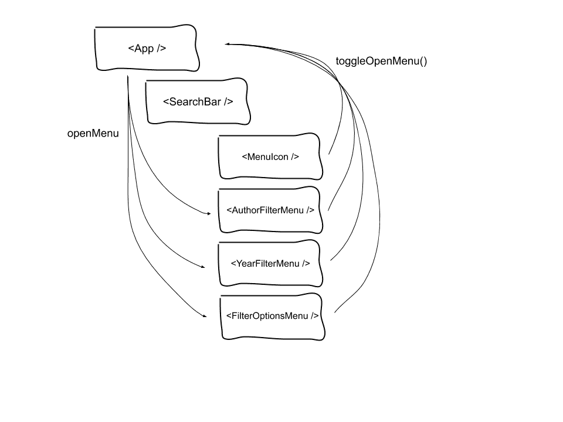

# 用 React 上下文和 refs 重做搜索 UI

> 原文：<https://blog.logrocket.com/redoing-search-ui-with-react-context-and-refs/>

最近，我公司的产品团队发现我们的大多数用户在使用搜索界面时没有使用过滤器。

看了我们的分析后，很明显用户没有使用过滤器，因为他们不知道过滤器的存在。

为了解决这个问题，我们决定重新构建我们的用户界面，以突出这个功能。

但是建立一个新的搜索界面会带来一系列的问题。在我们的案例中，我们有三个主要关注点:

*   通过添加带有嵌套输入的过滤器下拉菜单，我们需要一种方法来轻松管理焦点。
*   对于三个过滤菜单，我们需要一种方法来确保在任何给定的时间只有一个菜单是打开的。
*   当用户从一个菜单中选择一个过滤器时，我们需要关闭菜单并触发新的搜索。

我们通过使用 [React 的上下文 API](https://blog.logrocket.com/how-and-when-to-use-reacts-new-context-api-b584e41b2704/) 结合 refs 创建一个管理菜单状态和输入焦点的集中系统，实现了我们所有的目标。

在本文中，我们将讨论以下内容:

**上下文**:在组件树的任何地方注入数据的基本用法和策略

参考:它们是什么，为什么我们的用例需要它们

### 语境

在 v16.3 中，官方上下文 API 被添加到 React 中，旨在避免通常所说的道具钻取，或者手动将道具传递到组件树中。

虽然这种方法没有错，但是在处理复杂的组件层次结构时，它可能会很笨拙，特别是如果一些组件不关心数据，只是简单地传递数据。



为了使用上下文 API，您需要创建一个`Context.Provider`，它采用一个`value` prop 来表示您想要注入到需要它的子组件中的所有数据。

在[钩子](https://blog.logrocket.com/frustrations-with-react-hooks/)出现之前，你可以通过使用关联的`Context.Consumer`来实现，但是在后钩子时代，我们可以利用`useContext`钩子将组件订阅给组件树中最近的提供者。


在这种情况下，Context 提供了一种方法来跟踪应该在父组件中打开哪个菜单，然后将该值传递给其子组件，而子组件又有条件地呈现适当的下拉菜单。

这里的关键是我们的上下文还传递了一个 setter 函数。这很重要，因为它允许使用我们的上下文值的组件更新我们的父组件中的状态，这导致树重新呈现，新菜单现在可见。



通过使用上述模式，我们可以类似地管理搜索栏和过滤菜单中各种输入的焦点状态。

### 参考文献

虽然 refs 已经成为 React 的一部分有一段时间了，但是即使对于更有经验的开发人员来说，它们仍然有些令人困惑。

本质上，React 提供了一个特殊的 ref 属性，可以应用于任何元素(JSX 或 HTML)。

根据所赋元素的类型，ref 分别提供对类实例或 DOM 元素的访问。

```
// Applying a ref directly to an HTML element
<input
  className="AuthorFilterMenu__filter-input"
  ref={authorFilterInputRef}
  placeholder="Filter by author..."
  value={filterInputValue}
  type="search"
  onInput={event => {
    setFilterInputValue(event.currentTarget.value);
  }}
/>

// Applying a ref to a React component instance
<AuthorFilterMenu ref={authorFilterInputRef} />
view rawex-1-applying-refs.js hosted with ❤ by GitHub
// Provide value in App.jsx
<section className="App__search">
  <SearchContext.Provider
    value={{
      openMenu: openMenu,
      toggleOpenMenu: toggleOpenMenu,
      addAuthor: addAuthor,
      addYear: addYear,
      selectedAuthors: selectedAuthors,
      selectedYears: selectedYears,
      authorFilterInputRef: authorFilterInputRef,
      searchBarRef: searchBarRef,
      yearFilterInputRef: yearFilterInputRef
    }}
  >
    <SearchBar />
  </SearchContext.Provider>
</section>

// In AuthorFilterMenu.jsx, we grab the ref from the searchContext
function AuthorFilterMenu(props) {
  const contextValue = React.useContext(SearchContext);
  const {
    addAuthor,
    openMenu,
    selectedAuthors,
    authorFilterInputRef
  } = contextValue;
}

// And then we apply it to the <input>
return (
  <div className={menuCn}>
    <input
      className="AuthorFilterMenu__filter-input"
      ref={authorFilterInputRef}
      placeholder="Filter by author..."
      value={filterInputValue}
      type="search"
      onInput={event => {
        setFilterInputValue(event.currentTarget.value);
      }}
    />
    <ul className="AuthorFilterMenu__list">{createMenuItems()}</ul>
  </div>
);
```

尽管我们的用例要求我们沿着这条路走下去，但重要的是要注意 refs 是一个 React 反模式，因为它们允许直接 DOM 访问。React 并不打算让开发人员这样做，所以在使用 refs 时，您应该小心行事。

或者，React 设计为让事件更新虚拟 DOM(保存在内存中的文档对象模型的快照)，并允许框架在称为协调的过程中根据需要更新页面。

这不仅通过减少更新页面所做的工作使 React 更有性能，而且有助于更一致的用户体验。

对我们来说，为了使用浏览器的`.focus()`方法，我们需要直接访问组件树中的三个`input`。因为我们需要根据用户交互来改变输入的焦点状态，所以在父组件中保持这种逻辑也是有意义的。

我们将在父组件中创建三个不同的引用，它们将指向以下内容:

1.  我们搜索栏中的输入
2.  我们的第一个过滤器菜单中的输入(例如作者)
3.  第二个过滤器菜单中的输入(例如年份)

使用我们的上下文，我们可以将这些引用传递给我们的子组件。在子组件中，我们从组件的`props`对象中析构出适当的`ref`，并将其直接分配给我们的 HTML `input`:

```
// Applying a ref directly to an HTML element
<input
  className="AuthorFilterMenu__filter-input"
  ref={authorFilterInputRef}
  placeholder="Filter by author..."
  value={filterInputValue}
  type="search"
  onInput={event => {
    setFilterInputValue(event.currentTarget.value);
  }}
/>

// Applying a ref to a React component instance
<AuthorFilterMenu ref={authorFilterInputRef} />
view rawex-1-applying-refs.js hosted with ❤ by GitHub
// Provide value in App.jsx
<section className="App__search">
  <SearchContext.Provider
    value={{
      openMenu: openMenu,
      toggleOpenMenu: toggleOpenMenu,
      addAuthor: addAuthor,
      addYear: addYear,
      selectedAuthors: selectedAuthors,
      selectedYears: selectedYears,
      authorFilterInputRef: authorFilterInputRef,
      searchBarRef: searchBarRef,
      yearFilterInputRef: yearFilterInputRef
    }}
  >
    <SearchBar />
  </SearchContext.Provider>
</section>

// In AuthorFilterMenu.jsx, we grab the ref from the searchContext
function AuthorFilterMenu(props) {
  const contextValue = React.useContext(SearchContext);
  const {
    addAuthor,
    openMenu,
    selectedAuthors,
    authorFilterInputRef
  } = contextValue;
}

// And then we apply it to the <input>
return (
  <div className={menuCn}>
    <input
      className="AuthorFilterMenu__filter-input"
      ref={authorFilterInputRef}
      placeholder="Filter by author..."
      value={filterInputValue}
      type="search"
      onInput={event => {
        setFilterInputValue(event.currentTarget.value);
      }}
    />
    <ul className="AuthorFilterMenu__list">{createMenuItems()}</ul>
  </div>
);
```

现在，每当一个子组件调用我们的菜单状态设置函数来切换菜单时，我们可以添加逻辑来更新哪个输入是焦点。

* * *

### 更多来自 LogRocket 的精彩文章:

* * *

例如，如果我们的一个过滤器菜单是打开的，然后关闭，我们将希望重新聚焦搜索输入栏，以允许用户继续他们的查询。

这里需要注意的一点是，函数组件不能很好地处理引用。

为了将一个`ref`传递给一个函数组件，您将需要使用`React.forwardRef`，它创建一个新的组件来接收一个`ref`属性，然后将它传递给下面的另一个组件。

要更详细地了解如何使用* `forwardRef`，请查看[官方 React 文档。](https://reactjs.org/docs/react-api.html#reactforwardref)

### 结论

虽然 Context 是一个相对较新的 API，而 refs 在某种程度上是一个反模式，但在这种情况下，它们可以很好地相互补充。通过将两者结合在一起，我们能够在新的搜索界面中创建一种更简单的方式来管理显示和焦点状态。

虽然我们在这个例子中没有使用任何存储，但是您可以很容易地连接一个存储并将其包含在这个数据流中。

例如，在我工作时构建的项目中，我的父组件订阅了一个商店，该商店提供了要在我们的下拉菜单中呈现的项目列表。

一旦父组件接收到这个数据，它就把它添加到我们的上下文的`value` prop 中，并把它传递给子组件。

最终，以这种方式集中定位逻辑的能力允许更一致的用户体验。

通过使用上下文，我们可以轻松地将业务逻辑和数据获取从 UI 组件的表示和功能中分离出来。

我们还使我们的代码在将来更容易被其他开发者阅读，这从来都不是一件坏事！

完整教程，看看这个演示:[演示应用。](https://codesandbox.io/s/laughing-lichterman-lxl1y)

## [LogRocket](https://lp.logrocket.com/blg/react-signup-general) :全面了解您的生产 React 应用

调试 React 应用程序可能很困难，尤其是当用户遇到难以重现的问题时。如果您对监视和跟踪 Redux 状态、自动显示 JavaScript 错误以及跟踪缓慢的网络请求和组件加载时间感兴趣，

[try LogRocket](https://lp.logrocket.com/blg/react-signup-general)

.

[ ](https://lp.logrocket.com/blg/react-signup-general) [](https://lp.logrocket.com/blg/react-signup-general) 

LogRocket 结合了会话回放、产品分析和错误跟踪，使软件团队能够创建理想的 web 和移动产品体验。这对你来说意味着什么？

LogRocket 不是猜测错误发生的原因，也不是要求用户提供截图和日志转储，而是让您回放问题，就像它们发生在您自己的浏览器中一样，以快速了解哪里出错了。

不再有嘈杂的警报。智能错误跟踪允许您对问题进行分类，然后从中学习。获得有影响的用户问题的通知，而不是误报。警报越少，有用的信号越多。

LogRocket Redux 中间件包为您的用户会话增加了一层额外的可见性。LogRocket 记录 Redux 存储中的所有操作和状态。

现代化您调试 React 应用的方式— [开始免费监控](https://lp.logrocket.com/blg/react-signup-general)。