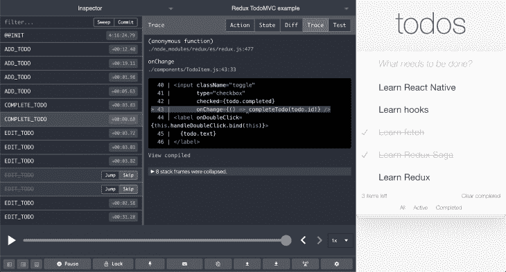
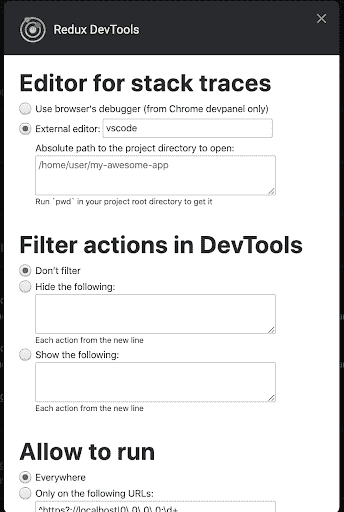
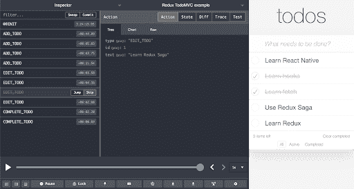
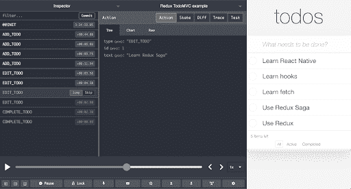
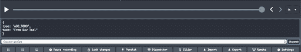
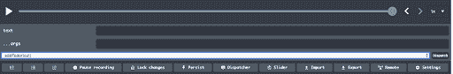
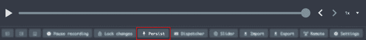
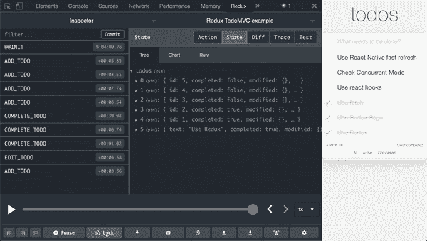
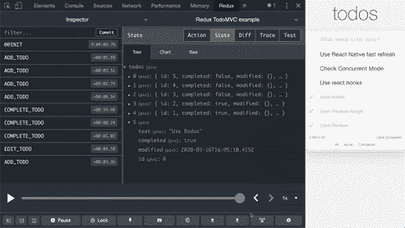
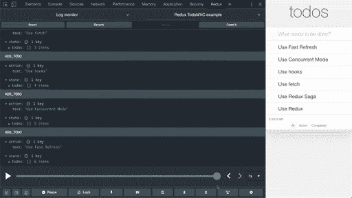

# Redux DevTools:快速调试的技巧和诀窍

> 原文：<https://blog.logrocket.com/redux-devtools-tips-tricks-for-faster-debugging/>

Redux 是大规模 React 应用程序最常用的状态管理库之一。除了使您的应用程序更加可预测的能力之外，围绕它发展起来的生态系统使 Redux 成为大规模应用程序的最佳解决方案。Redux 的另一个优势是开发人员工具，它使得跟踪应用程序状态何时、何地、为何以及如何改变变得容易。

我们将研究 Redux DevTools 提供的一些非凡特性，这些特性可以帮助您更快地调试应用程序。

## 跟踪操作

Redux DevTools 的另一个惊人特性是可以看到触发动作的调用栈。我们可以从历史中选择任何行动，并看到行动的原因。



对于大规模的应用程序，相同的动作从应用程序的不同部分同时触发，很难找到动作分派的根本原因。这就是开发人员使用跟踪功能的地方。

Redux DevTool 允许开发人员使用依赖于`Error.stack()`的默认实现，或者定义自定义实现。下面是启用`trace`的 API:

```
window.__REDUX_DEVTOOLS_EXTENSION_COMPOSE__({
    trace: true, // (action) => { return ‘trace as string’; }
    traceLimit: 25,
 })
```

正如所见，`trace`参数也接受方法。每个动作都会调用这个方法。开发人员可以在这里添加自定义实现来查看动作分派的原因。针对 trace 属性传递此方法允许开发人员仅监视所需操作的跟踪。

这有助于保持开发体验的流畅和高效，因为为每个动作创建`trace`可能会消耗大量内存。作为`trace`的方法对于通过副作用库(如 redux-saga 或其他事件监听器)调度的动作很有帮助。

当没有实现自定义跟踪方法时，开发人员可以依赖使用`Error.stack()` API 的默认实现。在这种情况下，`traceLimit`属性对于管理 DevTool 的内存使用非常有用。它覆盖了浏览器默认的`Error.stackTraceLimit`，并限制了堆栈的长度以优化内存消耗。

## 我们不只是写 Redux，我们也谈论它。现在听着:

或者以后订阅

### 在编辑器中跟踪操作

## Redux DevTool 扩展了显示动作的`trace`的能力，允许您导航到代码库的确切位置。对于大型代码库来说，这非常方便，因为它节省了在大型代码库中导航到准确位置的大量时间。

可以从 DevTool 右下角的扩展设置中设置编辑器。



跳过动作

## 时间旅行是 Redux DevTools 最强大的功能之一，它允许我们看到我们的应用程序的状态如何达到当前点。在某些情况下，为了分析应用程序的行为，我们可能需要从时间轴中删除一个特定的动作。这在时间旅行机制中是不可能的。Redux DevTool 有一个很好的方法。在应用程序流的三种不同视图类型中，日志监视器和检查器允许您从时间线中禁用或移除操作。这是它的样子。



开始行动

## 除了从时间轴上跳过状态之外，开发人员还可以跳到所需的状态，而不必在时间轴上移动。这使得开发人员能够快速移动，并在不同的中间状态下查看应用程序的输出。开发人员也可以监控时间线跳跃的影响。此功能仅在检查器模式下可用。



海关派遣

## Redux DevTool 允许我们在不编写任何代码的情况下分派动作。我们可以在 dispatcher 中添加我们的动作，它就像通过 Redux API 调度的动作一样工作。这种嘲笑有助于测试副作用和依赖行为。当与锁定到当前状态结合使用时，这个特性变得非常方便。我们可以将状态锁定到某个阶段，并从 DevTool 调度操作，以查看对存储的影响并监视副作用。





允许/阻止操作

## 对于由许多动作组成的大规模应用程序，我们可以只监控想要的动作；或者，我们可以阻止某些动作出现在 DevTools 中。这可以通过在 DevTools 设置中添加一个动作列表来阻止或允许，或者在我们的应用程序中初始化它。

正如所看到的，我们可以在初始化时在一个参数中使用`actionsBlacklist` / `actionsWhitelist`参数，或者通过设置来完成。

```
window.__REDUX_DEVTOOLS_EXTENSION_COMPOSE__({
    actionsBlacklist: 'SOME_ACTION',
  // or actionsBlacklist: ['SOME_ACTION', 'SOME_OTHER_ACTION']
  // or just actionsBlacklist: 'SOME_' to omit both
 })
```

**免责声明**:我们不鼓励使用任何种族主义术语，无论意图如何；我们使用这些术语只是为了引用 API。[这个包的维护者](https://github.com/reduxjs/redux-devtools/issues/686)提出了这个问题，我们希望他们会考虑我们的请求。

页面重新加载时保持存储

## 大规模应用程序中的一个痛点是为状态开发接口，该状态是在应用程序内的一次旅行之后获得的。当一些状态依赖于副作用时，例如网络响应，就变得更加困难。DevTool 来帮忙了，我们可以在页面重新加载时保持某些状态。这将允许你在重新加载后直接跳转到所需的状态，而无需再次经历旅程。

这可以通过点击底部栏中的“Persist”按钮或将`?debug_session=`添加到 URL 来完成。

在生产中使用

## 很难预测或捕捉我们应用程序中所有可能的错误。在我们的应用程序投入生产并被大量用户使用后，我们会遇到许多问题。为了分析这些错误，我们可能需要查看问题发生时应用程序的动作轨迹或当前状态。DevTool 允许我们看到一系列的动作，并存储在产品中，这使得重现问题变得更加容易。

为了安全和性能，强烈建议使用[动作和状态清理](https://github.com/zalmoxisus/redux-devtools-extension/blob/master/docs/API/Arguments.md#actionsanitizer--statesanitizer)选项。[这里有一篇关于在产品中启用 DevTool 的博文](https://medium.com/@zalmoxis/using-redux-devtools-in-production-4c5b56c5600f)。

锁定到当前状态

## 在频繁分派几个动作的应用程序中，我们可能需要在中间位置分析我们的应用程序，而不允许分派进一步的动作。这可以通过将我们的应用程序锁定到当前状态来实现。与暂停不同，这将应用程序冻结在当前状态。当应用程序被锁定，我们仍然可以做时间旅行和其他启用/禁用调度的行动。


锁定的另一个好处是我们终于有了一个避免副作用的解决方案。

固定到子状态

## 在大多数生产应用程序中，状态被分成小的子状态对象，通常反映应用程序中的不同模块。调试案例可能需要关注特定的子状态。对于这种情况，开发人员可以锁定到子状态，并查看不同的操作如何影响这个锁定的子状态。子状态可以通过*检查器&图表模式*锁定。



提交操作

## 对于大规模的应用程序来说，浏览上百个动作的列表从来都不是一件容易的事情。相反，开发人员更喜欢分块监控应用程序。对于这种情况，Redux DevTool 允许开发人员提交当前的一组操作。当前状态被认为是即将到来的动作的初始状态。该特性的一个最佳用途是跨页面转换监控状态。

提交后，您还可以随时恢复到这种状态。换句话说，您可以将 pivot 添加到您的状态中，并在需要时随时返回。


开发人员可以从检查器模式提交状态，但要恢复必须切换到日志监视器。

结论

## 毫无疑问，Redux DevTool 是调试 React 应用程序的最有用和最强大的工具之一。它允许开发人员充分利用 Redux 提供的应用程序的可预测性。React 本机调试器中也提供了它，这就是为什么充分了解它可以加快我们在 web 和移动平台上同时进行开发和调试的速度。

[LogRocket](https://lp.logrocket.com/blg/react-signup-general) :全面了解您的生产 React 应用

## 调试 React 应用程序可能很困难，尤其是当用户遇到难以重现的问题时。如果您对监视和跟踪 Redux 状态、自动显示 JavaScript 错误以及跟踪缓慢的网络请求和组件加载时间感兴趣，

.

[try LogRocket](https://lp.logrocket.com/blg/react-signup-general)

LogRocket 结合了会话回放、产品分析和错误跟踪，使软件团队能够创建理想的 web 和移动产品体验。这对你来说意味着什么？

[ ](https://lp.logrocket.com/blg/react-signup-general) [](https://lp.logrocket.com/blg/react-signup-general) 

LogRocket 不是猜测错误发生的原因，也不是要求用户提供截图和日志转储，而是让您回放问题，就像它们发生在您自己的浏览器中一样，以快速了解哪里出错了。

不再有嘈杂的警报。智能错误跟踪允许您对问题进行分类，然后从中学习。获得有影响的用户问题的通知，而不是误报。警报越少，有用的信号越多。

LogRocket Redux 中间件包为您的用户会话增加了一层额外的可见性。LogRocket 记录 Redux 存储中的所有操作和状态。

现代化您调试 React 应用的方式— [开始免费监控](https://lp.logrocket.com/blg/react-signup-general)。

Modernize how you debug your React apps — [start monitoring for free](https://lp.logrocket.com/blg/react-signup-general).