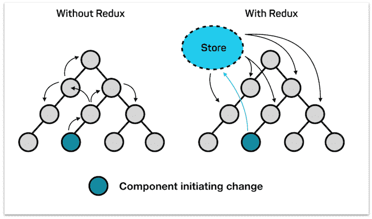
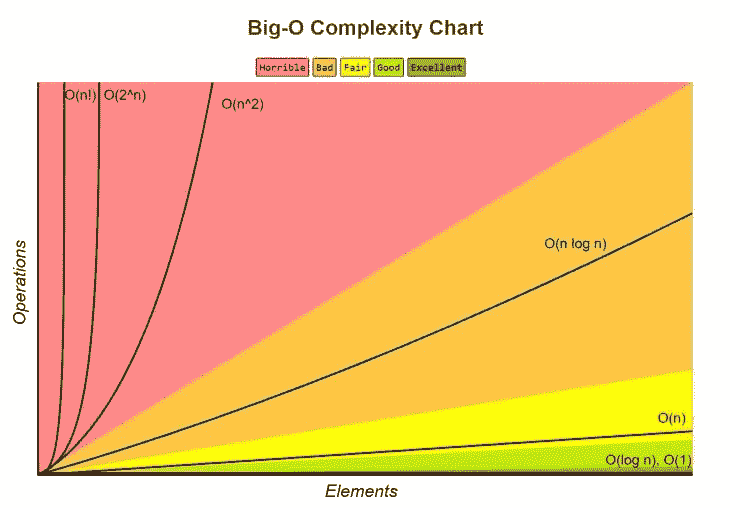

# Redux 不可变更新模式

> 原文：<https://blog.logrocket.com/redux-immutable-update-patterns/>

***编者按**:这篇文章最后一次更新是在 2021 年 12 月 30 日，包含了关于 Redux Toolkit 的信息。*

既然您正在阅读一篇关于 Redux 的文章，我假设您正在从事的项目正处于成长阶段，并且可能会变得日益复杂。您可能会有新的业务逻辑需求，这意味着您需要一种一致且可调试的方法来处理应用程序状态，以处理不同的域。

如果你是一个开发简单应用的开发人员，或者你刚刚开始学习一个新的前端框架，比如 React，[你可能不需要 Redux](https://blog.logrocket.com/8-definitive-rules-building-apps-redux/) ，除非你把它当成一个学习机会。

虽然 Redux 使您的应用程序更加复杂，但是这种复杂性为大规模状态管理带来了简单性。在本文中，我们将通过研究 Redux 的不可变更新模式来探索这个概念。我们开始吧！

### 目录

## Redux 的内部运作

当您有几个不需要相互通信的独立组件，并且希望维护一个简单的 UI 或业务逻辑时，请使用本地状态。如果您有几个组件需要订阅以获得相同类型的数据，并且作为反应，调度通知、更改或事件， [loaders 可能是您最好的朋友](https://blog.logrocket.com/component-state-local-state-redux-store-and-loaders/)。

但是，如果您有几个组件需要与其他组件共享某种状态，而没有直接的父子关系，如下图所示，那么 Redux 是一个完美的解决方案。

如果没有 Redux，每个组件都需要以某种形式将状态传递给需要它的其他组件，并在反应中处理命令或事件调度。你可以看到这个系统是如何变得难以大规模维护、测试和调试的。

然而，在 Redux 的帮助下，任何组件都不需要持有任何管理状态的逻辑。相反，他们必须订阅 Redux 来获得他们需要的状态，并在需要时向它分派动作作为回报:



Graph of components initiating change with and without Redux

[***https://blog . code centric . de***](https://blog.codecentric.de/)

[支持状态管理的 Redux 的核心部分是 Redux store](https://blog.logrocket.com/react-router-with-redux-navigation-state/) ，它将应用程序的逻辑保存为一个`state`对象。`state`对象公开了一些方法来获取、更新和监听状态及其变化。

在本文中，我们将只关注使用`dispatch(action)`方法更新状态。`dispatch(action)`方法是修改状态的唯一方法，以这种形式[出现。](https://redux.js.org/api/store/#dispatchaction)

存储的归约函数将与当前`getState()`结果和给定动作同步调用。它的返回值将被认为是下一个状态。从现在开始它将从`getState()`返回，改变监听器将立即被通知。要记住的主要事情是，对状态的任何更新都应该以不可变的方式发生。

注意:在更新这篇帖子的时候，大多数开发者使用 [Redux Toolkit 来轻松地在他们的 React 应用程序中设置 Redux](https://blog.logrocket.com/using-redux-toolkits-createasyncthunk/) 。

有了 Redux Toolkit，我们就不用担心不变性了。虽然在使用 Redux Toolkit 时，状态似乎是可变的，但实际上[在幕后使用 Immer】来确保状态是不可变的，这使得状态管理更加容易。](https://blog.logrocket.com/immer-and-immutable-js-how-do-they-compare/)

Redux Toolkit 用切片来表示一段数据；让我们来看一个例子:

```
const locationSlice = createSlice({
  name: 'location',
  initialState: {x: 0, y: 0},
  reducers: {
    setXCoord: (state, action) => {
      state.x = action.payload;
    },
    setYCoord: (state, action) => {
      state.y = action.payload;
    },
  },
})

```

上面的 Redux 工具包切片也包含了`reducer`函数。这里，我们有两个函数，`setXCoord`和`setYCoord`。两者看起来都是直接突变状态，但这并不是因为 Immer，它正在 Redux Toolkit 中幕后使用。

让我们来看一个待办事项列表和一个更新数组的场景:

```
const todoSlice = createSlice({
  name: 'todos',
  initialState: [],
  reducers: {
    addTodo: (state, action) => {
      state.push(action.payload)
    }
  },
})

```

我们试图使用`push()`，它改变了数组，我们将在本文后面讨论。这里，我们在状态的副本上使用`push()`，Redux Toolkit 确保状态被正确更新。

如果您仍然想要手动设置 Redux，您可能需要自己处理不变性。在本文的后面，我们将看到为什么不变性是必要的，以及如何处理它。

## 为什么要使用不可变的更新模式？

假设您正在开发一个电子商务应用程序，初始状态如下:

```
const initialState = {
  isInitiallyLoaded: false,
  outfits: [],
  filters: {
    brand: [],
    colour: [],
  },
  error: '',
};

```

我们这里有各种各样的数据类型，包括`string`、`boolean`、`array`和`object`。为了响应应用程序事件，这些`state`对象参数需要以不可变的方式更新。换句话说，原始状态或其参数[不会改变或突变](https://redux.js.org/usage/structuring-reducers/immutable-update-patterns/)。相反，我们将复制原始值，修改它们以返回新值。

## JavaScript 中的不变性

默认情况下，`strings`和`booleans`，以及其他像`number`或`symbol`这样的原语是不可变的。这里有一个`strings`不变性的例子:

```
// strings are immutable by default

// for example when you define a variable like:
var myString = 'sun';

// and want to change one of its characters (string are handled like Array):
myString[0] = 'r';

// you see that this is not possible due to the immutability of strings
console.log(myString); // 'sun'

// also if you have two references to the same string, changing one does not affect the other
var firstString = secondString = "sun";

firstString = firstString + 'shine';
console.log(firstString); // 'sunshine'
console.log(secondString); // 'sun'

```

`objects`是可变的，但可以[冻结](https://developer.mozilla.org/en-US/docs/Web/JavaScript/Reference/Global_Objects/Object/freeze)。在下面的例子中，我们看到了这一点。我们还看到，当我们通过将一个新对象指向一个现有对象来创建该对象，然后改变该新对象的一个属性时，会导致这两个对象的属性都发生变化:

```
'use strict';

// setting myObject to a `const` will not prevent mutation.
const myObject = {};
myObject.mutated = true;
console.log(myObject.mutated); // true

// Object.freeze(obj) to prevent re-assigning properties, 
// but only at top level
Object.freeze(myObject);
myObject.mutated = true;
console.log(myObject.mutated); // undefined

// example of mutating an object properties
let outfit = {
    brand: "Zara",
    color: "White",
    dimensions: {
        height: 120,
        width: 40,
    }
}

// we want a mechanism to attach price to outfits
function outfitWithPricing(outfit) {
    outfit.price = 200;
    return outfit;
}

console.log(outfit); // has no price

let anotherOutfit = outfitWithPricing(outfit);

// there is another similar outfit that we want to have pricing.
// now outfitWithPricing has changed the properties of both objects.
console.log(outfit); // has price
console.log(anotherOutfit); // has price

// even though the internals of the object has changed, 
// they are both still pointing to the same reference
console.log(outfit === anotherOutfit); // true

```

如果我们想完成对对象的不可变更新，我们有几个选择，比如`Object.assign`或`spread operator`:

```
// lets do this change in an immutable way
// we use spread oeprator and Object.assign for 
// this purpose. we need to refactor outfitWithPricing
// not to mutate the input object and instead return a new one
function outfitWithPricing(outfit) {
  let newOutfit = Object.assign({}, outfit, {
    price: 200
  })

  return newOutfit;
}

function outfitWithPricing(outfit) {
  return {
    ...outfit,
    price: 200,
  }
}

let anotherOutfit = outfitWithPricing(outfit);
console.log(outfit); // does not have price
console.log(anotherOutfit); // has price

// these two objects no longer point to the same reference
console.log(outfit === anotherOutfit); // false

```

拥有可变和不可变的方法。记住哪些数组方法是哪些是很重要的。这里有几个例子:

*   不可变方法:`concat`、`filter`、`map`、`reduce`、`reduceRight`
*   可变方法:`push`、`pop`、`shift`、`unshift`、`sort`、`reverse`、`splice`、`delete`

请记住，`spread operator`也适用于`array`,可以使不可变的更新更加容易。让我们看一些可变和不可变的更新作为例子:

```
// The push() method adds one or more elements to the end of an array and returns
// the new length of the array.
const colors = ['red', 'blue', 'green'];

// setting a new varialbe to point to the original one
const newColors = colors;
colors.push('yellow'); // returns new length of array which is 4
console.log(colors); // Array ["red", "blue", "green", "yellow"]

// newColors has also been mutated
console.log(newColors); // Array ["red", "blue", "green", "yellow"]

// we can use one of the immutable methods to prevent this issue
let colors = ['red', 'blue', 'green'];
const newColors = colors;

// our immutable examples will be based on spread operator and concat method
colors = [...colors, 'yellow'];
colors = [].concat(colors, 'purple');

console.log(colors); // Array ["red", "blue", "green", "yellow", "purple"]
console.log(newColors); // Array ["red", "blue", "green"]

```

在一个真实的例子中，如果我们需要更新 state 上的`error`属性，我们需要对 reducer 执行`dispatch`操作。Redux reducers 是纯函数，意思是:

*   它们总是基于相同的输入返回相同的值，即`state`和`action`
*   它们不会产生任何副作用，比如进行 API 调用

这些属性要求我们以不可变的方式处理 reducers 中的状态更新，这带来了几个好处:

*   更容易测试减速器，因为输入和输出总是可预测的
*   调试和时间旅行，所以你可以看到历史的变化，而不仅仅是结果

最大的优势是保护我们的应用程序不会出现渲染问题。在 React 这样依赖状态来更新虚拟 DOM 的框架中，拥有正确的状态是必须的。

React 可以通过比较引用来了解状态是否发生了变化，引用的[符号为`1`](https://yourbasic.org/algorithms/big-o-notation-explained/#constant-time) ，表示速度更快，而递归比较对象的速度较慢，表示为`n` 的[符号:](https://yourbasic.org/algorithms/big-o-notation-explained/#linear-time)



Big-O complexity chart

在我们分派了`HANDLE_ERROR`动作，通知 reducer 我们需要更新状态之后，将会发生以下情况:

*   首先，它使用`spread operator`来复制`stat`对象
*   接下来，它更新`error`属性并返回新的状态
*   订阅该存储的所有组件都会收到关于这个新状态的通知，如果需要的话会重新呈现

```
// initial state
    const initialState = {
      isInitiallyLoaded: false,
      outfits: [],
      filters: {
        brand: [],
        colour: [],
      },
      error: '',
    };
 a reducer takes a state (the current state) and an action object (a plain JavaScript object that was dispatched via dispatch(..) and potentially returns a new state. */ function handleError(state = initialState, action) { if (action.type === 'HANDLE_ERROR') { return { ...state, error: action.payload, } // note that a reducer MUST return a value } } // in one of your components ... store.dispatch({ type: 'HANDLE_ERROR', payload: error }) // dispatch an action that causes the reducer to execute and handle error
```

我们已经以不变的方式介绍了 Redux 更新模式的基础知识。然而，有些类型的更新可能比其他类型的更新更棘手，比如删除或更新嵌套数据。

## 在数组中添加项目

如前所述，像`unshift`、`push`和`splice`这样的数组方法是可变的。如果我们要就地更新阵列，我们希望远离这些。

无论我们是想将项目添加到数组的开头还是结尾，我们都可以简单地使用`spread operator`来返回一个包含所添加项目的新数组。如果我们打算在某个索引处添加项目，我们可以使用`splice`，只要我们首先制作一个状态的副本。然后，改变任何属性都是安全的:

```
// ducks/outfits (Parent)

// types
export const NAME = `@outfitsData`;
export const PREPEND_OUTFIT = `${NAME}/PREPEND_OUTFIT`;
export const APPEND_OUTFIT = `${NAME}/APPEND_OUTFIT`;
export const INSERT_ITEM = `${NAME}/INSERT_ITEM`;

// initialization
const initialState = {
  isInitiallyLoaded: false,
  outfits: [],
  filters: {
    brand: [],
    colour: [],
  },
  error: '',
};

// action creators
export function prependOutfit(outfit) {
    return {
      type: PREPEND_OUTFIT,
      outfit
    };
}

export function appendOutfit(outfit) {
    return {
      type: APPEND_OUTFIT,
      outfit
    };
}

export function insertItem({ outfit, index }) {
    return {
      type: INSERT_ITEM,
      outfit,
      index,
    };
}

// immutability helpers
function insertItemImHelper(array, action) {
  let newArray = array.slice()
  newArray.splice(action.index, 0, action.item)
  return newArray
}

export default function reducer(state = initialState, action = {}) {
  switch (action.type) {  
  case PREPEND_OUTFIT:
    return {
      ...state,
      outfits: [
        action.payload,
        ...state.outfits,
      ]
    };
  case APPEND_OUTFIT:
    return {
      ...state,
      outfits: [
        ...state.outfits,
        action.payload,
      ]
    };
  case INSERT_ITEM:
    return {
      ...state,
      outfits: insertItemImHelper(state.outfits, action)
    };
  default:
     return state;
  }
}

```

## 在嵌套对象的数组中添加项

更新嵌套数据变得有点棘手。记住要正确地更新每一层数据，以便正确地执行更新。让我们看一个将项目添加到数组的示例，该数组位于嵌套对象中:

```
// ducks/outfits (Parent)

// types
export const NAME = `@outfitsData`;
export const ADD_FILTER = `${NAME}/ADD_FILTER`;

// initialization
const initialState = {
  isInitiallyLoaded: false,
  outfits: [],
  filters: {
    brand: [],
    colour: [],
  },
  error: '',
};

// action creators
export function addFilter({ field, filter }) {
    return {
      type: ADD_FILTER,
      field,
      filter,
    };
}

export default function reducer(state = initialState, action = {}) {
  switch (action.type) {  
  case ADD_FILTER:
  return {
    ...state,
    filters: {
    ...state.filters,
       [action.field]: [
         ...state.filters[action.field],
         action.filter,
       ]
    },
  };
  default:
     return state;
  }
}

```

## 移除数组中的项目

有几种方法可以以不可变的方式移除项目。首先，我们可以使用像`filter`这样的不可变方法，它返回一个新数组:

```
function removeItemFiter(array, action) {
  return array.filter((item, index) => index !== action.index)
}

```

或者，我们可以先复制一个数组，然后使用`splice`删除数组中某个索引中的一项:

```
function removeItemSplice(array, action) {
  let newArray = array.slice()
  newArray.splice(action.index, 1)
  return newArray
}

```

下面的例子展示了在 reducer 中使用这些不变性概念来返回正确的状态:

```
// ducks/outfits (Parent)

// types
export const NAME = `@outfitsData`;
export const REMOVE_OUTFIT_SPLICE = `${NAME}/REMOVE_OUTFIT_SPLICE`;
export const REMOVE_OUTFIT_FILTER = `${NAME}/REMOVE_OUTFIT_FILTER`;

// initialization
const initialState = {
  isInitiallyLoaded: false,
  outfits: [],
  filters: {
    brand: [],
    colour: [],
  },
  error: '',
};

// action creators
export function removeOutfitSplice({ index }) {
    return {
      type: REMOVE_OUTFIT_SPLICE,
      index,
    };
}

export function removeOutfitFilter({ index }) {
    return {
      type: REMOVE_OUTFIT_FILTER,
      index,
    };
}

// immutability helpers
function removeItemSplice(array, action) {
  let newArray = array.slice()
  newArray.splice(action.index, 1)
  return newArray
}

function removeItemFiter(array, action) {
  return array.filter((item, index) => index !== action.index)
}

export default function reducer(state = initialState, action = {}) {
  switch (action.type) {  
  case REMOVE_OUTFIT_SPLICE:
    return {
      ...state,
      outfits: removeItemSplice(state.outfits, action)
    };
  case REMOVE_OUTFIT_FILTER:
    return {
      ...state,
      outfits: removeItemFiter(state.outfits, action)
    };
  default:
     return state;
  }
}

```

## 移除嵌套对象内数组中的项目

最后，我们将移除数组中的一个项，它位于一个嵌套对象中。这非常类似于添加一个项目，但是我们将在嵌套数据中过滤掉该项目:

```
// ducks/outfits (Parent)

// types
export const NAME = `@outfitsData`;
export const REMOVE_FILTER = `${NAME}/REMOVE_FILTER`;

// initialization
const initialState = {
  isInitiallyLoaded: false,
  outfits: ['Outfit.1', 'Outfit.2'],
  filters: {
    brand: [],
    colour: [],
  },
  error: '',
};

// action creators
export function removeFilter({ field, index }) {
  return {
    type: REMOVE_FILTER,
    field,
    index,
  };
}

export default function reducer(state = initialState, action = {}) {
  sswitch (action.type) {  
  case REMOVE_FILTER:
  return {
    ...state,
    filters: {
    ...state.filters,
       [action.field]: [...state.filters[action.field]]
       .filter((x, index) => index !== action.index)
    },
  };
  default:
     return state;
  }
}

```

## 结论

在本文中，我们介绍了以下内容:

*   为什么以及何时我们需要像 Redux 这样的状态管理工具
*   Redux 状态管理和更新如何工作
*   Redux 工具包如何处理不变性
*   为什么不可变更新很重要
*   如何处理棘手的更新，比如在嵌套对象中添加或删除项目

在本文中，我们打算学习 Redux 中手动不可变更新模式的基础，然而，有一组不可变库，如 [ImmutableJS](https://immutable-js.github.io/immutable-js/) 或 [Immer](https://github.com/immerjs/immer) 可以使您的状态更新不那么冗长，更可预测。

## 使用 LogRocket 消除传统反应错误报告的噪音

[LogRocket](https://lp.logrocket.com/blg/react-signup-issue-free)

是一款 React analytics 解决方案，可保护您免受数百个误报错误警报的影响，只针对少数真正重要的项目。LogRocket 告诉您 React 应用程序中实际影响用户的最具影响力的 bug 和 UX 问题。

[ ](https://lp.logrocket.com/blg/react-signup-general) [  ](https://lp.logrocket.com/blg/react-signup-general) [LogRocket](https://lp.logrocket.com/blg/react-signup-issue-free)

自动聚合客户端错误、反应错误边界、还原状态、缓慢的组件加载时间、JS 异常、前端性能指标和用户交互。然后，LogRocket 使用机器学习来通知您影响大多数用户的最具影响力的问题，并提供您修复它所需的上下文。

关注重要的 React bug—[今天就试试 LogRocket】。](https://lp.logrocket.com/blg/react-signup-issue-free)