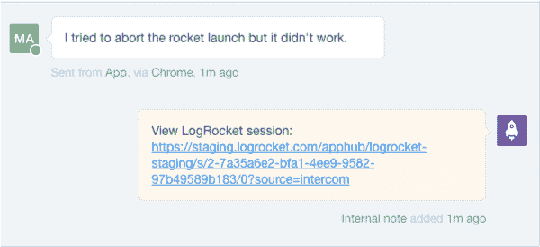

# 生产中的 Redux 日志记录

> 原文：<https://blog.logrocket.com/redux-logging-in-production-3b2a4816b713/>

Redux 最大的优势之一是可调试性——通过记录应用执行期间的动作和状态，开发人员可以轻松了解代码错误、竞争条件、网络错误和其他错误来源。

在本地开发中，使用像 redux-logger 或 redux-devtools 这样的工具进行时间旅行调试和查看 redux 操作是标准的做法。但是使用 Redux 日志轻松修复 bug 的好处在生产中最为显著。

为了做到这一点，一些开发人员构建了自己开发的解决方案或者利用了现有的后端日志工具，但是要做到这一点并不容易。Redux 数据必须在不影响应用程序性能的情况下有效地收集和上传，并且在后端，这些数据(相当大)必须被存储起来，并且可以方便地搜索以解决调试问题。

#### Enter LogRocket…

LogRocket 是第一款面向 webapps 的 production Redux 日志工具。它有一个高度优化的 JavaScript SDK + Redux 中间件，可以轻松扩展到支持数百万用户的应用程序。

除了记录 Redux 数据，LogRocket 还记录网络请求、控制台日志、JavaScript 错误和完整的 DOM 视频。在修复 bug 时，除了 Redux 日志之外，拥有这个上下文是至关重要的，因为它基本上拥有本地开发时在 Chrome 开发工具中可以找到的所有信息。

在这篇文章中，我将快速浏览一下在生产应用程序中设置 LogRocket。然后，我将讨论如何利用 Redux 来最大化应用程序的可调试性。

### 设置 LogRocket

设置 LogRocket 很容易，只需要在应用程序中添加几行代码:

1.  用 NPM 安装:`npm i --save logrocket`。
2.  在[https://app.logrocket.com](https://app.logrocket.com)创建一个免费账户，并记下您的申请 id。
3.  在应用程序中初始化 LogRocket:

```
import LogRocket from 'logrocket'; // Initialize LogRocket with your app ID LogRocket.init(<your_application_id>);
```

4.添加 Redux 中间件。

```
import { applyMiddleware, createStore } from 'redux';

const store = createStore(
  reducer, // your app reducer
  applyMiddleware(middlewares, LogRocket.reduxMiddleware()),
);
```

这就是基本设置——这是您开始使用 LogRocket 所需要的全部内容！稍后，我将讨论通过操作黑名单、数据清理和视频配置来定制 LogRocket。

### 查看用户会话的日志

LogRocket 捕获网络请求和响应，并允许您深入研究特定的请求，查看头部和主体。瀑布图显示了计时，可以很容易地看出哪些请求很慢，或者是否发生了潜在的争用情况。

### **高级配置**

#### DOM 清理

如果您的应用程序有敏感数据，如密码或信用卡输入，您可以将类`_lr-hide`添加到任何 DOM 节点，以防止数据离开浏览器。

#### 动作擦洗

有时，一个应用程序可能会有重复非常频繁的动作，并且在调试时没有用处。您可以通过在 Redux 中间件中提供一个`actionSanitizer`函数来清除这些问题。这个函数返回`null`的任何动作都不会被记录。

```
LogRocket.reduxMiddleware({
  actionSanitizer: function (action) {
    if (action.type === 'ignoreThis') {
      return null;
    }
    return action;
  },
});
```

#### 国家卫生处理

与操作清理类似，您可以防止 Redux 存储的某些子树被记录如下:

```
LogRocket.reduxMiddleware({
  stateSanitizer: function (state) {
    return {
      ...state,
      removeThisKey: undefined,
    };
  },
});
```

### 将 Redux 日志集成到您的工作流中

Redux 日志通常是解决崩溃和用户报告问题的关键，因此将 redux 日志与错误报告和支持工具集成在一起会很有帮助。

**错误报告:**

大多数错误报告工具都有一个 API，用于将任意上下文附加到错误报告中。我们可以通过将 LogRocket 记录 URL 附加到每个 bug 报告来利用这一点，因此当我们被通知有 bug 时，我们可以回放 Redux 操作来找出发生了什么。

例如，在 [Sentry](https://getsentry.com) (一个流行的崩溃报告工具)中，集成看起来是这样的，大多数其他崩溃报告工具都有类似的 API。

```
Raven.setDataCallback(function (data) {
  data.extra.sessionURL = LogRocket.sessionURL;
  return data;
});
```

**支持:**

很多时候，用户会报告问题，但不会给出足够的上下文来弄清楚到底发生了什么。

如果你正在使用像 [Intercom](https://intercom.com) 这样的聊天支持工具，你可以直接集成 LogRocket，这样每当用户开始聊天时，它就会添加一个带有记录 URL 的注释。



或者，如果您正在集成一个更通用的分析工具，您可以使用如下跟踪 API 添加记录 URL:

```
LogRocket.getSessionURL(function (sessionURL) {
  analytics.track('LogRocket recording', sessionURL);
});
```

### 充分利用生产冗余测井

生产日志在大多数 Redux 应用程序中非常有用，但是通过在设计应用程序时考虑日志，您可以确保日志在调试问题时最大限度地发挥作用。

**尽量将大部分状态保持在 Redux**

我不想在这里讨论本地状态和 Redux 状态，但是当决定一个给定的状态是否应该在 Redux 中时，问问你自己在调试问题时看到那个状态是否有帮助。如果答案是肯定的，考虑将该状态放在 Redux 中，这样它将与崩溃报告和用户问题一起被记录。

**使用利用 Redux 的数据提取库**

像 GraphQL 的 [apollo-client](https://github.com/apollographql/apollo-client) 和 REST 的 [redux-query](https://github.com/amplitude/redux-query) 这样的库都有助于通过 redux 从网络获取数据。它们使用 Redux 作为持久层，这意味着在调试问题时，您可以检查您的 Redux 日志，以查看这些客户端获取了什么数据。

如果您喜欢更简单的方法，您可以通过在查询和从网络接收数据时简单地分派显式操作来构建自己的数据获取“框架”。

**使用 Redux 处理不确定性来源**

当从 websockets、local storage、IndexedDB 甚至 Date()等 API 访问数据时，考虑调度 Redux 操作的结果，以便将来可以轻松地调试这些操作。例如，当监听 websocket 时，在每个消息上分派一个 Redux 动作——这样就可以在 Redux 日志中看到数据。

**利用其他控制台 API**

像`console.time()`、`console.count()`和`console.group()`这样的控制台方法可以让你将丰富的数据添加到日志中，比如 React 组件渲染计数、事务计时和组件生命周期日志。如果你有兴趣了解更多，我在这里写了一篇关于这个[的帖子。](https://blog.logrocket.com/leveraging-the-console-api-in-react-apps-44df6d1ebeb2)

**构建源地图并上传到 LogRocket**

LogRocket 支持你可以通过一个 [cli](https://github.com/LogRocket/logrocket-cli) 上传的源地图。通过这样做，您可以看到 JavaScript 错误、Redux 操作、控制台日志和网络请求的符号化堆栈跟踪，这让您可以看到代码中特定操作的触发位置。

### 结论

React 和 Redux 经常被称赞为构建可维护的应用程序的工具——其中一个重要的组成部分是可调试性(T2)。在生产中记录 Redux 数据提供了这种洞察力，因为通过检查 Redux 状态、网络请求和 DOM，可以很容易地调试 bug 和其他用户报告的问题。

在设计 Redux 应用程序时，考虑那些留下更清晰的审计线索以增加可调试性的实践(比如我上面概述的一些实践)。

最后，我想指出的是，修复 is bugs 只是 Redux 日志记录的一个应用。在本系列的第 2 部分中，我将讲述如何用 Redux 数据构建一个分析管道。

## 使用 [LogRocket](https://lp.logrocket.com/blg/signup) 消除传统错误报告的干扰

[](https://lp.logrocket.com/blg/signup)

[LogRocket](https://lp.logrocket.com/blg/signup) 是一个数字体验分析解决方案，它可以保护您免受数百个假阳性错误警报的影响，只针对几个真正重要的项目。LogRocket 会告诉您应用程序中实际影响用户的最具影响力的 bug 和 UX 问题。

然后，使用具有深层技术遥测的会话重放来确切地查看用户看到了什么以及是什么导致了问题，就像你在他们身后看一样。

LogRocket 自动聚合客户端错误、JS 异常、前端性能指标和用户交互。然后 LogRocket 使用机器学习来告诉你哪些问题正在影响大多数用户，并提供你需要修复它的上下文。

关注重要的 bug—[今天就试试 LogRocket】。](https://lp.logrocket.com/blg/signup-issue-free)

### 资源

*   [redux-logger](https://github.com/evgenyrodionov/redux-logger) -:将 redux 动作/状态记录到控制台(本地)
*   [redux-devtools](https://github.com/gaearon/redux-devtools) -:日志记录和时间旅行调试(本地)
*   [测井火箭](https://logrocket.com) -:生产冗余测井
*   构建易于调试的 Redux 应用的技巧:[https://blog . log rocket . com/maximizing-debug ability-with-Redux-79 B2 ad 07 b 64 c](https://blog.logrocket.com/maximizing-debuggability-with-redux-79b2ad07b64c)