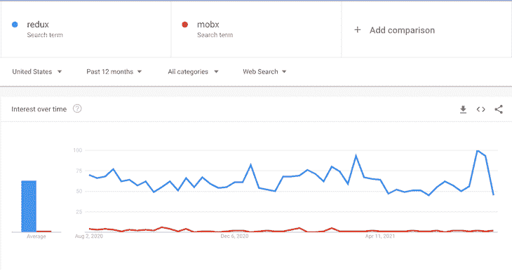
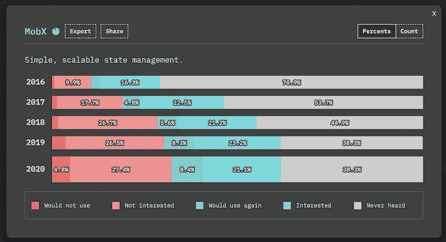

# Redux vs. MobX:哪个表现更好？

> 原文：<https://blog.logrocket.com/redux-vs-mobx/>

***编者按**:本帖最后更新于 2021 年 7 月 29 日。它可能仍然包含过时的信息。*

大型前端应用程序中最难解决的问题之一是状态管理。

虽然有几种方法可以解决状态管理问题，但 Redux 和 MobX 是两种最流行的外部库，它们解决了前端应用程序中的状态管理问题。

在本帖中，我们将看看每个库，以及它们是如何与以下内容相匹配的:

本文假设您对 web 应用程序中的状态管理有一个基本的了解。Redux 和 MobX 都是框架无关的，可以与任何框架或普通 JavaScript 一起工作。

## Redux 是什么？

Redux 是一个流行的状态管理解决方案，它结合了 Flux 和函数式编程概念。Redux 的核心原则包括以下内容:

*   Redux 有一个单独的存储，它提供了单一的真实来源
*   存储中的状态是不可变的
*   动作调用对存储的改变
*   减速器更新状态

## MobX 是什么？

[MobX 是一个状态管理解决方案，有助于管理应用程序中的本地状态](https://blog.logrocket.com/introduction-to-mobx-with-react/)。

MobX 的一些核心原则包括:

*   MobX 可以有多个存储应用程序状态的存储
*   从状态中导出的任何东西，没有任何进一步的相互作用，都是一个推导
*   动作是改变状态的任何一段代码
*   当状态改变时，所有的派生自动地和原子地更新

现在，让我们比较一下 Redux 和 MobX 以及它们的一些关键特性，看看什么更适合你的需求。

## Redux 和 Mobx 受欢迎程度

在开始学习 Redux 或 MobX 之前，让我们看看哪一个更受欢迎。

看看下面的谷歌趋势图，Redux 在过去一年的受欢迎程度上保持了显著优势。



为了更深入地了解他们受欢迎的因素，让我们来看看【2020 年 JavaScript 调查的状态。它发布了过去四年 Redux 和 MobX 在开发者中受欢迎程度的数据。

调查结果显示，67%的受访者满意并会再次使用 Redux，而 64%的受访者表示满意并会再次使用 MobX。

当查看这两种管理解决方案的实际使用情况时，调查结果开始扩大:67%的受访者使用 Redux，而只有 13%的人使用 MobX。

除了兴趣和使用，Redux 和 Mobx 的主要区别在于其品牌认知度。Redux 不是用的多，而是连 MobX 是什么都知道的人更少。




在过去的几年中，Redux 获得了极大的欢迎，并且已经成为国家管理的首选解决方案。根据 JavaScript 的研究状况，在包括 Mobx 在内的其他数据层技术中，仍然是领先的解决方案。


### 人气赢家

Redux 在最受欢迎方面击败 MobX。

## Redux 和 MobX 学习曲线

开发者对 Redux 的普遍看法是，不太好学。2018 年 JavaScript 调查的[状态，分析了 Redux](https://2018.stateofjs.com/data-layer/redux/) 最不喜欢的方面。在这里，开发人员投票表示，他们不喜欢 Redux 的复杂特性及其带来的艰难学习曲线。

使用 Redux，需要一些时间来理解它的模式和范例，以及它的 Flux 架构和函数式编程概念的组合。

对于函数式程序员来说，可能更容易掌握 Redux，而对于具有面向对象编程背景的人来说，Redux 代码最初可能看起来很复杂，很难理解。

学习 Redux 也意味着你需要学习像 Thunk 和 Saga 这样的 [Redux 中间件，增加更多的材料和时间去学习。](https://blog.logrocket.com/data-fetching-in-redux-apps-a-100-correct-approach-4d26e21750fc/)

另一方面，众所周知，MobX 比 Redux 更容易学习。大多数 JavaScript 开发人员都精通面向对象编程，这使得学习 MobX 变得很简单。

此外，在 MobX 中有很多事情是在幕后完成的，为开发人员创造了更好的学习体验。您不需要担心规范化状态或实现像 Thunks 这样的概念，因为抽象已经内置，所以编写的代码更少。

### 学习曲线赢家

MobX 以其更轻松的学习体验胜出。

## 在 Redux 和 MobX 中使用单一存储与多个存储来存储数据

存储是我们存储本地数据和保存整个应用程序状态的地方，通常是在一个 JSON 对象中。

### 为什么 Redux 只有一家店？

在 Redux 中，只有一个商店，而且是唯一的真实来源。存储中的状态是不可变的，这使得我们更容易知道在哪里找到数据/状态。在 Redux 中，虽然有一个 JSON 对象表示存储，但我们总是可以将代码分割成多个 reducers。通过这种方式，我们可以在逻辑上将多个 reducers 的关注点分开。

* * *

### 更多来自 LogRocket 的精彩文章:

* * *

对于许多开发人员来说，这是一种更直观的方法，因为他们总是可以参考单个存储来了解应用程序的状态，并且没有与数据的当前状态相关的重复或混淆的可能性。

### MobX 的多个商店

然而，MobX 允许多个商店。您可以在逻辑上分离存储库，这样应用程序的所有状态就不会在一个存储库中。大多数应用程序设计至少有两个存储:一个用于 UI 状态，一个或多个用于域状态。以这种方式分离存储的优点是允许我们在其他应用程序中重用该域。而且，UI 存储将特定于当前应用程序。

### 存储数据获胜者

这一类的赢家是主观的；这要看开发商的喜好。我个人喜欢将应用程序的整个状态存储在一个存储中。这帮助我把同一个地方称为真理的唯一来源。有些人可能会说，多个商店对他们来说更好，他们更喜欢 MobX。

## Redux 和 MobX 数据结构

Redux 使用普通的 JavaScript 对象作为数据结构来存储状态。使用 Redux 时，必须手动跟踪更新。在有大量状态要维护的应用程序中，这可能更难。

与 Redux 相反，MobX 使用可观察的数据，这有助于通过隐式订阅自动跟踪变化。在 MobX 中，更新是自动跟踪的，因此对开发人员来说更容易。

### 数据结构冠军

MobX 赢得自动跟踪更新。

## Redux 和 MobX 中的纯函数与不纯函数

在 Redux 中，存储中的状态是不可变的，这意味着所有状态都是只读的。Redux 中的动作可以调用状态的变化，reducers 可以用新的状态替换以前的状态。这是 Redux 的核心原则之一。

纯函数的一个简单示例如下所示:

```
function sumOfNumbers(a, b) {
 return a + b;
}
```

给定相同的输入，函数总是返回相同的输出；它没有副作用，也不受外界影响。

Redux 函数是用下面的模式编写的。Reducers 是纯函数，它接受一个状态和动作，然后返回一个新的状态。

```
function(state, action) => newState
```

这让 Redux 很纯粹。如果你有兴趣学习更多关于纯函数以及它们如何在 Redux 中操作的[，你可以阅读这篇文章来更好地理解](https://codeburst.io/redux-reducers-are-coffee-makers-8a78dd8bb7a0)。这是 Redux 最好的特性之一。

然而，在 MobX 中，状态是可变的，这意味着您可以简单地用新值更新状态。这就使得 MobX 不纯。不纯的函数更难测试和维护，因为它们并不总是返回可预测的输出。

### 纯函数与不纯函数的胜者

因为 Redux 存储是纯的，所以更容易预测和恢复状态更新。就 MobX 而言，如果做得不好，状态更新会使调试变得更加困难。

## Redux 和 MobX 样板代码

对 Redux 最大的抱怨之一是随之而来的大量样板代码。而且，当您将 React 与 Redux 集成时，会产生更多的样板代码。这是因为 Redux 本质上是显式的，它的许多功能都必须显式编码。

另一方面，MobX 更含蓄，不需要很多特殊的工具。与 Redux 相比，它的样板代码要少得多，这使得 MobX 更容易学习和设置。

### 样板代码赢家

凭借其简单的设置和学习曲线，MobX 的样板代码胜出。

## Redux 和 MobX 开发人员社区

关于开发者社区，Redux 轻而易举地胜出。Redux 附带了被成千上万的开发者使用的 Redux DevTools。它为调试 Redux 代码提供了惊人的支持。

MobX 也提供开发人员工具，但是它们没有 Redux 提供的同样质量的调试支持。

GitHub 的统计数据很好地表明了这两个库的社区参与度: [Redux 有大约 56k 颗星星，有超过 800 名贡献者](https://github.com/reduxjs/redux)。[另一方面，MobX 拥有大约 24k 名明星和 260 名贡献者](https://github.com/mobxjs/mobx)。

如果我们从 npm 的下载量来看，Redux 遥遥领先。Redux 平均每周下载 500 万次，而 [MobX 平均每周下载 65.5 万次](https://www.npmjs.com/package/mobx)。

### 开发者社区赢家

数字不会说谎:Redux 凭借适应性和在开发社区中的受欢迎程度赢得了胜利。

## Redux 和 MobX 可伸缩性

由于 Redux 更固执己见，期望纯 reducer 功能，所以比 MobX 更容易伸缩。Redux 固执己见和纯粹的特性使其具有可伸缩性。

纯函数更容易测试，因为它们是可预测的和简单的，从而产生可维护的、可伸缩的代码。这是选择 Redux 而不是 MobX 的核心好处之一。

### 可扩展性赢家

Redux 以其固执和纯粹的本性赢得了可伸缩性。

## 结论

好吧，结论是什么？基于开发人员社区、受欢迎程度和可伸缩性，Redux 比 MobX 表现更好。但是如果你想快速上手，用更少的样板代码构建简单的应用程序，MobX 可能是你最好的选择。

## 使用 [LogRocket](https://lp.logrocket.com/blg/signup) 消除传统错误报告的干扰

[](https://lp.logrocket.com/blg/signup)

[LogRocket](https://lp.logrocket.com/blg/signup) 是一个数字体验分析解决方案，它可以保护您免受数百个假阳性错误警报的影响，只针对几个真正重要的项目。LogRocket 会告诉您应用程序中实际影响用户的最具影响力的 bug 和 UX 问题。

然后，使用具有深层技术遥测的会话重放来确切地查看用户看到了什么以及是什么导致了问题，就像你在他们身后看一样。

LogRocket 自动聚合客户端错误、JS 异常、前端性能指标和用户交互。然后 LogRocket 使用机器学习来告诉你哪些问题正在影响大多数用户，并提供你需要修复它的上下文。

关注重要的 bug—[今天就试试 LogRocket】。](https://lp.logrocket.com/blg/signup-issue-free)