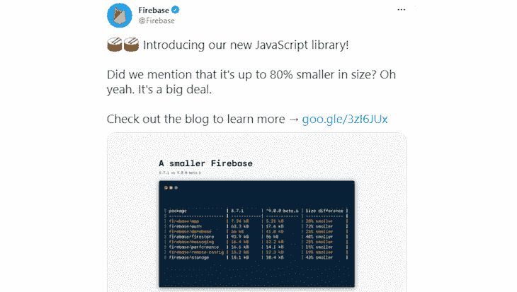

# 使用新的 Firebase v9.x Web SDK 重构 React 应用程序

> 原文：<https://blog.logrocket.com/refactor-react-app-firebase-v9-web-sdk/>

Firebase Web SDK 第 9 版的发布在管理用户和查询数据库的方法上引入了突破性的变化。用 Firebase v8.x 写的代码用在 v9.x 会抛出错误，这就需要重构了。

在这篇文章中，我们将学习如何重构一个使用 Firebase Web SDK v8.x 到 v9.x 的 React 应用程序，它也被称为[模块化 Web SDK](https://firebase.google.com/docs/web/modular-upgrade) 。对于我们的例子，我们将使用用 v8.x 构建的 Amazon 克隆，并将其重构为 v9.x。让我们开始吧！

### 先决条件

要学习本教程，您应该熟悉 React 和 Firebase v8.x，还应该在您的机器上安装 Node.js。

## Firebase v9.x Web SDK 简介

新的 web SDK 脱离了版本 8 中使用的名称空间方法。相反，它采用了一种模块化的格式，这种格式是为了消除不使用的代码而优化的，例如，树抖动，从而显著减小了 JavaScript 包的大小。

向模块化方法的过渡带来了突破性的变化，使新的库向后不兼容，并导致 v8.x 中使用的代码在新的 Firebase v9.x SDK 中抛出错误。

以下代码显示了新库中引入的一些突破性变化:

```
// VERSION 8
import firebase from 'firebase/app';
import 'firebase/auth'; 

firebase.initializeApp();
const auth = firebase.auth();

auth.onAuthStateChanged(user => { 
  // Check for user status
});

// VERSION 9 EQUIVALENT
import { initializeApp } from 'firebase/app';
import { getAuth, onAuthStateChanged } from 'firebase/auth';

const firebaseApp = initializeApp();
const auth = getAuth(firebaseApp);

onAuthStateChanged(auth, user => {
  // Check for user status
});

```

上面的两个代码示例都监视用户状态。尽管两者使用的代码行数相似，但在 v9.x 中，我们没有导入`firebase`名称空间或`firebase/auth`副作用，而是导入并使用单独的函数，这将认证服务扩展到了`firebase`名称空间。

这些变化利用了现代 JavaScript 工具的代码消除特性，如 [Webpack 和 Rollup](https://blog.logrocket.com/benchmarking-bundlers-2020-rollup-parcel-webpack/) 。

例如，上面的 v8.x 代码包括以下代码片段:

```
auth.onAuthStateChanged(user => { 
  // Check for user status
});

```

`auth`是包含`onAuthStateChanged`方法的名称空间和服务。该名称空间还包含类似于`signInWithEmailAndPassword`、`createUserWithEmailAndPassword`和`signOut`的方法，这些方法没有被代码使用。当我们捆绑我们的整个代码时，这些未使用的方法也将包含在捆绑包中，导致相对大小的增加。

虽然像 Webpack 和 Rollup 这样的捆绑器可以用来消除未使用的代码，但是由于名称空间方法，它们将不起作用。解决这个问题是重塑 API 表面以采用模块化形状的主要目标之一。要了解新库变化背后的更多原因，请查看官方 Firebase 博客。

## Firebase 兼容性库

新的 SDK 还包括一个兼容库，具有熟悉的 API 表面，与 v8.x 完全兼容。兼容库允许我们在同一代码库中使用新旧 API，使我们能够在不破坏应用的情况下逐步重构应用。我们可以通过对导入路径做一些调整来使用兼容性库，如下所示:

```
import firebase from 'firebase/compat/app';
import 'firebase/compat/auth';
import 'firebase/compat/firestore';

```

当我们重构 Amazon clone 应用程序时，我们将利用这个库。

## Firebase Web SDK v9.x 的优势

简而言之，Firebase Web SDK v9.x 缩小了尺寸，提高了整体性能。通过利用 Webpack 和 Rollup 等 JavaScript 工具的代码消除功能，新的 web SDK 提供了更快的 web 体验。根据 Firebase Twitter 官方账户，新的 SDK 采用了新的模块化外形，据说比其前身小了约 80%。



## 为重构设置 React 应用程序

现在我们已经熟悉了新的 SDK，让我们学习如何重构我们的 v8.x 应用程序。我们将在本节中使用的亚马逊克隆应用程序是一个使用 Firebase 和 Strapi 构建的电子商务应用程序。

在我们的应用程序中，我们使用 Firebase 添加了一些功能，如通过 Firebase 身份验证管理用户身份，以及通过 Cloud Firestore 存储经过身份验证的用户购买的产品。我们使用 Strapi 来处理在应用程序上购买的产品的付款。最后，我们使用 Express.js 创建了一个 api，该 API 使用一个客户的 Strapi 客户端秘密进行响应，该客户将购买一个具有 Firebase Cloud 功能的产品。

您可以访问站点的[部署版本，如下图所示:](https://challange-5f99e.web.app/)


请随意使用该应用程序，以便更好地理解我们在本文中所做的工作。

### 设置亚马逊克隆应用程序

在我们开始编码之前，首先，让我们从 [GitHub](https://github.com/Tammibriggs/Amazon-clone-FirebaseV8) 克隆 repo 并安装必要的 npm 包。打开您的终端，导航到您想要存储 React 应用程序的文件夹。添加以下命令:

```
$ git clone https://github.com/Tammibriggs/Amazon-clone-FirebaseV8.git
$ cd Amazon-clone-FirebaseV8

```

既然我们已经成功地克隆了 repo，我们需要在安装包之前将文件`package.json`中的 Firebase 版本更改为 v9.x。

在根目录下，打开`package.json`文件，将依赖对象中的`"firebase": "8.10.0"`替换为`"firebase": "9.2.0"`。现在，让我们通过在终端中运行以下命令来安装我们的应用程序的依赖项:

```
$ npm install 
$ cd functions
$ npm install 

```

尽管我们已经设置并安装了我们应用程序的所有依赖项，但是如果我们尝试用`npm start`运行应用程序，它将会抛出错误。为了避免这种情况，我们需要修复我们的应用程序的突破性变化，我们很快就会这样做。

### 反应应用程序结构

我们的应用程序的`src`目录的结构如下，但是我们已经删除了所有的样式文件，使它看起来更短:

```
src
 ┣ Checkout
 ┃ ┣ Checkout.js
 ┃ ┣ CheckoutProduct.js
 ┃ ┗ Subtotal.js
 ┣ Header
 ┃ ┗ Header.js
 ┣ Home
 ┃ ┣ Home.js
 ┃ ┗ Product.js
 ┣ Login
 ┃ ┗ Login.js
 ┣ Orders
 ┃ ┣ Order.js
 ┃ ┗ Orders.js
 ┣ Payment
 ┃ ┣ axios.js
 ┃ ┗ Payment.js
 ┣ App.js
 ┣ firebase.js
 ┣ index.js
 ┣ reducer.js
 ┣ reportWebVitals.js
 ┗ StateProvider.js

```

我们将只处理使用 Firebase 服务的文件，`firebase`、`App.js`、`Header.js`、`Login.js`、`Payment.js`和`Orders.js`，

## 将亚马逊克隆重构为模块化方法

让我们更新到 v9.x compat 库，帮助我们逐步迁移到模块化方法，直到我们不再需要 compat 库。

升级过程遵循重复的模式；首先，它为单个服务重构代码，比如模块化风格的身份验证，然后移除该服务的 compat 库。

### 将导入更新到 v9.x compat 库

转到`src`目录中的`firebase.js`文件，将 v8.x 导入修改为如下代码所示:

```
import firebase from 'firebase/app';
import 'firebase/auth';
import 'firebase/firestore';

```

只做了一些改动，我们就将应用程序更新到了 v9.x compat。现在，我们可以用`npm start`启动我们的应用程序，它不会抛出任何错误。我们还应该在本地启动 Firebase 函数，以公开从 Strapi 获取客户机秘密的 API。

在您的终端中，切换到`functions`目录并运行以下命令来启动该功能:

```
 $ firebase emulators:start

```

### 重构认证码

在`Login.js`、`App.js`和`Header.js`中，我们使用了 Firebase 认证服务。首先，让我们重构`Login.js`文件中的代码，在这里我们创建了创建用户的功能，并使用 Firebase `createUserWithEmailAndPassword`和`signInWithEmailAndPassword`方法让他们登录。当我们浏览`Login.js`文件时，我们会看到下面的 v8.x 代码:

```
// src/Login/Login.js
const signIn = e => {
    ...
    // signIn an existing user with email and password
    auth
      .signInWithEmailAndPassword(email, password)
      ....
  }

  const regiter = e => {
    ...
    // Create a new user with email and password using firebase
    auth
      .createUserWithEmailAndPassword(email, password)
      ....
  }  

```

为了遵循模块化方法，我们将从`auth`模块导入`signInWithEmailAndPassword`和`createUserWithEmailAndPassword`方法，然后更新代码。重构后的版本将类似于下面的代码:

```
// src/Login/Login.js
import {signInWithEmailAndPassword, createUserWithEmailAndPassword} from 'firebase/auth'

...
const signIn = e => {
  ...
  // signIn an existing user with email and password
  signInWithEmailAndPassword(auth, email, password)
  ...
}
const regiter = e => {
  ...
  // Create a new user with email and password using firebase
  createUserWithEmailAndPassword(auth, email, password)
  ...
}  

```

现在，让我们重构`App.js`和`Header.js`文件。在`App.js`文件中，我们使用了`onAuthStateChanged`方法来监控用户登录状态的变化:

```
// src/App.js
useEffect(() => {
  auth.onAuthStateChanged(authUser => {
    ...
  })
}, [])

```

上面代码的模块化版本 9.x 如下所示:

```
// src/App.js
import {onAuthStateChanged} from 'firebase/auth'

...
useEffect(() => {
  onAuthStateChanged(auth, authUser => {
    ...
  })
}, [])

```

在`Header.js`文件中，我们使用了`signOut`方法来注销经过身份验证的用户:

```
// src/Header/Header.js
const handleAuthentication = () => {
  ...
     auth.signOut()
  ...
}

```

更新上面的代码，使其看起来像下面的代码片段:

```
// src/Header/Header.js
import {signOut} from 'firebase/auth'
...
const handleAuthentication = () => {
  ...
    signOut(auth)
  ...
}

```

既然我们已经重构了所有的认证代码，是时候移除 compat 库来获得我们的规模优势了。在`firebase.js`文件中，用以下代码替换`import 'firebase/compat/auth'`和`const auth = firebaseApp.auth()`:

```
import {getAuth} from 'firebase/auth'
...
const auth = getAuth(firebaseApp)

```

## 重构云 Firestore 代码

重构云 Firestore 代码的过程类似于我们刚刚对验证码所做的。我们将使用`Payment.js`和`Orders.js`文件。在`Payment.js`，我们使用 Firestore 来存储在网站上购买产品的用户的数据。在`Payment.js`里面，我们会发现下面的 v8.x 代码:

```
// src/Payment/Payment.js
...
db
  .collection('users')
  .doc(user?.uid)
  .collection('orders')
  .doc(paymentIntent.id)
  .set({
    basket: basket,
    amount: paymentIntent.amount,
    created: paymentIntent.created
  })
...

```

为了重构代码，我们首先必须导入必要的函数，然后更新代码的其余部分。上面代码的 v9.x 如下所示:

```
// src/Payment/Payment.js
import {doc, setDoc} from 'firebase/firestore'

...
const ref = doc(db, 'users', user?.uid, 'orders', paymentIntent.id)
setDoc(ref, {
  basket: basket,
  amount: paymentIntent.amount,
  created: paymentIntent.created
})
...

```

在`Orders.js`文件中，我们使用了`onSnapshot`方法来获得 Firestore 中数据的实时更新。v9.x 代码如下所示:

```
// src/Orders/Orders.js
....
db
  .collection('users')
  .doc(user?.uid)
  .collection('orders')
  .orderBy('created', 'desc')
  .onSnapshot(snapshot => {
     setOrders(snapshot.docs.map(doc => ({
       id: doc.id,
       data: doc.data()
     })))
  })
...

```

v9.x 的等效版本如下:

```
import {query, collection, onSnapshot, orderBy} from 'firebase/firestore'

...
const orderedOrders = query(ref, orderBy('created', 'desc'))
onSnapshot(orderedOrders, snapshot => {
     setOrders(snapshot.docs.map(doc => ({
       id: doc.id,
       data: doc.data()
     })))
  })
...

```

既然我们已经完成了所有云 Firestore 代码的重构，让我们移除 compat 库。在`firebase.js`文件中，用以下代码替换`import 'firebase/compat/firestore'`和`const db = firebaseApp.firestore()`:

```
import { getFirestore } from "firebase/firestore";
...
const db = getFirestore(firebaseApp)
...

```

## 更新初始化代码

将我们的 Amazon clone 应用程序升级到新的模块化 v9.x 语法的最后一步是更新初始化代码。在`firebase.js`文件中，用以下函数替换`import firebase from 'firebase/compat/app';`和常量`firebaseApp = firebase.initializeApp(firebaseConfig)`:

```
import { initializeApp } from "firebase/app"
...
const firebaseApp = initializeApp(firebaseConfig)
...

```

现在，我们已经成功升级了我们的应用程序，以遵循新的 v9.x 模块化格式。

## 结论

由于其模块化格式，新的 Firebase v9.x SDK 提供了比其 v8.x 前身更快的 web 体验。本教程介绍了新的 SDK，并解释了如何使用其精简库来反射 React 应用程序。您应该能够按照本文概述的方法和步骤将自己的应用程序升级到最新版本。

如果你在重构你的 React 应用程序时仍然有困难，一定要看看下面的 Firebase 支持社区:

## [LogRocket](https://lp.logrocket.com/blg/react-signup-general) :全面了解您的生产 React 应用

调试 React 应用程序可能很困难，尤其是当用户遇到难以重现的问题时。如果您对监视和跟踪 Redux 状态、自动显示 JavaScript 错误以及跟踪缓慢的网络请求和组件加载时间感兴趣，

[try LogRocket](https://lp.logrocket.com/blg/react-signup-general)

.

[ ](https://lp.logrocket.com/blg/react-signup-general) [](https://lp.logrocket.com/blg/react-signup-general) 

LogRocket 结合了会话回放、产品分析和错误跟踪，使软件团队能够创建理想的 web 和移动产品体验。这对你来说意味着什么？

LogRocket 不是猜测错误发生的原因，也不是要求用户提供截图和日志转储，而是让您回放问题，就像它们发生在您自己的浏览器中一样，以快速了解哪里出错了。

不再有嘈杂的警报。智能错误跟踪允许您对问题进行分类，然后从中学习。获得有影响的用户问题的通知，而不是误报。警报越少，有用的信号越多。

LogRocket Redux 中间件包为您的用户会话增加了一层额外的可见性。LogRocket 记录 Redux 存储中的所有操作和状态。

现代化您调试 React 应用的方式— [开始免费监控](https://lp.logrocket.com/blg/react-signup-general)。