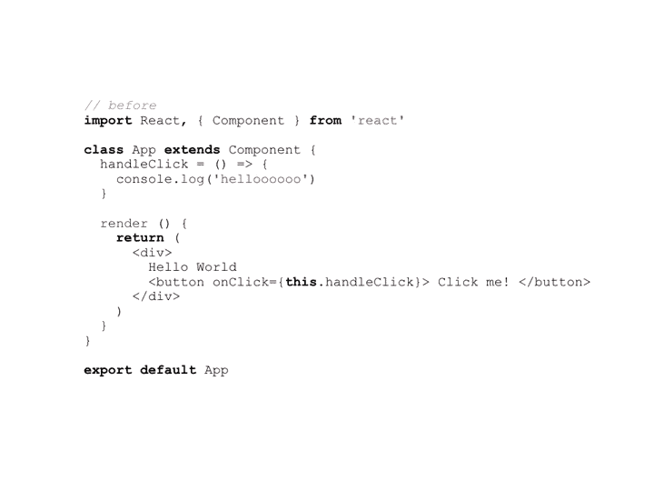
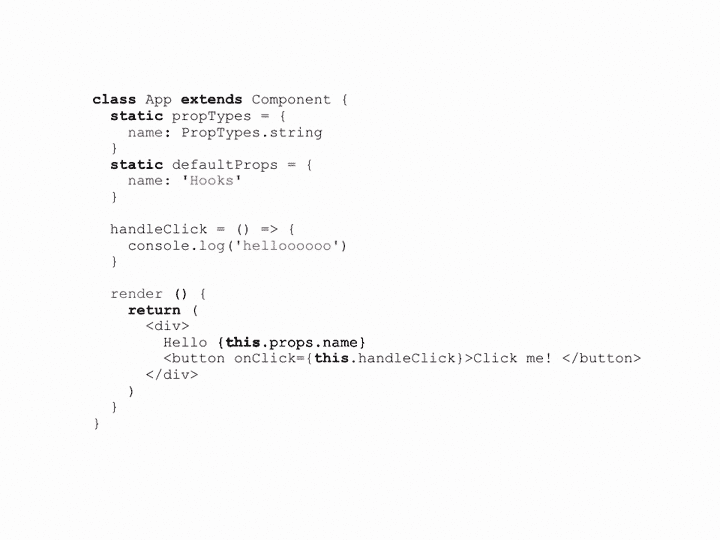
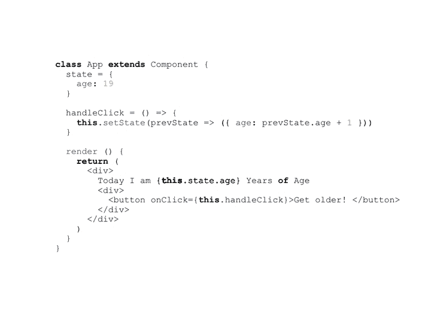
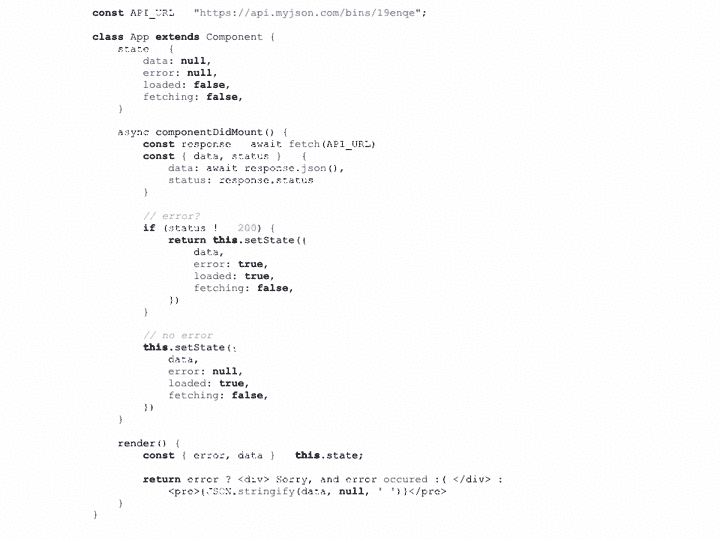
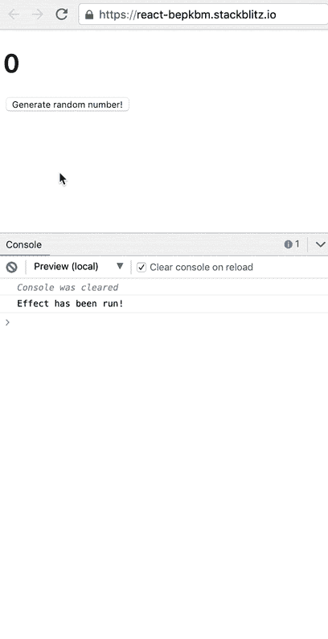
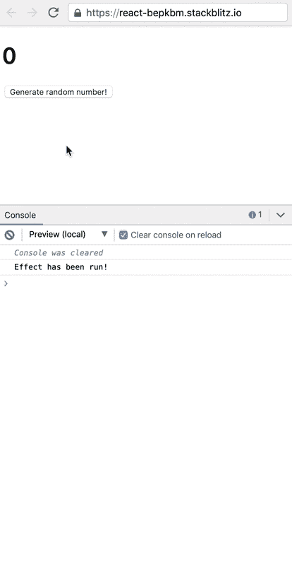
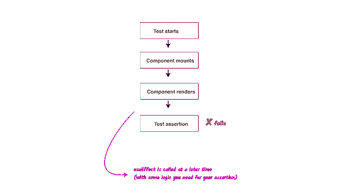
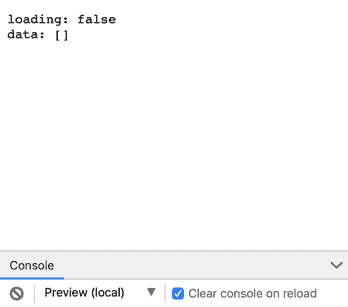

# 如何重构 React 组件以使用钩子

> 原文：<https://blog.logrocket.com/refactor-react-components-hooks/>

***编者按:*** *本帖更新于 2022 年 8 月 15 日，以验证代码准确性。*

重构您现有的应用程序或组件以使用 React 钩子带来了一系列独特的挑战。在本文中，我们将讨论一些适用于各种应用程序类型的重构的一般性问题，从基本问题开始，然后讨论更高级的用例。

我们将讨论以下内容:

要阅读本文，您应该对 React 钩子如何工作有所了解。我们开始吧！

## 将类组件转换为函数组件

当你开始使用 React 钩子重构你的应用程序时，你将面临的第一个问题恰好是其他挑战的根源:你如何在不破坏任何功能的情况下将你的类组件[重构为函数组件](https://blog.logrocket.com/what-are-react-pure-functional-components/#react-functional-class-components)？

让我们从最简单的开始，看看您会遇到的一些最常见的用例。

### 没有状态或生命周期方法的类组件



对于高级开发人员来说，上面的 gif 可能提供了足够的上下文来指出从类到函数组件的重构中的差异。我们来详细探究一下；下面的代码显示了您将拥有的最基本的用例，一个只呈现一些 JSX 的类组件:

```
// before
import React, {Component} from 'react';

class App extends Component {
  handleClick = () => {
    console.log("helloooooo")
  }

  render() {
    return (
      <div> 
        Hello World 
        <button onClick={this.handleClick}>
          Click me! 
        </button>
      </div> 
    )
  }
}

export default App

```

重构这个组件非常简单:

```
// after 
import React from 'react'

function App() {
  const handleClick = () => {
    console.log("helloooooo")
  }

  return (
    <div> 
      Hello World 
      <button onClick={handleClick}> Click me! </button>
    </div> 
  ) 
}

export default App

```

在上面的代码中，我们用 JavaScript 函数替换了关键字`class`。我们没有使用`render()`函数，而是直接通过父`App()`函数返回，它是一个组件。最后，在我们的函数组件中，我们不使用`this`。相反，我们在函数范围内用一个 JavaScript 值替换它。

### 具有属性、默认属性值和`propType`声明的类组件



类组件是另一个没有太多开销的简单用例:

```
// before
class App extends Component {
  static propTypes = {
    name: PropTypes.string
  }
  static defaultProps = {
    name: "Hooks"
  }

  handleClick = () => {
    console.log("helloooooo")
  }

  render() {
    return <div> 
      Hello {this.props.name} 
      <button onClick={this.handleClick}> Click me! </button>
    </div>    
  }
}

```

重构后，我们有以下代码:

```
function App({name = "Hooks"}) {
  const handleClick = () => {
    console.log("helloooooo")
  }

  return <div> 
      Hello {name} 
      <button onClick={handleClick}>Click me! </button>
    </div>
}

App.propTypes = {
  name: PropTypes.number
}

```

如您所见，作为一个功能组件，该组件看起来要简单得多。`props`成为组件函数的函数参数，默认属性通过 ES6 默认参数语法处理，`static propTypes`被替换为`App.propTypes`。

### 具有状态的类组件:单个或少数多个键

当您拥有一个带有实际状态对象的类组件时，这个场景会变得有趣得多。您的许多类组件都属于这一类别，或者这一类别的一个稍微复杂一点的版本。

考虑下面的类组件:

```
class App extends Component {
  state = {
    age: 19
  }

  handleClick = () => {
    this.setState((prevState) => ({age: prevState.age + 1}))
  }

  render() {
    return <div> 
      Today I am {this.state.age} Years of Age 
      <div> 
        <button onClick={this.handleClick}>Get older! </button>
      </div>
    </div>
  }
}

```

该组件仅跟踪状态对象中的单个属性。很简单！



我们可以重构这段代码来使用`useState`钩子，它用于管理 React 中的状态，如下所示。请注意我们如何将 state 的默认值作为参数`useState()`传入:

```
function App() {
  const [age, setAge] = useState(19);
  const handleClick = () => setAge(age + 1)

  return <div> 
      Today I am {age} Years of Age 
      <div> 
        <button onClick={handleClick}>Get older! </button>
      </div>
   </div>
}

```

那看起来简单多了！


如果这个组件有更多的状态对象属性，您可以使用多个`useState`调用，如下所示:

```
function App() {
  const [age, setAge] = useState(19);
  const [status, setStatus] = useState('married')
  const [siblings, setSiblings] = useState(10)

  const handleClick = () => setAge(age + 1)

  return (
   <div> 
      Today I am {age} Years of Age 
      <div> 
        <button onClick={handleClick}>Get older! </button>
      </div>
   </div>
  )
}

```

您可以在`useState()`中创建一个对象，但是，管理那个状态将会相当困难，导致所有的字段都重新呈现在屏幕上。尽管这个例子相当简单，我还是推荐[查看这个指南以获得更多的例子](https://blog.logrocket.com/a-guide-to-usestate-in-react-ecb9952e406c/)。

## 为增量挂钩的采用做出权衡

虽然重新编写应用程序和组件来使用钩子听起来很棒，但这是有代价的，首先是时间和人力。

如果你正在处理一个大的代码库，你可能需要在采用钩子的早期做出一些权衡。作为一个示例场景，让我们考虑以下组件:

```
const API_URL = "https://api.myjson.com/bins/19enqe";

class App extends Component {
  state = {
    data: null,
    error: null,
    loaded: false,
    fetching: false,
  }

  async componentDidMount() {
    const response = await fetch(API_URL)
    const { data, status } = {
      data: await response.json(),
      status: response.status
    }

    // error? 
    if (status !== 200) {
      return this.setState({
        data,
        error: true,
        loaded: true,
        fetching: false,
      })
    }

    // no error 
    this.setState({
      data,
      error: null,
      loaded: true,
      fetching: false,
    })
  }

  render() {
    const { error, data } = this.state;

    return error ? <div> "Sorry, an error occurred :(" </div> :
      <pre>{JSON.stringify(data, null, ' ')}</pre>
  }
}

```

上面的组件在挂载时向远程服务器请求获取一些数据，然后根据结果设置状态。您应该关注`setState`调用，而不是关注异步逻辑:

```
class App extends Component {
 ... 

  async componentDidMount() {
    ...

    if (status !== 200) {
      this.setState({
        data,
        error: true,
        loaded: true,
        fetching: false,
      })
    }

    this.setState({
      data,
      error: null,
      loaded: true,
      fetching: false,
    })
  }

  render() {
    ...
  }
}

```

`setState`调用接受一个具有四个属性的对象。虽然这只是一个例子，但一般情况下，您的组件会使用许多对象属性进行`setState`调用。

使用 React 钩子，您可能会将每个对象值分成单独的`useState`调用。您可以使用带有`useState`的对象，但是这些属性是不相关的，并且在这里使用对象可能会使以后将代码分解成独立的定制钩子更加困难。

因此，重构可能类似于下面的代码:

```
... 
  const [data, setData] = useState(null);
  const [error, setError] = useState(null);
  const [loaded, setLoading] = useState(false);
  const [fetching, setFetching] = useState(false);
...

```

您还必须更改`this.setState`调用，如下所示:

```
// no more this.setState calls - use updater functions. 
 setData(data);
  setError(null);
  setLoading(true);
  fetching(false);

```

虽然这样做是可行的，但是如果组件中有很多`setState`调用，那么您将会多次编写这些调用，或者将它们分组到另一个自定义钩子中。

如果你想在你的代码库中实现一个钩子的增量式应用，只需要更少的代码修改和稍微相似的`setState`签名，那会怎么样呢？在这种情况下，你确实要做出取舍；在这里，我们将介绍一下`useReducer`挂钩。`useReducer`有如下签名:

```
const [state, dispatch] = useReducer(reducer)

```

`reducer`是接受状态和动作并返回一个`newState`的函数:

```
const [state, dispatch] = useReducer((state, action) => newState)

```

从减速器返回的`newState`然后通过`state`变量被组件消耗。

如果你以前用过 Redux，那么你就知道你的`action`一定是一个具有某种`type`属性的对象。然而，`useReducer`却不是这样。相反，`reducer`函数接收`state`和一些`action`，然后返回一个新的状态对象。我们可以利用这一点进行不那么痛苦的重构，如下所示:

```
... 
function AppHooks() {
  ... 
 const [state, setState] = useReducer((state, newState) => (
{...state, ...newState}
  ));

 setState({
    data,
    error: null,
    loaded: true,
    fetching: false,
  })
}

```

我们没有在组件的任何地方改变大多数的`this.setState`调用，而是选择了一种更简单的、增量的方法，这种方法不涉及大量的代码更改。

不用使用`this.setState({data, error: null, loaded: null,fetching: false})`，用钩子，你可以直接移除`this.`，而`setState`调用仍然可以工作。下面的代码使这成为可能:

```
const [state, setState] = useReducer((state, newState) => (
{ ...state, ...newState }
));

```

当您试图更新状态时，传递给`setState`(通常称为`dispatch`)的任何内容都将作为第二个参数传递给 reducer。我们称之为`newState`。

不像 Redux 中的[实现复杂的`switch`语句，我们只是返回一个新的状态对象，用传入的新值覆盖之前的状态。这类似于`setState`的工作方式，更新状态属性而不是替换整个对象。](https://blog.logrocket.com/react-router-with-redux-navigation-state/)

有了这个解决方案，你就可以更容易地在你的代码库中采用一个增量式的钩子，一个没有很多代码变化并且具有相似的`setState`签名的钩子。下面是完整的重构代码，代码更改较少:



```
function AppHooks() {
  const initialState = {
    data: null,
    error: null,
    loaded: false,
    fetching: false,
  }
  const reducer = (state, newState) => ({ ...state, ...newState })
  const [state, setState] = useReducer(reducer, initialState);

  async function fetchData() {
    const response = await fetch(API_URL);
    const { data, status } = {
      data: await response.json(),
      status: response.status
    }

    // error? 
    if (status !== 200) {
      setState({
        data,
        error: true,
        loaded: true,
        fetching: false,
      })
    }

    // no error 
    setState({
      data,
      error: null,
      loaded: true,
      fetching: false,
    })
  }

  useEffect(() => {
    fetchData()
  }, [])

  const { error, data } = state
  return error ?  Sorry, and error occured :(  :
    <pre>{JSON.stringify(data, null, ' ')}</pre>
}

```

## 简化生命周期方法

您将面临的另一个常见挑战是重构组件的`componentDidMount`、`componentWillUnmount`和`componentDidUpdate`生命周期方法中的逻辑。

`useEffect`钩子是提取这种逻辑的最佳地方。默认情况下，`useEffect`内的效果函数会在每次渲染后运行。如果你熟悉钩子，这是常识:

```
import { useEffect } from 'react'
useEffect(() => {
   // your logic goes here
   // optional: return a function for canceling subscriptions 
   return () => {}
})

```

`useEffect`钩子的一个有趣的特性是你可以传入的第二个参数，依赖数组。考虑下面的例子:

```
import { useEffect } from 'react'
useEffect(() => {

}, []) // 
 array argument

```

在这里传递一个空数组只会在组件挂载的时候运行效果函数，在组件卸载的时候清理它。这非常适合于在组件挂载时希望跟踪或获取一些数据的情况。

下面是一个向依赖数组传递值的示例:

```
import { useEffect } from 'react'
useEffect(() => {

}, [name]) // 
 array argument with a value

```

这里的含义是，当组件安装时，效果函数将被调用，并且每当`name`变量的值改变时，效果函数也将被调用。

* * *

### 更多来自 LogRocket 的精彩文章:

* * *

## 比较`useEffect`对象值

`useEffect`钩子接受一个函数参数，这可能会产生一些副作用:

```
useEffect(doSomething)

```

`useEffect`钩子还接受第二个参数，即函数中的效果所依赖的一组值。例如:

```
useEffect(doSomething, [name])

```

在上面的代码中，`doSomething`函数将只在`name`值改变时运行。此功能非常有用，因为您可能不希望效果在每次渲染后运行，这是默认行为。

然而，这引起了另一个问题。为了使`useEffect`仅在`name`改变时调用`doSomething`函数，它将之前的`name`值与其当前值进行比较，即`prevName === name`。

虽然这对原始的 JavaScript 值类型很有用，但是如果`name`是一个对象呢？在 JavaScript 中，对象通过引用进行比较。从技术上来说，如果`name`是一个对象，它在每次渲染时总是不同的。因此，`prevName === name`检查将永远是假的。

这意味着，`doSomething`函数将在每次渲染后运行，这可能是一个性能问题，取决于您的应用程序类型。让我们来回顾一下这个问题的解决方案。考虑下面的小组件:

```
function RandomNumberGenerator () {
  const name = 'name'

  useEffect(
    () => {
      console.log('Effect has been run!')
    },
    [name]
  )

  const [randomNumber, setRandomNumber] = useState(0)

  return (
    <div>
      <h1>{randomNumber}</h1>
      <button
        onClick={() => {
          setRandomNumber(Math.random())
        }}
      >
        Generate random number!
      </button>
    </div>
  )
}

```

该组件呈现一个按钮和一个随机数。单击该按钮后，会生成一个新的随机数:


注意`useEffect`钩子的效果取决于`name`变量:

```
useEffect(() => {
    console.log("Effect has been run!")
  }, [name])

```

在这个例子中，`name`变量是一个简单的字符串。该效果将在组件挂载时运行。因此，`console.log("Effect has been run!")`将被调用。

在随后的渲染中，将进行浅层比较，例如，`prevName === name`，其中`prevName`表示在新的渲染之前`name`的先前值。

字符串是按值比较的，所以`"name" === "name"`始终为真。所以，效果不会跑。因此，您只获得一次日志输出`Effect has been run!`:



现在，将`name`变量改为一个对象:

```
function RandomNumberGenerator() {
  // look here 
  const name = {firstName: "name"}

  useEffect(() => {
    console.log("Effect has been run!")
  }, [name])

  const [randomNumber, setRandomNumber] = useState(0);    

  return (
    <div>
      <h1>{randomNumber}</h1>
      <button onClick={()=> setRandomNumber(Math.random())}>Generate random number!</button>
    </div>
  );
}

```

在这种情况下，第一次渲染后会再次执行浅层检查。但是，由于对象是通过引用而不是通过值进行比较的，因此比较会失败。例如，以下表达式返回`false`:

```
{firstName: "name"} === {firstName: "name"}

```

因此，效果会在每次渲染后运行，您会得到大量日志:



### 使用`JSON.stringify`

要阻止这种情况发生，请运行下面的代码:

```
...useEffect(() => {
    console.log("Effect has been run!")
}, [JSON.stringify(name)])

```

通过使用`JSON.stringify(name)`，被比较的值现在是一个字符串，将通过值进行比较。尽管这很有效，但您应该谨慎行事。您应该只在具有简单值和容易序列化的数据类型的对象上使用`JSON.stringify`。

### 使用手动条件检查

使用手动条件检查包括跟踪以前的值，在本例中为`name`，并对其当前值进行深度比较检查。但是，您会注意到它包含了更多的代码:

```
// the isEqual function can come from anywhere 
// - as long as you perform a deep check. 
// This example uses a utility function from Lodash
import {isEqual} from 'lodash'

function RandomNumberGenerator() {
  const name = {firstName: "name"}

  useEffect(() => {
    if(!isEqual(prevName.current, name)) {
      console.log("Effect has been run!")
    }
  })

  const prevName = useRef; 
  useEffect(() => {
    prevName.current = name
  })

  const [randomNumber, setRandomNumber] = useState(0);

  return <div>
    <h1> {randomNumber} </h1>
    <button onClick={() => { setRandomNumber(Math.random()) }}>
       Generate random number!
    </button>
  </div>
}

```

接下来，在运行效果之前，我们将检查这些值是否不相等:

```
!isEqual(prevName.current, name)

```

什么是`prevName.current`？通过钩子，您可以使用`useRef`钩子来跟踪值。在上面的例子中，下面的代码段负责:

```
const prevName = useRef; 
useEffect(() => {
    prevName.current = name
})

```

上面的命令保持跟踪先前的`useEffect`钩子中使用的先前的`name`。我知道这可能很难理解，所以我在下面提供了完整代码的注释版本:

```
/**
 * To read the annotations correctly, read all turtle comments first 

 // - from top to bottom. 
 * Then come back to read all unicorns 
 - from top to bottom. 
 */

function RandomNumberGenerator() {
  // 
 1\. The very first time this component is mounted, 
  // the value of the name variable is set below
  const name = {firstName: "name"}

  // 
 2\. This hook is NOT run. useEffect only runs sometime after render
  // 
 6\. After Render this hook is now run. 
  useEffect(() => {

  // 
 7\. When the comparison happens, the hoisted value 
  // of prevName.current is "undefined". 
  // Hence, "isEqual(prevName.current, name)" returns "false" 
  // as {firstName: "name"} is NOT equal to undefined.
    if(!isEqual(prevName.current, name)) {

  // 
 8\. "Effect has been run!" is logged to the console.       
  //console.log("Effect has been run!")
    }
  })

  // 
 3\. The prevName constant is created to hold some ref. 
  const prevName = useRef; 

  // 
 4\. This hook is NOT run 
  // 
 9\. The order of your hooks matter! After the first useEffect is run, 
  // this will be invoked too.  
  useEffect(() => {
    // 
 10\. Now "prevName.current" will be set to "name". 
    prevName.current = name; 
   // 
 11\. In subsequent renders, the prevName.current will now hold the same 
    // object value - {firstName: "name"} which is alsways equal to the current 
    // value in the first useEffect hook. So, nothing is logged to the console. 
  // 
 12\. The reason this effect holds the "previous" value is because 
    // it'll always be run later than the first hook.  
   })

  const [randomNumber, setRandomNumber] = useState(0)

  // 
 5\. Render is RUN now - note that here, name is equal to the object, 
  // {firstName: "name"} while the ref prevName.current holds no value. 
  return
{randomNumber}
{ setRandomNumber(Math.random()) }}> Generate random number! }

```

### 使用`useMemo`挂钩

在我看来，挂钩提供了一个非常优雅的解决方案:

```
function RandomNumberGenerator() {
  // look here 

  const name = useMemo(() => ({
    firstName: "name"
  }), [])

  useEffect(() => {
      console.log("Effect has been run!")
  }, [name])

  const [randomNumber, setRandomNumber] = useState(0)
  return (
    <div>
      <h1>{randomNumber}</h1>
      <button onClick={()=> setRandomNumber(Math.random()) }> Generate random number! </button>
    </div>
  )
}

```

`useEffect`挂钩仍然依赖于`name`值，但是在这里，`name`值被记忆，由`useMemo`提供:

```
const name = useMemo(() => ({
    firstName: "name"
}), [])

```

`useMemo`接受一个返回特定值的函数。在这种情况下，对象`{firstName: "name"}`。`useMemo`的第二个参数是一组依赖项，就像`useEffect`中的那些一样。如果没有传递数组，则每次渲染时都会重新计算该值。

传递一个空数组会在安装组件时计算该值，而不会跨呈现重新计算该值。这使得`name`值在渲染中通过引用保持不变。

尽管`name`是一个对象，但是`useEffect`钩子现在应该像预期的那样工作，而不需要多次调用效果。`name`现在是一个记忆化的对象，在渲染中具有相同的引用:

```
...useEffect(() => {
      console.log("Effect has been run!")
}, [name]) // 
 name is memoized!

```

## 修复因`useEffect`而中断的测试

当你重构你的应用程序或组件来使用钩子时，你可能面临的一个更令人不安的问题是，你的一些旧测试现在可能会无缘无故地失败。

如果你发现自己处于这种境地，请理解失败的测试确实是有原因的。使用`useEffect`，需要注意的是效果回调不是同步运行的；它在渲染后的稍后时间运行。因此，`useEffect`与有`componentDidUpdate`和`componentWillUnmount`的`componentDidMount`不太一样。

由于这种异步行为，当您引入`useEffect`时，一些(如果不是全部)旧测试现在可能会失败。



作为一个解决方案，在这种情况下，使用来自`[ReactTestUtils](https://reactjs.org/docs/test-utils.html)`的`[act()](https://reactjs.org/docs/test-utils.html#act)`实用程序会有很大帮助。如果您使用 [React 测试库](https://github.com/kentcdodds/react-testing-library)进行测试，那么它可以很好地与`act()`集成。使用 React 测试库，您仍然需要将测试中的手动更新(如状态更新或触发事件)打包到`act()`中:

```
act(() => {
    /* fire events that update state */
});
/* assert on the output */

```

我推荐查看 GitHub 上的[讨论中的例子，以及](https://github.com/testing-library/react-testing-library/issues/281#issuecomment-461145962)[在`act()`](https://github.com/testing-library/react-testing-library/issues/281) 内进行异步调用的讨论。最后，你会发现`act()`如何在[GitHub repo](https://github.com/threepointone/react-act-examples)中工作的惊人例子。

如果你使用像[酵素](https://blog.logrocket.com/getting-started-with-enzyme-for-react-a106b58fc53b/)这样的测试库，并且在你的测试中有一些实现细节，比如调用像`instance()`和`state()`这样的方法，你会遇到另一个与测试失败相关的问题。在这些情况下，仅仅通过将组件重构为功能组件，您的测试就可能失败。

## 重构渲染道具 API 的更安全的方法

我倾向于到处使用渲染道具 API。幸运的是，重构一个使用 render props API 的组件来使用基于钩子的实现并没有什么大不了的。然而，有一个小问题。考虑以下公开渲染属性 API 的组件:

```
class TrivialRenderProps extends Component {
  state = {
    loading: false,
    data: []
  }
  render() {
    return this.props.children(this.state)
  }
}

```

虽然这是一个做作的例子，但是已经足够好了！下面是我们如何使用该组件的示例:

```
function ConsumeTrivialRenderProps() {
  return <TrivialRenderProps>
    {({loading, data}) => {
      return <pre>
        {`loading: ${loading}`} <br />
        {`data: [${data}]`}
      </pre>
    }}
  </TrivialRenderProps>
}

```

渲染`ConsumeTrivialRenderProps`组件仅显示从渲染道具 API 接收的`loading`和`data`的值:



到目前为止，一切顺利！render props 的问题是它会让你的代码看起来比你想要的更加嵌套。幸运的是，如前所述，将`TrivialRenderProps`组件重构为 Hooks 实现并不是什么大事。

为此，您只需将组件实现包装在一个自定义钩子中，并返回与以前相同的数据。如果操作正确，重构后的钩子 API 将如下使用:

```
function ConsumeTrivialRenderProps() {
  const { loading, setLoading, data } = useTrivialRenderProps()
  return <pre>
    {`loading: ${loading}`} <br />
    {`data: [${data}]`}
  </pre>
}

```

这看起来整洁多了！下面是我们的定制`useTrivialRenderProps`钩子:

```
function useTrivialRenderProps() {
  const [data, setData] = useState([])
  const [loading, setLoading] = useState(false)
 return {
    data,
    loading,
  }
}

```

就是这样！

```
// before 
class TrivialRenderProps extends Component {
  state = {
    loading: false,
    data: []
  }
  render() {
    return this.props.children(this.state)
  }
}

// after 
function useTrivialRenderProps() {
  const [data, setData] = useState([])
  const [loading, setLoading] = useState(false)

  return {
    data,
    loading,
  }
}

```

在处理大型代码库时，您可能会在许多不同的地方使用某个渲染属性 API。将组件的实现更改为使用钩子意味着您必须更改组件在许多不同地方的使用方式。

我们可以在这里做些交易吗？绝对的！您可以重构组件以使用钩子，但也可以公开一个呈现道具 API。通过这样做，你可以在你的代码库中逐步采用钩子，而不是一次改变很多代码。下面是一个例子:

```
// hooks implementation 
function useTrivialRenderProps() {
  const [data, setData] = useState([])
  const [loading, setLoading] = useState(false)
  return {
    data,
    loading,
  }
}
// render props implementation 
const TrivialRenderProps = ({children, ...props}) => children(useTrivialRenderProps(props));
// export both 
export { useTrivialRenderProps };  
export default TrivialRenderProps;

```

通过导出这两个实现，您可以在整个代码库中逐步采用钩子。以前的渲染道具消费者和新的钩子消费者将完美地工作:

```
// this will work 

function ConsumeTrivialRenderProps() {
  return <TrivialRenderProps>
    {({loading, data}) => {
      return <pre>
        {`loading: ${loading}`} <br />
        {`data: [${data}]`}
      </pre>
    }}
  </TrivialRenderProps>
}
// so will this 

function ConsumeTrivialRenderProps() {
  const { loading, setLoading, data } = useTrivialRenderProps()
  return <pre>
    {`loading: ${loading}`} <br />
    {`data: [${data}]`}
  </pre>
}

```

有趣的是，新的渲染道具实现也在钩子下使用钩子:

```
// render props implementation 
const TrivialRenderProps = ({children, ...props}) => children(useTrivialRenderProps(props));

```

## 处理状态初始化器

基于某些计算初始化某些状态属性的类组件并不少见。下面是一个基本的例子:

```
class MyComponent extends Component {
  constructor(props) {
    super(props)
    this.state = { token: null }
    if (this.props.token) {
      this.state.token = this.props.token
    } else {
      token = window.localStorage.getItem('app-token');
      if (token) {
        this.state.token = token
      }
    }
  }
}
```

虽然我们的例子很简单，但它显示了一个普遍的问题。有可能你的组件一挂载，你就根据一些计算在`constructor`中设置一些初始状态。

在这个例子中，我们检查是否传入了一个`token`属性，或者本地存储中是否有一个`app-token`键，然后我们基于此设置状态。在重构钩子时，如何处理这样的逻辑来设置初始状态？

也许`useState`钩子的一个鲜为人知的特性是，你传递给`useState`钩子的`initialState`参数`useState(initialState)`也可能是一个函数！

从这个函数返回的任何内容都将被用作`initialState`。下面的代码展示了组件被重构为使用钩子后的样子:

```
function MyComponent(props) {
   const [token, setToken] = useState(() => {
     if(props.token) {
       return props.token 
     } else {
       tokenLocal = window.localStorage.getItem('app-token');
       if (tokenLocal) {
         return tokenLocal
       }
     }
   })   
}

```

从技术上讲，逻辑几乎保持不变。这里重要的是，如果你需要根据一些逻辑初始化状态，你可以使用`useState`中的函数。

## 结论

重构应用程序来使用钩子并不是你必须做的事情。你应该为你自己和你的团队权衡不同的选择。您可以选择保留基于类的组件，因为它们仍然可以与基于功能的组件一起工作。然而，如果您选择重构您的组件来使用 Hooks API，那么我希望您已经在本文中找到了一些很好的技巧。有问题一定要在下面留言评论，编码愉快！

## [LogRocket](https://lp.logrocket.com/blg/react-signup-general) :全面了解您的生产 React 应用

调试 React 应用程序可能很困难，尤其是当用户遇到难以重现的问题时。如果您对监视和跟踪 Redux 状态、自动显示 JavaScript 错误以及跟踪缓慢的网络请求和组件加载时间感兴趣，

[try LogRocket](https://lp.logrocket.com/blg/react-signup-general)

.

[ ](https://lp.logrocket.com/blg/react-signup-general) [](https://lp.logrocket.com/blg/react-signup-general) 

LogRocket 结合了会话回放、产品分析和错误跟踪，使软件团队能够创建理想的 web 和移动产品体验。这对你来说意味着什么？

LogRocket 不是猜测错误发生的原因，也不是要求用户提供截图和日志转储，而是让您回放问题，就像它们发生在您自己的浏览器中一样，以快速了解哪里出错了。

不再有嘈杂的警报。智能错误跟踪允许您对问题进行分类，然后从中学习。获得有影响的用户问题的通知，而不是误报。警报越少，有用的信号越多。

LogRocket Redux 中间件包为您的用户会话增加了一层额外的可见性。LogRocket 记录 Redux 存储中的所有操作和状态。

现代化您调试 React 应用的方式— [开始免费监控](https://lp.logrocket.com/blg/react-signup-general)。