# 重构 Redux 应用程序以使用反冲日志火箭博客

> 原文：<https://blog.logrocket.com/refactoring-redux-app-to-use-recoil/>

反冲是几个月前才发布的，但 GitHub 上已经有近 9K 颗星星了，新的状态管理库正在飙升。

在这篇文章中，我将讨论如何重构一个 Redux 应用程序来反冲。我的目标不是重构一个巨大的 Redux app 来反冲，而是重构三个小 app 来反冲。我来分享一下原因。

一个非常好的学习策略是从已知到未知——在这种情况下，从重复到反冲。这是一个有效的学习策略，尤其是如果你已经有了相当不错的 Redux 使用经验的话。

我相信您会更好地理解这两个库之间的区别(至少在 API 实现方面),并理解为什么反冲如此突出。也有可能你会发现自己处于一种不得不重构 Redux 应用程序的境地。这篇文章将为您提供这样做的基础。

如果你对反冲完全陌生，请查看我的快速介绍文章，因为我会假设你从现在开始理解反冲中的原子和选择器。

让我们开始吧。

### HelloUI:用于 UI 开发的 hello world 应用

许多编程教程都是从 hello world 程序开始的。对于 UI 开发，我们通常不这样做，但是我建议我们这样做。

考虑一下用于 UI 开发的 hello world 应用程序。

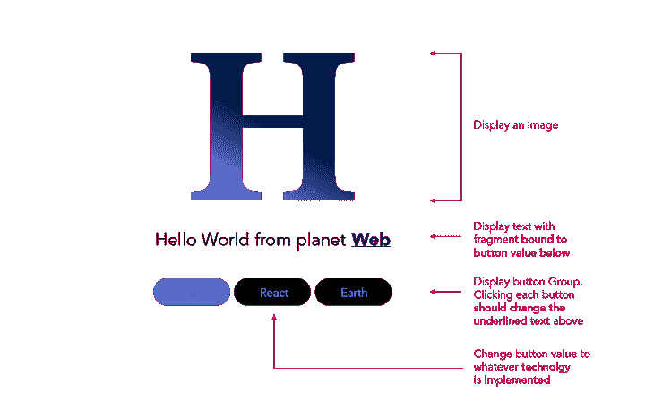

HelloUI: The hello world app for UI development.

请随意查看 HelloUI 官方[自述](https://github.com/ohansemmanuel/HelloUI)中的动机和方法。

我们首先要做的是重构一个 hello world Redux 应用程序来反冲。之后，我们将继续重构更复杂的 Redux 应用程序。

## 我们不只是写 Redux，我们也谈论它。现在听着:

或者以后订阅

### Redux 应用#1: Hello world

## hello world 应用已经用 [create-react-app](https://github.com/facebook/create-react-app) 引导，通过 [react-redux](https://github.com/reduxjs/react-redux) 提供 Redux 的 react 绑定。


开始重构的第一个地方是根文件。使用 react-redux，您必须将入口组件包装在一个传递了`store`属性的`Provider`组件中。

对于反冲，您也需要将根组件包装在一个“提供者”组件中。然而，不需要商店道具；那是一个与反冲格格不入的概念。

```
import { Provider } from "react-redux";
import { store } from "./App";

... 

<Provider store={store}>
      <App />
</Provider>
...
```

这些变化应该是这样的:

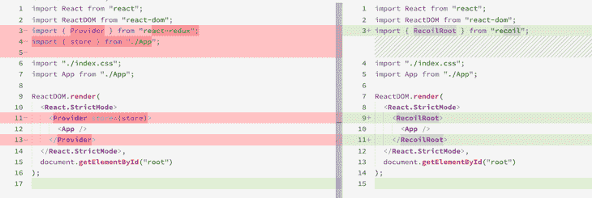

```
import { RecoilRoot } from "recoil";

...
<RecoilRoot>
   <App />
</RecoilRoot>
...
```

需要反冲状态的组件必须在父树中有`RecoilRoot`组件。

在内部，`RecoilRoot`组件[实现](https://github.com/facebookexperimental/Recoil/blob/a1613c401abfc7e2a775128ea6295c6dab26fc3e/src/core/Recoil_RecoilRoot.react.js#L277)一个上下文`Provider`并呈现子组件。对于更高级的读者，您会注意到，与 react-redux 不同，`Provider`在内部跟踪状态值，因此您不必将`store`或`state`属性传递给`RecoilRoot`组件。

重构的第一步已经完成。接下来是:创建和更新全局状态。让我们来看看 React 应用程序是如何工作的。

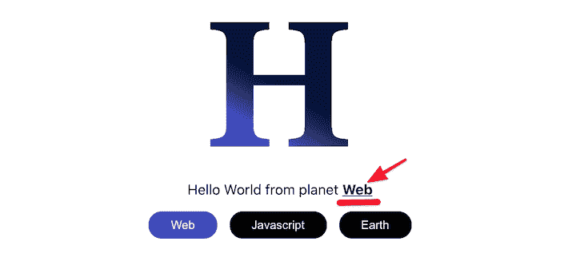

默认为“Web”的变化星球文本由 Redux 管理。这叫`activePlanet`。

要在 Redux 存储中创建一个状态值，必须向存储传递一个 reducer。

```
<p>
 Hello World from planet <span className="planet">{activePlanet}</span>
</p>
```

其中`planetsReducer`是指以下定义的 app 减速器:

```
import { createStore } from "redux";

const store = createStore(planetsReducer);
```

因为 Redux 状态更新依赖于被调度的动作，所以每个类型为`"SET_PLANET`的动作都返回一个由该动作的有效负载表示的新状态值。但是行动是如何进行的呢？

```
const planetsReducer = (state = "Web", action) => {
  const { type, payload } = action;
  return  type === "SET_PLANET" ? payload : state;
}
```

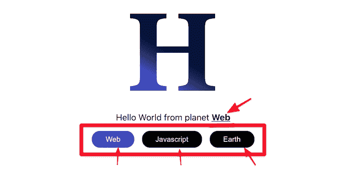

单击任何一个行星按钮都会调度一个动作，该动作反过来会更新状态值。

这里，`handlePlanetUpdate`是传递给按钮元素的点击处理程序。

```
const handlePlanetUpdate = (event) => {
    dispatch({ type: "SET_PLANET", payload: event.target.textContent });
  };
```

现在你明白了 Redux hello world app 的工作原理，你认为当我们重构为反冲时会发生什么变化？

```
... 
<button onClick={handlePlanetUpdate} />
...
```

首先，我们必须创建一个状态值。在 Redux 中，我们使用存储和 reducer 来完成这项工作，但反冲是通过一种叫做原子的东西来完成的。原子是状态的片断。我在[的介绍文章](https://blog.logrocket.com/simple-state-management-recoil/)中提到了这一点。

下面是如何为`activePlanets`状态值创建一个原子。

你用一个具有`key`和`default`属性的物体从反冲中调用`atom`函数。

```
import { atom } from "recoil";

const activePlanetAtom = atom({
  key: "activePlanet",
  default: "Web",
});
```

**注意** : `key`必须是一个唯一的字符串——对于应用程序中的其他原子(和选择器)是唯一的。

> 创建状态值很简单，但是如何从 UI 组件中读取这个值呢？对于 Redux，我们使用选择器:

从反冲状态读取状态值要容易得多。它的工作原理与`useState`非常相似，但有一个不同的钩子——这个来自后坐力。

```
import {useSelector } from "react-redux";

const activePlanet = useSelector((v) => v);
```

就像您通过调用`useState`获得一个状态值和更新器一样，反冲模拟了一个类似的 API。

```
... 
import { atom, useRecoilState } from "recoil";
... 

//within UI component  
const [activePlanet, setActivePlanet] = useRecoilState(activePlanetAtom);
```

从`recoil`调用`useRecoilState`钩子，但是将相关的原子作为参数传递给它，如上所示。很简单。

要在单击 planet 按钮时更新状态对象，您不必像 Redux 那样调度操作。您只需从调用`useRecoilState`中调用返回状态更新程序，如下所示:

比较这两种解决方案，反冲的优势之一变得显而易见:简单！使用反冲感觉非常接近默认的 React 心智模型，并且 API 非常容易掌握。

```
// redux 
const handlePlanetUpdate = (event) => {
    dispatch({ type: "SET_PLANET", payload: event.target.textContent });
};

// recoil 
const handlePlanetUpdate = (event) => {
    setActivePlanet(event.target.textContent);
};
```

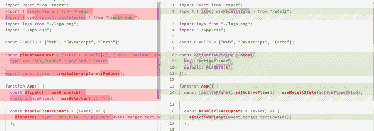

Diff: Redux vs. Recoil implementation.

让我们继续重构一个更有趣的应用程序。

Redux 应用#2:使用 Thunks 获取数据

## 大多数应用程序需要从远程服务器获取数据。使用 Redux 应用程序，有许多选项。我们来看一个带 [redux-thunk](https://github.com/reduxjs/redux-thunk) 的。


在上面的应用程序中，从远程服务器获取用户配置文件细节。正如你可能已经假设的那样，这里的流程类似于每个 Redux 应用程序。一旦安装了主`App`组件，就会调度一个动作来获取用户的配置文件细节。

`fetchUserProfile`函数包含被 redux-thunk 中间件拦截的异步逻辑。

```
useEffect(() => {
    dispatch(fetchUserProfile());
}, []);
```

在这里，`URL`表示返回用户档案细节的服务器端点。

```
export function fetchUserProfile() {
  return (dispatch, getState) => {
    fetch(URL)
      .then((res) => res.json())
      .then((data) => dispatch(setUserProfile(data)));
  };
}
```

在获取数据时，会调度`setUserProfile`动作将配置文件细节保存到存储中。

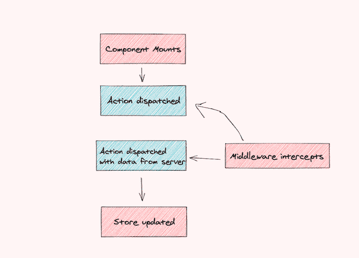

非常传统的设置。你可以在 GitHub 的这里[找到完整的源代码。](https://github.com/ohansemmanuel/benutzer)

现在，有了后坐力，到底有什么不同呢？最明显的是反冲应用中的状态流。

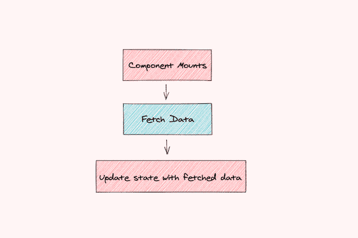

该流程感觉上与通过`useState`钩子使用本地状态的典型 React 应用程序几乎相同。

首先，我们创建一个反冲原子来保存从服务器获取的数据:

记住原子代表一种状态。

```
const userProfileState = atom({
  key: "userProfile",
  default: {},
});
```

在主`App`组件中，我们通过使用反冲的`useRecoilState`钩子读取原子的内容。

调用`useRecoilState`返回状态值和设置状态值的更新函数。

```
const [userProfile, setUserProfile] = useRecoilState(userProfileState);
```

我们建立了全球政府；现在，让我们触发实际的数据获取。

组件一安装，异步函数`fetchUserProfile`就被调用，接收到的数据通过调用状态更新`setUserProfile`被设置为全局状态。

其中`setUserProfile`代表状态更新函数。看看下面从 Redux 到反冲的代码 diff:

```
useEffect(() => {
    fetchUserProfile().then((data) =>
      setUserProfile({ ...data, isLoading: false })
    );
}, []);
```

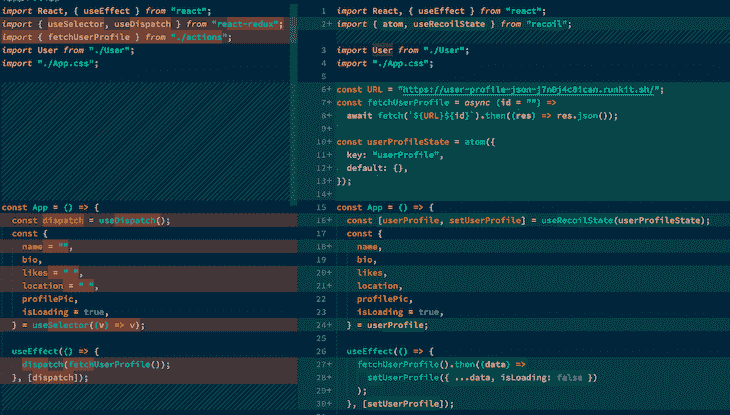

对反冲的重构要简单得多。没有 store 或 reducer 设置，也没有 thunks——只有一个类似于典型 React 应用程序的原子和流。说说简单！

值得一提的是，如果不在`RecoilRoot`组件中包装父树组件，refactor to 反冲就不完整。

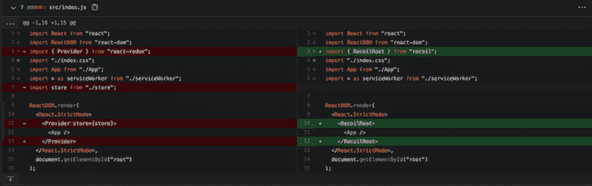

`RecoilRoot`提供了一个`Context`提供者来与你的全局状态交互。

你会发现 GitHub 上的[变化完全不同，例如，比较 Redux 和反冲重构。](https://github.com/ohansemmanuel/benutzer/compare/recoil-single-user)

Redux 应用#3:使用 thunks 获取多个用户配置文件

## 我们刚刚重构的应用程序比简单的 hello world 应用程序更有趣，但让我们考虑一个更有趣的应用程序，它展示了一种特殊的反冲强度。考虑下面的应用程序:


访问该应用程序时，会获取用户的个人资料详情，以及朋友列表。

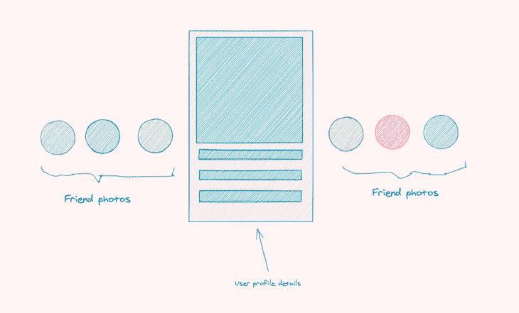

此外，点击每个朋友的图片后，我们会获取他们的个人资料详情(包括他们的朋友):

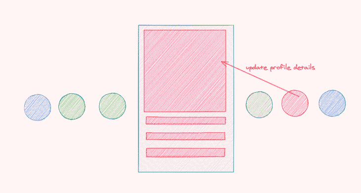

实际上，总有一个活跃用户的个人资料和好友列表会显示出来。使用 Redux 应用程序，这里的流程与之前的应用程序没有太大的不同。

像以前一样，只要主`App`组件安装好，我们就分派一个动作来获取默认的用户配置文件(和朋友一起)。

当一个朋友的图像被点击时，我们通过一个`dataset`对象将他们的`userId`附加到呈现的元素上，并使用`userId`作为参数启动相同的动作。

```
const App = () => {
  ... 
 useEffect(() => {
    dispatch(fetchUserProfile());
  }, []);
 ...
}
```

同一个 Thunk 中间件选择这个动作并发起网络请求；唯一的区别是传递给端点 URL 的`userId`获取不同的用户配置文件。

```
const App = () => {
  ... 
  const handleUserClick = (evt) => {
    const userId = evt.currentTarget.dataset.id;
    dispatch(fetchUserProfile(userId));
  };
  ... 
  return (
     ...
     <UserPhoto
            onClick={handleUserClick}
          />
  )
}
```


很简单。让我们考虑一下如何用反冲来解决这个问题。

你可能会惊讶地看到反冲应用程序采取的方向。Redux 关注的是从动作到 reducers 再到商店的状态流，而反冲关注的是通过数据流图的状态流。

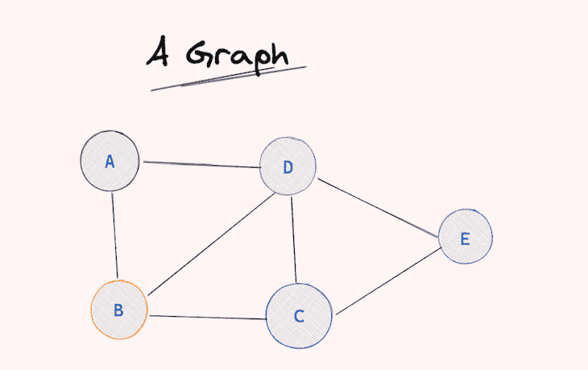

我可以再花 10 分钟讨论数据流图，但关键是:将数据流图想象成一个图形数据结构，其中反冲提供并管理不同状态实体之间的关系。

像所有的图形结构一样，这些状态对象是相互连接的。他们可能依赖于许多其他国家和其他实体，就像他们自己一样。

更重要的是，反冲将管理每个状态依赖关系，即状态通过该图的流动，并有效地重新计算值和重新呈现订阅这些状态值的组件。

我们现在关心的是选择器(反冲提供的状态实体之一)也可以包含异步代码，反冲仍然可以有效地处理通过图的状态流。这个知识改变了我们从 Redux 到反冲的重构方法。

第一步是创建一个保存当前用户 ID 的原子(再次提醒，原子代表反冲状态的一部分)。

有趣的是。我们将继续创建一个依赖于`userIDState`原子的异步选择器。

```
import { atom } from "recoil";

const userIDState = atom({
  key: "currentUserId",
  default: "",
});
```

现在，每当`useIDState`改变时，选择器将根据`id`获取新的用户数据，并返回配置文件数据。

```
import { atom, selector } from "recoil";

...
const userProfileState = selector({
  key: "userProfile",
  get: async ({ get }) => {
    const id = get(userIDState);
    return await fetchUserProfile(id);
  },
});
```

下面是我们如何在 UI 中使用这个状态值:

每次点击用户照片时，当前用户 ID 状态都会更新。反冲通过发出网络请求(如果需要)有效地重新计算当前用户数据。

```
const App = () => {
  // useSetRecoilState returns just the funtion updater e.g. imagine if there was a useSetState hook in React. 
  // useState returns [value, setState]
  // useSetState returns only setState
  const setCurrentUserId = useSetRecoilState(userIDState);

  // useRecoilValue returns just the state value instead of an array of value and state updater
  const userProfile = useRecoilValue(userProfileState);

  ... 
  const handleUserClick = (evt) => {
    setCurrentUserId(evt.currentTarget.dataset.id);
  };

 return (
  ... 
   <UserPhoto
            onClick={handleUserClick}
          />
 )
}
```

反冲选择器被视为纯函数。因此，对于同一个用户 ID，返回的是配置文件数据的缓存版本，而不需要再次获取数据！


好奇哪里可以找到完整的源代码？对于这个应用程序，这里有 [Redux](https://github.com/ohansemmanuel/benutzer/tree/redux-multi-users) 和[反冲](https://github.com/ohansemmanuel/benutzer/tree/recoil-multiple-user)分支。

结论

## 反冲还是一个年轻的图书馆，但是绝对很有前途！反冲有这么多的能力，我将在未来的文章中分享更多。[保持联系](https://twitter.com/ohansemmanuel?lang=en)

使用 LogRocket 消除传统反应错误报告的噪音

## 是一款 React analytics 解决方案，可保护您免受数百个误报错误警报的影响，只针对少数真正重要的项目。LogRocket 告诉您 React 应用程序中实际影响用户的最具影响力的 bug 和 UX 问题。

[LogRocket](https://lp.logrocket.com/blg/react-signup-issue-free)

自动聚合客户端错误、反应错误边界、还原状态、缓慢的组件加载时间、JS 异常、前端性能指标和用户交互。然后，LogRocket 使用机器学习来通知您影响大多数用户的最具影响力的问题，并提供您修复它所需的上下文。

[ ](https://lp.logrocket.com/blg/react-signup-general) [  ](https://lp.logrocket.com/blg/react-signup-general) [LogRocket](https://lp.logrocket.com/blg/react-signup-issue-free)

关注重要的 React bug—[今天就试试 LogRocket】。](https://lp.logrocket.com/blg/react-signup-issue-free)

Focus on the React bugs that matter — [try LogRocket today](https://lp.logrocket.com/blg/react-signup-issue-free).