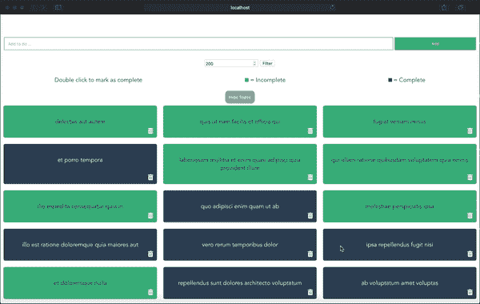
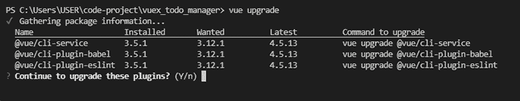
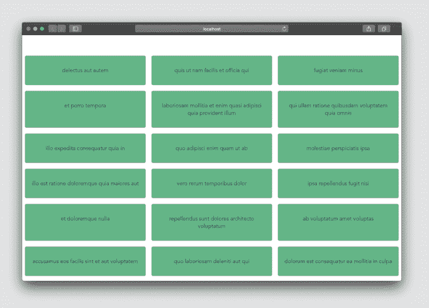
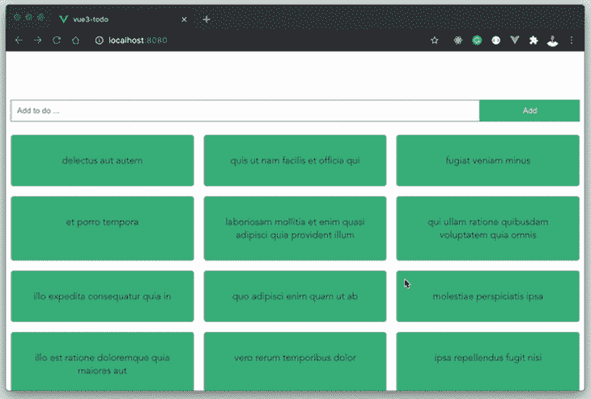
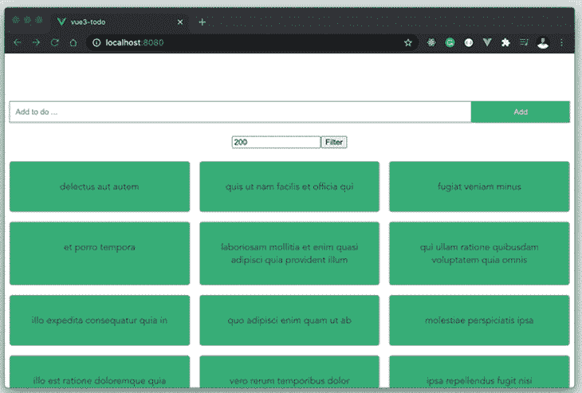

# 重构你的 Vue 2 应用程序到 Vue 3 日志火箭博客

> 原文：<https://blog.logrocket.com/refactoring-vue-2-apps-vue-3/>

*编者按:本文于 2021 年 9 月更新，以反映 Vue 3 的新发展。*

## 介绍

Vue 3 为开发者提供了另一种更好的构建 Vue 应用的方式。Vue 3 中[组合 API](https://v3.vuejs.org/guide/composition-api-introduction.html) 和组合函数的引入使得代码组织和重用变得轻而易举。

### 期待什么

在本教程中，我们将探索 Vue 3 中的新功能。我们还将使用由[布拉德·特拉弗斯](https://twitter.com/traversymedia)创建的开源 [Vue 2 应用](https://github.com/bradtraversy/vuex_todo_manager)作为我们重构 Vue 3 的示例应用。

在这个过程中，您将学习如何使用新的 Vue 3 功能，包括复合 API 和复合函数，以及如何在 Vue 3 应用程序中使用新的 [Vuex 4](https://github.com/vuejs/vuex/releases/tag/v4.0.0-beta.1) 。

我们将涵盖以下部分:

### 什么没有被覆盖

*   Vue 3 简介——本教程假设熟悉 Vue 3 的组成 API 和[反应性基础知识](https://v3.vuejs.org/guide/reactivity-fundamentals.html)
*   样式——我们不会详细讨论这个项目中使用的 CSS 属性，但是它可以在[项目资源库](https://github.com/kenny-io/vue3-vuex4-todo)中找到
*   TypeScript 兼容性——在这个项目的范围内，我们不会讨论 Vue 3 如何在 TypeScript 中工作

## Vue 2 和 Vue 3 有什么区别？

Vue 3 脱胎于 Vue 2 现有的局限性，旨在解决这些局限性。Vue 3 解决的一些问题包括:

*   随着组件变得越来越大，可读性越来越差，因此可维护性也越来越差
*   Vue 2 的可用代码重用模式造成的瓶颈
*   更大的束尺寸，因为 Vue 3 允许树摇动
*   当我们的应用程序变得越来越复杂时，分离逻辑关注点的问题

使用 Composition API，您可以基于逻辑关注组织组件代码，而不是组件选项。这在 Vue 2 中是有问题的，因为代码片段可能分散在多个组件选项中，这使得代码更难维护。

## 从 Vue 2 迁移到 Vue 3

让我们从我们之前提到的 [Vue 2 样本项目](https://github.com/bradtraversy/vuex_todo_manager)开始。该项目是一个待办事项列表应用程序，您可以在其中执行以下操作:

*   添加待办事项
*   删除待办事项
*   将待办事项标记为已完成
*   过滤待办事项
*   隐藏/显示待办事项

为了保持这个项目的简洁，我们将只关注添加、获取和过滤待办事项，但是如果你想练习的话，本文的结尾将包括一些关于重构这些函数的指导。



在项目中，待办事项是从 Typicode API 端点获取的。对数据执行的所有操作都发生在后端。

这个项目将有助于揭示 Vue 3 如何提供一种构建 Vue 应用程序的替代方法。

## 设置项目

首先，您需要使用以下命令安装最新版本的 [Vue CLI v4.5](https://github.com/vuejs/vue-cli) :

```
yarn global add @vue/[email protected]
#OR
npm install -g @vue/[email protected]

```

接下来，您需要将项目存储库克隆到您的本地机器上。为此，请打开您的终端并键入以下命令:

```
git clone https://github.com/bradtraversy/vuex_todo_manager
>
```

现在，使用以下命令将目录更改为项目文件夹:

```
cd vuex_todo_manager

```

现在，您可以在代码编辑器中打开项目。

## 升级 Vue 3 的 Vue 2 依赖项

Vue 团队为将 Vue 2 项目升级到 Vue 3 提供了一个简单的指南。我们所需要做的就是升级一些依赖项，然后我们就可以开始了。

我们将从升级 Vue CLI 开始。为此，请返回到您的终端，将目录设置在我们的项目文件夹的根目录下，并键入以下命令:

```
vue upgrade

```



该命令运行后，应出现以下提示，并列出需要升级的 Vue CLI 依赖项。按回车键继续。

因为 ESLint 安装在我们的项目中，所以我们将看到另一个提示，要求升级它以适应新的 Vue 版本。选择通过按回车键升级它。

接下来，我们需要手动升级一些其他的依赖项，比如`vue`、`@vue/compat`，并用`@vue/compiler-sfc`替换`vue-template-compiler`(如果有的话)。

为此，我们可以在终端中运行以下命令:

```
npm install [email protected]^3.1.0 @vue/[email protected]^3.1.0
npm install --save-dev @vue/[email protected]^3.1.0
npm uninstall vue-template-compiler

```

### 升级 Vuex

项目中唯一需要升级的依赖项是 Vuex，我们可以使用以下命令轻松完成:

```
npm install [email protected]

```

这将 Vuex 依赖项升级到最新版本 v4，它与 Vue 3 兼容。

## 启用兼容模式

现在，项目中的所有依赖项都已经升级，可以使用了。我们只需要通过 Vue 编译器选项激活 compat 模式来启用它们。

为此，在我们的项目文件夹的根目录下创建一个`vue.config.js`文件，并粘贴以下配置代码:

```
// vue.config.js
module.exports = {
  chainWebpack: config => {
    config.resolve.alias.set('vue', '@vue/compat')

    config.module
      .rule('vue')
      .use('vue-loader')
      .tap(options => {
        return {
          ...options,
          compilerOptions: {
            compatConfig: {
              MODE: 2
            }
          }
        }
      })
  }
}

```

### Vue 2 语法的显著变化

Vue 2 使用`new Vue()`方法引导新的 Vue 应用，而 Vue 3 使用`createApp`方法。如果您想知道为什么这种改变是必要的，这是因为旧的语法使全局配置可能永久改变全局状态，这可能是有问题的。

接下来，我们需要更新我们的 Vue 实例声明，以更好地适应在我们的应用程序中初始化 Vue 的[新 Vue 3](https://blog.logrocket.com/tag/vue) 方式。为此，在代码编辑器中打开`main.js`文件，然后用以下代码更新它:

```
//main.js
//import Vue from 'vue';
import { createApp } from 'vue';
import App from './App.vue';
import store from './store';

//Vue.config.productionTip = false;

//new Vue({
//  store,
// render: h => h(App)
//}).$mount('#app');

createApp(App)
  .use(store)
  .mount("#app");

```

Vuex 4 现在有一个符合 Vue 3 标准的`createStore`对象声明。通过 Vuex 4 中的新更新，您可以用几行代码创建一个 Vuex 商店。下面是当前的实现:

```
//store/index.js
import { createStore } from 'vuex';

export default createStore({
  state:{},
  mutations:{},
  actions:{},
  modules:{}
});

```

我们将对项目的结构做一些修改，包括删除`store/modules`文件夹并在`store/index.js`文件中重写`store/modules/todos.js`文件的内容。

## 提取待办事项

基于我们正在重构的 Vue 2 项目的给定实现，当应用程序加载时，会调度一个从[typical code 端点](https://jsonplaceholder.typicode.com/todos)获取待办事项的动作。我们将更新 Vuex 商店中的操作来处理这个问题。

但在此之前，让我们创建一个动作类型文件。在根文件夹中，创建一个`src/constants/action-types.js`文件，并像这样更新它:

```
// @/constants/action-types.js
export const ACTION_TYPES = {
  fetchTodos: "fetchTodos",
  addTodo: "addTodo",
  deleteTodo: "deleteTodo",
  updateTodo: "updateTodo",
};

```

我们在上面的文件中指定的动作类型将在整个项目中保持不变，并帮助我们在应用程序中保持命名的一致性。

接下来，让我们更新 Vuex 动作来处理从 API 端点获取待办事项:

```
// @/store/index.js
import { ACTION_TYPES } from "../constants/action-types";
import { createStore } from "vuex";
import Axios from "axios";
export default createStore({
  state: {
    todos: [],
  },
  mutations: {
    [ACTION_TYPES.fetchTodos]: (state, todos) => (state.todos = todos),
  },
  actions: {
    onFetchTodos: async ({ commit }) => {
      const response = await Axios.get(
        "https://jsonplaceholder.typicode.com/todos"
      );
      commit(ACTION_TYPES.fetchTodos, response.data);
    },
  },
});

```

这里，`onFetchTodos`动作从 Typicode 获取待办事项列表，并提交`fetchTodos`变异。变异然后更新状态对象中的`todos`数组。

接下来，我们将在即将创建的`Todo.vue`组件中分派这个动作。创建将分派`onFetchTodos`动作的`src/components/Todos.vue`文件，并显示返回的 todos:

```
// @/components/Todos.vue
<template>
  <div>
    <div class="todos">
      <div v-for="todo in todos" :key="todo.id" class="todo">
        <p>{{ todo.title }}</p>
      </div>
    </div>
  </div>
</template>
<script>
import { useStore } from "vuex";
import { computed, onMounted } from "vue";
export default {
  name: "Todos",
  setup() {
    const store = useStore();
    const todos = computed(() => store.state.todos);
    onMounted(() => {
      store.dispatch("onFetchTodos");
    });
    return {
      todos,
    };
  },
};
</script>

```

如果这是你第一次接触 Vue 3，这个组件会显得很陌生。让我们快速回顾一下关于这个组件的一些新的 Vue 3 特有的东西。

### `setup()`功能

如前所述，Vue 3 使用了 Composition API，这使得在一个返回模板所需数据的`setup()`函数中组织所有组件的逻辑成为可能。

这个特殊的特性使得按照逻辑关系组织组件成为可能，因为我们可以在`setup()`函数中拥有生命周期方法、计算属性、状态数据等等。

### `onMounted()`钩子

Vue 3 中的`onMounted()`钩子相当于 Vue 2 中的`mounted()`组件属性。它接受一个回调函数，该函数在组件调用钩子时执行:

```
onMounted(() => {
  store.dispatch("onFetchTodos");
});

```

### `computed()`法

Vue 3 中的`computed()`方法相当于 Vue 2 中的 computed component 属性。它接受一个执行特定任务的`getter`函数，并返回一个反馈引用。引用是 getter 返回值的不可变对象:

```
const todos = computed(() => store.state.todos);

```

如果你仍然不确定这些变化，我建议在继续本教程之前阅读关于参数的 [Composition API 文档。](https://v3.vuejs.org/guide/composition-api-setup.html#arguments)

现在，我们已经对 Vue 3 中的新组件进行了重新分组，让我们继续学习教程。

注意，我们在`setup()`函数中返回了`todos`。这就是我们在想要在模板中使用的函数中公开数据的方式。目前，浏览器上的应用程序如下所示:



由于我们正在进行重构，最好是并排捕获 Vue 2 组件。我试了一下，它让教程变得非常大而且不可取地冗长，所以我将链接[等价的 Vue 2 组件](https://github.com/bradtraversy/vuex_todo_manager/blob/master/src/components/Todos.vue)，这样你就可以自己比较变化了。

## 添加待办事项

因为我们使用 Vuex，所以我们需要一个动作和一个突变来更新待办事项的状态。要实现这一点，请用下面的代码片段更新商店:

```
// @/store/index.js

import { ACTION_TYPES } from "../constants/action-types";
import { createStore } from "vuex";
export default createStore({
  state: {
    todos: [],
  },
  mutations: {
    // ...
    [ACTION_TYPES.addTodo]: (state, todo) => state.todos.unshift(todo),
  },
  actions: {
    // ...
    onAddTodo: async ({ commit }, title) => {
      const response = await Axios.post(
        "https://jsonplaceholder.typicode.com/todos",
        { title, completed: false }
      );
      commit(ACTION_TYPES.addTodo, response.data);
    }
  },
});

```

`onAddTodo`动作接收将被添加到现有待办事项中的新待办事项的状态和内容，并提交`addTodo`变异。`addTodo`变异用从`onAddTodo`动作传入的新待办事项更新待办事项数组。

接下来，在 components 文件夹中，创建一个`components/AddTodo.vue`文件。该组件将呈现一个表单，允许用户向现有列表添加新的待办事项:

```
// @/components/AddTodo.vue
<template>
  <div>
    <form>
      <input type="text" v-model="title" placeholder="Add to do ..." />
      <input v-on:click="addNewTodo" type="submit" value="Add" />
    </form>
    <br />
  </div>
</template>
<script>
import { ref } from "vue";
import { useStore } from "vuex";
export default {
  name: "AddTodo",
  setup() {
    const store = useStore();
    const title = ref("");
    const addNewTodo = (e) => {
      e.preventDefault();
      store.dispatch("onAddTodo", {
        title: title.value,
      });
      title.value = "";
    };
    return {
      title,
      addNewTodo,
    };
  },
};
</script>

```

该组件类似于`Todos`组件；这里唯一的新东西是第 17 行的`ref`函数。让我们在下一节讨论这个问题。

## Vue 3 与`ref`的反应性

Vue 2 在反应性方面有其缺点，Vue 3 是随着一种新的改进的反应系统的出现而出现的。在 Vue 3 中，我们可以使用新的`ref`和`reactive`方法为组件中的变量添加反应性。
在这里阅读更多关于 Vue 3 [的反应](https://v3.vuejs.org/guide/reactivity-fundamentals.html)

考虑以下片段:

```
// Declaration    
const title = ref("");

```

上面的代码片段创建了一个反应性的`title`变量，初始值为`" "`，表示一个空的`String`。要读取变量的值，您需要做`title.value`。

你可以[在官方文档中阅读更多关于 Vue 3 `ref`功能](https://v3.vuejs.org/guide/composition-api-introduction.html#reactive-variables-with-ref)的信息。

最后，我们在`setup()`函数中返回`title`变量和`addNewTodo`变量，以便在模板中使用。如果您在浏览器中查看该应用程序，您应该能够添加待办事项:



同样，如果你欣赏[将这个组件直接](https://github.com/bradtraversy/vuex_todo_manager/blob/master/src/components/AddTodo.vue)与 Vue 2 替代方案进行比较，我鼓励你看一看它并回顾一下变化。

## 过滤待办事项

当您调用 [fetch to-dos 端点](https://jsonplaceholder.typicode.com/todos)时，Typicode 返回 200 个 to-dos 的数组。因此，它们提供了一个端点来过滤您一次可以获取的待办事项的数量。让我们创建一个过滤器组件，允许用户过滤他们想要获取的待办事项的数量。

在根目录下创建一个`src/components/FilterTodo.vue`文件，并用下面的代码片段更新它:

```
// @/components/FilterTodo.vue
<template>
  <div>
    <form @submit="filterTodos">
      <input type="number" v-model="limit" placeholder="Add to do ..." />
      <input @click.prevent="filterTodos" type="submit" value="Filter" />
    </form>
    <br />
  </div>
</template>
<script>
import { ref } from "vue";
import { useStore } from "vuex";
export default {
  name: "FilterTodos",
  setup() {
    const limit = ref(200);
    const store = useStore();
    const filterTodos = () => {
      store.dispatch("onFilterTodos", limit.value);
    };
    return {
      limit,
      filterTodos,
    };
  },
};
</script>

```

这个组件提供了一个输入表单来收集您想要过滤的待办事项的数量。提交后，会分派`onFilterTodos`动作。

这个动作提交`fetchTodos`变异，然后更新待办事项状态。让我们用`onFilterTodos`动作更新 Vuex 商店，就像这样:

```
// @/store/index.js

import { ACTION_TYPES } from "../constants/action-types";
import { createStore } from "vuex";
export default createStore({
  state: {
    todos: [],
  },
  mutations: {
    // ...
    [ACTION_TYPES.fetchTodos]: (state, todos) => (state.todos = todos),
  },
  actions: {
    // ...
    onFilterTodos: async ({ commit }, limit) => {
      const response = await Axios.get(
        `https://jsonplaceholder.typicode.com/todos?_limit=${limit}`
      );
      commit(ACTION_TYPES.fetchTodos, response.data);
    },
  },
});

```

`onFilterTodos`动作使用从组件传入的值对 Typicode 过滤器端点进行 API 调用。这个值决定了我们从 Typicode 返回的待办事项的数量。然后，我们提交`fetchTodos`变异，用响应数据更新 to-dos 状态。

让我们在浏览器上试试这个:



最后，为了便于比较，这是我们刚刚重构为 Vue 3 的这些组件的 [Vue 2 等效物](https://github.com/bradtraversy/vuex_todo_manager/blob/master/src/components/FilterTodos.vue)。我们在这里使用了一个表单来处理用户输入并保持其简单。

## 项目回购

这个项目在 Github 上[可用。虽然整个项目包含一些我们在本教程中无法涵盖的特性，但是您当然可以自己尝试重构其他操作。一些想法包括:](https://github.com/kenny-io/vue3-vuex4-todo)

*   删除待办事项
*   更新待办事项
*   将待办事项标记为已完成
*   切换待办事项可见性

对于上面列出的未完成的 CRUD 操作，您可以采用我们在重构其他操作和组件时学到的概念，并将它们应用于完成其余的操作。这样做可以让你很快熟悉 Vue 3 的语法。记住:熟能生巧！

## 结论

在这个项目中，我们用 Vuex 将一个标准的 Vue 2 应用程序重建成一个全新的使用 Vuex 4 的 [Vue 3 应用程序。在这个过程中，我们研究了 Vue 3 的一些特性，比如新的复合 API、复合函数和 Vuex 4。](https://blog.logrocket.com/using-vuex-4-with-vue-3/)

Vue 3 仍然在变化，所以我建议你通过官方的 Vue 3 文档来保持更新。如果你想实践你今天在这里学到的东西，你可以在这个 GitHub 库找到这个项目的[代码。](https://github.com/kenny-io/vue3-vuex4-todo)

## 像用户一样体验您的 Vue 应用

调试 Vue.js 应用程序可能会很困难，尤其是当用户会话期间有几十个(如果不是几百个)突变时。如果您对监视和跟踪生产中所有用户的 Vue 突变感兴趣，

[try LogRocket](https://lp.logrocket.com/blg/vue-signup)

.

[](https://lp.logrocket.com/blg/vue-signup)[https://logrocket.com/signup/](https://lp.logrocket.com/blg/vue-signup)

LogRocket 就像是网络和移动应用程序的 DVR，记录你的 Vue 应用程序中发生的一切，包括网络请求、JavaScript 错误、性能问题等等。您可以汇总并报告问题发生时应用程序的状态，而不是猜测问题发生的原因。

LogRocket Vuex 插件将 Vuex 突变记录到 LogRocket 控制台，为您提供导致错误的环境，以及出现问题时应用程序的状态。

现代化您调试 Vue 应用的方式- [开始免费监控](https://lp.logrocket.com/blg/vue-signup)。