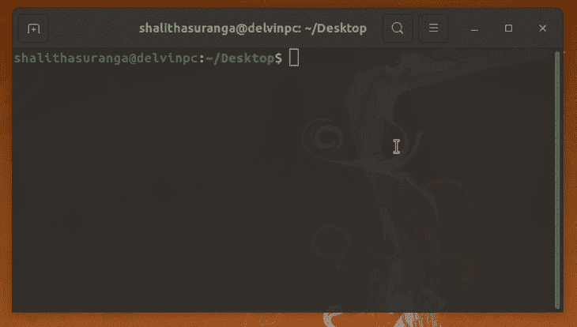

# Go 中的反射:用例与教程

> 原文：<https://blog.logrocket.com/reflection-go-use-cases-tutorial/>

Go 编程语言是一种流行的静态类型、编译的编程语言，具有类似 C 的语法。由于内存安全、垃圾收集、并发性、性能和对开发人员友好的最小语法等特性，它在现代开发人员社区中越来越受欢迎。

Go 遵循一种独特的设计模式，这是其他现代编程语言通常不具备的:它不修改语言的语法。相反，Go 语言的开发团队扩展了 Go 的标准库。

因此， [Go 的标准库](https://pkg.go.dev/std)几乎拥有现代编程语言所需的所有特性。它还提供了一个处理反射的包，反射是一个来自元编程范例的概念。

在本教程中，我们将学习 [Go 的反射 API](https://pkg.go.dev/reflect) 。我们还将介绍元编程，并涵盖一些您可能会遇到的示例用例。

## 什么是元编程和反射？

在深入教程之前，我们需要理解元编程和反射。我们可以用两种方式对待我们的源代码:代码和数据。

如果我们将源代码视为代码，就有可能像我们一直做的那样在 CPU 上执行源代码。

另一方面，如果我们把源代码看作数据，我们可以像对正常的程序过程数据那样检查和更新它。例如，您可以在不知道结构的所有属性的情况下列出该结构的所有属性。

元编程是指将程序视为数据的编程技术。元编程技术可以检查和处理其他程序，或者程序本身，甚至在它执行的过程中。

反射是元编程范例的一个子主题。几乎所有流行的语言都公开内部 API 来处理特定编程语言本身的元编程。这些 API 被称为反射 API，它们作为一种特定的编程语言来检查、操作和执行代码结构。

因此，我们可以这样做:

*   检查结构的属性
*   检查结构实例中是否存在函数
*   用反射 API 检查未知变量的原子类型

让我们仔细看看这在 Go 编程语言中是如何工作的。

## Go 中反射的用例

反射概念通常公开一个本地 API 来检查或修改当前程序。你可能会想，你已经知道了你的程序的源代码，那么为什么你还需要通过反射来检查你写的代码呢？但是反射有许多有用的用例，如下所示:

*   程序员可以使用反射用更少的代码解决编程问题
    *   例如，如果您使用 struct 实例来构建 SQL 查询，则可以使用反射来提取 struct 字段，而无需对每个 struct 字段名进行硬编码
*   因为反射提供了一种检查程序结构的方法，所以使用它来构建静态代码分析器是可能的
*   我们可以在反射 API 的帮助下动态执行代码
    *   例如，您可以找到结构的现有方法，并通过名称调用它们

接下来的教程部分将涵盖[你需要](https://blog.logrocket.com/getting-started-with-go-for-frontend-developers/)来实现上述用例的所有基础知识。此外，我将向您展示如何用反射 API 构建一个简单的 shell 程序。

现在我们已经讨论了反射背后的理论概念，让我们从实际例子开始。

Go 反射包为我们提供了运行时反射，所以这些例子在执行时检查或操作程序结构。由于 Go 是一种静态类型的编译语言，它的反射 API 是基于两个关键组件创建的:反射[类型](https://pkg.go.dev/reflect#Type)和[值](https://pkg.go.dev/reflect#Value)。

## 检查变量的类型

首先，我们可以检查变量类型，从[反射包](https://pkg.go.dev/reflect)开始。看看下面的代码，它打印了几个变量的类型。

```
package main
import (
    "fmt"
    "reflect"
)
func main() {
    x := 10
    name := "Go Lang"
    type Book struct {
        name string
        author string
    }
    sampleBook := Book {"Reflection in Go", "John"}
    fmt.Println(reflect.TypeOf(x)) // int 
    fmt.Println(reflect.TypeOf(name)) // string
    fmt.Println(reflect.TypeOf(sampleBook)) // main.Book
}

```

上面的代码片段通过使用`reflect.TypeOf`函数打印变量的数据类型。`TypeOf`函数返回一个反射类型实例，该实例提供了访问当前类型更多信息的函数。例如，我们可以使用`Kind`函数来获取变量的原始类型。记住，上面的代码片段显示了`sampleBook`变量的`main.Book`定制类型——而不是原始结构类型。

按如下方式更改上面的代码，以获得基本类型。

```
package main
import (
    "fmt"
    "reflect"
)
func main() {
    x := 10
    name := "Go Lang"
    type Book struct {
        name string
        author string
    }
    sampleBook := Book {"Reflection in Go", "John"}
    fmt.Println(reflect.TypeOf(x).Kind()) // int 
    fmt.Println(reflect.TypeOf(name).Kind()) // string
    fmt.Println(reflect.TypeOf(sampleBook).Kind()) // struct
}

```

上面的代码片段为第三条打印指令输出`struct`，因为反射类型的`Kind`函数返回一个包含原始类型信息的反射种类。

我们还可以使用反射类型的`Size`函数来获取存储当前类型所需的字节数。请看下面的代码片段:

```
package main
import (
    "fmt"
    "reflect"
)
func main() {
    x := 10
    name := "Go Lang"
    type Book struct {
        name string
        author string
    }
    sampleBook := Book {"Reflection in Go", "John"}
    fmt.Println(reflect.TypeOf(x).Size())
    fmt.Println(reflect.TypeOf(name).Size())
    fmt.Println(reflect.TypeOf(sampleBook).Size())
}

```

上面的代码片段以字节为单位输出变量的存储大小。根据计算机的指令集架构(ISA ),输出可能会有所不同。例如，64 位计算机/操作系统将显示如下输出:

```
8 // size of int
16 // size of StringHeader
32 // size of struct

```

## 检查变量的值

前面，我们检查了数据类型信息。也可以用反射包提取变量值。以下代码使用`reflect.ValueOf`函数打印变量值:

```
package main
import (
    "fmt"
    "reflect"
)
func main() {
    x := 10
    name := "Go Lang"
    type Book struct {
        name string
        author string
    }
    sampleBook := Book {"Reflection in Go", "John"}
    fmt.Println(reflect.TypeOf(x)) // 10
    fmt.Println(reflect.ValueOf(name)) // Go Lang
    fmt.Println(reflect.ValueOf(sampleBook)) // {Reflection in Go John}
}

```

`ValueOf`函数根据提供的变量返回一个反射值实例。与反射类型类似，反射值也保存有关变量值的更多信息。例如，如果我们需要提取`Book`结构的第二个字段的值，我们可以使用反射值的`Field`函数，如下所示。

```
package main
import (
    "fmt"
    "reflect"
)
func main() {
    type Book struct {
        name string
        author string
    }
    sampleBook := Book {"Reflection in Go", "John"}
    fmt.Println(reflect.ValueOf(sampleBook).Field(1)) // John
}

```

## 更改变量的值

前面，我们用 reflect 包中的几个函数检查了代码的结构。也可以通过 Go 的 reflect API 改变运行代码。查看以下代码片段如何更新结构中的字符串字段。

```
package main
import (
    "fmt"
    "reflect"
)
func main() {
    type Book struct {
        Name string
        Author string
    }
    sampleBook := Book {"Reflection in Go", "John"}
    val := reflect.ValueOf(&sampleBook).Elem()
    val.Field(1).SetString("Smith")
    fmt.Println(sampleBook) // {Reflection in Go Smith}
}

```

这里，我们使用`SetString`函数来改变 struct 字段中的字符串数据。当我们改变价值观时，我们需要有可寻址和可访问的字段。因此，`Book`结构使用标题大小写字段将它们导出到反射 API。此外，我们必须提供一个指向`ValueOf`函数的 struct 实例指针，以获得上述`val`变量的可寻址反射值。

## 检查结构的详细信息

让我们编写一个代码片段来检查一个结构的所有字段。在检查过程中，我们可以显示每个结构字段的名称和值。

```
package main
import (
    "fmt"
    "reflect"
)
func main() {
    type Book struct {
        Name string
        Author string
        Year int
    }
    sampleBook := Book {"Reflection in Go", "John", 2021}
    val := reflect.ValueOf(sampleBook)

    for i := 0; i < val.NumField(); i++ {
          fieldName := val.Type().Field(i).Name
          fieldValue := val.Field(i).Interface()
          fmt.Println(fieldName, " -> ", fieldValue)
    }

}

```

`NumField`函数返回给定结构实例的字段数。`Field`函数返回一个 [`StructField`实例](https://pkg.go.dev/reflect#StructField)，该实例根据提供的索引保存结构字段细节。

另外，`Interface`函数返回所选 struct 字段的存储值。`for`循环将所有的东西组合在一起，并显示了`Book`结构的概要。上面的代码确实是动态的，这意味着即使您为`Book`结构添加一个新字段，它也能工作。

## 检查方法并通过它们的字符串名称调用它们

让我们假设你正在为一个 shell 程序实现一个定制的命令引擎，你需要根据用户输入的命令运行 Go 函数。如果映射方法很少，可以实现一个 switch-case 语句。

但是，如果有数百种映射方法呢？然后，我们可以通过名字动态调用 Go 函数。下面的基本 shell 程序使用反射。

```
package main
import (
    "fmt"
    "reflect"
    "bufio"
    "os"
)
type NativeCommandEngine struct{}
func (nse NativeCommandEngine) Method1() {
    fmt.Println("INFO: Method1 executed!")
}
func (nse NativeCommandEngine) Method2() {
    fmt.Println("INFO: Method2 executed!")
}
func (nse NativeCommandEngine) callMethodByName(methodName string) {
    method := reflect.ValueOf(nse).MethodByName(methodName)
    if !method.IsValid() {
        fmt.Println("ERROR: \"" + methodName + "\" is not implemented")
        return
    }
    method.Call(nil)
}
func (nse NativeCommandEngine) ShowCommands() {
    val := reflect.TypeOf(nse)
    for i := 0; i < val.NumMethod(); i++ {
        fmt.Println(val.Method(i).Name)
    }
}
func main() {
    nse := NativeCommandEngine{}
    fmt.Println("A simple Shell v1.0.0")
    fmt.Println("Supported commands:")
    nse.ShowCommands()
    scanner := bufio.NewScanner(os.Stdin)
    fmt.Print("$ ")
    for scanner.Scan() {
        nse.callMethodByName(scanner.Text()) 
        fmt.Print("$ ")
    }
}

```

首先，上面的 shell 程序显示了所有支持的命令。然后，用户可以按照自己的意愿输入命令。每个 shell 命令都有一个映射的方法，如果一个特定的方法不存在，shell 将打印一条错误消息，如下所示。



如果需要添加新命令，只需创建新的导出方法。之后，由于反射 API，shell 程序将自动支持新方法。

## 结论

并不是所有的编程语言都公开了反射 API，但是流行的编程语言如 Java、C#、JavaScript 和 [Go](https://blog.logrocket.com/tag/go/) 都有反射 API。

反射是一个强大的特性，但也有一些缺点。反射让开发人员通过编写更少的代码来解决一些问题。然而，反射通常会影响代码的可读性，有时还会降低程序的速度。因此，不要过度使用反射——确保你的基于反射的代码是可读和优化的。

## 使用 [LogRocket](https://lp.logrocket.com/blg/signup) 消除传统错误报告的干扰

[](https://lp.logrocket.com/blg/signup)

[LogRocket](https://lp.logrocket.com/blg/signup) 是一个数字体验分析解决方案，它可以保护您免受数百个假阳性错误警报的影响，只针对几个真正重要的项目。LogRocket 会告诉您应用程序中实际影响用户的最具影响力的 bug 和 UX 问题。

然后，使用具有深层技术遥测的会话重放来确切地查看用户看到了什么以及是什么导致了问题，就像你在他们身后看一样。

LogRocket 自动聚合客户端错误、JS 异常、前端性能指标和用户交互。然后 LogRocket 使用机器学习来告诉你哪些问题正在影响大多数用户，并提供你需要修复它的上下文。

关注重要的 bug—[今天就试试 LogRocket】。](https://lp.logrocket.com/blg/signup-issue-free)