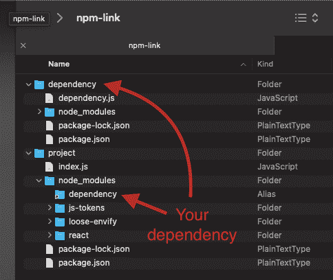
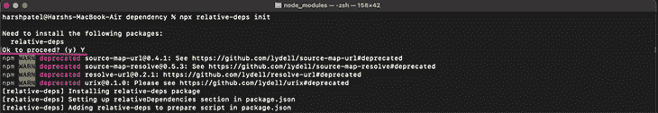
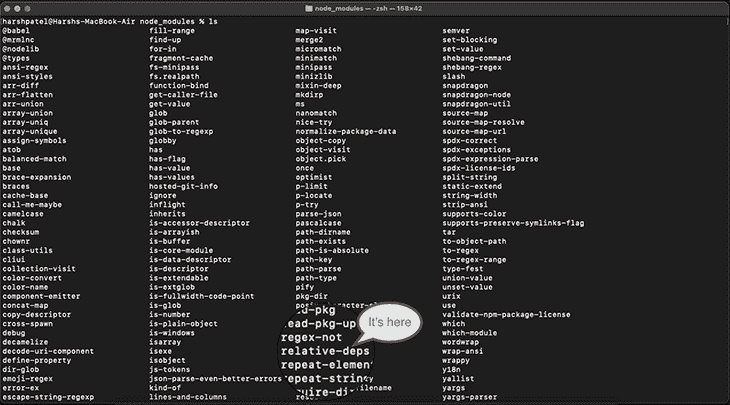
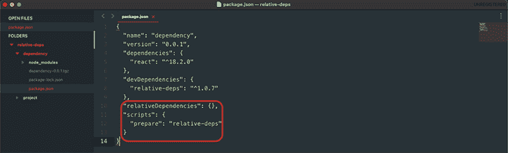
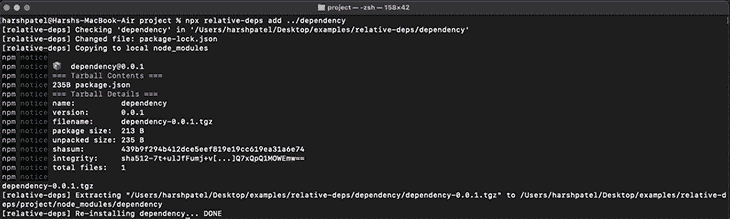
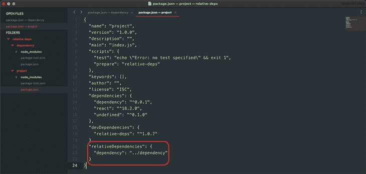

# relative-deps:NPM 的另一种选择——相对依赖的链接

> 原文：<https://blog.logrocket.com/relative-deps-alternative-npm-link-relative-dependencies/>

很多时候，您需要同时处理一个项目及其依赖项。如果您的团队正在开发一个依赖项，并且您想要在开发期间测试它的功能或者发现缺陷，您对它的方法是什么？好问题。

然后，在一切看起来不错之后，您将手动将代码放入`node_modules`包中，并将其放回各自的存储库中，对吗？如果你的答案是肯定的，那么你需要知道更多关于`relative-deps`和`npm-link`的事情！

在本文中，我们将介绍`relative-deps`以及它与`npm-link`的不同之处。我们将回顾一下`npm-link`的局限性、`relative-deps`如何修复它，以及`relative-deps`的总体优势。我们开始吧！

## 什么是`npm-link`，它是如何工作的？

先说 [`npm-link`](https://docs.npmjs.com/cli/v8/commands/npm-link) 。使用`npm-link`，链接分两步完成。

在第一步中，您需要通过运行`npm link`命令到相应的目录中，为依赖关系创建一个[符号链接](https://en.wikipedia.org/wiki/Symbolic_link)。这将生成一个在主项目中使用的全局符号链接。

第二步，您需要通过运行`npm link [dependency-name]`告诉您的项目使用来自符号链接的依赖项。

这里有一个例子:

```
$ cd ~/dependency             # go into the dependency directory
$ npm link                    # creates global link
$ cd ~/project                # go into some other package directory.
$ npm link dependency         # link-install the package

```

如果您希望您的依赖关系反映在`package.json`中，那么您需要在最后一个命令后追加`--save`:



现在，您必须对依赖项进行必要的更改，这将反映在您的项目中，无需任何修改。

刚刚创建的链接是本地链接，因此，在发布时，它不会影响您的生产。然而，在发布时，您需要在您的`package.json`中更改依赖项的更新版本。就是这样！

## 什么是`relative-deps`？

现在，让我们转到`relative-deps`。[根据官方文档](https://github.com/mweststrate/relative-deps)，它从本地签出安装依赖项并保持它们同步，完全没有`link`的限制。

从`relative-deps`开始，第一步是在依赖目录中触发`npx relative-deps` `init`。这将安装软件包，设置脚本，并初始化空的相对依赖部分:



安装成功后，在`node_modules`中，可以看到名为`relative-deps`的包:



如果你检查`package.json`，你也会发现`relativeDependencies`和`prepare`部分:



现在，导航到您的项目目录并执行`npx relative-deps add ../dependency`。确保您的依赖关系`package.json`有一个`name`和`version`。否则，该命令将引发错误:



可以看到链接成功了！您也可以在`package.json`中进行同样的检查:



这样，依赖关系将与你的依赖关系相联系。它将根据您在安装过程中设置的挂钩自动更新。如果您想手动触发它，只需运行`npx relative-deps`，它将更新更改。

## `relative-deps`和`npm-link`有什么不同？

`relative-deps`模仿“包安装”而不解决问题。正如其官方文档中所述，`relative-deps`在 prepare(即安装所有 dep 之后)上构建“链接的”库，打包，并在宿主项目的`node_modules`中解包。

现在`node_modules`里面没有虚拟链接，也没有共享包。最终，如果您通过 npm 或 yarn 手动安装，`relative-deps`将具有相同的文件夹结构。这是使用`relative-deps`的主要好处，有了它，你可以避免很多问题。

你可能知道，每次有变化的时候都写`npm install`是非常多余的。`relative-deps`已经通过首先记住库的目录内容的散列解决了这个问题。换句话说，如果某些东西改变了，那是它唯一一次构建和安装。

## `npm-link`的局限性

需要注意的是`npm-link`有几个限制。我们将在下面讨论其中的一些。

### 相同的节点版本

如你所知,`npm-link`是一个两步过程。这两个命令应该具有相同的节点版本号。这样，如果您的依赖项使用不同的节点版本，`npm-link`就不能正常工作。

如果是这种情况，您可能会在链接依赖项时遇到一些问题。

### 不存在的链接

如果您意外地触发了没有该依赖关系的链接的`npm link [dependency]`，那么`npm-link`将在 npm 注册表中搜索全局链接，并为其创建一个符号链接。最终，这是行不通的。

这将导致一个错误，因为在执行该命令之前没有链接任何依赖项。当一个包不在全局注册表中时，它也会抛出一个错误。

### 链接删除

链接多个包也是不可能的。先前链接的包将首先被删除，您一次最多可以链接一个包。例如:

```
$ npm link ./dependency
$ ls node_modules
dependency
$ npm link ./another_dependency
$ ls node_modules
another_dependency

```

首先链接的`dependency`将被删除。

## `relative-deps`相对于`npm-link`的优势

既然我们已经讨论了`npm-link`的缺点，让我们回顾一下`relative-deps`相对于`npm-link`的一些优势。

* * *

### 更多来自 LogRocket 的精彩文章:

* * *

### `relative-deps`使用共享依赖关系

`relative-deps`处理对等/共享依赖关系。如果`npm-link`中有任何共享的依赖关系，它们将在依赖关系树中出现两次。这是因为一个是从`node_modules`链接的，另一个是从项目的`node_modules`目录链接的，这造成了很多混乱。

这个问题随着`relative-deps`不再存在。

### 包括 N 个依赖项

您可以使用`relative-deps.`设置多个依赖项，所有依赖项都可以同时安装和使用，您还可以监听更改，而不必担心手动安装。我们将在下一段进一步阐明这一点。

### 设置观看模式

是的，你可以通过运行`relative-deps watch`将手表模式设置为 500 毫秒的去抖时间。您将获得热重新加载的好处，因此您不需要手动更新您的依赖项。它将监听所有相关的依赖项。

### 链接不存在的依赖关系时出错

与`npm-link`不同，当你试图设置一个没有初始化的依赖项时，你会得到一个错误。您还需要提供一个路径，以便知道从哪个目录设置依赖项。

## 结论

我在处理实际产品的依赖关系时使用了`npm-link`和`relative-deps`。由于它是内部的，我需要做一些改变，看看它是否工作，或者在集成后测试它。我必须说`relative-deps`有一些额外的优势，所以我更经常使用它。

链接是一个很小的过程，可以快速地将您的依赖项添加到主项目中。作为一名 JavaScript 开发人员，掌握`relative-deps`是必须的，因为它可以节省大量时间。必要时，你应该尝试一下，看看有什么好处。

## 使用 [LogRocket](https://lp.logrocket.com/blg/signup) 消除传统错误报告的干扰

[](https://lp.logrocket.com/blg/signup)

[LogRocket](https://lp.logrocket.com/blg/signup) 是一个数字体验分析解决方案，它可以保护您免受数百个假阳性错误警报的影响，只针对几个真正重要的项目。LogRocket 会告诉您应用程序中实际影响用户的最具影响力的 bug 和 UX 问题。

然后，使用具有深层技术遥测的会话重放来确切地查看用户看到了什么以及是什么导致了问题，就像你在他们身后看一样。

LogRocket 自动聚合客户端错误、JS 异常、前端性能指标和用户交互。然后 LogRocket 使用机器学习来告诉你哪些问题正在影响大多数用户，并提供你需要修复它的上下文。

关注重要的 bug—[今天就试试 LogRocket】。](https://lp.logrocket.com/blg/signup-issue-free)