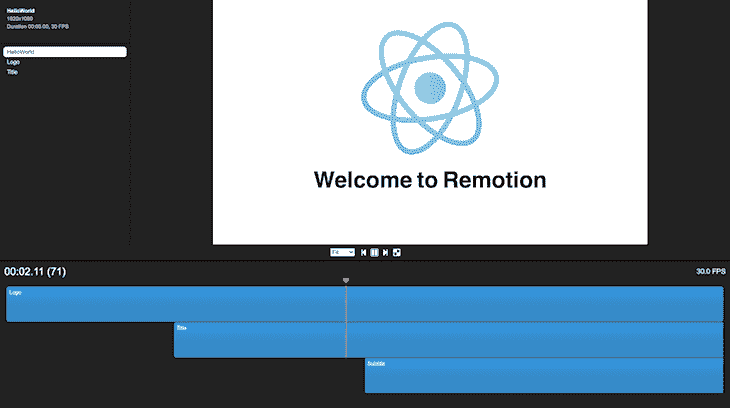

# Remotion:一个在 React 中制作视频的框架

> 原文：<https://blog.logrocket.com/remotion-a-framework-for-making-videos-in-react/>

我们使用视频以各种方式丰富我们的网络体验，但是如果我告诉你，你现在可以使用网络来创建视频，会怎么样？本文介绍了 [Remotion](https://www.remotion.dev) ，这是一套库，为使用 React 以编程方式创建视频奠定了基础。

Remotion 允许你用 canvas、CSS、SVG 和 WebGL 创建视觉效果，并把它们组合成视频。您甚至可以使用熟悉的概念，如变量、函数、数学等，通过编程来实现。使用 Remotion，您还可以使用 JavaScript 代码来生成视频，并最终将其渲染为 MP4 文件(如果您愿意)。

Remotion 有两个核心依赖项，我们需要在开始之前安装:FFmpeg 和 Node.js。以下是各种平台上两者的信息和安装指南的链接:

为了更好地理解 Remotion 是如何工作的，我们将浏览在初始化 Remotion 时创建的演示视频。

## 初始化移除

一旦你有了 FFmpeg 和 Node，你就可以开始使用 Remotion 了。您可以通过运行以下命令，使用一些样板文件初始化 React 应用程序和演示视频:

```
yarn create video

```

或者

```
npm init video

```

Linux 用户需要安装一些额外的包来让 Chrome/puppet er 工作:

```
apt install -y gconf-service libasound2 libatk1.0-0 libc6 libcairo2 libcups2 libdbus-1-3 libexpat1 libfontconfig1 libgcc1 libgconf-2-4 libgdk-pixbuf2.0-0 libglib2.0-0 libgtk-3-0 libnspr4 libpango-1.0-0 libpangocairo-1.0-0 libstdc++6 libx11-6 libx11-xcb1 libxcb1 libxcomposite1 libxcursor1 libxdamage1 libxext6 libxfixes3 libxi6 libxrandr2 libxrender1 libxss1 libxtst6 ca-certificates fonts-liberation libappindicator1 libnss3 lsb-release xdg-utils wget libgbm-dev

```

这些命令将生成在 express 服务器上运行的 JavaScript 应用程序，该应用程序包含以下内容:

*   一个包含用于渲染视频的逻辑的`server.tsx`文件
*   一个`remotion.config.ts`文件，您可以在其中配置[各种远程设置](https://www.remotion.dev/docs/config)。你可以阅读更多关于你可以配置的设置[这里](https://www.remotion.dev/docs/config)
*   如果您想为 SSR(服务器端渲染)对服务器进行 dockerizeize 化，可以使用可选的 docker 文件
*   包含用于创建视频的 React 组件的`src`目录
*   Prettier、ESlint、GitHub 工作流的配置文件，以及您的代码编辑器(如果您使用 VSCode)

该脚本还会安装您需要开始使用的任何 npm 依赖项。完成后，您可以使用`yarn start`或`npm run start`运行视频。Remotion 的视频播放器将运行`localhost:3000`，组件放在时间轴上，类似于你在 Adobe Premiere Pro 等视频编辑器中看到的。

## Remotion 如何使用 React 创建视频

Remotion 背后的基本思想是，通过使用 SVG 和 WebGL 等各种 web 技术，您可以获得一个帧数和一个空白画布来呈现您想要的任何内容。

在`src`目录中，您会发现一个`HelloWorld`文件夹，其中包含用于生成我们最终剪辑的组件和将这些组件编译成最终视频的文件。在这一节中，我们将看看所有这些片段是如何组合在一起制作网络视频的。

在`HelloWorld`文件夹中是示例代码用来生成我们的视频的文件:一个旋转的 React 徽标(atom)和一些动画文本。在我们深入研究这些文件之前，让我们先来看看 Remotion 中我们将使用的一些钩子和函数。

`useVideoConfig`允许组件检索关于视频上下文的信息。它返回一个包含视频属性的对象，允许它们跨组件重用。有四种属性:

*   `width`:宽度，单位为像素
*   `height`:以像素为单位的高度
*   `fps`:每秒帧数的帧速率
*   `durationInFrames`要生成的总帧数

`useCurrentFrame`返回一个整数，标识当前正在查看的帧。然后，您可以使用此框架来激活页面上的各种属性，从状态到样式。

允许开发者利用 spring 动画原语，让事物在网络上自然运动。这些工作类似于[反作用弹簧](https://blog.logrocket.com/animations-with-react-spring/)。

`interpolate`是一个帮助函数，允许你使用简洁的语法将一个值映射到另一个值，使动画更具可读性。它需要四个参数:

*   输入值
*   输入可以采用的范围值
*   要将输入映射到的值的范围
*   具有附加设置的选项对象(您可以在文档的[部分找到更多信息)](https://www.remotion.dev/docs/interpolate)

`Sequence`是一个更高阶的组件，它允许一个人对动画的部分进行时移，并通过使用以下道具使它们更加可重用:

*   `from`:必需的整数，表示序列从哪一帧开始。当序列位于`frame`时，其子序列位于 0 `处
*   `durationInFrames`:以帧为单位的序列长度。超过该值的任何组件都不会显示。如果你想让这个序列无限期运行，你可以通过`Infinity`,因为这个属性是必需的
*   `name`:纯粹用于识别的可选标签
*   `layout`:可选道具，可以是`"absolute-fill"`(默认)也可以是`"none"`。当设置为`"absolute-fill"`时，组件作为层，放置在彼此之上。如果您想自定义此行为，可以通过`"none"`

是一个组件，注册一个视频，使其可渲染，并显示在远程播放器的侧边栏中。它所采用的道具与包含在由`useVideoConfig`返回的对象中的道具相同，另外还有两个道具:

*   `id`:侧边栏中显示的组合的 ID，也是组合的唯一标识符。如果您想要呈现它，您必须指定它，并且只包含字母、数字和`-`
*   `component` **或** `lazyComponent`:这或者是带有动画的 React 组件，或者是返回动态导入的函数。你只能传递这两个道具中的一个，因为不传递任何一个或者传递两个道具都是错误的

最后，我们有`registerRoot`函数。这是 Remotion 项目的根组件，它应该返回一个或多个包装在 React 片段中的组合。

这些是制作视频所需的基本构件。现在让我们看看他们的行动。

### 添加 React 组件

在`src`文件夹中，我们有`Arc.tsx`、`Atom.tsx`和`Logo.tsx`用于生成 React 徽标。我们还有包含颜色常量的`config.ts`，以及为视频创建动画文本的`Title.tsx`和`Subtitle.tsx`。

让我们看看`Arc.tsx`，它使用 SVG 来创建 React 徽标中的弧线。该文件包含以下代码:

```
import {useVideoConfig} from 'remotion';
import {COLOR_1, COLOR_2} from './config';
export const Arc: React.FC<{
    progress: number;
    rotation: number;
    rotateProgress: number;
}> = ({progress, rotation, rotateProgress}) => {
    const config = useVideoConfig();
    const cx = config.width / 2;
    const cy = config.height / 2;
    const rx = config.height / 8;
    const ry = rx * 2.2;
    const arcLength = Math.PI * 2 * Math.sqrt((rx * rx + ry * ry) / 2);
    const strokeWidth = arcLength / 60;
    return (
        <svg
            viewBox={`0 0 ${config.width} ${config.height}`}
            style={{
                position: 'absolute',
                transform: `rotate(${rotation * rotateProgress}deg)`,
            }}
        >
            <defs>
                <linearGradient id="gradient" x1="0%" y1="0%" x2="0%" y2="100%">
                    <stop offset="0%" stopColor={COLOR_1} />
                    <stop offset="100%" stopColor={COLOR_2} />
                </linearGradient>
            </defs>
            <ellipse
                cx={cx}
                cy={cy}
                rx={rx}
                ry={ry}
                fill="none"
                stroke="url(#gradient)"
                strokeDasharray={arcLength}
                strokeDashoffset={arcLength - arcLength * progress}
                strokeLinecap="round"
                strokeWidth={strokeWidth}
            />
        </svg>
    );
};

```

在`Arc`组件中，我们用 CSS 输入三个旋转弧线的数字，并从`useVideoConfig`中获取`config`对象。然后我们使用`config`对象获得长度和宽度，我们将使用 SVG 和一些数学公式来生成弧的尺寸。

`Atom.tsx`组件接受一个比例数，并在徽标的中心创建一个圆，用它作为变换的比例。

```
import {useVideoConfig} from 'remotion';
import {COLOR_1, COLOR_2} from './config';
export const Atom: React.FC<{
    scale: number;
}> = ({scale}) => {
    const config = useVideoConfig();
    return (
        <svg
            viewBox={`0 0 ${config.width} ${config.height}`}
            style={{
                position: 'absolute',
                transform: `scale(${scale})`,
            }}
        >
            <defs>
                <linearGradient id="gradient2" x1="0%" y1="0%" x2="100%" y2="0%">
                    <stop offset="0%" stopColor={COLOR_1} />
                    <stop offset="100%" stopColor={COLOR_2} />
                </linearGradient>
            </defs>
            <circle
                r={70}
                cx={config.width / 2}
                cy={config.height / 2}
                fill="url(#gradient2)"
            />
        </svg>
    );
};

```

`Logo.tsx`将这两个部分结合在一起，创造出最终的旋转标志。它需要一个与`frame`、`interpolate`和`spring`一起使用的`transitionStart`数值来制作弧线动画，并与原子一起创建动画。`Logo`包含以下代码:

```
import {interpolate, spring, useCurrentFrame, useVideoConfig} from 'remotion';
import {Arc} from './Arc';
import {Atom} from './Atom';
export const Logo: React.FC<{
    transitionStart: number;
}> = ({transitionStart}) => {
    const videoConfig = useVideoConfig();
    const frame = useCurrentFrame();
    const development = spring({
        config: {
            damping: 100,
            mass: 0.5,
        },
        fps: videoConfig.fps,
        frame,
    });
    const rotationDevelopment = spring({
        config: {
            damping: 100,
            mass: 0.5,
        },
        fps: videoConfig.fps,
        frame,
    });
    const scaleIn = spring({
        frame,
        config: {
            mass: 0.5,
        },
        fps: videoConfig.fps,
    });
    const translation = interpolate(
        spring({
            frame: frame - transitionStart,
            fps: videoConfig.fps,
            config: {
                damping: 100,
                mass: 0.5,
            },
        }),
        [0, 1],
        [0, -150]
    );
    const scale = frame < 50 ? scaleIn : 1;
    const logoRotation = interpolate(
        frame,
        [0, videoConfig.durationInFrames],
        [0, 360]
    );
    return (
        <div
            style={{
                position: 'absolute',
                width: videoConfig.width,
                height: videoConfig.height,
                transform: `scale(${scale}) translateY(${translation}px) rotate(${logoRotation}deg)`,
            }}
        >
            <Arc
                rotateProgress={rotationDevelopment}
                progress={development}
                rotation={30}
            />
            <Arc
                rotateProgress={rotationDevelopment}
                rotation={90}
                progress={development}
            />
            <Arc
                rotateProgress={rotationDevelopment}
                rotation={-30}
                progress={development}
            />
            <Atom scale={rotationDevelopment} />
        </div>
    );
};

```

`Logo`组件有许多用于创建最终动画的`spring`函数:`development`、`rotationDevelopment`、`scaleIn`和`translation`。这些工具利用这里定义的弹簧参数以及插值辅助工具(在某些情况下，如`translation`和`logoRotation`来描述动画属性。

为了定义徽标的变换，`scale`属性利用了从`useCurrent`钩子获取的视频的`frame`以及用`spring`定义的`translation`和`logoRotation`属性。

我们在`Logo`组件中有三个`Arc`组件，它们彼此旋转 60 度，以创建模拟电子围绕原子中心旋转的最终外观。

`Title.tsx`包含出现在徽标后的标题文本“欢迎使用 Remotion”。它接收`titleText`，然后将其拆分，并一个接一个地呈现单词:

```
import {spring, useCurrentFrame, useVideoConfig} from 'remotion';
export const Title: React.FC<{
    titleText: string;
    titleColor: string;
}> = ({titleText, titleColor}) => {
    const videoConfig = useVideoConfig();
    const frame = useCurrentFrame();
    const text = titleText.split(' ').map((t) => ` ${t} `);
    return (
        <h1
            style={{
                fontFamily: 'SF Pro Text, Helvetica, Arial',
                fontWeight: 'bold',
                fontSize: 100,
                textAlign: 'center',
                position: 'absolute',
                bottom: 160,
                width: '100%',
            }}
        >
            {text.map((t, i) => {
                return (
                    <span
                        key={t}
                        style={{
                            color: titleColor,
                            marginLeft: 10,
                            marginRight: 10,
                            transform: `scale(${spring({
                                fps: videoConfig.fps,
                                frame: frame - i * 5,
                                config: {
                                    damping: 100,
                                    stiffness: 200,
                                    mass: 0.5,
                                },
                            })})`,
                            display: 'inline-block',
                        }}
                    >
                        {t}
                    </span>
                );
            })}
        </h1>
    );
};

```

`Title`组件接受两个道具:`titleText`和`textColor`。`text`函数将`titleText`中的单词映射到一个数组中。然后，我们使用这个数组按照下面的顺序在一个 spring 动画中呈现单词，这个动画通过`text.map`函数应用于 span 的 style 对象。

类似于`Title`,`Subtitle`组件也动画显示一些文本，但是在这种情况下，它是一个单独的小文本单元，与`interpolate`函数一起动画显示。

```
import {interpolate, useCurrentFrame} from 'remotion';
import {COLOR_1} from './config';
export const Subtitle: React.FC = () => {
    const frame = useCurrentFrame();
    const opacity = interpolate(frame, [0, 30], [0, 1]);
    return (
        <div
            style={{
                fontFamily: 'Helvetica, Arial',
                fontSize: 40,
                textAlign: 'center',
                position: 'absolute',
                bottom: 140,
                width: '100%',
                opacity,
            }}
        >
            Edit{' '}
            <code
                style={{
                    color: COLOR_1,
                }}
            >
                src/Video.tsx
            </code>{' '}
            and save to reload.
        </div>
    );
};
```

### 处理序列和合成

现在我们已经建立了基本组件，我们需要在序列和合成中使用它们来创建我们的最终视频。如上所述，序列允许我们对组件进行时移，并按照某种时间线排列它们，以创建最终的视频。你可以在`HelloWorld.tsx`中看到这一点，上面的三个组件按顺序放置，创建一个最终剪辑，三个组件在不同的时间制作动画。

```
import {interpolate, Sequence, useCurrentFrame, useVideoConfig} from 'remotion';
import {Logo} from './HelloWorld/Logo';
import {Subtitle} from './HelloWorld/Subtitle';
import {Title} from './HelloWorld/Title';
export const HelloWorld: React.FC<{
    titleText: string;
    titleColor: string;
}> = ({titleText, titleColor}) => {
    const frame = useCurrentFrame();
    const videoConfig = useVideoConfig();
    const opacity = interpolate(
        frame,
        [videoConfig.durationInFrames - 25, videoConfig.durationInFrames - 15],
        [1, 0],
        {
            extrapolateLeft: 'clamp',
            extrapolateRight: 'clamp',
        }
    );
    const transitionStart = 25;
    return (
        <div style={{flex: 1, backgroundColor: 'white'}}>
            <div style={{opacity}}>
                <Sequence from={0} durationInFrames={videoConfig.durationInFrames}>
                    <Logo transitionStart={transitionStart} />
                </Sequence>
                <Sequence from={transitionStart + 10} durationInFrames={Infinity}>
                    <Title titleText={titleText} titleColor={titleColor} />
                </Sequence>
                <Sequence from={transitionStart + 50} durationInFrames={Infinity}>
                    <Subtitle />
                </Sequence>
            </div>
        </div>
    );
};

```

您可以看到每个`Sequence`环绕一个组件，每个序列都有不同的`from`值。这描绘了组合剪辑时间轴上的偏移，该剪辑将由所有三个动画组件组成。因此，虽然可以从每个组件中单独创建视频，但`HelloWorld`利用序列将它们组合成一个剪辑。

下一步是使用`Composition`让我们的剪辑可以在播放器中观看并渲染成`.mp4`文件。这在`Video.tsx`文件中完成，如下所示:

*   导入要注册的组件
*   将每个组件送入`component`支架下的`Composition`组件
*   指定每个作品的其余视频属性，并包括任何附加的道具
*   将所有组合包装在单个 React 片段中，并将其导出到根组件中进行注册

```
import {Composition} from 'remotion';
import {HelloWorld} from './HelloWorld';
import {Logo} from './HelloWorld/Logo';
import {Subtitle} from './HelloWorld/Subtitle';
export const RemotionVideo: React.FC = () => {
    return (
        <>
            <Composition
                id="HelloWorld"
                component={HelloWorld}
                durationInFrames={150}
                fps={30}
                width={1920}
                height={1080}
                defaultProps={{
                    titleText: 'Welcome to Remotion',
                    titleColor: 'black',
                }}
            />
            <Composition
                id="Logo"
                component={Logo}
                durationInFrames={200}
                fps={30}
                width={1920}
                height={1080}
            />
            <Composition
                id="Title"
                component={Subtitle}
                durationInFrames={100}
                fps={30}
                width={1920}
                height={1080}
            />
        </>
    );
};

```

## 注册根组件

准备好所有的组合和序列后，我们现在必须在根组件中注册它们，以完成我们的设置。这个步骤包含在`index.tsx`文件中，只有三行:

```
import {registerRoot} from 'remotion';
import {RemotionVideo} from './Video';

registerRoot(RemotionVideo);

```

我们只需将我们在`Video.tsx`中创建的片段组件导入到文件中，并将其传递给`registerRoot`组件。一切都准备好了！

### 查看和导出视频

当您运行该应用程序时，您将在浏览器中看到一个视频播放器，就像下面的截图一样，其中列出了各种作品，可以单独播放。



在 Remotion player 中，您可以播放和暂停视频，并查看每个动画在时间轴中的位置。您也可以根据自己的喜好调整视频视图的适合度。

如果您对最终视频满意，请通过运行以下命令将其渲染并导出为视频文件供外部使用:

```
npm run build

```

或者

```
yarn build

```

这将运行`package.json`中指定的底层远程 CLI 命令:

```
npx remotion render src/index.tsx HelloWorld out.mp4

```

此命令有许多选项可用于添加到视频的指定配置，如编解码器和格式。您可以在 [CLI 参考](https://www.remotion.dev/docs/cli/)中了解有关这些选项的更多信息。

## 移动的未来

虽然 Remotion 还是相当新的，但它提供了一种有趣的编程方式来创建视频。开发人员可以将 Remotion 集成到 React 应用程序中，以添加动态影响视频输出的输入。更多更好的东西即将推出，比如适当的音频支持，我故意把它留到现在，因为它仍在开发中。你可以在文档的[音频部分找到更多关于 Remotion 的音频 API 的信息。](https://www.remotion.dev/docs/audio)

Remotion 是开源的，所以创建者 [Jonny Burger](https://twitter.com/JNYBGR) 为开发社区创造了一个机会，为改善已经令人兴奋的包做出贡献。围绕 Remotion 的许可使它成为许多个人或小规模项目的最佳选择。个人以及拥有三名或三名以下员工的非营利性和营利性组织均可免费使用。如果你希望在一个没有资格获得免费许可的组织中使用 Remotion，你也可以在这里阅读关于[的各种公司计划。](https://www.remotion.dev/docs/license)

## [LogRocket](https://lp.logrocket.com/blg/react-signup-general) :全面了解您的生产 React 应用

调试 React 应用程序可能很困难，尤其是当用户遇到难以重现的问题时。如果您对监视和跟踪 Redux 状态、自动显示 JavaScript 错误以及跟踪缓慢的网络请求和组件加载时间感兴趣，

[try LogRocket](https://lp.logrocket.com/blg/react-signup-general)

.

[ ](https://lp.logrocket.com/blg/react-signup-general) [](https://lp.logrocket.com/blg/react-signup-general) 

LogRocket 结合了会话回放、产品分析和错误跟踪，使软件团队能够创建理想的 web 和移动产品体验。这对你来说意味着什么？

LogRocket 不是猜测错误发生的原因，也不是要求用户提供截图和日志转储，而是让您回放问题，就像它们发生在您自己的浏览器中一样，以快速了解哪里出错了。

不再有嘈杂的警报。智能错误跟踪允许您对问题进行分类，然后从中学习。获得有影响的用户问题的通知，而不是误报。警报越少，有用的信号越多。

LogRocket Redux 中间件包为您的用户会话增加了一层额外的可见性。LogRocket 记录 Redux 存储中的所有操作和状态。

现代化您调试 React 应用的方式— [开始免费监控](https://lp.logrocket.com/blg/react-signup-general)。