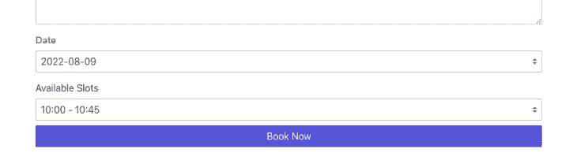
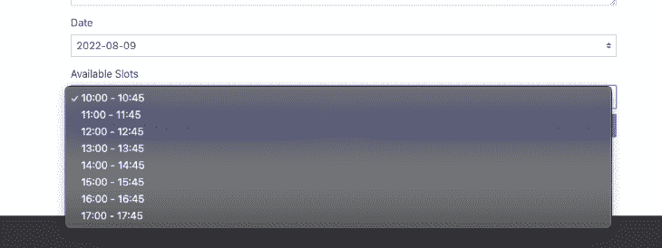
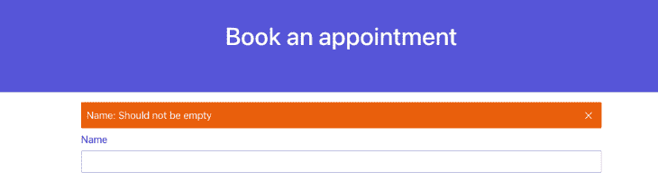

# Remult:构建一个类型安全、全栈的应用日志博客

> 原文：<https://blog.logrocket.com/remult-build-type-safe-full-stack-app-typescript/>

简单的基于 CRUD 的模块是任何业务的常见需求，应该易于构建和维护。Remult 是一个全面的框架，允许开发人员仅使用 TypeScript 代码构建全栈、类型安全的应用程序。

本文将介绍 Remult 的基本概念，并演示如何使用 Remult 来简化和加速您的 web 应用程序开发过程！

在本指南中，我们将创建一个简单的预订表单，并将表单提交存储在 MongoDB 集合中。我们将使用 React 构建 UI，然后使用 [Spectre.css](https://picturepan2.github.io/spectre/) 添加样式。

*向前跳转*

## 了解 Remult 框架

Remult 是一个 CRUD 框架，它使用 TypeScript 实体进行 CRUD 操作。它还为后端数据库操作提供了类型安全的 API 客户端和 ORM。

这个框架抽象掉并减少了应用程序中的样板代码。它使使用 TypeScript 构建全栈应用程序变得容易，也允许开发人员与其他框架(如 Express.js 和 Angular)集成。

Remult 是一个中间立场。它不会强迫你以某种方式工作；相反，它为您的项目提供了许多选项。

## 使用 Remult 设置 React 项目

让我们首先使用 [Create React App](https://create-react-app.dev) 创建一个 React 项目，并选择 TypeScript 模板:

```
> npx create-react-app remult-react-booking-app --template typescript
> cd remult-react-booking-app

```

接下来，我们将安装所需的依赖项。

```
> npm i axios express remult dotenv
> npm i -D @types/express ts-node-dev concurrently

```

在上面的代码中，我们使用了`concurrently`包。这个包是必需的，因为我们将从 React 项目的根目录同时提供客户机和服务器代码。

现在，为服务器创建一个`tsconfig`文件，如下所示:

```
// tsconfig.server.json
{
  "extends": "./tsconfig.json",
  "compilerOptions": {
    "module": "commonjs",
    "emitDecoratorMetadata": true
  }
}

```

然后，在主`tsconfig.json`文件中，添加`experimentalDecorators`选项来启用装饰器的使用。

```
// tsconfig.json

{
  "compilerOptions": {
    // ...
    "experimentalDecorators": true
  },
}

```

更新`package.json`文件，像这样:

```
// package.json

{
  "proxy": "http://localhost:3002",
  // ...
  "scripts": {
  // ...
    "start:dev": "concurrently -k -n \"SERVER,WEB\" -c \"bgBlue.bold,bgGreen.bold\" \"ts-node-dev -P tsconfig.server.json src/server/\" \"react-scripts start\""
  },
}

```

这里，我们添加了`proxy`选项，让 webpack dev 服务器知道当应用程序在本地环境中运行时，代理端口 3000 到 3002 上的 API 请求。我们还添加了一个 npm 脚本来同时启动前端和 API 开发服务器。

## 初始化`remultExpress`中间件

现在，让我们在 Create React App 创建的`src`文件夹中创建一个`server`文件夹，并创建一个将初始化`remultExpress`中间件的`api.ts`文件。

```
// src/server/api.ts

import { remultExpress } from "remult/remult-express";

export const api = remultExpress();

```

接下来，为服务器创建一个`.env`文件，并指定 API 端口号。

```
// src/server/.env

API_PORT=3002

```

接下来，创建一个作为服务器根文件的`index.ts`文件，初始化`express`，加载环境变量，并注册`remultExpress`中间件。

```
// src/server/index.ts

import { config } from "dotenv";
config({ path: __dirname + "/.env" });

import express from "express";
import { api } from "./api";

const app = express();
app.use(api);

app.listen(process.env.API_PORT || 3002, () => console.log("Server started"));

```

## 在前端初始化内存

我们将使用 React 应用程序中的全局`Remult`对象通过`axios` HTTP 客户端与 API 服务器通信。

```
// src/common.ts

import axios from "axios";
import { Remult } from "remult";

export const remult = new Remult(axios);

```

此时，主项目设置已经完成，可以在本地服务器上运行了。

使用以下命令:

```
> npm run start:dev

```

## 添加数据库连接

在本指南中，我们将使用 MongoDB 来存储表单提交。要为 Remult 设置 MongoDB 连接池，请使用`remultExpress`中间件的`dataProvider`选项。

首先，您必须将`mongodb`作为一个依赖项安装在您的项目中，就像这样:

```
> npm i mongodb

```

`dataProvider`选项可以接受一个连接到 MongoDB 并返回`MongoDataProvider`对象的`async()`函数，该对象充当 Remult 的连接器。

```
// src/server/api.ts

import { MongoDataProvider } from "remult/remult-mongo";

export const api = remultExpress({
  dataProvider: async () => {
    const client = new MongoClient(process.env.MONGO_URL || "");
    await client.connect();
    console.log("Database connected");
    return new MongoDataProvider(client.db("remult-booking"), client);
  },
});

```

## 用 Remult 实体生成 API 端点

Remult 使用实体来生成 API 端点、API 查询和数据库命令。`entity`用作前端和后端代码的模型类。

* * *

### 更多来自 LogRocket 的精彩文章:

* * *

我们需要两个实体来定义预订对象和可用的每日时段。

在`src`中创建一个`shared`文件夹，它将包含前端和后端共享的代码。然后，在`shared`文件夹下再创建一个存放实体的子文件夹，并创建实体类文件:`Booking.entity.ts`和`Slot.entity.ts`。

要创建一个实体，定义一个具有所需属性的类，并使用`@Entity`装饰器。`@Entity` decorator 接受一个用于确定 API 路径的基本参数、默认的数据库集合或表名，以及一个用于定义实体相关属性和操作的选项参数。

在本指南中，`Slot`实体可定义如下:

```
// src/shared/entities/Slot.entity.ts

import { Entity, Fields, IdEntity } from "remult";

@Entity("slots")
export class Slot extends IdEntity {
  @Fields.string()
  startTime: String;

  @Fields.string()
  endTime: String;
}

```

`@Fields.string`装饰器定义了一个类型为`String`的实体数据字段。这个装饰器也用于描述与字段相关的属性，比如验证规则和操作。

```
// src/shared/entities/Booking.entity.ts

import { Entity, Fields, IdEntity, Validators } from "remult";

@Entity("bookings", {
  allowApiCrud: true
})
export class Booking extends IdEntity {
  @Fields.string({
    validate: Validators.required,
  })
  name: String;

  @Fields.string({
    validate: Validators.required,
  })
  email: String;

  @Fields.string({ validate: Validators.required })
  description: String;

  @Fields.string({
    validate: Validators.required,
  })
  date: String;

  @Fields.string({
    validate: Validators.required,
  })
  slotId: string;
}

```

既然两个实体都已定义，让我们将它们添加到`remultExpress`中间件的`entities`属性。我们还可以使用`initApi`属性将初始数据植入插槽集合。

```
// src/server/api.ts

import { Slot } from "../shared/entities/Slot.entity";
import { Booking } from "../shared/entities/Booking.entity";

export const api = remultExpress({
  entities: [Slot, Booking],
  initApi: async (remult) => {
    const slotRepo = remult.repo(Slot);
    const shouldAddAvailablSlots = (await slotRepo.count()) === 0;

    if (shouldAddAvailablSlots) {
      const availableSlots = [10, 11, 12, 13, 14, 15, 16, 17].map((time) => ({
        startTime: `${time}:00`,
        endTime: `${time}:45`,
      }));

      await slotRepo.insert(availableSlots);
    }
  },
  dataProvider: async () => {
    // ...
  },
});

```

## 构建和设计前端

让我们通过构建表单 UI 来开始应用程序的前端工作。


首先，用以下代码替换`src/App.tsx`文件中的默认样板代码:

```
// src/App.tsx

import "./App.css";
import { BookingForm } from "./components/BookingForm";

function App() {
  return (
    <div className="App">
      <header className="hero hero-sm bg-primary ">
        <div className="hero-body text-center">
          <div className="container grid-md">
            <h1>Book an appointment</h1>
          </div>
        </div>
      </header>
      <BookingForm />
    </div>
  );
}

export default App;

```

现在，让我们添加 Spectre.css 库，使用户界面看起来像样。

```
> npm i spectre.css

```

对于`BookingForm`组件可以参考下面的代码:

```
// src/components/BookingForm.tsx

import { useEffect, useState } from "react";
import { useForm } from "react-hook-form";
import { remult } from "../common";
import { Booking } from "../shared/entities/Booking.entity";
import { Slot } from "../shared/entities/Slot.entity";

const bookingRepo = remult.repo(Booking);

export const BookingForm = () => {
  const {
    register,
    handleSubmit,
    setValue,
    watch,
    setError,
    clearErrors,
    reset,
    formState: { errors },
  } = useForm();

  const [availableDates, setAvailableDates] = useState<string[]>([]);
  const [availableSlots, setAvailableSlots] = useState<Slot[]>([]);

  const [isSubmitting, setSubmitting] = useState<boolean>(false);

  const bookingDate = watch("date");

  const onSubmit = async (values: Record<string, any>) => {
    try {
      setSubmitting(true);
      const data = await bookingRepo.save(values);
      console.log({ data });
      reset();
    } catch (error: any) {
      setError("formError", {
        message: error?.message,
      });
    } finally {
      setSubmitting(false);
    }
  };

  // JSX code
  return (
    <form onSubmit={handleSubmit(onSubmit)}>
      <>...</>
    </form>
  );
};

```

这里，我们使用`react-hook-form`库来管理表单状态和输入值。

为了在`bookings`集合中保存提交的值，我们需要为`Booking`实体创建一个存储库对象。

```
const bookingRepo = remult.repo(Booking);

```

Remult 存储库对象提供了在实体上执行 CRUD 操作的方法。在本例中，我们使用`save()` repository 方法将数据插入到集合中。

```
await bookingRepo.save(values);

```

## 添加仅后端方法

有时，您可能希望创建带有附加逻辑的自定义 API，比如发送电子邮件、执行多个数据库操作或完成其他顺序任务。

多个数据库操作只能在后端执行，因为在前端使用各种实体级功能可能会影响应用程序的性能。

在 Remult 中实现仅后端方法的一种方式是创建一个控制器类并使用`@BackendMethod`装饰器。

对于我们项目的预订表单，让我们创建两个后端方法。第一种方法`getAvailableDates()`，将获得接下来的五个可用工作日。第二种方法是`getAvailableSlots()`，将按日期获取可用的预订时段。

```
// src/shared/controllers/Booking.controller.ts

import { BackendMethod, Remult } from "remult";
import { Booking } from "../entities/Booking.entity";
import { Slot } from "../entities/Slot.entity";
import { addWeekDays, formattedDate } from "../utils/date";

export class BookingsController {
  @BackendMethod({ allowed: true })
  static async getAvailableDates() {
    const addDates = (date: Date, count = 0) =>
      formattedDate(addWeekDays(date, count));

    return Array.from({ length: 5 }).map((v, idx) => addDates(new Date(), idx));
  }

  @BackendMethod({ allowed: true })
  static async getAvailableSlots(date: string, remult?: Remult) {
    if (!remult) return [];
    const unavailableSlotIds = (
      await remult.repo(Booking).find({ where: { date } })
    ).map((booking) => booking.slotId);

    const availableSlots = await remult
      .repo(Slot)
      .find({ where: { id: { $ne: unavailableSlotIds } } });

    return availableSlots;
  }
}

```

`@BackendMethod`装饰器中的`allowed`属性定义了请求用户是否有权访问 API。在这种情况下，这是真的，因为我们希望 API 是公共的。

您可以拥有控制`allowed`属性的值的授权规则。后端方法也可以访问`remult`对象，以便执行 DB 操作。

要使用后端方法，您不必手动进行任何 API 调用。只需在前端代码中导入控制器，然后像对任何其他模块一样直接调用这些方法。

在内部，Remult 使用 HTTP 客户端为您进行 API 调用，该客户端是在您初始化 Remult 时在前端代码中定义的。这样，就可以保证 API 是类型安全的，并且更容易维护。

```
// src/components/BookingForm.tsx

import { BookingsController } from "../shared/controllers/Booking.controller";

export const BookingForm = () => {
   // ...
  useEffect(() => {
    BookingsController.getAvailableDates().then(setAvailableDates);
  }, []);

  useEffect(() => {
    if (!availableDates.length) return;
    setValue("date", availableDates[0]);
    BookingsController.getAvailableSlots(availableDates[0]).then(
      setAvailableSlots
    );
  }, [availableDates]);

  useEffect(() => {
    BookingsController.getAvailableSlots(bookingDate).then(setAvailableSlots);
  }, [bookingDate]);

  useEffect(() => {
    setValue("slotId", availableSlots[0]?.id);
  }, [availableSlots]);
 // ...
}

```

如下图所示，默认情况下，**日期**和**可用**下拉式表单字段已经预填。





如果我们试图提交带有不完整值的表单，添加到`Booking`实体中的验证规则将会失败并返回一个错误。



要查看本文的完整代码，请参见 [GitHub repo](https://github.com/vijitail/remult-demo) 。

## 结论

Remult 是一个很棒的框架，允许你快速简单地构建类型安全的全栈应用。它简单明了的语法使 Remult 成为任何希望开始类型安全编程的开发人员的完美工具。你可以查阅官方文档来获得本指南中所涉及的方法的更深入的解释。

你还在等什么？今天就给 Remult 一个机会吧！

## [LogRocket](https://lp.logrocket.com/blg/typescript-signup) :全面了解您的网络和移动应用

[](https://lp.logrocket.com/blg/typescript-signup)

LogRocket 是一个前端应用程序监控解决方案，可以让您回放问题，就像问题发生在您自己的浏览器中一样。LogRocket 不需要猜测错误发生的原因，也不需要向用户询问截图和日志转储，而是让您重放会话以快速了解哪里出错了。它可以与任何应用程序完美配合，不管是什么框架，并且有插件可以记录来自 Redux、Vuex 和@ngrx/store 的额外上下文。

除了记录 Redux 操作和状态，LogRocket 还记录控制台日志、JavaScript 错误、堆栈跟踪、带有头+正文的网络请求/响应、浏览器元数据和自定义日志。它还使用 DOM 来记录页面上的 HTML 和 CSS，甚至为最复杂的单页面和移动应用程序重新创建像素级完美视频。

[Try it for free](https://lp.logrocket.com/blg/typescript-signup)

.