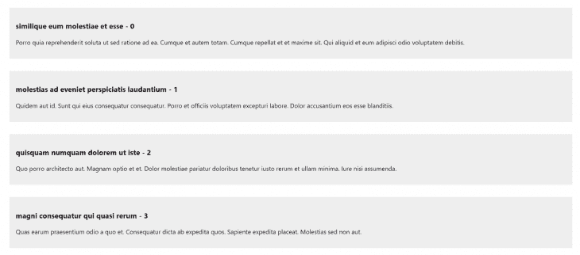
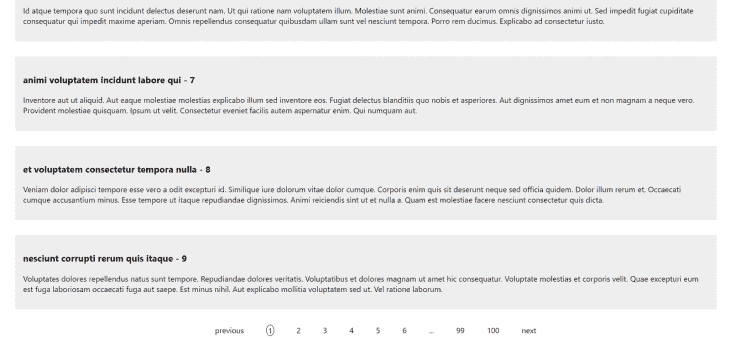

# React 中的大型列表渲染:5 种方法及示例

> 原文：<https://blog.logrocket.com/render-large-lists-react-5-methods-examples/>

***编者按**:本文最后一次更新于 2022 年 7 月 14 日，以替换不再维护的工具。*

列表是大多数 web 应用程序不可或缺的一部分，因为它们有助于以更可展示的格式显示数据。但是，当一个应用程序试图处理列表中的太多数据时，往往会导致性能问题。

在本指南中，我们将概述一些与臃肿的列表相关的问题，然后介绍五种不同的方法，您可以使用这些方法来克服 React 应用程序中的这些性能挑战。

要跟随本教程，您需要以下内容:

*   对 JavaScript 和 React 的大致了解
*   npm ≥v5.2 或纱线安装在您的机器上
*   Node.js ≥v12

## 目录

## 大型列表的性能问题

让我们创建一个示例应用程序，演示当您试图呈现一个包含 10，000 条记录的大型列表时，应用程序的性能和 DOM 树会发生什么变化。

启动您的终端并粘贴下面的代码来创建一个 React 应用程序:

```
npx create-react-app render-list

```

运行下面的代码来安装 [Faker 库](https://fakerjs.dev)，我们将使用它来生成随机数据，以便在我们的应用程序中使用:

```
npm i @faker-js/faker

```

接下来，转到`src`目录中的`App`组件，输入下面的代码:

```
import React from 'react';
import faker from 'faker'
import './App.css';

const data = new Array(10000).fill().map((value, index) => ({ id: index, title: faker.lorem.words(5), body: faker.lorem.sentences(4) }))

function App() {
  return (
    <div>
      {data.map(((item) => (
        <div key={item.id} className="post">
          <h3>{item.title} - {item.id}</h3>
          <p>{item.body}</p>
        </div>
      )))}
    </div>
  );
}
export default App;

```

转到`App.css`文件，添加下面的代码行，为列表添加一点样式:

```
.post{
  background-color: #eee;
  margin: 2rem;
  padding: 1rem;
}
.pagination{
  margin: 1rem auto;
  list-style: none;
  display: flex;
  justify-content: space-evenly;
  width: 50%;
}
.active{
  border: 1px solid black;
  border-radius: 100%;
  padding: 0 3px;
  outline: none;
}

```

上面的代码呈现了一个包含 10，000 条记录的列表。在浏览器中启动 React 应用程序并打开控制台:



当页面加载时，当您滚动时会有明显的滞后。导致延迟的不是大量数据，而是呈现的 DOM 元素。

大型列表可以有条件地或动态地呈现。在 React 中，条件呈现是指根据是否满足特定条件来呈现组件的概念。有多种方式使用条件呈现来呈现列表，如`if`或`else`语句、三元运算符和逻辑`&&`运算符。

另一方面，动态渲染主要通过使用`map()`方法循环遍历一组数据来渲染组件。使用条件呈现或动态呈现来呈现大型列表各有利弊。

为了更好地演示，让我们来看看解决 React 应用程序中与列表相关的性能问题的五种方法。

分页允许您在页面中呈现数据，而不是一次呈现所有信息。通过这种方式，您基本上控制了页面上显示的数据量，因此不必对 DOM 树施加太多压力。

React 中的大多数 UI 库都带有分页组件，但如果你想快速实现分页而不必安装 UI 库，你可能想看看 [`react-paginate`](https://www.npmjs.com/package/react-paginate) 。该库呈现一个分页组件，该组件接受一些帮助您浏览数据的道具。

要安装该库，请在您的终端中运行以下代码:

```
npm i react-paginate

```

安装后，您可以修改您的`App`组件来分页数据，而不是一次呈现它。将下面的代码粘贴到您的`App`组件中:

```
import React, { useState, useEffect } from 'react';
import ReactPaginate from 'react-paginate';
import faker from 'faker'
import './App.css';

function App() {
  const [pagination, setPagination] = useState({
    data: new Array(1000).fill().map((value, index) => (({
      id: index,
      title: faker.lorem.words(5),
      body: faker.lorem.sentences(8)
    }))),
    offset: 0,
    numberPerPage: 10,
    pageCount: 0,
    currentData: []
  });
  useEffect(() => {
    setPagination((prevState) => ({
      ...prevState,
      pageCount: prevState.data.length / prevState.numberPerPage,
      currentData: prevState.data.slice(pagination.offset, pagination.offset + pagination.numberPerPage)
    }))
  }, [pagination.numberPerPage, pagination.offset])
  const handlePageClick = event => {
    const selected = event.selected;
    const offset = selected * pagination.numberPerPage
    setPagination({ ...pagination, offset })
  }
  return (
    <div>
      {pagination.currentData && pagination.currentData.map(((item, index) => (
        <div key={item.id} className="post">
          <h3>{`${item.title} - ${item.id}`}</h3>
          <p>{item.body}</p>
        </div>
      )))
      }
      <ReactPaginate
        previousLabel={'previous'}
        nextLabel={'next'}
        breakLabel={'...'}
        pageCount={pagination.pageCount}
        marginPagesDisplayed={2}
        pageRangeDisplayed={5}
        onPageChange={handlePageClick}
        containerClassName={'pagination'}
        activeClassName={'active'}
      />
    </div>
  );
}
export default App;

```

在这个例子中，我们将负责分页的细节存储在分页状态中。我们不是一次呈现数据，而是只呈现当前数据，这是通过基于当前偏移量和页面上要显示的记录数对主数据进行切片而获得的。

`ReactPaginate`组件接受一个事件处理程序作为道具，每当页面改变时就调用它。事件处理程序计算当前偏移量，然后用于计算页面加载时要显示的当前数据。

下面是添加分页后应用程序的屏幕截图:



另一种呈现大量数据的方式是无限滚动。无限滚动包括当您向下滚动列表时将数据追加到页面的末尾。当页面最初加载时，只加载数据的子集。当您向下滚动页面时，会追加更多的数据。

在 React 中实现无限滚动有几种方法。我个人比较喜欢用 [`react-infinite-scroller`](https://www.npmjs.com/package/react-infinite-scroller) 。要安装它，请在您的终端中运行以下代码:

```
npm i react-infinite-scroller

```

打开您的`App`组件并粘贴以下代码:

```
import React, { useState } from 'react';
import faker from 'faker'
import InfiniteScroll from "react-infinite-scroller";
import './App.css';

function App() {
  const data = new Array(1000).fill().map((value, index) => ({
    id: index,
    name: faker.name.firstName(5),
    body: faker.lorem.paragraph(8),
  }));
  const showItems = (posts) => {
    var items = [];
    for (var i = 0; i < records; i++) {
      items.push(
        <div className="post" key={posts[i].id}>
          <h3>{`${posts[i].name} - ${posts[i].id}`}</h3>
          <p>{posts[i].body}</p>
        </div>
      );
    }
    return items;
  };
  const itemsPerPage = 20;
  const [hasMore, setHasMore] = useState(true);
  const [records, setrecords] = useState(itemsPerPage);
  const loadMore = () => {
    if (records === data.length) {
      setHasMore(false);
    } else {
      setTimeout(() => {
        setrecords(records + itemsPerPage);
      }, 2000);
    }
  };
  return (
    <InfiniteScroll
      pageStart={0}
      loadMore={loadMore}
      hasMore={hasMore}
      loader={<h4 className="loader">Loading...</h4>}
      useWindow={false}
    >
      {showItems(data)}
    </InfiniteScroll>
  );
}
export default App;

```

基本上，每当用户滚动到页面末尾时，它都会检查`hasMore`属性是否为`false`。如果不是，它会向页面追加更多数据。它继续将数据追加到页面的末尾，直到`hasMore`属性变为 false。

## `react-virtualized`

[`react-virtualized`](https://www.npmjs.com/package/react-virtualized) 是专门为呈现大型列表和表格数据而设计的。它使用了一种类似于无限滚动的技术，叫做窗口技术，只在屏幕上显示列表的可见部分。

与上述解决方案相比，`react-virtualized`的一个优势是它拥有丰富的有用组件，包括`Collection`、`Grid`、``List`、`Masonryf`和`Table`。`

 `要安装`react-virtualized`，启动您的终端并运行以下代码:

```
npm i react-virtualized

```

转到您的`App`组件，粘贴下面的代码:

```
import React from 'react';
import faker from 'faker'
import { List } from "react-virtualized";
import './App.css';

function App() {
  const data = new Array(1000).fill().map((value, id) => (({
    id: id,
    title: faker.lorem.words(5),
    body: faker.lorem.sentences(8)
  })))

  const renderRow = ({ index, key, style }) => (
   <div>
    <div key={key} style={style} className="post">
      <h3>{`${data[index].title}-${data[index].id}`}</h3>
      <p>{data[index].body}</p>
    </div>
   </div>
  )
  return (
    <List
      width={1200}
      height={700}
      rowRenderer={renderRow}
      rowCount={data.length}
      rowHeight={120}
    />
  );
}
export default App;

```

`List`组件使用`width`和`height`道具来设置窗口的尺寸。它还采用了代表列表中每个项目高度的`rowHeight`属性和代表数组长度的`rowCount`。`rowRenderer`采用一个负责渲染每一行的函数:

`react-virtualized`附带了[其他几个处理大列表的选项](https://blog.logrocket.com/rendering-large-lists-with-react-virtualized-82741907a6b3/)。

## `react-window`

[`react-window`](https://www.npmjs.com/package/react-window) 是 React 中高效渲染大型列表的一组组件。该库完全重写了`react-virtualized`，旨在解决与大小和速度相关的缺点。`react-window`也比`react-virtualized`覆盖更多的边缘案例。

通过在您的终端中运行以下代码来安装`react-window`:

```
npm i react-window

```

转到您的`App`组件，用下面的代码替换代码:

```
import React from 'react';
import faker from 'faker'
import { FixedSizeList as List } from "react-window";
import './App.css';

function App() {
  const data = new Array(1000).fill().map((value, id) => (({
    id: id,
    title: faker.lorem.words(5),
    body: faker.lorem.sentences(8)
  })))

  const Row = ({ index, key, style }) => (
   <div>
    <div key={key} style={style} className="post">
      <h3>{`${data[index].title}-${data[index].id}`}</h3>
      <p>{data[index].body}</p>
    </div>
   </div>
  )
  return (
    <List
      width={1400}
      height={700}
      itemCount={data.length}
      itemSize={120}
    >
      {Row}
    </List>
  );
}
export default App;

```

代码和`react-virtualized`很像。我们使用了一个`List`组件，它接受一组定义列表的道具，并传入了一个`Row`组件函数，它负责呈现列表中的每一行。

库的作者在 GitHub 库中概述了`react-window`和`react-virtualized` 之间的[差异。](https://github.com/bvaughn/react-window#how-is-react-window-different-from-react-virtualized)

## 反应视口列表

像`react-virtualized`， [React ViewPort List](https://www.npmjs.com/package/react-viewport-list) 利用了一种叫做开窗的技术，一次只渲染列表的一部分，大大减少了重新渲染组件所需的时间以及创建的 DOM 节点的数量。React 视口列表有一些有趣的功能，如:

*   支持垂直和水平 lists️️
*   支持滚动到索引
*   Flexbox 对齐
*   视口的动态高度和宽度

通过在终端中运行以下代码来安装 React ViewPort List:

```
npm i react-viewport-list

```

转到您的`App`组件，用下面的代码替换现有代码:

```
import React from "react";
import { faker } from "@faker-js/faker";
import { useRef } from "react";
import ViewportList from "react-viewport-list";
const App = () => {
  const ref = useRef(null);
  const items = new Array(1000).fill().map((value, index) => ({
    id: index,
    name: faker.name.firstName(5),
    body: faker.lorem.paragraph(8),
  }));
  return (
    <div className="scroll-container" ref={ref}>
      <ViewportList viewportRef={ref} items={items} itemMinSize={40} margin={8}>
        {(item) => (
          <div key={item.id} className="post">
            <h3>
              {item.name} - {item.id}
            </h3>
            <p>{item.body}</p>
          </div>
        )}
      </ViewportList>
    </div>
  );
};
export default App;

```

`ViewportList`组件接受一个`item`属性，该属性被分配给列表的一组数据。然后，列表呈现为边距为 8px、最小高度为 40px 的行。

## 结论

处理大型列表时，不要一次呈现所有数据以避免 DOM 树过载，这一点很重要。

提高性能的最佳方法取决于您的用例。如果您喜欢在一个地方呈现所有数据，无限滚动或窗口技术将是您的最佳选择。否则，您可能更喜欢将数据分成不同页面的分页解决方案。

## [LogRocket](https://lp.logrocket.com/blg/react-signup-general) :全面了解您的生产 React 应用

调试 React 应用程序可能很困难，尤其是当用户遇到难以重现的问题时。如果您对监视和跟踪 Redux 状态、自动显示 JavaScript 错误以及跟踪缓慢的网络请求和组件加载时间感兴趣，

[try LogRocket](https://lp.logrocket.com/blg/react-signup-general)

.

[ ](https://lp.logrocket.com/blg/react-signup-general) [](https://lp.logrocket.com/blg/react-signup-general) 

LogRocket 结合了会话回放、产品分析和错误跟踪，使软件团队能够创建理想的 web 和移动产品体验。这对你来说意味着什么？

LogRocket 不是猜测错误发生的原因，也不是要求用户提供截图和日志转储，而是让您回放问题，就像它们发生在您自己的浏览器中一样，以快速了解哪里出错了。

不再有嘈杂的警报。智能错误跟踪允许您对问题进行分类，然后从中学习。获得有影响的用户问题的通知，而不是误报。警报越少，有用的信号越多。

LogRocket Redux 中间件包为您的用户会话增加了一层额外的可见性。LogRocket 记录 Redux 存储中的所有操作和状态。

现代化您调试 React 应用的方式— [开始免费监控](https://lp.logrocket.com/blg/react-signup-general)。`