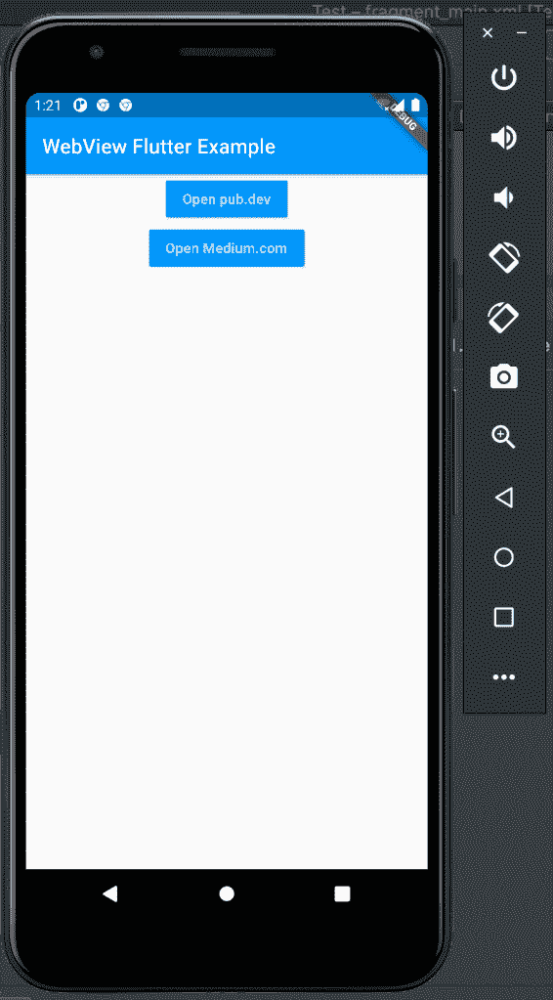
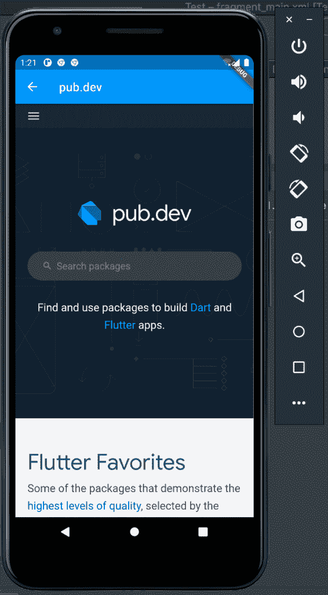
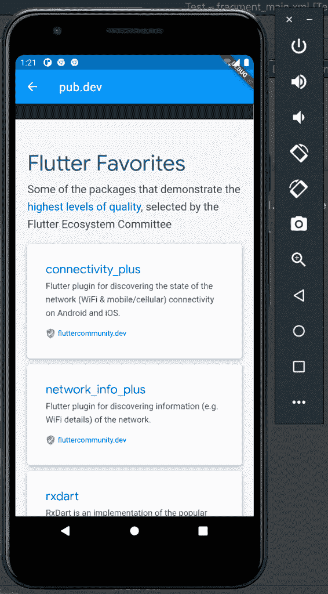
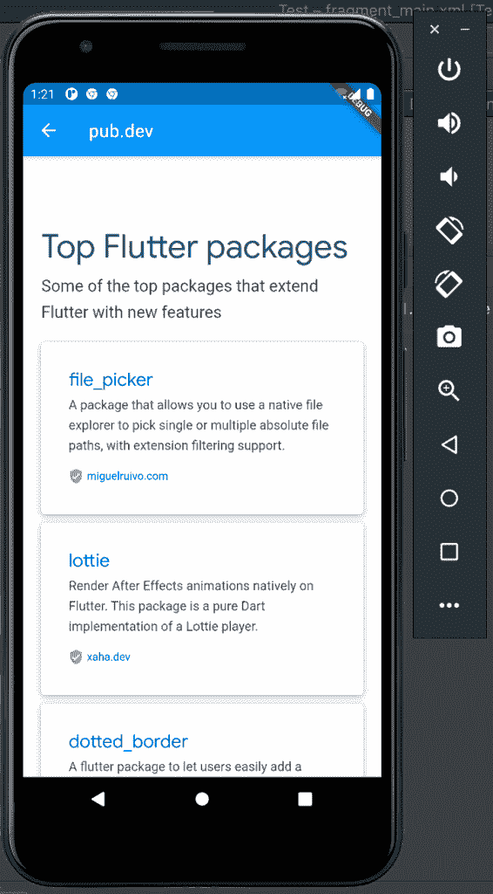
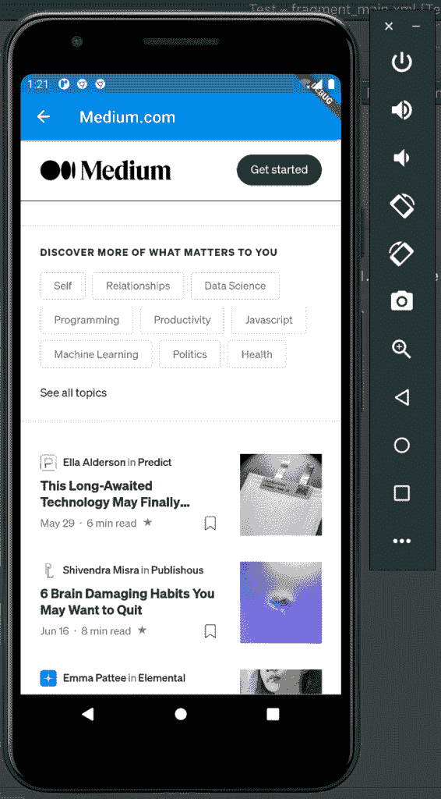
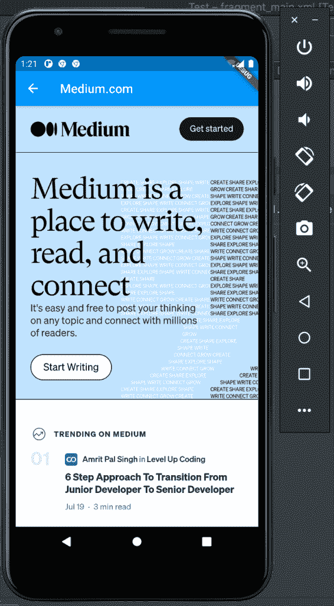

# 使用 Flutter WebView 渲染网页

> 原文：<https://blog.logrocket.com/render-webpages-using-flutter-webview/>

谷歌创建了 Flutter 来简化我们创建应用程序的方式，使我们的应用程序可以在不同的平台上运行，而无需移植代码或重写我们现有的应用程序。

做到这一点并不容易，因为每个本机操作系统都有其独特之处。谷歌不能支持所有这些。所以，Google 把 Flutter 做成可配置的，这样其他开发者也可以开发插件。

现在，我们有一个常见的小部件是 WebView 小部件。这个 WebView 小工具允许我们加载网页。

我们如何在需要的时候在 Flutter 中使用同样的小部件呢？ [Flutter.dev](https://pub.dev/publishers/flutter.dev/packages) 为我们解决了这个问题。他们为此开发了一个 Flutter 插件:它是`webview_flutter`。在本教程中，我们将介绍什么是`webview flutter`，如何使用它，并提供一个真实世界的颤振例子。

## 什么是 Flutter WebView？

`webview_flutter`是一个 Flutter 插件，在 Android 和 iOS 上提供 WebView 小工具。这个插件用于在 Android 和 iOS 设备上显示网页。我们将学习如何使用`webview_flutter`插件从它的 URL 或本地资源加载网页。

## 使用 Flutter WebView 的要求

我们将构建一个 Flutter 项目，因此我们需要一些已经安装在我们机器上的工具:

### 摆动

这是一个用于运行和编译 Flutter 项目的 Flutter SDK。转到 [Flutter 的文档](https://flutter.dev/docs/get-started/install)根据您的操作系统选择 Flutter SDK:

这些链接包含如何在您的机器上安装 Flutter SDK 的说明。安装完成后，确保`flutter`在你的全局路径中。运行命令`flutter --help`来测试 Flutter SDK 是否在您的机器上安装并被全局访问。

### VS 代码

[VS Code](https://code.visualstudio.com/) 是微软带给我们的一款功能强大的现代代码编辑器。它有一个扩展，可以帮助你轻松地使用 VS 代码中的 Flutter。[在你的 VS 代码中安装 Flutter 的扩展](https://marketplace.visualstudio.com/items?itemName=Dart-Code.flutter)。

### 安卓工作室

如果你想在 Android 上运行和测试你的应用，那么你需要在你的机器上安装 Android Studio。然后，我们需要安装 Flutter 和 Dart 插件:

确保一切都已安装并运行。在下一节中，我们将建立一个颤振项目。

## 建立一个颤振项目

现在，我们将创建一个颤振项目。我们将使用`flutter` CLI 工具来完成这项工作。我们颤振项目的名称将是`webviewprj`。运行以下命令:

```
flutter create webviewprj

```

Flutter 会在文件夹`webviewprj`中创建一个项目，然后安装依赖项。在 VS 代码中打开此项目。如果不使用 VS 代码，可以从终端做任何事情，但是必须在首选的代码编辑器中打开项目:

```
cd webviewprj

```

如果你使用的是 VS 代码，就没有必要做上面的事情了。只需进入顶部菜单的**视图**，点击**终端**即可打开 VS 码集成终端。

## 添加`webview_flutter`依赖项

接下来，我们将向我们的项目添加`webview_flutter`依赖项。打开项目根目录下的`pubspec.yaml`文件，并将以下几行添加到其中:

```
dependencies:
  flutter:
    sdk: flutter
  webview_flutter:

```

保存`pubspec.yaml`文件将导致 VS 代码安装依赖项。如果您没有使用 VS 代码，在您的终端中运行下面的命令来安装`webview_flutter`依赖项:

```
flutter pub get webview_flutter

```

`flutter pub`包含管理颤振包的命令。

在一个 Flutter 项目中获得包。在这种情况下，它在我们的颤振项目中获得了`webview_flutter`包。

接下来，我们设置`webview_flutter`插件所需的最低 SDK 版本。打开项目中的`android/app/build.gradle`,将下面的配置代码添加到`android → defaultConfig`部分:

```
android {
    defaultConfig {
        minSdkVersion 19
    }
}

```

`webview_flutter`安卓 v19 以上到最新安卓版本的作品。

## 使用`webview_flutter`

`webview_flutter`导出一个`WebView`类。该类启动并创建一个新的 web 视图，并在 web view 小部件中呈现设置的网页(通过其 URL)。WebView 可以使用一个`WebViewController`来控制，一旦 WebView 被创建，它就被传递给`onWebViewCreated`回调函数。
为了渲染`WebView`小部件，我们需要导入`webview_flutter`包:

```
import 'package:webview_flutter/webview_flutter.dart';

```

然后，我们像这样渲染`WebView`小部件:

```
WebView(
    initialUrl: 'https://medium.com'
);

```

这将加载页面`[https://medium.com](https://medium.com)`并将其呈现在`WebView`小部件中。`WebView`小部件将呈现`[https://medium.com](https://medium.com)`，就像浏览器呈现页面一样。传递给`WebView`的`initialUrl`参数告诉`WebView`要加载和呈现的网页的 URL。
还有其他参数可以传递给`WebView`。下面就让我们来看看:

注意，以下参数及其描述摘自 [WebView 类库文档](https://pub.dev/documentation/webview_flutter/latest/webview_flutter/WebView-class.html)。

*   `onWebViewCreated`:这是一个在创建网络视图后调用的功能
*   `initialUrl`:这是一个字符串，用于保存要在 WebView 上加载和呈现的网页的 URL
*   `javascriptMode`:设置 WebView 中是否启用 JavaScript
*   `javascriptChannels`:WebView 中运行的 JavaScript 代码可用的一组`JavascriptChannels`
*   `navigationDelegate`:决定如何处理导航动作的委托函数
*   `onPageStarted`:页面开始加载时调用
*   `onPageFinished`:页面加载完成时调用
*   `onProgress`:页面加载时调用
*   `debuggingEnabled`:控制是否启用 WebView 调试。默认设置为`false`
*   `gestureNavigationEnabled`:一个布尔值，指示水平滑动手势是否会触发后退-前进列表导航。默认设置为`false`
*   `allowsInlineMediaPlayback`:控制 iOS 上是否允许内嵌播放 HTML5 视频。这个字段在 Android 上被忽略，因为 Android 默认允许。其默认值为`false`

注意，`javascriptMode`和`autoMediaPlaybackPolicy`参数不能为空。

## 使用`WebViewController`方法

创建 WebView 对象时，`WebViewController`作为实例传递给`WebView.onWebViewCreated`。`WebViewController`是用来控制一个 WebView 的，有不同的方法我们可以调用它的实例在 WebView 上执行不同的动作。我们将在下面看到它们:

`canGoBack`:该方法检查是否可以从历史列表中弹出任何以前的 URL

`canGoForward`:检查是否可以从历史列表中弹出下一个 URL

`clearCache`:清除网络视图缓存中的所有项目

`currentUrl`:返回 WebView 正在显示的当前 URL

`getScrollX`:返回滚动条在 WebView 的 x 轴上的当前位置

`getScrollY`:返回滚动条在网络视图 y 轴上的当前位置

`getTitle`:该方法返回 WebView 当前加载页面的标题

`goBack`:加载历史列表中的前一个 URL

`goForward`:从历史列表中的当前 URL 加载下一个 URL

`loadFile`:该方法将文件加载到 WebView 中

`loadFlutterAsset:`将资产从`pubspec.yaml`文件加载到 WebView 中

`loadUrl`:该方法从指定的 URL 加载网页

`reload`:在 WebView 上重新加载当前网页

`runJavascript`:在 WebView 中当前网页的浏览器上下文中执行传递给它的 JavaScript 代码

`runJavascriptReturningResult`:该方法在 WebView 中的当前网页上执行传递给它的 JavaScript 代码，并将执行结果返回给调用者

`scrollBy`:将网页滚动到指定的 x 轴和 y 轴

`scrollTo`:将网页滚动到 WebView 上的一组特定轴上

## 创建小部件页面

现在，我们将在应用程序中创建两个小部件页面:`HomePage`和`WebViewPage`。`HomePage`页面会持有两个按钮。点击每个按钮都会打开`WebViewPage`页面。这个`WebViewPage`页面将呈现一个`WebView`，将网页 URL 传递给`WebView`小部件。

让我们创造它们。Flutter 已经为我们生成了一些代码。除了`MyApp`小部件，我们将取消[其他小部件](https://blog.logrocket.com/widgets-the-building-blocks-of-flutter-apps/)。
打开`lib/main.dart`文件，编辑成如下代码:

```
import 'package:flutter/material.dart';
import 'package:webview_flutter/webview_flutter.dart';
import 'dart:io';

void main() {
  runApp(MyApp());
}

class MyApp extends StatelessWidget {
  // This widget is the root of your application.
  @override
  Widget build(BuildContext context) {
    return MaterialApp(
      title: 'Flutter Demo',
      theme: ThemeData(
        primarySwatch: Colors.blue,
      ),
      home: HomePage()
    );
  }
}

```

请注意，我们在`MyApp`小部件中呈现了`HomePage`。这使得`HomePage`在应用程序打开时呈现。

让我们编写`HomePage`小部件的代码:

```
class HomePage extends StatelessWidget {
  void _handleURLButtonPress(BuildContext context, String url, String title) {
    Navigator.push(context,
        MaterialPageRoute(builder: (context) => WebViewPage(url, title)));
  }
  @override
  Widget build(BuildContext context) {
    return Scaffold(
      appBar: AppBar(
        title: Text("WebView Flutter Example"),
      ),
      body: Center(
          child: Column(
        children: [
          MaterialButton(
            color: Colors.blue,
            child: Text(
              "Open pub.dev",
              style: TextStyle(color: Colors.white70, fontWeight: FontWeight.bold),
            ),
            onPressed: () {
              _handleURLButtonPress(
                  context, "https://pub.dev", "pub.dev");
            },
          ),
          MaterialButton(
            color: Colors.blue,
            child: Text(
              "Open Medium.com",
              style: TextStyle(color: Colors.white70, fontWeight: FontWeight.bold),
            ),
            onPressed: () {
              _handleURLButtonPress(
                  context, "https://medium.com", "Medium.com");
            },
          ),
        ],
      )),
    );
  }
}

```

看到这个`HomePage`呈现了两个按钮`MaterialButton`。每个按钮被设置为点击时调用函数`_handleURLButtonPress`。

第一个按钮`Open pub.dev`，调用`_handleURLButtonPress`，经过`context`、`"https://pub.dev"`和`"pub.dev"`。`"https://pub.dev"`是`WebView`加载并渲染的网页的 URL。`"pub.dev"`将成为`WebViewPage`的`AppBar`称号。

第二个按钮`Open Medium.com`，将调用带有参数`context`、`[https://medium.com.com](https://medium.com.com)`(`WebView`小部件将加载和呈现的网页 URL)和`Medium.com`(`WebViewPage`页面的标题)的函数`_handleURLButtonPress`。

函数`_handleURLButtonPress`启动`WebViewPage`微件页面。它会将页面的 URL 和标题传递给`WebViewPage`。

让我们编写`WebViewPage`小部件的代码:

```
class WebViewPage extends StatefulWidget {
  final String url;
  final String title;

  WebViewPage(this.url, this.title);

  @override
  WebViewPageState createState() =>
      WebViewPageState(this.url, this.title);
}

class WebViewPageState extends State<WebViewPage> {
  final String url;
  final String title;

  WebViewPageState(this.url, this.title);

  @override
  void initState() {
    super.initState();
    // Enable hybrid composition.
    if (Platform.isAndroid) WebView.platform = SurfaceAndroidWebView();
  }

  @override
  Widget build(BuildContext context) {
    return Scaffold(
        appBar: AppBar(
          title: Text(this.title),
        ),
        body: Column(children: [
          Expanded(
              child: WebView(
                  initialUrl: this.url,
                  javascriptMode: JavascriptMode.unrestricted
              )
          )
        ])
    );
  }
}

```

`WebViewPage`是一个有状态的小部件，`WebPageState`是`WebViewPage`的逻辑和内部状态。

`WebViewPage`构造函数取`url`和`title`。它在`createState`方法中将其传递给`WebViewPageState`。

当`WebViewPageState`渲染`WebView`时，它将`initialUrl`以`this.url`为值传递给`WebView`。

JavaScript 模式`javascriptMode`被设置为`JavascriptMode.unrestricted`。这种 JavaScript 模式允许网页运行 JavaScript。

## 运行应用程序示例

现在，我们完成了编码。我们将运行应用程序。为此，请在终端中运行以下命令:

```
flutter run

```

如果你使用的是 VS 代码，右击`lib/main.dart`，点击 **`Run Without Debugging`** 或 **`Start Debugging`** 。此外，确保您的模拟器正在运行。这将在你的手机模拟器上编译应用程序。它看起来是这样的:

### 主页:



点击**打开 pub.dev/**，看起来是这样的:







接下来，点击**打开 Medium.com:**






瞧啊。我们已经使用 Flutter WebView 在 Flutter 应用程序中成功构建了用于渲染和显示网页的小部件。

## 结论

我们在这个教程中学到了很多。

首先，我们从介绍`WebView`以及如何将它移植到 Flutter 开始。接下来，我们介绍了`webview_flutter`，还学习了如何建立一个颤振项目和安装`webview_flutter`依赖项。后来，我们构建了小部件来渲染和显示网页`[https://blog.logrocket.com](https://blog.logrocket.com)`和`[https://logrocket.com](https://logrocket.com)`到来自`webview_flutter`插件的`WebView`小部件上。

有了这个`webview_flutter`插件，我们将能够在我们的 Flutter 应用程序中渲染和显示网页。

看看 GitHub 里的[源代码。](https://github.com/flutter-prjs/webviewprj)

## 使用 [LogRocket](https://lp.logrocket.com/blg/signup) 消除传统错误报告的干扰

[](https://lp.logrocket.com/blg/signup)

[LogRocket](https://lp.logrocket.com/blg/signup) 是一个数字体验分析解决方案，它可以保护您免受数百个假阳性错误警报的影响，只针对几个真正重要的项目。LogRocket 会告诉您应用程序中实际影响用户的最具影响力的 bug 和 UX 问题。

然后，使用具有深层技术遥测的会话重放来确切地查看用户看到了什么以及是什么导致了问题，就像你在他们身后看一样。

LogRocket 自动聚合客户端错误、JS 异常、前端性能指标和用户交互。然后 LogRocket 使用机器学习来告诉你哪些问题正在影响大多数用户，并提供你需要修复它的上下文。

关注重要的 bug—[今天就试试 LogRocket】。](https://lp.logrocket.com/blg/signup-issue-free)

### 参考