# 使用 React Virtualized 呈现大型列表

> 原文：<https://blog.logrocket.com/rendering-large-lists-react-virtualized/>

***编者按*** : *本文最后一次更新于 2023 年 3 月 1 日升级 React 和其他库版本，在功能组件中重新编写示例，用网格、集合、UI/UX 改进示例扩展教程。*

web 应用程序中的一个常见需求是显示数据列表。或者带有标题和滚动条的表格。你可能已经做过几百次了。

但是如果你需要同时显示几千行呢？

如果分页技术不是一个选项(或者可能是，但是您仍然必须显示大量信息)，该怎么办？无限滚动技术仅限制呈现未来的元素，并呈现所有先前的行，这导致了非常大的列表的性能问题。

在本文中，我将向您展示如何使用 [react-virtualized](https://github.com/bvaughn/react-virtualized) 高效地显示大量数据。

首先，您将看到渲染巨大数据集的问题。然后，您将了解 React Virtualized 如何解决这些问题，以及如何使用 [List](https://bvaughn.github.io/react-virtualized/#/components/List) 和 [Autosizer](https://bvaughn.github.io/react-virtualized/#/components/AutoSizer) 组件高效地呈现第一个示例的列表。

您还将了解另外两个有用的组件: [CellMeasurer](https://bvaughn.github.io/react-virtualized/#/components/CellMeasurer) ，用于动态测量行的宽度和高度，以及 [ScrollSync](https://bvaughn.github.io/react-virtualized/#/components/ScrollSync) ，用于同步两个或更多虚拟化组件之间的滚动。

向前跳:

## 为什么使用 react-virtualized？

React 开发人员通常使用`map`函数并呈现多行列表。如果他们使用这种方法来呈现数千行，web 浏览器将总是创建数千个 DOM 元素，即使滚动条通常隐藏溢出的内容。当 DOM 元素的位置随着用户事件(如滚动)而改变时，呈现新的 DOM 元素需要物理内存，并消耗 CPU 和 GPU 硬件。因此，如果我们在 web 应用程序中直接渲染大型列表，浏览器会大量使用计算机内存，并在渲染时增加 CPU/GPU 的使用量(尤其是在初始渲染阶段)。

因此，应用程序的帧率降低，变得缓慢，不再是不友好的用户。您可以在 GitHub 库中试验这个场景。查看以下预览，了解直接呈现的大列表如何影响应用程序性能:

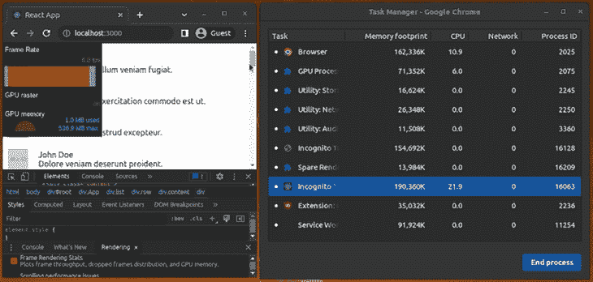

在功能较弱或布局更复杂的设备中，这可能会冻结用户界面，甚至使浏览器崩溃，影响应用程序的可用性。

那么我们如何高效地显示成千上万的行呢？

一种方法是使用 react-virtualized 之类的库，它以一种称为虚拟呈现的性能友好的技术来呈现大型列表。这个库通常只呈现大列表中的可见行，并创建较少的 DOM 元素来降低应用程序的性能开销。换句话说，这个库只显示所需的行，并通过 CSS 样式显示其他隐藏行的存在。

我们来研究一下它内部是如何工作的！

## react 虚拟化是如何工作的？

虚拟渲染背后的主要概念是只渲染可见的东西。

应用程序中有 1000 条评论，但它在任何时候都只显示大约 10 条(适合屏幕的那些)，直到你滚动显示更多。

因此，只加载可见的元素并在它们不可见时卸载它们(用新的元素替换它们)是有意义的。

react-virtualized 使用一组组件实现虚拟渲染，这些组件基本上以下列方式工作:

*   它们根据滚动条位置和视区大小来计算列表显示区域(视区)内哪些项目是可见的
*   他们使用一个带有相对定位的容器(`div`)，通过控制它的顶部、左侧、宽度和高度样式属性来绝对定位其中的子元素

上述实现策略通过仅呈现需要呈现给用户的元素来帮助高效地呈现大型列表。例如，如果您使用 react-virtualized 呈现 10，000 部电影的列表，它不会立即创建 10，000 个 DOM 节点。相反，当用户滚动时，它会指示您有许多带有小尺寸滚动条的电影，并呈现几个(可能 10 或 20 个)可视电影的 DOM 节点。与无限滚动策略不同，当用户向下滚动时，这种实现不会保留 DOM 树中过去的 DOM 元素。

react 虚拟化库提供了五个主要组件:

*   [网格](https://github.com/bvaughn/react-virtualized/blob/master/docs/Grid.md):沿纵轴和横轴呈现表格数据
*   [List](https://github.com/bvaughn/react-virtualized/blob/master/docs/List.md) :在内部使用`Grid`组件呈现元素列表
*   [Table](https://github.com/bvaughn/react-virtualized/blob/master/docs/Table.md) :呈现一个具有固定标题和可垂直滚动的主体内容的表格。它还在内部使用了一个`Grid`组件
*   [Masonry](https://github.com/bvaughn/react-virtualized/blob/master/docs/Masonry.md) :呈现动态大小的、用户定位的单元格，支持垂直滚动
*   [集合](https://github.com/bvaughn/react-virtualized/blob/master/docs/Collection.md):渲染任意位置和重叠的数据

这些组件从 [React 延伸而来。PureComponent](https://reactjs.org/docs/react-api.html#reactpurecomponent) ，这意味着在比较对象时，它只比较它们的引用以提高性能。你可以在这里阅读更多关于这个[的内容。](https://github.com/bvaughn/react-virtualized#pure-components)

另一方面，react-virtualized 还包括一些特定的组件:

*   [ArrowKeyStepper](https://github.com/bvaughn/react-virtualized/blob/master/docs/ArrowKeyStepper.md) :修饰另一个组件，使其能够响应箭头键事件
*   [AutoSizer](https://github.com/bvaughn/react-virtualized/blob/master/docs/AutoSizer.md) :自动调整另一个组件的宽度和高度
*   [CellMeasurer](https://github.com/bvaughn/react-virtualized/blob/master/docs/CellMeasurer.md) :通过以用户不可见的方式临时呈现来自动测量单元格的内容
*   [ColumnSizer](https://github.com/bvaughn/react-virtualized/blob/master/docs/ColumnSizer.md) :计算网格单元格的列宽
*   [InfiniteLoader](https://github.com/bvaughn/react-virtualized/blob/master/docs/InfiniteLoader.md) :当用户滚动列表、表格或网格时，管理数据的获取
*   [多重网格](https://github.com/bvaughn/react-virtualized/blob/master/docs/MultiGrid.md):修饰一个`Grid`组件，添加固定的列和/或行
*   [ScrollSync](https://github.com/bvaughn/react-virtualized/blob/master/docs/ScrollSync.md) :同步两个或多个组件之间的滚动
*   [WindowScroller](https://github.com/bvaughn/react-virtualized/blob/master/docs/WindowScroller.md) :根据窗口的滚动位置使`Table`或`List`组件滚动

现在让我们看看如何使用`List`组件来虚拟化 5000 条评论的例子。

## 虚拟化列表

首先，创建一个新的 React 项目:

```
npx create-react-app react-virtualized-demo

```

按如下方式安装依赖项:

```
npm install react-virtualized lorem-ipsum
# --- or ---
yarn add react-virtualized lorem-ipsum

```

*注意，*如果您遇到 npm 对等依赖解析错误，您可以使用`legacy-peer-deps`选项来修复它。如果 react-virtualized 维护者向 npm 发布[这个提交](https://github.com/bvaughn/react-virtualized/commit/005be24a608add0344284053dae7633be86053b2)，这个对等依赖错误将会消失。

接下来，在`src/App.js`中，从 react-virtualized 导入`List`组件，并进行所有必要的设置:

```
import './App.css';

import { loremIpsum } from 'lorem-ipsum';
import { List } from 'react-virtualized';

const rowCount = 5000;
const listHeight = 400;
const rowHeight = 50;
const rowWidth = 700;

const list = Array(rowCount).fill().map((val, idx) => {
  return {
    id: idx,
    name: 'John Doe',
    image: 'http://via.placeholder.com/40',
    text: loremIpsum({
      count: 1,
      units: 'sentences',
      sentenceLowerBound: 4,
      sentenceUpperBound: 8
    })
  }
});

```

让我们使用`List`组件以虚拟化的方式呈现列表。在上述设置后添加以下代码:

```
function renderRow({ index, key, style }) {
  return (
    <div key={key} style={style} className="row">
      <div className="image">
        
      </div>
      <div className="content">
        <div>{list[index].name}</div>
        <div>{list[index].text}</div>
      </div>
    </div>
  );
}

function App() {
  return (
    <div className="App">
      <div className="list">
        <List
          width={rowWidth}
          height={listHeight}
          rowHeight={rowHeight}
          rowRenderer={renderRow}
          rowCount={list.length}
          overscanRowCount={3} />
      </div>
    </div>
  );
}

export default App;

```

然后，将以下样式定义添加到`src/App.css`:

```
.App {
  text-align: center;
}

.list {
  padding: 10px;
}

.row {
  border-bottom: 1px solid #ebeced;
  text-align: left;
  margin: 5px 0;
  display: flex;
  align-items: center;
}

.image {
  margin-right: 10px;
}

.content {
  padding: 10px;
}

```

注意两件事。

首先，`List`组件要求您指定列表的宽度和高度。它还需要行的高度，这样它就可以计算哪些行将可见。

`rowHeight`属性接受一个固定的行高或者一个返回给定索引的行的高度的函数。

其次，组件需要行数(列表长度)和一个函数来呈现每一行。它不直接拿单子。

由于这个原因，`renderRow`方法的实现需要改变。

这个方法不再接受列表中的对象作为参数。相反，`List`组件将传递给它[一个具有以下属性的对象](https://github.com/bvaughn/react-virtualized/blob/master/docs/List.md#rowrenderer):

```
index.The index of the row.
isScrolling. Indicates if the List is currently being scrolled.
isVisible. Indicates if the row is visible on the list.
key. A unique key for the row.
parent. A reference to the parent List component.
style. The style object to be applied to the row to position it.

```

我们实现了如下的`renderRow`函数:

```
function renderRow({ index, key, style }) {
  return (
    <div key={key} style={style} className="row">
      <div className="image">
        
      </div>
      <div className="content">
        <div>{list[index].name}</div>
        <div>{list[index].text}</div>
      </div>
    </div>
  );
}

```

请注意如何使用`index`属性来访问与正在呈现的行相对应的列表元素。此外，确保将传入的样式添加到`div`元素，以便在滚动期间正确定位行(在这种情况下，库动态应用 CSS `top`属性)。

如果你运行这个应用程序，你会看到这样的内容:

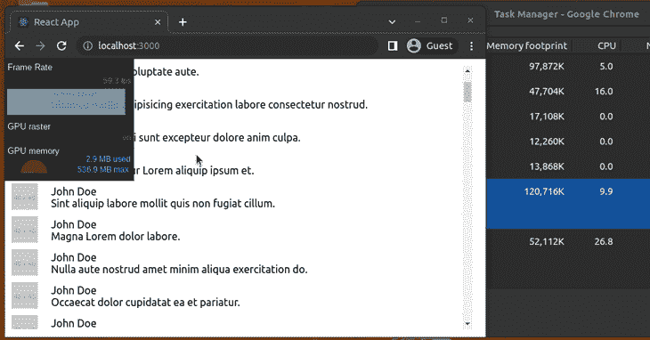

如果您重复帧速率测试，这一次您将看到 59/60 fps 的恒定速率、较低的 RAM 使用率，并且没有 CPU/GPU 使用率峰值。如果我们在 developer tools 选项卡中查看页面的元素，您会看到现在这些行被放置在两个附加的`div`元素中:

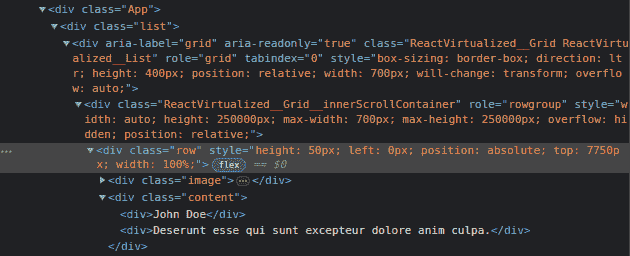

外部的`div`元素(具有 CSS 类`ReactVirtualized__GridReactVirtualized__List`的元素)具有组件中指定的宽度和高度(分别为 700px 和 400px)，并且具有相对位置和`overflow`的值`auto`(用于添加滚动条)。

内部`div`元素(带有 CSS 类`ReactVirtualized__Grid__innerScrollContainer`的元素)的最大宽度为 700px，但高度为 250，000px，这是行数(5，000)乘以每行高度(50)的结果。它也有一个相对位置，但有一个溢出的隐藏值。

所有的行都是这个`div`元素的子元素，这一次，没有 5000 个元素。但是，也不是八九元素；大约还有十个。

这是因为`List`组件呈现了额外的元素，以减少快速滚动导致的闪烁。

附加元素的数量由 [`overscanRowCount`](https://github.com/bvaughn/react-virtualized/blob/master/docs/overscanUsage.md) 属性控制。例如，如果我将`3`设置为该属性的值:

```
<List
  width={rowWidth}
  height={listHeight}
  rowHeight={rowHeight}
  rowRenderer={renderRow}
  rowCount={list.length}
  overscanRowCount={3} />

```

我将在 **Elements** 选项卡中看到的元素数量大约为 12 个。

另外，看看元素和它们的`top`样式是如何动态更新的:

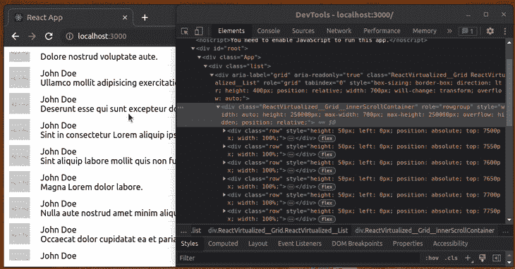

缺点是您必须指定列表的宽度和高度以及行的高度。幸运的是，您可以使用`AutoSizer`和`CellMeasurer`组件来解决这个问题。

先说`AutoSizer`。

## 自动调整虚拟列表的大小

像`AutoSizer`这样的组件使用名为 function 的模式作为子组件。

顾名思义，不是将组件作为子组件传递:

```
<AutoSizer>
  <List
  ...
  />
</AutoSizer>

```

你必须传递一个函数。在这种情况下，它接收计算的宽度和高度:

```
<AutoSizer>
  {
    ({ width, height }) => {}
  }
</AutoSizer>

```

这样，该函数将返回配置了宽度和高度的`List`组件:

```
<AutoSizer>
  {
    ({ width, height }) => (<List
        width={width}
        height={height}
        rowHeight={rowHeight}
        rowRenderer={renderRow}
        rowCount={list.length}
        overscanRowCount={3} />
    )
  }
</AutoSizer>

```

`AutoSizer`组件将填充其父组件的所有可用空间，因此如果您想要填充标题后的所有空间，在`src/App.css`中，您可以将下面一行添加到 list 类中:

```
.list {
  /*...*/
  height: calc(100vh - 20px);
}

```

`vh`单位对应视口的高度(浏览器窗口大小)，所以 100vh 相当于视口高度的 100%。因为`list`类添加的填充(10px x 2)，所以减去了 20px。

如果尚未导入`AutoSizer`组件，请导入:

```
import { List, AutoSizer } from 'react-virtualized';

```

当您运行应用程序时，您应该会看到类似这样的内容:

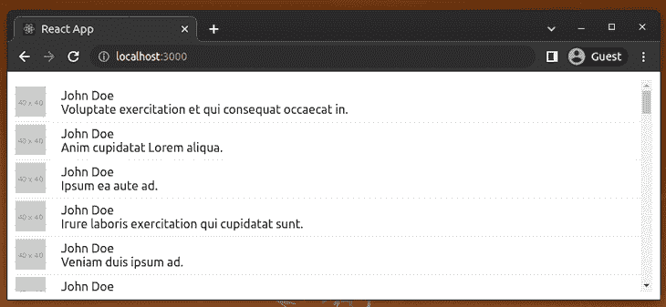

如果调整窗口大小，列表的高度和宽度会自动调整:

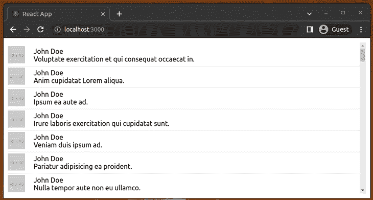

## 自动计算行高

该应用程序会生成一个适合一行的短句，但是如果您将`lorem-ipsum`生成器的设置更改为如下所示:

```
text: loremIpsum({
  count: 2,
  units: 'sentences',
  sentenceLowerBound: 2,
  sentenceUpperBound: 100
})

```

一切都变得一团糟:

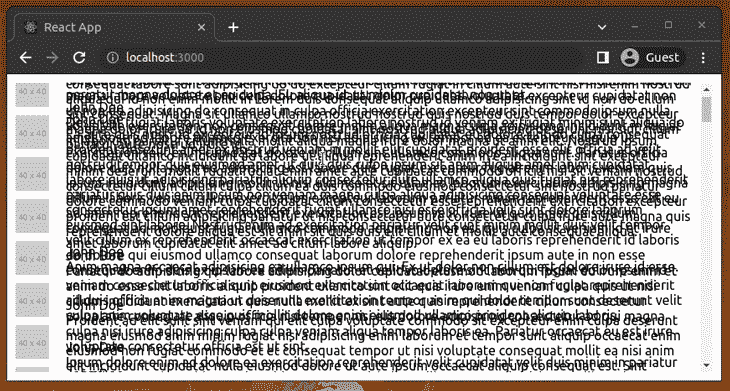

这是因为每个单元格的高度都有一个固定值 50。如果你想拥有动态高度，你必须使用`CellMeasurer`组件。

该组件与 [`CellMeasurerCache`](https://github.com/bvaughn/react-virtualized/blob/master/docs/CellMeasurer.md#cellmeasurercache) 协同工作，后者存储测量值以避免一直重新计算。

要使用这些组件，请先导入它们:

```
import { List, AutoSizer, CellMeasurer, CellMeasurerCache } from 'react-virtualized';

```

接下来，在 constants 部分创建一个`CellMeasurerCache`的实例(在所有导入和`const list…`之后):

```
const cache = new CellMeasurerCache({
  fixedWidth: true,
  defaultHeight: 100
});

```

因为不需要计算行的宽度，所以将`fixedWidth`属性设置为`true`。

接下来，我们需要用`CellMeasurer`更新`renderRow`函数，如下所示:

```
function renderRow({ index, key, style, parent }) {
  return (
    <CellMeasurer
      key={key}
      cache={cache}
      parent={parent}
      columnIndex={0}
      rowIndex={index}>
      {({registerChild}) => (
        <div style={style} className="row" ref={registerChild}>
          <div className="image">
            
          </div>
          <div className="content">
            <div>{list[index].name}</div>
            <div>{list[index].text}</div>
          </div>
        </div>
      )}
    </CellMeasurer>
  );
}

```

请注意以下关于`CellMeasuer`的内容:

*   这个组件是用来区分元素的关键
*   它采用之前配置的缓存
*   它将父组件(`List`)带到要渲染的地方，所以您也需要这个参数
*   使用`registerChild` ref 通过函数将内容部分呈现为组件策略，以避免 [`findDOMNode`](https://github.com/bvaughn/react-virtualized/blob/master/docs/CellMeasurer.md#using-registerchild) [API 错误](https://github.com/bvaughn/react-virtualized/blob/master/docs/CellMeasurer.md#using-registerchild)

最后，您只需要修改`List`组件，使其使用缓存并从缓存中获取其高度:

```
<AutoSizer>
  {
    ({ width, height }) => (<List
        width={width}
        height={height}
        deferredMeasurementCache={cache}
        rowHeight={cache.rowHeight}
        rowRenderer={renderRow}
        rowCount={list.length}
        overscanRowCount={3} />
    )
  }
</AutoSizer>

```

现在，当您运行应用程序时，一切看起来都很好:

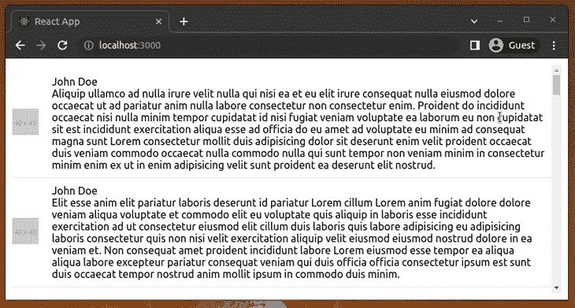

另一个有用的组件是`ScrollSync`。

对于本例，您需要返回到先前的配置，该配置返回一个简短的句子:

```
text: loremIpsum({
  count: 1,
  units: 'sentences',
  sentenceLowerBound: 4,
  sentenceUpperBound: 8
})

```

原因是您[不能在两个组件](https://stackoverflow.com/questions/45682063/react-virtualized-share-cellmeasurercache-for-multiple-grids/45684069#45684069)之间共享一个 CellMeausure 缓存，所以我接下来要展示的两个列表不能有动态高度，就像前面的例子一样。至少不是以一种简单的方式。

如果你想要动态高度类似于本节的例子，最好使用[多重网格](https://bvaughn.github.io/react-virtualized/#/components/MultiGrid)组件。

继续，首先导入`ScrollSync`，撤销代码并移除动态高度特性。或者，在`src/App.js`中使用以下代码:

```
import './App.css';

import { loremIpsum } from 'lorem-ipsum';
import { List, AutoSizer } from 'react-virtualized';

const rowCount = 5000;
const listHeight = 400;
const rowHeight = 50;
const rowWidth = 700;

const list = Array(rowCount).fill().map((val, idx) => {
  return {
    id: idx,
    name: 'John Doe',
    image: 'http://via.placeholder.com/40',
    text: loremIpsum({
      count: 1,
      units: 'sentences',
      sentenceLowerBound: 4,
      sentenceUpperBound: 8
    })
  }
});

function renderRow({ index, key, style }) {
  return (
    <div key={key} style={style} className="row">
      <div className="image">
        
      </div>
      <div className="content">
        <div>{list[index].name}</div>
        <div>{list[index].text}</div>
      </div>
    </div>
  );
}

function App() {
  return (
    <div className="App">
      <div className="list">
        <AutoSizer>
          {
            ({ width, height }) => (<List
                width={width}
                height={height}
                rowHeight={rowHeight}
                rowRenderer={renderRow}
                rowCount={list.length}
                overscanRowCount={3} />
            )
          }
        </AutoSizer>
      </div>
    </div>
  );
}

export default App;

import { List, AutoSizer, ScrollSync } from 'react-virtualized';

```

在`render`语句中，用`ScrollSync`组件中的`list`类包装`div`元素，如下所示:

```
<ScrollSync>
  {({ onScroll, scrollTop, scrollLeft }) => (
    <div className="list">
      <AutoSizer>
      {
        ({ width, height }) => {
          return (
            <List
              width={width}
              height={height}
              rowHeight={rowHeight}
              onScroll={onScroll}
              rowRenderer={renderRow}
              rowCount={list.length}
              overscanRowCount={3} />
          )
        }
      }
      </AutoSizer>
    </div>
  )
}
</ScrollSync>

`ScrollSync` also takes a function as a child to pass some parameters. Perhaps the ones that you’ll use most of the time are:
onScroll. A function that will trigger updates to the scroll parameters to update the other components, so it should be passed to at least one of the child components.
scrollTop. The current scroll-top offset, updated by the onScroll function.
scrollLeft. The current scroll-left offset, updated by the onScroll function.

```

如果您放置一个 span 元素来显示`scrollTop`和`scrollLeft`参数…

```
...
...
<ScrollSync>
  {({ onScroll, scrollTop, scrollLeft }) => (
    <div className="list">
       <span>{scrollTop} - {scrollLeft}</span>
      <AutoSizer>
      {
...
...

```

…然后运行应用程序，您应该会看到当您滚动列表时,`scrollTop`参数是如何更新的:

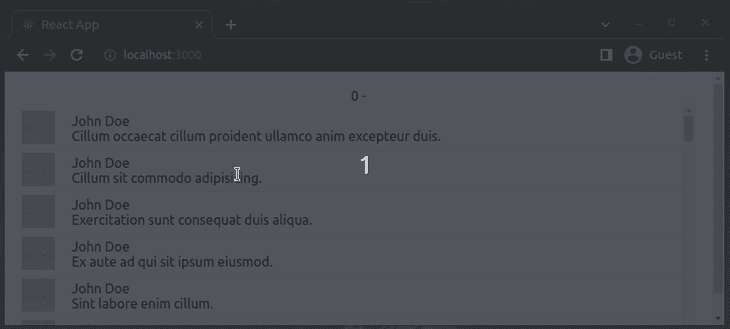

因为列表没有水平滚动，所以`scrollLeft`参数没有值。

现在，对于这个示例，您将添加另一个列表，该列表将显示每个评论的 ID，并且它的滚动将与另一个列表同步。

所以让我们从为这个新列表添加另一个`render`函数开始:

```
function renderColumn({ index, key, style }) {
  return (
    <div key={key} style={style} className="row">
      <div className="content">
        <div>{list[index].id}</div>
      </div>
    </div>
  );
}

```

接下来，在`AutoSizer`组件中，禁用宽度计算:

```
<AutoSizer disableWidth>
{
   ({ height }) => {
     ...
   }
}
</AutoSizer>

```

您不再需要它了，因为您将为两个列表设置一个固定的宽度，并使用绝对位置将它们放在一起。

大概是这样的:

```
<div className="list">
  <AutoSizer disableWidth>
  {
    ({ height }) => (
      <div>
        <div
          style={{
            position: 'absolute',
            top: 0,
            left: 0,
          }}>
            <List
              className="leftSide"
              width={40}
              height={height}
              rowHeight={rowHeight}
              scrollTop={scrollTop}
              rowRenderer={renderColumn}
              rowCount={list.length}
              overscanRowCount={3}  />
        </div>
        <div
          style={{
            position: 'absolute',
            top: 0,
            left: 50,
          }}>
            <List
              width={700}
              height={height}
              rowHeight={rowHeight}
              onScroll={onScroll}
              rowRenderer={renderRow}
              rowCount={list.length}
              overscanRowCount={3}  />
        </div>
      </div>
      )
  }
  </AutoSizer>
</div>

```

注意，`scrollTop`参数被传递给第一个列表，因此它的滚动可以被自动控制，而`onScroll`函数被传递给另一个列表来更新`scrollTop`值。

第一个列表的`leftSide`类只是隐藏了卷轴(因为你不需要它):

```
.leftSide {
  overflow: hidden !important;
}

```

最后，如果您运行应用程序并滚动右侧列表，您将看到另一个列表也是如何滚动的:

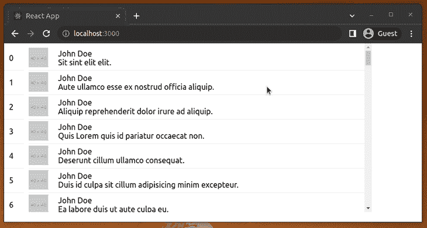

## 改进大型列表的用户界面/UX

实施 UI/UX 改进有助于我们提高 web 应用的质量。大型列表通常看起来很复杂，但是我们可以使用几个 UI/UX 概念来降低复杂性，使它们对用户来说最小化。

### 向行中添加可点击的元素(链接和按钮)

我们可以通过将内容移动到另一个页面、弹出窗口或带有链接或按钮的浏览器窗口来简化复杂的列表或网格。请看下面的示例源:

```
import './App.css';

import { loremIpsum } from 'lorem-ipsum';
import { List, AutoSizer } from 'react-virtualized';

const rowCount = 5000;
const listHeight = 400;
const rowHeight = 80;
const rowWidth = 700;

const list = Array(rowCount).fill().map((val, idx) => {
  return {
    id: idx,
    name: 'The book',
    image: 'http://via.placeholder.com/40',
    text: loremIpsum({
      count: 1,
      units: 'sentences',
      sentenceLowerBound: 4,
      sentenceUpperBound: 8
    }),
    description: loremIpsum({
      count: 5,
      units: 'sentences',
      sentenceLowerBound: 4,
      sentenceUpperBound: 8
    })
  }
});

function renderRow({ index, key, style }) {
  return (
    <div key={key} style={style} className="row">
      <div className="image">
        
      </div>
      <div className="content">
        <div>{list[index].name}</div>
        <div>{list[index].text}</div>
        <button
          style={{marginTop: '8px'}}
          onClick={() => alert(list[index].name + '\n\n' + list[index].description)}
        >Read more...</button>
      </div>
    </div>
  );
}

function App() {
  return (
    <div className="App">
      <div className="list">
        <AutoSizer>
          {
            ({ width, height }) => (<List
                width={width}
                height={height}
                rowHeight={rowHeight}
                rowRenderer={renderRow}
                rowCount={list.length}
                overscanRowCount={3} />
            )
          }
        </AutoSizer>
      </div>
    </div>
  );
}

export default App;

```

上面的代码显示了一个按钮，该按钮显示一行的更多详细信息，如下所示:

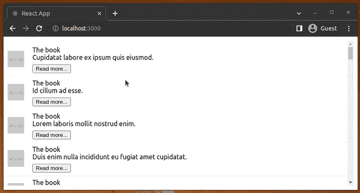

同样，您可以添加链接，甚至使整行都可以点击！

### 创建虚拟化可折叠列表

使列表行可折叠是隐藏复杂细节的另一种选择，无需使用链接或按钮来打开弹出窗口。这一次我们需要如下使用`CellMeasurer`,因为可折叠元素会动态改变行高。将以下代码添加到您的`src/App.js`文件中:

```
import './App.css';

import React, { useState, useEffect } from 'react';
import { loremIpsum } from 'lorem-ipsum';
import { List, AutoSizer, CellMeasurer, CellMeasurerCache } from 'react-virtualized';

const rowCount = 5000;

const list = Array(rowCount).fill().map((val, idx) => {
  return {
    id: idx,
    name: 'John Doe',
    image: 'http://via.placeholder.com/40',
    text: loremIpsum({
      count: 10,
      units: 'sentences',
      sentenceLowerBound: 4,
      sentenceUpperBound: 8
    })
  }
});

const cache = new CellMeasurerCache({
  fixedWidth: true,
  defaultHeight: 100
});

function Collapsible({ children, title, onChange }) {
  const [expanded, setExpanded] = useState(false);
  useEffect(() => {
    onChange && onChange();
  }, [expanded, onChange]);
  return (
    <>
      <div className="accordHeader" onClick={() => setExpanded(!expanded)}>{title}</div>
      { expanded &&
        <>
          {children}
        </>
      }
    </>
  );
}

function renderRow({ index, key, style, parent }) {
  return (
    <CellMeasurer
      key={key}
      cache={cache}
      parent={parent}
      columnIndex={0}
      rowIndex={index}>
      {({registerChild, measure}) => (
        <div style={style} className="row" ref={registerChild}>
          <Collapsible title={list[index].name} onChange={measure}>
            <div className="image">
              
            </div>
            <div className="content">
              <div>{list[index].name}</div>
              <div>{list[index].text}</div>
            </div>
          </Collapsible>
        </div>
      )}
    </CellMeasurer>
  );
}

function App() {
  return (
    <div className="App">
      <div className="list">
        <AutoSizer>
          {
            ({ width, height }) => (<List
                width={width}
                height={height}
                deferredMeasurementCache={cache}
                rowHeight={cache.rowHeight}
                rowRenderer={renderRow}
                rowCount={list.length}
                overscanRowCount={3} />
            )
          }
        </AutoSizer>
      </div>
    </div>
  );
}

export default App;

```

注意，这里我们调用`measure`函数，当可扩展状态改变时，通过`CellMeasurer`调整单元格大小。接下来，对`src/App.css`使用以下内容:

```
.App {
  text-align: center;
}

.list {
  padding: 10px;
  height: calc(100vh - 20px);
}

.row {
  border-bottom: 1px solid #ebeced;
  text-align: left;
  margin: 5px 0;
  display: flex;
  align-items: center;
  flex-wrap: wrap;
}

.image {
  margin-right: 10px;
}

.content {
  padding: 10px;
  flex: 1;
}

.accordHeader {
  background: #ddd;
  width: 100%;
  padding: 8px;
  cursor: pointer;
  margin-bottom: 4px;
}

```

现在，您将看到一个虚拟的可扩展列表，如下所示:

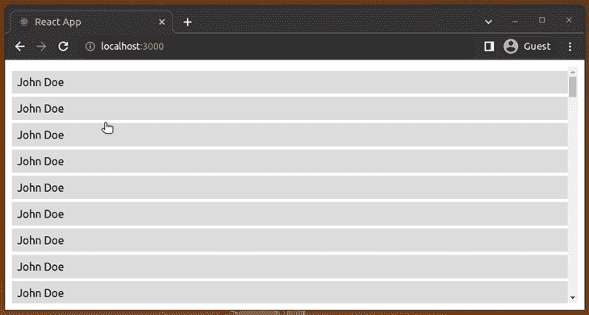

## 虚拟化网格

在上面的代码示例中，我们主要使用了`List`组件来呈现一个大列表。在某些场景中，我们需要在应用程序中呈现大型数据网格。例如，您可能需要创建一个大型表格结构来显示具有数百个订单属性和数千个订单记录的产品订单。

提供了一种创建 1D 数据网格的方法，因为我们只有垂直滚动条。`Grid`让你创建一个 2D 网格，你可以有垂直和水平滚动条。因此，您可以使用滚动事件有效地呈现 x 轴和 y 轴上的元素。

为了演示这个组件，我们可以在一个网格中列出注释。首先，将以下代码添加到您的`src/App.js`文件中:

```
import './App.css';

import { loremIpsum } from 'lorem-ipsum';
import { Grid, AutoSizer } from 'react-virtualized';

const columnCount = 100;
const rowCount = 1000;
const columnWidth = 400;
const rowHeight = 50;

const grid = Array(rowCount).fill().map((val, idx) => (
    Array(columnCount).fill().map((val, idx) => ({
      id: idx,
      name: 'John Doe',
      image: 'http://via.placeholder.com/40',
      text: loremIpsum({
        count: 4,
        units: 'word'
      })
    }))
));

function renderCell({ columnIndex, key, rowIndex, style }) {
  return (
    <div key={key} style={style} className="row">
      <div className="image">
        
      </div>
      <div className="content">
        <div>{grid\[rowIndex\][columnIndex].name}</div>
        <div>{grid\[rowIndex\][columnIndex].text}</div>
      </div>
    </div>
  );
}

function App() {
  return (
    <div className="App">
      <div className="list">
        <AutoSizer>
          {
            ({width, height}) => (
            <Grid
              width={width}
              height={height}
              rowHeight={rowHeight}
              columnWidth={columnWidth}
              cellRenderer={renderCell}
              rowCount={grid.length}
              columnCount={grid[0].length}/>
            )
          }
        </AutoSizer>
      </div>
    </div>
  );
}

export default App;

```

在应用程序中，您现在会看到一个评论网格:

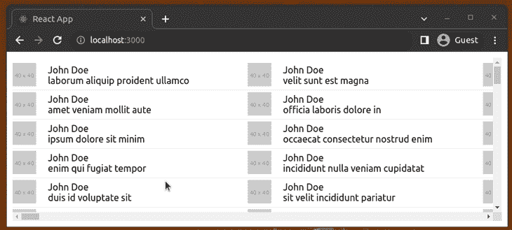

窗口调整事件也会更新网格大小，因为我们已经使用了`AutoSizer`组件。

## 虚拟化收藏

`Grid`组件通常显示棋盘式的数据。因此，它需要一个包含所有 x 轴和 y 轴数据记录的完美网格。换句话说，我们的输入 2D 数组应该包含相同大小的内部数组，因为我们同时使用了`rowIndex`和`columnIndex`。

组件让你不用一个完美的 2D 阵列就能渲染出一个类似网格的结构。因此，您可以使用该组件通过 1D 对象数组来激活两个滚动条。此外，`Collection`允许您通过回调函数以编程方式定位元素，这与`Grid`不同。

请看下面的例子:

```
import './App.css';

import { loremIpsum } from 'lorem-ipsum';
import { Collection, AutoSizer } from 'react-virtualized';

const cellCount = 5000;
const cellWidth = 400;
const cellHeight = 50;

const list = Array(cellCount).fill().map((val, idx) => ({
  id: idx,
  name: 'John Doe',
  image: 'http://via.placeholder.com/40',
  text: loremIpsum({
    count: 4,
    units: 'word'
  })
}));

function renderCell({ index, key, style }) {
  return (
    <div key={key} style={style} className="row">
      <div className="image">
        
      </div>
      <div className="content">
        <div>{list[index].name}</div>
        <div>{list[index].text}</div>
      </div>
    </div>
  );
}

function App() {
  function cellSizeAndPositionGetter({ index }) {
    return {
      height: cellHeight,
      width: cellWidth,
      y: index * cellHeight,
      x: Math.floor(Math.random() * 10) * cellWidth
    }
  }

  return (
    <div className="App">
      <div className="list">
        <AutoSizer>
          {
            ({width, height}) => (
            <Collection
              width={width}
              height={height}
              cellRenderer={renderCell}
              cellCount={list.length}
              cellSizeAndPositionGetter={cellSizeAndPositionGetter}/>
            )
          }
        </AutoSizer>
      </div>
    </div>
  );
}

export default App;

```

在这里，我们使用了`cellSizeAndPositionGetter`函数来定义每个带有`index`和`Math.random`的单元格的位置。上面的代码呈现了一个带有任意位置数据元素的网格，如下面的预览所示:

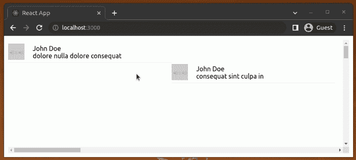

试着用这个组件创建一个简单的相册。您可以从这个演示应用程序中得到一个想法(并浏览源代码)。

## 结论

本文向您展示了如何使用 react-virtualized 以高效的方式呈现大型列表、网格和数据集合。

当然，也有其他库是为了同样的目的而构建的，但是 react-virtualized 有很多功能，并且维护得很好。另外，还有一个 [Gitter chat](https://gitter.im/bvaughn/react-virtualized) 和一个 [StackOverflow tag](https://stackoverflow.com/questions/tagged/react-virtualized) 来询问社区问题。