# 革新:类固醇依赖性的更新

> 原文：<https://blog.logrocket.com/renovate-dependency-updates-on-steroids/>

本文解决了软件开发项目中的一个重要问题:保持依赖关系最新。更新依赖关系可以消除潜在的安全漏洞，并允许我们使用最新的功能和应用错误修复。在这里，我演示了一种在 CI/CD 环境中使用[renewal](https://github.com/renovatebot/renovate)自动更新依赖项的方法。

## 改造解决什么问题？

看一看你的`package-lock.json`或`yarn.lock`文件，你肯定会注意到你每天都在处理成百上千的依赖项。依赖迟早会导致问题:

*   由于重大变更、重大更新等，维护工作会随着时间的推移而增加。
*   在某种程度上，仅仅因为每天都有如此多的依赖项更新，保持项目更新可能不再可行
*   安全漏洞变得更有可能

因此，一方面，[您应该将依赖项](https://blog.logrocket.com/how-to-keep-javascript-libraries-up-to-date/)更新到更高的版本，以利用新特性，从性能改进中受益，或者弥补安全漏洞。另一方面，更新依赖关系是一项单调乏味的任务，会消耗团队的大量时间，并延迟他们改进产品和构建新功能的工作。

您通常会从仅涉及小版本跳转的及时更新中受益，因为更新很可能不会破坏您的构建。等待太久意味着您的团队必须花费大量精力来执行批量更新，尤其是在涉及重大更新的情况下。

如果一次更新多个依赖项，可能会出现以下问题:

*   您的构建崩溃了——是哪个依赖项的问题？
*   您的构建很好，您已经合并了所有的依赖项，但是您的部署被破坏了——是哪个依赖项导致的呢？

公平地说，定期执行这些手动依赖关系更新是不可持续的。你需要工具支持——谢天谢地，还有翻新！

## 翻新有什么帮助？

[renew](https://github.com/renovatebot/renovate)是一个开源项目，旨在自动更新依赖关系。它扫描已分配项目的包文件(例如，`package.json`、`pom.xml`)，并根据您的 CI/CD 工具的命名约定(我使用术语 MR 前进)创建合并请求(MRs)或拉请求(PRs)。

您甚至可以将游戏进行到当 CI 管道为绿色时，您可以让 MR 自动合并(即，构建正常，林挺正常，并且所有测试都成功)。后者是迈向持续部署的一步，这可能是您团队的目标之一。

注意，Renovate 不像 OWASP 那样分析你的项目的安全性。但是有人会说，如果你保持你的依赖关系是最新的，这将对安全性产生积极的影响，漏洞迟早会被消除。当然，您可以将 renew 与专门的漏洞检测工具结合使用。

## renaissance 如何融入您的工作流程？

renew 支持许多 [CI/CD 工具](https://docs.renovatebot.com/modules/platform/)和[语言](https://docs.renovatebot.com/modules/manager/)。本文描述了如何在 GitHub 和 GitLab 上使用它。

我们配置了一个翻新的“机器人”,它可以由调度程序手动或自动触发。bot 扫描所有分配的项目，并根据您的配置和已识别的依赖关系更新创建一个或多个 MRs。Renovate 提供了多种减少噪音的方法，例如，通过定义分组规则将多个依赖项合并到一个 MR 中，或者自动合并特定的 MR。

翻新允许细粒度的配置。它的配置理念灵感来源于 ESLint 或者 Spring。您可以定义由每个项目配置继承的全局配置。此外，您可以定义特定于项目的配置:扩展继承的基本配置并重写现有设置(例如，automerge 被全局设置为 false，但您在一个特定的项目配置中激活它)。

您可以在许多级别上定义规则:在项目级别上，在依赖类型级别上(例如，仅用于开发依赖项)，或者在特定的依赖项上(例如，忽略 TypeScript >v4.2)。创新追求的是常规而非配置的概念。这意味着，基本配置提供了许多现成的有意义的设置。此外，您可以从已编译的设置列表中进行选择(设置预置和完整配置预置)。

正如我们接下来将看到的，Renovate 直接在 MRs 或邮件通知中提供文档，通知我们哪些配置是活动的，哪些依赖项将被更新，以及内联发行说明并提供继续操作的提示。

## 使用 GitHub 的更新应用程序

为 GitHub 设置[renew 意味着安装关联的](https://docs.renovatebot.com/install-github-app/)[renew app](https://github.com/apps/renovate)。您唯一可以配置的是 renew bot(即 app)扫描哪些存储库。所有其他设置由代码配置。

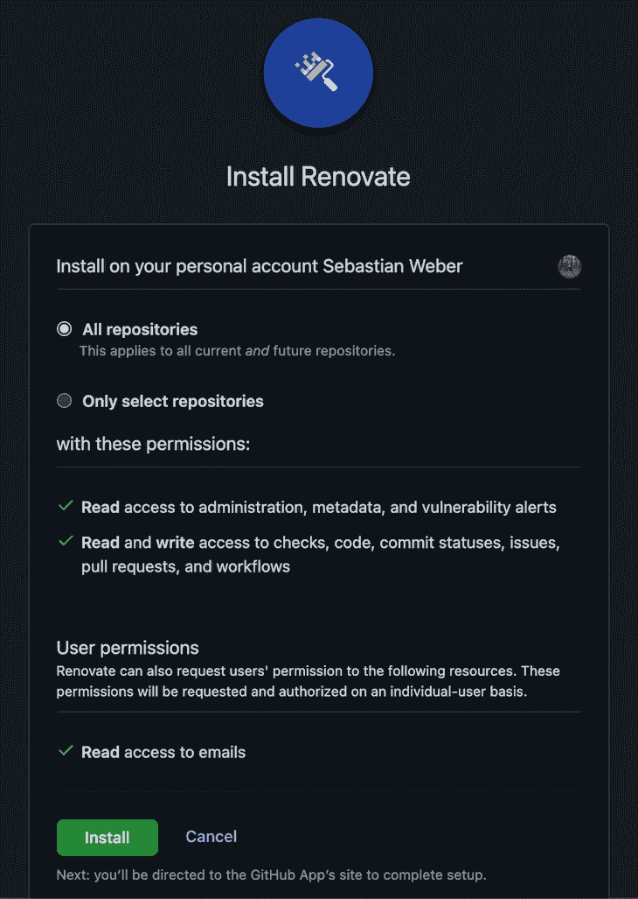

Install the Renovate app in GitHub.

安装完成后，点击您的个人资料图片> **设置** > **应用**即可在 [**应用**部分](https://github.com/settings/installations)找到配置设置。

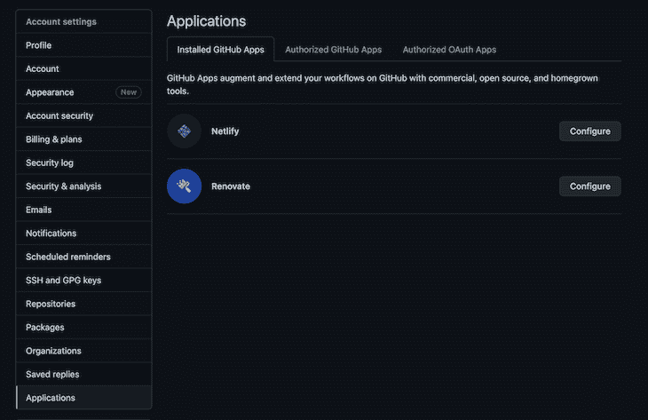

Listing the installed GitHub apps.

点击**配置**并滚动到配置页面的底部，然后更改对您的存储库的访问。

### 登机时

不要担心——renew 不会更新依赖项。您将首先在您被授予更新访问权限的每个存储库中接收一个 onboarding MR。在我的例子中，机器人分析了单个配置的存储库，并描述了接下来会发生什么，所以没有什么意外。

正如您在下面的截图中看到的，renew 已经创建了一个名为“配置 renew”的入职 MR。

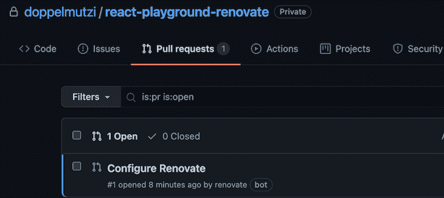

Renovate submits an onboarding MR.

如果你打开 MR，你会看到一个非常详细的描述合并后会发生什么。

首先，你会被通知 Renovate 已经检测到一个`package.json`文件。renew 然后应用默认配置预设并列出具体配置。为此，renewal 将创建一个特定于项目的配置文件(`renovate.json`)。如前所述，我们可以在以后更改配置。


Onboarding MR details.

在“期待什么”一节中，renew 详细描述了哪些依赖项得到了更新以及如何更新。

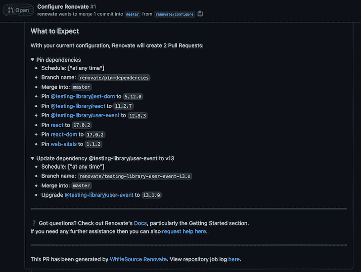

“What to Expect” section in the onboarding MR.

这实际上是说我们使用 renew 提供的默认配置(`config:base`)。翻新提供了[默认配置预置](https://docs.renovatebot.com/presets-default/)(例如`:automergeDisabled`)，我们可以在我们的配置中使用，我们很快就会看到。此外，它将多个预设组合成[全配置预设](https://docs.renovatebot.com/presets-config/)。`config:base`和`config:semverAllMonthly`就是这种全配置预置的例子。

让我们合并这个来激活我们的项目翻新。

### 第一个依赖项更新

如入职 MR 所述，还创建了两个 MR。

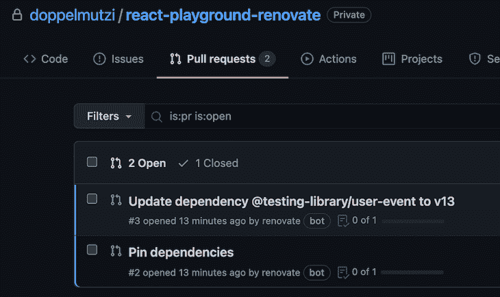

First MRs after onboarding.

让我们来看看第一个 MR，它构成了一个具体的依赖更新 MR。

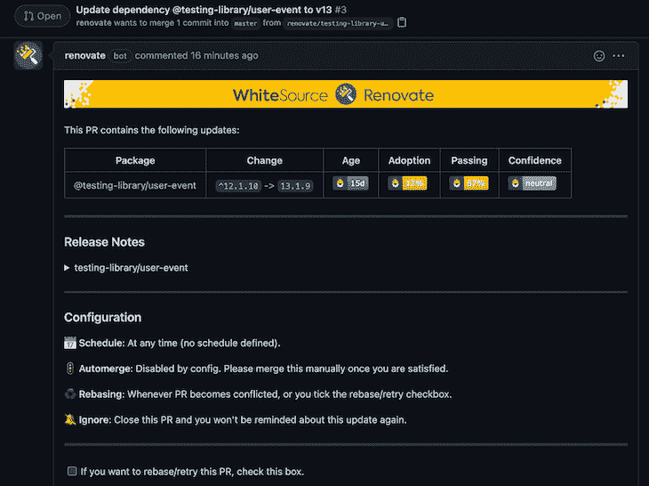

A first dependency update MR.

这位先生详细描述了将要发生的事情。在这个示例项目中，`@testing-library/user-event`依赖项被更新到 v13.1.9。

我喜欢的是你可以在**配置**部分验证你的更新配置。例如，由于默认配置，还没有定义自动合并，所以我们必须手动合并 MR。我们将在后面看到如何改变这一点。

此外，如果您展开该部分，您可以访问发行说明。

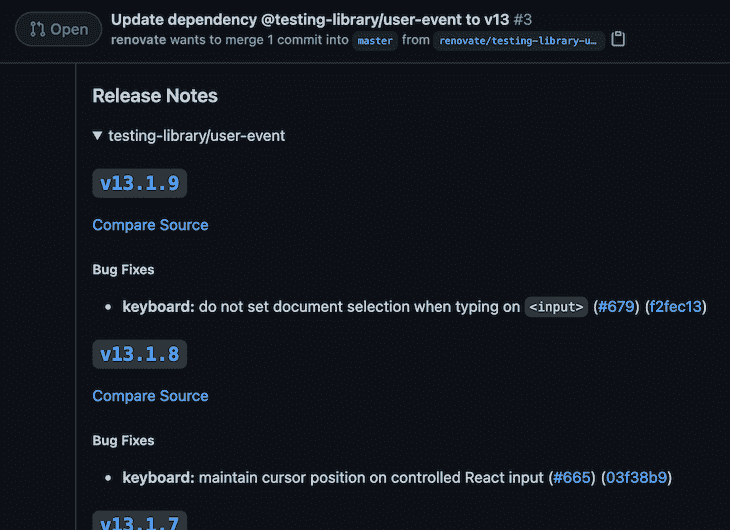

Release notes get inlined into MRs.

第二个 MR [固定依赖关系](https://docs.renovatebot.com/dependency-pinning/)，即移除语义版本范围。这种行为——你猜对了——[是可以改变的](https://docs.renovatebot.com/presets-default/#preservesemverranges)。

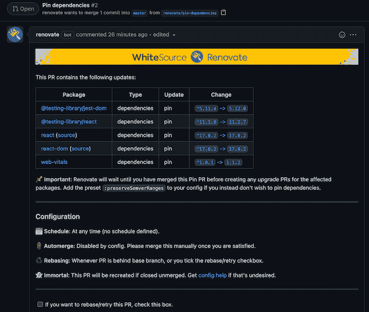

Dependency range versions get removed by the pinning MR.

在文档中详细讨论了关于锁定的细节[。](https://docs.renovatebot.com/dependency-pinning/)

### 扩展默认配置

合并初始入职 MR 后，我们在根文件夹中找到一个`renovate.json`文件。

```
{
  "extends": [
    "config:base"
  ]
}

```

在`extends`数组中，最初定义了一个完整的配置预置(`[config:base](https://docs.renovatebot.com/presets-config/#configbase)`)，表示所有语言的默认基本配置。这种完整的配置预设是默认预设的集合。以下为`config:base`节选:

```
{
  "extends": [
    // ...
    ":ignoreUnstable",
    ":prImmediately",
    ":automergeDisabled",
    ":prHourlyLimit2",
    ":prConcurrentLimit20",
    "group:monorepos",
    "group:recommended",
    // ...
  ]
}

```

在这种配置下，renewal 处于待命状态。但是我们有大量的[配置选项](https://docs.renovatebot.com/configuration-options/)可供选择，所以让我们修改我们的配置。

```
{
  "extends": [
    "config:base"
  ],
  "automerge": true,
  "automergeType": "pr",
  "timezone": "Europe/Berlin",
  "schedule": [
    "after 3pm every day",
    "before 5am every day"
  ]
}

```

我们覆盖由`config:base`(即`:automergeDisabled`)定义的默认合并行为，并指示 renew 自动合并 MRs。

此外，我们通过定义一个定制的调度来覆盖默认的调度行为。`schedule`的默认值是“在任何时候”，这在功能上与声明一个空调度相同；换句话说，renew 将在存储库上全天候运行。我们定义了一个时间表，在每天下午 3 点到凌晨 5 点之间更新依赖关系。

值得一读的是[有效时区名称](https://en.wikipedia.org/wiki/List_of_tz_database_time_zones)以及[翻新的日程选项](https://docs.renovatebot.com/configuration-options/#schedule)。我们也可以使用[日程预设](https://docs.renovatebot.com/presets-schedule/)中的一个，比如`[schedule:nonOfficeHours](https://docs.renovatebot.com/presets-schedule/#schedulenonofficehours)`。

### 自动融合

默认情况下，如果您配置了一个至少有一个运行测试的工作流，那么默认情况下[会执行一个自动合并](https://docs.renovatebot.com/automerge-configuration/)；否则，您需要将`"requiredStatusChecks": null`添加到您的配置中。如果 MRs 需要批准，这是自动合并的另一个障碍。在这种情况下，你需要使用 [GitHub 助手 app](https://github.com/apps/renovate-approve) 。

### 消除噪音

如果你扫描涉及不同技术的多个项目，那么 MRs 的数量很快就会变得惊人。定义自动合并规则是解决这种可能性的重要手段。

这需要[通过努力实现高测试覆盖率来合并置信度](https://docs.renovatebot.com/merge-confidence/)。如果这在当前是不可能的，或者只是一个长期目标，你可能会认为只有补丁级的依赖关系是自动合并的，因为破坏应用程序的风险是可管理的。

为此，您可以利用`[packageRules](https://docs.renovatebot.com/configuration-options/#packagerules)`，这是一个强大的特性，允许您使用正则表达式模式匹配将规则应用到单个包(例如，仅 TypeScript > v4.2)或包组(例如，仅补丁级依赖项的`devDependencies`)。

例如，我们可以添加下面的`packageRule`来只为补丁级依赖项启用自动合并:

```
  "packageRules": [
    {
      "updateTypes": [
        "patch"
      ],
      "automerge": true
  }

```

另一个选择是[根据定义的规则](https://docs.renovatebot.com/configuration-options/#group)对依赖关系进行分组，以减少手动合并的工作量。下面的`packageRule`将所有补丁级`devDependencies`和`dependencies`分组:

```
{
  "packageRules": [
    {
      "matchDepTypes": ["devDependencies", "dependencies],
      "matchUpdateTypes": ["patch"],
      "groupName": "(dev) dependencies (patch)"
    }
  ]
}

```

但是，在出现 bug 的情况下，这可能会导致您必须跟踪哪个依赖项更新导致了 bug。

减少噪音的一个实用的选择是修改你的时间表并降低频率。在我的项目中，我们还使用技术来了解漏洞。如果检测到安全漏洞，您仍有机会执行手动相关性更新。

## 在内部使用 GitLab 进行翻新

如果您在内部运行 GitLab，这一节将介绍如何启动并运行一个翻新机器人。在接下来的几节中，我将展示一个 GitLab 项目，它构成了一个 renew bot，每当发现依赖项时，它就会根据定义的规则为其他 GitLab 项目创建 MRs。与上一节相比，这是一个额外的步骤，在上一节中，我们使用了 GitHub 应用程序。

了解您的存储库的配置(例如，自动合并设置)与 GitHub 方法是相同的，这一点很重要。工作流程也是一样的——入职、pin MRs 等。区别在于如何设置改造机器人。

### 创造一个翻新机器人

与在 GitHub 中使用 renew 相比，我们需要做一些额外的工作来使我们的 renew bot 能够访问其他 GitLab repos 并检索 GitHub 的发行说明。我们必须创建一个专门的 GitLab 项目构成翻新机器人。我们通过手动安装 renew CLI 工具作为 npm 依赖项来对此进行归档。

此外，我们通过创建一个`.gitlab-ci.yml`文件来构建一个管道，以便在 CI/CD 管道中运行 renew CLI 工具。我们的更新配置位于`config.js`文件中。项目结构如下所示:

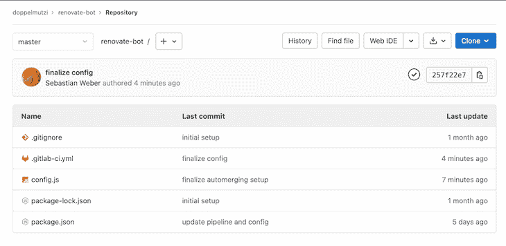

Project structure of the GitLab Renovate bot.

在我们查看文件的内容之前，首先，让我们先考虑访问其他 GitLab 项目。为此，我们需要为 GitLab 帐户创建一个个人访问令牌(PAT ),该帐户有权访问我们想要翻新分析的回购。

点击用户的个人资料图片，进入**首选项**部分。接下来，转到**访问令牌**部分，用范围`api`、`read_user`和`write_repository`创建一个令牌。给它一个合理的名字，复制令牌。

我不喜欢将令牌直接放入管道文件(`.gitlab-ci.yml`)的源代码中，而是创建一个环境变量。进入你的改造机器人项目的**设置**，导航到 **CI/CD** ，展开**变量**部分。点击**添加变量**，勾选**屏蔽变量**，给它一个合理的名称，将 PAT 粘贴到值字段。在我的例子中，我使用变量名`GITLAB_PAT`。

然后，我可以使用`.gitlab-ci.yml`文件中的变量。下面是我们启动和运行 renew bot 所需的所有代码:

```
image: node:latest
check_deps:
  script:
    - export RENOVATE_TOKEN=${GITLAB_PAT}
    - npm i
    - npm run check-dependencies

```

第一行对于在管道运行期间拥有可用的节点环境非常重要。我们定义一个流水线步骤`check_deps`。在`script`部分中，我们需要用前面提到的 PAT 设置一个名为`RENOVATE_TOKEN`的环境变量，以授予对我们想要处理的回购的更新访问权。

当然，我可以将 CI/CD 变量命名为`RENOVATE_TOKEN`并跳过多余的`export`行，但是我更喜欢这种方式来提高可追溯性。要获得更多关于 GitLab CI/CD 的信息，你可以在[官方文档](https://docs.gitlab.com/ee/ci/quick_start/)中找到更多。

有几种方法可以设置 GitLab 自托管 renew bot，但在本例中，我们选择使用 npm 来完成。我们用`npm i`安装所有依赖项，然后运行一个名为`check-dependencies`的 npm 脚本。

`package.json`文件只是添加了 renew 作为一个 dev 依赖项，并提供了一个 npm 脚本来调用 renew CLI 工具:

```
{
  "name": "renovate-bot",
  "devDependencies": {
    "renovate": "*"
  },
  "scripts": {
    "check-dependencies": "renovate",
  }
}

```

我们选择在每次管道运行时使用`*`来安装最新的版本。改造后的配置位于`config.js`:

```
module.exports = {
  platform: 'gitlab',
  endpoint: 'https://gitlab.com/api/v4/',
  gitLabAutomerge: true,
  onboardingConfig: {
    extends: ['config:base'],
  },
  repositories: [
    'doppelmutzi/react-playground'
  ],
  packageRules: [
    {
      matchUpdateTypes: ["patch", "pin"],
      automerge: true
    }
  ],
} 

```

前三行是 GitLab 特有的；其余部分与上述方法相同。

最后，您需要将用户添加到每个 repo 的 member 部分(或者添加到 GitLab 组),该用户有权使用角色 Developer 或 Maintainer 创建 MRs。

### 手动调用修复机器人

我们可以通过启动主管道来手动运行 bot。

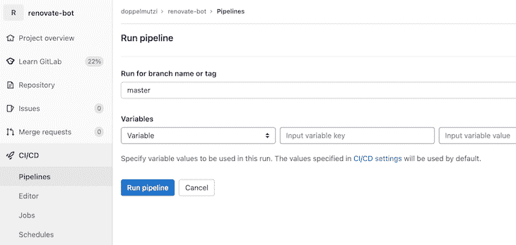

Running the main pipeline by hand.

点击 **CI/CD** ，然后点击**运行管道**按钮，运行主分支管道。如果设置正确，管道步骤应该是绿色的。

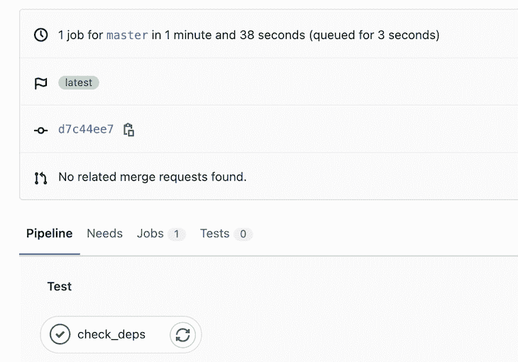

Successfully setup main pipeline.

### 定期运行更新机器人

您可以用不同的方式配置 renew 的不同方面。作为一个例子，我将描述一种定义定期运行 renew 的时间表的替代方法。我们定义了一个[管道时间表](https://docs.gitlab.com/ee/ci/pipelines/schedules.html)，而不是 renew 的时间表选项。转到 **CI/CD 进度表**部分(项目进度表)并创建一个新的进度表。

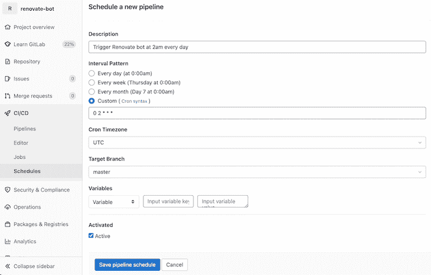

Run Renovate periodically by defining a custom schedule.

有了这一点，我们代表 renew bot 项目的主要管道每天凌晨 2 点运行。

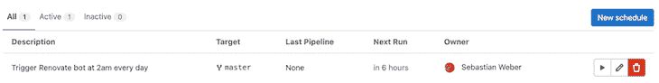

Active schedule to run Renovate periodically.

每当您提交到主分支时，这个管道也会运行。

### 从 GitHub 检索发行说明

为了[用 GitHub renew app 将发行说明](https://docs.renovatebot.com/self-hosting/#githubcom-token-for-release-notes)集成到 MRs 中，如上图所示，你需要[添加一个只读 PAT](https://stackoverflow.com/questions/42652815/github-access-token-with-read-only-access-to-private-repositories/42653410#42653410) 。事实上，创建一个专用的 GitHub 帐户只是为了创建一个用于翻新的 PAT 是一个有效的选择

想要手边有一个 PAT，你需要登录 GitHub，进入开发者设置下的 [PAT 版块](https://github.com/settings/tokens)。点击**生成新令牌**按钮，给它一个合理的注释，在`repo`部分勾选`public_repo`选项。现在复制生成的令牌。

接下来，我们创建一个 CI/CD 环境变量，将其集成到 GitLab 的管道中，而不直接在代码库中显示令牌。我们只需要确保我们设置了一个名为`GITHUB_COM_TOKEN`的[环境变量](https://github.com/renovatebot/renovate/blob/main/docs/usage/self-hosting.md#githubcom-token-for-release-notes)。

在我们的 GitLab 项目中，我们导航到 CI/CD 部分(**设置** > **CI/CD** )并展开**变量**部分。我们需要添加一个变量，并粘贴我们生成的 GitHub 令牌作为值。我们可以用`GITHUB_COM_TOKEN`作为名字，这样就可以了。

我更喜欢给它一个不同的名字，并在`.gitlab-ci.yml`中创建这个环境变量，以提高我的开发伙伴的可跟踪性。假设我创建了一个名为`RELEASE_NOTES_GITHUB_PAT`的变量(我还检查了**掩码变量**)。我将如下使用它:

```
check_deps:
  script:
    - export GITHUB_COM_TOKEN=${RELEASE_NOTES_GITHUB_PTA}
    - export RENOVATE_TOKEN=${GITLAB_PAT}
    - npm i
    - npm run check-dependencies

```

环境变量就绪后，发行说明将集成到每个 MR 中。CI/CD 变量部分如下所示:

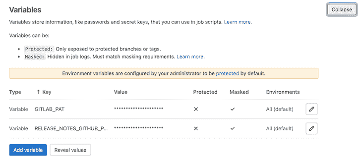

PATs for release notes and access of repos.

### 自动合并和 MR 认证

正如我在 GitHub 部分所描述的，当您为合并请求配置了强制批准时，Renovate 不能自动合并 MRs。与使用 GitHub renew 应用程序相比，在撰写本文时，除了将审批配置为可选之外，在 GitLab 中无法绕过这一障碍。

### 调试功能

如果您尝试新的配置，您可以将[日志级别](https://github.com/trentm/node-bunyan#levels)增加到`debug`，以便从[更新日志模块](https://docs.renovatebot.com/self-hosting/#logging)获得更多信息。通常对于日常使用来说过于啰嗦。

另一个有用的做法是进行[演习](https://docs.renovatebot.com/self-hosted-configuration/#dryrun)，而不是进行实际操作。下面来自`.gitlab-ci.yml`的摘录让除了`master`之外的所有分支在干模式下结合增加的日志级别进行更新。

```
check_deps_dry_run:
  script:
    - export LOG_LEVEL=debug
    - export GITHUB_COM_TOKEN=${RELEASE_NOTES_GITHUB_PAT}
    - export RENOVATE_TOKEN=${GITLAB_PAT}
    - npm i
    - npm run validate-config
    - npm run check-dependencies -- --dry-run=true
  except:
    - master

```

验证所提供的配置文件也很有用。上面的命令`npm run validate-config`调用`package.json`中名为`validate-config`的 npm 脚本。

```
{
  "scripts": {
    "check-dependencies": "renovate",
    "validate-config": "renovate-config-validator config.js"
  }
}

```

它利用内置的`renovate-config-validator`工具来检查我们的配置文件中的错误配置。您可以在管道作业输出中找到任何问题。

### 合并冲突会自动修复

如果一个 MR 被合并，迟早会出现另一个 MR 由于与先前的合并冲突而不能被合并的情况。

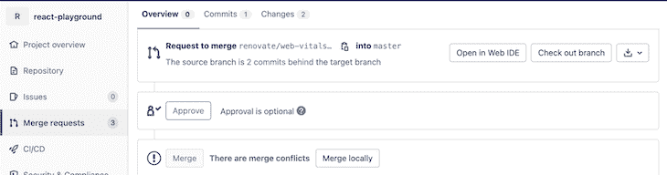

冲突经常发生在`package.json`文件中(不同版本的同一个库的多个条目)。下次运行 renew 时，它将通过使用受影响的依赖项的最新版本来识别和解决这些冲突。

简而言之，大多数时候，你不需要手动解决这些冲突。

## 最终设置

作为本文的总结，本节展示了 git lab renew bot 的最终设置。

以下是`.gitlab-ci.yml`的内容:

```
image: node:latest
check_deps:
  script:
    - export GITHUB_COM_TOKEN=${RELEASE_NOTES_GITHUB_PAT}
    - export RENOVATE_TOKEN=${GITLAB_PAT}
    - npm i
    - npm run validate-config
    - npm run check-dependencies
  only:
    - master
check_deps_dry_run:
  script:
    - export LOG_LEVEL=debug
    - export GITHUB_COM_TOKEN=${RELEASE_NOTES_GITHUB_PAT}
    - export RENOVATE_TOKEN=${GITLAB_PAT}
    - npm i
    - npm run validate-config
    - npm run check-dependencies -- --dry-run=true
  except:
    - master

```

我们的`package.json`长这样:

```
{
  "name": "renovate-bot",
  "devDependencies": {
    "renovate": "*"
  },
  "scripts": {
    "check-dependencies": "renovate",
    "validate-config": "renovate-config-validator config.js"
  }
}

```

并且翻新配置(`config.js`)具有以下形式:

```
module.exports = {
  platform: 'gitlab',
  endpoint: 'https://gitlab.com/api/v4/',
  gitLabAutomerge: true,
  onboardingConfig: {
    extends: ['config:base'],
  },
  repositories: [
    'doppelmutzi/react-playground'
  ],
  packageRules: [
    {
      matchUpdateTypes: ["patch", "pin"],
      automerge: true
    }
  ],
} 

```

## 使用 [LogRocket](https://lp.logrocket.com/blg/signup) 消除传统错误报告的干扰

[](https://lp.logrocket.com/blg/signup)

[LogRocket](https://lp.logrocket.com/blg/signup) 是一个数字体验分析解决方案，它可以保护您免受数百个假阳性错误警报的影响，只针对几个真正重要的项目。LogRocket 会告诉您应用程序中实际影响用户的最具影响力的 bug 和 UX 问题。

然后，使用具有深层技术遥测的会话重放来确切地查看用户看到了什么以及是什么导致了问题，就像你在他们身后看一样。

LogRocket 自动聚合客户端错误、JS 异常、前端性能指标和用户交互。然后 LogRocket 使用机器学习来告诉你哪些问题正在影响大多数用户，并提供你需要修复它的上下文。

关注重要的 bug—[今天就试试 LogRocket】。](https://lp.logrocket.com/blg/signup-issue-free)