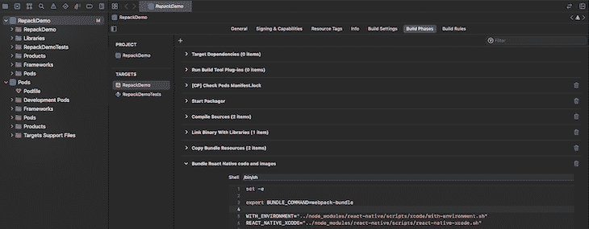
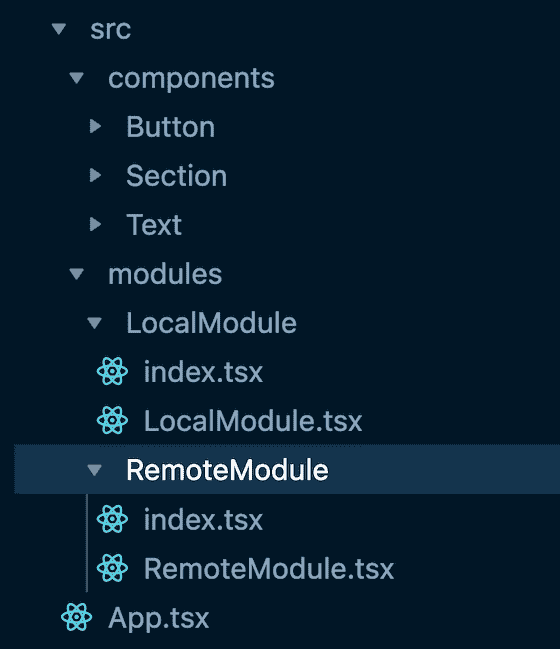
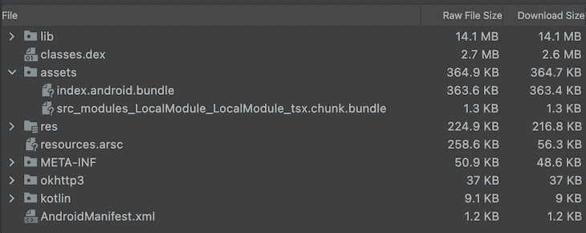
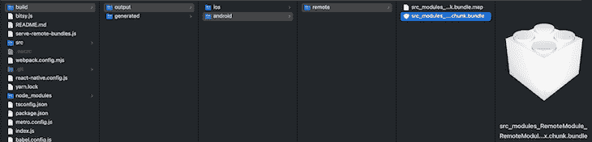

# 对大型 React 本地项目使用 Re.pack

> 原文：<https://blog.logrocket.com/repack-large-scale-react-native-apps/>

Re.pack 是一个基于 webpack 的工具包，用于构建完全支持 webpack 生态系统的 React 原生应用程序，它已经存在了一段时间，通过为 React 原生应用程序带来代码拆分、模块联合和多捆绑支持，正在解决大规模应用程序的一个大问题。

在本文中，我们将看看 Re.pack 为 React 原生应用程序提供了什么，并对其功能进行一个小实验。

向前跳:

## 绑定 JavaScript 和 React Native

捆绑器是所有 JavaScript 应用的基础技术。React 原生应用也是如此；随着我们在 React Native 中开发更复杂的应用程序，有效捆绑大量 JavaScript 的想法开始出现。

脸书最近投资了“我”[tro bundler](https://facebook.github.io/metro/),并在社区的帮助下取得了显著成效。但是对于服务于几十个具有大量特性的模块的大规模应用程序，需要一个更加动态和特性更加丰富的捆绑器。如果你有 webpack，还能去哪里找呢？🙂

Re.pack 带来了社区十年来为 React Native 开发的 webpack 的所有优点，这意味着我们现在可以利用现代思想，如模块联合和动态代码分割，来开发 React Native 应用程序。

## 重新打包功能

### 更好的代码分割

自从 SPAs 出现以来，代码分割就一直是人们谈论的话题，当时我们开始提供大量的 JavaScript 来呈现哪怕是最小的 UI。对于 React 原生 app 来说，就有点不一样了；在这里，它是关于在主线程上只加载所需的 JS，以使我们的应用程序启动更快，并优化内存消耗。尽管 React 悬疑代码拆分现在对于 React 应用来说非常简单，但对于 RN 应用来说仍然是一个麻烦。

Re.pack 允许创建基于悬念的应用程序块，每个块只在需要时加载到主线程上。在本文的后面，我们将探讨这个特性的详细实现。

### 模块联盟

前端工程中最近出现了几种模式，其中最突出的是模块联合——下面是 webpack [如何定义概念](https://webpack.js.org/concepts/module-federation/) [:](https://webpack.js.org/concepts/module-federation/)

> 多个独立的构建应该形成一个应用程序。这些独立的构建就像容器一样，可以在构建之间公开和使用代码，从而创建一个统一的应用程序。

这支持跨应用程序的大量代码重用，而无需处理软件包管理的麻烦。Re.pack 允许 RN 应用程序使用本地和远程块的模块联邦，这使得同时向几个应用程序发布错误修复和升级变得非常容易。

## 插件生态系统

在过去的十年中，社区已经为 webpack 开发了大量的插件，为捆绑领域带来了一些非常酷的想法。为 React 本地捆绑启用 webpack 意味着我们可以利用这些插件，并创建更加优化和高效的 JS 捆绑包。

让我们创建一个小的演示应用程序来测试我们上面讨论的特性。

## 构建我们的演示 React 本机应用程序

### 初始化我们的 React 本地应用

我们将从通过 CLI 使用 TypeScript 模板设置 React 本机应用程序开始:

```
npx react-native init RepackDemo --template react-native-template-typescript
```

### 添加依赖关系

项目启动并运行后，使用以下命令之一将 Re.pack 相关的依赖项添加到我们的应用程序中:

```
npm i -D @callstack/repack babel-loader swc-loader terser-webpack-plugin webpack @types/react
```

或者:

```
yarn add -D @callstack/repack babel-loader swc-loader terser-webpack-plugin webpack @types/react
```

### 配置命令

使用 Re.pack 意味着我们正在远离 React Native 的默认 metro bundler，因此默认的`react-native start`命令不再有用。相反，我们将使用`react-native webpack-start`来运行我们的 JS 服务器。

为了使这个命令在 React Native 中可用，我们必须用以下内容更新我们的`react-native.config.js`:

```
module.exports = {
 commands: require('@callstack/repack/commands'),
};

```

这将使 Re.pack 命令`react-native webpack-start`和`react-native webpack-bundle`与 React Native 无缝挂钩。现在，为了让我们的开发更快，我们将把 package.json 中的`start`脚本更新为`react-native webpack-start`:

```
{
  “scripts”: {
    “start”: “react-native webpack-start”
  }
}

```

### 配置 webpack

为了使用我们新的`start`命令，我们需要一个 webpack 配置文件。出于演示目的，我们使用现成的配置。您可以根据自己的需求不断深入和更新配置。您可以从我们的演示项目中复制[这些配置](https://github.com/zsajjad/RepackDemo/blob/main/webpack.config.mjs)，并将其放在项目根目录下的`webpack.config.mjs`中。

### 配置 iOS 原生

对于发布构建，我们的 JavaScript 是使用 Xcode 的构建阶段任务捆绑的。为了在那里重新打包，我们将更新构建阶段。将下面一行添加到`Bundle React Native code and images`任务:

```
export BUNDLE_COMMAND=webpack-bundle

```



### 配置 Android 原生

就像在 iOS 应用程序中一样，我们将更新`buildCommand`来为 Android 应用程序构建一个命令。

在我们的项目中更新`app/build.gradle`中的以下行:

```
project.ext.react = [
    enableHermes: true,  // clean and rebuild if changing
    bundleCommand: "webpack-bundle",
]

```

🥳:我们现在准备开始在 React Native 中利用 Re.pack 进行 JavaScript 捆绑。

## 代码分割如何与 Re.pack 一起工作

让我们开始探索代码分割如何与 Re.pack 一起工作。重申一下，本地块是应用程序自带的，而远程块是通过网络提供的，不是应用程序构建的一部分。对于我们的例子，我们将创建本地和远程块以获得更好的理解。

这是我们的应用程序回购的样子:



我们创建了两个模块:`LocalModule`和`Remote Module`。

这里是我们封装动态加载的[模块包装器](https://www.dropbox.com/paper/ep/redirect/external-link?url=https%3A%2F%2Fgithub.com%2Fzsajjad%2FRepackDemo%2Fblob%2Fmain%2Fsrc%2Fmodules%2FRemoteModule%2Findex.tsx&hmac=1wAChinqucoFoJ5QsRKWZJ%2BEtoUGg9Ahaqe598n5NfE%3D):

```
/**
 * path: src/modules/RemoteModule/index.tsx
 * description:
 *    This is a remote module that is loaded asynchronously.
 *    This file encapsulate React.lazy and React.Suspense over the remote module.
 */
import React from 'react';
import { Text } from '../../components/Text';
const Component = React.lazy(() => import(/* webpackChunkName: "remoteModule" */ './RemoteModule'));
export default () => (
  <React.Suspense fallback={<Text>Loading Remote Module...</Text>}>
    <Component />
  </React.Suspense>
);

```

下面是[模块的代码](https://github.com/zsajjad/RepackDemo/blob/main/src/modules/RemoteModule/index.tsx)的样子:

```
/**
z * path: src/modules/RemoteModule/RemoteModule.tsx
 * description:
 *   This is a remote module that is loaded asynchronously.
 *   This file is the actual module that is loaded asynchronously.
 */
import React from 'react';
import { useColorScheme, View } from 'react-native';
import { Colors } from 'react-native/Libraries/NewAppScreen';
import { Section } from '../../components/Section';
import { Text } from '../../components/Text';
function RemoteModule() {
  const isDarkMode = useColorScheme() === 'dark';
  return (
    <View
      style={{
        backgroundColor: isDarkMode ? Colors.black : Colors.white,
      }}
    >
      <Section title="Remote Module">
        <Text>
          This module is loading dynamically for execution and is not shipped with the app. It is a remote module.
        </Text>
      </Section>
      <Section title="Details">
        <Text>
          This will not be part of app's initial bundle size. This will be loaded in app after consuming network
          bandwidth.
        </Text>
      </Section>
    </View>
  );
}
export default RemoteModule;

```

一旦我们的模块准备就绪，我们将设置我们的 webpack 配置、app 配置和根文件，以支持这些模块的动态加载。

在应用程序配置方面，我们将定义我们希望动态加载的模块。对于我们的示例，我们将定义以下模块:

```
// app.json
{
  "localChunks": ["src_modules_LocalModule_LocalModule_tsx"],
  "remoteChunks": ["src_modules_RemoteModule_RemoteModule_tsx"],
}

```

这里，`localChunks`是 app 自带的模块，`remoteChunks`是动态加载的模块。这些模块被传递给 webpack 配置，以便能够动态加载这些模块。

在 webpack 配置方面，我们将为应用程序定义入口点。对于我们的示例，我们将定义以下入口点:

```
// webpack.config.mjs#222
new Repack.RepackPlugin({
  ...
  extraChunks: [
    {
      include: appJson.localChunks,
      type: 'local',
    },
    {
      include: appJson.remoteChunks,
      type: 'remote',
      outputPath: path.join('build/output', platform, 'remote'),
    },
  ],
  ...
}),

```

这里，我们在主包旁边定义了两个额外的块——一个用于本地模块，一个用于远程模块。我们还为远程块定义了一个输出路径。在构建过程结束时，远程块将保存在这里。

在根文件端，我们将定义如何加载这些模块。对于我们的示例，让我们定义以下根文件:

```
// index.js
import { AppRegistry, Platform } from 'react-native';
import { ScriptManager, Script } from '@callstack/repack/client';
import App from './src/App';
import { name as appName, localChunks, remoteChunkUrl, remoteChunkPort } from './app.json';

/**
 * We need to set storage for the ScriptManager to enable caching. This enables us to avoid downloading the same script multiple times.
 */
import AsyncStorage from '@react-native-async-storage/async-storage';
ScriptManager.shared.setStorage(AsyncStorage);

/**
 * We need to set a resolver for the ScriptManager to enable loading scripts from the remote server.
 * The resolver is a function that takes a scriptId and returns a promise that resolves to a script object.
 * The script object has the following shape:
 */
ScriptManager.shared.addResolver(async (scriptId) => {
  // For development we want to load scripts from the dev server.
  if (__DEV__) {
    return {
      url: Script.getDevServerURL(scriptId),
      cache: false,
    };
  }

  // For production we want to load local chunks from from the file system.
  if (localChunks.includes(scriptId)) {
    return {
      url: Script.getFileSystemURL(scriptId),
    };
  }

  /**
   * For production we want to load remote chunks from the remote server.
   *
   * We have create a small http server that serves the remote chunks.
   * The server is started by the `start:remote` script. It serves the chunks from the `build/output` directory.
   * For customizing server see `./serve-remote-bundles.js`
   */
  const scriptUrl = Platform.select({
    ios: `http://localhost:${remoteChunkPort}/build/output/ios/remote/${scriptId}`,
    android: `${remoteChunkUrl}:${remoteChunkPort}/build/output/android/remote/${scriptId}`,
  });

  return {
    url: Script.getRemoteURL(scriptUrl),
  };
});

/**
 * We can also add a listener to the ScriptManager to get notified about the loading process. This is useful for debugging.
 *
 * This is optional and can be removed.
 */
ScriptManager.shared.on('resolving', (...args) => {
  console.log('DEBUG/resolving', ...args);
});

ScriptManager.shared.on('resolved', (...args) => {
  console.log('DEBUG/resolved', ...args);
});

ScriptManager.shared.on('prefetching', (...args) => {
  console.log('DEBUG/prefetching', ...args);
});

ScriptManager.shared.on('loading', (...args) => {
  console.log('DEBUG/loading', ...args);
});

ScriptManager.shared.on('loaded', (...args) => {
  console.log('DEBUG/loaded', ...args);
});

ScriptManager.shared.on('error', (...args) => {
  console.log('DEBUG/error', ...args);
});

/**
 * We need to register the root component of the app with the AppRegistry.
 * Just like in the default React Native setup.
 */
AppRegistry.registerComponent(appName, () => App);

```

这使得我们的应用程序可以加载远程模块。我们现在可以运行我们的应用程序并查看结果。因为模块是在调试模式下从开发服务器加载的，所以它与默认设置没有太大的不同。但是在生产模式下，我们可以看到远程模块是在主包旁边创建的，并且是动态加载的。

为了更好地理解，我们创建了一个发布 APK，并将其放在 Android Studio 中的 APK 分析工具下。我们可以看到本地模块不是主包的一部分，而远程模块不在 APK 内部；相反，它是在我们应用程序的 repo 的`build/output/android/remote`目录中创建的:





出于测试目的，我们开始捆绑服务于 HTTP 服务器，并在生产模式下测试我们的应用程序。我们可以看到远程模块是从 HTTP 服务器加载的:

> Dropbox 是一项免费服务，可以让你将照片、文档和视频带到任何地方，并轻松分享。永远不要再给自己发邮件了！

多个入口点

## webpack 的主要优势之一是它允许我们为应用程序创建多个入口点。这对于大规模和 [B](https://en.wikipedia.org/wiki/Brownfield_(software_development)) [rownfield](https://en.wikipedia.org/wiki/Brownfield_(software_development)) 应用程序非常有用，我们希望将我们的应用程序分成多个包。

特别是对于 React Native 为某些功能提供支持的棕色地带应用程序，每个功能都可以被视为一个独立的捆绑包，在它们之间共享某些本机依赖关系。本节将展示如何使用 Re.pack 为我们的应用程序创建多个入口点。

在我们的 app 中，我们创建了一个更小更简单的入口点，`Bitsy`；它是从不同的入口点`/bitsy.js`加载的。

我们更新了 webpack 配置，如下所示:

要从本机启动`Bitsy`，您可以按如下方式更新`MainActivity.java`:

```
    // webpack.config.js#L70
    entry: [
      ...
      path.join(dirname, 'bitsy.js'),
      ...
    ]

```

或者`AppDelegate.m`如下:

```
    // MainActivity.java#L15
    @Override
    protected String getMainComponentName() {
        return "RepackBitsy";
    }

```

运行应用程序将启动`Bitsy`模块，而不是`RepackDemo`应用程序。

```
    // AppDelegate.m#L47
    UIView *rootView = RCTAppSetupDefaultRootView(bridge, @"RepackBitsy", initProps);

```

结论

## 从过去十年开始，webpack 就出现在前端开发中。我们看到了很多围绕它开发的插件，为大型 app 解决捆绑和优化领域的复杂问题。让 React Native 具备所有这些能力，将有助于我们轻松维护大型移动应用。这也可以帮助 RN 应用程序变得更加安全和高效。

用 Re.pack 检查这个[样本项目。您可能需要调整项目的 webpack 配置，以确保获得最佳结果。有关每个选项的详细信息，请参考配置文件和 webpack 文档中的注释。](https://github.com/zsajjad/RepackDemo)

[LogRocket](https://lp.logrocket.com/blg/react-native-signup) :即时重现 React 原生应用中的问题。

## [LogRocket](https://lp.logrocket.com/blg/react-native-signup) 是一款 React 原生监控解决方案，可帮助您即时重现问题、确定 bug 的优先级并了解 React 原生应用的性能。

[](https://lp.logrocket.com/blg/react-native-signup)

LogRocket 还可以向你展示用户是如何与你的应用程序互动的，从而帮助你提高转化率和产品使用率。LogRocket 的产品分析功能揭示了用户不完成特定流程或不采用新功能的原因。

开始主动监控您的 React 原生应用— [免费试用 LogRocket】。](https://lp.logrocket.com/blg/react-native-signup)

Start proactively monitoring your React Native apps — [try LogRocket for free](https://lp.logrocket.com/blg/react-native-signup).