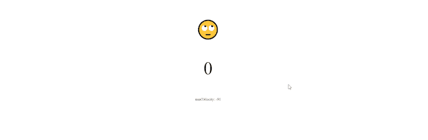

# 用 Tornis 响应浏览器状态变化

> 原文：<https://blog.logrocket.com/responding-to-browser-state-changes-with-tornis/>

浏览器状态跟踪是一种常见的做法——我们总是需要知道用户如何以及以何种配置与我们的网站进行交互。

这很重要，因为它可以帮助我们定制组件以适应这些配置。

如今，有很多应用程序可以帮助我们进行这种跟踪，包括视差、媒体查询和光标跟踪。

Tornis 是一个 JavaScript 库，它可以帮助您从最终用户的浏览器无缝、轻松地跟踪各种状态变化。

Tornis 自我介绍如下:

> Tornis 的名字来自拉脱维亚的森林了望塔，它是一个最小的 JavaScript 库，可以监视浏览器视窗的状态，允许您在发生变化时做出响应。将 Tornis 视为您的视口的商店。

Why Tornis

## 可以使用 JavaScript 事件处理程序手动跟踪 Tornis 商店中所有可跟踪的东西。

然而，与原生 JS 事件处理程序相比，Tornis 具有显著的优势，使其在性能和编码体验方面占据优势。

Tornis 简化了不同事件跟踪的组合以实现目标。

通过使用 Tornis，结合使用复杂的事件处理程序要容易得多。

正如他们网站上提到的，Tornis 采取了一种延迟的方法。

Tornis 没有直接绑定到本地事件，而是对它们进行限制，只捕获最少的更新值。

这仅仅意味着，只有当商店发生变化，并且浏览器准备好呈现时，您的代码才会运行。

查看 Tornis 网站上的[简单视差和滚动跟踪示例。](https://tornis.robbowen.digital/)

安装 Tornis

## 一旦初始化了前端项目，只需在项目根目录中运行以下命令:

Tornis 是用 ES6 的现代 JavaScript 编写的，所以如果你支持传统浏览器，你需要用 babel 来传输文件。

```
npm install tornis --save
```

了解各州追踪的内容

### Tornis 当前跟踪以下项目的状态:

鼠标位置

*   鼠标光标速度
*   视口大小
*   滚动位置
*   滚动速度
*   浏览器相对于屏幕的位置
*   浏览器相对于屏幕的速度
*   设备方向
*   设备像素比率
*   您可以订阅存储更新，并组合这些值来创建各种效果。

托尔尼斯在行动

## 浏览器跟踪最常见的用例之一是创建视差效果。

然而，在这篇文章中，我决定将 Tornis 的能力用于另一个非常有价值的目的——光标速度。

我们将创建一个简单的组件来跟踪鼠标光标的速度，以了解 Tornis 的强大和简单。

每当光标以非常高的速度移动时，我们的组件将有能力呈现令人眩晕的表情符号。

此外，当表情符号从正常变为眩晕时，这个速度将被捕捉到。相当简单的要求。



设置

### 如上所述，在安装 Tornis 之前，我们应该确保我们正在进行一个支持 Babel 的项目。Tornis 是用 ES6 编写的，所以它必须被编译以支持传统浏览器。

我选择和 [Vue.js](https://vuejs.org/) 合作，因为它很容易搭建一个快速脚手架。

如果您想使用 Vue，请按照这些步骤进行设置。

设置好 Vue 项目后，您可以删除未使用的 scaffold 组件和样式，以帮助您从一个干净的组件开始。

现在我们开始使用我们的包管理器安装 Tornis(命令如上)。

安装后，我们将 Tornis 包导入到我们的项目中:

使我们能够绑定一个被监视的函数，该函数将在每次状态更新时运行。

```
import {watchViewport} from "tornis";
```

基本上，这有助于我们观察(跟踪)和更新元素的状态。

托尔尼斯比 `watchViewport` 多得多。

它还有`unwatchViewport`、`getViewportState`和`recalibrateOrientation`。

点击获取[更多信息。](https://github.com/robb0wen/tornis/tree/v0.3.0#standard-usage)

现在我们已经从 Tornis 导入了必要的函数，我们可以开始跟踪状态了。

跟踪状态

## 为了跟踪 Tornis 中的状态，我们传递一组值，每次触发被跟踪的事件时，这些值都会更新。

这是托尔尼斯的心脏。这一功能将使我们能够观察变化并采取相应的行动。

一旦组件被安装，我们需要开始跟踪变更。

在 Vue 的生命周期计划中，合适的时刻在`mounted()`函数内部。

对于我们需要实现的，我们必须跟踪鼠标速度，这是由 Tornis 的状态对象中的`mouse`属性返回的。

从这段代码中，我们已经跟踪了所有的浏览器状态。

```
//...
mounted: function() {
    const updateValues = ({
      size, // tracks viewport size
      scroll, // tracks scroll events
      mouse, // tracks mouse events (position & velocity)
      position, // tracks mouse position
      orientation, // tracks device orientation
      devicePixelRatio // tracks pixel ration
    }) => {
      if (size.changed) {
        // do something related to size
      }

        if (scroll.changed) {
        // do something related to scroll position or velocity
      }

      if (mouse.changed) {
        // do something related to mouse position or velocity
      }

      if (position.changed) {
        // do something related to browser window position or velocity
      }

      if (orientation.changed) {
        // do something related to device orientation
      }

      if (devicePixelRatio.changed) {
        // do something related to pixel ratio
      }
    };

    // bind the watch function
    // By default this will run the function as it is added to the watch list
    watchViewport(updateValues);
  }
//...
```

然而，我们只需要从`mouse`事件中获得的值。

Tornis 的好处在于它以延迟的方式获取数据。

它限制这些值，只捕获最后的更新。这是运行时性能的一大进步。

`watchViewport()`函数使我们能够在观察数值的同时运行函数。

你可能已经注意到了，上面的代码对我们来说还是太繁琐了，因为我们只需要`mouse`相关事件。

让我们把这些乱七八糟的东西收拾一下。

现在我们需要在更新的值和表情符号之间创建交互。我们将利用 Vue 的反应性来创建这个链接。

```
//...
mounted: function() {
    const updateValues = ({mouse}) => {
      if (mouse.changed) {
        // do something related to mouse position or velocity
      }
    };

    // bind the watch function
    // By default this will run the function as it is added to the watch list
    watchViewport(updateValues);
  }
//...
```

我们的单个文件组件现在已经创建好了。让我们根据我们的更新添加将使表情符号的状态改变的逻辑。

```
<template>
  <div id="app">
    <p>{{emoji}}</p>
    <p>{{trackedVelocity}}</p>
    <small>maxVelocity: {{maxVelocity}}</small>
  </div>
</template>

<script>
// import the Tornis store functions
import { watchViewport } from "tornis";

export default {
  name: "App",
  data: function() {
    return {
      emoji: "😀",
      trackedVelocity: 0,
      maxVelocity: 0
    };
  },

  mounted: function() {
    /* const updateValues = ({
    ....  
    */
  }
};
</script>

<style>
/*styling*/
</style>
```

我们的目的是让表情符号在鼠标速度过快时感到眩晕，并记录下最后一次捕捉到的速度。这将在我们的`updateValues`函数中完成。

完整的`App.vue`应该是这样的:

我们的演示已经准备好了:

```
<template>
  <div id="app">
    <p>{{emoji}}</p>
    <p>{{trackedVelocity}}</p>
    <small>maxVelocity: {{maxVelocity}}</small>
  </div>
</template>

<script>
// import the Tornis store functions
import { watchViewport } from "tornis";

export default {
  name: "App",
  components: {},

  data: function() {
    return {
      emoji: "😀",
      trackedVelocity: 0,
      maxVelocity: 0
    };
  },

  mounted: function() {
    const updateValues = ({
      size, // tracks viewport size
      scroll, // tracks scroll events
      mouse, // tracks mouse events (position & velocity)
      position, // tracks mouse position
      orientation, // tracks device orientation
      devicePixelRatio // tracks pixel ration
    }) => {
      if (mouse.changed) {
        // do something related to mouse position or velocity
        this.trackedVelocity = mouse.velocity.x;
        if (
          (mouse.velocity.x > 50 && mouse.velocity.x < 100) ||
          (mouse.velocity.x < -50 && mouse.velocity.x > -100)
        ) {
          this.emoji = "🙄";
          this.maxVelocity = mouse.velocity.x;
        }
        if (
          (mouse.velocity.x > 100 && mouse.velocity.x < 200) ||
          (mouse.velocity.x < -100 && mouse.velocity.x > -200)
        ) {
          this.emoji = "🤢";
          this.maxVelocity = mouse.velocity.x;
        }
        if (mouse.velocity.x > 200 || mouse.velocity.x < -200) {
          this.emoji = "🤮";
          this.maxVelocity = mouse.velocity.x;
        }
      }
    };

    // bind the watch function
    // By default this will run the function as it is added to the watch list
    watchViewport(updateValues);
  }
};
</script>

<style>
#app {
  text-align: center;
  margin-top: 4rem;
}

p {
  font-size: 4rem;
}
</style>
```

tornis-e moji-鼠标跟踪器由 blurdylan 使用@vue/cli-plugin-babel，tor NIS，vue

> > 更大的
> 
> 因为所有的东西都有 React 钩子，所以对于 Tornis 也有[钩子。](https://github.com/Schlipak/react-use-tornis)

## 结论

Tornis 跟踪您的浏览器的视口状态，它做得非常好，具有低性能成本和良好的可伸缩性(或组合不同事件的能力)。

## 请在评论中告诉我你对 Tornis 的体验。

像用户一样体验您的 Vue 应用

调试 Vue.js 应用程序可能会很困难，尤其是当用户会话期间有几十个(如果不是几百个)突变时。如果您对监视和跟踪生产中所有用户的 Vue 突变感兴趣，

## .

LogRocket 就像是网络和移动应用程序的 DVR，记录你的 Vue 应用程序中发生的一切，包括网络请求、JavaScript 错误、性能问题等等。您可以汇总并报告问题发生时应用程序的状态，而不是猜测问题发生的原因。

[try LogRocket](https://lp.logrocket.com/blg/vue-signup)

LogRocket Vuex 插件将 Vuex 突变记录到 LogRocket 控制台，为您提供导致错误的环境，以及出现问题时应用程序的状态。

[](https://lp.logrocket.com/blg/vue-signup)[https://logrocket.com/signup/](https://lp.logrocket.com/blg/vue-signup)

现代化您调试 Vue 应用的方式- [开始免费监控](https://lp.logrocket.com/blg/vue-signup)。

The LogRocket Vuex plugin logs Vuex mutations to the LogRocket console, giving you context around what led to an error, and what state the application was in when an issue occurred.

Modernize how you debug your Vue apps - [Start monitoring for free](https://lp.logrocket.com/blg/vue-signup).