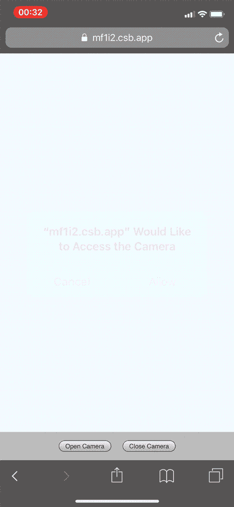

# 用 React 钩子构建一个响应式相机组件

> 原文：<https://blog.logrocket.com/responsive-camera-component-react-hooks/>

## 介绍

我最近的任务是构建一个前端相机组件，允许用户将他们的身份证图像上传到后端服务。在本文中，我将通过解释如何配置实时媒体流、如何用 React 钩子捕获快照以及如何使用样式化组件设置元素的样式和位置来演示我是如何创建该组件的。

因此，本文假设您对 React 16.x 中的功能组件和样式组件库有一定的了解。下面，你可以看到一个运行中的组件的演示，并且在你阅读的时候，可以随意地在我的 [CodeSandbox](https://codesandbox.io/s/react-camera-component-with-hooks-mf1i2) 上玩完整的解决方案。尽情享受吧！



## 配置

让我们从访问浏览器导航器并调用`[getUserMedia()](https://developer.mozilla.org/en-US/docs/Web/API/MediaDevices/getUserMedia)`方法来显示来自用户摄像机的实时视频提要开始。

由于该组件是为拍摄身份证照片而设计的，所以我们可以传递一个不需要音频的配置对象，默认为移动设备上的后置摄像头。通过向 video 属性传递一个 options 对象，video 被假定为`true`。

```
const CAPTURE_OPTIONS = {
    audio: false,
    video: { facingMode: "environment" },
};
```

`getUserMedia()`方法请求用户允许访问配置中定义的媒体。然后它返回一个承诺，要么解析并返回一个可以存储在本地状态的`[MediaStream](https://developer.mozilla.org/en-US/docs/Web/API/MediaStream)`对象，要么拒绝并返回一个错误。

使用 React 的一个`[useEffect()](https://reactjs.org/docs/hooks-effect.html)`钩子，我们创建并存储所请求的流(如果不存在的话)(例如，我们的本地状态为空),或者返回一个清理函数，以防止组件卸载时任何潜在的内存泄漏。清理通过`[getTracks()](https://developer.mozilla.org/en-US/docs/Web/API/MediaStream/getTracks)`方法循环并停止存储在本地状态的每个媒体轨道。

当流存储在本地状态中时，它可以被绑定到一个`<video />`元素。由于 React [不支持`srcObject`属性](https://github.com/facebook/react/pull/9146#issuecomment-355584767)，我们使用一个 ref 来定位视频并将流分配给`[srcObject](https://developer.mozilla.org/en-US/docs/Web/API/HTMLMediaElement/srcObject)`属性。有了有效的来源，视频将触发一个`[onCanPlay()](https://developer.mozilla.org/en-US/docs/Web/API/HTMLMediaElement/canplay_event)`事件，我们可以开始视频回放。

这个实现是必要的，因为 video `autoPlay`属性不能在所有平台上一致地工作。我们可以将所有这些逻辑抽象到一个自定义钩子中，该钩子将配置对象作为参数，创建清理函数，并将流返回给 camera 组件。

```
import { useState, useEffect } from "react";

export function useUserMedia(requestedMedia) {
  const [mediaStream, setMediaStream] = useState(null);

  useEffect(() => {
    async function enableStream() {
      try {
        const stream = await navigator.mediaDevices.getUserMedia(requestedMedia);
        setMediaStream(stream);
      } catch(err) {
        // Removed for brevity
      }
    }

    if (!mediaStream) {
      enableStream();
    } else {
      return function cleanup() {
        mediaStream.getTracks().forEach(track => {
          track.stop();
        });
      }
    }
  }, [mediaStream, requestedMedia]);

  return mediaStream;
}
```

```
import React, { useRef, useState } from 'react';
import { useUserMedia } from './useUserMedia';

const CAPTURE_OPTIONS = {
    audio: false,
    video: { facingMode: "environment" },
};

function Camera() {
  const videoRef = useRef();
  const mediaStream = useUserMedia(CAPTURE_OPTIONS);

  if (mediaStream && videoRef.current && !videoRef.current.srcObject) {
    videoRef.current.srcObject = mediaStream;
  }

  function handleCanPlay() {
    videoRef.current.play();
  }

  return (
    <video ref={videoRef} onCanPlay={handleCanPlay} autoPlay playsInline muted />
  );
}
```

## 配置

配置好媒体流后，我们可以开始在组件中定位视频。为了增强用户体验，摄像头馈送应该类似于身份证。这要求预览容器保持一个横向比例，而不管相机的原生分辨率(桌面相机通常具有方形或横向比例，并且我们假设移动设备将纵向捕获图像)。

这是通过总是除以最大尺寸来计算≥ 1 的比率来实现的。一旦视频可用于回放(即，当调用`[onCanPlay()](https://developer.mozilla.org/en-US/docs/Web/API/HTMLMediaElement/canplay_event)`事件时)，我们可以评估摄像机的本地分辨率，并使用它来计算父容器的期望纵横比。

为了使组件能够响应，每当父容器的宽度发生变化时，都需要通知它，以便重新计算高度。`[react-measure](%22https://www.npmjs.com/package/react-measure)`导出一个`[<Measure />](https://www.npmjs.com/package/react-measure#measure-component)`组件，该组件提供被引用元素的边界作为一个`[onResize()](https://www.npmjs.com/package/react-measure#onresize--proptypesfunc)`回调中的参数。每当容器装载或调整大小时，参数的`contentRect.bounds.width`属性通过除以计算的比率来确定容器的高度。

与之前类似，比率计算被抽象到一个自定义钩子中，并返回计算出的比率和 setter 函数。由于比率将保持不变，我们可以利用 React 的`[useCallback()](https://reactjs.org/docs/hooks-reference.html#usecallback)`钩子来防止任何不必要的重新计算。

```
import { useState, useCallback } from "react";

export function useCardRatio(initialRatio) {
  const [aspectRatio, setAspectRatio] = useState(initialRatio);

  const calculateRatio = useCallback((height, width) => {
    if (height && width) {
      const isLandscape = height <= width;
      const ratio = isLandscape ? width / height : height / width;

      setAspectRatio(ratio);
    }
  }, []);

  return [aspectRatio, calculateRatio];
}
```

```
import React, { useRef, useState } from 'react';
import { Measure } from 'react-measure';
import { useUserMedia } from './useUserMedia';
import { useCardRatio } from './useCardRatio';

const CAPTURE_OPTIONS = {
    audio: false,
    video: { facingMode: "environment" },
};

function Camera() {
  const videoRef = useRef();
  const mediaStream = useUserMedia(CAPTURE_OPTIONS);
  const [container, setContainer] = useState({ height: 0 });
  const [aspectRatio, setAspectRatio] = useCardRatio(1.586); // default card ratio

  if (mediaStream && videoRef.current && !videoRef.current.srcObject) {
    videoRef.current.srcObject = mediaStream;
  }

  function handleCanPlay() {
    calculateRatio(videoRef.current.videoHeight, videoRef.current.videoWidth);
    videoRef.current.play();
  }

  function handleResize(contentRect) {
    setContainer({
      height: Math.round(contentRect.bounds.width / aspectRatio)
    });
  }

  function handleCanPlay() {
    setAspectRatio(videoRef.current.videoHeight, videoRef.current.videoWidth);
    videoRef.current.play();
  }

  return (
    <Measure bounds onResize={handleResize}>
      {({ measureRef }) => (
        <div ref={measureRef} style={{ height: `${container.height}px` }}>
          <video ref={videoRef} onCanPlay={handleCanPlay} autoPlay playsInline muted />
        </div>
      )}
    </Measure>
  );

```

如果视频元素小于父容器，当前的解决方案可以很好地工作，但是如果本地分辨率较大，它将溢出并导致布局问题。将`overflow: hidden`和`position: relative`添加到父视频中，将`position : absolute`添加到视频中，这样可以防止布局中断，但是视频对用户来说会偏离中心。

为了弥补这一点，我们通过计算轴偏移量来使提要居中，该偏移量从父容器中减去视频元素的尺寸，并将结果值减半。

```
const offsetX = Math.round((videoWidth - containerWidth) / 2);
const offsetY = Math.round((videoHeight - containerHeight) / 2);
```

我们只想在视频(`v`)大于父容器(`c`)的情况下应用偏移量。我们可以创建另一个自定义挂钩，它使用一个效果来评估是否需要一个偏移量，并在任何值发生变化时返回更新后的结果。

```
import { useState, useEffect } from "react";

export function useOffsets(vWidth, vHeight, cWidth, cHeight) {
  const [offsets, setOffsets] = useState({ x: 0, y: 0 });

  useEffect(() => {
    if (vWidth && vHeight && cWidth && cHeight) {
      const x = vWidth > cWidth
        ? Math.round((vWidth - cWidth) / 2)
        : 0;

      const y = vHeight > cHeight
        ? Math.round((vHeight - cHeight) / 2)
        : 0;

      setOffsets({ x, y });
    }
  }, [vWidth, vHeight, cWidth, cHeight]);

  return offsets;
}

```

```
import React, { useRef, useState } from 'react';
import { Measure } fropm 'react-measure';
import { useUserMedia } from './useUserMedia ';
import { useCardRatio } from './useCardRatio';
import { useOffsets } from './useOffsets';

const CAPTURE_OPTIONS = {
    audio: false,
    video: { facingMode: "environment" },
};

function Camera() {
  const videoRef = useRef();
  const mediaStream = useUserMedia(CAPTURE_OPTIONS);
  const [container, setContainer] = useState({ height: 0, width: 0 });
  const [aspectRatio, calculateRatio] = useCardRatio(1.586);
  const offsets = useOffsets(
    videoRef.current && videoRef.current.videoWidth,
    videoRef.current && videoRef.current.videoHeight,
    container.width,
    container.height
  );

  if (mediaStream && videoRef.current && !videoRef.current.srcObject) {
    videoRef.current.srcObject = mediaStream;
  }

  function handleResize(contentRect) {
    setContainer({
      height: Math.round(contentRect.bounds.width / aspectRatio),
      width: contentRect.bounds.width
    });
  }

  function handleCanPlay() {
    calculateRatio(videoRef.current.videoHeight, videoRef.current.videoWidth);
    videoRef.current.play();
  }

  return (
    <Measure bounds onResize={handleResize}>
      {({ measureRef }) => (
        <div ref={measureRef} style={{ height: `${container.height}px` }}>
          <video 
            ref={videoRef}
            onCanPlay={handleCanPlay}
            style={{ top: `-${offsets.y}px`, left: `-${offsets.x}px` }}
            autoPlay 
            playsInline 
            muted
          />
        </div>
      )}
    </Measure>
  );
};
```

## 捕获/清除

为了模拟相机快照，一个`<canvas/>`元素被放置在视频的顶部，具有匹配的尺寸。每当用户开始捕获时，提要中的当前帧将被绘制到画布上，并导致视频暂时隐藏。

这是通过在画布上创建二维渲染上下文，将视频的当前帧绘制为图像，然后将结果`Blob`导出为`handleCapture()`回调中的参数来实现的。

```
function handleCapture() {
  const context = canvasRef.current.getContext("2d");
  context.drawImage(image, sx, sy, sWidth, sHeight, dx, dy, dWidth, dHeight);
  canvasRef.current.toBlob(blob => onCapture(blob), "image/jpeg", 1);
}
```

提供给`[drawImage()](https://developer.mozilla.org/en-US/docs/Web/API/CanvasRenderingContext2D/drawImage)`方法的参数大致分为三组:源图像、源图像参数 *(s)* ，以及目标画布参数 *(d)* 。在绘制画布时，我们需要考虑潜在的轴偏移，因为我们只想拍摄父容器中可见的视频提要部分。

我们将向源图像的起始轴坐标添加偏移量，并使用父容器的宽度和高度作为源和目标边界。因为我们想要在整个画布上绘制快照，所以不需要目标偏移。

```
context.drawImage(
  videoRef.current, // source
  offsets.x,        // sx  
  offsets.y,        // sy
  container.width,  // sWidth
  container.height, // sHeight
  0,                // dx
  0,                // dy
  container.width,  // dWidth
  container.height  // dHeight
);
```

为了丢弃图像，画布通过一个`handleClear()`回调函数恢复到初始状态。调用`handleClear()`将检索之前在`handleCapture()`函数中返回的相同绘图上下文实例。

然后，我们将画布的宽度和高度传递给 context `[clearRect()](https://developer.mozilla.org/en-US/docs/Web/API/CanvasRenderingContext2D/clearRect)`函数，将请求的像素转换为透明的，并继续显示视频提要。

```
function handleClear() {
  const context = canvasRef.current.getContext("2d");
  context.clearRect(0, 0, canvasRef.current.width, canvasRef.current.height);
  onClear();
}
```

```
import React, { useRef, useState } from 'react';
import { Measure } fropm 'react-measure';
import { useUserMedia } from './useUserMedia ';
import { useCardRatio } from './useCardRatio';
import { useOffsets } from './useOffsets';

const CAPTURE_OPTIONS = {
    audio: false,
    video: { facingMode: "environment" },
};

function Camera() {
  const videoRef = useRef();
  const mediaStream = useUserMedia(CAPTURE_OPTIONS);
  const [container, setContainer] = useState({ height: 0, width: 0 });
  const [aspectRatio, calculateRatio] = useCardRatio(1.586);
  const [isCanvasEmpty, setIsCanvasEmpty] = useState(true);
  const offsets = useOffsets(
    videoRef.current && videoRef.current.videoWidth,
    videoRef.current && videoRef.current.videoHeight,
    container.width,
    container.height
  );

  if (mediaStream && videoRef.current && !videoRef.current.srcObject) {
    videoRef.current.srcObject = mediaStream;
  }

  function handleResize(contentRect) {
    setContainer({
      height: Math.round(contentRect.bounds.width / aspectRatio),
      width: contentRect.bounds.width
    });
  }

  function handleCanPlay() {
    calculateRatio(videoRef.current.videoHeight, videoRef.current.videoWidth);
    videoRef.current.play();
  }

  function handleCapture() {
    const context = canvasRef.current.getContext("2d");

    context.drawImage(
      videoRef.current,
      offsets.x,
      offsets.y,
      container.width,
      container.height,
      0,
      0,
      container.width,
      container.height
    );

    canvasRef.current.toBlob(blob => onCapture(blob), "image/jpeg", 1);
    setIsCanvasEmpty(false);
  }

  function handleClear() {
    const context = canvasRef.current.getContext("2d");
    context.clearRect(0, 0, canvasRef.current.width, canvasRef.current.height);
    onClear();
    setIsCanvasEmpty(true);
  }

  return (
    <Measure bounds onResize={handleResize}>
      {({ measureRef }) => (
        <div>
            <div ref={measureRef} style={{ height: `${container.height}px` }}>
              <video 
                ref={videoRef}
                onCanPlay={handleCanPlay}
                style={{ top: `-${offsets.y}px`, left: `-${offsets.x}px` }} 
                autoPlay 
                playsInline 
                muted
              />
            </div>

          <button onClick={isCanvasEmpty ? handleCapture : handleClear}>
            {isCanvasEmpty ? "Take a picture" : "Take another picture"}
          </button>
        </div>
      )}
    </Measure>
  );
```

## 式样

有了捕捉图像的能力，剩下的工作就是实现卡片辅助覆盖、捕捉时的 flash 动画，并使用 [styled-components](https://www.styled-components.com/) 对元素进行样式化。

覆盖组件是一个白色的圆形边框，覆盖在视频的顶部，以鼓励用户将他们的身份证放在边框内，外部的方框阴影区域作为安全区，以防止剪切。

flash 组件有一个纯白的背景，也分层在视频之上，但由于默认的不透明度为零，它最初看起来是隐藏的。

每当用户捕捉图像时，它的关键帧动画就会触发，它会将不透明度短暂地设置为 0.75，然后快速将其降低为零以模拟闪光效果。

我们可以将相机的分辨率作为道具传递给父容器，以确定其最大宽度和高度，添加一个本地状态变量— `isVideoPlaying` —以隐藏视频和覆盖元素，直到相机开始流式传输，最后将`display: none`添加到`-webkit-media-controls-play-button`以隐藏视频在 iOS 设备上的播放符号。💥

```
import styled, { css, keyframes } from 'styled-components';

const flashAnimation = keyframes`
  from {
    opacity: 0.75;
  }

  to {
    opacity: 0;
  }
`;

export const Wrapper = styled.div`
  display: flex;
  flex-flow: column;
  align-items: center;
  width: 100%;
`;

export const Container = styled.div`
  position: relative;
  overflow: hidden;
  width: 100%;
  max-width: ${({ maxWidth }) => maxWidth && `${maxWidth}px`};
  max-height: ${({ maxHeight }) => maxHeight && `${maxHeight}px`};
`;

export const Canvas = styled.canvas`
  position: absolute;
  top: 0;
  left: 0;
`;

export const Video = styled.video`
  position: absolute;

  &::-webkit-media-controls-play-button {
    display: none !important;
    -webkit-appearance: none;
  }
`;

export const Overlay = styled.div`
  position: absolute;
  top: 20px;
  right: 20px;
  bottom: 20px;
  left: 20px;
  box-shadow: 0px 0px 20px 56px rgba(0, 0, 0, 0.6);
  border: 1px solid #ffffff;
  border-radius: 10px;
`;

export const Flash = styled.div`
  position: absolute;
  top: 0;
  right: 0;
  bottom: 0;
  left: 0;
  opacity: 0;
  background-color: #ffffff;

  ${({ flash }) => {
    if (flash) {
      return css`
        animation: ${flashAnimation} 750ms ease-out;
      `;
    }
  }}
`;

export const Button = styled.button`
  width: 75%;
  min-width: 100px;
  max-width: 250px;
  margin-top: 24px;
  padding: 12px 24px;
  background: silver;
`;
```

```
import React, { useState, useRef } from "react";
import Measure from "react-measure";
import { useUserMedia } from "../hooks/use-user-media";
import { useCardRatio } from "../hooks/use-card-ratio";
import { useOffsets } from "../hooks/use-offsets";
import {
  Video,
  Canvas,
  Wrapper,
  Container,
  Flash,
  Overlay,
  Button
} from "./styles";

const CAPTURE_OPTIONS = {
  audio: false,
  video: { facingMode: "environment" }
};

export function Camera({ onCapture, onClear }) {
  const canvasRef = useRef();
  const videoRef = useRef();

  const [container, setContainer] = useState({ width: 0, height: 0 });
  const [isVideoPlaying, setIsVideoPlaying] = useState(false);
  const [isCanvasEmpty, setIsCanvasEmpty] = useState(true);
  const [isFlashing, setIsFlashing] = useState(false);

  const mediaStream = useUserMedia(CAPTURE_OPTIONS);
  const [aspectRatio, calculateRatio] = useCardRatio(1.586);
  const offsets = useOffsets(
    videoRef.current && videoRef.current.videoWidth,
    videoRef.current && videoRef.current.videoHeight,
    container.width,
    container.height
  );

  if (mediaStream && videoRef.current && !videoRef.current.srcObject) {
    videoRef.current.srcObject = mediaStream;
  }

  function handleResize(contentRect) {
    setContainer({
      width: contentRect.bounds.width,
      height: Math.round(contentRect.bounds.width / aspectRatio)
    });
  }

  function handleCanPlay() {
    calculateRatio(videoRef.current.videoHeight, videoRef.current.videoWidth);
    setIsVideoPlaying(true);
    videoRef.current.play();
  }

  function handleCapture() {
    const context = canvasRef.current.getContext("2d");

    context.drawImage(
      videoRef.current,
      offsets.x,
      offsets.y,
      container.width,
      container.height,
      0,
      0,
      container.width,
      container.height
    );

    canvasRef.current.toBlob(blob => onCapture(blob), "image/jpeg", 1);
    setIsCanvasEmpty(false);
    setIsFlashing(true);
  }

  function handleClear() {
    const context = canvasRef.current.getContext("2d");
    context.clearRect(0, 0, canvasRef.current.width, canvasRef.current.height);
    setIsCanvasEmpty(true);
    onClear();
  }

  if (!mediaStream) {
    return null;
  }

  return (
    <Measure bounds onResize={handleResize}>
      {({ measureRef }) => (
        <Wrapper>
          <Container
            ref={measureRef}
            maxHeight={videoRef.current && videoRef.current.videoHeight}
            maxWidth={videoRef.current && videoRef.current.videoWidth}
            style={{
              height: `${container.height}px`
            }}
          >
            <Video
              ref={videoRef}
              hidden={!isVideoPlaying}
              onCanPlay={handleCanPlay}
              autoPlay
              playsInline
              muted
              style={{
                top: `-${offsets.y}px`,
                left: `-${offsets.x}px`
              }}
            />

            <Overlay hidden={!isVideoPlaying} />

            <Canvas
              ref={canvasRef}
              width={container.width}
              height={container.height}
            />

            <Flash
              flash={isFlashing}
              onAnimationEnd={() => setIsFlashing(false)}
            />
          </Container>

          {isVideoPlaying && (
            <Button onClick={isCanvasEmpty ? handleCapture : handleClear}>
              {isCanvasEmpty ? "Take a picture" : "Take another picture"}
            </Button>
          )}
        </Wrapper>
      )}
    </Measure>
  );
}
```

## 结论

目前，该组件用于提供图像作为真实性的证明，并与用户手动输入身份证字段信息的表单一起使用。我希望在这篇文章之后，与 OCR 技术整合，从图像中去除字段，并完全消除对表单的需求。

感谢您的阅读，特别感谢 [Pete Correia](https://twitter.com/petecorreia) 花时间查看组件代码。喜欢这篇文章吗？[在推特上说谢谢](https://twitter.com/phunkren)🐦

## 使用 LogRocket 消除传统反应错误报告的噪音

[LogRocket](https://lp.logrocket.com/blg/react-signup-issue-free)

是一款 React analytics 解决方案，可保护您免受数百个误报错误警报的影响，只针对少数真正重要的项目。LogRocket 告诉您 React 应用程序中实际影响用户的最具影响力的 bug 和 UX 问题。

[ ](https://lp.logrocket.com/blg/react-signup-general) [  ](https://lp.logrocket.com/blg/react-signup-general) [LogRocket](https://lp.logrocket.com/blg/react-signup-issue-free)

自动聚合客户端错误、反应错误边界、还原状态、缓慢的组件加载时间、JS 异常、前端性能指标和用户交互。然后，LogRocket 使用机器学习来通知您影响大多数用户的最具影响力的问题，并提供您修复它所需的上下文。

关注重要的 React bug—[今天就试试 LogRocket】。](https://lp.logrocket.com/blg/react-signup-issue-free)