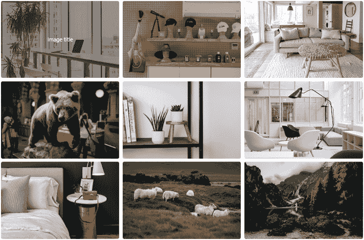
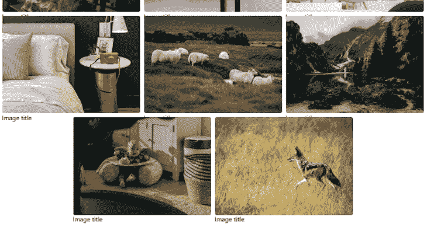
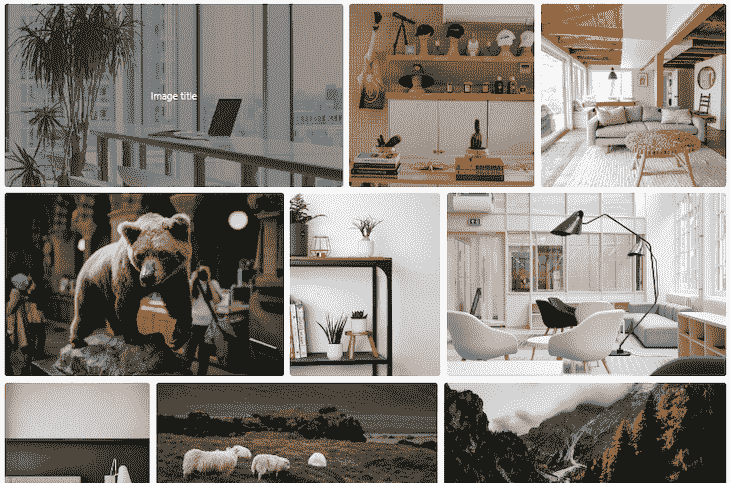
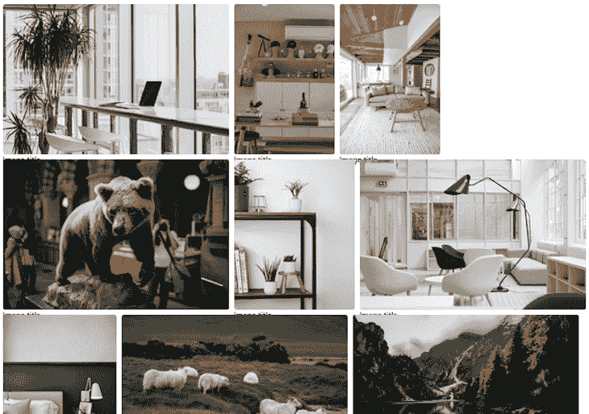
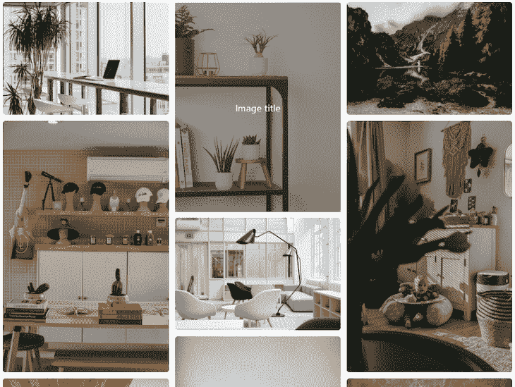
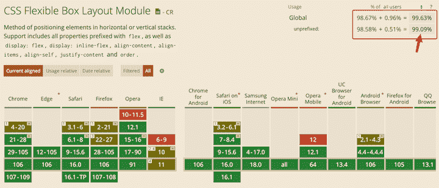

# 如何用 CSS flexbox 创建一个响应式图库

> 原文：<https://blog.logrocket.com/responsive-image-gallery-css-flexbox/>

图库提供了一种展示高质量图片集的有效方式。在 web 项目中，开发人员创建图像库，以类似网格的布局显示图像，使用户更容易浏览它们。

有几种方法可以创建这种类型的布局。在本教程中，我们将介绍如何使用 CSS 灵活框布局模块(flexbox)来创建一个响应图像库，在所有设备上看起来都很棒。

我们将使用三个示例项目来演示 flexbox 如何让我们创建各种布局。第一个和第二个项目自然是响应式的，不需要使用 CSS 媒体查询，这也是 flexbox 的好处之一。但是，第二个和第三个项目通过保持图像纵横比来提供更准确的图像预览。

在本教程结束时，我们将了解如何应用 flexbox 来建立三种类型的响应式图库布局。

要学习本教程，需要 HTML 和 CSS 的基础知识。

*向前跳转:*

## CSS flexbox 概述

flexbox 是一种设计用于一次创建一维布局(即行或列)的模型。它提供了对属性的访问，这些属性允许您在 flex 容器内对齐 flex 项目。

此外，flexbox 可以将项目包装到多行上，以实现类似网格的结构，如下面的示例项目所示。

当 flexbox 包装项目时，它会将每一行视为 flex 容器中的一个单独的 flex 行。因此，它根据这些项目的大小和该伸缩线上的可用空间来调整这些项目。在下一节中，我们将开始使用。

## 具有统一图像尺寸的响应图像图库

[第一个项目](https://by9sfe.csb.app/)使用了简单的布局，如下所示:



这种画廊布局是统一图像尺寸的理想选择。

要创建第一个 flexbox 项目，让我们创建一个 HTML 文件并添加以下标记:

```
<div class="container">
  <!-- heading text -->
  <ul class="image-gallery"<li>
      
      <div class="overlay"><span>Image title</span></div>
    </li>
    <!-- other items here -->
  </ul>
</div>

```

我们使用一个`ul`元素对位于`li`中的图像集合进行分组。我们也可以用另一个元素，比如`div`。为了简洁起见，上面的代码块只显示了`ul`容器中的一项。参见[code sandbox 上的完整标记](https://codesandbox.io/s/awesome-violet-by9sfe?file=/index.html)。

每个`li`元素都包含一个`img`元素和一个`div`元素，当我们将鼠标悬停在图像上时，它们会显示一个覆盖图。对于这个项目，我们使用[免费图像](https://unsplash.com/license)，并在源 URL 上添加相同的尺寸，以获得相同大小的图像。

目前，没有应用任何样式，所以图像将默认堆叠在彼此之上。

### 自定义响应式图像库布局

现在，我们可以引入 flexbox 来布局我们的图像。焦点在保存所有图像项目的`ul`包装元素上。

首先，我们必须通过将`display`属性设置为`flex`，使`ul`包装器成为一个 flex 容器。一旦我们这样做了，它的直接子元素(`li`元素)就变成了 flex 项目。

```
.image-gallery {
  display: flex;
}

```

现在，所有 flex 项立即在主轴上排成一行。默认情况下，主轴是行维度。这种行为是 flexbox 是一维布局模型的结果。

目前，我们的图像溢出了视窗，因为它们无法适应。我们将通过更新应用于 flex 容器的样式以及将样式应用于 flex 项目来解决这个问题。让我们更新 CSS，这样我们就有了以下内容:

```
.image-gallery {
  display: flex;
  flex-wrap: wrap;
  justify-content: center;
  gap: 10px;
}

.image-gallery > li {
  flex-basis: 350px; /* width: 350px; */
}

.image-gallery li img {
  object-fit: cover;
  max-width: 100%;
  height: auto;
  vertical-align: middle;
  border-radius: 5px;
}

```

下面让我们仔细看看 flex 容器中应用的样式:

*   `flex-wrap`属性确保 flex 项目将换行到另一行
*   值为`center`的`justify-content`属性将使项目在主轴上居中
*   `gap`属性设置行和列之间的间距(在本例中为`10px`)

在 flex 项目上，我们应用了一个`flex-basis: 350px;`。每个 flex 项目都可以从其自然大小增大或缩小。默认情况下，它们有以下声明:`flex-grow: 0`、`flex-shrink: 1`和`flex-basis: auto`。也就是说，如果没有定义大小，flex 项目将使用其自然内容大小。在我们的例子中，我们定义了一个`350px`的大小。所以，个别项目取宽度值`350px`。使用默认的“增长”和“收缩”值，项目可以从其伸缩基准收缩以适应容器，但不能从容器增长。下面的第二个项目将讨论如何使 flex 项目从它们的初始长度增长。

我们应用于图像的`object-fit: cover;`保持了它的纵横比，并确保它适合裁剪。最后，添加`max-width: 100%;`和`height: auto;`确保图像反应灵敏，并能很好地缩放。我们也可以用`width: 100%;`和`height: 100%;`来代替。最后，布局看起来是这样的:



### 对齐最后一行

如上所示，最后一行中的项目与前一行不对齐。这是 flexbox 的常见问题。

我们前面提到过，当 flex 项目换行时，每一行都是一个新的 flex 行，项目根据该 flex 行中的可用空间对齐。在这种情况下，最后一行中的项目居中，因为我们将`justify-content: center;`应用于 flex 容器。

一个快速的解决方法是使用`::after`在 flex 容器中创建一个伪元素。然后，我们可以将`flex-basis` CSS 属性的大小设置为等于 flex 项目的大小。

```
.image-gallery::after {
  content: "";
  flex-basis: 350px;
}

```

这种方法效果很好。另一种方法是使用 [CSS grid，一个二维布局系统](https://blog.logrocket.com/flexbox-vs-css-grid/)。

### 悬停时显示覆盖图

假设我们希望每当用户悬停在图像上时显示一些覆盖文本。为了实现这一点，首先更新`li`以包含以下样式声明:

```
.image-gallery > li {
  /* ... */
  position: relative;
  cursor: pointer;
}

```

然后将目标指向`li`中的`div`的覆盖类，并应用以下样式规则:

```
.overlay {
  position: absolute;
  width: 100%;
  height: 100%;
  background: rgba(57, 57, 57, 0.502);
  top: 0;
  left: 0;
  transform: scale(0);
  transition: all 0.2s 0.1s ease-in-out;
  color: #fff;
  border-radius: 5px;
  /* center overlay text */
  display: flex;
  align-items: center;
  justify-content: center;
}

/* hover */
.image-gallery li:hover .overlay {
  transform: scale(1);
}

```

现在，让我们保存并测试我们的项目，以确保它按预期工作。

### 处理 flexbox 图像溢出

实现 flex 属性的初学者遇到的一个常见问题是看到图像溢出 flex 容器。如果容器的可用大小(即，其宽度或高度)不能包含伸缩项，则必须知道图像将在水平轴或垂直轴上溢出。

早些时候，我们通过给`img`添加一个`max-width: 100%;`来解决水平溢出，以确保图像能够响应并包含在它们的`li`容器中。记住，`li`是 flex 项目，有一个默认的`flex-shrink: 1`，所以它们包含的图像可以缩小以适应任何缩小的空间。

在垂直溢出上，我们必须避免在 flex 容器上添加像`100vh`一样的固定高度，这样它就不会因为包含 flex 项目而变小:

```
.image-gallery {
  /* ... */
  /* don't add a fixed height */
  height: 100vh;
}

```

为了在实践中看到这一点，还要在`ul` flex 容器元素之后添加一个部分:

```
<div class="container">
  <!-- heading -->
  <ul class="image-gallery">
    <!-- ... -->
  </ul>

  <section>
    <h2>This another section</h2>
  </section>
</div>

```

在[这个 CodeSandbox](https://codesandbox.io/s/brave-yalow-f2hizc?file=/index.html) 中，我们应该看到由于溢出，部分标题文本位于图片库之后。第一个项目到此为止。在 CodeSandbox 上查看[演示](https://by9sfe.csb.app/)和[完整代码。](https://codesandbox.io/s/awesome-violet-by9sfe?file=/style.css)

## 维持响应图像库中的图像纵横比

在第二个和第三个示例项目中，我们将创建保持图像纵横比的布局。

第二个项目的布局将保持图像的纵横比，如下所示:



第二个项目的标记与第一个项目的标记基本相同。不同之处在于，我们不会将固定尺寸附加到图像 URL:

```
<div class="container">
  <!-- heading text -->
  <ul class="image-gallery">
    <li>
      
      <div class="overlay"><span>Image title</span></div>
    </li>
    <!-- other items here -->
  </ul>
</div>

```

接下来，我们通过将以下代码添加到 CSS 文件来引入 flexbox 和对齐规则:

```
.image-gallery {
  display: flex;
  flex-wrap: wrap;
  gap: 10px;
}

.image-gallery > li {
  height: 300px;
  cursor: pointer;
  position: relative;
}

.image-gallery li img {
  object-fit: cover;
  width: 100%;
  height: 100%;
  vertical-align: middle;
  border-radius: 5px;
}

```

现在，让我们将上述规则与第一个项目进行比较。

首先，我们定义了一个`height`，而不是在`li` flex 项上定义的`width`。另外，请注意，我们没有将项目与`justify-content`属性对齐，并且在`img`上，我们定义了`100%`的`width`和`height`值。这样，布局看起来像这样:



### 使用`flex-grow` flexbox 属性

`flex-grow`让我们通过让伸缩项从它们的初始长度开始增长并填充可用空间来按比例分配图像。它让我们指定一个项目相对于其他 flex 项目应该增长多少。

通过为弹性项目分配相等的正值，剩余空间将在它们之间平均分配。让我们像这样更新我们的代码以包含`flex-grow: 1;`:

```
.image-gallery > li {
  flex-grow: 1;
  /* ... */
}

```

如前所述，默认的 flex 项目有以下属性值:`flex-grow: 0`、`flex-shrink: 1`和`flex-basis: auto`。对应的简写如下所示:

```
flex: 0 1 auto;

```

为了在我们的代码中使用简写，我们将有如下内容:

```
.image-gallery > li {
  flex: 1 1 auto; /* or flex: auto; */
  /* ... */
}

```

声明中的值`auto`与`flex-basis`匹配。因此，让 flex 项目使用它们的自然内容大小(在本例中是图像大小)。它们现在可以增长，必要时也可以收缩。

现在 flex 项目已经填满了可用空间，我们再次遇到了 flexbox 的最后一行对齐问题。在这种情况下，最后一行中的两个项目将增长到相当于三列的空间。

为了纠正这种行为，我们将在 flex 容器上再次使用`::after`伪元素，如下所示:

```
.image-gallery::after {
  content: "";
  flex-grow: 999;
}

```

我们可以利用`flex-grow`值来决定适合我们布局的输出。现在，让我们保存我们的文件，并确保它按预期工作。这就把我们带到了第二个项目的结尾；在这里看[演示，在这里](https://sts6l7.csb.app/)看[完整代码。](https://codesandbox.io/s/delicate-wave-sts6l7?file=/style.css)

## 在三列布局中保持图像纵横比

在第二个项目中，我们学习了如何在不使用媒体查询的情况下创建一个保持图像纵横比[的响应式图像库布局。然而，使用带有媒体查询的 flexbox 允许我们在保持图像纵横比的同时实现特定的布局。](https://blog.logrocket.com/flexible-layouts-without-media-queries/)

为了演示这一点，我们将创建第三个响应图像库项目,它将保持图像的纵横比，但采用三列布局，如下所示:



这个响应图像库将在大屏幕上显示三列，在小屏幕上显示一列。为此，我们将创建一个包含三列元素的标记，如下所示:

```
<div class="container">
  <!-- heading text -->
  <div class="image-gallery">
    <div class="column"&;gt;
      <div class="image-item">
        
        <div class="overlay"><span>Image title</span></div>
      </div>
      <!-- other items here -->
    </div>
    <div class="column">
      <!-- other items here -->
    </div>
    <div class="column">
      <!-- other items here -->
    </div>
  </div>
</div>

```

每一列都应该包含我们想要显示的图像列表。为了简洁起见，上面的代码块只显示了一幅图像。参见 CodeSandbox 上的[完整标记。](https://codesandbox.io/s/fast-sun-357ccd?file=/index.html)

这些列将作为图像项目的 flex 容器。同样，列将是包装器元素中的 flex 项。

为此，我们将应用以下样式规则:

```
.image-gallery {
  /* Mobile first */
  display: flex;
  flex-direction: column;
  gap: 10px;
}

.image-gallery .column {
  display: flex;
  flex-direction: column;
  gap: 10px;
}

.image-item img {
  width: 100%;
  border-radius: 5px;
  height: 100%;
  object-fit: cover;
}

@media only screen and (min-width: 768px) {
  .image-gallery {
    flex-direction: row;
  }
}

```

从移动布局开始，我们确保所有项目都显示为一列。与早期的项目不同，我们添加了一个`flex-direction`属性，将默认的行对齐改为列对齐。

然后，对于大屏幕(`min-width: 768px`)，我们将外部 flex 容器的方向改为一行。

让我们保存我们的文件，并确保它的工作。参见 CodeSandbox 上的[完整代码。](https://codesandbox.io/s/fast-sun-357ccd?file=/style.css)

## CSS flexbox 的浏览器支持

CSS flexbox 得到了现代浏览器的广泛支持，在 IE 10 和 IE 11 这样的老浏览器中也得到了部分支持。在此处查看[浏览器支持](https://caniuse.com/flexbox)。



这种广泛的支持使 CSS flexbox 成为生产中使用的候选，我们也可以从上图中突出显示的全球使用统计中看到这一点。

然而，我们可能仍然希望为支持有限的浏览器提供后备，如 IE 10 和 IE 11。这样，我们可以在开发中部署一个[渐进增强策略](https://blog.logrocket.com/understanding-progressive-enhancement/)。

### 实现渐进式增强

渐进式改进让我们能够提供一个适用于所有浏览器的解决方案，然后增强支持新功能的浏览器的体验。这种策略可以确保老版本浏览器的用户获得更接近最新特性的良好体验。然而，这涉及到添加更多的 CSS 代码，但不会使 CSS 的数量翻倍。

CSS 旨在无缝地增强使用这种策略的体验。我们已经听说过级联原则，即规则中后面的声明会覆盖前面的声明。另一个行为是浏览器忽略任何他们不理解的 CSS 属性或值。这意味着不支持 CSS flexbox 的旧浏览器会忽略它的相关声明，并退回到我们将在下面提到的遗留技术。

### 实施回退和变通办法

我们可以为老版本的浏览器创建一个类似 flexbox 的布局，使用 CSS 后备方法，比如`display: inline-block`声明或者`float`属性。

这种方法之所以有效，是因为当浮动或内嵌块项目成为 flex 容器的子项目时，它们会自动成为 flex 项目，并且它们的初始行为会被忽略。因此，在支持 flexbox 布局的浏览器中，我们可以获得现代功能的好处，如果不能，则应用后退方法，这样用户可以获得更接近的布局体验。

如果我们对第一个项目应用回退，我们的代码应该如下所示:

```
/* .... */
.image-gallery {
  /* display: flex; */
  flex-wrap: wrap;
  justify-content: center;
  gap: 10px;
  /* the above flex properties  */

  /* fallback */
  text-align: center;
}

.image-gallery > li {
  flex-basis: 350px; /*width: 350px;*/
  position: relative;
  cursor: pointer;

  /* fallback */
  display: inline-block;
  width: 350px;
  margin: 0 5px 10px 5px;
  /* end fallback */
}
/* .... */

```

注意我们如何移除了`display: flex;`声明来模拟代码中不支持 flexbox 的浏览器。这样做的话，容器和里面的物品就失去了 flexbox 的所有优势。

然后，我们在单个项目上应用了`display: inline-block;`回退，以产生类似的布局体验。如果我们保存文件并测试我们的项目，我们将有一个更接近的布局。

事实上，我们不能为了获得更好的支持浏览器的体验而删除`display: flex;`。因此，如果我们返回回退旁边的显示 flex，由于作为回退包含的边距，项目之间的空间会变得更大。

我们可以通过检测 flexbox 是否受支持来解决这个问题，并通过在 flex 项目上设置`margin: 0;`来移除额外的空间。为了检测 CSS 特性，我们将应用特性查询。

### 使用特征查询进行测试

特性查询让我们使用`@supports`规则测试浏览器对 CSS 特性(在我们的例子中是`display: flex`)的支持。以下代码将检测浏览器是否支持 flex 属性，并在中应用 CSS 规则:

```
@supports (display: flex) {
  .image-gallery > li {
    margin: 0;
  }
} 
```

`@supports`没有改变 CSS 的特异性。所以我们必须把它放在样式规则之后来覆盖。在我们的例子中，我们必须将它置于以下规则之后:

```
.image-gallery > li {
  /* ... */
}

```

如果我们保存我们的项目，我们现在应该看到弹性项目之间的预期利润。

另一种方法是将旧浏览器不支持的所有现代 CSS 功能放在一个功能查询中，如下所示:

```
@supports (display: flex) {
  .image-gallery {
    display: flex;
    flex-wrap: wrap;
    justify-content: center;
    gap: 10px;
  }

  .image-gallery > li {
    flex-basis: 350px; /*width: 350px;*/
    margin: 0;
  }

  .image-gallery::after {
    content: "";
    flex-basis: 350px;
  }
}

```

在 CodeSandbox 上的 [CSS 代码中，我们将回退代码放在了`@support`块之外，并将 flexbox 相关代码放在了块内。打开项目并确认它按预期工作。](https://codesandbox.io/s/agitated-hermann-o5bwgb?file=/style.css)

## 结论

CSS flexbox 可以包装、对齐和对齐容器中的项目。这使得在类似网格的结构中创建响应式布局非常方便。

在本教程中，我们使用 flexbox 创建了三个响应式图片库项目，它们在所有设备上看起来都非常棒。我们还了解了如何为使用旧浏览器的用户实现回退和变通方法，以便他们也能体验类似的布局。

如果你有问题或贡献，请在评论区分享你的想法。如果你喜欢阅读本教程，努力在网络上分享它。

## 你的前端是否占用了用户的 CPU？

随着 web 前端变得越来越复杂，资源贪婪的特性对浏览器的要求越来越高。如果您对监控和跟踪生产环境中所有用户的客户端 CPU 使用、内存使用等感兴趣，

[try LogRocket](https://lp.logrocket.com/blg/css-signup)

.

[](https://lp.logrocket.com/blg/css-signup)[https://logrocket.com/signup/](https://lp.logrocket.com/blg/css-signup)

LogRocket 就像是网络和移动应用的 DVR，记录你的网络应用或网站上发生的一切。您可以汇总和报告关键的前端性能指标，重放用户会话和应用程序状态，记录网络请求，并自动显示所有错误，而不是猜测问题发生的原因。

现代化您调试 web 和移动应用的方式— [开始免费监控](https://lp.logrocket.com/blg/css-signup)。