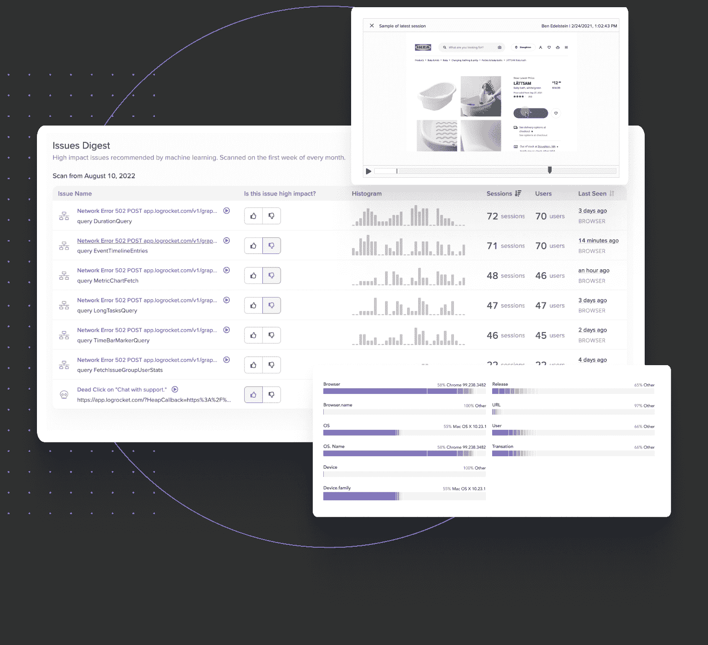

# 反思错误跟踪和产品分析

> 原文：<https://blog.logrocket.com/rethinking-error-tracking-product-analytics/>

当我们在六年前开始 LogRocket 的时候，我们开始着手构建前端调试的终极工具。当用户报告问题时，LogRocket 会显示他们所看到的视频回放，以及网络和控制台日志、JavaScript 错误和应用程序状态，以了解哪里出错了。这种方法已经帮助成千上万的客户节省了多年的重现、分类和解决问题的时间。

随着时间的推移，我们意识到仅仅被动是不够的；最佳体验来自于在用户报告问题之前主动解决问题，包括技术问题和 UX 相关问题。积极主动的方法可以让您专注于最重要的问题，而不仅仅是那些被您最大声的客户报告的问题。

今天，有了 LogRocket Galileo，我们又向前迈出了一大步，使这种主动方法比以往任何时候都更容易。

## 怎么了?

数字体验已经成为赢得和失去客户和用户的新战场。在过去的几年里，数字技术的采用大幅增加，随着消费者对数字世界越来越适应，他们对美好体验的期望也相应增加。

软件团队知道这一点。为了满足不断增长的需求，工程和产品领导者为他们的团队配备了监控、警报和分析工具，以便他们能够设计、构建和交付优秀的软件。

工程团队拥有针对错误监控、警报、分类和跟踪用户提交的票证以及性能的解决方案。产品团队有无数的仪表板来跟踪业务 KPI，如转化率、参与度、采用率、净推广分数(NPS)和客户满意度(CSAT)。

问题是，这些工具生成了如此多的数据，以至于团队经常错过做出明智决策所需的关键指标。

错误监控和警报工具大多是噪音。它们每天会产生数百甚至数千个错误，但只有少数是真正重要的。试图筛选所有这些会导致警觉疲劳，团队最终会忽略一切——甚至是重要的事情。

分析仪表板可以很好地跟踪*关键指标*的情况，但无法洞察*为什么*这些指标以某种方式表现。团队最终采取“猜测和检查”的方法，形成假设并运行测试，以查看哪些变化会产生影响。虽然这种方法最终可以发现解决方案，但它效率低下，占用了本可用于构建新产品和新功能的宝贵时间。

## LogRocket Galileo 穿过噪音

今天，我们很高兴地介绍 log rocket Galileo——我们新的机器学习层，也是我们迄今为止最雄心勃勃的解决这一问题的版本。Galileo 通过嘈杂的错误警报和拥挤的分析仪表板来发现影响您的 UX 的最重要的技术和可用性问题。

LogRocket Galileo 将有关用户如何对问题做出反应的信息与传统的问题和错误报告结合起来。我们的模型利用用户行为来预测已识别的问题和摩擦点是否重要，自动完成客户在 LogRocket 中已经完成的分析工作。

Galileo 根据多年的用户反馈和我们收集的关于对软件团队最重要的数百万个数据点来确定每个问题的重要性。问题重要性的内置用户验证确保模型不断学习，并随着时间的推移变得更加准确。

Galileo 通过 Slack 或电子邮件将最高优先级的问题直接发送给你，消除了在数据大海里捞针的需要。每个问题都附有会议回放，展示它如何影响 UX，以及了解问题所在和修复问题所需的技术数据。

例如，Galileo 会将伴随大量点击和鼠标移动的长时间网络请求识别为沮丧的迹象和需要调查的事情，但会理解在 datepicker 上的大量点击是正常的用户行为，可以忽略。

每个问题都附有 LogRocket 的会议回放和详细的技术数据，以便团队可以了解它如何影响 UX 以及您需要做什么来解决该问题。

## 机器学习分析是未来

现在，获得和留住客户需要提供优秀的产品和优秀的体验。但目前的数字体验工具太嘈杂，无法提供你需要的洞察力。

在 LogRocket，我们设想这样一个世界:软件团队理解影响他们客户的每一个问题。猜测或争论下一步要做什么的日子已经一去不复返了——log rocket 允许你在每次冲刺中优先考虑最重要的变化。

如果你有兴趣亲自体验伽利略，你可以[在这里](https://lp.logrocket.com/lp/galileo-beta)加入测试的等候名单。

如果您想成为为软件团队定义下一代解决方案的团队的一员，我们很乐意与您会面。伽利略只是这一过程中的一步，而且[我们正在雇佣](https://logrocket.com/careers/)。