# 反思前端 APM 

> 原文：<https://blog.logrocket.com/rethinking-frontend-apm/>

现代应用程序堆栈的重心正在向前端转移。对丰富和高性能的用户界面、高度可伸缩的基础设施以及不断提高的开发效率的需求，促使产品和工程团队部署新的应用程序架构。

虽然单片后端曾经拥有大多数应用程序逻辑，但今天，我们构建了有状态的单页面前端，可以与不同的微服务、无服务器功能、智能 cdn 和第三方 API 进行通信。

虽然这种转变无疑改善了最终用户体验和应用可用性，但它也为我们监控应用的方式带来了一系列新的挑战。

## 怎么了?

理解 web 应用程序的性能很难。在缓慢的 API 调用、繁重的客户端 JavaScript 和复杂的用户流之间，需要不断努力确保您的应用程序运行良好，并为您的用户提供出色的体验。

虽然性能问题有时会被用户报告或出现在 QA 中，但大多数问题实际上从未被报告过，因为有糟糕体验的用户只是离开或默默忍受。即使问题是已知的，也很难衡量它对用户体验的影响以及对转换率或 NPS 等业务指标的总体影响。

像 New Relic、Dynatrace 和 AppDynamics 这样的传统 APM 工具只能解决部分问题。最初设计用于监控单一的服务器端应用程序，后来随着前端变得更加复杂，他们添加了浏览器 SDK。

虽然这些工具对于监控后端系统(基础设施、服务、数据库)很有用，但它们的前端遥测是有限的，主要集中在页面加载、资源计时和 JavaScript 错误上。许多团队发现他们的警报太嘈杂(太多的误报没有用)，并且他们没有捕获足够的上下文来帮助他们理解技术问题对最终用户的实际影响。

## 前端是不同的

监控前端和后端应用程序是非常不同的过程。在单片后端服务于“多页面应用”的时代，性能主要是初始页面加载的函数。通过优化这些，我们可以让我们的应用程序感觉更快，并有望提高重要的业务指标，如转化率。

在现代的单页面应用中，性能受到许多因素的影响，包括网络请求、JavaScript 执行、本地资源访问、CPU 负载和内存使用。缓慢可以从后端、CDN 层、互联网连接、JavaScript 性能或客户端设备(iOS、Android、浏览器等)引入。).

## 回答正确的问题

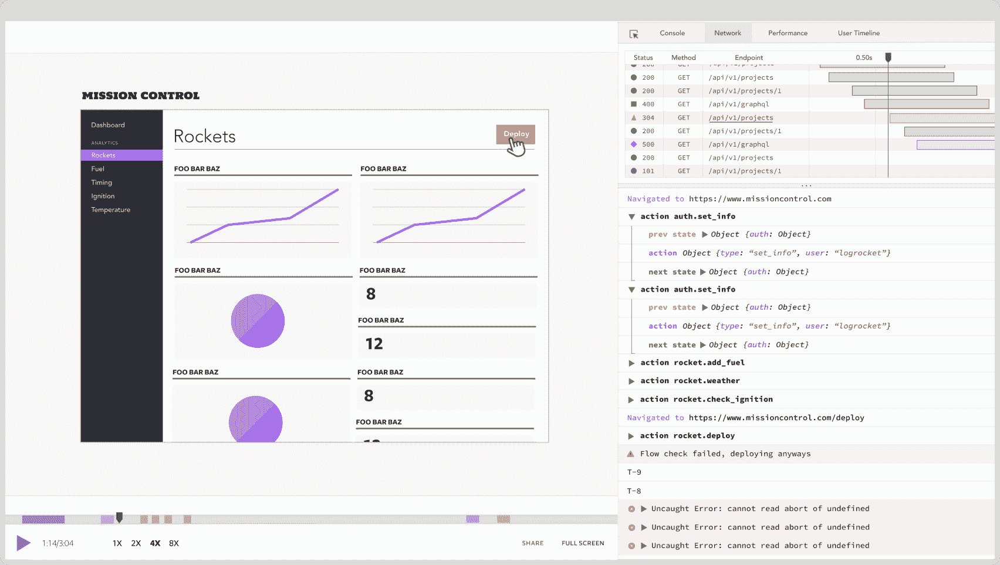

当我们三年前开始 LogRocket 的时候，我们着手构建前端调试的终极工具。当用户报告问题时，LogRocket 会向您显示他们所看到的视频回放，以及网络日志、JavaScript 错误、控制台日志和应用程序状态，以了解问题出在哪里。

但是几乎从一开始，我们就知道我们收集的数据可以产生更深刻的见解。被动地调试问题的工具对开发人员的工作流程来说总是很重要——但是理想情况下，正确的监控栈可以帮助你主动地了解性能问题及其对用户的影响。

这就是为什么今天，我们非常兴奋地宣布 LogRocket Metrics，这是我们迈向前端 APM 解决方案的第一步，可以直接帮助您了解和提高应用的性能。

## 对数火箭度量

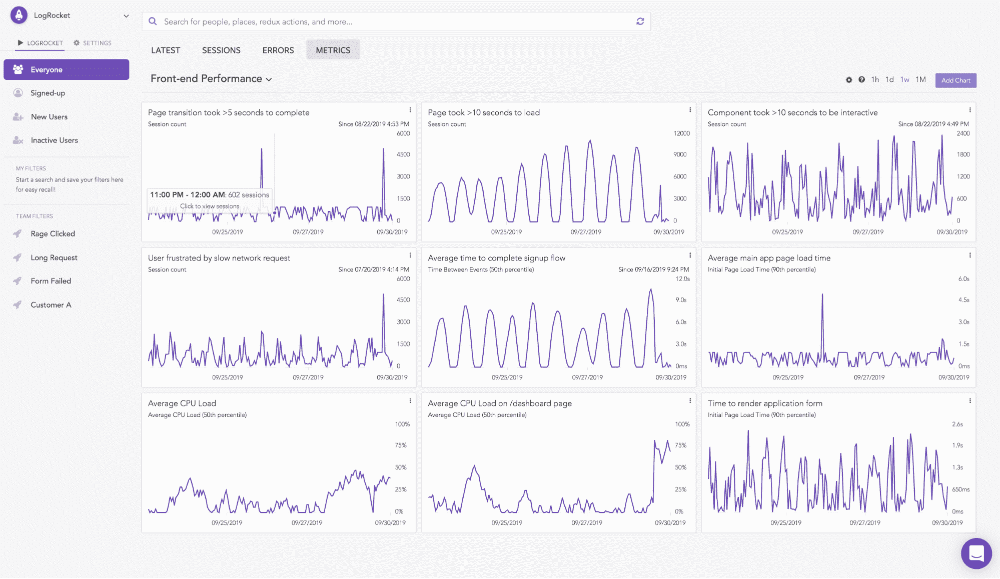

LogRocket Metrics 将会话重放和 APM 结合在一个易于使用的仪表板工具中，团队中的任何人都可以使用，无论其技术能力如何。

### 前端性能监控

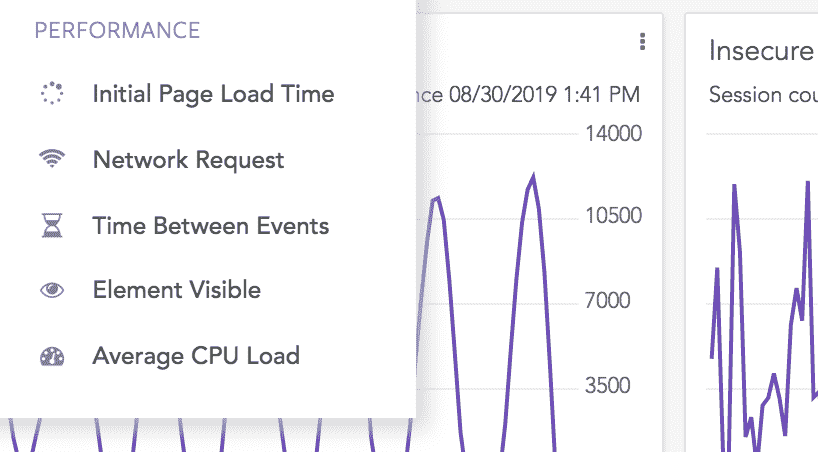

LogRocket 现在可以捕获 CPU 使用率、内存使用率、浏览器崩溃和初始页面加载时间，帮助您了解您的应用程序在前端的执行情况。您可以查看整个应用程序的总体性能，或者深入了解特定页面或流程的性能。

在定义了“在/checkout 页面上初始页面加载的第 50 个百分点”这样的指标后，LogRocket 向您的仪表板添加了一个图表，向您显示过去一小时/一天/一周/一个月的追溯数据，这样您就可以立即了解您的应用程序在一段时间内的表现，而无需等待数据收集。

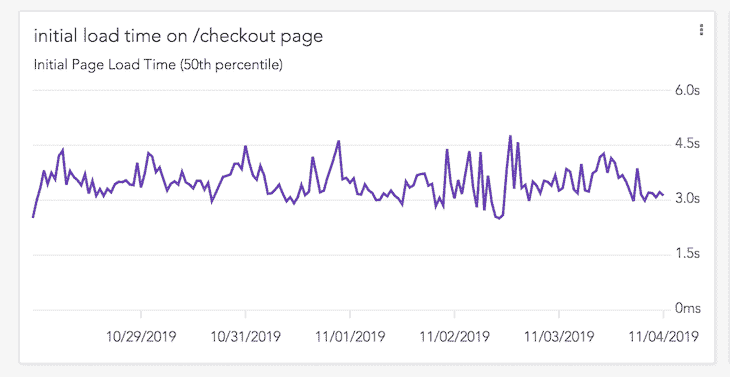

例如，我们 Metrics 的一个测试客户是一家银行，最近开始听到抱怨说他们网站上的抵押贷款成本计算器崩溃了，显示“啊，哇！”Chrome 页面。

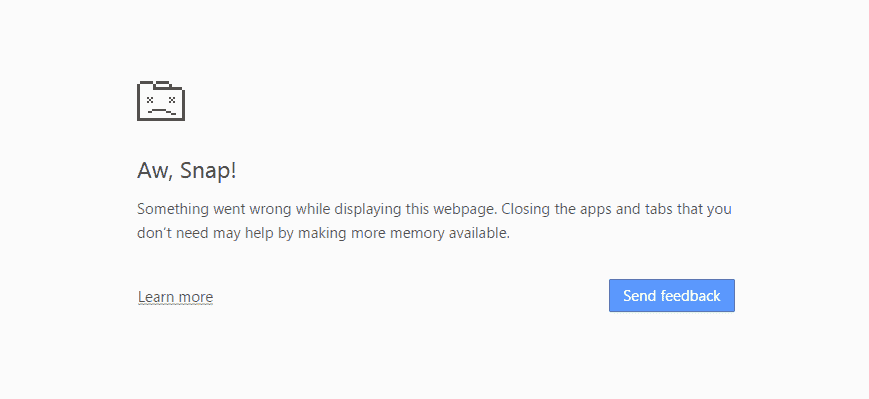

为了帮助理解这个问题，他们在 LogRocket 中添加了浏览器崩溃以及内存和 CPU 使用的指标。

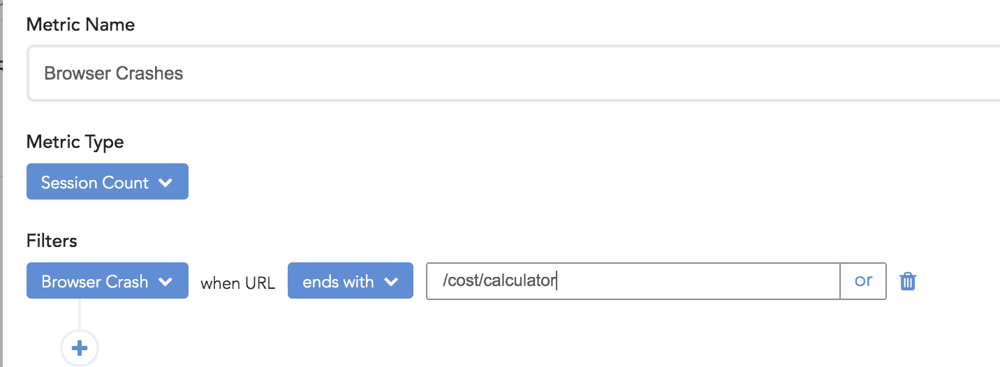

然后，他们能够看到，当他们启动新页面时，浏览器崩溃确实急剧增加。此外，他们还看到，在他们的应用程序中，该页面的内存使用量也同时显著增加。在重放一些发生崩溃的用户会话后，他们能够找到问题的根本原因并修复它。

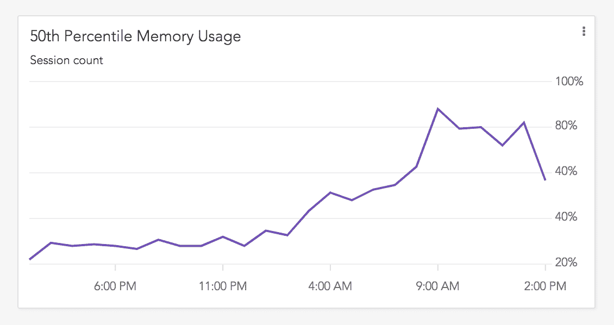

### 分析复杂流程

在现代的单页面应用程序中，单个用户流(如“点击结账，然后等待购物车模式出现”)可能是多个网络请求、资源负载和前端处理的结果。使用传统的 APM 工具，如果不编写代码来定义事务，就很难衡量这样的性能，并且在定义了事务之后，您仍然需要等待几天或几周的时间来收集足够的具有统计意义的数据。

LogRocket 使用我们的“事件间隔时间”度量标准，可以快速轻松地测量此类流的性能，该度量标准可以测量单击某个按钮、页面加载、网络请求或自定义事件之间的时间。

LogRocket 还允许您将事件定义为某个 HTML 元素的外观，比如“Element Visible[with text][contains][" Shopping Cart "]”，这允许您测量加载一个模态或反应组件的时间。

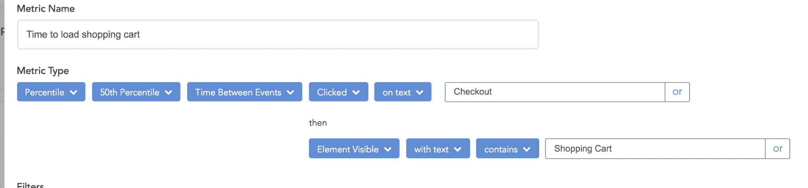

### 了解影响

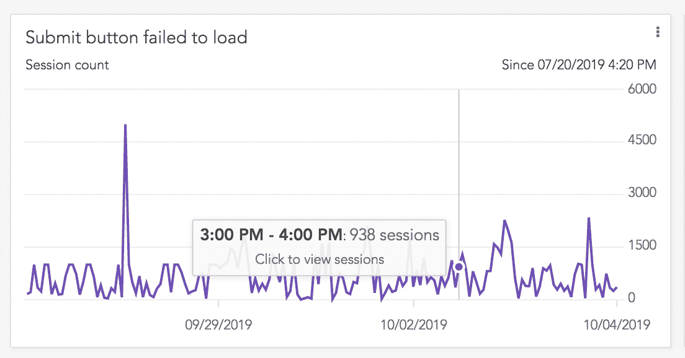

图形和图表对于获得应用程序性能的高级视图至关重要，但通常很难理解性能数字和网络错误实际上如何影响您的用户体验。对于用户来说，350 毫秒的页面加载速度有多慢？重试逻辑是否正确处理了 500 请求？

为了回答这些问题，LogRocket 允许您从任何图形直接跳到实际的用户会话中。这让您可以看到用户体验的视频，这样您就可以立即理解并同情他们的用户体验质量。

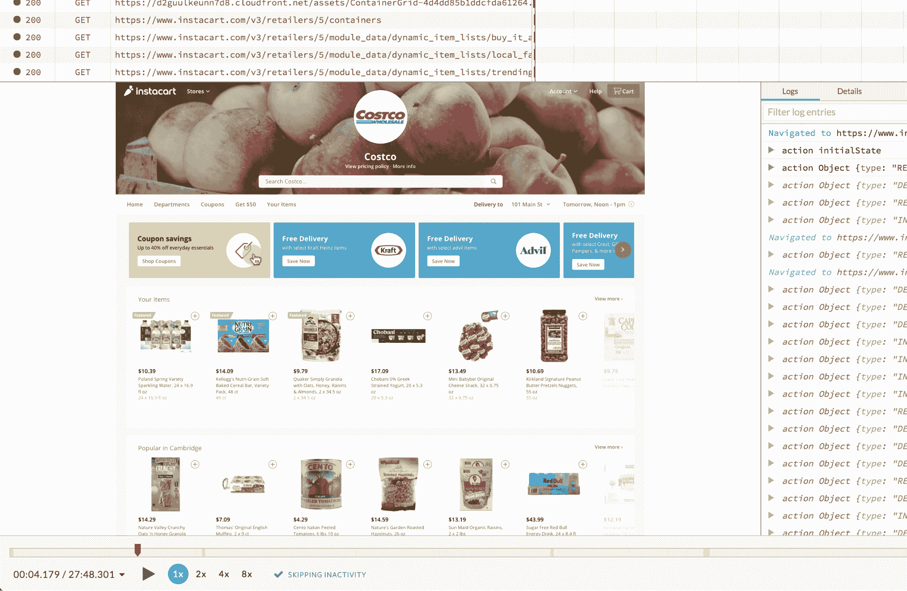

您还可以将性能指标与针对特定用户行为或特征的过滤器结合起来，这样您就可以了解特定用户群的性能差异，例如您的应用程序中的“高级用户”、某个国家的用户或执行了任何一系列操作的人。

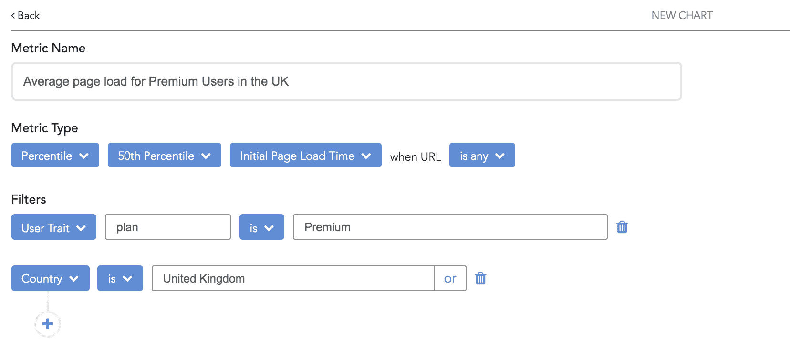

### 调试用户报告的问题

过去，当用户或 QA 测试人员抱怨糟糕的性能或浏览器崩溃时，通常很难理解是什么导致了他们糟糕的体验。

在用户的会话重放中，LogRocket 现在可以让您在会话视频旁边看到 CPU 使用情况、内存使用情况和网络请求计时，以帮助您了解应用程序变慢的原因。

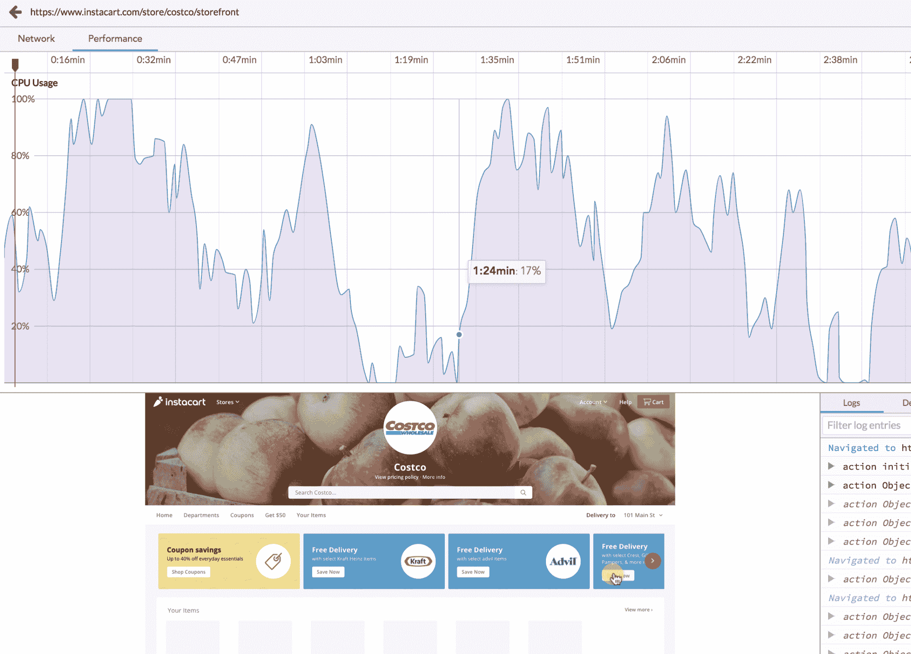

### 发信号

对于您创建的任何指标，LogRocket 都允许您设置在超过给定阈值时对 Slack、email 或 webhooks 的警报。

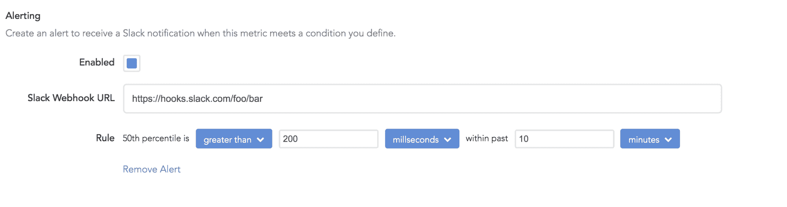

例如，如果某个关键网络请求的第 50 百分位计时超过 500 毫秒，或者在新的应用程序版本中购物车的转换率显著下降，您就会收到警告。

## 前端是未来

除了正式宣布 LogRocket Metrics 之外，今天，我们还很高兴地宣布，除了我们今年早些时候完成的 1100 万美元的 A 轮融资之外，我们还额外筹集了 1500 万美元的 B 轮融资，由我们的现有投资者 Battery Ventures 和 Matrix Partners 牵头。我们很荣幸现在有超过 1，000 名付费客户，并且非常兴奋能够继续我们的使命，帮助团队构建令人惊叹的应用程序。

向丰富的单页应用的转变无疑提高了用户体验质量和开发人员的工作效率。但是随着复杂性的增加，需要更多的可观察性。现有的工具还不足以让团队对他们发布的前端代码有信心。

在 LogRocket，我们已经朝着我们认为的解决方案迈出了一大步，但还有很多工作要做。如果你想帮助前端开发人员定义下一代工具，我们很乐意见到你。[我们正在招聘](https://logrocket.com/company)🙂