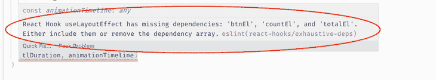
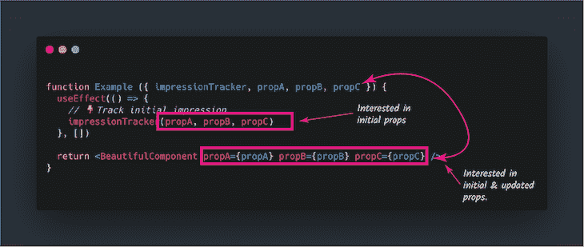

# 你过度使用了使用备忘录:重新思考钩子的记忆化

> 原文：<https://blog.logrocket.com/rethinking-hooks-memoization/>

根据我的经验，我发现`useMemo`主要有两类是不相关的、被过度使用的，并且可能对你的应用程序的性能有害。

第一类很容易推理；但是，第二类相当微妙，容易被忽略。如果你在任何严肃的生产应用中使用过钩子，那么你很可能会在这两个类别中的一个中使用`useMemo` [钩子](https://blog.logrocket.com/popular-react-hook-libraries/)。

我将向您展示为什么这些不重要并且可能损害您的应用程序的性能，更有趣的是，我将向您展示我对如何在这些用例中*而不是*过度使用`useMemo`的建议。

我们可以开始了吗？

## 不使用`useMemo`的地方

出于学习的目的，这些分类将被称为狮子和变色龙。


忽略那些分散注意力的分类名称，坚持住！

当面对狮子时，你的第一反应是逃跑，保护你的心脏不被撕裂，并活下来以后再讲述这个故事。没时间闲聊了。

这是 a 类，他们是狮子，你的反应应该是逃离这些。

让我们先从这些开始，然后再看更微妙的变色龙。

### 1.相同的参考和廉价的操作

考虑下面的示例组件:

```
/** 
  @param {number} page 
  @param {string} type 
**/
const myComponent({page, type}) { 
  const resolvedValue = useMemo(() => {
     getResolvedValue(page, type)
  }, [page, type])

  return <ExpensiveComponent resolvedValue={resolvedValue}/> 
}
```

在这个例子中，很容易证明作者使用了`useMemo`。他们的想法是，当对`resolvedValue`的引用改变时，他们不希望`ExpensiveComponent`被重新呈现。

虽然这是一个合理的担忧，但在任何给定的时间，有两个问题可以用来证明使用`useMemo`的合理性。

第一，传入`useMemo`的函数是不是很贵？在这种情况下，`getResolvedValue`计算是不是很昂贵？

JavaScript 数据类型上的大多数方法都经过了优化，比如`Array.map`、`Object.getOwnPropertyNames()`等。如果你正在执行一个不昂贵的操作(想想大 O 符号)，那么你不需要记忆返回值。使用`useMemo`T3 的成本可能会超过重新评估函数的成本。

第二，给定相同的输入值，对记忆值的引用会改变吗？例如，在上面的代码块中，给定`page`为`2`，给定`type`为`"GET"`，那么对`resolvedValue`的引用会发生变化吗？

简单的答案是考虑`resolvedValue`变量的数据类型。如果`resolvedValue`是一个`primitive`(即`string`、`number`、`boolean`、`null`、`undefined`或`symbol`)，那么参考永远不会改变。言下之意，`ExpensiveComponent`不会被重新渲染。

考虑下面的修订代码:

```
/** 
  @param {number} page 
  @param {string} type 
**/
const MyComponent({page, type}) {
  const resolvedValue = getResolvedValue(page, type)
  return <ExpensiveComponent resolvedValue={resolvedValue}/> 
}
```

按照上面的解释，如果`resolvedValue`返回一个字符串或其他原始值，并且`getResolvedValue`不是一个昂贵的操作，那么这是完全正确和高性能的代码。

只要`page`和`type`相同——即没有属性变化——`resolvedValue`将持有相同的引用，除非返回值不是原语(例如，对象或数组)。

记住这两个问题:被记忆的函数是一个昂贵的函数吗？返回值是一个原语吗？有了这些问题，你随时可以评估自己对`useMemo`的使用。

### 2.出于多种原因记忆默认状态

考虑下面的代码块:

```
/** 
  @param {number} page 
  @param {string} type 
**/
const myComponent({page, type}) { 
  const defaultState = useMemo(() => ({
    fetched: someOperationValue(),
    type: type
  }), [type])

  const [state, setState] = useState(defaultState);
  return <ExpensiveComponent /> 
}
```

上面的代码对一些人来说似乎无害，但是那里的`useMemo`调用绝对不重要。

第一，出于同理心，理解这段代码背后的思维。作者的意图值得称赞。当`type`道具改变时，他们想要一个新的`defaultState`对象，并且他们不希望对`defaultState`对象的引用在每次重新渲染时无效。

* * *

### 更多来自 LogRocket 的精彩文章:

* * *

虽然这些都是合理的考虑，但是这种方法是错误的，并且违反了一个基本原则:`useState`不会在每次重新渲染时被重新初始化，只有当组件被重新装载时。

传递给`useState`的参数最好叫做`INITIAL_STATE`。它只在组件最初安装时计算(或触发)一次。

```
useState(INITIAL_STATE)
```

尽管作者担心当`useMemo`的`type`数组依赖关系改变时会得到一个新的`defaultState`值，但这是一个错误的判断，因为`useState`忽略了新计算的`defaultState`对象。

如下所示，这与延迟初始化`useState`相同:

```
/**
   @param {number} page 
   @param {string} type 
**/
const myComponent({page, type}) {
  // default state initializer 
  const defaultState = () => {
    console.log("default state computed")
    return {
       fetched: someOperationValue(),
       type: type
    }
  }

  const [state, setState] = useState(defaultState);
  return <ExpensiveComponent /> 
}
```

在上面的例子中，`defaultState` init 函数只被调用一次——在挂载时。并非每次重新渲染时都会调用该函数。因此，除非组件被重新装载，否则日志“默认状态已计算”将只出现一次。

下面是之前重写的代码:

```
/**
   @param {number} page 
   @param {string} type 
**/
const myComponent({page, type}) {
  const defaultState = () => ({
     fetched: someOperationValue(),
     type,
   })

  const [state, setState] = useState(defaultState);

  // if you really need to update state based on prop change, 
  // do so here
  // pseudo code - if(previousProp !== prop){setState(newStateValue)}

  return <ExpensiveComponent /> 
}
```

我们现在将考虑我认为你应该避免的更微妙的场景。

### 3.使用`useMemo`作为 ESLint 吊钩警告的出口



虽然我无法让自己去阅读那些想方设法压制来自官方 [ESLint 插件](https://www.npmjs.com/package/eslint-plugin-react-hooks) [钩子](https://www.npmjs.com/package/eslint-plugin-react-hooks)的 lint 警告的人的所有评论，但我确实理解他们的困境。

在这一点上我同意丹·阿布拉莫夫。抑制插件中的`eslint-warnings`可能会在将来的某一天反噬你。

一般来说，我认为在生产应用中抑制这些警告是一个坏主意，因为你增加了在不久的将来引入微妙错误的可能性。

也就是说，仍然有一些有效的情况需要取消这些 lint 警告。下面是我自己遇到的一个例子。为了更容易理解，代码进行了简化:

```
function Example ({ impressionTracker, propA, propB, propC }) {
  useEffect(() => {
    // 👇Track initial impression
    impressionTracker(propA, propB, propC)
  }, [])

  return <BeautifulComponent propA={propA} propB={propB} propC={propC} />                 
}
```

这是一个相当棘手的问题。

在这个具体的用例中，你不关心道具有没有变化。你只对调用带有初始*T2 道具的`track`函数感兴趣。这就是印象追踪的工作原理。只有在组件挂载时才调用 impression track 函数。这里的区别是你需要用一些初始的道具来调用这个函数。*

虽然您可能认为简单地将`props`重命名为类似`initialProps`的名称就可以解决问题，但这是行不通的。这是因为`BeautifulComponent`也依赖于接收更新的属性值。



在本例中，您将收到 lint 警告消息:`React Hook useEffect has missing dependencies: 'impressionTracker', 'propA', 'propB', and 'propC'. Either include them or remove the dependency array.`

这是一个相当鲁莽的信息，但短绒只是做好自己的工作。简单的解决方案是使用一个`eslint-disable`注释，但是这并不总是最好的解决方案，因为将来您可能会在同一个`useEffect`调用中引入 bug。

```
useEffect(() => {
  impressionTracker(propA, propB, propC)
  // eslint-disable-next-line react-hooks/exhaustive-deps
}, [])
```

我建议的解决方案是使用`useRef`钩子来保存对不需要更新的初始属性值的引用。

```
function Example({impressionTracker, propA, propB, propC}) {
  // keep reference to the initial values         
  const initialTrackingValues = useRef({
      tracker: impressionTracker, 
      params: {
        propA, 
        propB, 
        propC, 
    }
  })

  // track impression 
  useEffect(() => {
    const { tracker, params } = initialTrackingValues.current;
    tracker(params)
  }, []) // you get NO eslint warnings for tracker or params

  return <BeautifulComponent propA={propA} propB={propB} propC={propC} />   
}
```

在我所有的测试中，linter 只考虑这种情况下的`useRef`。有了`useRef`，linter 知道引用的值不会改变，所以你不会得到任何警告！甚至`useMemo`也没有阻止这些警告。

例如:

```
function Example({impressionTracker, propA, propB, propC}) {

  // useMemo to memoize the value i.e so it doesn't change
  const initialTrackingValues = useMemo({
    tracker: impressionTracker, 
    params: {
       propA, 
       propB, 
       propC, 
    }
  }, []) // 👈 you get a lint warning here

  // track impression 
  useEffect(() => {
    const { tracker, params} = initialTrackingValues
    tracker(params)
  }, [tracker, params]) // 👈 you must put these dependencies here

  return <BeautifulComponent propA={propA} propB={propB} propC={propC} />
}
```

在上面的错误解决方案中，即使我通过用`useMemo`记忆初始属性值来跟踪初始值，linter 仍然对我大喊大叫。在`useEffect`调用中，记忆值`tracker`和`params`也必须作为数组依赖项输入。

我见过这样的人。这是糟糕的代码，应该避免。使用`useRef`挂钩，如初始解决方案所示。

总之，在大多数我真的想让 lint 警告静音的情况下，我发现`useRef`是一个完美的盟友。拥抱它。

### 4.仅将`useMemo`用于参考等式

大多数人说使用`useMemo`进行昂贵的计算和保持参考等式。我同意第一个，但 T2 不同意第二个。不要仅仅为了引用等式而使用`useMemo`钩子。这样做只有一个原因——我稍后会讨论。

为什么仅仅用`useMemo`来表示参照等式是一件坏事？其他人不都是这么宣扬的吗？

考虑下面这个虚构的例子:

```
function Bla() {
  const baz = useMemo(() => [1, 2, 3], [])
  return <Foo baz={baz} />
}
```

在组件`Bla`中，值`baz`被记忆，不是因为数组`[1,2,3]`的求值代价很高，而是因为对`baz`变量的引用在每次重新渲染时都会改变。

虽然这似乎不是问题，但我不认为`useMemo`是这里使用的正确钩子。

一，看数组依赖。

```
useMemo(() => [1, 2, 3], [])
```

这里，一个空数组被传递给了`useMemo`钩子。这意味着，值`[1,2,3]`只计算一次——当组件安装时。

因此，我们知道两件事:被记忆的值不是一个昂贵的计算，它在挂载后不会被重新计算。

如果你发现自己处于这种情况，我要求你重新考虑使用`useMemo`钩子。您正在记忆一个值，它不是一个昂贵的计算，也不会在任何时间点重新计算。这绝对不符合“记忆化”这个术语的定义

这是对`useMemo`钩子的糟糕使用。这在语义上是错误的，并且在内存分配和性能方面可能会花费更多。

那么，你应该怎么做呢？

首先，作者到底想达到什么目的？他们不是在试图记忆一个价值；相反，他们希望在重新渲染时保持**引用**的值不变。

别给那只黏糊糊的变色龙机会。在这种情况下，使用`useRef`钩。

例如，如果你真的讨厌使用当前属性(像我的许多同事一样)，那么简单地解构并重命名，如下所示:

```
function Bla() {
  const { current: baz } = useRef([1, 2, 3])
  return <Foo baz={baz} />
}
```

问题解决了。

事实上，您可以使用`useRef`来保持对昂贵的函数求值的引用——只要函数不需要在 props 改变时重新计算。

对于这种情况，`useRef`是正确的挂钩，而不是`useMemo`挂钩。

能够使用`useRef`钩子模仿[实例变量](https://reactjs.org/docs/hooks-faq.html#is-there-something-like-instance-variables)是钩子带给我们的最少使用的超能力之一。`useRef`钩子可以做的不仅仅是保存对 DOM 节点的引用。拥抱它。

请记住，这里的条件是，如果你记忆一个值，只是因为你需要保持对它的一致引用。如果您需要根据变化的属性或值重新计算值，那么请随意使用`useMemo`钩子。在某些情况下，您仍然可以使用`useRef`——但是考虑到数组依赖列表，`useMemo`最方便。

## 结论

逃离狮子，但不要让变色龙愚弄你。如果你允许它们，变色龙会改变它们的皮肤颜色，融入你的代码库，污染你的代码质量。

别让他们得逞。

好奇我对高级钩子的立场是什么？我正在做一个高级钩子的视频课程。注册吧，我会[让你知道](https://forms.gle/Qd6yZC1Lhcosnc2f8)什么时候发布！

## 使用 LogRocket 消除传统反应错误报告的噪音

[LogRocket](https://lp.logrocket.com/blg/react-signup-issue-free)

是一款 React analytics 解决方案，可保护您免受数百个误报错误警报的影响，只针对少数真正重要的项目。LogRocket 告诉您 React 应用程序中实际影响用户的最具影响力的 bug 和 UX 问题。

[ ](https://lp.logrocket.com/blg/react-signup-general) [  ](https://lp.logrocket.com/blg/react-signup-general) [LogRocket](https://lp.logrocket.com/blg/react-signup-issue-free)

自动聚合客户端错误、反应错误边界、还原状态、缓慢的组件加载时间、JS 异常、前端性能指标和用户交互。然后，LogRocket 使用机器学习来通知您影响大多数用户的最具影响力的问题，并提供您修复它所需的上下文。

关注重要的 React bug—[今天就试试 LogRocket】。](https://lp.logrocket.com/blg/react-signup-issue-free)