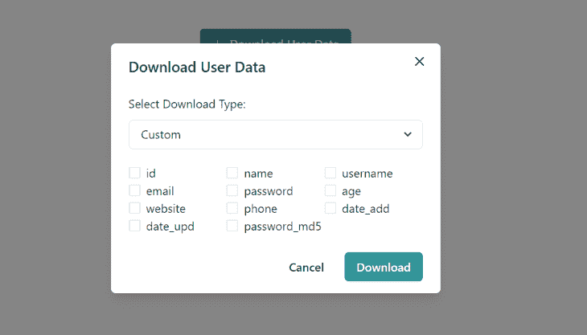

# 构建一个可重用的 React 组件，将数组导出到 Excel 

> 原文：<https://blog.logrocket.com/reusable-react-component-export-arrays-excel/>

不久前，我的任务是向 React 应用程序的一些页面添加一个导出数组到 excel 的按钮。该按钮的标准是:

*   它必须是可重用的，所以它可以被导入到任何页面，并在需要时使用
*   单击时，它应该会打开一个模式，让用户在下载所有列(数组中每个单独对象的所有属性)或选定列(数组中单独对象的选定属性)之间进行选择
*   该模式应该包含一个下载按钮，该按钮将根据所选的列将 JSON API 响应数组直接下载到电子表格文件中



A screenshot of the export-array-to-excel component.

我发现这是给开发人员的一个常见的特性请求(可能有一点变化)，尤其是那些从事类似管理仪表板项目的开发人员，这就是我写这篇文章的原因。

本文假设您对 JavaScript 和 React 有一定的了解。在本文中，我将首先向您展示将一组对象导出到 Excel 表中所涉及的基本概念。然后，在此基础上，创建可重用的 export-array-to-excel 组件，如上所示，使用 Chakra UI 作为组件库的选择。

首先需要想清楚的是，如何在浏览器上提示下载。

在普通 HTML 中，使用锚标记及其下载属性在浏览器中创建一个提示下载的按钮非常简单。只需将要下载的文件的 URL 或文件路径传递给`href`属性:

```
<a href="/files/excel-sheet-to-download.xls" download=”customer-list”>
       <button> Download to excel </button>
</a>

```

`download`属性是 HTML5 规范的一部分，它指定当单击链接时应该下载目标。传递给`download`属性的值指定了下载文件的文件名。

不幸的是，上面的解决方案并不完全适合我们的用例，因为没有预先存在的 Excel 文件可以链接。

当点击下载按钮时，我们必须自发地执行四个任务:

1.  获取 API 响应数组并将其转换为表格
2.  将表格嵌入到电子表格 XML 模板中
3.  使用`Blob`和`URL.createObjectURL()`方法以编程方式为电子表格模板创建一个文件 URL
4.  最后，将创建的 URL 分配给具有下载属性的锚标记的`href`,然后以编程方式单击锚标记来提示下载

让我们仔细检查每个步骤，并为其编写必要的代码。但首先，我们需要设置一个 React 应用程序和 Chakra UI。

## 设置 React 应用程序

要设置演示 React 应用程序，请使用[创建 React 应用程序](https://github.com/facebook/create-react-app)。确保您已经安装了[节点> = 8.10 和 npm > = 5.6](https://nodejs.org/en/) :

```
npx create-react-app export-array-demo
cd export-array-demo
npm start

```

接下来，安装 Chakra UI:

```
npm i @chakra-ui/react @emotion/react @emotion/styled framer-motion
npm i @chakra-ui/icons

```

[Chakra UI](https://chakra-ui.com/docs/getting-started) 是 React 的一个开源组件库，它提供了一组简单的、模块化的、可访问的组件，使构建应用程序的 UI 变得更加容易。它将用于快速组装所需的 UI 元素。

为了让 Chakra UI 正常工作，您需要在`index.js`中设置`ChakraProvider`(它是库的上下文提供者[，使用 React 上下文 API](https://www.codewithlinda.com/blog/dark-mode-with-react-context/) ):

```
import React from 'react';
…………
import {ChakraProvider} from "@chakra-ui/react"

ReactDOM.render(
  <React.StrictMode>
    <ChakraProvider>
      <App />
    </ChakraProvider>
  </React.StrictMode>,
  document.getElementById('root')
);

```

这就是所有需要的初始设置。接下来，是编写函数来处理要导出到 Excel 的数组。

## 写`ArrayToExcel`

为了将核心的 array-to-excel 逻辑分开，在`src`中创建一个`Components/ArrayToExcel`文件夹。在这个文件夹中，创建两个文件`ArrayToExcel.js`，其中包含负责转换和下载的函数，以及`ArrayToExcelButton.js`，其中包含按钮、模态和其他必要的 UI 元素。

在`ArrayToExcel.js`中，将代码[复制到这里](https://github.com/Linda-Ikechukwu/Blog-Posts-Demo-Apps/blob/master/export-array-demo/src/Components/ArrayToExcel/ArrayToExcel.js)，我现在将一点一点地介绍它:

```
export const arrayToExcel = (function () {
....
})();

```

首先，所有函数都被包装在一个[life](https://medium.com/@vvkchandra/essential-javascript-mastering-immediately-invoked-function-expressions-67791338ddc6)中，以确保变量作用域总是受到保护。

然后是从`arrayToExcel`函数返回的`convertArrayToTable`方法:

```
convertArrayToTable : async (apiArray, fileName) => {
   //use keys from the first array object to form table column headers
   const tableHeaders = `<tr>${Object.keys(apiArray[0]).map(key =>   `<td>${key}</td>`).join('')}</tr>`;
   //now loop through all array objects to form table rows
   const tableRows = apiArray.map(obj =>
      [`<tr>
         ${Object.keys(obj).map(key => `<td>${obj[key] === null ||    obj[key] === '' ? '' : obj[key]}</td>`).join('')}
      <tr/>`]).join('');
   const table = `<table>${tableHeaders}${tableRows}</table>`.trim();

   const xmlTable = createXMLTable(table, fileName);
   const downloadURL = createFileUrl(xmlTable);
   downloadFile(downloadURL, fileName);
}

```

`convertArrayToTable`函数接收一个 JSON API 响应数组(这是一个对象数组)作为参数，并遍历第一个对象的键以形成第一行，这将表示表头或列。它还遍历每个对象，并使用其值来创建行。每个`map`函数返回一个数组，然后由`join`方法转换成一个字符串。然后使用模板文字，将`tableHeader`和`tableRows`连接起来，形成一个完整的表，并将其传递给`createXMLTable`:

```
const createXMLTable = (table, fileName) => {
  const xmlTable = `
        <html xmlns:o="urn:schemas-microsoft-com:office:office xmlns:x="urn:schemas-microsoft-com:office:excel"

        >
           <meta http-equiv="content-type" content="application/vnd.ms-excel; charset=UTF-8"/>
           <head>
              <xml>
                <x:ExcelWorkbook>
                    <x:ExcelWorksheets>
                        <x:ExcelWorksheet>
                            <x:Name>${fileName}</x:Name>
                            <x:WorksheetOptions><x:DisplayGridlines/></x:WorksheetOptions>
                        </x:ExcelWorksheet>
                    </x:ExcelWorksheets>
                </x:ExcelWorkbook>
              </xml>
           </head>
           <body>
             ${table}
           </body>
        </html> `
        return xmlTable;
    }

```

`createXMLTable`函数使用微软的[spreadsheedataxml](https://docs.microsoft.com/en-us/office/open-xml/structure-of-a-spreadsheetml-document)规范来描述电子表格文件的结构。在 XML 模板中，您指示该文件应该是一个带有工作表的工作簿，并且显示表格的特定工作表应该有一个标题(无论参数是什么),并且应该显示网格线。

XML 是一种标记语言，主要用于在不同程序之间传输数据。在我们的例子中，在 web 和. xls(电子表格文件的文件扩展名)文件之间。

> 你可以在这里编写内联 CSS 来设计导出的电子表格的外观。

接下来是`createXMLTable`函数，它返回一个传递给`createFileUrl`的 Excel 文件模板:

```
const createFileUrl = (xmlTable) => {
        const tableBlob = new Blob([xmlTable], {type: 'application/vnd.ms-excel;base64,' });
        const downloadURL = URL.createObjectURL(tableBlob);
        return downloadURL;
    }

```

要以编程方式为 Excel 模板创建一个文件 URL，您需要使用 [blob](https://developer.mozilla.org/en-US/docs/Web/API/Blob) 方法将其转换成一个文件或类似文件的对象。`blob`方法接受一个数组和一个 [MIME 类型](https://developer.mozilla.org/en-US/docs/Web/HTTP/Basics_of_HTTP/MIME_types)作为参数。`blob`方法返回一个 blob 对象，该对象被传递给`createObjectURL`方法以创建一个惟一的文件 URL，然后该 URL 可以被传递给一个`a`标记。

`downloadFile`函数接收来自`createFileUrl,`的结果 URL，并最终开始下载:

```
const downloadFile = (downloadURL, fileName) => {
        const downloadLink = document.createElement('a');
        document.body.appendChild(downloadLink);
        downloadLink.download = fileName;
        downloadLink.href = downloadURL;
        downloadLink.click();
    }

```

`downloadFile`函数将文件 URL 传递给以编程方式创建的锚标记的`href`,然后调用链接上的 click 方法来触发下载过程。分配给下载的`fileName`参数将是文件的名称。

这就是你需要做的，把一组对象下载到一个 Excel 文件中。

接下来，让我们用 Chakra UI 中的 UI 元素设置 array-to-excel 组件，并导入`arrayToExcel`。

## 用 Chakra UI 组装 UI 元素

要构建开头所示的 export-array-to-excel 组件，您需要一个按钮、模态、选择输入和复选框 UI 元素。

在`ArrayToExcelButton.js`中，从 Chakra UI 导入这些元素:

```
import React, { useState } from "react";
import {
    Button,
    Modal,
    ModalOverlay,
    ModalContent,
    ModalHeader,
    ModalFooter,
    ModalBody,
    ModalCloseButton,
    Select,
    Checkbox,
} from "@chakra-ui/react"
import { DownloadIcon } from '@chakra-ui/icons'

```

Chakra 导出这些[七个基于模态的组件](https://chakra-ui.com/docs/overlay/modal#import)来帮助你创建任何类型的模态对话框。

请记住，根据开头所述的工作流，当单击 main 按钮时，它应该会打开一个模式，让用户在下载所有列或一些选定的列之间进行选择(即从数组的每个对象中选择属性):

```
const ArrayToExcelButton = ({ apiArray, fileName, buttonTitle }) => {

    const [showDownloadModal, setShowDownloadModal] = useState(false);
    const [columnsType, setColumnsType] = useState("1");
    const [selectedColumns, setSelectedColumns] = useState([]);

    return (
        <>
            <Button leftIcon={<DownloadIcon />} colorScheme="teal" onClick={() => setShowDownloadModal(true)}>
                {buttonTitle}
            </Button>
            {showDownloadModal &&
                <Modal isOpen={showDownloadModal} onClose={() =>    setShowDownloadModal(false)}>
                    <ModalOverlay />
                    <ModalContent>
                        <ModalHeader>{buttonTitle}</ModalHeader>
                        <ModalCloseButton />
                        <ModalBody>
                            <p style={{marginBottom:"10px" }}>
                              Select Download Type: 
                            </p>
                            <Select onChange={(e) => setColumnsType(e.target.value)}>
                                <option value="1">All Columns</option>
                                <option value="2">Custom</option>
                            </Select>
                            {columnsType === "1" &&
                                <p style={{marginTop:"20px" }}>
                                    {Object.keys(apiArray[0]).map((key, index) => {
                                        return (
                                            <span key={index}>{(key)}, </span>
                                        )
                                    })}
                                </p>
                            }
                            {columnsType === "2" &&
                                <div style={{ display: "flex", flexWrap: "wrap", width: "100%", marginTop:"20px" }}>
                                    {Object.keys(apiArray[0]).map((key, index) => {
                                        return (
                                            <div key={index} style={{ display: "flex", alignItems: "center", width:"33.3%"}}>
                                                <Checkbox
                                                    id={key}
                                                    onChange={(e) =>       updateSelectedColumns(e, key)}
                                                >
                                                   {key}
                                                </Checkbox>

                                            </div>
                                        )
                                    })}
                                </div>
                            }

                        </ModalBody>

                        <ModalFooter>
                            <Button variant="ghost" mr={3} onClick={() => setShowDownloadModal(false)}>
                                Cancel
                            </Button>
                            <Button colorScheme="teal" onClick={() => apiArrayToExcel()}>
                                Download
                            </Button>
                        </ModalFooter>
                    </ModalContent>
                </Modal>
            }
        </>
    )
}

export default ArrayToExcelButton;

```

接收`buttonTitle`道具的主按钮使用`showDownloadModal`状态切换下载模式的打开和关闭。

在`ModalBody`中，有一个`Select`元素，使用`setColumnsType`切换要执行的下载类型，“所有列”或“自定义”。如果选择“所有列”,循环通过`apiArray`的第一个对象，列出一个段落中的所有对象属性。如果选择了“列”,同样循环通过`apiArray`的第一个对象，并在复选框旁边列出每个对象的属性。

为了跟踪选中的复选框，我们将使用`updateSelectedColumns`函数:

```
const ArrayToExcelButton = ({ apiArray, fileName, buttonTitle }) => {

   ...

    const updateSelectedColumns = (e, column) => {
        if (e.target.checked) {
            setSelectedColumns([...selectedColumns, column]);
        } else {
            setSelectedColumns(selectedColumns.filter(value => value !== column));
        }
    }

   ...

```

当一个复选框被点击时，`updateSelectedColumns`或者从`selectedColumns`状态数组中添加或者删除目标对象属性。

最后，点击 modal 的 download 按钮，用`apiArrayToExcel`函数触发数组到 excel 的下载:

```
import React, { useState } from "react";
...
import {arrayToExcel} from "./ArrayToExcel";
import cloneDeep from "lodash.clonedeep";

const ArrayToExcelButton = ({ apiArray, fileName, buttonTitle }) => {

   ....
    const apiArrayToExcel = () => {
        if (columnsType === "1") {
           arrayToExcel.convertArrayToTable(apiArray, fileName)
        } else {
            const customArray = cloneDeep(apiArray);
            customArray.map(obj => Object.keys(obj).forEach((key) => {
                if (!selectedColumns.includes(key)) {
                    delete obj[key];
                }
            }))
            arrayToExcel.convertArrayToTable(customArray, fileName)
            setSelectedColumns([]);
        }
    }

....

```

如果选择的下载类型的值是“所有列”，`apiArrayToExcel`函数简单地从`arrayToExcel`调用`convertArrayToTable`方法，传入`apiArray`和文件名属性作为参数。否则，如果值是`Custom`，它使用 lodash 中的`cloneDeep` 复制`apiArray`数组，并遍历`customArray`中的单个对象，删除`selectedColumns`数组中不存在的对象键(以及它们相应的值)。

* * *

### 更多来自 LogRocket 的精彩文章:

* * *

因为 JavaScript 数组是引用类型，简单地将`apiArray`赋给一个新变量只会创建一个浅层副本，对`customArray`的任何更改都会影响到`apiArray`。为了避免这种情况，[使用`cloneDeep`对数组](https://dev.to/samanthaming/how-to-deep-clone-an-array-in-javascript-3cig)进行深度克隆。lodash `cloneDeep`方法创建一个数组的深度克隆:

```
 npm i --save lodash.clonedeep

```

这样，导出数组到 excel 组件就准备好了！

注意，我添加了一些内联样式以保持简单和统一。理想情况下，你应该保持不同的风格。

为了测试我们的 array-to-excel 组件，让我们在`App.js`中进行一个模拟 API 获取调用:

```
import React, { useState, useEffect } from "react";
import ArrayToExcelButton from "./Components/ArrayToExcel/ArrayToExcelButton"

const App =()=> {

  const [userData, setUserData] = useState([]);
  const [loading, setLoading] = useState(true);

  const fetchJsonArray = async () => {
    try {
      const response = await fetch('https://jsonfy.com/users');
      let jsonArray = await response.json();
      setUserData(jsonArray);
      setLoading(false);
    } catch (error) {
      console.log(error.message);
      setLoading(false);
    }
  }

  useEffect(() => {
    fetchJsonArray();
  }, [])

  return (
    <div className="App">
      {loading ?
        <p>Loading</p> :
        <ArrayToExcelButton apiArray={userData} fileName={"UserData.xls"} buttonTitle={"Download User Data"} />
      }
    </div>
  );
}

export default App;

```

导入`ArrayToExcelButton`并将`userData`作为道具传入其中。用`npm run start`启动应用程序，检查按钮是否工作正常。


这个演示项目的完整代码可以在我的 GitHub 上找到。

## 结论

恭喜你！您刚刚学习了如何使用可重用的 React 组件将对象数组导出到 Excel 文件。正如我之前提到的，作为开发人员，这是您可能偶尔会遇到的一个特性请求，尤其是当您在管理仪表板项目上工作时。现在，继续建造一些伟大的东西🙂

## 使用 LogRocket 消除传统反应错误报告的噪音

[LogRocket](https://lp.logrocket.com/blg/react-signup-issue-free)

是一款 React analytics 解决方案，可保护您免受数百个误报错误警报的影响，只针对少数真正重要的项目。LogRocket 告诉您 React 应用程序中实际影响用户的最具影响力的 bug 和 UX 问题。

[ ](https://lp.logrocket.com/blg/react-signup-general) [  ](https://lp.logrocket.com/blg/react-signup-general) [LogRocket](https://lp.logrocket.com/blg/react-signup-issue-free)

自动聚合客户端错误、反应错误边界、还原状态、缓慢的组件加载时间、JS 异常、前端性能指标和用户交互。然后，LogRocket 使用机器学习来通知您影响大多数用户的最具影响力的问题，并提供您修复它所需的上下文。

关注重要的 React bug—[今天就试试 LogRocket】。](https://lp.logrocket.com/blg/react-signup-issue-free)