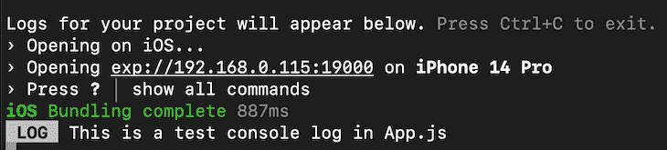
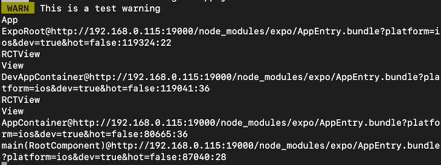
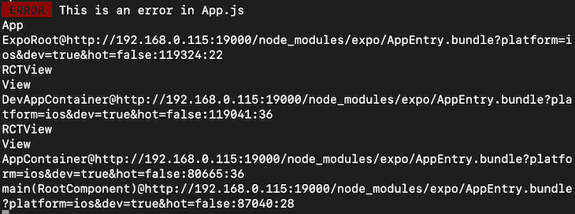
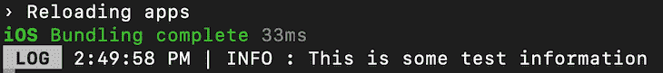
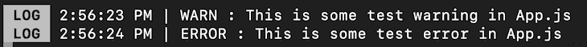
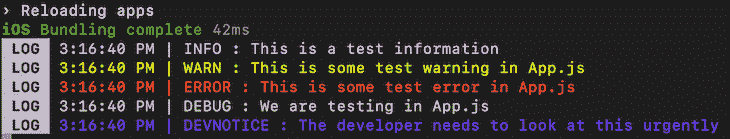

# 查看 React 本机控制台日志:最佳实践

> 原文：<https://blog.logrocket.com/reviewing-react-native-console-logs-best-practices/>

控制台日志对于任何 JavaScript 开发人员来说都是一个非常重要的概念，对于本地开发人员来说甚至更重要。当一个应用程序出现问题时，`console.log()`是我们用来找出代码中问题的唯一语句。

当谈到调试时，控制台日志真的很有见地，可以帮助您检查应用程序在任何执行点使用的实时数据。然而，拥有太多的控制台日志会让开发人员感到困惑，以至于无法识别任何日志。许多开发人员没有给他们的日志一个合适的描述，他们的终端变成这样:

```
i am here
just got executed
brooo why this doesnt run
i hate programming
this should run
[Object object]
12345
iiiiiiiiiiiiiiii

```

有一天，您的项目可能会被转移给另一个开发人员，因此拥有可读的控制台日志至关重要，它可以帮助下一个开发人员了解代码的任何特定部分发生了什么。

在本文中，我们将回顾在 React Native 中实现控制台日志的不同方式，以使事情更有组织性和可读性。要阅读本文，您需要具备 React Native 的基础知识，无论是关于 Expo 还是使用 React Native CLI。我们开始吧！

## 目录

## 查看控制台日志

无论您是在模拟器上工作还是在物理设备上工作，您的控制台日志都会显示在 Metro Bundler 终端中，当您运行应用程序时，它会立即打开。例如，假设您在代码中使用了以下控制台日志:

```
console.log("This is a test console log in App.js");

```

它将显示在您的终端中，如下所示:



注意 React Native 如何将`LOG`放在实际的控制台日志文本之前。您可以使用不同的控制台日志类型来改变这一点。让我们看看警告是如何显示在控制台上的:

```
console.warn("This is a test warning");

```

`warn()`是控制台对象中类似于`log()`的方法。它应该生成与常规日志类似的输出，但是，它应该包含一个警告标签:



除了警告文本本身，React Native 还记录了触发该警告的确切位置。除了控制台上的警告之外，React Native 还向连接的设备发送此警告:


您可以对错误执行相同的操作:

```
console.error("This is an error in App.js");

```

这将输出一个日志，日志中的标签为`ERROR`:



同样，设备上也会显示如下错误:


## 使用高级控制台日志包

除了常规的内置`console.log()`方法之外，您还可以安装定制的包，让您能够更好地控制控制台日志，使调试更容易、更有条理。我们来看一个例子；我们将把 [react-native-logs](https://www.npmjs.com/package/react-native-logs) 安装到我们的 React Native 应用程序中。在您的终端中运行以下命令:

```
#npm 
npm install react-native-logs

#yarn
yarn add react-native-logs

```

上面的命令将安装使用 react-native-logs 包所需的所有依赖项。现在，您可以使用以下代码行导入包:

```
import { logger } from "react-native-logs";

```

您可以通过使用组件外部或其他文件中的以下代码片段来初始化记录器:

```
const log = logger.createLogger();

```

现在，您可以简单地使用软件包提供的方法在控制台上创建一个简单的日志:

```
log.info("This is some test information");

```

这应该会提供如下所示的输出:



请注意，这个包自动为日志添加时间以及日志本身的消息。现在，让我们对警告和错误进行同样的尝试，看看输出是什么:

```
log.warn("This is some test warning in App.js");
log.error("This is some test error in App.js");

```

上面的代码片段应该会给出类似如下的输出:



目前，这里没有颜色，因为这是默认的记录器配置。我们还可以使用定制的日志记录器配置来给这些控制台日志增添一些色彩。

## 配置控制台日志颜色

让我们在我们的`logger.createLogger()`方法中添加一些配置:

```
const log = logger.createLogger({
  transportOptions: {
    colors: {
      info: "blueBright",
      warn: "yellowBright",
      error: "redBright",
      debug: "white",
    },
  },
});

```

在上面的代码片段中，我们为不同级别的控制台日志严重性提供了不同的颜色。现在让我们尝试一些控制台日志:

```
log.info("This is a test information");
log.warn("This is some test warning in App.js");
log.error("This is some test error in App.js");
log.debug("We are testing in App.js");

```

上面的代码片段应该给出以下输出:


请注意，颜色可能会因您的终端配置而异。在我的例子中，`blueBright`显示为紫色。

## 自定义严重性级别

除了默认的严重性级别，我们还可以添加自定义的严重性级别，如`debug`、`info`、`warn`和`error`。为此，我们需要在`logger.createLogger()`方法中定义级别和严重性:

```
const log = logger.createLogger({
  levels: {
    custom: 0,
    debug: 1,
    info: 2,
    warn: 3,
    error: 4,
    devNotice: 5,
  },
  transportOptions: {
    colors: {
      custom: "white",
      devNotice: "blue",
      info: "blueBright",
      warn: "yellowBright",
      error: "redBright",
      debug: "white",
    },
  },
});

```

在上面的代码中，我们定义了我们的级别和严重性，其中`0`是最不严重的。当您使用自定义级别时，如果您希望使用它们，您需要定义默认严重性。使用自定义标高会覆盖默认标高。

现在，让我们来测试一下:

```
log.custom("This is a custom log");
log.info("This is a test information");
log.warn("This is some test warning in App.js");
log.error("This is some test error in App.js");
log.debug("We are testing in App.js");
log.devNotice("The developer needs to look at this urgently");

```

上面的代码应该提供以下输出:



## 将日志输出到文件

在生产环境中，许多开发人员将他们的应用程序日志输出到一个文件中。因此，如果出现任何问题，用户可以向开发人员提供日志，他们可以使用这些日志来解决应用程序中的问题。当使用 [react-native-logs](https://www.npmjs.com/package/react-native-logs) 时，可以将您的日志输出到一个文件中。

根据您使用的是 Expo 还是 React Native CLI，您需要安装文件系统包来访问设备文件系统:

```
# Expo
npm install expo-file-system

# React Native CLI
npm install react-native-fs

```

然后，您可以按如下方式导入包:

```
// Expo
import * as FileSystem from "expo-file-system";

// React Native CLI
import FileSystem from "react-native-fs";

```

您可以在您的`logger.createLogger()`方法中使用以下配置:

```
const log = logger.createLogger({
  transport: fileAsyncTransport,
  levels: {
    custom: 0,
    debug: 1,
    info: 2,
    warn: 3,
    error: 4,
    devNotice: 5,
  },
  transportOptions: {
    FS: FileSystem,
    fileName: "logs.txt",
  },
});

```

注意，`fileAsyncTransport`是从 react-native-logs 包和`createLogger()`方法一起导入的。在上面的代码片段中，我们指定了一个文件传输方法，这意味着我们所有的日志都将输出到一个文件中。

在`transportOptions`中，我们根据使用 Expo 还是 React Native CLI 来指定文件系统。最后，我们还为`logs`文件提供了一个名称。

现在，在设备的文件系统中，根据您使用的操作系统，您应该会得到一个文本文件，其输出类似于以下代码:

```
3:21:32 PM | DEVNOTICE : The developer needs to look at this urgently 
3:22:49 PM | INFO : This is a test information 
3:22:49 PM | WARN : This is some test warning in App.js 
3:22:49 PM | ERROR : This is some test error in App.js 
3:22:49 PM | DEBUG : We are testing in App.js 

```

现在可以将该日志上传或与开发人员共享，以检查应用程序流并潜在地消除任何错误。

## 结论

控制台日志非常重要，如果使用正确，可以帮助开发人员快速解决很多问题。使用类似文件日志的东西也可以帮助应用程序的部署后支持。我强烈建议尝试一下配置，并探索更多关于这个包的信息。我希望你喜欢这篇文章，并快乐编码！

## [LogRocket](https://lp.logrocket.com/blg/react-native-signup) :即时重现 React 原生应用中的问题。

[](https://lp.logrocket.com/blg/react-native-signup)

[LogRocket](https://lp.logrocket.com/blg/react-native-signup) 是一款 React 原生监控解决方案，可帮助您即时重现问题、确定 bug 的优先级并了解 React 原生应用的性能。

LogRocket 还可以向你展示用户是如何与你的应用程序互动的，从而帮助你提高转化率和产品使用率。LogRocket 的产品分析功能揭示了用户不完成特定流程或不采用新功能的原因。

开始主动监控您的 React 原生应用— [免费试用 LogRocket】。](https://lp.logrocket.com/blg/react-native-signup)