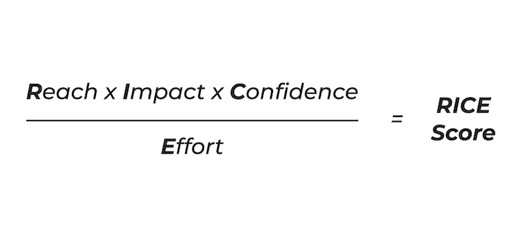
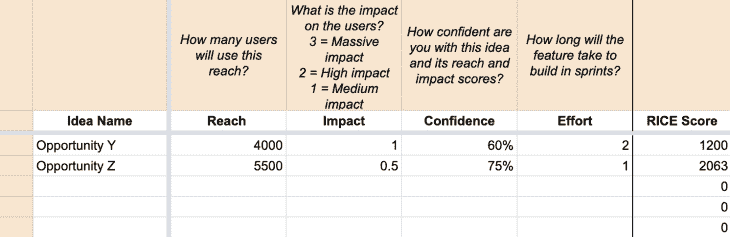

# RICE 框架:使优先化变得简单

> 原文：<https://blog.logrocket.com/product-management/rice-framework-prioritization-made-simple/>

自诞生以来，RICE(反应、影响、信心和努力)已经成为产品中最受欢迎的优先级框架之一。

在本指南中，我们将涵盖您需要了解的关于优先排序的 RICE 评分方法的所有内容。

* * *

## 目录

* * *

## 稻米框架:简史

Sean McBride 在 Intercom 担任产品经理期间，共同开发了 [RICE 框架](https://www.intercom.com/blog/rice-simple-prioritization-for-product-managers/)。有了这么多不同的优先级框架，McBride 和他的项目经理同事努力寻找最适合他们环境的决策方法。

麦克布赖德介绍了赖斯来解决几个问题:

1.  决策支持“宠物想法”而不是具有广泛影响力的想法
2.  对想法如何直接影响目标的审查不够
3.  努力经常被打折扣，信心也不被考虑在内

## 什么是大米框架？

RICE 是一种优先级评分方法。它考虑了四个属性:

*   [到达](#reach) —在给定时间段内，这会影响多少用户？
*   [影响](#impact) —这与我们选择的目标相关，会对每个用户产生多大影响？
*   [信心](#confidence) —我对范围、影响和努力的估计有多有信心？
*   努力 —这需要多长时间来实现？

通过[公式化大米](https://blog.logrocket.com/product-management/6-product-management-frameworks-you-should-know/#rice-scoring-model)，输出单个分数。这使得该框架能够一致地应用于即使是最不同的想法，允许您在确定优先级的方式上有更大的客观性。

### 到达

RICE 框架中的第一个属性是 reach。Reach 指的是估计在给定的时间范围内你的想法或倡议会影响多少人。

Reach 很重要，因为它可以帮助你避免为一部分用户做某事的偏见，尽管他们可能是最吱吱作响的轮子，但并不代表你的大多数用户。

在估计影响范围时，问自己:“我认为在给定的时间段内，这会影响多少用户/客户？”你需要确定时间段，并坚持应用。例如，您认为这将在下个月影响多少用户？或者下个季度？

一旦确定了这一点，就需要量化范围。这是通过将这些用户数量计算为实际数量来实现的。

例如，假设你有 7000 个月活跃用户(MAU)。如果你相信一个想法会在一个月内影响 60%的用户，那么你的接触人数将会是 4200 人。如果您按一个季度来计算，将会是 4，200 x 3 个月= 12，600 个用户。

### 影响

当与更高的目标或[目标和关键结果(OKR)](https://blog.logrocket.com/product-management/what-are-okrs-how-to-write-templates-examples/) 相关时，最好使用影响力，例如“增加 10%的转化率”

你应该问自己的问题是，“这会对个人用户产生多大影响？”或者，对于本例，它将如何影响转化率，影响程度如何？

McBride 在 Intercom 上的原始公式详细描述了一个从 0 到 3 的衡量影响的系统:

*   大规模撞击= 3
*   高影响= 2
*   中等影响= 1
*   低影响= 0.5
*   最小影响= 0.25

也就是说，您可以选择使用您自己的秤。我见过从 1-5 分，满分 10 分，甚至是自定义的，如:

*   大影响=3
*   中等影响= 2
*   低影响= 1

这是给你的定义，并找到什么适合你。请记住，无论你选择什么尺度，它都需要是可量化的。例如，不能使用 t 恤尺码(S，M，L)。

### 信心

信心是一个有趣的维度，也是所有优先化框架都应该包含的东西。众所周知，产品工作本质上是不确定的。将信心带入等式中有助于我们承认这一事实，并在确定优先级时将它考虑在内。

Source: [Intercom](https://www.intercom.com/blog/rice-simple-prioritization-for-product-managers/)

在计算自信度的时候，你要问自己，“我对这个想法有多自信？我对自己在影响力和影响力方面的得分有多少信心？”

如果我们要找一个简单的百分比，你有百分之五十的信心吗？百分之八十？

作为指导，您可以将信心分为:

*   高置信度= 100%
*   中等信心= 80%
*   低信心= 50%
*   低于 50%是一个大胆的猜测

然而，与“影响”一样，您并不局限于此规模。我经常使用 25%的区间(25%，50%，75%，100%)和 10%的区间(10%，20%，30%，等等。)也是为了自信。

因为信心是一个百分比，它本质上阻碍了低信心分数。例如，假设你在可及性和影响力方面给了很高的分数，但是你的信心很低。你仍然不确定它是否真的会产生预期的影响或者达到你设定的用户数量。信心会考虑到这一点，并重新平衡分数，使最终的赖斯分数下降。

信心也可以作为[发现](https://blog.logrocket.com/product-management/dual-track-agile-continuous-discovery/)的强制功能，并确保你的决定是[基于数据的](https://blog.logrocket.com/product-management/how-to-communicate-product-strategy/)。

在设定信心分数时，问问自己，“我对这个想法有多少数据或支持证据，以及我给的分数？”

例如，您可能已经根据发现的受问题影响的用户数量设置了可及分数。你可能也已经围绕这个解决方案做了一些用户测试，表明它引起了很好的共鸣。在这种情况下，你可以说你有高度的信心，因为它有证据和数据支持。

另一方面，让我们假设你有一个想法，其中包含一些大概的数字，很少或没有数据或发现来支持它。在这种情况下，除了信心不足之外，很难提出其他理由。

最后，信心评级不是最终得分。它可以很好地作为一个提示来问，例如，“我们如何增加对这个想法的信心？”这可能会引导你做一些必要的发现，并最终提高你的信心评级(以及你的影响力和影响力得分)。

* * *

订阅我们的产品管理简讯
将此类文章发送到您的收件箱

* * *

### 努力

RICE 评分模型的最后一个组成部分是努力。这里的努力是为了确保潜在的利益大于成本。

对于“努力”,您需要计算完成这项工作所需的时间。工作量可以按人-小时(或天、周等)计算，或者简单地按团队完成的天数/周数和/或冲刺数计算。

例如，这个想法可能需要一个 5 人的团队花两周时间来完成。在人工周中，这将是 5 x 2 = 10。

努力不应该是一门精确的科学。这应该是一个估计，所以不要为得到准确的数字而烦恼，也不要花太多时间从团队中获取估计。

## 怎么算一个米分？

一旦确定了每个属性的分数，计算 RICE 分数就很简单了。

赖斯是一个公式，它将影响力、影响力和信心相乘，然后除以努力。这种方法的输出被称为赖斯分数。

大米配方如下:

> ***饭分=(达成 x 影响 x 信心)/努力***

要使用 RICE，列出您想要比较的想法，并为每个想法的影响范围、影响力、信心和努力程度打分:

*   **到达** —在给定时间段内，这会影响多少用户？
*   **影响** —这与我们选择的目标相关，会对每个用户产生多大影响？
*   **信心** —我对范围、影响和努力的估计有多有信心？
*   努力 —这需要多长时间来实现？

RICE 评分矩阵可能如下所示:

| **想法** | **到达** | **影响** | **信心** | **努力** |
| *新入职流程* | 7,000 | 2 | 40% | 四 |
| *转诊计划* | 4,000 | 一 | 百分之六十 | 2 |

应用 RICE 时，您可以使用允许您输入 RICE 分数的工具，如 [Productboard](https://blog.logrocket.com/product-management/product-roadmap-tools-best-features-free-paid/#productboard) 、 [airfocus](https://blog.logrocket.com/product-management/product-roadmap-tools-best-features-free-paid/#airfocus) 或 [Roadmunk](https://blog.logrocket.com/product-management/product-roadmap-tools-best-features-free-paid/#roadmunk) 。否则，您可以轻松地使用电子表格来执行计算。

* * *

***这里有一个*** [***大米优先排序模板***](https://docs.google.com/spreadsheets/d/1ZO27T0JCzBwmz8ej5kTDhgS-M7eTMvddT8RoZ6cRyv0/edit#gid=0) ***你可以使用 Google Sheets 下载并定制。***

* * *

重要的是要记住，你的大米分数不应该为你做优先排序。你应该将大米视为你的优先考虑的输入。换句话说，由你来评估最后的分数，决定你应该先做什么。

举个例子:假设前两个饭分只差三分。但是，经过进一步调查，您发现最高分的可信度只有 50 %,而第二高分的可信度为 80%。

在本例中，您应该优先考虑大米得分第二高的项目。此外，您可以考虑验证与第一项相关的分数和/或增加信心的方法。

让我们看另一个例子场景，在这个场景中，RICE 分数有很小的差别，但是努力程度有差别。根据差距的大小，优先考虑努力程度较低的任务可能更有意义，尽管它的 RICE 分数略低。

## 为什么使用 RICE 框架进行优先级排序？

RICE 是一个很棒的优先化工具，很容易理解为什么它被如此广泛地采用。

赖斯旨在通过关注影响力而不是吱吱作响的轮子来减少偏见。它通过测量置信度、寻找数据和验证优先级来进一步减少偏差。

RICE 还鼓励产品管理最佳实践，例如通过发现来增强信心，用数据支持决策，关注影响，以及通过 reach 努力实现以客户为中心。

## 大米评分模板

***下载并定制此 [RICE 评分模板](https://docs.google.com/spreadsheets/d/1ZO27T0JCzBwmz8ej5kTDhgS-M7eTMvddT8RoZ6cRyv0/edit#gid=0)，帮助您在组织中实施优先级框架。***

* * *

*精选图片来源:[icon scout](https://iconscout.com/icon/agile-prioritize-2310243)*

## [LogRocket](https://lp.logrocket.com/blg/pm-signup) 产生产品见解，从而导致有意义的行动

[LogRocket](https://lp.logrocket.com/blg/pm-signup) 确定用户体验中的摩擦点，以便您能够做出明智的产品和设计变更决策，从而实现您的目标。

使用 LogRocket，您可以[了解影响您产品的问题的范围](https://logrocket.com/for/analytics-for-web-applications)，并优先考虑需要做出的更改。LogRocket 简化了工作流程，允许工程和设计团队使用与您相同的[数据进行工作](https://logrocket.com/for/web-analytics-solutions)，消除了对需要做什么的困惑。

让你的团队步调一致——今天就试试 [LogRocket](https://lp.logrocket.com/blg/pm-signup) 。