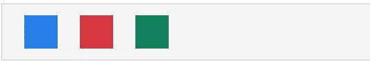
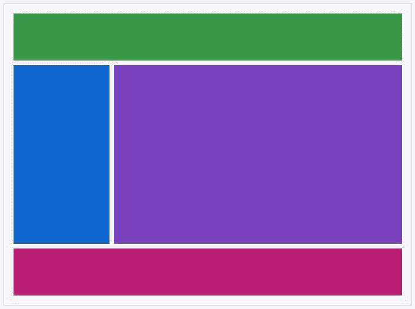
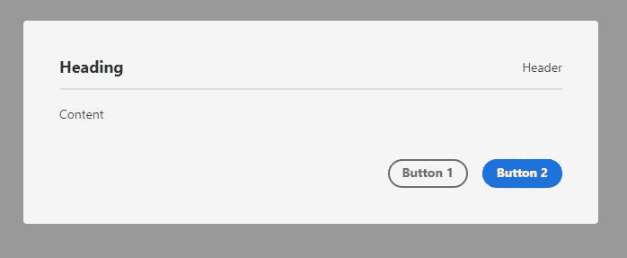

# React Spectrum 提供更丰富、更易访问的用户界面

> 原文：<https://blog.logrocket.com/rich-accessible-uis-react-spectrum/>

7 月中旬， [Adobe 宣布](https://react-spectrum.adobe.com/blog/introducing-react-spectrum.html)发布 React Spectrum，这是一个用于构建自适应、可访问和丰富的用户体验的工具集。React Spectrum 的核心由三个主要部分组成:

1.  **反应谱**，与 UI 有关
2.  **React Aria** ，与可及性有关
3.  **反应庄重**，处理状态管理和逻辑

在本文中，我们将依次了解这些部分。请注意，您应该有相当多的 JavaScript 经验，并且能够跟上。

## 反应光谱

正如我们之前了解到的，React Spectrum 关注于 UI。它是 Adobe 设计系统 Spectrum 的一个实现；它就像材质 UI 对于谷歌的材质设计一样。你可以[了解更多关于](https://spectrum.adobe.com/) [it](https://spectrum.adobe.com/) [这里](https://spectrum.adobe.com/)。React Spectrum 为我们提供了大量组件，用于构建可访问的、自适应的、响应迅速的、健壮的用户界面和体验。

### 安装反应光谱

React Spectrum 可以通过像 npm 或 Yarn 这样的包管理器来安装。它还可以与 create-react-app 完美配合。

所以，首先新建一个 React 项目(最好用 create-react-app):

```
npx create-react-app intro-react-spectrum
```

然后安装 React Spectrum:

```
//npm
npm install @adobe/react-spectrum

//yarn
yarn add @adobe/react-spectrum
```

我们现在可以通过使用文档中这个非常简单的示例代码来测试它。在您的`app.js`中，键入以下内容:

```
import {
  Provider,
  defaultTheme,
  Button
} from "@adobe/react-spectrum";
import React from "react";
function App() {
  return (
    <Provider theme = {defaultTheme}>
      <Button
        variant = "primary"
        onPress = {() => alert("Hey there!")}
      >
        Hello React Spectrum!
      </Button>
    </Provider>
  );
}
```

这将在屏幕上呈现一个按钮，打开一个警告，上面写着“嘿！”单击时。

现在我们已经设置了 React Spectrum，我们可以开始探索它提供了什么。

### 提供者

每个 React Spectrum 应用程序的基础是一个提供者，用于定义应用程序级别的配置，如主题、语言环境等。例如，在上面的示例代码块中，我们将应用程序的主题设置为`defaultTheme`，它使用“亮”和“暗”颜色主题。

React Spectrum 允许我们在 provider 组件上设置配色方案，以强制使用特定的配色方案。例如，我们可以通过使用`colorScheme`属性来强制我们的应用程序使用当前应用程序主题的“深色”配色方案，如下所示:

```
<Provider theme = {defaultTheme} colorScheme = "dark">
      <Button
        variant = "primary"
        onPress = {() => alert("Hey there!")}
      >
        Hello React Spectrum!
      </Button>
</Provider>
```

Provider 还有一个我非常喜欢的非常方便的用例:为一组元素设置公共属性。例如，我们可以通过用 provider 包装一组元素并使用`isDisabled` prop 来禁用它们，就像这样:

```
<Flex direction = "column" alignItems = "center" flex gap = "size-100">
        <Provider isDisabled>
          <ActionButton
            width = "size-2000"
            variant = "primary"
          >
            Button 1
          </ActionButton>
          <Button
            width="size-2000"
            variant = "cta"

          >
            Button 2
          </Button>
        </Provider>
      </Flex>
```

Provider 还有其他类似的道具，像`isQuiet`、`isHidden`等等。

### 布局

React Spectrum 支持 CSS3 中最流行的两种布局系统，分别是 flexbox 系统和 grid 系统。它通过提供两个名为`Flex`和`Grid`的容器组件来实现这一点。有了这两个组件，我们可以构建灵活且响应迅速的 UI。

`Flex`是实现 CSS flexbox 的容器组件，它允许我们使用 flexbox 提供的所有属性——比如`justify-content`、`align-content`、`align-items`等。—以道具的形式。下面是一些使用`Flex`的示例代码:

```
<View borderWidth="thin" borderColor="dark" padding="size-200">
          <Flex width="size-3000" justifyContent="space-around">
            <View
              height="size-600"
              width="size-600"
              backgroundColor="blue-400"
            ></View>
            <View
              height="size-600"
              width="size-600"
              backgroundColor="red-500"
            ></View>
            <View
              height="size-600"
              width="size-600"
              backgroundColor="green-600"
            ></View>
          </Flex>
      </View>
```

这是浏览器中显示的结果:



`Grid`是 CSS 网格系统的一个实现，和`Flex`一样，它允许我们以道具的形式使用各种 CSS 网格属性。下面是文档中的一些示例代码，说明如何使用`Grid`组件:

```
<View borderWidth="thin" borderColor="dark" padding="size-200">
      <Grid
            flex
            areas={["header  header", "sidebar content", "footer  footer"]}
            columns={["1fr", "3fr"]}
            rows={["size-1000", "auto", "size-1000"]}
            height="size-6000" gap="size-100" >
            <View backgroundColor="celery-600" gridArea="header" />
            <View backgroundColor="blue-600" gridArea="sidebar" />
            <View backgroundColor="purple-600" gridArea="content" />
            <View backgroundColor="magenta-600" gridArea="footer" />
          </Grid>
      </View>
```

这是结果:



除了`Flex`和`Grid`，React Spectrum 还有一个被称为插槽的概念。引用文档中的话，“插槽是组件中的命名区域，用于接收子组件并为它们提供样式和布局。”

使用插槽，我们可以为组件提供某些子组件，组件为这些子组件提供布局和样式。使用插槽的组件示例有`Dialog`、`Picker`和`Menus`组件。

我们以`Dialog`为例。它接受`Heading`、`Header`、`Content`和`ButtonGroup`组件，并为每个组件提供预定义的布局和样式。下面是一个简单的`Dialog`的代码:

```
<Dialog>
  <Heading>Heading</Heading>
  <Header>Header</Header>
  <Divider />
  <Content>
    <Text>Content</Text>
  </Content>
  <ButtonGroup>
    <Button variant="secondary" onPress={close}>
          Button 1
    </Button>
    <Button variant="cta" onPress={close}>
       Button 2
     </Button>
   </ButtonGroup>
</Dialog>
```

生成的对话框应该如下所示:



### 主题

React Spectrum 中的主题允许我们定义应用程序中使用的配色方案和平台比例。

配色方案定义了我们的应用程序的不同主题模式，例如“亮”和“暗”，而平台尺度定义了组件在尺寸上放大(在移动设备上)或缩小(在桌面上)的程度。平台秤确保所有用户的流畅体验，无论他们可能使用的设备类型如何。您可以点击阅读更多关于 Spectrum [平台秤的信息。](https://spectrum.adobe.com/page/platform-scale/)

要创建自定义主题，您必须定义自己的`Theme`对象。从 React Spectrum 源代码看到的`Theme`的结构如下:

```
interface Theme {
  /** CSS module defining the global variables, which do not change between color schemes/scales. */
  global?: CSSModule,
  /** CSS module defining the variables for the light color scheme. */
  light?: CSSModule,
  /** CSS module defining the variables for the dark color scheme. */
  dark?: CSSModule,
  /** CSS module defining the variables for the medium scale. */
  medium?: CSSModule,
  /** CSS module defining the variables for the large scale. */
  large?: CSSModule
}
```

你可以在这里找到应该为每个 CSS 模块定义的变量列表。

如果你的目标是用 React 构建一个 Adobe 风格的产品，那么 React Spectrum 是满足你所有需求的完美选择。不过在定制方面有点局限。这肯定可以通过使用主题来定制，但这不是一个快速的过程。

## 反应咏叹调

React Aria 主要处理三件事:可访问性、用户交互和国际化。基本上，它帮助开发人员确保我们为所有用户提供最佳体验，无论他们的能力、设备选择或浏览器选择如何。它通过为我们提供 React 钩子来返回我们可以在 JSX 元素中展开的道具。我们将简要看看其中的一些挂钩。

### 装置

根据文档，React Aria 是可增量采用的。因此，每个组件都作为一个单独的包发布，您必须根据需要单独安装每个组件。出于本文的目的，我们将安装`useButton`和`useFocusRing`挂钩。

```
npm install @react-aria/button @react-aria/focus
```

### `useButton`

我们将讨论的第一个钩子是`useButton`钩子。这个钩子为一个`Button`组件提供可访问性和自适应行为。如果我们想实现更多的定制样式，我们可以将这个钩子与常规的语义`<button>`元素或类似于`<div>`的表示元素一起使用。它处理所有易访问性问题，以便开发人员可以专注于样式。

这个`useButton`钩子接受两个参数:来自我们组件的道具和一个 [ref](https://reactjs.org/docs/refs-and-the-dom.html) 。下面是文档中的一个示例代码块:

```
function Button(props) {
  let ref = useRef();
  let {buttonProps} = useButton(props, ref);
  let {children} = props;
  return (
    <button {...buttonProps} ref={ref}>
      {children}
    </button>
  );
}
```

我们也可以选择使用其他 JSX 元素，如`<div>`或`<span>`，而不是`<button>`，React Aria 将确保它保持完全可访问性。

```
function Button(props) {
  let {children} = props;
  let ref = useRef();
  let {buttonProps, isPressed} = useButton(
    {
      ...props,
      elementType: 'span'
    },
    ref
  );

  return (
    <span
      {...buttonProps}
      style={{
        cursor: 'pointer',
        userSelect: 'none',
        WebkitUserSelect: 'none'
      }}
      ref={ref}>
      {children}
    </span>
  );
}
```

## `useFocusRing`

允许我们对有键盘焦点的 HTML 元素应用样式。聚焦环仅适用于键盘聚焦，不适用于鼠标或触摸聚焦。这里有一个使用中的`useFocusRing`挂钩的简单例子:

```
function Example() {
  let {isFocusVisible, focusProps} = useFocusRing();

  return (
    <button
      {...focusProps}
      style={{
        WebkitAppearance: 'none',
        appearance: 'none',
        background: 'green',
        border: 'none',
        color: 'white',
        fontSize: 14,
        padding: '4px 8px',
        outline: isFocusVisible ? '2px solid dodgerblue' : 'none',
        outlineOffset: 2
      }}>
      Test
    </button>
  );
}
```

React Aria 是各种非常方便的挂钩的家园，这些挂钩简化了一些常见的前端任务，如创建定制组件、构建最佳用户交互反馈和国际化。

## 反应庄重

反应谱的最后一部分是反应谱。React estorally 是一个钩子库，它提供了可以跨 React(在 web 上)和 React Native 使用的状态管理和核心逻辑。它可以在 web 上与 React Aria 一起使用，为像`[Switch](https://react-spectrum.adobe.com/react-aria/useSwitch.html)`这样的定制组件提供行为和用户交互。

### 装置

就像 React Aria 一样，React estrial 是增量可采用的，所以您必须将每个组件作为单独的包安装在@ React-estrial 范围下。

### 收集

react estorally 有集合的概念，集合基本上是项目列表。集合非常常见，可以在许多 UI 组件中找到，其中包括菜单、列表、树、选择、表格等等。集合可以是**静态**(表示静态数据，如菜单)或**动态**(如表示从 API 获取的数据的列表)。

* * *

### 更多来自 LogRocket 的精彩文章:

* * *

有了 React estorally，我们可以使用一堆钩子和组件轻松地实现集合。例如，假设我们想要创建一个定制的`Select`组件，它的条目必须从 API 中获取。

由于获取数据是一个异步操作，我们必须让用户知道何时数据仍在被获取。我们可以通过 React estrial 的一个钩子`useAsyncList`轻松实现这一点。

使用`useAsyncList`钩子，我们可以确定异步操作的状态(加载或失败),并与我们自己的定制组件或一些实现集合 API 的 React Spectrum 组件(如`Picker`)一起使用。

由于`Picker`实现了集合 API，我们可以很容易地将其与`useAsyncList`集成。例如，使用`Picker`组件的`isLoading`属性，我们可以很容易地通知用户数据仍在获取中，因此，他们将无法使用`Picker`组件。

这里有一个简单的例子，使用`Picker`组件和`useAsyncList`创建一个`Select`组件，允许用户从尼日利亚银行列表中进行选择。

```
function App() {
  let list = useAsyncList({
    async load({signal}) {
      let res = await fetch('https://nigerianbanks.xyz/', {signal});
      let json = await res.json();
      console.log(json);
      return {items: json};
    }
  });
  return (
    <Provider theme={defaultTheme}>
      <View borderWidth="thin" borderColor="dark" padding="size-200">
        <Picker label="Select a bank" items={list.items} isLoading={list.isLoading}>
          {(item) => <Item key={item.name}>{item.name}</Item>}
        </Picker>
      </View>
    </Provider>
  );
}
```

`useAsyncList`也可以用来实现无限加载、排序和许多其他有用的可以在数据列表上执行的操作。

最后，不言而喻，React estrial 与 React Spectrum 和 React Aria 非常好地集成在一起，可以与这两个库结合使用。

## 结论

React Spectrum 是各种工具的家园，其中一些工具可以集成到您自己的设计系统中，以构建完全可访问的定制组件和应用程序。点击可以了解更多关于 React Spectrum [的信息。](https://react-spectrum.adobe.com/)

## [LogRocket](https://lp.logrocket.com/blg/react-signup-general) :全面了解您的生产 React 应用

调试 React 应用程序可能很困难，尤其是当用户遇到难以重现的问题时。如果您对监视和跟踪 Redux 状态、自动显示 JavaScript 错误以及跟踪缓慢的网络请求和组件加载时间感兴趣，

[try LogRocket](https://lp.logrocket.com/blg/react-signup-general)

.

[ ](https://lp.logrocket.com/blg/react-signup-general) [](https://lp.logrocket.com/blg/react-signup-general) 

LogRocket 结合了会话回放、产品分析和错误跟踪，使软件团队能够创建理想的 web 和移动产品体验。这对你来说意味着什么？

LogRocket 不是猜测错误发生的原因，也不是要求用户提供截图和日志转储，而是让您回放问题，就像它们发生在您自己的浏览器中一样，以快速了解哪里出错了。

不再有嘈杂的警报。智能错误跟踪允许您对问题进行分类，然后从中学习。获得有影响的用户问题的通知，而不是误报。警报越少，有用的信号越多。

LogRocket Redux 中间件包为您的用户会话增加了一层额外的可见性。LogRocket 记录 Redux 存储中的所有操作和状态。

现代化您调试 React 应用的方式— [开始免费监控](https://lp.logrocket.com/blg/react-signup-general)。