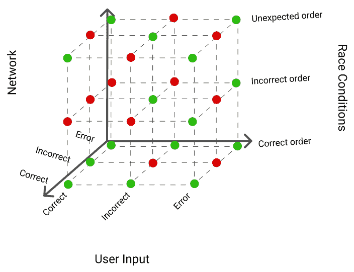
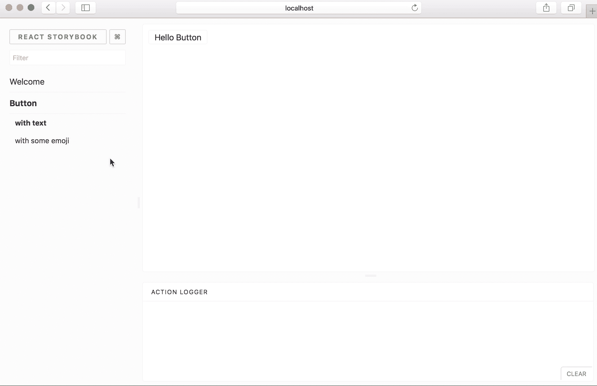

# React 应用程序的健壮、可扩展测试

> 原文：<https://blog.logrocket.com/robust-scalable-tests-react-applications/>

有了 React 和围绕它出现的测试工具生态系统，最终有可能构建健壮的、可伸缩的测试，为代码正确性提供强有力的保证。



The number of possibilities to test on the front end grows exponentially. User input, network, and race conditions can all introduce bugs.

当我们决定开始为我们的应用程序编写 UI 测试时，我们发现没有任何很好的资源来解释 React 测试的各种技术。本系列的目标是讨论这些技术，并概述如何开始。

在现代 JavaScript 前端中，我们可能想要编写 3 种类型的测试:

*   单元测试:这些测试验证单个组件或模块的行为。有许多工具和库使得编写这些测试变得更加容易。
*   应用程序测试:应用程序和业务逻辑很难用单元测试来全面测试。应用程序测试(通常称为“集成测试”)测试您的整个应用程序代码，通常使用模拟的 API。
*   端到端测试:如果您想要测试您的整个应用程序(前端和后端)，端到端测试允许您断言您的整个系统按预期工作。

在这篇文章中，我将讨论单元测试以及何时/如何编写单元测试。

### 单元测试

在 React 中，单元测试分为几个不同的类别:

*   逻辑测试
*   组件测试
*   故事书测试

想象我们正在构建一个“计算器”应用程序。这些测试中的每一个都有稍微不同的目的:

*   逻辑测试:计算器能正确地计算一个等式并返回正确的结果吗？
*   组件测试:当我点击一个按钮时，一个数字会出现在计算器中吗？
*   故事书测试:当用户将两个数字相加时，计算器看起来正确吗？

逻辑测试

### 逻辑测试是最直接的单元测试。最简单的情况可能是这样的:

这些代码通常写起来很快，在处理有很多边缘情况的复杂代码时非常有用。重要的是不要过度进行这些测试——您应该只为具有稳定 API 的代码编写测试。如果函数的目的或输入不断变化，测试的保证将变得毫无意义。

```
import { expect } from 'chai';
function addTwoNumbers(a, b) {
   return a + b;
}
describe('addTwoNumbers', () => {
  it('should add two numbers', () => {
     expect(addTwoNumber(2, 3)).to.equal(5);
  });
});
```

要在前端设置逻辑测试，我建议使用 Jest 或 Mocha，以及 Chai 来进行测试断言:

组件测试

### React 的组件模型对于编写测试来说相当方便。组件测试允许我们单独测试单个组件，而不是用集成测试来测试整个应用。此外，React 的虚拟事件模型允许我们在没有浏览器环境的情况下对组件执行“操作”!这里有一个使用 AirBnB 的[酶](https://github.com/airbnb/enzyme)库的集成测试示例:

你可以在这个 run kit:[https://runkit.com/arbesfeld/enzyme-example](https://runkit.com/arbesfeld/enzyme-example)玩玩酶和成分测试

```
class MyComponent extends Component {
  state = {
    counter: 0,
  };

  render() {
     return ( 
       <div>
         {this.state.counter}
         <button onClick={() => this.setState({ counter: this.state.counter + 1 })} />
       </div>
     );
  }
}
describe('MyComponent', () => {
  it('should increment the counter when the button is pressed', () => {
    const wrapper = shallow(<MyComponent />);

    expect(wrapper.text()).to.contain(0);
    wrapper.find('button').simulate('click');
    expect(wrapper.text()).to.contain(1);
  });
});
```

像逻辑测试一样，找到正确的 API 边界来测试是很重要的。不值得为不断变化的组件编写测试。此外，简单的纯功能组件对于测试来说并不那么有用:它们很少会有 bug 或问题。我建议在构建复杂组件的 UI 库时编写组件测试，比如多选、预输入搜索框等。

故事书测试

### [react-storybook](https://github.com/storybooks/react-storybook) 和其他“UI 开发环境”允许你在一个自包含的开发环境中构建组件，然后保存你的组件的“故事”,这使得其他开发人员很容易迭代组件。


一些开发人员会争辩说这些不是真正的测试，但是我觉得它们和测试的目的是一样的。通过编写组件的所有可能状态，其他开发人员可以更容易地改进组件，并在应用程序的其他部分使用组件。



如果你对 react-storybooks 感兴趣，这里有一些其他的好资源供你深入研究:

UI 组件行动手册提供了一个关于如何用组件设计前端的很好的概述。

*   阿鲁诺达简介 react-stor books:[https://voice . kadira . io/introducing-react-story book-EC 27 f 28 de 1 e 2](https://voice.kadira.io/introducing-react-storybook-ec27f28de1e2)
*   对于高级用户，story shots([https://github.com/storybooks/storyshots](https://github.com/storybooks/storyshots))可以让你从你的故事书故事中编写实际的测试。
*   我应该写前端单元测试吗？

### 这是我在讨论 React engineering 时经常听到的问题。做出这个决定通常有几个因素在起作用:

**组件逻辑有多复杂？**如果测试和组件代码一样长，很可能不值得测试。

*   **成分变化的可能性有多大？**该功能/组件是否会随着时间的推移而演变？如果是这样，最好考虑集成测试。
*   测试能帮助我编写组件吗？有时在编写组件代码之前编写测试实际上对加速开发非常有帮助。
*   产品必须有多坚固？根据您产品所处的阶段，您可能拥有非常高的可靠性保证。随着时间的推移，单元测试几乎肯定会减少错误的可能性，这可能会对业务产生影响。
*   谢谢你的倾听，祝单元测试愉快！

[LogRocket](https://lp.logrocket.com/blg/react-signup-general) :全面了解您的生产 React 应用

## 调试 React 应用程序可能很困难，尤其是当用户遇到难以重现的问题时。如果您对监视和跟踪 Redux 状态、自动显示 JavaScript 错误以及跟踪缓慢的网络请求和组件加载时间感兴趣，

.

[try LogRocket](https://lp.logrocket.com/blg/react-signup-general)

LogRocket 结合了会话回放、产品分析和错误跟踪，使软件团队能够创建理想的 web 和移动产品体验。这对你来说意味着什么？

[ ](https://lp.logrocket.com/blg/react-signup-general) [](https://lp.logrocket.com/blg/react-signup-general) 

LogRocket 不是猜测错误发生的原因，也不是要求用户提供截图和日志转储，而是让您回放问题，就像它们发生在您自己的浏览器中一样，以快速了解哪里出错了。

不再有嘈杂的警报。智能错误跟踪允许您对问题进行分类，然后从中学习。获得有影响的用户问题的通知，而不是误报。警报越少，有用的信号越多。

LogRocket Redux 中间件包为您的用户会话增加了一层额外的可见性。LogRocket 记录 Redux 存储中的所有操作和状态。

现代化您调试 React 应用的方式— [开始免费监控](https://lp.logrocket.com/blg/react-signup-general)。

Modernize how you debug your React apps — [start monitoring for free](https://lp.logrocket.com/blg/react-signup-general).