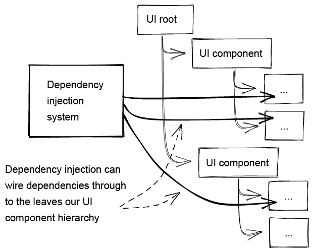
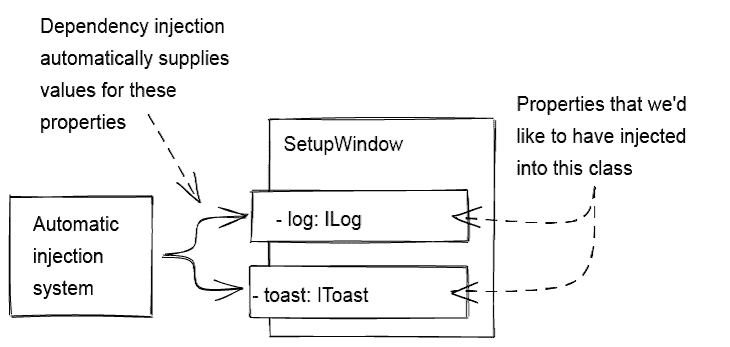
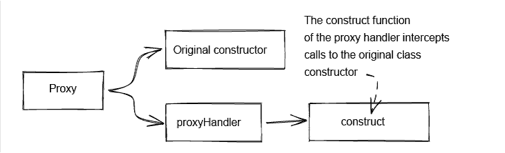

# 滚动你自己的依赖注入-日志火箭博客

> 原文：<https://blog.logrocket.com/roll-your-own-dependency-injection/>

你有没有尝试过使用依赖注入(DI)框架，却被它们的复杂性和按照你的意愿改变它们的困难所击倒？使用一些流行的 DI 库，如果您认为这是火箭科学的一个分支，那也是情有可原的。

嗯，我想表明创建或使用阿迪图书馆并不像你想象的那样复杂或困难。在经历了几个流行的 DI 框架而没有得到我想要的东西之后，我决定自己写一个。

在这篇博文中，我将向您展示在阿迪图书馆中，用不到 300 行代码(其中许多是日志和注释)的 TypeScript 可以实现什么。

我为我在 [Data-Forge Notebook](https://www.data-forge-notebook.com/) 中使用的 TypeScript 创建了自己的 DI 库，它运行在 Electron 上，具有使用 React 构建的用户界面。我希望阿迪库能够很好地为 React 和泛型类型脚本代码工作，我希望它易于理解和使用，但仍然非常灵活。

我现在已经开源了我的 DI 库，它叫做 Fusion。你可以在 [npm](https://www.npmjs.com/package/@codecapers/fusion) 和 [GitHub](https://github.com/ashleydavis/fusion) 上找到。请下载该代码的副本，这样您就可以阅读这篇博文了。

## 什么是依赖注入？

随着应用程序的增长和复杂性的增加，您是否曾经努力保持应用程序的正常运行？

所有软件都是由以特定方式连接在一起的交互组件组成的。随着交互组件数量的增长，组件之间的布线和连接数量呈指数增长(这种现象称为[梅特卡夫定律](https://en.wikipedia.org/wiki/Metcalfe%27s_law))。

你真的想自己处理那些复杂的线路吗？这就是自动化依赖注入将为您做的事情。

依赖注入是一种[设计模式](https://en.wikipedia.org/wiki/Software_design_pattern)，用于自动连接复杂应用程序的组件。这在将依赖关系写入复杂的用户界面层次结构时特别有用，您可以在查看图 1 后想象这种情况。



Figure 1: Using dependency injection to directly wire dependencies through to a deep and complex UI component hierarchy.

## 为什么要使用依赖注入？

依赖注入非常有用，原因有很多:

*   依赖关系的使用和依赖关系的解决是分开的
*   它鼓励[分离关注点](https://en.wikipedia.org/wiki/Separation_of_concerns)和[组件之间的松散耦合](https://en.wikipedia.org/wiki/Loose_coupling)
*   它自动化了应用程序中组件的连接，否则这项任务会非常复杂
*   单元测试更容易模仿依赖关系
*   它促进了组件的快速重组，这使得重构更快更安全
*   它允许抽象，这有助于跨多个平台、环境或流程类型重用相同的代码库
*   它可以用来集中或外部化您的应用程序的配置，尽管这不是 Fusion 在现阶段所支持的

依赖注入也是一种简洁优雅的构建应用程序的方式。使用 DI，您将花更少的时间关注系统布线，花更多的时间开发特性。

## 有哪些替代方案？

在开始编写自己的代码库之前，您应该首先考虑替代方案。我们还能如何连接依赖关系？

我们可以在代码中需要依赖的地方直接创建它们，而不是注入依赖。但是，我们不想这么做，因为这意味着我们不能共享依赖项，而且也不可能用模拟版本来替换单元测试的依赖项。

另一种选择是直接访问[单态](https://en.wikipedia.org/wiki/Singleton_pattern)，但是这与添加硬链接全局变量具有完全相同的结果。

您可能喜欢的 DI 的一个更简单的替代方案叫做[服务定位器模式](https://en.wikipedia.org/wiki/Service_locator_pattern)。它类似于 DI，但自动化程度要低得多。如果您认为 DI 太复杂，它仍然是一个很好的开始模式。

当然，您可以使用大量现有的 DI 库。[刚刚搜了 npm](https://www.npmjs.com/search?q=dependency%20injection) 发现了 1778 个包！这里肯定有我能用的东西吧？

嗯，就像我说的，我尝试了一些流行的图书馆，发现他们有所欠缺。它们通常非常复杂，很难满足您的需求。

我想要更简单的东西。我希望阿迪图书馆能让我按照自己的方式工作。这就是我创造核聚变的原因。现在我想展示一下，开发自己简单的 DI 库并不困难。

## 使用类型脚本装饰器的依赖注入

Fusion 建立在[TypeScript decorator](https://www.typescriptlang.org/docs/handbook/decorators.html)和 [JavaScript `Proxy`类](https://developer.mozilla.org/en-US/docs/Web/JavaScript/Reference/Global_Objects/Proxy)之上。它为每个类创建一个代理来拦截对[构造函数](https://en.wikipedia.org/wiki/Constructor_(object-oriented_programming))的调用。就在构造对象之后，但就在对象被返回供调用者使用之前，代理自动注入依赖关系。

例如，我们将使用一个名为`SetupWindow`的 React 组件。图 2 显示了依赖注入系统如何为我们的类提供属性值。这是一个简单但真实的例子，取自数据伪造笔记本。请注意，Fusion 可以与任何 TypeScript 类一起工作——我正在用 React 进行演示，以表明这是可以做到的。



Figure 2: Dependency injection automatically provides values for certain properties in our classes.

### 将类标记为可注入

首先，我们必须能够标记一个用于注入的类。清单 1 显示了示例`SetupWindow`类。我们使用`InjectClass`装饰器将类标记为可注入的。这个装饰器创建了代理构造函数。

接下来在清单 1 中，我们使用`InjectProperty` decorator 来标记要注入的类的属性。为了简单起见，[神奇字符串](https://softwareengineering.stackexchange.com/questions/365339/what-is-wrong-with-magic-strings)用于标识要注入的依赖项。

如果你对魔法线的使用有异议，请不要担心；我只是想暂时保持事情简单，然后在这篇文章的最后，我会给你一个更好的解决方案。

在这个例子中，`log`和`toast`属性被注入了依赖关系，这些依赖关系是接口`ILog`和`IToast`的实现。然后，对于类的其余部分——至少在构造函数之后——我们可以利用这些属性，例如，在它们上面调用函数。

##### *清单 1:将一个类标记为可注入的*

```
import { InjectableClass, InjectProperty } from "@codecapers/fusion"

@InjectableClass()
export class SetupWindow extends React.Component<{},{}> {

    @InjectProperty("ILog")
    log!: ILog;

    @InjectProperty("IToast")
    toast!: IToast;

    constructor(props: any) {
        super(props); 

// ... dependencies can't be used in the constructor ...    
    }

    someFunction(): void {
        // Make use of dependencies.
        this.log.info("All went well.");

        this.toast.success("Operation was a success!");
    }

    // ... other code goes here ...
}
```

有没有注意到每个楼盘名字后面的感叹号？这样 TypeScript 就不会给我们关于未初始化变量的警告。从编译器的角度来看，这些属性从来没有真正初始化过。它们当然会，但是 TypeScript 不知道这一点，所以我们使用感叹号来隐藏 TypeScript 的警告。

这就是要使一个类可注射所需要做的一切。现在，当您实例化这个类时(如清单 2 所示)，代理构造函数被调用，依赖关系被自动解析。

##### *清单 2:在 TSX 文件中实例化一个 React 组件*

```
<SetupWindow />
```

或者，如果您使用的是普通的 TypeScript 类而不是 React 组件，您可以用清单 3 所示的`new`关键字进行实例化。无论哪种方式，代理构造函数都会自动解析依赖关系。

* * *

### 更多来自 LogRocket 的精彩文章:

* * *

##### *清单 3:用新关键字*实例化一个常规的类型脚本

```
const window = new SetupWindow();
```

### 记录可注射性

装饰者将属性标记为可注入的。您可以在清单 4 中看到它的代码。

`InjectProperty`是一个函数，它被传递了将要注入的依赖项的 ID。这是一个创建装饰器的工厂函数。清单 4 中的内部函数实际上是装饰器，每个标记了它的属性都会调用它。

我们记录可注入的属性，以便以后构造类的实例时可以解析它们。`__injections__`数组附加到类的原型上，收集属性注入所需的细节(属性名和依赖 ID)。

##### *清单 4:记录可注入属性的 TypeScript 装饰器*

```
export function InjectProperty(dependencyId: string): Function {
    // Returns a function that is invoked for the property that is to be injected.
    return (prototype: any, propertyName: string): void => {
        if (!prototype.__injections__) {
            // Record properties to be injected against the constructor prototype.
            prototype.__injections__ = [];
        }

        // Record injections to be resolved later when an instance is created.
        prototype.__injections__.push([ propertyName, dependencyId ]);
    };
}
```

### 使一个类可注入

装饰者将一个类标记为可注入的。您可以在清单 5 中看到它的代码。同样，这是一个产生实际装饰器的工厂函数。它不需要任何参数，所以从技术上来说，我们并不真正需要工厂函数，但在 Fusion 中与其他装饰器保持一致是很好的。

`InjectableClass`返回`makeConstructorInjectable`；这个函数是实际的装饰器。它不是一个匿名函数，就像我们在清单 4 中使用的那样。相反，这个函数有一个名字，因为我们希望在 Fusion 内部重用它。

##### *清单 5:使类可注入的 TypeScript 装饰器*

```
//
// TypeScript decorator: Marks a class as injectable.
//
export function InjectableClass(): Function {
    // Returns a factory function that creates a proxy constructor.
    return makeConstructorInjectable;
}
```

### 代理可注射对象

为了让依赖注入自动发生，我们需要为原始构造函数创建一个代理。我们将其包装在一个 JavaScript `Proxy`实例中，如图 3 所示。`proxyHandler`的`construct`函数拦截对原始构造函数的调用，这样我们就可以插入我们自己的定制逻辑。



Figure 3: Using a JavaScript Proxy instance to interface calls to the original constructor.

清单 6 展示了`makeConstructorInjectable`函数如何创建代理构造函数。它唯一的参数是`origConstructor`。顾名思义，这是我们需要代理的类的原始构造函数。

##### *清单 6:创建代理构造函数来处理自动注入*

```
//
// Takes a constructor and makes it 'injectable'.
// Wraps the constructor in a proxy that handles injecting dependencies.
//
function makeConstructorInjectable(origConstructor: Function): Function {

    if (!origConstructor.prototype.__injections__) {
        // Record properties to be injected against the constructor prototype.
        origConstructor.prototype.__injections__ = []; 
    }

    const proxyHandler = {  
        // Intercepts the call to the original class constructor.
        construct(target: any, args: any[], newTarget: any) {
        // ... body of this function shown in listing 7 ...
        }
    };

    // Wrap the original constructor in a proxy.
    // Use the proxy to inject dependencies.
    // Returns the proxy constructor to use in place of the original constructor.
    return new Proxy(origConstructor, proxyHandler);
}
```

清单 7 显示了拦截对原始构造函数调用的`construct`函数。我们使用函数`[Reflect.construct](https://developer.mozilla.org/en-US/docs/Web/JavaScript/Reference/Global_Objects/Reflect/construct)`调用目标构造函数并实例化对象。这就像使用`new`关键字来创建一个对象，但它是专门为代理而设计的。

##### *清单 7:拦截对原始类构造函数的调用以解决依赖关系*

```
construct(target: any, args: any[], newTarget: any) {

    // Construct the object ...
    const obj = Reflect.construct(target, args, newTarget);

    try {
        // ... and then resolve property dependencies.
        const injections = origConstructor.prototype.__injections__ ;
        resolvePropertyDependencies(obj, injections);
    }
    catch (err) {
        // ... log the error ...
        throw err;
    }

    return obj;
}
```

### 解决依赖关系

在构建目标对象之后，通过调用`resolvePropertyDependencies`注入依赖关系，如清单 8 所示。没什么大不了的——它只是在注入集合上循环，依次实例化和注入每一个。

##### *清单 8:解析实例化对象的依赖关系*

```
function resolvePropertyDependencies(obj: any, injections: any[]): void {

    if (injections) {
        for (const injection of injections) {
            const dependencyId = injection[1];

            // Creates a new dependency instance or reuses the existing one.
            const singleton = instantiateSingleton(dependencyId);
            if (!singleton) {
                throw new Error("Failed to instantiate singleton " + dependencyId);
            }

            const propertyName = injection[0];

            // Inject the dependency into the object.
            obj[propertyName] = singleton; 
        }
    }
}
```

要注入的依赖项是通过调用`instantiateSingleton`创建的。顾名思义,“singleton”将只创建依赖关系的一个实例；它随后被缓存和重用。

如果您将清单 8 与 Fusion 中的实际代码进行比较，您会注意到一个差异。实际代码比清单 8 要复杂一些。有更多的代码，因为它检测依赖项之间的循环引用。如果不这样做，它可能会陷入循环。相反，它可以中断循环并报告错误。

### 动态实例化单例

您可以在清单 9 中看到`instantiateSingleton`函数。注意`singletonConstructors`和`instantiatedSingletons`。第一个是一个查找表，包含我们的依赖项的构造函数。第二个是已经创建并可以重用的依赖项的查找表。

在清单 9 中，我们重用了函数`makeConstructorInjectable`来使这些延迟实例化的单例元素本身是可注入的。所以我们的单例也可以包含注入依赖。

##### *清单 9:实例化单例(或者重用先前创建的单例)*

```
//
// Constructors that can be called to instantiate singletons.
//
const singletonConstructors = new Map<string, Function>();

//
// Collection of all singletons objects that can be injected.
//
const instantiatedSingletons = new Map<string, any>();

export function instantiateSingleton<T = any>(dependencyId: string): T {
    try {
        const existingSingleton = instantiatedSingletons.get(dependencyId);
        if (existingSingleton) {
            // The singleton has previously been instantiated.
            return existingSingleton;
        }

        const singletonConstructor = singletonConstructors.get(dependencyId);
        if (!singletonConstructor) {
            // The requested constructor was not found. 
            const msg = "No constructor found for singleton " + dependencyId;
            throw new Error(msg);
        }

        // Construct the singleton.
        const instantiatedSingleton = 
            Reflect.construct(makeConstructorInjectable(singletonConstructor), []);

        // Cache the instantiated singleton for later reuse.
        instantiatedSingletons.set(dependencyId, instantiatedSingleton);
        return instantiatedSingleton;
    }
    catch (err) {
        log.error("Failed to instantiate singleton " + dependencyId);
        log.error(err && err.stack || err);
        throw err;
    }
}
```

### 手动注册单件

剩下的问题是，我们如何指定实例化成单例的类？

有两种方法。第一种是通过调用`registerSingleton`手动注册。清单 10 中有一个这样的例子。

##### *清单 10:手动注册单例*

```
registerSingleton("IToast", new ToastService());
```

手动注册适用于:

1.  对初始化顺序的明确控制
2.  通过构造函数参数指定输入
3.  根据情况提供不同的实现

当您需要抽象出不同平台或流程之间的差异时，上面的第 3 点非常有用。例如，Data-Forge Notebook 是一个电子应用程序，它的代码在不同类型的进程中运行，这些进程有很大的不同。有主进程和渲染器进程，此外，我还添加了一个单独的 Node.js 进程，用于在后台评估用户代码。

一些依赖项的实现必然是不同的，这取决于它们必须运行的流程。然而，大部分代码可以在任何进程上运行而无需修改。因此，在少数情况下，为每个流程手动注册不同的实现是有用的。这有助于抽象出进程之间的差异，并允许我在所有进程之间使用一组公共代码。

清单 11 展示了`registerSingleton`的实现。它只是记录单例实例，以便以后可以作为依赖项注入。

##### *清单 11:记录先前实例化的单例*

```
//
// Manually registers a singleton.
//
export function registerSingleton(dependencyId: string, singleton: any): void {
    instantiatedSingletons.set(dependencyId, singleton);
}
```

### 自动注册单件

手动注册单例是有用的，有时也是必要的。然而，大多数时候，一个 singleton 只会有一个实现，我们并不关心初始化的顺序。

为应用程序中的组件获得正确的初始化顺序是一件棘手的事情，过去也是许多错误的来源。然而，通过自动化依赖注入，我们可以在需要注入的时候自动创建我们的单例。

这自动解决了应用程序中大多数组件的初始化顺序问题。这样，我们就摆脱了担心应用程序连线的束缚。相反，我们可以专注于向客户提供功能。

装饰器`InjectableSingleton`用于将待[惰性初始化的](https://en.wikipedia.org/wiki/Lazy_initialization)类标记为单例。清单 12 展示了如何用它来注释我们将在应用程序中用来显示祝酒词的`Toast`类。

##### *清单 12:为惰性初始化和自动注入注册单例*

```
@InjectableSingleton("IToast")
export class Toast implements IToast {
    // ...
}
```

清单 13 中的`InjectableSingleton`的实现类似于我们见过的其他装饰器。同样，这是一个返回实际装饰者的工厂函数。内部函数为每个单例类调用，并传递给单例类的构造函数。这里，我们简单地记录依赖 ID 的构造函数，以便在以后第一次需要它时可以实例化它。

##### *清单 13:一个 TypeScript decorator，它标记了一个类 A，一个惰性初始化的 singleton*

```
//
// TypeScript decorator: Marks a class as an automatically 
// created singleton that's available for injection.
//
export function InjectableSingleton(dependencyId: string): Function {
    // Returns a factory function that records the constructor of the class so that
    // it can be lazily created later as a singleton when required as a dependency.
    return (target: Function): void => {
        // Adds the singleton constructor to the set of singletons.
        singletonConstructors.set(dependencyId, target);
    }
}
```

### 惰性初始化单例

清单 14 中要看的最后一段代码是实例化 singleton 的代码。就在第一次需要单例之前，函数`instantiateSingleton`被延迟调用。创建完成后，单件将被缓存，以便将来可以重用。

##### *清单 14:“及时”实例化单例的代码*

```
//
// Constructors that can be called to instantiate singletons.
//
const singletonConstructors = new Map<string, Function>();

//
// Collection of all singletons objects that can be injected.
//
const instantiatedSingletons = new Map<string, any>();

//
// Instantiates a singleton.
// If it's already instantiated then the original is returned instead.
//
export function instantiateSingleton<T = any>(dependencyId: string): T {

    const existingSingleton = instantiatedSingletons.get(dependencyId);
    if (existingSingleton) {
        // The singleton has previously been instantiated.
        return existingSingleton;
    }

    const singletonConstructor = singletonConstructors.get(dependencyId);
    if (!singletonConstructor) {
        // The requested constructor was not found. 
        throw new Error(/* Error message omitted */);
    }

    // Construct the singleton.
    const instantiatedSingleton =
        Reflect.construct(makeConstructorInjectable(singletonConstructor), []);

    // Cache the instantiated singleton for later reuse.
    instantiatedSingletons.set(dependencyId, instantiatedSingleton);

    return instantiatedSingleton;
}
```

## 更进一步

那么，我们该何去何从呢？在推进这项工作时，我们应该考虑一些事情。

### 等等，单身族不好吗？

通过这一切，你可能会想，“单身族不是最好避免的吗？”

一般来说，是的。与我们的代码硬链接的普通全局单例非常糟糕，因为它们鼓励组件之间的紧密耦合，它们降低了我们进行单元测试的能力，并且它们使得快速重新连接我们的应用程序变得困难。

然而，依赖注入解决了这些问题，并允许我们使用单例，消除了不好的部分:

*   DI 鼓励关注点的分离和松散耦合
*   DI 增加了我们进行单元测试的能力
*   DI 使得重写我们的应用程序来支持快速重构变得更加容易

简而言之，DI 使得单例变得可行。

### 集装箱在哪里？

依赖注入是一种设计模式，它是控制反转原则的实现。IoC 库通常带有一个容器。所以你可能想知道容器在哪里。

Fusion 中的“容器”是隐式的、全局的。这并不适合所有人，你可能会想讨论拥有一个显式容器的好处。

然而，一旦我决定放弃容器的明确概念，我发现它极大地简化了编写 DI 库的工作。DI 库也更容易使用，因为不需要配置容器。

接下来我发现我根本不需要容器！我已经在 Fusion 上构建了几个大型应用程序(包括极其复杂的 Data-Forge Notebook 代码库)。我从来没有抱怨过缺少一个容器。

聚变是从实际考虑中诞生的。它随着我的需求而增长，我只添加必要的功能。将来我可能会添加更多的通用特性，但驱动目标永远是简单。我用一般换取了简单，我不后悔。

### 消除魔法字符串

如果您对用于标识依赖关系的神奇字符串有异议(谁不会呢？)，那么您可以通过在变量中存储和重用 ID 来轻松地消除它们。让我们考虑一个关于日志单例的例子。

假设我们如清单 15 所示定义了我们的`ILog`接口。然后我们可以用一个`id`变量来扩展`ILog` 名称空间。然后，我们可以使用该变量代替魔术字符串，如清单 16 所示。这演示了一个简单的方法来删除魔术字符串，它完全在你的控制之下。

##### *清单 15:用一个`id`变量*扩展`ILog`名称空间

```
interface ILog {
    info(msg: string): void;
}

//
// Extend the ILog namespace to with an id variable.
//
namespace ILog {
    export const id = "ILog";
}
```

##### *清单 16:使用`id`变量代替神奇的字符串*

```
@InjectableClass()
export class MyClass {

    @InjectProperty(ILog.id)
    log!: ILog;

    // ... code omitted ...
}
```

### 确保类型安全

对于那些想知道如何使依赖注入类型安全的人，请放心，您可以更进一步。

多亏了来自 [@hediet_dev](https://twitter.com/hediet_dev) 的有价值的输入(请阅读[在 Twitter 上的对话](https://twitter.com/ashleydavis75/status/1272450417444585476))，还可以使用 tslint 创建一个规则来加强类型安全。要深入研究这个问题，请参见[GitHub 上的 Fusion 自述文件](https://github.com/ashleydavis/fusion/blob/master/README.md)。

## 未来的增强

Fusion 缺少的唯一一点我仍然想添加的是构造函数参数的自动注入。目前，注入只对类属性有效，但是如果能扩展到包括构造函数参数就更好了。所以请关注这个空间——构造函数参数的注入可能会在未来出现。

## 结论

在这篇博文中，我展示了构建自己的 DI 代码库并不困难。事实上，我已经展示了一个健壮、灵活且易于使用的系统可以用不到 300 行代码来交付。

构建自己的系统的好处是，你可以让它按照你想要的方式工作，这样它就可以完美地满足你的项目需求。

我鼓励任何人尝试建立他们自己的 DI 图书馆，这至少是一次很好的学习经历！否则，请随意派生 Fusion 代码，然后进行自己的改进，创建自己的定制，或者只是享受乐趣并尝试它！

## 资源

[LogRocket](https://lp.logrocket.com/blg/react-signup-general) :全面了解您的生产 React 应用

## 调试 React 应用程序可能很困难，尤其是当用户遇到难以重现的问题时。如果您对监视和跟踪 Redux 状态、自动显示 JavaScript 错误以及跟踪缓慢的网络请求和组件加载时间感兴趣，

.

[try LogRocket](https://lp.logrocket.com/blg/react-signup-general)

LogRocket 结合了会话回放、产品分析和错误跟踪，使软件团队能够创建理想的 web 和移动产品体验。这对你来说意味着什么？

[ ](https://lp.logrocket.com/blg/react-signup-general) [](https://lp.logrocket.com/blg/react-signup-general) 

LogRocket 不是猜测错误发生的原因，也不是要求用户提供截图和日志转储，而是让您回放问题，就像它们发生在您自己的浏览器中一样，以快速了解哪里出错了。

不再有嘈杂的警报。智能错误跟踪允许您对问题进行分类，然后从中学习。获得有影响的用户问题的通知，而不是误报。警报越少，有用的信号越多。

LogRocket Redux 中间件包为您的用户会话增加了一层额外的可见性。LogRocket 记录 Redux 存储中的所有操作和状态。

现代化您调试 React 应用的方式— [开始免费监控](https://lp.logrocket.com/blg/react-signup-general)。

[LogRocket](https://lp.logrocket.com/blg/typescript-signup) :全面了解您的网络和移动应用

## LogRocket 是一个前端应用程序监控解决方案，可以让您回放问题，就像问题发生在您自己的浏览器中一样。LogRocket 不需要猜测错误发生的原因，也不需要向用户询问截图和日志转储，而是让您重放会话以快速了解哪里出错了。它可以与任何应用程序完美配合，不管是什么框架，并且有插件可以记录来自 Redux、Vuex 和@ngrx/store 的额外上下文。

[](https://lp.logrocket.com/blg/typescript-signup)

除了记录 Redux 操作和状态，LogRocket 还记录控制台日志、JavaScript 错误、堆栈跟踪、带有头+正文的网络请求/响应、浏览器元数据和自定义日志。它还使用 DOM 来记录页面上的 HTML 和 CSS，甚至为最复杂的单页面和移动应用程序重新创建像素级完美视频。

.

[Try it for free](https://lp.logrocket.com/blg/typescript-signup)

.