# 使用 Vue、Vue 路由器、Vuetify 和 node-fetch - LogRocket 博客开发您自己的管理应用程序

> 原文：<https://blog.logrocket.com/rolling-your-own-management-application-with-vue-vue-router-vuetify-and-node-fetch/>

在本教程中，我们将使用 [Vue](https://vuejs.org/) 、 [Vue 路由器](https://router.vuejs.org/)、[Vue 化](https://vuetifyjs.com/en/)和[节点获取](https://github.com/node-fetch/node-fetch)来构建库存管理应用程序的前端。是一个用于在网络上构建用户界面的 JavaScript 框架。`Vue Router`是`Vue`框架的官方路由器。`Vuetify`是一个`Vue` UI 库，拥有精美的手工材质组件。`node-fetch`是一个允许向 API 端点或任何 URL 发出 HTTP 请求的模块。

在本教程结束时，您将拥有一个类似于以下内容的应用程序:

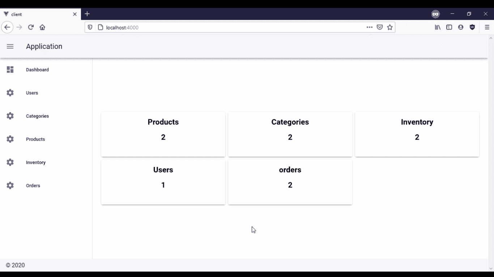

## 先决条件

为了完成本教程，您需要:

## 创建项目根目录

在本节中，我们将创建项目的目录结构。然后，我们将为您的应用程序客户端初始化一个 Node.js 项目。

打开一个终端窗口，从 [GitHub](https://github.com/CSFM93/inventory-management-system) 中克隆包含我为本教程预先创建的后端的存储库:

```
git clone https://github.com/CSFM93/inventory-management-system
```

运行上面的命令后，您将有一个名为`inventory-management-system`的目录。

导航到此目录:

```
cd inventory-management-system
```

文件夹结构应该是这样的:
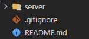

`server`目录包含库存管理应用程序的后端。后端由一个连接到 MongoDB 数据库的 [GraphQL](https://graphql.org/) 服务器组成。为了构建这个 GraphQL 服务器，我使用了 [Node.js](https://nodejs.org/en/) 、 [Docker](https://www.docker.com/) 、 [MongoDB](https://www.mongodb.com/) 、 [graphql-yoga](https://github.com/prisma-labs/graphql-yoga) 、[mongose](https://mongoosejs.com/)和[connect-history-API-fallback](https://github.com/bripkens/connect-history-api-fallback)。

在您的数据库中，您将拥有以下集合:

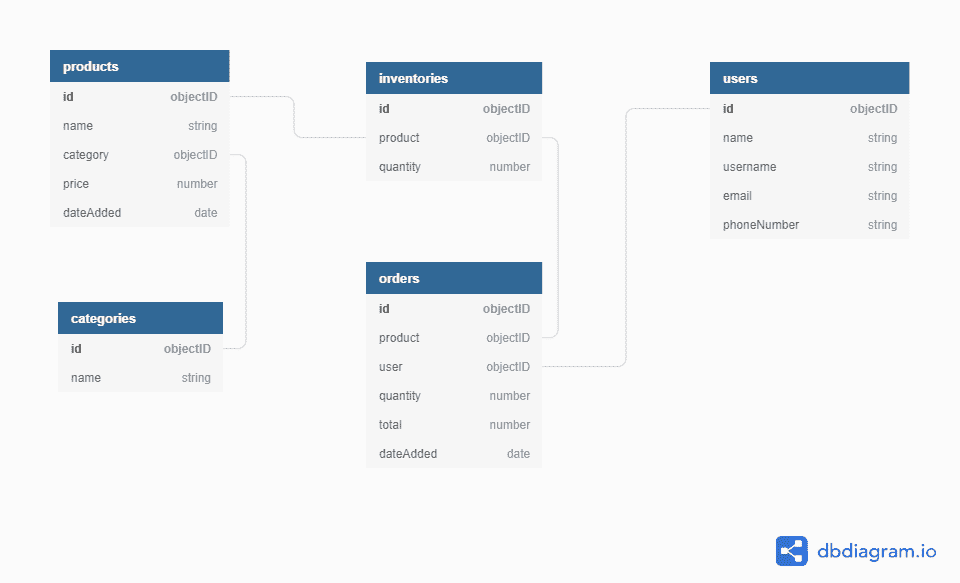

既然您已经知道后端发生了什么，那么是时候构建库存管理应用程序的前端了。

仍然在`inventory-management-system`目录中，创建一个名为`client`的子目录:

```
mkdir client
```

导航到`client`目录:

```
cd client
```

使用`Vue CLI`在当前目录下创建一个新的`Vue`项目:

```
vue create .
```

当要求在当前目录下创建一个新项目时，键入`y`:

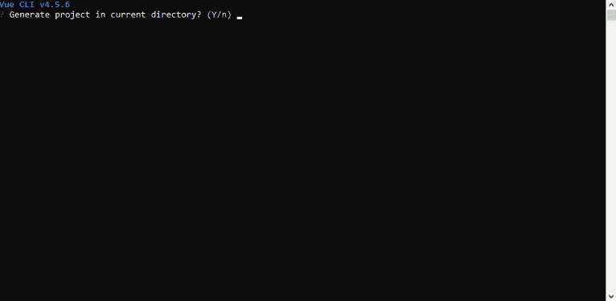

系统会提示您选择一个预设，选择`Manually select features`:

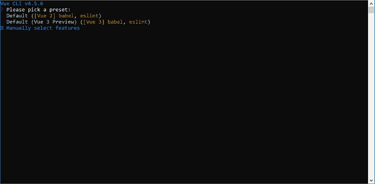

选择`Babel`和`Router`:

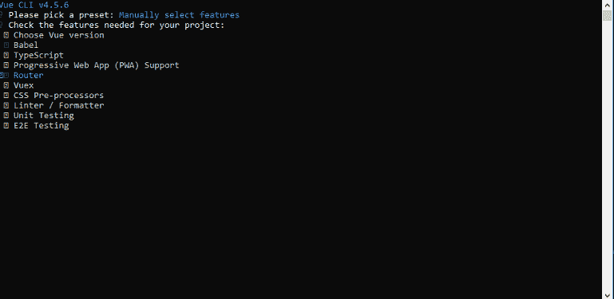

当被问及是否要对路由器类型`y`使用历史模式时:

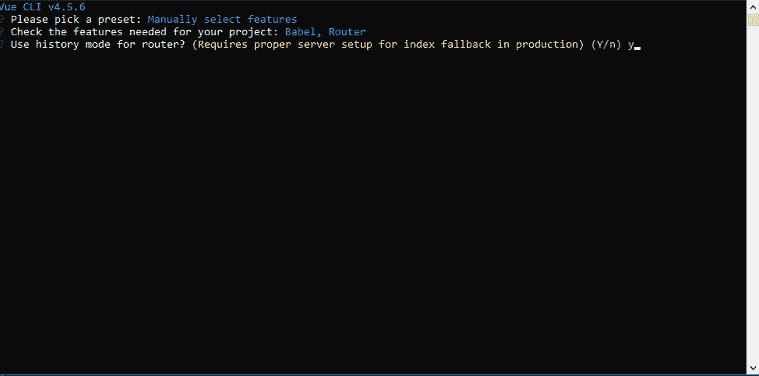

根据 [Vue Router](https://router.vuejs.org/guide/essentials/history-mode.html#example-server-configurations) 网站的说法，Vue Router 的默认模式是哈希模式——它使用 URL 哈希来模拟一个完整的 URL，这样当 URL 改变时就不会重新加载页面。要去除散列，您可以使用路由器的历史模式，该模式利用历史。

当询问你想把配置放在哪里时，选择`In dedicated config files`，当询问你是否想为将来的项目保存这些配置时，键入`y`或`n`。

在`Vue CLI`完成创建项目之后，安装缺少的依赖项。

首先，通过运行以下命令使用`Vue CLI`安装`Vuetify`:

```
vue add vuetify
```

当要求选择预设时，选择`default`。

在这段代码中，你已经安装了 [`Vuetify`](https://vuetifyjs.com/en/getting-started/installation/) 。您将使用该模块创建库存管理系统 UI，而不必太担心 CSS。

最后，使用`npm`安装`node-fetch`:

```
npm install node-fetch --save
```

在这段代码中，您已经安装了`node-fetch`。

*   `node-fetch`是一个允许你向 API 端点或任何 URL 发出 HTTP 请求的模块。您将使用这个模块来使用服务器中的 GraphQL API

在本节中，您为应用程序客户机创建了一个项目目录并初始化了一个 Node.js 项目。在下一节中，您将开始为这个应用程序构建用户界面。

## 创建应用程序布局和路线

在这一步中，您将使用`Vuetify`来创建布局，使用`vue-router`来处理应用程序客户端的路由。

导航到`src`目录:

```
cd src
```

文件夹结构应该是这样的:
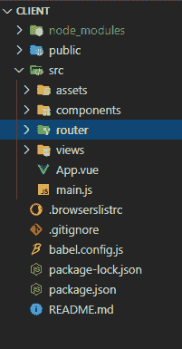

Open your `App.vue` file:

```
nano App.vue
```

拆下`<style>`组件，并用以下内容替换`<template>`组件中的内容:

```
<template>
  <v-app id="app">
    <v-navigation-drawer v-model="drawer" app clipped>
      <v-list dense v-for="route in routes" :key="route.title">
        <v-list-item link @click="navigateTo(route.path)">
          <v-list-item-action>
            <v-icon>{{route.icon}}</v-icon>
          </v-list-item-action>
          <v-list-item-content>
            <v-list-item-title>{{route.title}}</v-list-item-title>
          </v-list-item-content>
        </v-list-item>
      </v-list>
    </v-navigation-drawer>
    <v-app-bar app clipped-left>
      <v-app-bar-nav-icon @click.stop="drawer = !drawer"></v-app-bar-nav-icon>
      <v-toolbar-title>Application</v-toolbar-title>
    </v-app-bar>
    <v-main>
      <v-container class="fill-height" fluid>
        <v-row align="center" justify="center">
          <v-col>
            <router-view :key="$route.fullPath"></router-view>
          </v-col>
        </v-row>
      </v-container>
    </v-main>
    <v-footer app>
      <span>&copy; {{ new Date().getFullYear() }}</span>
    </v-footer>
  </v-app>
</template>
```

在上面的代码块中，您已经在`<-app>`组件中添加了以下组件:`<v-navigation-drawer>`、`<v-app-bar>`、`<v-main>`和`<v-footer>`。

*   `<v-navigation-drawer>`与`<v-app-bar>`组件结合使用，允许您浏览应用程序的路线
*   `<v-main>`组件是显示应用程序视图的地方
*   `<v-footer>`组件是显示应用程序页脚的地方

现在用以下内容替换`<script>`组件中的内容:

```
<script>
export default {
  name: "App",
  data: () => ({
    drawer: null,
    routes: [
      { path: "home", title: "Dashboard", icon: "mdi-view-dashboard" },
      { path: "users", title: "Users", icon: "mdi-cog" },
      { path: "categories", title: "Categories", icon: "mdi-cog" },
      { path: "products", title: "Products", icon: "mdi-cog" },
      { path: "inventory", title: "Inventory", icon: "mdi-cog" },
      { path: "orders", title: "Orders", icon: "mdi-cog" },
    ],
  }),
  created() {
    this.$vuetify.theme.light = true;
  },
}
</script>
```

在上面的代码块中，您已经为`App.vue`创建了`data`字段和`created()`字段。

*   `data`字段包含两个子字段，`drawer`和`routes`。`drawer`将用于控制应用导航抽屉，`routes`包含将用于生成`drawer`中项目的数据
*   `created()`字段将用于将应用程序主题更改为亮，因为默认情况下它被设置为暗

将以下代码添加到`created()`字段:

```
<script>
export default {
 . . .

  methods: {
    navigateTo(route) {
      if (this.$route.name !== route) {
        this.$router.push({ name: route }).catch((error) => {
          console.log(error)
        });
      }
    },
  },
}
</script>
```

在上面的代码块中，您添加了`methods`字段，并且在这个方法中添加了一个名为`navigateTo()`的方法。`navigateTo()`方法接收一个名为`route`的字符串作为参数，该方法使用条件逻辑检查当前路线是否不等于`route`，如果是，则导航到这个接收的`route`。每当您点击`<v-navigation-drawer>`中的一个项目时，这个方法就会被调用。

您的`App.vue`应该是这样的:

```
<template>
  <v-app id="app">
    <v-navigation-drawer v-model="drawer" app clipped>
      <v-list dense v-for="route in routes" :key="route.title">
        <v-list-item link @click="navigateTo(route.path)">
          <v-list-item-action>
            <v-icon>{{route.icon}}</v-icon>
          </v-list-item-action>
          <v-list-item-content>
            <v-list-item-title>{{route.title}}</v-list-item-title>
          </v-list-item-content>
        </v-list-item>
      </v-list>
    </v-navigation-drawer>
    <v-app-bar app clipped-left>
      <v-app-bar-nav-icon @click.stop="drawer = !drawer"></v-app-bar-nav-icon>
      <v-toolbar-title>Application</v-toolbar-title>
    </v-app-bar>
    <v-main>
      <v-container class="fill-height" fluid>
        <v-row align="center" justify="center">
          <v-col>
            <router-view :key="$route.fullPath"></router-view>
          </v-col>
        </v-row>
      </v-container>
    </v-main>
    <v-footer app>
      <span>&copy; {{ new Date().getFullYear() }}</span>
    </v-footer>
  </v-app>
</template>

<script>
export default {
  name: "App",
  data: () => ({
    drawer: null,
    routes: [
      { path: "home", title: "Dashboard", icon: "mdi-view-dashboard" },
      { path: "users", title: "Users", icon: "mdi-cog" },
      { path: "categories", title: "Categories", icon: "mdi-cog" },
      { path: "products", title: "Products", icon: "mdi-cog" },
      { path: "inventory", title: "Inventory", icon: "mdi-cog" },
      { path: "orders", title: "Orders", icon: "mdi-cog" },
    ],
  }),
  created() {
    this.$vuetify.theme.light = true;
  },
  methods: {
    navigateTo(route) {
      if (this.$route.name !== route) {
        this.$router.push({ name: route }).catch((error) => {
          console.log(error)
        });
      }
    },
  },
}
</script>
```

导航到`router`目录:

```
cd router
```

打开`index.js`文件:

```
nano index.js
```

删除导入`Home`视图组件的行:

```
import Home from '../views/Home.vue'
```

用以下内容替换`routes`数组的内容:

```
. . .

const routes = const routes = [
  {
    path: '/',
    name: 'home',
    component: () => import(/* webpackChunkName: "home" */ '../views/Home.vue')
  },
  {
    path: '/users',
    name: 'users',
    component: () => import(/* webpackChunkName: "table" */ '../views/Table.vue')
  },
  {
    path: '/categories',
    name: 'categories',
    component: () => import(/* webpackChunkName: "table" */ '../views/Table.vue')
  },
  {
    path: '/inventory',
    name: 'inventory',
    component: () => import(/* webpackChunkName: "table" */ '../views/Table.vue')
  },
  {
    path: '/products',
    name: 'products',
    component: () => import(/* webpackChunkName: "table" */ '../views/Table.vue')
  },
  {
    path: '/orders',
    name: 'orders',
    component: () => import(/* webpackChunkName: "table" */ '../views/Table.vue')
  }
]
```

在上面的代码块中，您向`routes`数组添加了以下路线:`home`、`users`、`categories`、`products`、`inventory`和`orders`。

*   `home`路径将显示一个卡片网格，每张卡片将显示一个收藏名称和其中的文档数量，并允许您导航到包含收藏数据的路径
*   通过`users`、`categories`、`products`、`inventory`和`orders`路径，您可以分别管理`users`、`categories`、`products`、`inventories`和`orders`集合中的文档

在每一条路线中，您都在延迟加载视图组件。除了将显示在`Home`视图组件中的`home`路线内容外，所有路线内容都将显示在`Table`视图组件中。

您的`index.js`文件应该如下所示:

```
import Vue from 'vue'
import VueRouter from 'vue-router'

Vue.use(VueRouter)

const routes = [
  {
    path: '/',
    name: 'home',
    component: () => import(/* webpackChunkName: "home" */ '../views/Home.vue')
  },
  {
    path: '/users',
    name: 'users',
    component: () => import(/* webpackChunkName: "table" */ '../views/Table.vue')
  },
  {
    path: '/categories',
    name: 'categories',
    component: () => import(/* webpackChunkName: "table" */ '../views/Table.vue')
  },
  {
    path: '/inventory',
    name: 'inventory',
    component: () => import(/* webpackChunkName: "table" */ '../views/Table.vue')
  },
  {
    path: '/products',
    name: 'products',
    component: () => import(/* webpackChunkName: "table" */ '../views/Table.vue')
  },
  {
    path: '/orders',
    name: 'orders',
    component: () => import(/* webpackChunkName: "table" */ '../views/Table.vue')
  }
]

const router = new VueRouter({
  mode: 'history',
  base: process.env.BASE_URL,
  routes
})

export default router
```

在本节中，您已经为您的应用程序客户机创建了布局和路由。在下一节中，您将开始为您的应用程序客户机创建视图。

## 创建主视图

在本节中，您将开始为您的应用程序客户机创建视图。应用程序将有两个名为`Home`和`Table`的视图，它们将分别驻留在`Home.vue`和`Table.vue`文件中。在本节中，您将创建`Home`视图。

导航到`views`目录:

```
cd ../views
```

打开名为`Home.vue`的文件:

```
nano Home.vue
```

用以下内容替换`<template>`组件中的内容:

```
<template>
  <v-container fluid>
    <v-row dense>
      <v-col v-for="card in cards" :key="card.title" :cols="card.flex">
        <v-hover v-slot:default="{ hover }">
          <v-card :elevation="hover ? 16 : 2" :style="hover? 'cursor: pointer': '' ">
            <v-card-text @click="navigateTo(card.title.toLowerCase())">
              <h2 style="color:black" class="text-center">{{card.title}}</h2>
              <h2
                style="color:black; margin-top:20px; height: 50px"
                class="text-center"
              >{{card.quantity}}</h2>
            </v-card-text>
          </v-card>
        </v-hover>
      </v-col>
    </v-row>
  </v-container>
</template>
```

在上面的代码块中，您已经在`<template>`组件中添加了一个`<v-container`组件。您将使用该组件创建一个包含五张卡片的网格。每张卡片将显示一个集合名称和该集合拥有的文档数。您还向每张卡添加了一个点击监听器，以便在您点击它时导航到特定的路线。

* * *

### 更多来自 LogRocket 的精彩文章:

* * *

用以下内容替换`<script>`组件中的内容:

```
<script>
import actions from "../components/actions"

export default {
  name: "Home",
  data: () => ({
    cards: [],
  }),
  created() {
    this.initialize();
  },
}
</script>
```

在上面的代码块中，您从 components 目录中的`actions.js`文件导入一个名为`actions`的对象。然后您添加了`data`和`created()`字段。在`data`字段中，您添加了一个名为`cards`的子字段，它保存一个空数组。在`created()`字段中，您调用了一个名为`initialize()`的方法，稍后您将创建这个方法。

请注意，您还没有创建`actions.js`，这个文件将负责使用 GraphQL API，它将允许您查询和修改 MongoDB 实例中的数据。

在`created()`字段下添加以下代码:

```
<script>
. . .
export default {
  . . .

  methods: {
    async initialize() {
      let categories = await actions.getCategories();
      let users = await actions.getUsers();
      let products = await actions.getProducts();
      let inventoryItems = await actions.getInventoryItems();
      let orders = await actions.getOrders();
      this.cards = [
        { title: "Products", quantity: products.length, flex: 4 },
        { title: "Categories", quantity: categories.length, flex: 4 },
        { title: "Inventory", quantity: inventoryItems.length, flex: 4 },
        { title: "Users", quantity: users.length, flex: 4 },
        { title: "orders", quantity: orders.length, flex: 4 },
      ]
    },
  },
}
</script>
```

在上面的代码块中，您添加了`methods`字段，并且在这个字段中，您创建了一个名为`initialize()`的方法。在`initialize()`中，使用`actions`对象提供的方法从所有集合中检索数据，然后将这些数据添加到`cards`数组中。

在`initialize()`方法下添加以下代码:

```
<script>
. . .

export default {
  . . .

  methods: {
  . . .

    navigateTo(route) {
      if (this.$route.name !== route) {
        this.$router.push({ name: route }).catch((error) => {
          console.log(error);
        })
      }
    },
  },
}
</script>
```

在上面的代码块中，您已经在`methods`字段中添加了一个名为`navigateTo()`的方法。`navigateTo()`方法接收一个名为`route`的字符串作为参数，该方法使用条件逻辑检查当前路线是否不等于`route`，如果是，则导航到这个接收的`route`。每当您在此视图中单击一张卡片时，都会调用此方法。

您的`Home.vue`文件应该如下所示:

```
<template>
  <v-container fluid>
    <v-row dense>
      <v-col v-for="card in cards" :key="card.title" :cols="card.flex">
        <v-hover v-slot:default="{ hover }">
          <v-card :elevation="hover ? 16 : 2" :style="hover? 'cursor: pointer': '' ">
            <v-card-text @click="navigateTo(card.title.toLowerCase())">
              <h2 style="color:black" class="text-center">{{card.title}}</h2>
              <h2
                style="color:black; margin-top:20px; height: 50px"
                class="text-center"
              >{{card.quantity}}</h2>
            </v-card-text>
          </v-card>
        </v-hover>
      </v-col>
    </v-row>
  </v-container>
</template>

<script>
import actions from "../components/actions"

export default {
  name: "Home",
  data: () => ({
    cards: [],
  }),
  created() {
    this.initialize();
  },
  methods: {
    async initialize() {
      let categories = await actions.getCategories();
      let users = await actions.getUsers();
      let products = await actions.getProducts();
      let inventoryItems = await actions.getInventoryItems();
      let orders = await actions.getOrders();
      this.cards = [
        { title: "Products", quantity: products.length, flex: 4 },
        { title: "Categories", quantity: categories.length, flex: 4 },
        { title: "Inventory", quantity: inventoryItems.length, flex: 4 },
        { title: "Users", quantity: users.length, flex: 4 },
        { title: "orders", quantity: orders.length, flex: 4 },
      ]
    },
    navigateTo(route) {
      if (this.$route.name !== route) {
        this.$router.push({ name: route }).catch((error) => {
          console.log(error);
        })
      }
    },
  },
}
</script>
```

在本节中，您已经为您的应用程序客户机创建了`Home`视图。在下一部分中，您将创建`Table`视图。

## 创建表格视图

在本节中，您将创建表格视图，该视图将显示`users`、`products`、`categories`、`inventories`和`orders`路线的数据。您将使用由`Vuetify`提供的`v-data-table`组件来显示数据。

仍然在`views`目录中，创建一个名为`Table.vue`的文件:

```
nano Table.vue
```

在`Table.vue`文件中添加以下代码:

```
<template>
  <v-data-table :headers="headers" :items="rows" sort-by="name" class="elevation-2">
    <template v-slot:top>
      <v-toolbar flat color="white">
        <v-toolbar-title>{{$route.name.toUpperCase()}}</v-toolbar-title>
        <v-divider class="mx-4" inset vertical></v-divider>
        <v-spacer></v-spacer>
        <v-dialog v-model="dialog" max-width="500px">
          <template v-slot:activator="{ on, attrs }">
            <v-btn color="primary" dark class="mb-2" v-bind="attrs" v-on="on">New Item</v-btn>
          </template>
          <v-card>
            <v-card-title>
              <span class="headline">{{ formTitle }}</span>
            </v-card-title>
            <v-card-text>
              <v-container>
                <v-row v-for="(value, key) in editedItem " v-bind:key="key">
                  <v-col
                    cols="12" sm="6" md="4"
                    v-if=" key !== 'id' && key !=='category' && key !='dateAdded' && key !=='product' && key !=='user' ">
                    <v-text-field
                      :type =" key === 'quantity' || key === 'price' ? 'Number' : 'text' "
                      v-model="editedItem[key]"
                      :label="key"
                    ></v-text-field>
                  </v-col>
                </v-row>
                <v-row v-if="editedIndex === -1 && $route.name === 'inventory' ">
                  <v-col cols="12" sm="6" md="4">
                    <v-select
                      v-model="editedItem.product"
                      :items="options.products"
                      label="products"
                      item-text="name"
                      item-value="id"
                    ></v-select>
                  </v-col>
                </v-row>
                <v-row v-else-if="$route.name === 'products'">
                  <v-col cols="12" sm="6" md="4">
                    <v-select
                      v-model="editedItem.category"
                      :items="options.categories"
                      label="categories"
                      item-text="name"
                      item-value="id"
                    ></v-select>
                  </v-col>
                </v-row>
                <v-row v-else-if="editedIndex === -1 && $route.name === 'orders'">
                  <v-col cols="12" sm="6" md="4">
                    <v-select
                      v-model="editedItem.product"
                      :items="options.inventoryItems"
                      label="products"
                      item-text="product.name"
                      item-value="product.id"
                    ></v-select>
                  </v-col>
                  <v-col cols="12" sm="6" md="4">
                    <v-select
                      v-model="editedItem.user"
                      :items="options.users"
                      label="users"
                      item-text="username"
                      item-value="id"
                    ></v-select>
                  </v-col>
                </v-row>
              </v-container>
            </v-card-text>
            <v-card-actions>
              <v-spacer></v-spacer>
              <v-btn color="blue darken-1" text @click="close">Cancel</v-btn>
              <v-btn color="blue darken-1" text @click="save">Save</v-btn>
            </v-card-actions>
          </v-card>
        </v-dialog>
      </v-toolbar>
    </template>
    <template v-slot:[`item.actions`]="{ item }">
      <v-icon small class="mr-2" @click="editItem(item)">mdi-pencil</v-icon>
      <v-icon small @click="deleteItem(item)">mdi-delete</v-icon>
    </template>
    <template v-slot:no-data>
      <v-btn color="primary" @click="initialize">Reset</v-btn>
    </template>
  </v-data-table>
</template>
```

在上面的代码块中，您创建了一个`<template>`组件，并在其中添加了一个`<v-data-table>`。在`<v-data-table>`组件中，您已经添加了管理集合中的数据所需的组件。上面的大部分代码都是由`Vuetify`提供的，你只需要让`<v-data-table>`能够处理来自多个集合的数据，而不是一个。

在`<template>`下面添加以下代码:

```
<script>
import actions from "../components/actions";

export default {
  name: "Table",
  data: () => ({
    dialog: false,
    headers: [],
    options: {},
    rows: [],
    editedIndex: -1,
    editedItem: {},
    defaultItem: {},
  }),
  computed: {
    formTitle() {
      return this.editedIndex === -1 ? "New Item" : "Edit Item";
    },
  },
}
</script>
```

在上面的代码块中，首先，您创建了`<script>`组件，在其中，您从`actions.js`导入了一个名为`actions`的对象。在这个组件中，您还创建了一个对象，该对象包含创建一个包含来自 MongoDB 实例中的集合的数据的`<v-data-table>`所需的信息。在这个对象中，您添加了以下字段:`name`、`data`、`computed`。

*   `name`字段是您设置组件名称的地方
*   `data`字段是保存创建和管理`<v-data-table>`所需信息的地方。您在`data`字段中添加了以下子字段:`dialog`、`headers`、`options`、`rows`、`editedIndex`、`editedItem`、`defaultItem`:
    *   `dialog`字段是用来显示或不显示`<v-dialog>`组件的
    *   `headers`字段是为`<v-data-table>`设置标题的地方
    *   `options`字段是存储`<v-select>`组件中所需的键值对对象的数组的地方
    *   `rows`字段是存储从 MongoDB 实例的集合中检索到的文档的地方
    *   在`editedIndex`字段中，您可以控制是“添加新项目”还是“编辑项目”操作
    *   `editedItem`字段是存储编辑项目时将使用的模型对象的地方
    *   `defaultItem`字段是您存储模型对象的地方，当添加一个新的项目时将使用该对象
    *   `computed`字段是存储`<template>`组件所需的任何复杂逻辑的地方，在该字段中，您添加了一个名为`formTitle`的方法，该方法将用于设置`<v-dialog>`组件标题中的值

在您的`computed`字段下添加以下代码:

```
<script>
. . .

export default {
  . . .

  created() {
    this.initialize()
  },
  methods: {
    async initialize() {
      switch (this.$route.name) {
        case "users":
          break
        case "categories":
          break
        case "products":
          break
        case "inventory":
          break
        case "orders":
          break
      }
    }
  }
}
</script>
```

在上面的代码块中，您在`computed`字段下面添加了以下字段:`created()`和`methods`。

*   `created()`字段是一个在创建视图时运行的方法，在这个方法中您调用了一个名为`initialize()`的方法
*   `methods`字段是一个属性，用于存储当前视图中需要的所有方法。在这个属性中，您添加了一个名为`initialize()`的方法

在`initialize()`方法中，您可以从 GraphQL 服务器中检索信息，并将其存储在`data`属性的字段中。该方法由一个 switch 语句组成，包含以下情况:`users`、`categories`、`products`、`inventory`和`orders`。也就是说，当您访问一条路线时，其中一个案例将被触发，创建这条路线的`<v-data-table>`所需的信息将被检索。

用以下代码替换`case "users":`的内容:

```
. . .

async initialize() {
  switch (this.$route.name) {
    case "users":
      this.headers = [
        { text: "ID", value: "id" },
        { text: "Name", value: "name" },
        { text: "username", value: "username" },
        { text: "Email", value: "email" },
        { text: "Phone number", value: "phoneNumber" },
        { text: "Actions", value: "actions", sortable: false },
      ]

      this.editedItem = { name: "", username: "", email: "", phoneNumber: ""}
      this.defaultItem = { name: "", username: "", email: "", phoneNumber: ""}

      const users = await actions.getUsers()
      this.rows = users
      break

    . . .
}
```

您上面添加的代码会在您访问`users`路线时触发。这段代码负责在`data`属性的`headers`、`editedItem`、`defaultItem`和`rows`字段中添加所需的数据。通过调用由`actions`对象提供的`getUsers()`方法来检索分配给`rows`对象的数据。

您将对剩余的`cases`执行与上述代码块中相同的操作。

替换剩余案例的内容后，您的`initialize()`将如下所示:

```
. . .  

async initialize() {
  switch (this.$route.name) {
    case "users":
      this.headers = [
        { text: "ID", value: "id" },
        { text: "Name", value: "name" },
        { text: "username", value: "username" },
        { text: "Email", value: "email" },
        { text: "Phone number", value: "phoneNumber" },
        { text: "Actions", value: "actions", sortable: false },
      ];
      this.editedItem = { name: "", username: "", email: "", phoneNumber: ""}
      this.defaultItem = { name: "", username: "", email: "", phoneNumber: ""}
      const users = await actions.getUsers()
      this.rows = users
      break
    case "categories":
      this.headers = [
        { text: "ID", value: "id" },
        { text: "Name", value: "name" },
        { text: "Actions", value: "actions", sortable: false },
      ]
      this.editedItem = { name: "" }
      this.defaultItem = { name: "" }
      const categories = await actions.getCategories()
      this.rows = categories
      break
    case "products":
      this.headers = [
        { text: "ID", value: "id" },
        { text: "Name", value: "name" },
        { text: "Category", value: "category" },
        { text: "Price", value: "price" },
        { text: "Date added", value: "dateAdded" },
        { text: "Actions", value: "actions", sortable: false },
      ]
      this.editedItem = { name: "", price: 0, category: ""}
      this.defaultItem = { name: "", price: 0, category: ""}
      this.options.categories = await actions.getCategories()
      const products = await actions.getProducts()
      for (let i = 0; i < products.length; i++) {
        products[i].category = products[i].category.name;
        products[i].dateAdded = new Date(products[i].dateAdded)
      }
      this.rows = products;
      break
    case "inventory":
      this.headers = [
        { text: "ID", value: "id" },
        { text: "Product", value: "product" },
        { text: "Quantity", value: "quantity" },
        { text: "Actions", value: "actions", sortable: false },
      ]
      this.editedItem = { quantity: 0 }
      this.defaultItem = { product: "", quantity: 0 }
      this.options.products = await actions.getProducts()
      const inventoryItems = await actions.getInventoryItems()
      for (let i = 0; i < inventoryItems.length; i++) {
        inventoryItems[i].product = inventoryItems[i].product.name
      }
      this.rows = inventoryItems
      break
    case "orders":
      this.headers = [
        { text: "ID", value: "id" },
        { text: "Product", value: "product" },
        { text: "Quantity", value: "quantity" },
        { text: "User", value: "user" },
        { text: "Total", value: "total" },
        { text: "Date added", value: "dateAdded" },
        { text: "Actions", value: "actions", sortable: false },
      ]
      this.editedItem = { quantity: 0 }
      this.defaultItem = { product: "", user: "", quantity: 0 }
      this.options.inventoryItems = await actions.getInventoryItems();
      this.options.users = await actions.getUsers()
      const orders = await actions.getOrders()
      for (let i = 0; i < orders.length; i++) {
        orders[i].product = orders[i].product.name
        orders[i].user = orders[i].user.username
        orders[i].dateAdded = new Date(orders[i].dateAdded)
      }
      this.rows = orders
      break;
  }
},
```

在`initialize()`方法下添加以下代码:

```
. . .

editItem(item) {
  this.editedIndex = this.rows.indexOf(item);
  this.editedItem = Object.assign({}, item);
  this.dialog = true;
},

close() {
  this.dialog = false;
  this.$nextTick(() => {
    this.editedItem = Object.assign({}, this.defaultItem);
    this.editedIndex = -1
  });
},
}  

. . .
```

在上面的代码块中，您在`methods`属性、`editItem()`和`close()`中添加了以下方法:

*   `editItem()`字段是一个方法，它接收名为`item`的对象作为参数，该对象是`rows`数组中的对象之一，将`editedIndex`更改为`rows`数组中`item`的索引，将`item`赋给`editedItem`对象，然后通过将`dialog`的值设置为`true`来打开`<v-dialog>`组件
*   `close()`字段是一种方法，通过将`dialog`值设置为`false`来关闭`<v-dialog>`组件，将`defaultItem`分配给`editedItem`，然后将`editedIndex`值更改为`-1`

将下面的代码添加到您的`close()`方法中:

```
. . .

async deleteItem(item) {
  const index = this.rows.indexOf(item)
  const message = "Are you sure you want to delete this item?"

  switch (this.$route.name) {
    case "users":
      confirm(message) && (await actions.deleteUser(item.id)) &&
      this.rows.splice(index,1)
      break
    case "categories":
      confirm(message) && (await actions.deleteCategory(item.id)) &&
      this.rows.splice(index, 1)
      break
    case "products":
      confirm(message) && (await actions.deleteProduct(item.id)) &&
      this.rows.splice(index, 1)
      break
    case "inventory":
      confirm(message) && (await actions.deleteInventoryItem(item.id)) &&
      this.rows.splice(index, 1)
      break
    case "orders":
      confirm(message) && (await actions.deleteOrder(item.id)) &&
      this.rows.splice(index, 1)
      break
  }
}

. . .
```

在上面的代码块中，您已经向`methods`属性添加了一个名为`deleteItem()`的方法。`deleteItem()`接收一个名为`item`的对象作为参数，该对象是`rows`数组中的对象之一，在`rows`数组中找到这个`item`的索引，然后将其存储在一个名为`index`的变量中。找到`index`后，您创建了一个名为`message`的变量，并在其中存储了一个字符串，询问您是否要删除这个`item`。最后，创建一个 switch 语句，当您想要删除`users`、`categories`、`products`、`inventory`或`orders`路线中的`item`时，该语句就会运行。

在您的`deleteItem()`方法下添加以下代码:

```
. . .  

async save() {
      if (this.editedIndex > -1) {
        switch (this.$route.name) {
          case "users":
            break
          case "categories":
            break
          case "products":
            break
          case "inventory":
            break
          case "orders":
            break
        }
      } else {
        switch (this.$route.name) {
          case "users":
            break
          case "categories":
            break
          case "products":
            break
          case "inventory":
            break
          case "orders":
            break
        }
      }
      this.close()
    }
```

在上面的代码块中，您已经向`methods`属性添加了一个名为`save()`的方法。您已经使用条件逻辑来处理新项目和已编辑项目的保存操作。如果`editedIndex`大于`-1`，这意味着你正试图保存一个你编辑过的项目，然而，如果不是这样，这意味着你正试图保存一个新项目。在每个条件中，您创建了一个 switch 语句，以便能够在您处于`users`、`categories`、`products`、`inventory`或`orders`路线时保存数据。运行其中一个条件后，您调用了`close()`方法来关闭`<v-dialog>`组件。

在每个`case "users":`中添加以下代码:

```
async save() {  
  if (this.editedIndex > -1) {
    switch (this.$route.name) {
      case "users":
          await actions.updateUser(this.editedItem).then((user) => {
          Object.assign(this.rows[this.editedIndex], user);
        })
        break

      . . .
    }
  } else {
    switch (this.$route.name) {
      case "users":
          await actions.addUser(this.editedItem).then((user) => {
          this.rows.push(user)
        })
        break

      . . .
    }
  }
  this.close()
}
```

在上面的代码块中，您已经添加了两个`case "users":`的逻辑。在第一个`case "users":`中，您使用由`actions`对象提供的`updateUser()`方法来更新您的`users`集合中现有文档的值，然后您获取响应中发送的对象，并将其分配给`rows`数组中索引等于`editedIndex`的对象。在第二个`case "users":`中，您使用由`actions`对象提供的`addUser()`方法向`users`集合添加一个新文档，然后您在响应中获取该对象并将其添加到`rows`数组。

您将对剩余的`cases`执行与上述代码块中相同的操作。

替换了剩余案例的内容后，您的`save()`方法将如下所示:

```
async save() {
  if (this.editedIndex > -1) {
    switch (this.$route.name) {
      case "users":
        await actions.updateUser(this.editedItem).then((user) => {
          Object.assign(this.rows[this.editedIndex], user);
        })
        break
      case "categories":
        await actions.updateCategory(this.editedItem).then((category) => {
          Object.assign(this.rows[this.editedIndex], category);
        })
        break
      case "products":
        this.editedItem.price = parseFloat(this.editedItem.price);
        for (let i = 0; i < this.options.categories.length; i++) {
          if (this.options.categories[i].name === this.editedItem.category) {
            this.editedItem.category = this.options.categories[i].id
          }
        }
        await actions.updateProduct(this.editedItem).then((product) => {
          product.category = product.category.name;
          Object.assign(this.rows[this.editedIndex], product)
        })
        break
      case "inventory":
        this.editedItem.quantity = parseInt(this.editedItem.quantity)
        await actions
          .updateInventoryItem(this.editedItem)
          .then((inventoryItem) => {
            inventoryItem.product = inventoryItem.product.name
            Object.assign(this.rows[this.editedIndex], inventoryItem)
          })
        break
      case "orders":
        this.editedItem.quantity = parseInt(this.editedItem.quantity);
        console.log("edited", this.editedItem);
        await actions.updateOrder(this.editedItem).then((order) => {
          order.product = order.product.name
          order.user = order.user.username
          Object.assign(this.rows[this.editedIndex], order)
        })
        break
    }
  } else {
    switch (this.$route.name) {
      case "users":
        await actions.addUser(this.editedItem).then((user) => {
          this.rows.push(user)
        })
        break
      case "categories":
        await actions.addCategory(this.editedItem).then((category) => {
          console.log("category", category)
          this.rows.push(category)
        })
        break
      case "products":
        this.editedItem.price = parseFloat(this.editedItem.price);
        await actions.addProduct(this.editedItem).then((product) => {
          product.category = product.category.name
          product.dateAdded = new Date(product.dateAdded)
          this.rows.push(product)
        })
        break
      case "inventory":
        this.editedItem.quantity = parseInt(this.editedItem.quantity)
        await actions
          .addInventoryItem(this.editedItem)
          .then((inventoryItem) => {
            inventoryItem.product = inventoryItem.product.name
            this.rows.push(inventoryItem)
          })
        break
      case "orders":
        this.editedItem.quantity = parseInt(this.editedItem.quantity);
        console.log("model", this.editedItem);
        let order = await actions
          .addOrder(this.editedItem)
          .then((order) => {
            order.product = order.product.name
            order.user = order.user.username
            order.dateAdded = new Date(order.dateAdded)
            this.rows.push(order)
          })
        break
    }
  }
  this.close()
}
```

您的`Table.vue`文件应该如下所示:

```
<template>  
  <v-data-table :headers="headers" :items="rows" sort-by="name" class="elevation-2">
    <template v-slot:top>
      <v-toolbar flat color="white">
        <v-toolbar-title>{{$route.name.toUpperCase()}}</v-toolbar-title>
        <v-divider class="mx-4" inset vertical></v-divider>
        <v-spacer></v-spacer>
        <v-dialog v-model="dialog" max-width="500px">
          <template v-slot:activator="{ on, attrs }">
            <v-btn color="primary" dark class="mb-2" v-bind="attrs" v-on="on">New Item</v-btn>
          </template>
          <v-card>
            <v-card-title>
              <span class="headline">{{ formTitle }}</span>
            </v-card-title>
            <v-card-text>
              <v-container>
                <v-row v-for="(value, key) in editedItem " v-bind:key="key">
                  <v-col
                    cols="12" sm="6" md="4"
                    v-if=" key !== 'id' && key !=='category' && key !='dateAdded' && key !=='product' && key !=='user' ">
                    <v-text-field
                      :type =" key === 'quantity' || key === 'price' ? 'Number' : 'text' "
                      v-model="editedItem[key]"
                      :label="key"
                    ></v-text-field>
                  </v-col>
                </v-row>
                <v-row v-if="editedIndex === -1 && $route.name === 'inventory' ">
                  <v-col cols="12" sm="6" md="4">
                    <v-select
                      v-model="editedItem.product"
                      :items="options.products"
                      label="products"
                      item-text="name"
                      item-value="id"
                    ></v-select>
                  </v-col>
                </v-row>

                <v-row v-else-if="$route.name === 'products'">
                  <v-col cols="12" sm="6" md="4">
                    <v-select
                      v-model="editedItem.category"
                      :items="options.categories"
                      label="categories"
                      item-text="name"
                      item-value="id"
                    ></v-select>
                  </v-col>
                </v-row>

                <v-row v-else-if="editedIndex === -1 && $route.name === 'orders'">
                  <v-col cols="12" sm="6" md="4">
                    <v-select
                      v-model="editedItem.product"
                      :items="options.inventoryItems"
                      label="products"
                      item-text="product.name"
                      item-value="product.id"
                    ></v-select>
                  </v-col>
                  <v-col cols="12" sm="6" md="4">
                    <v-select
                      v-model="editedItem.user"
                      :items="options.users"
                      label="users"
                      item-text="username"
                      item-value="id"
                    ></v-select>
                  </v-col>
                </v-row>
              </v-container>
            </v-card-text>

            <v-card-actions>
              <v-spacer></v-spacer>
              <v-btn color="blue darken-1" text @click="close">Cancel</v-btn>
              <v-btn color="blue darken-1" text @click="save">Save</v-btn>
            </v-card-actions>
          </v-card>
        </v-dialog>
      </v-toolbar>
    </template>
    <template v-slot:[`item.actions`]="{ item }">
      <v-icon small class="mr-2" @click="editItem(item)">mdi-pencil</v-icon>
      <v-icon small @click="deleteItem(item)">mdi-delete</v-icon>
    </template>
    <template v-slot:no-data>
      <v-btn color="primary" @click="initialize">Reset</v-btn>
    </template>
  </v-data-table>
</template>

<script>
import actions from "../components/actions";

export default {
  name: "Table",
  data: () => ({
    dialog: false,
    headers: [],
    options: [],
    rows: [],
    editedIndex: -1,
    editedItem: {},
    defaultItem: {},
  }),
  computed: {
    formTitle() {
      return this.editedIndex === -1 ? "New Item" : "Edit Item";
    },
  },
  created() {
    this.initialize()
  },
  methods: {
    async initialize() {
      switch (this.$route.name) {
        case "users":
          this.headers = [
            { text: "ID", value: "id" },
            { text: "Name", value: "name" },
            { text: "username", value: "username" },
            { text: "Email", value: "email" },
            { text: "Phone number", value: "phoneNumber" },
            { text: "Actions", value: "actions", sortable: false },
          ];

          this.editedItem = { name: "", username: "", email: "", phoneNumber: ""}
          this.defaultItem = { name: "", username: "", email: "", phoneNumber: ""}

          const users = await actions.getUsers()
          this.rows = users
          break

        case "categories":
          this.headers = [
            { text: "ID", value: "id" },
            { text: "Name", value: "name" },
            { text: "Actions", value: "actions", sortable: false },
          ]

          this.editedItem = { name: "" }
          this.defaultItem = { name: "" }

          const categories = await actions.getCategories()
          this.rows = categories

          break
        case "products":
          this.headers = [
            { text: "ID", value: "id" },
            { text: "Name", value: "name" },
            { text: "Category", value: "category" },
            { text: "Price", value: "price" },
            { text: "Date added", value: "dateAdded" },
            { text: "Actions", value: "actions", sortable: false },
          ]

          this.editedItem = { name: "", price: 0, category: ""}
          this.defaultItem = { name: "", price: 0, category: ""}

          this.options.categories = await actions.getCategories()
          const products = await actions.getProducts()
          for (let i = 0; i < products.length; i++) {
            products[i].category = products[i].category.name;
            products[i].dateAdded = new Date(products[i].dateAdded)
          }
          this.rows = products;

          break
        case "inventory":
          this.headers = [
            { text: "ID", value: "id" },
            { text: "Product", value: "product" },
            { text: "Quantity", value: "quantity" },
            { text: "Actions", value: "actions", sortable: false },
          ]

          this.editedItem = { quantity: 0 }
          this.defaultItem = { product: "", quantity: 0 }

          this.options.products = await actions.getProducts()
          const inventoryItems = await actions.getInventoryItems()

          for (let i = 0; i < inventoryItems.length; i++) {
            inventoryItems[i].product = inventoryItems[i].product.name
          }
          this.rows = inventoryItems
          break

        case "orders":
          this.headers = [
            { text: "ID", value: "id" },
            { text: "Product", value: "product" },
            { text: "Quantity", value: "quantity" },
            { text: "User", value: "user" },
            { text: "Total", value: "total" },
            { text: "Date added", value: "dateAdded" },
            { text: "Actions", value: "actions", sortable: false },
          ]

          this.editedItem = { quantity: 0 }
          this.defaultItem = { product: "", user: "", quantity: 0 }

          this.options.inventoryItems = await actions.getInventoryItems();
          this.options.users = await actions.getUsers()
          const orders = await actions.getOrders()

          for (let i = 0; i < orders.length; i++) {
            orders[i].product = orders[i].product.name
            orders[i].user = orders[i].user.username
            orders[i].dateAdded = new Date(orders[i].dateAdded)
          }
          this.rows = orders

          break;
      }
    },

    editItem(item) {
      console.log(item)
      this.editedIndex = this.rows.indexOf(item);
      this.editedItem = Object.assign({}, item);
      this.dialog = true;
    },

    close() {
      this.dialog = false;
      this.$nextTick(() => {
        this.editedItem = Object.assign({}, this.defaultItem);
        this.editedIndex = -1
      });
    },

    async deleteItem(item) {
      const index = this.rows.indexOf(item)
      const message = "Are you sure you want to delete this item?"

      switch (this.$route.name) {
        case "users":
          confirm(message) && (await actions.deleteUser(item.id)) &&
          this.rows.splice(index, 1)
          break
        case "categories":
          confirm(message) && (await actions.deleteCategory(item.id)) &&
          this.rows.splice(index, 1)
          break
        case "products":
          confirm(message) && (await actions.deleteProduct(item.id)) &&
          this.rows.splice(index, 1)
          break
        case "inventory":
          confirm(message) && (await actions.deleteInventoryItem(item.id)) &&
          this.rows.splice(index, 1)
          break
        case "orders":
          confirm(message) && (await actions.deleteOrder(item.id)) &&
          this.rows.splice(index, 1)
          break
      }
    },

    async save() {
      if (this.editedIndex > -1) {
        switch (this.$route.name) {
          case "users":
            await actions.updateUser(this.editedItem).then((user) => {
              Object.assign(this.rows[this.editedIndex], user);
            })
            break

          case "categories":
            await actions.updateCategory(this.editedItem).then((category) => {
              Object.assign(this.rows[this.editedIndex], category);
            })
            break

          case "products":
            this.editedItem.price = parseFloat(this.editedItem.price);
            for (let i = 0; i < this.options.categories.length; i++) {
              if (this.options.categories[i].name === this.editedItem.category) {
                this.editedItem.category = this.options.categories[i].id
              }
            }
            await actions.updateProduct(this.editedItem).then((product) => {
              product.category = product.category.name;
              Object.assign(this.rows[this.editedIndex], product)
            })
            break

          case "inventory":
            this.editedItem.quantity = parseInt(this.editedItem.quantity)
            await actions
              .updateInventoryItem(this.editedItem)
              .then((inventoryItem) => {
                inventoryItem.product = inventoryItem.product.name
                Object.assign(this.rows[this.editedIndex], inventoryItem)
              })
            break

          case "orders":
            this.editedItem.quantity = parseInt(this.editedItem.quantity);
            console.log("edited", this.editedItem);

            await actions.updateOrder(this.editedItem).then((order) => {
              order.product = order.product.name
              order.user = order.user.username
              Object.assign(this.rows[this.editedIndex], order)
            })
            break
        }
      } else {
        switch (this.$route.name) {
          case "users":
            await actions.addUser(this.editedItem).then((user) => {
              this.rows.push(user)
            })
            break

          case "categories":
            await actions.addCategory(this.editedItem).then((category) => {
              console.log("category", category)
              this.rows.push(category)
            })
            break

          case "products":
            this.editedItem.price = parseFloat(this.editedItem.price);
            await actions.addProduct(this.editedItem).then((product) => {
              product.category = product.category.name
              product.dateAdded = new Date(product.dateAdded)
              this.rows.push(product)
            })
            break

          case "inventory":
            this.editedItem.quantity = parseInt(this.editedItem.quantity)
            await actions
              .addInventoryItem(this.editedItem)
              .then((inventoryItem) => {
                inventoryItem.product = inventoryItem.product.name
                this.rows.push(inventoryItem)
              })
            break

          case "orders":
            this.editedItem.quantity = parseInt(this.editedItem.quantity);
            console.log("model", this.editedItem);
            let order = await actions
              .addOrder(this.editedItem)
              .then((order) => {
                order.product = order.product.name
                order.user = order.user.username
                order.dateAdded = new Date(order.dateAdded)
                this.rows.push(order)
              })
            break
        }
      }
      this.close()
    },
  },
}
</script>
```

在本节中，您已经创建了`Table`视图。在下一节中，您将创建一个名为`actions.js`的文件，在这个文件中，您将创建`actions`对象以及您在这个视图和`Home`视图中使用的方法。

## 创建 actions.js 文件

在本节中，您将创建一个名为`actions.js`的文件。该文件将包含与 GraphQL 服务器交互所需的方法。这些方法将驻留在一个名为`actions`的对象中。

导航到您的`components`目录:

```
cd ../components
```

创建一个名为`actions.js`的文件:

```
nano actions.js
```

将以下代码添加到您的`actions.js`文件中:

```
import fetch from "node-fetch"  
const actions = {}

actions.sendOperation = async (operation) => {
  const fetchData = await fetch("http://localhost:4000/graphql", {
      method: 'POST',
      headers: { 'Content-Type': 'application/json' },
      body: JSON.stringify({
          query: operation,
      }),
  })

  const { data, error } = await fetchData.json();
  return data
}
```

在上面的代码块中，您已经导入了`node-fetch`模块并为其分配了一个名为`fetch`的变量，创建了一个名为`actions`的对象，并为该对象添加了一个名为`sendOperation()`的方法。`sendOperation()`方法接收一个包含名为`operation`的查询或变异操作的字符串作为参数。它使用`node-fetch`模块将`operation`发送到 GraphQL 服务器，将响应数据和错误分别存储在变量`data`、`error`中，然后返回`data`。该方法将用于向 GraphQL 服务器发送所有查询和变化。

在`actions.js`文件的底部添加以下代码:

```
actions.getUsers = async () => {
  let query = `query{  
  getUsers{
      id
      name
      username
      email
      phoneNumber
  }
  }    
`
  const data = await actions.sendOperation(query)
  return data.getUsers
}
```

在上面的代码块中，您已经向`actions`对象添加了一个名为`getUsers()`的方法。在这个方法中，您创建了检索`users`集合中所有文档所需的`query`。在创建了`query`之后，您调用`sendOperation()`方法并将这个`query`作为参数传递。最后，将检索到的数据存储在一个名为`data`的变量中，然后返回这个`data`对象中`getUsers`属性的值。

将以下代码添加到您的`actions.js`文件的底部:

```
actions.addUser = async (item) => {
  let mutation = `mutation{
    addUser(input:{
      name:"${item.name}"
      username:"${item.username}"
      phoneNumber:"${item.phoneNumber}"
      email:"${item.email}"
    }){
      id
      name
      username
      email
      phoneNumber
    }
  }`
  const data = await actions.sendOperation(mutation)
  return data.addUser
}
```

在上面的代码块中，您已经向`actions`对象添加了一个名为`addUser()`的方法。在这个方法中，您创建了在`users`集合中添加新文档所需的`mutation`。在创建了`mutation`之后，您调用`sendOperation()`方法并将这个`mutation`作为参数传递。最后，将检索到的数据存储在一个名为`data`的变量中，然后返回这个`data`对象中`addUser`属性的值。

将以下代码添加到您的`actions.js`文件的底部:

```
actions.updateUser = async (item) => {  
  let mutation = `mutation {
      updateUser(id: "${item.id}", input: {
        name:"${item.name}",
        username:"${item.username}",
        email:"${item.email}",
        phoneNumber:"${item.phoneNumber}"
      }){
        id
        name
        username
        email
        phoneNumber
      }
    }`
  const data = await actions.sendOperation(mutation)
  return data.updateUser
}
```

在上面的代码块中，您已经向`actions`对象添加了一个名为`updateUser()`的方法。在这个方法中，您创建了更新`users`集合中现有文档所需的`mutation`。在创建了`mutation`之后，您调用`sendOperation()`方法并将这个`mutation`作为参数传递。最后，将检索到的数据存储在一个名为`data`的变量中，然后返回这个`data`对象中`updateUser`属性的值。

将以下代码添加到您的`actions.js`文件的底部:

```
actions.deleteUser = async (id) => {  
  let mutation = `mutation{
      deleteUser(id:"${id}")
    }`
  const data = await actions.sendOperation(mutation)
  return data.deleteUser
}
```

在上面的代码块中，您已经向`actions`对象添加了一个名为`deleteUser()`的方法。在这个方法中，您创建了删除`users`集合中的文档所需的`mutation`。在创建了`mutation`之后，您调用`sendOperation`方法并将这个`mutation`作为参数传递。最后，将检索到的数据存储在一个名为`data`的变量中，然后返回这个`data`对象中`deleteUse`属性的值。

您将对剩余的集合做与前面代码块中对`users`集合所做的相同的事情，然后导出`actions`对象。

完成上述操作后，您的`actions.js`文件应该如下所示:

```
import fetch from "node-fetch"  
const actions = {}

actions.sendOperation = async (operation) => {
  const fetchData = await fetch("http://localhost:4000/graphql", {
    method: 'POST',
    headers: { 'Content-Type': 'application/json' },
    body: JSON.stringify({
      query: operation,
    }),
  })

  const { data, error } = await fetchData.json();
  return data
}

//////////////////////////      USERS      /////////////////////////////

actions.getUsers = async () => {
  let query = `query{
  getUsers{
      id
      name
      username
      email
      phoneNumber
  }
  }    
`
  const data = await actions.sendOperation(query)
  return data.getUsers

}

actions.addUser = async (item) => {
  let mutation = `mutation{
    addUser(input:{
      name:"${item.name}"
      username:"${item.username}"
      phoneNumber:"${item.phoneNumber}"
      email:"${item.email}"
    }){
      id
      name
      username
      email
      phoneNumber
    }
  }`
  const data = await actions.sendOperation(mutation)
  return data.addUser
}

actions.updateUser = async (item) => {
  let mutation = `mutation {
      updateUser(id: "${item.id}", input: {
        name:"${item.name}",
        username:"${item.username}",
        email:"${item.email}",
        phoneNumber:"${item.phoneNumber}"
      }){
        id
        name
        username
        email
        phoneNumber
      }
    }`
  const data = await actions.sendOperation(mutation)
  return data.updateUser
}

actions.deleteUser = async (id) => {
  let mutation = `mutation{
      deleteUser(id:"${id}")
    }`
  const data = await actions.sendOperation(mutation)
  return data.deleteUser
}

/////////////////////        CATEGORIES       ///////////////////////////   

actions.getCategories = async () => {
  let query = `query{
  getCategories{
      id
      name
  }
  }    
`
  const data = await actions.sendOperation(query)
  return data.getCategories
}

actions.addCategory = async (item) => {
  let mutation = `mutation{
        addCategory(input:{
          name:"${item.name}"
        }){
          id
          name
        }
      }`
  const data = await actions.sendOperation(mutation)
  return data.addCategory
}

actions.updateCategory = async (item) => {
  let mutation = `mutation {
        updateCategory(id: "${item.id}", input: { name: "${item.name}" }) {
          id
          name
        }
      }`
  const data = await actions.sendOperation(mutation)
  return data.updateCategory
}

actions.deleteCategory = async (id) => {
  let mutation = `mutation{
        deleteCategory(id:"${id}")
      }`
  const data = await actions.sendOperation(mutation)
  return data.deleteCategory
}

///////////////////////////     PRODUCTS      ///////////////////////////

actions.getProducts = async () => {
  let query = `query{
        getProducts{
          id
          name
          price
          category{
            name
          }
          dateAdded
        }
      }
`
  const data = await actions.sendOperation(query)
  return data.getProducts
}

actions.addProduct = async (item) => {
  let mutation = `mutation{
        addProduct(input:{
          name:"${item.name}",
          price:${item.price},
          category:"${item.category}"
        }){
          id
          name
          price
          category{
            name
          }
          dateAdded
        }
      }`
  const data = await actions.sendOperation(mutation)
  return data.addProduct
}

actions.updateProduct = async (item) => {
  let mutation = `mutation {
        updateProduct(id:"${item.id}",input:{
          name:"${item.name}",
          price:${item.price},
          category:"${item.category}"
        }){
          id
          name
          price
          category{
            name
          }
          dateAdded
        }
      }`
  const data = await actions.sendOperation(mutation)
  return data.updateProduct
}

actions.deleteProduct = async (id) => {
  let mutation = `mutation{
        deleteProduct(id:"${id}")
      }
      `
  const data = await actions.sendOperation(mutation)
  return data.deleteProduct
}

///////////////////         INVENTORY           //////////////////////

actions.getInventoryItems = async () => {
  let query = `query{
        getInventoryItems{
          id
          quantity
          product{
            id
            name
          }
        }
      }
`
  const data = await actions.sendOperation(query)
  return data.getInventoryItems
}

actions.addInventoryItem = async (item) => {
  let mutation = `mutation {
        addInventoryItem(
          input: { quantity: ${item.quantity}, product: "${item.product}" }
        ) {
          id
          quantity
          product {
            name
          }
        }
      }`
  const data = await actions.sendOperation(mutation)
  return data.addInventoryItem
}

actions.updateInventoryItem = async (item) => {
  let mutation = `mutation{
        updateInventoryItem(id:"${item.id}",input:{quantity:${item.quantity}}){
         id
         quantity
         product{
           name
         }
       }
       }`
  const data = await actions.sendOperation(mutation)
  return data.updateInventoryItem
}

actions.deleteInventoryItem = async (id) => {
  let mutation = `mutation {
        deleteInventoryItem(id:"${id}")
      }
      `
  const data = await actions.sendOperation(mutation)
  return data.deleteInventoryItem
}

///////////////               ORDERS            ////////////////////////

actions.getOrders = async () => {
  let query = `query{
      getOrders{
        id
        quantity
        product{
          name
        }
        user{
          username
        }
        total
        dateAdded
      }
    }
`
  const data = await actions.sendOperation(query)
  return data.getOrders
}

actions.addOrder = async (item) => {
  let mutation = `mutation {
      addOrder(
        input: { quantity: ${item.quantity}, product: "${item.product}", user: "${item.user}" }
      ) {
        id
        quantity
        product{
          name
        }
        user{
          username
        }
        total
        dateAdded
      }
    }`
  const data = await actions.sendOperation(mutation)
  return data.addOrder
}

actions.updateOrder = async (item) => {
  let mutation = `mutation{
      updateOrder(id:"${item.id}",input:{quantity:${item.quantity}}){
        id
        quantity
        product{
          name
        }
        user{
          username
        }
        total
        dateAdded
     }
     }`
  const data = await actions.sendOperation(mutation)
  return data.updateOrder
}

actions.deleteOrder = async (id) => {
  let mutation = `mutation {
      deleteOrder(id:"${id}")
    }
    `
  const data = await actions.sendOperation(mutation)
  return data.deleteOrder
}

export default actions
```

在本节中，您已经创建了负责与 GraphQL 服务器交互的文件，从而完成了应用程序客户机的构建。在下一节中，您将运行该应用程序。

## 运行应用程序

在本节中，您将运行您的应用程序，但是在此之前，您将为您的应用程序客户机创建静态文件。

运行以下命令:

```
npm run build
```

运行该命令后，您的应用程序客户机静态文件将存储在名为`dist`的目录中。

导航到应用服务器的根目录:

```
cd ../../../server
```

您的`server`目录的文件夹结构应该如下所示:

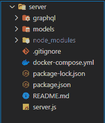

在运行应用服务器之前，通过运行以下命令创建一个新的 MongoDB 实例:

```
docker-compose up -d
```

上面的命令将使用`docker-yml`文件中的信息来创建一个新的 MongoDB 实例，该实例将在下面的 URI `mongodb://localhost:27017/mongodb`中被访问。

通过运行以下命令安装节点模块:

```
npm install
```

运行以下命令以启动 GraphQL 服务器并为应用程序客户端提供服务:

```
npm start
```

在您的浏览器中，导航到 [`http://localhost:4000/`](http://localhost:4000/) ，您应该会看到类似如下的内容:

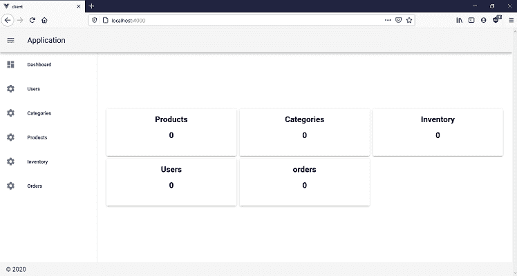

导航到`users`路线并创建一个新用户:


导航到`categories`路线并创建一个新类别:

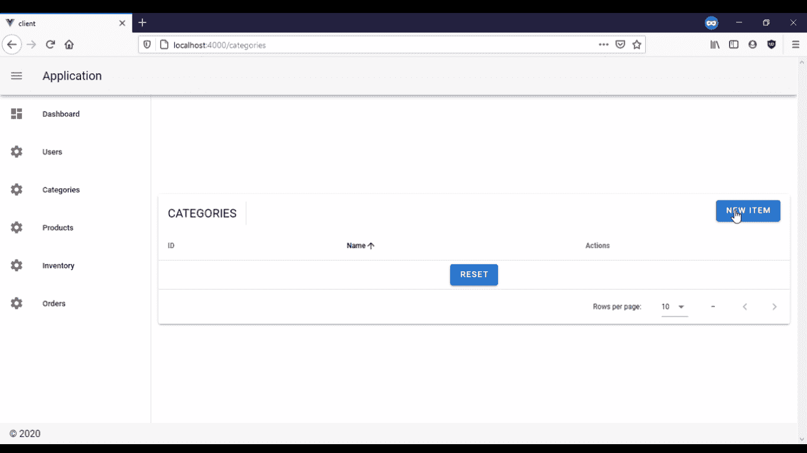

导航到`products`路线并创建新产品:


导航到`inventory`路线并创建一个新的库存项目:

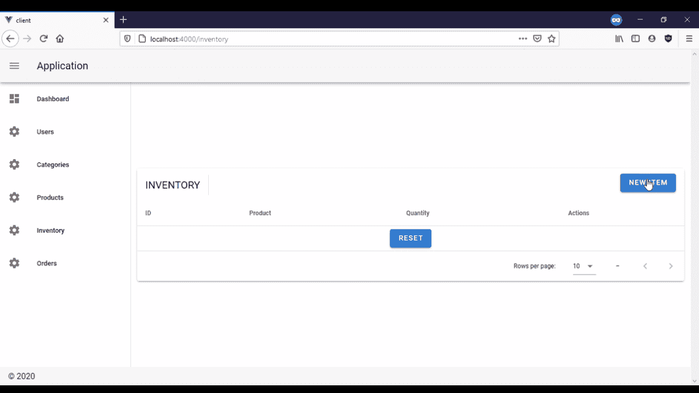

导航到`orders`路线并创建新订单:


在本节中，您已经部署了应用程序客户机，并开始使用 GraphQL 服务器为其提供服务。

## 结论

在本教程中，您为库存管理应用程序创建了一个前端应用程序。首先，您克隆了包含应用服务器的存储库。在克隆存储库之后，您使用`Vue`和`Vuetify`为客户机创建了用户界面，然后使用`node-fetch`将客户机连接到 GraphQL API。最后，您开始使用 GraphQL 服务器为您的客户端应用程序提供服务。

## 像用户一样体验您的 Vue 应用

调试 Vue.js 应用程序可能会很困难，尤其是当用户会话期间有几十个(如果不是几百个)突变时。如果您对监视和跟踪生产中所有用户的 Vue 突变感兴趣，

[try LogRocket](https://lp.logrocket.com/blg/vue-signup)

.

[](https://lp.logrocket.com/blg/vue-signup)[https://logrocket.com/signup/](https://lp.logrocket.com/blg/vue-signup)

LogRocket 就像是网络和移动应用程序的 DVR，记录你的 Vue 应用程序中发生的一切，包括网络请求、JavaScript 错误、性能问题等等。您可以汇总并报告问题发生时应用程序的状态，而不是猜测问题发生的原因。

LogRocket Vuex 插件将 Vuex 突变记录到 LogRocket 控制台，为您提供导致错误的环境，以及出现问题时应用程序的状态。

现代化您调试 Vue 应用的方式- [开始免费监控](https://lp.logrocket.com/blg/vue-signup)。