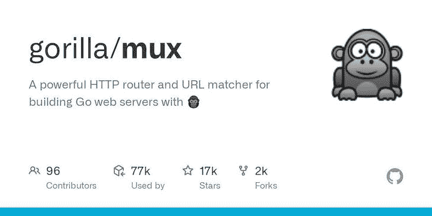
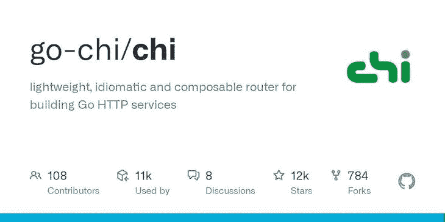
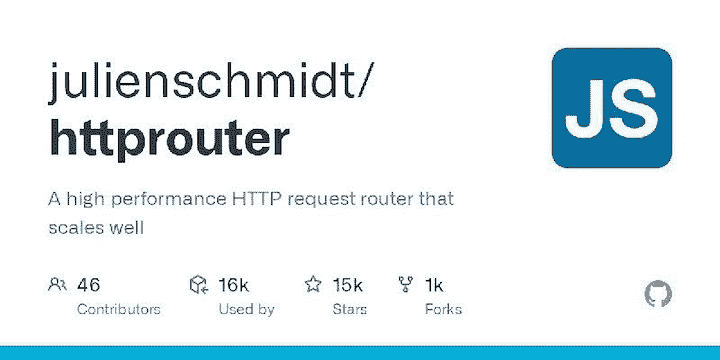

# Go with Gorilla Mux 中的路由介绍

> 原文：<https://blog.logrocket.com/routing-go-gorilla-mux/>

***编者按:**这篇文章于 2023 年 3 月 1 日更新，包括了关于匹配路由、并发性以及 HttpRouter 的信息。*

HTTP 路由器是帮助接收网络请求并将其转发给指定处理程序的工具和库。HTTP 路由器运行在服务器上，拦截传入的请求，并将请求指定给指定的处理函数。

路由器因后端框架而异；为了更快地构建软件，大多数后端框架都附带了路由器和许多其他功能。

Gorilla Mux 包是 Go 生态系统中最受欢迎的路由器和项目之一，由于该包的多样化功能，它被用于像 T2 Geth T3 这样受欢迎的项目中。Gorilla Mux 提供匹配路由、服务静态文件、服务单页应用程序(spa)、中间件、处理 CORS 请求和测试处理程序的功能。

***注意，**截至 2022 年 12 月，整个[大猩猩网络工具包](https://github.com/gorilla)在 GitHub 上进入存档模式。用项目维护人员的话说，这意味着:*

> 所有存储库都进入了“只读”模式。任何仍在使用它们的人都可以克隆它们，获得它们，并继续用它们构建项目。实际上，在过去的 12 个月里，这里真的没有什么变化，也不会破坏现有的项目。这确实表明这些库不会有未来的发展。
> …欢迎人们(一如既往地)分享它们:所有的 Gorilla 库都获得了许可(MIT、BSD-3 和 Apache 2.0)。”

你可以在这里阅读关于为什么工具包被存档[的更多细节。](https://github.com/gorilla)

本教程将指导您使用 Gorilla Mux 包作为应用程序的路由器。通过使用 Gorilla Mux 构建一个简单的 API，您将了解如何使用它。

*向前跳转:*

## Gorilla Mux 入门



设置好 Go 工作空间后，在工作目录中运行以下命令来安装 Gorilla Mux 包:

```
go get -u github.com/gorilla/mux

```

安装 Gorilla Mux 包后，在 Go 文件的顶部导入您将在本教程中使用的包和模块，如下所示:

```
import (
        "encoding/json"
        "github.com/gorilla/mux"
        "log"
        "net/http"
)

```

Gorilla Mux 依赖于标准的`http`包，您将在本教程的许多部分使用`http`包，包括设置服务器。您将使用`json`包对 JSON 的结构进行编码和解码，反之亦然。

## 在 Go 中将结构解析成 JSON

以下是您将在本教程中用作数据模型的结构类型:

```
type Bio struct {
        Name string `json:"name"`
        Age  int    `json:"age"`
}

```

Gorilla Mux 不像 [Fiber](https://blog.logrocket.com/building-microservices-go-fiber/) 那样提供解析 JSON 结构的功能。相反，在本教程中，您将使用标准库中的`json`包来解码 JSON 请求，并将结构编码为对客户端的 JSON 响应。

这里有一个用`json`包编码和解码的例子。首先创建您想要解码的 Go 变量:

```
var human Bio

```

`human`变量是`Bio`结构的实例化。您可以使用由`json.NewDecoder`返回的`Decoder`结构的`Decode`方法将 HTTP 请求的 JSON 主体解析成初始化的结构。

```
err := json.NewDecoder(request.Body).Decode(&human)
if err != nil {
  log.Fatalln("There was an error decoding the request body into the struct")
}

```

类似地，您可以使用由`NewEncoder`返回的`Encoder`结构的`Encode`方法来编写一个将被编码为 JSON 的结构给客户端。

```
err = json.NewEncoder(writer).Encode(&human)
if err != nil {
  log.Fatalln("There was an error encoding the initialized struct")
}

```

现在，您已经熟悉了使用 JSON 的基础知识，让我们继续学习路由。

## Gorilla Mux 封装路由

您可以使用`NewRouter`方法创建一个路由器实例，如下所示:

```
router := mux.NewRouter()

```

在声明了一个新的路由器实例之后，您可以使用路由器实例的`HandleFunc`方法将路由分配给处理程序函数，以及处理程序函数处理的请求类型。这里有一个例子:

```
router.HandleFunc("/api/v1/example", exampleHandler).Methods("GET")

```

`HandleFunc`方法将`api/v1/example`路由分配给`exampleHandler`处理函数来处理`GET`请求。

这些是您将在本教程中构建的 CRUD API 端点的路由器声明:

```
router.HandleFunc("/create", create).Methods("POST")
router.HandleFunc("/read", read).Methods("GET")
router.HandleFunc("/update", update).Methods("PUT")
router.HandleFunc("/delete", delete_).Methods("DELETE")

```

您的下一个任务是创建这些处理函数并设置一个服务器。

## Gorilla Mux 中的匹配路线

在继续创建处理程序之前，让我们暂停一下，仔细看看如何使用 Gorilla Mux 匹配路径。现在，您的路由基于应用程序的根和 HTTP 请求方法。例如，宣言:

```
 router.HandleFunc("/create", create).Methods("POST")

```

当客户端向地址`yourserveraddress.com/create`发出 POST 请求时，我们将调用`create`处理程序。然而，Gorilla Mux 提供了更精确地确定端点匹配路线的方法。

让我们假设您想确保您的`create`处理程序只处理通过 HTTPS 发出的请求。您需要做的就是将一个 scheme 匹配链接到 route 声明，就像这样:

```
 router.HandleFunc("/create", create).Methods("POST").Schemes("https")

```

Gorilla Mux 为其他几个标准提供了匹配。比如可以按主机 URL 匹配路由，像这样:`router.HandleFunc("/route",` `handler).Host("www.yourdomain.com")`。该声明将只处理对 URL `[http://www.yourdomain.com/route](http://www.yourdomain.com/route)`的请求。

Mux 还允许您:

*   按路径前缀匹配路由
*   基于 HTTP 头的存在匹配路由
*   基于请求中的查询参数匹配路线
*   根据您的需求定义自定义匹配函数

你可以在这里找到使用这些匹配[的例子。关于用 Mux 匹配路由，有一个警告:如果一个传入的请求匹配两个或更多的路由声明(存在路由冲突)，那么总是使用第一个路由声明来处理请求。](https://github.com/gorilla/mux#matching-routes)

因为将相同的匹配应用到几个不同的路由是乏味的，并且会使您的代码更难阅读，Gorilla Mux 提供了一个称为子路由的功能。此功能允许您创建一个路由器，将一组匹配应用于您向其注册的所有路由。这里有一个例子:

```
router := mux.NewRouter()
s := router.Host("www.yourdomain.com").Headers("Connection", "Keep-Alive").Subrouter()
s.HandleFunc("/create", handler)
s.HanldeFunc("/update", updateHandler)

```

只有当请求具有适当的`Host`和`Headers`时，才会处理`/create`和`/update`路线。现在您已经理解了路由匹配的工作原理，您可以继续创建您的处理程序了。

## 设置处理函数

处理函数是您为应用程序声明业务逻辑的地方。根据操作的不同，您的处理程序将需要一个`writer`对象(向客户端写入响应)和一个`request`对象(获取关于传入请求的信息)。

这些对象通常分别是`http.ResponseWriter`和/或`*http.Request`类型的实例。下面是一个向客户端返回 JSON 响应的典型处理函数的框架示例:

```
func example(writer http.ResponseWriter, request *http.Request) {
    writer.Header().Set("Content-Type", "application/json")
}

```

下一步是创建将在本教程中使用的数据存储:

```
var BioData = make([]Bio, 0)

```

上面的`BioData`变量是您之前定义的`Bio`类型的一部分。这个数据存储对于本教程来说已经足够了，但是您的项目可能会有更复杂的需求，需要您使用数据库。如果你不熟悉在 Go 中使用数据库，你可以查看一下关于 [MongoDB](https://blog.logrocket.com/how-to-use-mongodb-with-go/) 和 [GORM ORM](https://blog.logrocket.com/how-to-build-a-rest-api-with-golang-using-gin-and-gorm/) 的教程。

现在您的数据存储已经就绪，您可以开始创建您的`request`处理程序了。`create`处理函数被分配来处理`POST`请求，因此它的业务逻辑会将`request`主体中的新 JSON 对象保存到应用程序的数据存储中。下面是`create`函数的代码:

```
func create(writer http.ResponseWriter, request *http.Request) {
        writer.Header().Set("Content-Type", "application/json")
        writer.WriteHeader(http.StatusOK)
        var human Bio
        err := json.NewDecoder(request.Body).Decode(&human)
        if err != nil {
            log.Fatalln("There was an error decoding the request body into the struct")
        }
        BioData = append(BioData, human)
        err = json.NewEncoder(writer).Encode(&human)
        if err != nil {
                log.Fatalln("There was an error encoding the initialized struct")
        }
}

```

`create`处理函数在收到请求时将`StatusOk`头写入客户端，将 JSON 请求体解码成`human`结构实例，将`human`结构保存到`BioData`片，并通过将`human`结构作为对客户端的响应来结束。

接下来是`read`处理程序。`read`处理函数被分配给`GET`请求；因此，其业务逻辑将从数据存储中获取数据，并根据客户端的请求将匹配的数据返回给客户端:

```
func read(writer http.ResponseWriter, request *http.Request) {
        writer.Header().Set("Content-Type", "application/json")
                name := mux.Vars(request)["name"]
        for _, structs := range BioData {
                if structs.Name == name {
                        err := json.NewEncoder(writer).Encode(&structs)
                        if err != nil {
                                log.Fatalln("There was an error encoding the initialized struct")
                        }
                }
        }

}

```

`read`函数通过使用`mux`包的`Vars`方法读取请求的`name`参数来工作。然后，它遍历用作数据存储的`BioData`片，并将匹配`name`参数的结构作为 JSON 返回给客户机。

`update`处理函数被分配给`PUT`请求，因此它的业务逻辑应该更新请求指定的`BioData`数据存储中的结构:

```
func update(writer http.ResponseWriter, request *http.Request) {
        writer.Header().Set("Content-Type", "application/json")
        var human Bio
        err := json.NewDecoder(request.Body).Decode(&human)
        if err != nil {
                log.Fatalln("There was an error decoding the request body into the struct")
        }
        for index, structs := range BioData {
                if structs.Name == human.Name {
                        BioData = append(BioData[:index], BioData[index+1:]...)
                }
        }
        BioData = append(BioData, human)
        err = json.NewEncoder(writer).Encode(&human)
        if err != nil {
                log.Fatalln("There was an error encoding the initialized struct")
        }
}

```

`update`函数将请求体中的 JSON 解析成`human`变量，循环遍历`BioData`片，删除条目(如果存在的话)，最后将`human`结构从请求体追加到`BioData`片。

`delete_`处理函数被分配给`DELETE`请求；因此，其业务逻辑将从数据存储中删除指定的结构:

```
func delete_(writer http.ResponseWriter, request *http.Request) {
        writer.Header().Set("Content-Type", "application/json")
        name := mux.Vars(request)["name"]
        indexChoice := 0
        for index, structs := range BioData {
                if structs.Name == name {
                        indexChoice = index
                }
        }
        BioData = append(BioData[:indexChoice], BioData[indexChoice+1:]...)
}

```

`delete_`函数从请求中检索 name 参数，遍历`BioData`数据存储，并删除条目(如果存在的话)。

既然已经设置了处理函数，最后一步就是设置监听请求的服务器。

* * *

### 更多来自 LogRocket 的精彩文章:

* * *

## 设置服务器

您可以使用`http`包的`ListenAndServe`方法来设置服务器。`ListenAndServe`方法将您希望服务器运行的端口和路由器实例(如果有的话)作为参数。这是您的应用程序的服务器:

```
func RunServer() {
        router := mux.NewRouter()
        router.HandleFunc("/create", create).Methods("POST")
        router.HandleFunc("/read", read).Methods("GET")
        router.HandleFunc("/update", update).Methods("PUT")
        router.HandleFunc("/delete", delete_).Methods("DELETE")

        err := http.ListenAndServe(":8080", router)
        if err != nil {
                log.Fatalln("There's an error with the server," err)
        }

}

```

调用项目的`main`函数中的`RunServer`函数应该会在本地主机端口`8080`上启动一个服务器。

这就是开始使用 Gorilla Mux 构建应用程序所需的全部信息！

## Gorilla Mux 和并发

与使用标准库的 ServeMux 相比，使用 Gorilla Mux 对应用程序的并发性没有太大影响。在处理传入请求时，每个处理函数仍将在单独的 goroutine 中被调用。

那么这对你意味着什么呢？这意味着在修改处理程序之间共享的数据时必须小心，这样可以避免竞争情况。实现这一点最简单的方法通常是首先避免共享数据，只使用局部变量。然而，如果共享数据是不可避免的，那么一定要用一个[互斥锁](https://pkg.go.dev/sync?utm_source=godoc#Mutex)或其他同步机制来保护对数据的所有访问。

## Gorilla Mux 路由器与 Chi 路由器



Chi 是一个轻量级、可组合的路由器，用于在 Go 中构建 HTTP 服务。您会发现`Chi`路由器对于构建您想要长期维护和支持的大型 RESTful API 服务非常有用。Heroku、Cloudflare 和 99designs 在生产中使用 Chi 路由器。

`Chi`建立在`context`包的基础上，使其适合处理跨处理程序链的信令、取消和请求范围的操作。`Chi`包还包含用于中间件和生成文档的子包，以及用于管理 HTTP 请求和响应负载的呈现包。

这里有一个使用 Chi 路由器进行路由的快速示例:

```
import (
        "net/http"
        "github.com/go-chi/chi/v5"
        "github.com/go-chi/chi/v5/middleware"
)

func main() {
        router := chi.NewRouter()
        router.Use(middleware.Logger)
        router.Get("/", func(writer http.ResponseWriter, request *http.Request) {
                writer.Write([]byte("welcome to the chi"))
        })
        http.ListenAndServe(":3000", router)
}

```

`main`函数启动一个监听端口`3000`的服务器，并向客户端写入一个字符串作为响应。

当您开始一个新项目时，您可能想知道使用哪个路由器。下面是两个路由器包之间的比较，以帮助您根据您正在构建的内容做出决定:

| **公制** | **大猩猩 Mux** | **驰路由器** |
| --- | --- | --- |
| **速度** | **[**见基准**](https://github.com/julienschmidt/go-http-routing-benchmark)** | **[**见基准**](https://github.com/julienschmidt/go-http-routing-benchmark)** |
| **文件生成** | **否** | **是** |
| **人气** | **17k 星，GitHub 上的** **77k 项目所使用的** | **12k stars，由 GitHub 上的 11k 项目使用** |
| **渲染** | **是** | **是** |
| **中间件** | **是** | **是** |
| **WebSockets** | **是** | **是** |
| **测试** | **是** | **是** |

Gorilla Mux 和 Chi 路由器在路由方面都很棒，但你会发现大多数 Go 开发人员都使用 Gorilla Mux，因为它比较老，而且 Gorilla Mux 有更多的学习资源。

## Gorilla Mux 路由器与 http 路由器



HttpRouter 是一款用于 Go 应用的快速、小型路由器，已经存在很长时间了。它如此快速可靠，以至于被用作几个 Go web 框架的路由器，其中最流行的是 Gin。以下是[医生](https://github.com/julienschmidt/httprouter)对 HttpRouter 的评价:

> HttpRouter 是一个轻量级高性能 HTTP 请求路由器(也称为多路复用器或简称为 mux ),用于 Go。
> 
> 与 Go 的`net/http`包的[默认 mux](https://golang.org/pkg/net/http/#ServeMux) 相反，这个路由器支持路由模式中的变量，并与请求方法相匹配。它的伸缩性也更好。
> 
> 该路由器针对高性能和小内存占用进行了优化。即使有很长的路径和大量的路由，它也能很好地扩展。压缩动态 trie(基数树)结构用于高效匹配

为了让您感受一下它是如何工作的，这里有一个使用 HttpRouter 进行路由的小演示:

```
import (
   "github.com/julienschmidt/HttpRouter"
   "log"
   "net/http"
)

func main() {
   router := HttpRouter.New()
   router.GET("/", func(w http.ResponseWriter, r *http.Request, _ HttpRouter.Params) {
      w.Write([]byte("Hello from http router"))
   })

   log.Fatal(http.ListenAndServe(":8080", router))
}

```

就像 Chi 一样，在这个演示中,`main`函数启动一个服务器，监听端口`8080`,并向客户端写一个 hello 响应。为了帮助您选择最适合您需求的路由器，下面是 HttpRouter 和 Mux 之间的比较:

| **公制** | **大猩猩 Mux** | **Http***R***o***uter* |
| --- | --- | --- |
| **速度** | **[**见基准**](https://github.com/julienschmidt/go-http-routing-benchmark)** | **极快，** [**见基准**](https://github.com/julienschmidt/go-http-routing-benchmark) |
| **文件生成** | **否** | **否** |
| **人气** | **17k 星，GitHub 上的** **77k 项目所使用的** | **1** *5 ***k 星，使用过的*** **由** 16 **k 项目上的 GitHub*** |
| **渲染** | **是** | **是** |
| **中间件** | **是** | **是** |
| **WebSockets** | **是** | **否** |
| **测试** | **是** | **是** |

大猩猩 Mux 和 HttpRouter 都是优秀的路由器。HttpRouter 的优点是速度快和简洁，但是 Mux 提供了更多的灵活性和功能。

## 结论

在本教程中，您了解了 Gorilla Mux、HttpRouter 和 Chi 路由器包，如何使用 Gorilla Mux 路由器路由和构建 API，以及如何评估这三个包以帮助您为项目做出更好的决策。

看看这些 [Go 框架](https://blog.logrocket.com/5-top-go-web-frameworks/)如何帮助您更快地构建 web 应用程序。

## 使用 [LogRocket](https://lp.logrocket.com/blg/signup) 消除传统错误报告的干扰

[](https://lp.logrocket.com/blg/signup)

[LogRocket](https://lp.logrocket.com/blg/signup) 是一个数字体验分析解决方案，它可以保护您免受数百个假阳性错误警报的影响，只针对几个真正重要的项目。LogRocket 会告诉您应用程序中实际影响用户的最具影响力的 bug 和 UX 问题。

然后，使用具有深层技术遥测的会话重放来确切地查看用户看到了什么以及是什么导致了问题，就像你在他们身后看一样。

LogRocket 自动聚合客户端错误、JS 异常、前端性能指标和用户交互。然后 LogRocket 使用机器学习来告诉你哪些问题正在影响大多数用户，并提供你需要修复它的上下文。

关注重要的 bug—[今天就试试 LogRocket】。](https://lp.logrocket.com/blg/signup-issue-free)