# 使用云函数在 Flutter 中运行后端任务

> 原文：<https://blog.logrocket.com/run-backend-tasks-flutter-using-cloud-functions/>

在处理任何应用程序时，您最终都需要一些长时间运行的任务，比如图像处理、通过 ML 管道传递数据或发送通知。它们可能太重而不能直接在用户的设备上运行，所以需要的数据被发送到后端服务器来执行任务并将结果返回给用户。

传统上，您需要构建和管理后端服务器，这是一个非常繁琐的过程。但是在云功能的帮助下，你可以避免这种麻烦，让 Firebase 为你处理。

[云功能](https://firebase.google.com/docs/functions)是 Firebase 提供的一项服务，它让你在一个无服务器的框架上运行后端任务，以响应任何其他 Firebase 服务或 HTTPS 请求触发的事件。

在本文中，您将学习编写后端函数并将其部署到 Firebase，并使用 Flutter 来触发它们。本帖包含以下部分:

## 云函数的类型

云功能有三种主要类型:

*   **HTTPS 功能**:这些可以通过 HTTP 请求触发；支持的 HTTP 方法有`GET`、`POST`、`PUT`、`DELETE`和`OPTIONS`
*   **可调用函数**:这些函数可以通过从应用程序中显式调用来触发
*   **后台功能**:基于认证、Firestore、实时数据库、存储等 Firebase 服务产生的事件触发

本文将涵盖所有这三种类型的云功能。

## 创建新的 Firebase 项目

要访问 Cloud Functions 服务，您需要创建一个新的 Firebase 项目。

请遵循以下步骤:

1.  导航到 [Firebase 控制台](https://console.firebase.google.com/?pli=1)(使用您的 Google 帐户登录)。点击**添加项目**。
    
2.  输入项目名称，点击**继续**。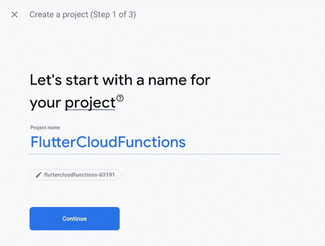T3
3.  由于这只是一个示例项目，您可以禁用 Google Analytics，但对于生产项目，建议将其打开。点击**创建项目**。
    T3
4.  一旦项目初始化完成，点击**继续**。
    T3

这将带您进入项目概述页面。您将从该页面访问所有 Firebase 服务，包括云功能。


## 创建颤振项目

可以使用以下命令创建新的颤振项目:

```
flutter create flutter_cloud_functions

```

使用您喜欢的 IDE 打开项目；我将使用 VS 代码:

```
code flutter_cloud_functions

```

默认情况下，Flutter 会创建一个演示计数器应用程序项目。

导航到`lib/main.dart`文件，用以下代码替换整个代码:

```
import 'package:flutter/material.dart';
void main() {
  runApp(const MyApp());
}
class MyApp extends StatelessWidget {
  const MyApp({Key? key}) : super(key: key);
  @override
  Widget build(BuildContext context) {
    return const MaterialApp(
      title: 'Flutter Cloud Functions',
      home: HomePage(),
    );
  }
}
class HomePage extends StatelessWidget {
  const HomePage({Key? key}) : super(key: key);
  @override
  Widget build(BuildContext context) {
    return Scaffold(
      body: Container(),
    );
  }
}

```

这只是一个简单的开始代码，一旦函数部署到 Firebase，我们将在这个应用程序中添加云函数调用。

## 设置 Firebase CLI

Firebase 命令行界面(CLI)工具有助于使用命令行管理和部署各种 Firebase 服务配置。在这里，我们将只讨论云功能服务。

按照以下步骤安装 Firebase CLI:

1.  安装 [Node.js](https://www.nodejs.org/) 和 npm。Node.js 是 npm 自带的，不需要单独安装(Firebase CLI 要求 Node ≥ v10.13.0)。
2.  使用以下命令安装 Firebase CLI:

    ```
    npm install -g firebase-tools
    ```

3.  使用

    ```
    firebase login
    ```

    从 CLI 登录到您的 Firebase 帐户

当您运行上述命令时，将会生成一个链接。在浏览器中打开该链接并完成验证。

1.  从您的 Flutter 项目目录中运行以下命令:

    ```
    cd flutter_cloud_functions firebase init functions
    ```

2.  选择**Use a existing project**选项，并从上一节创建的列表中选择 Firebase 项目。

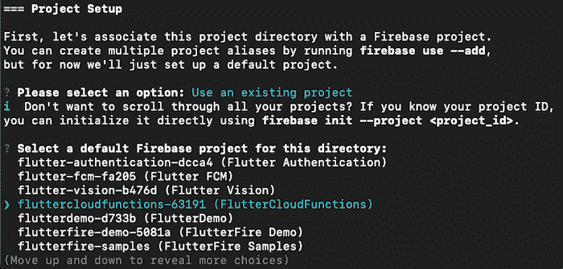

1.  `What language would you like to use to write Cloud Functions?` —您可以在 JavaScript 和 TypeScript 之间选择。在本文中，我们将使用 JavaScript 来编写函数。
2.  `Do you want to use ESLint to catch probable bugs and enforce style?` —是
3.  `Do you want to install dependencies with npm now?` —是

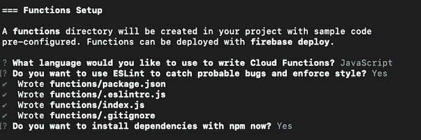

等待 Firebase 初始化完成。现在，您会注意到在您的 Flutter 项目中会创建一个名为`functions`的新文件夹。

## 编写您的第一个云函数

如果您导航到`functions`文件夹，您会发现以下内容:

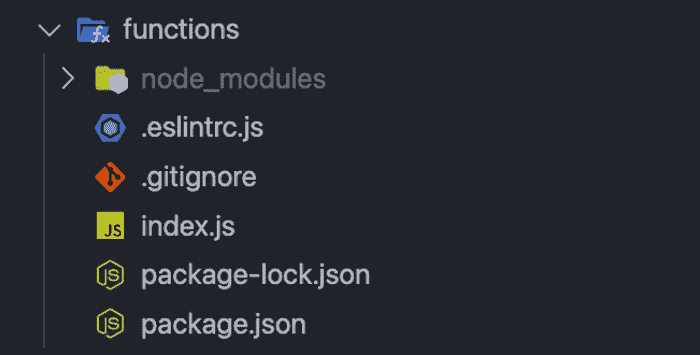

节点依赖关系将存在于`package.json`文件中，而`index.js`是您需要定义云函数的文件。

是时候开始编写您的第一个函数了，我们将编写一个使用 [Twilio 的 SendGrid Email API](https://sendgrid.com/) 发送电子邮件的函数，每天可以免费发送多达 100 封电子邮件。

您需要安装 SendGrid helper 库作为节点依赖项，从`functions`文件夹运行以下命令:

```
cd functions
npm install --save @sendgrid/mail

```

这将安装并添加对`package.json`文件的依赖。

打开`index.js`文件，按照以下步骤操作:

1.  导入 SendGrid 助手库:

    ```
    const sgMail = require('@sendgrid/mail')
    ```

2.  传递 SendGrid API 密钥。在这里，它将在部署函数时作为参数传递。

    ```
    sgMail.setApiKey(functions.config().sendgrid.key);
    ```

3.  定义您要发送的消息；这里，电子邮件地址是硬编码的:

    ```
    const msg = { to: "[email protected]mail.com", // Change to your recipient from: "[email protected]", // Change to your sender subject: "Welcome to your account", text: "This is your first email triggered by Cloud Functions", };
    ```

4.  定义一个名为`sendEmailToUser` :

    ```
    exports.sendEmailToUser = functions.https.onRequest((req, res) => { sgMail .send(msg) .then((response) => { console.log(response[0].statusCode); console.log(response[0].headers); }) .catch((error) => { console.error(Unable to send email. Error: ${error}); throw new functions.https.HttpsError("aborted", "Unable to send email"); }); });
    ```

    的`onRequest` HTTPS 函数

整个`index.js`文件将如下所示:

```
const functions = require("firebase-functions");
const sgMail = require("@sendgrid/mail");

sgMail.setApiKey(functions.config().sendgrid.key);

const msg = {
  to: "[email protected]", // Change to your recipient
  from: "[email protected]", // Change to your sender
  subject: "Welcome to your account",
  text: "This is your first email triggered by Cloud Functions",
};

exports.sendEmailToUser = functions.https.onRequest((req, res) => {
  sgMail
      .send(msg)
      .then((response) => {
        console.log(response[0].statusCode);
        console.log(response[0].headers);
      })
      .catch((error) => {
        console.error(`Unable to send email. Error: ${error}`);
        throw new functions.https.HttpsError("aborted", "Unable to send email");
      });
});

```

## 云功能部署配置

在开始部署云功能之前，您需要执行一些步骤来生成所需的凭证，验证发送者的电子邮件，并升级您的 Firebase 项目。

### **生成 SendGrid API** **键**

在部署云功能时，您将需要一个 SendGrid API 密匙。按照以下步骤创建 API 密钥:

1.  转到 SendGrid 仪表板上的**设置**部分下的 [**API 密钥**](https://app.sendgrid.com/settings/api_keys) 页面。
    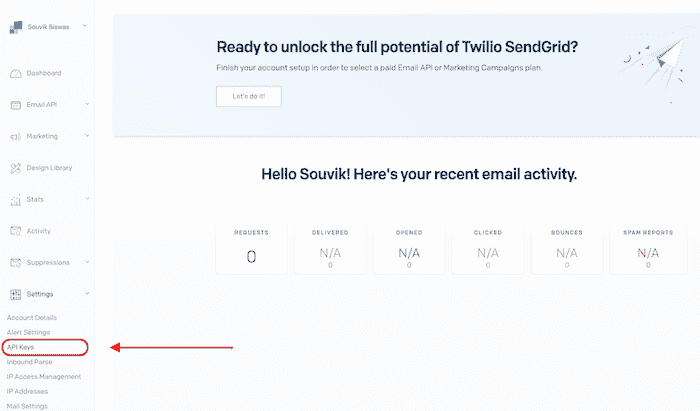
2.  点击**创建 API 密钥**。
3.  输入一个 API 密匙名称，在 **API 密匙权限**下选择**完全访问**，点击**创建&查看**。

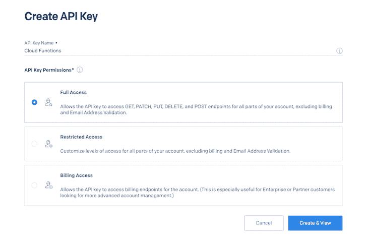

这些步骤将生成一个 API 密钥。复制密钥并将其存储在安全的地方(它将不会再被看到)。

### **在发送网格上验证****s**ender**e**邮件

为了使用发件人的电子邮件通过 SendGrid API 发送电子邮件，您需要首先验证该电子邮件地址。

按照以下步骤验证电子邮件:

1.  转到 SendGrid 仪表板上的**设置**部分下的 [**发送方认证**](https://app.sendgrid.com/settings/sender_auth) 页面。
2.  点击**验证单个发送方**。
3.  填写发送者详细信息，然后点击**创建**。

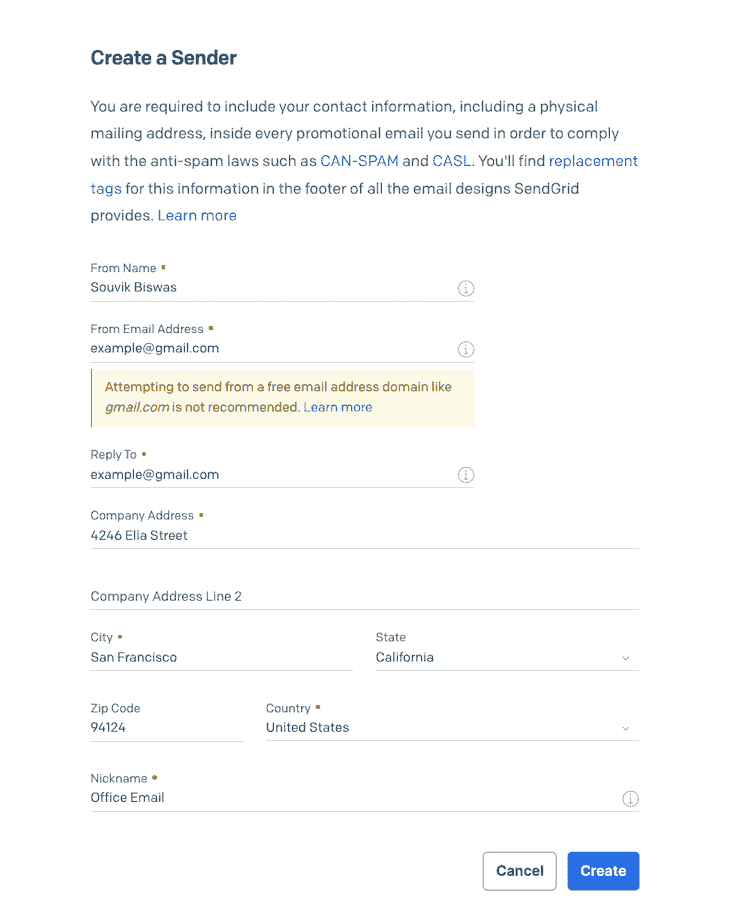

### **升级你的 Firebase 项目**

要使用云功能服务，您需要将您的 Firebase 项目升级到 [Blaze 计划](https://firebase.google.com/pricing)(每个 Firebase 项目默认使用 Spark 计划)。

按照以下步骤升级到 Blaze 计划:

1.  点击左侧 Firebase 仪表盘菜单上的**升级**。
2.  选择**火焰计划**。
3.  设置计费预算并点击**继续**。
4.  点击**购买**。

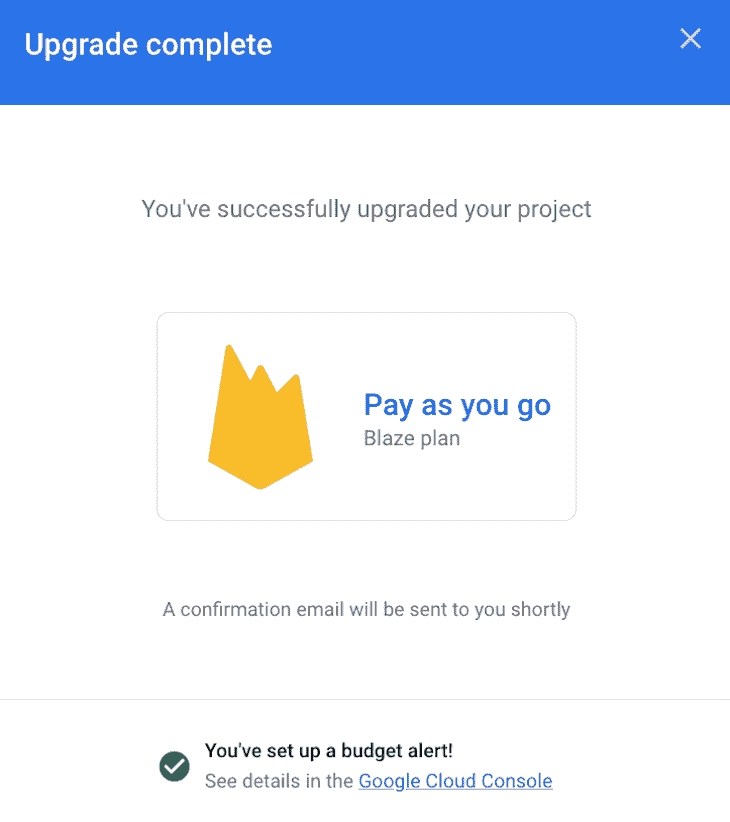

## 部署云功能

要部署该功能，请执行以下步骤:

1.  导航到`functions`文件夹。
2.  运行以下命令来设置 SendGrid API 键:
    `firebase functions:config:set sendgrid.key=""`

用您之前生成的密钥替换`<api_key>`。

1.  使用以下命令部署该功能:
    `firebase deploy --only functions`

等待部署过程完成。您将在控制台上看到类似这样的内容:

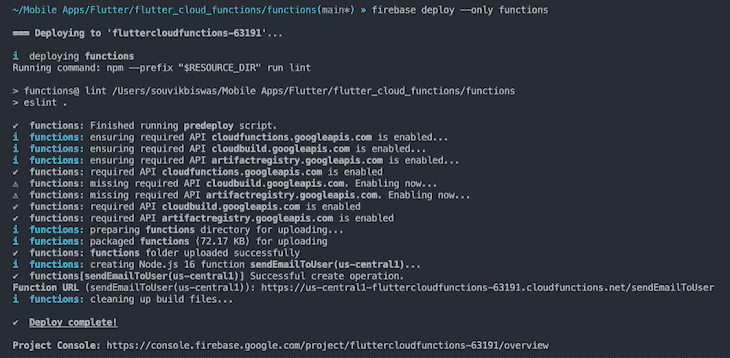

一旦部署完成，导航到 **Firebase 仪表板**并从左侧菜单转到**功能**页面。您将能够查看部署的功能:

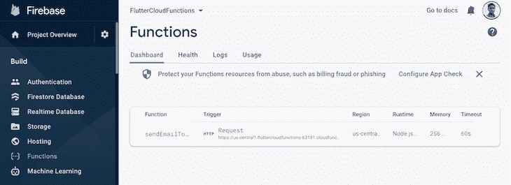

## 使用云功能 CLI 仿真器进行本地测试

您可以使用 Firebase CLI 附带的云函数模拟器来模拟我们刚刚定义的 HTTPS 函数。

当我们将 SendGrid API 键作为配置变量传递时，您首先需要运行以下命令来获取本地环境中的自定义配置(从`functions`目录运行):

```
firebase functions:config:get > .runtimeconfig.json
```

使用以下命令运行 emulator for Cloud 函数:

```
firebase emulators:start --only functions

```

这个命令将生成一个用于加载模拟器 UI 的 URL，并获取控制台内部的云函数日志。

因为它是一个 HTTPS 函数，你可以使用一个`curl`请求或者仅仅通过从你的浏览器加载生成的 URL 来触发它。触发该功能的 URL 将类似于下面这样:
`[http://localhost:5001/fluttercloudfunctions-63191/us-central1/sendEmailToUser](http://localhost:5001/fluttercloudfunctions-63191/us-central1/sendEmailToUser)` 
一旦该功能被触发，您应该会看到打印到控制台的日志:

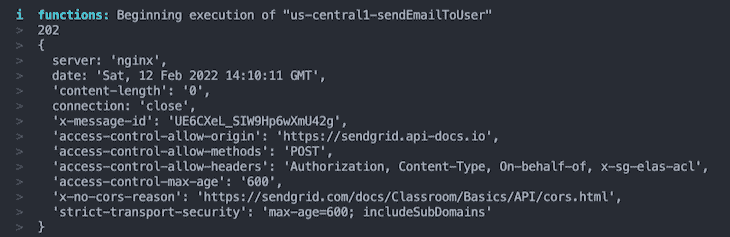

该电子邮件还将发送到提供的收件人电子邮件地址:

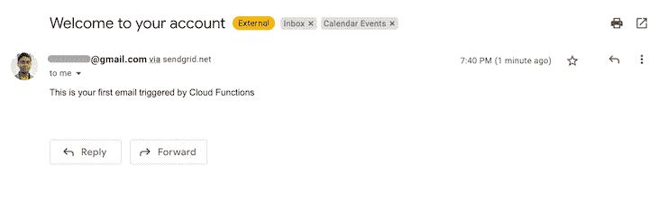

## 整合燃烧基与颤振

要在 Flutter 应用程序中使用任何 Firebase 服务，您需要在项目中配置和初始化 Firebase。现在只支持 Dart 初始化。

首先，在你的 Flutter 项目中安装`firebase_core`插件，使用:

```
flutter pub add firebase_core

```

要使用仅 Dart 初始化，您需要安装以下 CLI 工具:

使用以下命令安装 FlutterFire CLI:

```
dart pub global activate flutterfire_cli

```

运行以下命令来配置 FlutterFire CLI:

```
flutterfire configure

```

选择要为其生成配置的平台；它会自动创建平台配置并将其注册到 Firebase:

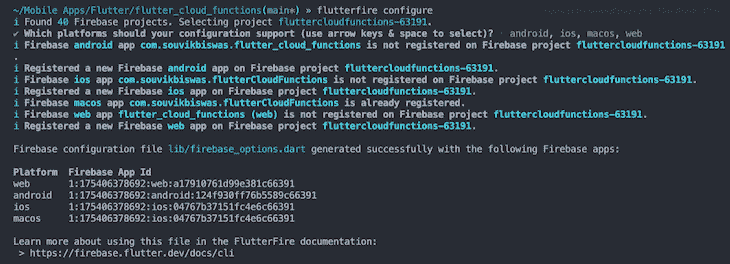

您将在`lib/firebase_options.dart`文件中找到您的所有配置。

接下来，您需要在您的`main.dart`文件中初始化 Firebase。在`main()`函数中添加以下内容:

```
import 'package:firebase_core/firebase_core.dart';

import 'firebase_options.dart';

void main() async {
  WidgetsFlutterBinding.ensureInitialized();
  await Firebase.initializeApp(
    options: DefaultFirebaseOptions.currentPlatform,
  );
  runApp(const MyApp());
}

```

## 从 Flutter 调用函数

使用以下命令将`cloud_functions`插件安装到您的 Flutter 项目中:

```
flutter pub add cloud_functions

```

将`HomePage`类更新为`StatefulWidget`:

```
import 'package:flutter/material.dart';
class HomePage extends StatefulWidget {
  const HomePage({Key? key}) : super(key: key);
  @override
  State<HomePage> createState() => _HomePageState();
}
class _HomePageState extends State<HomePage> {
  @override
  Widget build(BuildContext context) {
    return Scaffold(
      appBar: AppBar(
        title: const Text('Cloud Functions'),
      ),
      body: Container(),
    );
  }
}

```

实例化云函数:

```
import 'package:cloud_functions/cloud_functions.dart';

class _HomePageState extends State<HomePage> {
  final functions = FirebaseFunctions.instance;
  // ...
}

```

要使云函数可从 Flutter 应用程序中调用，您需要重构该函数，以将 HTTPS 函数转换为可调用函数。

不使用`onRequest`:

```
exports.sendEmailToUser = functions.https.onRequest((_, __) => {
   // ...
});

```

使用`onCall`并返回一个字符串作为对调用的响应:

```
exports.sendEmailToUser = functions.https.onCall((_, __) => {
   // ...

   return `Email sent successfully to ${msg.to}`;
});

```

如果在使用`await`调用这个函数时没有返回任何东西，那么处理将会无限运行，并导致超时错误。

通过运行以下命令来重新部署该功能:

```
firebase deploy --only functions

```

返回到`HomePage`小部件，初始化一个新的布尔变量，以便在电子邮件发送过程中进行跟踪:

```
bool _isSending = false;

```

添加一个新的方法来触发名为`sendEmail`的云功能:

```
Future<void> sendEmail() async {
  setState(() => _isSending = true);

  final callable = functions.httpsCallable('sendEmailToUser');
  final results = await callable();

  setState(() => _isSending = false);

  debugPrint(results.data);
}

```

这里，`httpsCallable`方法用于通过传递名称来获取对可调用的 HTTPS 触发器的引用。然后，使用`callable()`方法触发该函数。

在`Scaffold`中添加一个按钮来调用`sendEmail()`方法:

```
@override
Widget build(BuildContext context) {
  return Scaffold(
    appBar: AppBar(
      title: const Text('Cloud Functions'),
    ),
    body: Center(
      child: _isSending
          ? const CircularProgressIndicator()
          : ElevatedButton(
              onPressed: () async => await sendEmail(),
              child: const Padding(
                padding: EdgeInsets.all(8.0),
                child: Text(
                  'Send Email',
                  style: TextStyle(fontSize: 24),
                ),
              ),
            ),
    ),
  );
}

```

当该功能正在处理时，UI 中会显示一个 [`CircularProgressIndicator`小工具](https://blog.logrocket.com/choosing-right-progress-indicators-async-flutter-apps/)。

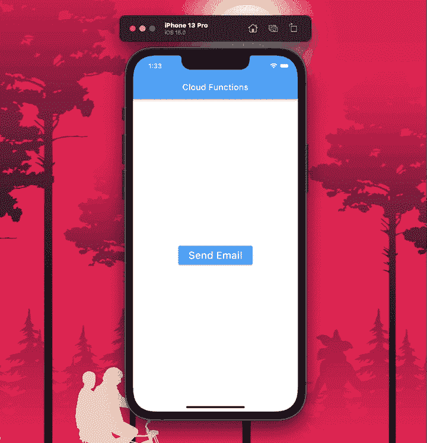

一旦电子邮件发送过程完成，您还会注意到控制台上打印出以下内容:
`flutter: Email sent successfully to [[email protected]](/cdn-cgi/l/email-protection)` 

## 添加 Firebase 身份验证触发器

通常，用户一注册应用程序，就会收到欢迎邮件。这可以使用 [Firebase 认证触发器](https://firebase.google.com/docs/functions/auth-events)轻松实现，后者可以在云函数内部使用。

一旦新用户成功注册，您需要使用函数中的`onCreate`事件处理程序来自动触发它。

```
exports.sendWelcomeEmail = functions.auth.user().onCreate((user) => {
  const email = user.email; // Get email from authenticated user
  const displayName = user.displayName; // Get name from authenticated user

  const msg = {
    to: email,
    from: "[email protected]", // Change to your verified sender email
    subject: "Welcome to your account",
    text: `Hi ${displayName}, thanks for signing up!`,
  };

  sgMail
      .send(msg)
      .then((response) => {
        console.log(response[0].statusCode);
        console.log(response[0].headers);
      })
      .catch((error) => {
        console.error(`Unable to send email. Error: ${error}`);
        throw new functions.https.HttpsError("aborted", "Unable to send email");
      });

  return `Email sent successfully to ${msg.to}`;
});

```

您可以从已认证的`user`对象中获得一些基本的用户信息:

```
const email = user.email;
const displayName = user.displayName;

```

在部署这个功能之前，请确保您已经从控制台启用了 [Firebase 身份验证](https://console.firebase.google.com/)。

使用以下工具重新部署功能:

```
firebase deploy --only functions

```

现在，你不需要显式调用你的 Flutter 应用内部的函数。一旦用户在你的应用内通过验证，一封电子邮件将被发送到用于注册的地址。

你可以从[这里](https://firebase.flutter.dev/docs/auth/overview)了解更多关于在 Flutter 中设置 Firebase 认证的信息。

## 结论

Firebase 云功能使在其服务器上运行长时间运行或计算密集型任务变得更加简单，而不必维护自己的服务器基础设施。

本文涵盖了可以在 Firebase 上运行的所有不同类型的云功能，以及如何将它们与您的 Flutter 应用程序集成。如果你已经在你的应用程序中使用了 Firebase 服务，比如身份验证，你可以利用后台功能，而不必对你的应用程序进行任何添加。

感谢您阅读文章！如果你对这篇文章或我的例子有任何建议或问题，请随时通过 [Twitter](https://twitter.com/sbis04) 或 [LinkedIn](https://www.linkedin.com/in/sbis04/) 与我联系。您可以在我的 [GitHub 资源库](https://github.com/sbis04/flutter_cloud_functions)中找到本文使用的示例项目。

## 使用 [LogRocket](https://lp.logrocket.com/blg/signup) 消除传统错误报告的干扰

[](https://lp.logrocket.com/blg/signup)

[LogRocket](https://lp.logrocket.com/blg/signup) 是一个数字体验分析解决方案，它可以保护您免受数百个假阳性错误警报的影响，只针对几个真正重要的项目。LogRocket 会告诉您应用程序中实际影响用户的最具影响力的 bug 和 UX 问题。

然后，使用具有深层技术遥测的会话重放来确切地查看用户看到了什么以及是什么导致了问题，就像你在他们身后看一样。

LogRocket 自动聚合客户端错误、JS 异常、前端性能指标和用户交互。然后 LogRocket 使用机器学习来告诉你哪些问题正在影响大多数用户，并提供你需要修复它的上下文。

关注重要的 bug—[今天就试试 LogRocket】。](https://lp.logrocket.com/blg/signup-issue-free)