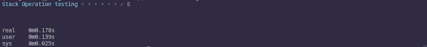
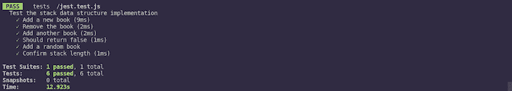

# 使用 Baretest 在 Node.js 中运行更快的测试

> 原文：<https://blog.logrocket.com/run-faster-tests-in-node-js-with-baretest/>

测试是应用程序和软件开发的重要部分。这确保了我们的网络应用程序能够按照预期的方式运行。

在 JavaScript 生态系统中，我们有多个测试库和框架，今天，我们将关注[barestest](https://volument.com/baretest)，这是一个新的极简测试库，它认为自己是 [Jest](https://jestjs.io) 的替代品。

## 什么是 Baretest？

Baretest 是一个最小、快速、简单的 JavaScript 测试运行程序。在这个速度非常重要的现代软件开发时代，与 Jest 相比，Baretest 拥有令人难以置信的速度。

您可以从 npm 安装它:

```
npm i --save-dev baretest
```

并像这样使用它:

```
const test = require('baretest')
      assert = require('assert')
```

## Baretest API 方法

作为一个极简的库，Baretest 使用了 Node 的 assert 库。`assert`模块是一个内置于 Node 的测试库，有几个方法用于断言传递的参数和语句。Baretest 主要充当包装器，而真正的测试是由`assert`模块完成的。

Baretest 库有许多方法:

### `test(name, fn)`

这个方法用测试的名字和相应的函数初始化一个测试套件。例如，如果我们想测试 1 是否等于 1，下面的代码可以帮助我们做到这一点:

```
const test = require('baretest')
      assert = require('assert')

test('Proove that 1 == 1', () => {
  assert.ok(1 == 1)
})
```

### `test.only(name, fn)`

`.only(name, fn)`方法接受测试的名称和包含测试本身的函数。方法用于指示测试运行程序只运行此测试，而忽略其他测试。

比方说，我们想要测试一个 sum 函数，但是我们不想同时运行其他测试。我们简单地使用`.only(name, fn)`方法，如下例所示:

```
const test = require('baretest')
      assert = require('assert')

test('Proove that 1 == 1', () => {
  assert.ok(1 == 1)
})

test.only('1 + 1 should equal 2', () => {
  assert.equal(1+1, 2)
})
```

当运行上述测试时，sum 测试是唯一执行的测试。

### `test.before(fn)`

这个方法接受一个函数作为参数。该功能在所有提供的测试之前执行。例如:

```
test.before(() => {
  console.log("Yay! We're about to start!")
})
```

## `test.after(fn)`

这个方法接受一个函数作为参数，就像`.before(fn)`一样，它在提供的测试完成运行后执行。例如:

```
test.after(() => {
  console.log("It was a successful test!")
})
```

### `test.skip(name, fn)`

该方法用于跳过测试用例，对于临时省略测试非常有用。

### `test.run()`

在编写完所有测试用例之后，调用这个方法。该方法运行测试文件中提供的测试:

```
const test = require('baretest')
      assert = require('assert')

test.before(() => {
  console.log("Yay! We're about to start!")
})

test('Proove that 1 == 1', () => {
  assert.ok(1 == 1)
})

test('1 + 1 should equal 2', () => {
  assert.equal(1+1, 2)
})

test.after(() => {
  console.log("It was a successful test!")
})

// Run test!

test.run()
```

## 使用 Baretest 进行测试

因此，我们简要讨论了 Baretest 库中的方法。在本节中，我们将测试一些简单的堆栈操作。

首先，我们将构建`Stack`数据结构，然后为其操作编写测试。如果你不知道栈是什么，你应该读一读这篇关于数据结构的文章。

### 设置

首先，我们将创建一个文件夹，用 npm 初始化它，然后创建我们的测试活动所需的文件:

```
mkdir baretest & cd baretest
npm init -y & npm i --save-dev baretest
touch {stack, test}.js
```

接下来，我们实现`Stack`数据结构:

```
class Stack {
  constructor() {
    this.items = [];
  }

  push(item) {
    this.items.push(item);
  }

  pop() {
    return this.items.length == 0 ? "Not enough items!" : this.items.pop()
  }

  peek() {
    return this.items[this.items.length - 1];
  }

  isEmpty() {
    return this.items.length > 0 ? false : true 
  }

  clear() {
    while (this.items.length != 0) {
      this.items.pop()
    }
  }

  length() {
    return this.items.length
  }
}

module.exports = new Stack()
```

实现了数据结构之后，我们继续编写测试。我们将测试`push()`、`pop()`和`length`方法。

### `test.js`

首先，我们导入`baretest`、`assert`模块和堆栈:

```
const test = require('baretest')('Stack Operation Testing'),
  assert = require('assert')
  books = require('./stack')
```

接下来，我们为我们的`.push()`、`.pop()`、`.peek()`和`.length()`方法编写一个测试:

```
test('Add a new book', () => {
  books.push("Engineering Maths")
  assert.equal(books.peek(), "Engineering Maths")
})
```

在上面的测试中，我们将一本新书放入书库，并使用`assert.equal()`方法进行确认。随后我们将使用`assert.equal()`方法。

接下来，我们使用`.pop()`方法移除图书，并确认堆栈的长度为 0:

```
test('Remove the book', () => {
  books.pop()
  assert.ok(books.length() == 0)
})
```

在上面的代码中，我们使用了`assert.ok()`方法来测试给定的表达式是否为真。

接下来，我们添加一本新书，并编写另一个测试来确定堆栈的顶部元素没有指向传递的值:

```
test('Add another book', () => {
  books.push("Engineering Thermodynamics")
  assert.equal(books.peek(), "Engineering Thermodynamics")  
})

test('Shoud false', () => {
  assert.notStrictEqual(books.peek(), "Engineering Maths")
})
```

我们使用了`.notStrictEqual()`方法来表明栈顶不等于“工程数学”

接下来，我们添加一个随机书并测试以确认堆栈的长度:

```
test('Add a random book', () => {
  books.push("Random book")
  assert.equal(books.peek(), "Random book")
})

test('Confirm stack length', () => {
  assert.ok(books.length() == 2)
})
```

我们现在已经完成了基本操作的测试。上面这些测试的失败意味着我们的实现是错误的，或者我们在某个地方犯了错误。如果结果不是预期的，您可以使用控制台中抛出的错误作为指导。

最后，我们调用`.run()`方法:

```
test.run()
```

下一步是运行测试文件来查看我们的测试结果:

```
node test.js
```


Our test passed!

测试的速度真的是出神入化！

## 只是测试一下。他来了

Baretest 认为自己是 Jest 的替代方案，在这一节中，我们将从三个主要因素来讨论这些库之间的一些差异:

1.  **速度**:速度是任何库或框架的基本特性。当用 Jest 运行时，上述测试的运行时间大约是 Baretest 运行时间的 3 倍。
2.  **复杂性和特性** : Baretest 自诩其极简主义，因此，它缺乏并行化、覆盖报告或模拟功能等高级特性。然而 Jest 支持这些特性。
3.  **大小** : Baretest 用 12 行代码编写，只有一个依赖，而 Jest 有 7 万多行代码，有多个依赖。

### 只是测试一下。就是速度测试

Baretest 运行上述测试所用的时间是:



为了确定 Jest 中的时间，我们也必须在 Jest 包装器中编写测试用例。首先，我们将 Jest 安装为一个开发依赖项:

```
npm install --save-dev jest
```

接下来，我们将为 Jest 创建一个测试文件，然后编写我们的测试:

```
touch jest.test.js
```

### `jest.test.js`

```
const books = require('./stack')

// Describe the tests.
describe('Test the stack data structure implementation', () => {
    beforeAll(() => {
        books.clear()
    })

    test('Add a new book', () => {
        books.push("Engineering Maths")
        expect(books.peek()).toBe("Engineering Maths")
    })
    test('Remove the book', () => {
        books.pop()
        expect(books.length()).toBe(0)
    })
    test('Add another book', () => {
        books.push("Engineering Thermodynamics")
        expect(books.peek()).toEqual("Engineering Thermodynamics")
    })
    test('Should return false', () => {
        expect(books.peek()).not.toEqual("Engineering Maths")
    })
    test('Add a random book', () => {
        books.push("Random book")
        expect(books.peek()).toBe("Random book")
    })
    test('Confirm stack length', () => {
        expect(books.length()).toBe(2)
    })
})
```

为了运行我们的 Jest 测试，我们需要修改`package.json`文件中`scripts`下的`test`命令:

```
"test": "jest jest.test.js"
```

接下来，我们运行测试:

```
npm run test
```

> 一个值得注意的行为是 Jest 的启动时间。



从上面的截图来看，Jest 花了 12.923 秒运行了与 Baretest 0.178 秒运行的相同的测试。

## 结论

本文应该让您对什么是 Baretest 以及它的能力有一个基本的了解。Baretest 的主要优势在于它的速度，因为它依赖于节点的`assert`模块来执行测试用例。然而，Baretest 缺乏复杂的特性，因此不能用于大规模的覆盖率测试。

另一方面，Jest 具有复杂的特性，但是即使在最小的测试用例中也会有点拖拉。由于 Baretest 仍在积极开发中，预计会添加更多功能，谁知道它是否会在未来几年超过 Jest？你可以在这里找到本文中使用的所有代码。

## 200 只显示器出现故障，生产中网络请求缓慢

部署基于节点的 web 应用程序或网站是容易的部分。确保您的节点实例继续为您的应用程序提供资源是事情变得更加困难的地方。如果您对确保对后端或第三方服务的请求成功感兴趣，

[try LogRocket](https://lp.logrocket.com/blg/node-signup)

.

[](https://lp.logrocket.com/blg/node-signup)[https://logrocket.com/signup/](https://lp.logrocket.com/blg/node-signup)

LogRocket 就像是网络和移动应用程序的 DVR，记录下用户与你的应用程序交互时发生的一切。您可以汇总并报告有问题的网络请求，以快速了解根本原因，而不是猜测问题发生的原因。

LogRocket 检测您的应用程序以记录基线性能计时，如页面加载时间、到达第一个字节的时间、慢速网络请求，还记录 Redux、NgRx 和 Vuex 操作/状态。

[Start monitoring for free](https://lp.logrocket.com/blg/node-signup)

.