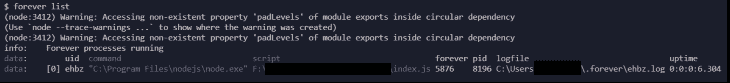

# 使用 forever - LogRocket 博客持续运行 Node.js 脚本

> 原文：<https://blog.logrocket.com/running-node-js-scripts-continuously-forever/>

## 什么是永远？

[Forever](https://www.npmjs.com/package/forever) 是一个 npm 模块，确保 Node.js 脚本在服务器上的后台持续运行。对于生产环境来说，这是一个非常有用的 CLI 工具，因为它有助于管理节点应用程序及其流程。

在本文中，我们将学习如何用我们的节点应用程序设置 forever，以及学习一些重要的 forever 命令。

## 永远安装

Forever 有两种用法:使用 forever CLI 工具和 forever-monitor。永久监控工具可以用来运行一个永久使用代码的应用程序。在本文的后面，我们将看到 forever-monitor 的实际应用。

要使用`forever`，我们需要全局安装它:

```
npm i -g forever

```

## 使用 forever 运行脚本

用 forever 运行脚本很简单。首先，使用以下命令:

```
forever start app.js

```

注意`app.js`是脚本的名字。我们还可以用上面的命令添加一个`-a`标志。此标志将确保日志文件被附加到位于永久默认日志文件位置的默认日志文件中。还有许多其他的标志可以添加到`forever`命令中。

我们还可以通过用空格分隔脚本名来同时运行多个脚本。这里有一个例子:

```
forever start app.js index.js

```

当您使用上述命令启动进程时，您会收到一些警告和关于它正在处理的文件的信息。

启动脚本后，您可以使用`list`命令列出所有正在运行的进程，如下所示:

```
forever list

```

下面是输出的样子:



在这个输出中，我们可以看到重要的细节，比如进程的`id`、脚本名称和位置、日志文件位置、正常运行时间等等。

## 使用 forever 命令启动和停止脚本

当我们在生产服务器中工作时，我们的首要任务是不间断地运行脚本，即使出现一些错误。永远为我们做这些。即使发生一些错误，永远会为我们重启脚本。但也可能有这样的情况，当我们需要停止一个脚本时，可能我们需要推出一个新的更改或者没有使用脚本，在这种情况下，要启动或停止进程，索引 ID 可能非常方便。

在上图中，你可以看到`uid`前面的`[0]`。这是脚本的索引号，可用于终止或停止进程。

要从 CLI 停止正在运行的脚本，请使用`stop`，后跟任意索引`id`、脚本名称、`uid`或进程 ID ( `pid`)。

```
forever stop 0
// or
forever stop index.js
// or
forever stop ehbz
// or
forever stop 8196

```

也可以在启动进程时分配一个唯一的名称。使用标签`--uid newapp`将进程命名为`newapp`。

```
forever start --uid newapp index.js

```

我们也可以像这样停止这个过程:

```
forever stop newapp

```

如果多个进程正在运行，并且您想一次停止所有进程，您也可以使用命令`stopall`，如下所示:

```
forever stopall

```

用 forever 重新启动一个进程类似于停止它。我们将关键字`stop`替换为`restart`:

```
forever restart 0

```

我们可以使用任何索引`id`、脚本名称、`uid`或`pid`来重启一个进程。为了一次重启所有进程，我们使用`restartall`。

```
forever restartall

```

## 用 forever 配置和执行 JSON 文件

至此，我们已经使用 CLI 命令来运行和管理节点脚本。但是使用 forever，我们还可以配置一个 JSON 文件，在这里我们可以定义所有必要的细节并执行 JSON 文件。让我们看一个例子。

```
{
  "uid": "app",
  "append": true,
  "watch": true,
  "script": "./index.js",
  "logFile": "./logs/forever.log",
  "outFile": "./logs/out.log",
  "errFile": "./logs/error.log"
}

```

在这里，`uid`是我们给这个过程的惟一名称。在我们的例子中，我们将其命名为`app`。`append`旗的作用与`-a`旗相同；它附加日志。`watch`标志监视文件的变化。

`Script`是我们正在运行的脚本，`logFile`、`outFile`和`errFile`是日志文件、输出文件和错误日志文件的位置。

也可以将多个进程设置到一个 JSON 文件中。

```
[
  {
    // App1
    "uid": "app1",
    "append": true,
    "watch": true,
    "script": "index.js",
    "sourceDir": "/home/nemo/app1"
  },
  {
    // App2
    "uid": "app2",
    "append": true,
    "script": "index.js",
    "sourceDir": "/home/nemo/app2",
    "args": ["--port", "4000"]
  }
]

```

我们在这里的 JSON 文件中将两个对象`App1`和`App2`定义到一个数组中。运行这个 JSON 文件将会运行多个进程。

现在，让我们来谈谈永久监控模块。

## 不使用 CLI 永远使用

永久监控模块有助于在不使用 CLI 的情况下以编程方式运行进程。让我们假设我们有一个基本的 Express 服务器，我们想用 forever-monitor 运行它。这是服务器的代码。

```
const express = require('express');
const app = express();

app.get('/', (req, res) => {
  res.send('Hello World!');
});

const PORT = process.env.PORT || 3000;

app.listen(PORT, () => {
  console.log(`Server is running on port ${PORT}`);
});

```

我们有一个索引路线，当我们点击它时会显示`Hello World`。现在，要使用 forever-monitor 包，我们首先必须安装与`npm i forever-monitor`的依赖关系。

我们还必须创建一个单独的文件，并在其中定义选项。在这个例子中，我将这个文件命名为`fm.js`。在这里，我们必须首先导入永久监控模块。导入模块后，我们将设置运行应用程序的选项。对于本教程，我们将保持非常简单。这是代码。

* * *

### 更多来自 LogRocket 的精彩文章:

* * *

```
const forever = require('forever-monitor');

const child = new forever.Monitor('index.js', {
  max: 3,
  silent: false,
  uid: 'index',
});

child.on('exit', function () {
  console.log('app.js has exited after 3 restarts');
});

child.start(); 

```

`child`变量保存从`forever.Monitor`方法创建的构造函数。这个构造函数接受两个参数，一个是我们想要运行的文件名，另一个是带有选项的对象。我在这里提供了三种选择。

`max: 3`键值对代表最大重试次数。如果`silent`标志为真，它将使父进程中`stdout`和`stderr`的输出静音。`uid`标志为进程设置了一个名称。

在`child.on`方法中，我们监听一个叫做`exit`的事件。当事件被触发时，我们在控制台记录一条消息。本质上，当达到最大重试次数时，该过程退出。

最后，我们从`child.start()`开始这个过程。现在，用`node fm.js`在终端中运行脚本将启动我们的流程。

这就是我们如何在不使用 CLI 的情况下使用`forever`运行脚本。

## 结论

Forever 是一个简单而有用的工具，它使开发人员能够持续运行节点脚本。但同样值得注意的是，因为它的简单，它缺少一些功能，所以尝试一下，决定是否 forever 或另一个工具如 [PM2](https://pm2.keymetrics.io/) 最适合你的用例。黑客快乐。

## 200 只显示器出现故障，生产中网络请求缓慢

部署基于节点的 web 应用程序或网站是容易的部分。确保您的节点实例继续为您的应用程序提供资源是事情变得更加困难的地方。如果您对确保对后端或第三方服务的请求成功感兴趣，

[try LogRocket](https://lp.logrocket.com/blg/node-signup)

.

[](https://lp.logrocket.com/blg/node-signup)[https://logrocket.com/signup/](https://lp.logrocket.com/blg/node-signup)

LogRocket 就像是网络和移动应用程序的 DVR，记录下用户与你的应用程序交互时发生的一切。您可以汇总并报告有问题的网络请求，以快速了解根本原因，而不是猜测问题发生的原因。

LogRocket 检测您的应用程序以记录基线性能计时，如页面加载时间、到达第一个字节的时间、慢速网络请求，还记录 Redux、NgRx 和 Vuex 操作/状态。

[Start monitoring for free](https://lp.logrocket.com/blg/node-signup)

.