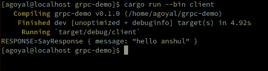
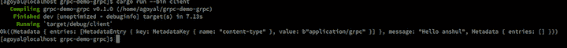

# Rust 和 gRPC:一个完整的指南

> 原文：<https://blog.logrocket.com/rust-and-grpc-a-complete-guide/>

gRPC 是 Google 开发的开源远程过程调用系统。gRPC 允许系统在数据中心内外进行通信，有效地将数据从移动设备、物联网设备和后端传输到其他设备。

gRPC 附带了对负载平衡、认证、跟踪等的可插拔支持。，支持 HTTP/2 上的双向流，并提供了 10 种语言的惯用实现。

此外，gRPC 可以生成高效的客户端库，并使用协议缓冲区格式通过网络传输数据。协议缓冲区是用于数据传输的二进制格式。因为协议缓冲区是二进制的，所以可以快速序列化。每个消息的结构必须预先定义。

## 防锈 gRPC 支架

Rust 社区开发了许多 gRPC 实现，特别是`tonic`和`grpc`机箱。两者都提供了 gRPC 协议的完整实现。

### 什么是`tonic`？

[`tonic`](https://crates.io/crates/tonic) 是一个快速生产就绪的 gRPC 库，开箱即可支持异步/等待。它注重灵活性和可靠性。`tonic`通过 HTTP/2 全面实施 gRPC 协议。`tonic`内置了对 Rustlang 编译协议缓冲区的支持。它还支持单向和双向流。

### 什么是`grpc`？

[`grpc`](https://crates.io/crates/grpc) 还没有做好生产准备但值得关注。机箱有一个有效的 gRPC 协议实现，并支持 TLS。

为了展示`tonic`和`grpc`的作用，我们来创建一个演示 gRPC 应用程序。

## 使用`tonic`构建 gRPC 应用程序

我们将从使用`cargo new grpc-demo-tonic`创建一个 Rust 项目开始。创建`src/server.rs`和`src/client.rs`来分别保存 gRPC 服务器和客户端的代码。我们将添加一个`build.rs`来编译协议缓冲区。

一些基本的样板文件，比如`build.rs`，是编译协议缓冲区对代码进行 Rust 所必需的。还需要对`Cargo.toml`和文件结构进行一些更改。

`Cargo.toml`:

```
[package]
name = "grpc-demo-tonic"
version = "0.1.0"
authors = ["anshul <[email protected]>"]
edition = "2018"

# See more keys and their definitions at https://doc.rust-lang.org/cargo/reference/manifest.html

[dependencies]

# server binary
[[bin]]
    name = "server"
    path = "src/server.rs"

# client binary
[[bin]]
    name = "client"
    path = "src/client.rs"

```

*文件结构*

```
├── build.rs
├── Cargo.lock
├── Cargo.toml
├── src
    ├── client.rs
    └── server.rs

```

首先创建一个协议缓冲文件。

```
    // version of protocol buffer used
    syntax = "proto3";

    // package name for the buffer will be used later
    package hello;

    // service which can be executed
    service Say {
    // function which can be called
      rpc Send (SayRequest) returns (SayResponse);
    }

    // argument
    message SayRequest {
    // data type and position of data
      string name = 1;
    }

    // return value
    message SayResponse {
    // data type and position of data
      string message = 1;
    }

We can include generated rust code in-app using `tonic`. Let’s create an `hello.rs` file to reuse in both server and client.

    // this would include code generated for package hello from .proto file
    tonic::include_proto!("hello");

```

### 使用`tonic`创建 gRPC 服务器

通过为结构实现`Say`特征来创建服务。该服务可能包括多个 RPC。由于 Rust 不支持异步特征，我们必须使用一个`asyc_trait`宏来克服这个限制。

将以下代码添加到`server.rs`。

```
    use tonic::{transport::Server, Request, Response, Status};
    use hello::say_server::{Say, SayServer};
    use hello::{SayResponse, SayRequest};
    mod hello; 

    // defining a struct for our service
    #[derive(Default)]
    pub struct MySay {}

    // implementing rpc for service defined in .proto
    #[tonic::async_trait]
    impl Say for MySay {
    // our rpc impelemented as function
        async fn send(&self,request:Request<SayRequest>)->Result<Response<SayResponse>,Status>{
    // returning a response as SayResponse message as defined in .proto
            Ok(Response::new(SayResponse{
    // reading data from request which is awrapper around our SayRequest message defined in .proto
                 message:format!("hello {}",request.get_ref().name),
            }))
        }
    }

    #[tokio::main]
    async fn main() -> Result<(), Box<dyn std::error::Error>> {
    // defining address for our service
        let addr = "[::1]:50051".parse().unwrap();
    // creating a service
        let say = MySay::default();
        println!("Server listening on {}", addr);
    // adding our service to our server.
        Server::builder()
            .add_service(SayServer::new(say))
            .serve(addr)
            .await?;
        Ok(())
    }

```

上面的例子使用`tokio`作为异步运行时和执行器。这个`MySay`结构实现了服务`Say`。由`tonic`提供的`Server`类型接受服务并在给定的地址上创建一个支持 gRPC 协议的 HTTP 服务器。

### 使用`tonic`创建 gRPC 客户端

因为 gRPC 以机器可读的格式定义请求和响应，所以我们不需要实现客户端代码。协议缓冲区编译器生成的代码已经包含了您可以通过直接导入来使用的客户端代码。

```
use hello::say_client::SayClient;
use hello::SayRequest;
mod hello;
#[tokio::main]
async fn main() -> Result<(), Box<dyn std::error::Error>> {
// creating a channel ie connection to server
    let channel = tonic::transport::Channel::from_static("http://[::1]:50051")
    .connect()
    .await?;
// creating gRPC client from channel
    let mut client = SayClient::new(channel);
// creating a new Request
    let request = tonic::Request::new(
        SayRequest {
           name:String::from("anshul")
        },
    );
// sending request and waiting for response
    let response = client.send(request).await?.into_inner();
    println!("RESPONSE={:?}", response);
    Ok(())
}

```



为了测试我们的小应用程序，运行`cargo run --bin server`，然后运行`cargo run --bin client`。

## 使用`grpc`构建 gRPC 应用程序

首先，使用`cargo new grpc-demo-grpc`创建一个 Rust 项目。我们需要添加两个二进制文件:服务器和客户端，就像在`tonic`演示中一样。我们还必须添加`proto/hello.proto`文件和`build.rs`

`Cargo.toml`:

```
[package]
name = "grpc-demo-grpc"
version = "0.1.0"
authors = ["anshul <[email protected]>"]
edition = "2018"

[[bin]]
name="server"
path="./src/server.rs"

[[bin]]
name="client"
path="./src/client.rs"

[dependencies]
protobuf        = "2"
httpbis         = { git = "https://github.com/stepancheg/rust-http2" }
grpc ="*"
grpc-protobuf="*"

[build-dependencies]
protoc-rust-grpc = "0.8.2"

```

`build.rs`:

`protoc_rust_grpc`需要`protoc`编译器中的路径变量。可以从[官网](https://grpc.io/docs/protoc-installation/)下载。

```
fn main() {
    // compile protocol buffer using protoc
    protoc_rust_grpc::Codegen::new()
    .out_dir("src")
    .input("./proto/hello.proto")
    .rust_protobuf(true)
    .run()
    .expect("error compiling protocol buffer");
}

```

### 使用`grpc`创建服务器

`grpc`板条箱的 API 与`tonic`板条箱的 API 非常相似。和`tonic`一样，`grpc`为 gRPC 通信生成代码。

为了创建服务，`Say`特征是在`struct`上实现的。被实现的`struct`被传递给由`grpc`机箱提供的`ServerBuilder`上的`add_server`方法。

```
use grpc::{ServerHandlerContext,ServerRequestSingle,ServerResponseUnarySink};
// importing generated gRPC code
use hello_grpc::*;
// importing types for messages
use hello::*;
mod hello;
mod hello_grpc;
struct MySay;
impl Say for MySay {
    // rpc for service
    fn send(
        &self,
        _: ServerHandlerContext,
        req: ServerRequestSingle<SayRequest>,
        resp: ServerResponseUnarySink<SayResponse>,
    ) -> grpc::Result<()> {
        // create Response
        let mut r = SayResponse::new();
        let name = if req.message.get_name().is_empty() {
            "world"
        } else {
            req.message.get_name()
        };
        // sent the response
        println!("greeting request from {}", name);
        r.set_message(format!("Hello {}", name));
        resp.finish(r)
    }
}

fn main() {

    let port =50051;
    // creating server
    let mut server = grpc::ServerBuilder::new_plain();
    // adding port to server for http
    server.http.set_port(port);
    // adding say service to server
    server.add_service(SayServer::new_service_def(MySay));
    // running the server
    let _server = server.build().expect("server");
    println!(
        "greeter server started on port {}",
        port,
    );
    // stopping the program from finishing
    loop {
        std::thread::park();
    }
}

```

### 使用`grpc`创建客户端

进行 RPC 调用就像创建客户机和发送数据一样简单。您只需创建一个请求并通过客户端发送它，然后等待响应。

```
use std::env;
use std::sync::Arc;

// importing generated gRPC code
use hello_grpc::*;
// importing types for messages
use hello::*;
mod hello;
mod hello_grpc;

use grpc::ClientStub;
use grpc::ClientStubExt;
use futures::executor;
fn main() {

    let name = "anshul";
    let port =50051;
    let client_conf = Default::default();
// create a client
    let client=SayClient::new_plain("::1", port, client_conf).unwrap();
// create request
    let mut req = SayRequest::new();
    req.set_name(name.to_string());
// send the request
    let resp = client
        .send(grpc::RequestOptions::new(), req)
        .join_metadata_result();
// wait for response
    println!("{:?}", executor::block_on(resp));
}

```



## 结论

Rust 对 gRPC 有极好的支持。特别是一个快速的、生产就绪的 gRPC 实施。

在本教程中，我们学习了如何使用`tonic`和`grpc`板条箱创建 gRPC 应用程序。我们探索了协议缓冲区，并演练了如何编译它来信任代码。

`tonic`和`grpc`都支持使用`nativetls`机箱进行基于 TLS 的认证。这只是冰山一角；`tonic`和`grpc`都几乎完全实现了错误处理、负载平衡和认证。

这里有一个快速的视觉对比:

| **功能** | **T2`tonic`** | **T2`grpc`** |
| 生产就绪 | 是 | 不 |
| 完全异步/等待支持 | 是 | 不 |
| 请求和响应流 | 是 | 是 |
| 基于 TLS 的身份验证 | 是 | 是 |

[log rocket](https://lp.logrocket.com/blg/rust-signup):Rust 应用的 web 前端的全面可见性

## 调试 Rust 应用程序可能很困难，尤其是当用户遇到难以重现的问题时。如果您对监控和跟踪 Rust 应用程序的性能、自动显示错误、跟踪缓慢的网络请求和加载时间感兴趣，

.

[try LogRocket](https://lp.logrocket.com/blg/rust-signup)

LogRocket 就像是网络和移动应用程序的 DVR，记录你的 Rust 应用程序上发生的一切。您可以汇总并报告问题发生时应用程序的状态，而不是猜测问题发生的原因。LogRocket 还可以监控应用的性能，报告客户端 CPU 负载、客户端内存使用等指标。

[](https://lp.logrocket.com/blg/rust-signup)

现代化调试 Rust 应用的方式— [开始免费监控](https://lp.logrocket.com/blg/rust-signup)。

Modernize how you debug your Rust apps — [start monitoring for free](https://lp.logrocket.com/blg/rust-signup).