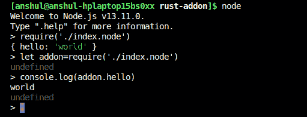
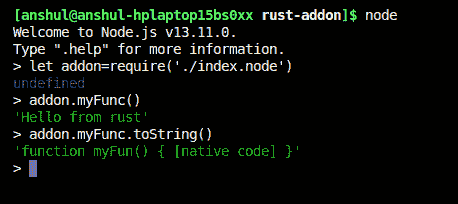
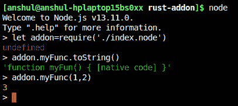
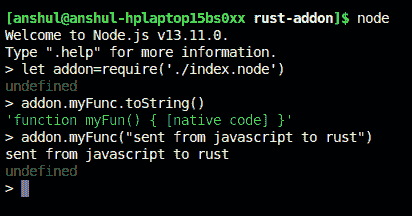

# Rust 和 Node.js:天作之合

> 原文：<https://blog.logrocket.com/rust-and-node-js-a-match-made-in-heaven/>

Node.js 是一个非常流行的用于编写后端应用程序的 JavaScript 运行时。它的灵活性和非阻塞特性使它成为 API 消费的首选。

由于它是一种脚本语言，JavaScript 可能相当慢。但得益于 V8 优化，对于实际应用来说已经足够快了。也就是说，Node.js 不适合重载；因为它是单线程的，所以阻塞主线程进行长时间的计算是很危险的。这就是[工作线程](https://blog.logrocket.com/node-js-multithreading-what-are-worker-threads-and-why-do-they-matter-48ab102f8b10/)的用武之地。Node.js 支持工作线程，因此可以用来执行长时间的计算。

尽管工作线程很棒，JavaScript 仍然很慢。此外，工作线程并非在所有受支持的 LTS 版本的 Node 中都可用。幸运的是，我们可以使用 Rust 为 Node.js 构建一个原生插件。FFI 是另一种选择，但它比插件方法慢。Rust 运行速度极快，并且具有无所畏惧的并发性。由于 Rust 有一个非常小的运行时(或者“非运行时”)，我们的二进制文件也应该非常小。

## 什么是铁锈？

Rust 是 Mozilla 开发的一种系统编程语言。默认情况下，它可以调用 C 库，并包括对将函数导出到 C 的一流支持。

Rust 为你提供了低级的控制和高级的人体工程学。它让您可以控制内存管理，而没有与这些控制相关的麻烦。它还提供零成本的抽象，因此您只需为您使用的东西付费。

Rust 可以通过各种方法在 Node.js 上下文中调用。我在下面列出了一些最广泛使用的。

*   你可以从 Node.js 和 Rust 中使用 FFI，但是这非常慢
*   您可以使用 WebAssembly 创建一个`node_module`，但是 Node.js 的所有功能都不可用
*   你可以使用本地插件

## 什么是本地插件？

Node.js 插件是用 C++编写的动态链接的共享对象。您可以使用`require()`函数将它们加载到 Node.js 中，并像普通 Node.js 模块一样使用它们。它们主要提供 Node.js 中运行的 JavaScript 和 C/C++库之间的接口。

一个本地插件提供了一个简单的接口，通过在 V8 运行时加载它来与另一个二进制文件一起工作。这是非常快速和安全的跨语言通话。目前，Node.js 支持两种类型的插件方法:C++插件和 N-API C++/C 插件。

### C++插件

C++插件是一个可以由 Node.js 挂载并在运行时使用的对象。由于 C++是编译语言，所以这些插件非常快。C++拥有大量可用于生产的库，可用于扩展 Node.js 生态系统。许多流行的库使用本地插件来提高性能和代码质量。

### N-API C++/C 插件

C++插件的主要问题是，每当底层 JavaScript 运行时发生变化时，都需要重新编译它们。这导致了维护插件的问题。N-API 试图通过引入标准应用程序二进制接口(ABI)来消除这种情况。C 头文件保持向后兼容。这意味着您可以将为 Node.js 的特定版本编译的插件与比编译它的版本更高的任何版本一起使用。你可以用这个方法来实现你的插件。

## 铁锈是从哪里来的？

Rust 可以模仿 C 库的行为。换句话说，它以 C 能够理解和使用的格式导出函数。Rust 调用 C 函数来访问和使用 Node.js 提供的 API。这些 API 提供了创建 JavaScript 字符串、数组、数字、错误、对象、函数等的方法。但是我们需要告诉 Rust 这些外部函数、结构、指针等等。看起来像。

```
#[repr(C)]
struct MyRustStruct {
    a: i32,
}
extern "C" fn rust_world_callback(target: *mut RustObject, a: i32) {
    println!("Function is called from C world", a);
    unsafe {
        // Do something on rust struct
        (*target).a = a;
    }
}
extern {
   fn register_callback(target: *mut MyRustStruct,
                        cb: extern fn(*mut MyRustStruct, i32)) -> i32;
   fn trigger_callback();
}

```

Rust 以不同的方式在内存中放置结构，所以我们需要告诉它使用 C 使用的样式。手工创建这些函数会很痛苦，所以我们将使用一个名为`nodejs-sys`的箱子，它使用`bindgen`为 N-API 创建一个很好的定义。

`bindgen`自动生成到 C 和 C++库的 Rust FFI 绑定。

注意:前面会有很多不安全的代码，大多是外部函数调用。


## 设置您的项目

对于本教程，您必须在系统上安装 [Node.js](https://nodejs.org/) 和 [Rust](https://www.rust-lang.org/) ，以及 [Cargo](https://github.com/rust-lang/cargo/) 和 [npm](https://www.npmjs.com/) 。我建议用 [Rustup](https://rustup.rs/) 安装 Rust，用 [nvm](https://github.com/nvm-sh/nvm) 安装 Node.js。

创建一个名为`rust-addon`的目录，并通过运行`npm init`初始化一个新的 npm 项目。接下来，启动一个名为`cargo init --lib`的货运项目。您的项目目录应该如下所示:

```
├── Cargo.toml
├── package.json
└── src
    └── lib.rs

```

### 配置 Rust 编译到插件

我们需要 Rust 编译成动态 C 库或对象。在 Linux 上配置 cargo 编译成`.so`文件，在 OS X 上编译成`.dylib`，在 Windows 上编译成`.dll`。Rust 可以使用 Rustc 标志或 Cargo 生成许多不同类型的库。

```
[package]
name = "rust-addon"
version = "0.1.0"
authors = ["Anshul Goyal <[email protected]>"]
edition = "2018"
# See more keys and their definitions at https://doc.rust-lang.org/cargo/reference/manifest.html

[lib]
crate-type=["cdylib"]

[dependencies]
nodejs-sys = "0.2.0"

```

`lib`键提供了配置 Rustc 的选项。`name`键以`lib{name}`的形式给出了共享对象的库名，而`type`提供了它应该被编译到的库的类型——例如`cdylib`、`rlib`等。创建一个动态链接的 C 库。这个共享对象的行为就像一个 C 库。

### N-API 入门

让我们创建我们的 N-API 库。我们需要添加一个依赖项。`nodejs-sys`提供`napi-header`文件所需的绑定。`napi_register_module_v1`是插件的入口点。 [N-API 文档](https://nodejs.org/api/n-api.html#n_api_module_registration)推荐`N-API_MODULE_INIT`宏用于模块注册，编译成`napi_register_module_v1`函数。

Node.js 调用这个函数，并给它提供一个名为`napi_env`的不透明指针，这个指针指的是 JavaScript 运行时的模块配置，还有`napi_value`。后者是另一个表示 JavaScript 值的不透明指针，实际上是一个称为导出的对象。这些导出与 JavaScript 中的`require`函数提供给 Node.js 模块的导出相同。

```
use nodejs_sys::{napi_create_string_utf8, napi_env, napi_set_named_property, napi_value};
use std::ffi::CString;
#[no_mangle]
pub unsafe extern "C" fn napi_register_module_v1(
    env: napi_env,
    exports: napi_value,
) -> nodejs_sys::napi_value {
// creating a C string
    let key = CString::new("hello").expect("CString::new failed");
// creating a memory location where the pointer to napi_value will be saved
    let mut local: napi_value = std::mem::zeroed();
// creating a C string
    let value = CString::new("world!").expect("CString::new failed");
// creating napi_value for the string
    napi_create_string_utf8(env, value.as_ptr(), 6, &mut local);
// setting the string on the exports object
    napi_set_named_property(env, exports, key.as_ptr(), local);
// returning the object 
    exports
}

```

Rust 用`String`类型表示自己拥有的字符串，用`str`原语表示借用的字符串片段。两者都是 UTF-8 编码，中间可能包含空字节。如果你看看组成字符串的字节，其中可能有一个`\0`。`String`和`str`都显式存储它们的长度；像 C 字符串一样，字符串末尾没有空终止符。

Rust 字符串与 C 中的字符串非常不同，所以我们需要将 Rust 字符串更改为 C 字符串，然后才能在 N-API 函数中使用 then。由于`exports`是由`exports`表示的对象，我们可以添加函数、字符串、数组或任何其他 JavaScript 对象作为键值对。

要向 JavaScript 对象添加一个键，可以使用 N-API `napi_set_named_property`提供的方法。这个函数接受我们想要添加属性的对象；指向将用作我们属性的键的字符串的指针；指向 JavaScript 值的指针，可以是字符串、数组等。；和`napi_env`，它充当 Rust 和 Node.js 之间的锚。

* * *

### 更多来自 LogRocket 的精彩文章:

* * *

您可以使用 N-API 函数来创建任何 JavaScript 值。例如，我们在这里使用`napi_create_string_utf8`来创建一个字符串。我们在环境中传递了一个指向字符串的指针，字符串的长度，以及一个指向空内存位置的指针，它可以在那里写入指向新创建的值的指针。所有这些代码都是不安全的，因为它包含了许多对外部函数的调用，而编译器不能提供 Rust 保证。最后，我们通过在模块上设置一个值为`world!`的属性，返回了提供给我们的模块。

重要的是要明白`nodejs-sys`只是为你正在使用的函数提供了必要的定义，而不是它们的实现。N-API 实现包含在 Node.js 中，您可以从 Rust 代码中调用它。

## 使用 Node.js 中的插件

下一步是为不同的操作系统添加链接配置，然后就可以编译它了。

创建一个`build.rs`文件来添加一些配置标志，用于链接不同操作系统上的 N-API 文件。

```
fn main() {
    println!("cargo:rustc-cdylib-link-arg=-undefined");
    if cfg!(target_os = "macos") {
        println!("cargo:rustc-cdylib-link-arg=dynamic_lookup");
    }
}

```

您的目录应该如下所示:

```
├── build.rs
├── Cargo.lock
├── Cargo.toml
├── index.node
├── package.json
├── src
    └── lib.rs

```

现在你需要编译你的 Rust 插件。您可以使用简单的命令`cargo build --release`非常容易地做到这一点。这将需要一些时间在第一次运行。

在您的模块被编译之后，从`./target/release/libnative.so`到您的根目录创建这个二进制文件的副本，并将其重命名为`index.node`。由 cargo 创建的二进制文件可能有不同的扩展名或名称，这取决于您的机箱设置和操作系统。

现在，您可以要求 Node.js 中的文件并使用它。您也可以在脚本中使用它。例如:

```
let addon=require('./index.node');
console.log(addon.hello);

```



接下来，我们将继续创建函数、数组和承诺，并使用`libuv thread-pool`在不阻塞主线程的情况下执行繁重的任务。

## 深入探究 N-API

现在您知道了如何使用 N-API 和 Rust 实现通用模式。一个非常常见的模式是导出函数，库或节点模块的用户可以调用它。让我们从创建一个函数开始。

您应该使用`napi_create_function`来创建您的函数，以便您可以从 Node.js 中使用它们。

### 创建函数

JavaScript 函数也由`napi_value`指针表示。N-API 函数非常容易创建和使用。

```
use nodejs_sys::{
    napi_callback_info, napi_create_function, napi_create_string_utf8, napi_env,
    napi_set_named_property, napi_value,
};
use std::ffi::CString;
pub unsafe extern "C" fn say_hello(env: napi_env, _info: napi_callback_info) -> napi_value {
// creating  a javastring string
    let mut local: napi_value = std::mem::zeroed();
    let p = CString::new("Hello from rust").expect("CString::new    failed");
    napi_create_string_utf8(env, p.as_ptr(), 13, &mut local);
// returning the javascript string
    local
}
#[no_mangle]
pub unsafe extern "C" fn napi_register_module_v1(
    env: napi_env,
    exports: napi_value,
) -> nodejs_sys::napi_value {
// creating a C String
    let p = CString::new("myFunc").expect("CString::new failed");
// creating a location where pointer to napi_value be written
    let mut local: napi_value = std::mem::zeroed();
    napi_create_function(
        env,
// pointer to function name
        p.as_ptr(),
// length of function name
        5,
// rust function
        Some(say_hello),
// context which can be accessed by the rust function
        std::ptr::null_mut(),
// output napi_value
        &mut local,
    );
// set function as property 
    napi_set_named_property(env, exports, p.as_ptr(), local);
// returning exports
    exports
}

```



在上面的例子中，我们在 Rust 中创建了一个名为`say_hello`的函数，当 JavaScript 调用这个函数时就会执行这个函数。我们使用`napi_create_function`创建了一个函数，它接受以下参数:

*   环境的`napi_env`价值
*   提供给 JavaScript 函数的函数名字符串
*   函数名字符串的长度
*   JavaScript 调用新创建的函数时执行的函数
*   用户稍后可以传递并从 Rust 函数中访问的上下文数据
*   一个空的内存地址，可以保存指向 JavaScript 函数的指针
*   当您创建这个函数时，将它作为属性添加到您的`exports`对象，这样您就可以在 JavaScript 中使用它

Rust 端的函数必须具有与示例中所示相同的签名。接下来我们将讨论如何使用`napi_callback_info`访问函数内部的参数。我们可以通过函数和其他参数来访问它。

### 访问参数

函数参数非常重要。N-API 提供了访问这些参数的方法。`napi_callback_info`在代码的 JavaScript 端向指针提供函数的详细信息。

```
use nodejs_sys::{
    napi_callback_info, napi_create_double, napi_create_function, napi_env, napi_get_cb_info,
    napi_get_value_double, napi_set_named_property, napi_value,
};
use std::ffi::CString;

pub unsafe extern "C" fn add(env: napi_env, info: napi_callback_info) -> napi_value {
// creating a buffer where napi_value of argument be written
    let mut buffer: [napi_value; 2] = std::mem::MaybeUninit::zeroed().assume_init();
// max number of arguments
    let mut argc = 2 as usize;
// getting arguments and value of this
    napi_get_cb_info(
        env,
        info,
        &mut argc,
        buffer.as_mut_ptr(),
        std::ptr::null_mut(),
        std::ptr::null_mut(),
    );
// converting napi to f64
    let mut x = 0 as f64;
    let mut y = 0 as f64;
    napi_get_value_double(env, buffer[0], &mut x);
    napi_get_value_double(env, buffer[1], &mut y);
// creating the return value
    let mut local: napi_value = std::mem::zeroed();
    napi_create_double(env, x + y, &mut local);
// returning the result
    local
}

#[no_mangle]
pub unsafe extern "C" fn napi_register_module_v1(
    env: napi_env,
    exports: napi_value,
) -> nodejs_sys::napi_value {
// creating a function name
    let p = CString::new("myFunc").expect("CString::new failed");
    let mut local: napi_value = std::mem::zeroed();
// creating the function
    napi_create_function(
        env,
        p.as_ptr(),
        5,
        Some(add),
        std::ptr::null_mut(),
        &mut local,
    );
// setting function as property
    napi_set_named_property(env, exports, p.as_ptr(), local);
// returning exports
    exports
}

```



使用`napi_get_cb_info`获取参数。必须提供以下参数:

*   `napi_env`
*   信息指针
*   预期参数的数量
*   参数可以写成`napi_value`的缓冲区
*   存储用户在创建 JavaScript 函数时提供的元数据的内存位置
*   可以写入该值指针的内存位置

我们需要创建一个带有内存位置的数组，在这里 C 可以写一个指向参数的指针，我们可以将这个指针缓冲区传递给 N-API 函数。我们也得到`this`，但是在这个例子中我们没有使用它。

### 使用字符串参数

大多数时候，您需要在 JavaScript 中处理字符串。创建和获取字符串的值都非常简单。使用`napi_get_value_string_utf8`并调用这个函数两次:第一次获取长度，第二次获取字符串的值。

```
use nodejs_sys::{
    napi_callback_info, napi_create_function, napi_env, napi_get_cb_info, napi_get_undefined,
    napi_get_value_string_utf8, napi_set_named_property, napi_value,
};

use std::ffi::CString;

pub unsafe extern "C" fn print(env: napi_env, info: napi_callback_info) -> napi_value {
// creating a buffer of arguments
    let mut buffer: [napi_value; 1] = std::mem::MaybeUninit::zeroed().assume_init();
    let mut argc = 1 as usize;
// getting arguments
    napi_get_cb_info(
        env,
        info,
        &mut argc,
        buffer.as_mut_ptr(),
        std::ptr::null_mut(),
        std::ptr::null_mut(),
    );
    let mut len = 0;
// getting length by passing null buffer
    napi_get_value_string_utf8(env, buffer[0], std::ptr::null_mut(), 0, &mut len);
    let size = len as usize;
// creating a buffer where string can be placed
    let mut ve: Vec<u8> = Vec::with_capacity(size + 1);
    let raw = ve.as_mut_ptr();
// telling rust not manage the vector
    std::mem::forget(ve);
    let mut cap = 0;
// getting the string value from napi_value
    let _s = napi_get_value_string_utf8(env, buffer[0], raw as *mut i8, size + 1, &mut cap);
    let s = String::from_raw_parts(raw, cap as usize, size);
// printing the string
    println!("{}", s);
// creating an undefined
    let mut und: napi_value = std::mem::zeroed();
    napi_get_undefined(env, &mut und);
// returning undefined
    und
}

#[no_mangle]
pub unsafe extern "C" fn napi_register_module_v1(
    env: napi_env,
    exports: napi_value,
) -> nodejs_sys::napi_value {
    let p = CString::new("myFunc").expect("CString::new failed");
    let mut local: napi_value = std::mem::zeroed();
    napi_create_function(
        env,
        p.as_ptr(),
        5,
        Some(print),
        std::ptr::null_mut(),
        &mut local,
    );
    napi_set_named_property(env, exports, p.as_ptr(), local);
    exports
}

```



您需要向`napi_create_string_utf8`传递一些参数来创建一个字符串。如果将空指针作为缓冲区传递，则给出字符串的长度。下列参数是必需的:

*   `napi_env`
*   `napi_value`指针指向`javascript side`中的字符串
*   如果 null 给出了字符串的长度，则将字符串写入的缓冲区
*   缓冲区的长度
*   写入缓冲区的字节数

## 使用 promises 和 libuv 线程池

阻塞 Node.js 的主线程来做计算并不是一个好主意。您可以使用 libuv 线程来完成繁重的工作。

首先，创造一个承诺。承诺会根据你工作的成功来拒绝或解决。为此，您需要创建三个函数。第一个函数从 JavaScript 世界调用，控制权将传递给第二个函数，第二个函数运行在 libuv 线程上，不能访问 JavaScript。第三个函数可以访问 JavaScript 端，在第二个函数完成后调用。您可以对 libuv 线程使用`napi_create_async_work`方法。

### 创造承诺

要创建承诺，只需使用`napi_create_promise`。这将提供一个指针`napi_deferred`，它可以使用以下函数解决或拒绝承诺:

*   `napi_resolve_deferred`
*   `napi_reject_deferred`

### 错误处理

您可以使用`napi_create_error`和`napi_throw_error`从 Rust 代码中创建并抛出一个错误。每个 N-API 函数都返回一个`napi_status`，应该检查。

### 真实代码

以下示例显示了如何调度异步工作。

```
use nodejs_sys::{
    napi_async_work, napi_callback_info, napi_create_async_work, napi_create_error,
    napi_create_function, napi_create_int64, napi_create_promise, napi_create_string_utf8,
    napi_deferred, napi_delete_async_work, napi_env, napi_get_cb_info, napi_get_value_int64,
    napi_queue_async_work, napi_reject_deferred, napi_resolve_deferred, napi_set_named_property,
    napi_status, napi_value,
};
use std::ffi::c_void;
use std::ffi::CString;

#[derive(Debug, Clone)]
struct Data {
    deferred: napi_deferred,
    work: napi_async_work,
    val: u64,
    result: Option<Result<u64, String>>,
}

pub unsafe extern "C" fn feb(env: napi_env, info: napi_callback_info) -> napi_value {
    let mut buffer: Vec<napi_value> = Vec::with_capacity(1);
    let p = buffer.as_mut_ptr();
    let mut argc = 1 as usize;
    std::mem::forget(buffer);
    napi_get_cb_info(
        env,
        info,
        &mut argc,
        p,
        std::ptr::null_mut(),
        std::ptr::null_mut(),
    );
    let mut start = 0;
    napi_get_value_int64(env, *p, &mut start);
    let mut promise: napi_value = std::mem::zeroed();
    let mut deferred: napi_deferred = std::mem::zeroed();
    let mut work_name: napi_value = std::mem::zeroed();
    let mut work: napi_async_work = std::mem::zeroed();
    let async_name = CString::new("async fibonaci").expect("Error creating string");
    napi_create_string_utf8(env, async_name.as_ptr(), 13, &mut work_name);
    napi_create_promise(env, &mut deferred, &mut promise);
    let v = Data {
        deferred,
        work,
        val: start as u64,
        result: None,
    };
    let data = Box::new(v);
    let raw = Box::into_raw(data);
    napi_create_async_work(
        env,
        std::ptr::null_mut(),
        work_name,
        Some(perform),
        Some(complete),
        std::mem::transmute(raw),
        &mut work,
    );
    napi_queue_async_work(env, work);
    (*raw).work = work;
    promise
}

pub unsafe extern "C" fn perform(_env: napi_env, data: *mut c_void) {
    let mut t: Box<Data> = Box::from_raw(std::mem::transmute(data));
    let mut last = 1;
    let mut second_last = 0;
    for _ in 2..t.val {
        let temp = last;
        last = last + second_last;
        second_last = temp;
    }
    t.result = Some(Ok(last));
    Box::into_raw(task);
}

pub unsafe extern "C" fn complete(env: napi_env, _status: napi_status, data: *mut c_void) {
    let t: Box<Data> = Box::from_raw(std::mem::transmute(data));
    let v = match t.result {
        Some(d) => match d {
            Ok(result) => result,
            Err(_) => {
                let mut js_error: napi_value = std::mem::zeroed();
                napi_create_error(
                    env,
                    std::ptr::null_mut(),
                    std::ptr::null_mut(),
                    &mut js_error,
                );
                napi_reject_deferred(env, t.deferred, js_error);
                napi_delete_async_work(env, t.work);
                return;
            }
        },
        None => {
            let mut js_error: napi_value = std::mem::zeroed();
            napi_create_error(
                env,
                std::ptr::null_mut(),
                std::ptr::null_mut(),
                &mut js_error,
            );
            napi_reject_deferred(env, t.deferred, js_error);
            napi_delete_async_work(env, t.work);
            return;
        }
    };
    let mut obj: napi_value = std::mem::zeroed();
    napi_create_int64(env, v as i64, &mut obj);
    napi_resolve_deferred(env, t.deferred, obj);

    napi_delete_async_work(env, t.work);
}

#[no_mangle]
pub unsafe extern "C" fn napi_register_module_v1(
    env: napi_env,
    exports: napi_value,
) -> nodejs_sys::napi_value {
    let p = CString::new("myFunc").expect("CString::new failed");
    let mut local: napi_value = std::mem::zeroed();
    napi_create_function(
        env,
        p.as_ptr(),
        5,
        Some(feb),
        std::ptr::null_mut(),
        &mut local,
    );
    napi_set_named_property(env, exports, p.as_ptr(), local);
    exports
}

```

我们创建了一个结构来存储指向我们的`napi_async_work`和`napi_deferred`以及输出的指针。最初，输出是`None`。然后我们创建了一个承诺，它提供了一个保存在我们的数据中的`deferred`。这些数据在我们所有的功能中都是可用的。

接下来，我们将数据转换成原始数据，并通过其他回调函数将其传递给`napi_create_async_work`函数。我们返回我们创建的承诺，执行`perform`，并将我们的数据转换回 struct。

一旦`perform`在 libuv 线程上完成，就会从主线程中调用`complete`，以及之前操作的状态和我们的数据。现在，我们可以拒绝或解决我们的工作，并从队列中删除工作。

## 让我们浏览一下代码

创建一个名为`feb`的函数，它将被导出到 JavaScript。这个函数将返回一个承诺，并为 libuv 线程池调度工作。

您可以通过创建一个承诺，使用`napi_create_async_work`，并向其传递两个函数来实现这一点。一个在 libuv 线程上执行，另一个在主线程上执行。

因为您只能从主线程执行 JavaScript，所以您必须只从主线程解析或拒绝承诺。代码包含大量不安全的函数。

### `feb`功能

```
pub unsafe extern "C" fn feb(env: napi_env, info: napi_callback_info) -> napi_value {
    let mut buffer: Vec<napi_value> = Vec::with_capacity(1);
    let p = buffer.as_mut_ptr();
    let mut argc = 1 as usize;
    std::mem::forget(buffer);
// getting arguments for the function
    napi_get_cb_info(
        env,
        info,
        &mut argc,
        p,
        std::ptr::null_mut(),
        std::ptr::null_mut(),
    );
    let mut start = 0;
// converting the napi_value to u64 number
    napi_get_value_int64(env, *p, &mut start);
// promise which would be returned
    let mut promise: napi_value = std::mem::zeroed();
// a pointer to promise to resolve is or reject it
    let mut deferred: napi_deferred = std::mem::zeroed();
// a pointer to our async work name used for debugging
    let mut work_name: napi_value = std::mem::zeroed();
// pointer to async work 
    let mut work: napi_async_work = std::mem::zeroed();
    let async_name = CString::new("async fibonaci").expect("Error creating string");
// creating a string for name
    napi_create_string_utf8(env, async_name.as_ptr(), 13, &mut work_name);
// creating a promise
    napi_create_promise(env, &mut deferred, &mut promise);
    let v = Data {
        deferred,
        work,
        val: start as u64,
        result: None,
    };
// creating a context which can be saved to share state between our functions
    let data = Box::new(v);
// converting it to raw pointer
    let raw = Box::into_raw(data);
// creating the work
    napi_create_async_work(
        env,
        std::ptr::null_mut(),
        work_name,
        Some(perform),
        Some(complete),
        std::mem::transmute(raw),
        &mut work,
    );
// queuing to execute the work
    napi_queue_async_work(env, work);
// setting pointer to work that can be used later
    (*raw).work = work;
// retuning the pormise
    promise
}

```

### `perform`功能

```
pub unsafe extern "C" fn perform(_env: napi_env, data: *mut c_void) {
// getting the shared data and converting the in box
    let mut t: Box<Data> = Box::from_raw(std::mem::transmute(data));
    let mut last = 1;
    let mut second_last = 0;
    for _ in 2..t.val {
        let temp = last;
        last = last + second_last;
        second_last = temp;
    }
// setting the result on shared context
    t.result = Some(Ok(last));
// telling the rust to not to drop the context data
    Box::into_raw(t);
}

```

### `complete`功能

```
pub unsafe extern "C" fn complete(env: napi_env, _status: napi_status, data: *mut c_void) {
// getting the shared context
    let t: Box<Data> = Box::from_raw(std::mem::transmute(data));
    let v = match task.result {
        Some(d) => match d {
            Ok(result) => result,
            Err(_) => {
// if there is error just throw an error
// creating error
                let mut js_error: napi_value = std::mem::zeroed();
                napi_create_error(
                    env,
                    std::ptr::null_mut(),
                    std::ptr::null_mut(),
                    &mut js_error,
                );
// rejecting the promise with error
                napi_reject_deferred(env, task.deferred, js_error);
// deleting the task from the queue
                napi_delete_async_work(env, task.work);
                return;
            }
        },
        None => {
// if no result is found reject with error
// creating an error
            let mut js_error: napi_value = std::mem::zeroed();
            napi_create_error(
                env,
                std::ptr::null_mut(),
                std::ptr::null_mut(),
                &mut js_error,
            );
// rejecting promise with error
            napi_reject_deferred(env, task.deferred, js_error);
// deleting the task from queue
            napi_delete_async_work(env, task.work);
            return;
        }
    };
// creating the number
    let mut obj: napi_value = std::mem::zeroed();
    napi_create_int64(env, v as i64, &mut obj);
// resolving the promise with result
    napi_resolve_deferred(env, t.deferred, obj);
// deleting the work
    napi_delete_async_work(env, t.work);
}

```

## 结论

说到可以用 N-API 做什么，这只是冰山一角。我们讨论了一些模式并涵盖了基础知识，比如如何导出函数，创建常用的 JavaScript 类型，比如字符串、数字、数组、对象等。，获取函数的上下文(即获取函数中的参数和`this`)等。

我们还深入研究了如何使用`libuv`线程并创建一个`async_work`来在后台执行繁重的计算。最后，我们创建并使用了 JavaScript 的 promises，并学习了如何在 N-API 中进行错误处理。

如果你不想手工编写所有的代码，有很多库可供使用。这些提供了很好的抽象，但是缺点是它们不支持所有的特性。

## 200 只显示器出现故障，生产中网络请求缓慢

部署基于节点的 web 应用程序或网站是容易的部分。确保您的节点实例继续为您的应用程序提供资源是事情变得更加困难的地方。如果您对确保对后端或第三方服务的请求成功感兴趣，

[try LogRocket](https://lp.logrocket.com/blg/node-signup)

.

[](https://lp.logrocket.com/blg/node-signup)[https://logrocket.com/signup/](https://lp.logrocket.com/blg/node-signup)

LogRocket 就像是网络和移动应用程序的 DVR，记录下用户与你的应用程序交互时发生的一切。您可以汇总并报告有问题的网络请求，以快速了解根本原因，而不是猜测问题发生的原因。

LogRocket 检测您的应用程序以记录基线性能计时，如页面加载时间、到达第一个字节的时间、慢速网络请求，还记录 Redux、NgRx 和 Vuex 操作/状态。

[Start monitoring for free](https://lp.logrocket.com/blg/node-signup)

.