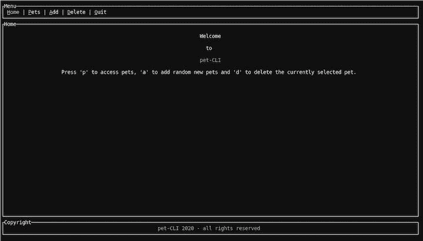
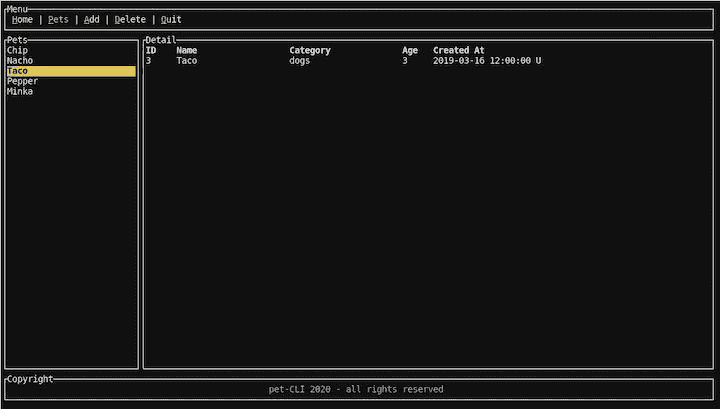

# Rust 和 TUI:在 Rust - LogRocket 博客中构建命令行界面

> 原文：<https://blog.logrocket.com/rust-and-tui-building-a-command-line-interface-in-rust/>

Rust 是一种低级系统编程语言，具有良好的交叉编译支持，这使它成为编写命令行应用程序的主要候选语言。突出的例子从广泛使用的工具如 [ripgrep](https://github.com/BurntSushi/ripgrep) 、 [exa](https://github.com/ogham/exa) 和 [bat](https://github.com/sharkdp/bat) 的重新实现到成熟的终端 UI 工具如 [GitUI](https://github.com/extrawurst/gitui) 、 [Spotify TUI](https://github.com/Rigellute/spotify-tui) 、 [Bandwhich](https://github.com/imsnif/bandwhich) 、 [KMon](https://github.com/orhun/kmon) 和 [Diskonaut](https://github.com/imsnif/diskonaut) 。

有了 [Alacritty](https://github.com/alacritty/alacritty) 和 [Nushell](https://github.com/nushell/nushell) ，甚至还有流行的 shell 实现可用。这种保持稳定增长的工具过剩的一些原因包括[在 Rust 中重写它(RIIR) meme](https://transitiontech.ca/random/RIIR) 和编写命令行应用 Rust 的奇妙生态系统。

当谈到 Rust 的 CLIs 库生态系统时，我想特别提到 [Clap](https://github.com/clap-rs/clap) 和 [TUI](https://github.com/fdehau/tui-rs) ，它们都是主食，并且在前面提到的许多工具中使用。Clap 是一个命令行解析器，它有一个奇妙的 API 和大量可用的特性，如果不需要的话，可以禁用其中的许多特性以加快编译速度。

## TUI 是什么？

TUI 基本上是一个构建终端用户界面的框架。它支持几个“后端”来绘制到终端。这些后端接管与终端交互的实际逻辑，例如设置正确的字符、清除屏幕等。，而 TUI 是一个更高级的界面，它提供小部件和其他助手来组成用户界面。

在本教程中，我们将看看如何使用 TUI 实现一个简单的终端应用程序，并将 [Crossterm](https://github.com/crossterm-rs/crossterm) 作为后端。除了渲染和事件处理管道的初始设置之外，我们不会直接与 Crossterm 交互，因此该示例应该只需对其他 TUI 后端进行最小的更改。

为了演示 TUI 如何工作，我们将构建一个简单的应用程序，使用本地 JSON 文件存储数据来管理您的宠物。成品看起来会像这样:





第一个图像显示了带有菜单的欢迎屏幕。菜单中突出显示的字符显示了用户执行操作所需的热键。选择`p`后，用户将进入第二个屏幕(宠物)，在这里他们可以管理自己的宠物。用户可以浏览列表，使用`a`添加随机的新宠物，使用`d`删除当前选择的宠物。按下`q`关闭应用程序。

该应用程序相当简单，但足以展示 TUI 如何工作以及如何构建这样一个应用程序的基本模块。使用我为本教程编写的 [Rust 命令行示例](https://github.com/zupzup/rust-commandline-example) [代码](https://github.com/zupzup/rust-commandline-example)，您可以通过编辑来扩展它，添加一个添加新宠物的表单，等等。

使用 TUI 时，应用程序可以调整大小，它会相应地改变，保持不同 UI 元素的配置比例不变。这是 TUI 在使用现有小部件时做的许多事情之一。

事不宜迟，我们开始吧！

## 设置我们的 Rust 应用

接下来，你所需要的只是一个最近的 Rust 安装(1.45+；撰写本文时的最新版本是 [Rust 1.49.0](https://blog.rust-lang.org/2020/12/31/Rust-1.49.0.html) 。

首先，创建一个新的 Rust 项目:

```
cargo new rust-cli-example
cd rust-cli-example

```

接下来，编辑`Cargo.toml`文件并添加您需要的依赖项:

```
[dependencies]
crossterm = { version = "0.19", features = [ "serde" ] }
serde = {version = "1.0", features = ["derive"] }
serde_json = "1.0"
chrono = { version = "0.4", features = ["serde"] }
rand = { version = "0.7.3", default-features = false, features = ["std"] }
tui = { version = "0.14", default-features = false, features = ['crossterm', 'serde'] }
thiserror = "1.0"

```

除了使用以 Crossterm 为后端的 TUI 库之外。我们还将使用 [Serde](https://blog.logrocket.com/json-and-rust-why-serde_json-is-the-top-choice/) 来处理 JSON， [Chrono](https://blog.logrocket.com/timezone-handling-in-rust-with-chrono-tz/) 来处理宠物的创建日期， [Rand](https://blog.logrocket.com/rust-cryptography-libraries-a-comprehensive-list/#rngs) 来创建新的随机数据。

正如您在上面的配置中看到的，我们在 TUI 中选择了`crossterm`和`serde`功能。

让我们从定义一些基本的数据结构和常数开始。

## 定义数据结构

首先，让我们为本地“数据库”JSON 文件定义一个常量，并为宠物的外观定义一个结构:

```
const DB_PATH: &str = "./data/db.json";

#[derive(Serialize, Deserialize, Clone)]
struct Pet {
    id: usize,
    name: String,
    category: String,
    age: usize,
    created_at: DateTime<Utc>,
}

```

在处理数据库文件时，我们可能会遇到 I/O 错误。虽然在 UI 中对所有可能的错误实现完整的错误处理超出了我们的范围，但是我们仍然希望有一些内部错误类型:

```
#[derive(Error, Debug)]
pub enum Error {
    #[error("error reading the DB file: {0}")]
    ReadDBError(#[from] io::Error),
    #[error("error parsing the DB file: {0}")]
    ParseDBError(#[from] serde_json::Error),
}

```

`db.json`文件只是一列`Pet`结构的 JSON 表示:

```
[
    {
        "id": 1,
        "name": "Chip",
        "category": "cats",
        "age": 4,
        "created_at": "2020-09-01T12:00:00Z"
    },
    ...
]

```

我们还需要一个用于输入事件的数据结构。我们将使用在 [TUI 示例](https://github.com/fdehau/tui-rs/tree/master/examples)存储库中的跨术语示例中使用的相同方法。

```
enum Event<I> {
    Input(I),
    Tick,
}

```

事件或者是来自用户的输入，或者仅仅是一个`tick`。我们将定义一个滴答率(例如，200 毫秒)，如果在这个滴答率内没有输入事件发生，我们将发出一个`Tick`。否则，将发出输入。

最后，让我们为菜单结构定义一个`enum`,这样我们可以很容易地确定我们在应用程序中的位置:

```
#[derive(Copy, Clone, Debug)]
enum MenuItem {
    Home,
    Pets,
}

impl From<MenuItem> for usize {
    fn from(input: MenuItem) -> usize {
        match input {
            MenuItem::Home => 0,
            MenuItem::Pets => 1,
        }
    }
}

```

我们现在只有两个页面——家和宠物——我们实现了一种方法将它们转换成`usize`。这使我们能够使用 TUI 的`Tabs`组件中的 enum 来突出显示菜单中当前选中的选项卡。

完成初始设置后，让我们来设置 TUI 和 Crossterm，这样我们就可以开始将内容呈现到屏幕上，并对用户事件做出反应。

## 渲染和输入

首先，将终端设置为`raw`(或非匿名)模式，这样就不需要等待用户的`Enter`来对输入做出反应。

```
fn main() -> Result<(), Box<dyn std::error::Error>> {
    enable_raw_mode().expect("can run in raw mode");
...

```

接下来，建立一个`mpsc`(多生产者，单消费者)通道，在输入处理器和呈现循环之间进行通信。

```
    let (tx, rx) = mpsc::channel();
    let tick_rate = Duration::from_millis(200);
    thread::spawn(move || {
        let mut last_tick = Instant::now();
        loop {
            let timeout = tick_rate
                .checked_sub(last_tick.elapsed())
                .unwrap_or_else(|| Duration::from_secs(0));

            if event::poll(timeout).expect("poll works") {
                if let CEvent::Key(key) = event::read().expect("can read events") {
                    tx.send(Event::Input(key)).expect("can send events");
                }
            }

            if last_tick.elapsed() >= tick_rate {
                if let Ok(_) = tx.send(Event::Tick) {
                    last_tick = Instant::now();
                }
            }
        }
    });

```

创建通道后，定义前面提到的 tick rate 并生成一个线程。这是我们做输入循环的地方。这个代码片段是使用 TUI 和 Crossterm 设置输入循环的推荐方法。

这个想法是计算下一个滴答(`timeout`)，然后使用`event::poll`等待事件发生的时间，如果有一个事件，通过我们的通道发送用户按下的键的输入事件。

如果在这个超时时间内没有用户事件发生，我们只需发送一个`Tick`事件并从头开始。使用`tick_rate`，您可以调整应用程序的响应能力。但是设置太低也意味着这个循环会运行很多，会耗尽资源。

这个逻辑产生在另一个线程中，因为我们需要主线程来呈现应用程序。这样，我们的输入循环就不会阻碍渲染。

使用`Crossterm`后端设置 TUI `Terminal`需要一些步骤:

```
    let stdout = io::stdout();
    let backend = CrosstermBackend::new(stdout);
    let mut terminal = Terminal::new(backend)?;
    terminal.clear()?;

```

我们使用`stdout`定义了一个`CrosstermBackend`，并在一个 TUI `Terminal`中使用它，最初清除它并隐式检查一切正常。如果其中任何一个失败了，我们只是惊慌失措，应用程序停止；这里真的没有什么好的反应方式，因为我们没有对事件渲染做任何改变。

这就结束了我们需要创建一个输入循环和一个我们可以使用的终端的样板设置。

让我们构建我们的第一个 UI 元素——基于标签的菜单！

* * *

### 更多来自 LogRocket 的精彩文章:

* * *

在创建菜单之前，我们需要实现一个渲染循环，在每次迭代中调用`terminal.draw()`。

```
    loop {
        terminal.draw(|rect| {
            let size = rect.size();
            let chunks = Layout::default()
                .direction(Direction::Vertical)
                .margin(2)
                .constraints(
                    [
                        Constraint::Length(3),
                        Constraint::Min(2),
                        Constraint::Length(3),
                    ]
                    .as_ref(),
                )
                .split(size);
...

```

我们为`draw`函数提供了一个闭包，它接收一个`Rect`。这只是 TUI 中使用的矩形的布局原语，用于定义小部件应该呈现在哪里。

下一步是定义我们布局的`chunks`。我们有一个传统的垂直布局，有三个盒子:

1.  菜单
2.  内容
3.  页脚

我们可以在 TUI 中使用一个`Layout`来定义它，设置方向和一些约束。这些约束定义了布局的不同部分应该如何组成。在我们的例子中，我们将菜单部分定义为长度 3(基本上有三行)，中间的内容部分至少为 2，页脚为 3。这意味着，如果你全屏运行这个应用程序，菜单和页脚将始终保持三行的高度，而内容部分将增长到其余的大小。

这些约束是一个强大的系统，还有设置百分比和比率的选项，我们稍后会看到。最后，我们将布局分割成布局块。

在我们的布局中，最简单的 UI 组件是带有假版权的静态页脚，所以让我们从它开始，感受一下如何创建和呈现小部件:

```
            let copyright = Paragraph::new("pet-CLI 2020 - all rights reserved")
                .style(Style::default().fg(Color::LightCyan))
                .alignment(Alignment::Center)
                .block(
                    Block::default()
                        .borders(Borders::ALL)
                        .style(Style::default().fg(Color::White))
                        .title("Copyright")
                        .border_type(BorderType::Plain),
                );

            rect.render_widget(copyright, chunks[2]);

```

我们使用`Paragraph`小部件，它是 TUI 中许多预先存在的[小部件](https://docs.rs/tui/latest/tui/widgets/index.html)之一。我们用硬编码的文本定义段落，通过在默认样式上使用`.fg`使用不同的前景色来设置样式，将对齐设置为居中，然后定义一个块。

这个块很重要，因为它是一个“基础”小部件，这意味着它可以被所有其他小部件用来渲染。一个`block`定义了一个区域，您可以在这个区域中放置一个标题和一个可选的边框，围绕您在框内呈现的内容。

在本例中，我们创建了一个标题为“Copyright”的框，它有完整的边框来创建我们漂亮的三框垂直布局。

然后，我们使用我们的`draw`方法的`rect`并调用`render_widget`，将我们的段落渲染为`chunks[2]`，这是布局的第三部分(底部)。

这就是在 TUI 中呈现小部件的全部内容。很简单，对吧？

### 构建基于选项卡的菜单

现在我们终于可以处理基于标签的菜单了。幸运的是，TUI 自带了一个开箱即用的小部件，我们不需要做太多就能让它工作。为了管理关于哪个菜单项是活动的状态，我们需要在呈现循环之前添加两行:

```
...
    let menu_titles = vec!["Home", "Pets", "Add", "Delete", "Quit"];
    let mut active_menu_item = MenuItem::Home;
...
loop {
    terminal.draw(|rect| {
...

```

在第一行中，我们定义了硬编码的菜单标题，`active_menu_item`存储当前选中的菜单项，最初将其设置为`Home`。

因为我们只有两个页面，所以这只会被设置为`Home`或`Pets`，但是您可以想象这种方法如何用于基本的顶级路由。

为了呈现菜单，我们首先需要创建一个包含菜单标签的`Span`(是的，就像 [HTML `<span>`标签](https://blog.logrocket.com/html-tags-every-frontend-developer-should-know/))元素的列表，然后将它们放在`Tabs`小部件中:

```
            let menu = menu_titles
                .iter()
                .map(|t| {
                    let (first, rest) = t.split_at(1);
                    Spans::from(vec![
                        Span::styled(
                            first,
                            Style::default()
                                .fg(Color::Yellow)
                                .add_modifier(Modifier::UNDERLINED),
                        ),
                        Span::styled(rest, Style::default().fg(Color::White)),
                    ])
                })
                .collect();

            let tabs = Tabs::new(menu)
                .select(active_menu_item.into())
                .block(Block::default().title("Menu").borders(Borders::ALL))
                .style(Style::default().fg(Color::White))
                .highlight_style(Style::default().fg(Color::Yellow))
                .divider(Span::raw("|"));

            rect.render_widget(tabs, chunks[0]);

```

我们遍历硬编码的菜单标签，对于每个标签，我们在第一个字符处分割字符串。我们这样做是为了使第一个字符的样式不同，给它不同的颜色和下划线，以向用户表明，这是他们需要键入的字符，以便激活该菜单项。

这个操作的结果是一个`Spans`元素，它只是一个`Span`的列表。这只不过是多段可选样式的文本。这些跨度然后被放入一个`Tabs`小部件中。

我们用`active_menu_item`调用`.select()`，设置一个高亮样式，和普通样式不一样。这意味着，如果一个菜单项被选中，它将完全是黄色的，而未被选中的菜单项只有第一个字符是黄色的，其余的都是白色的。我们还定义了一个分割线，并再次设置了一个带有边框和标题的基本块，以保持我们的风格一致。

与版权相同，我们使用`chunks[0]`将选项卡菜单呈现在布局的第一部分。

现在我们的三个布局元素中的两个完成了。然而，我们在这里用`active_menu_item`定义了一个有状态的元素，作为元素应该是活动的存储。这是如何改变的呢？

接下来让我们看看输入处理来解开这个谜。

## 在 TUI 中处理输入

在呈现`loop {}`中，在`terminal.draw()`调用完成后，我们添加了另一段代码:我们的输入处理。

这意味着我们总是首先呈现当前状态，然后对新的输入做出反应。我们通过简单地等待`channel`接收端的输入来实现这一点，这是我们在开始时设置的:

```
        match rx.recv()? {
            Event::Input(event) => match event.code {
                KeyCode::Char('q') => {
                    disable_raw_mode()?;
                    terminal.show_cursor()?;
                    break;
                }
                KeyCode::Char('h') => active_menu_item = MenuItem::Home,
                KeyCode::Char('p') => active_menu_item = MenuItem::Pets,
                _ => {}
            },
            Event::Tick => {}
        }
} // end of render loop

```

当一个事件进来时，我们匹配进来的键码。如果用户按下`q`，我们想关闭 app，也就是说我们想清理，所以我们把终端以拿到的状态还回去。在现实世界的应用程序中，这种清理也应该发生在任何致命错误上。否则，终端停留在原始模式，看起来会很混乱。

我们禁用原始模式并再次显示光标，因此用户应该处于“正常”的终端状态，就像启动应用程序之前一样。

如果我们遇到一个`h`，我们将活动菜单设置为`Home`，如果是`p`，我们将它设置为`Pets`。这就是我们需要的所有路由逻辑。

此外，在`terminal.draw`闭包中，我们需要为这个路由添加一些逻辑:

```
            match active_menu_item {
                MenuItem::Home => rect.render_widget(render_home(), chunks[1]),
                MenuItem::Pets => {
                  ...
                }
            }
...

fn render_home<'a>() -> Paragraph<'a> {
    let home = Paragraph::new(vec![
        Spans::from(vec![Span::raw("")]),
        Spans::from(vec![Span::raw("Welcome")]),
        Spans::from(vec![Span::raw("")]),
        Spans::from(vec![Span::raw("to")]),
        Spans::from(vec![Span::raw("")]),
        Spans::from(vec![Span::styled(
            "pet-CLI",
            Style::default().fg(Color::LightBlue),
        )]),
        Spans::from(vec![Span::raw("")]),
        Spans::from(vec![Span::raw("Press 'p' to access pets, 'a' to add random new pets and 'd' to delete the currently selected pet.")]),
    ])
    .alignment(Alignment::Center)
    .block(
        Block::default()
            .borders(Borders::ALL)
            .style(Style::default().fg(Color::White))
            .title("Home")
            .border_type(BorderType::Plain),
    );
    home
}

```

我们在`active_menu_item`上匹配，如果是`Home`，我们简单地呈现一个基本的欢迎消息，告诉用户他们在哪里，并告诉他们如何与应用程序交互。

这就是我们目前在输入处理方面所需要的。如果我们要运行这个，我们已经可以玩我们的标签。但是我们遗漏了宠物管理应用程序的实际内容:对宠物的处理。

好了，第一步是从 JSON 文件中加载宠物，并在左边显示宠物名称列表，在右边显示所选宠物的详细信息(默认为第一个)。

作为免责声明，由于本教程的范围有限，该应用程序不能正确处理错误；如果读取文件失败，应用程序将崩溃，而不是显示一个有用的错误。本质上，=错误处理与其他 UI 应用程序的工作方式是一样的:对错误进行分支，例如，向用户显示一个有用的错误`Paragraph`，并提示纠正问题或采取行动。

说完这些，让我们来看看上一节中`active_menu_item`比赛缺少的部分:

```
            match active_menu_item {
                MenuItem::Home => rect.render_widget(render_home(), chunks[1]),
                MenuItem::Pets => {
                    let pets_chunks = Layout::default()
                        .direction(Direction::Horizontal)
                        .constraints(
                            [Constraint::Percentage(20), Constraint::Percentage(80)].as_ref(),
                        )
                        .split(chunks[1]);
                    let (left, right) = render_pets(&pet_list_state);
                    rect.render_stateful_widget(left, pets_chunks[0], &mut pet_list_state);
                    rect.render_widget(right, pets_chunks[1]);
                }
            }

```

如果我们在`Pets`页面，我们创建一个新的布局。这一次，我们想要一个水平布局，因为我们想要显示两个相邻的元素:列表视图和细节视图。在这种情况下，我们希望列表视图占据大约 20%的屏幕，剩下的部分留给细节表。

注意，在`.split`中，我们使用`chunks[1]`而不是矩形大小。这意味着我们将描述`chunks[1]`(我们中间的`Content`布局块)区域的矩形分割成两个水平视图。然后，我们调用`render_pets`，返回我们要渲染的左右部分，我们简单地将它们渲染到相应的`pets_chunks`。

但是等等，这是什么？对于我们的列表视图，我们调用`render_stateful_widget`。这到底是什么意思？

TUI，作为一个完整而神奇的框架，有能力创建有状态的小部件。`List`小部件是可以有状态的小部件之一。为此，我们需要在渲染循环之前先创建一个`ListState`:

```
    let mut pet_list_state = ListState::default();
    pet_list_state.select(Some(0));

loop {
...

```

我们初始化宠物列表状态，默认选择第一个项目。这个`pet_list_state`也是我们传递给`render_pets`函数的内容。该函数执行以下所有逻辑:

*   从数据库文件中获取宠物
*   将它们转换为列表项
*   创建宠物列表
*   寻找当前选中的宠物
*   用所选宠物的数据绘制表格
*   返回两个部件

这相当多，所以代码有点长，但我们将在以后浏览它:

```
fn read_db() -> Result<Vec<Pet>, Error> {
    let db_content = fs::read_to_string(DB_PATH)?;
    let parsed: Vec<Pet> = serde_json::from_str(&db_content)?;
    Ok(parsed)
}

fn render_pets<'a>(pet_list_state: &ListState) -> (List<'a>, Table<'a>) {
    let pets = Block::default()
        .borders(Borders::ALL)
        .style(Style::default().fg(Color::White))
        .title("Pets")
        .border_type(BorderType::Plain);

    let pet_list = read_db().expect("can fetch pet list");
    let items: Vec<_> = pet_list
        .iter()
        .map(|pet| {
            ListItem::new(Spans::from(vec![Span::styled(
                pet.name.clone(),
                Style::default(),
            )]))
        })
        .collect();

    let selected_pet = pet_list
        .get(
            pet_list_state
                .selected()
                .expect("there is always a selected pet"),
        )
        .expect("exists")
        .clone();

    let list = List::new(items).block(pets).highlight_style(
        Style::default()
            .bg(Color::Yellow)
            .fg(Color::Black)
            .add_modifier(Modifier::BOLD),
    );

    let pet_detail = Table::new(vec![Row::new(vec![
        Cell::from(Span::raw(selected_pet.id.to_string())),
        Cell::from(Span::raw(selected_pet.name)),
        Cell::from(Span::raw(selected_pet.category)),
        Cell::from(Span::raw(selected_pet.age.to_string())),
        Cell::from(Span::raw(selected_pet.created_at.to_string())),
    ])])
    .header(Row::new(vec![
        Cell::from(Span::styled(
            "ID",
            Style::default().add_modifier(Modifier::BOLD),
        )),
        Cell::from(Span::styled(
            "Name",
            Style::default().add_modifier(Modifier::BOLD),
        )),
        Cell::from(Span::styled(
            "Category",
            Style::default().add_modifier(Modifier::BOLD),
        )),
        Cell::from(Span::styled(
            "Age",
            Style::default().add_modifier(Modifier::BOLD),
        )),
        Cell::from(Span::styled(
            "Created At",
            Style::default().add_modifier(Modifier::BOLD),
        )),
    ]))
    .block(
        Block::default()
            .borders(Borders::ALL)
            .style(Style::default().fg(Color::White))
            .title("Detail")
            .border_type(BorderType::Plain),
    )
    .widths(&[
        Constraint::Percentage(5),
        Constraint::Percentage(20),
        Constraint::Percentage(20),
        Constraint::Percentage(5),
        Constraint::Percentage(20),
    ]);

    (list, pet_detail)
}

```

首先，我们定义了`read_db`函数，它只是读取 JSON 文件并将其解析为 pet 的`Vec`。

然后，在返回一个由`List`和`Table`(都是 TUI 小部件)组成的元组的`render_pets`中，我们首先为列表视图定义周围的`pets`块。

获取宠物数据后，我们将宠物名转换为`ListItems`。然后，我们尝试根据`pet_list_state`在列表中找到选中的宠物。如果失败或者我们没有宠物，这个简单版本的应用就会崩溃，因为我们没有任何有意义的错误处理，如上所述。

一旦我们选择了宠物，我们就用列表项创建了`List`小部件，定义了一个高亮显示的样式，这样我们就可以看到哪个宠物当前被选中了。

最后，我们创建了`pet_details`表，其中我们为 pet 结构的列名设置了一个硬编码的标题。我们还定义了一个列表`Rows`，它包含了每只宠物转换成一个字符串的数据。

我们将该表呈现为一个带有标题`Details`和边框的基本块，并使用百分比定义五列的相对宽度。所以这个表在调整大小时也会有相应的反应。

这就是宠物渲染的全部逻辑。唯一需要添加的是添加随机新宠物和删除选定宠物的功能，以使应用程序更具交互性。

首先，我们添加了两个用于添加和删除宠物的辅助函数:

```
fn add_random_pet_to_db() -> Result<Vec<Pet>, Error> {
    let mut rng = rand::thread_rng();
    let db_content = fs::read_to_string(DB_PATH)?;
    let mut parsed: Vec<Pet> = serde_json::from_str(&db_content)?;
    let catsdogs = match rng.gen_range(0, 1) {
        0 => "cats",
        _ => "dogs",
    };

    let random_pet = Pet {
        id: rng.gen_range(0, 9999999),
        name: rng.sample_iter(Alphanumeric).take(10).collect(),
        category: catsdogs.to_owned(),
        age: rng.gen_range(1, 15),
        created_at: Utc::now(),
    };

    parsed.push(random_pet);
    fs::write(DB_PATH, &serde_json::to_vec(&parsed)?)?;
    Ok(parsed)
}

fn remove_pet_at_index(pet_list_state: &mut ListState) -> Result<(), Error> {
    if let Some(selected) = pet_list_state.selected() {
        let db_content = fs::read_to_string(DB_PATH)?;
        let mut parsed: Vec<Pet> = serde_json::from_str(&db_content)?;
        parsed.remove(selected);
        fs::write(DB_PATH, &serde_json::to_vec(&parsed)?)?;
        pet_list_state.select(Some(selected - 1));
    }
    Ok(())
}

```

在这两种情况下，我们加载宠物列表，操纵它并将其写回文件。在`remove_pet_at_index`的情况下，我们还需要递减`pet_list_state`，所以如果我们在列表的最后一个宠物上，我们会自动跳到前一个。

最后，我们需要添加输入处理程序，使用`Up`和`Down`在宠物列表中导航，以及使用`a`和`d`添加和删除宠物:

```
                KeyCode::Char('a') => {
                    add_random_pet_to_db().expect("can add new random pet");
                }
                KeyCode::Char('d') => {
                    remove_pet_at_index(&mut pet_list_state).expect("can remove pet");
                }
                KeyCode::Down => {
                    if let Some(selected) = pet_list_state.selected() {
                        let amount_pets = read_db().expect("can fetch pet list").len();
                        if selected >= amount_pets - 1 {
                            pet_list_state.select(Some(0));
                        } else {
                            pet_list_state.select(Some(selected + 1));
                        }
                    }
                }
                KeyCode::Up => {
                    if let Some(selected) = pet_list_state.selected() {
                        let amount_pets = read_db().expect("can fetch pet list").len();
                        if selected > 0 {
                            pet_list_state.select(Some(selected - 1));
                        } else {
                            pet_list_state.select(Some(amount_pets - 1));
                        }
                    }
                }

```

在`Up`和`Down`的情况下，我们需要确保列表不会下溢或上溢。在这个简单的例子中，我们只是在每次按下这些键时读取宠物列表，这非常低效，但足够简单。例如，在真实的应用程序中，当前的宠物数量可以保存在共享内存中的某个地方，但是对于本教程，这种简单的方式就足够了。

在任何情况下，我们只需增加或减少`Up`、`pet_list_state`选项，这将使用户能够使用`Up`和`Down`来滚动宠物列表。如果您使用`cargo run`启动应用程序，您可以测试不同的键绑定，使用`a`添加一些随机宠物，导航到它们，并使用`d`再次删除它们。

你可以在 [GitHub](https://github.com/zupzup/rust-commandline-example) 找到完整的示例代码。

## 结论

正如我在本教程的介绍中提到的，Rust 用于创建终端应用程序的生态系统非常棒，我希望这篇文章能帮助你一瞥你可以用强大的库如 TUI 和 Crossterm 做什么。

我非常喜欢命令行应用程序。它们通常速度快、重量轻、体积小，作为 Vim 用户，我不害怕使用键盘来导航应用程序并与之交互。终端用户界面的另一个很大的优点是，它们也可以在无头环境中使用，比如在您登录的远程服务器上，或者在恢复/调试场景中。

Rust 及其丰富的生态系统使得构建命令行实用程序变得轻而易举，我对未来人们将在该领域构建和发布的内容感到兴奋。

## [log rocket](https://lp.logrocket.com/blg/rust-signup):Rust 应用的 web 前端的全面可见性

调试 Rust 应用程序可能很困难，尤其是当用户遇到难以重现的问题时。如果您对监控和跟踪 Rust 应用程序的性能、自动显示错误、跟踪缓慢的网络请求和加载时间感兴趣，

[try LogRocket](https://lp.logrocket.com/blg/rust-signup)

.

[](https://lp.logrocket.com/blg/rust-signup)

LogRocket 就像是网络和移动应用程序的 DVR，记录你的 Rust 应用程序上发生的一切。您可以汇总并报告问题发生时应用程序的状态，而不是猜测问题发生的原因。LogRocket 还可以监控应用的性能，报告客户端 CPU 负载、客户端内存使用等指标。

现代化调试 Rust 应用的方式— [开始免费监控](https://lp.logrocket.com/blg/rust-signup)。