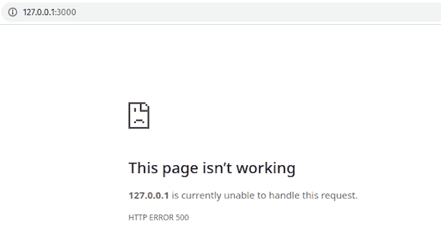
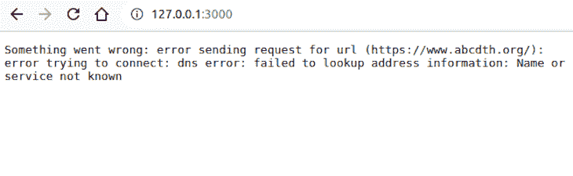
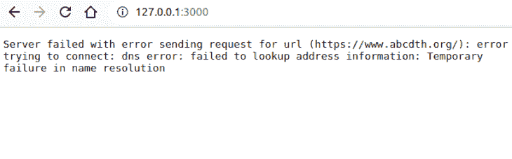

# 使用 Rust 和 Axum 进行错误处理

> 原文：<https://blog.logrocket.com/rust-axum-error-handling/>

当你构建一个后端 web 服务时，事情并不总是顺利的。例如，传入的请求可能没有必要的数据，或者可能以错误的格式显示其数据。大多数 web 服务通过返回错误响应来处理这种可能性。

Axum 是一个使用 Rust 构建服务器端 web 应用的框架。它还允许您处理错误响应。

本教程向您介绍了如何使用 Rust 和 Axum 构建 web 服务，以及如何使用这个框架处理错误响应。

向前跳:

## 安装 Axum

要设置一个 Axum 项目，首先需要使用以下命令创建一个空的 Rust 项目:

```
$ cargo new --bin axum-web-server
```

上面的命令创建一个`axum-web-server`文件夹，并初始化您需要开始的文件。

接下来你需要做的是安装`axum`和`tokio`包。要安装它们，打开`axum-web-server`文件夹中的`Cargo.toml`文件，在`[dependencies]`下写下以下内容:

```
axum = "0.6.1"
tokio = { version = "1.23.0", features = ["full"] }
tower = { version = "0.4.13", features = ["timeout"] }
```

然后使用下面的命令构建包:

```
$ cargo build
```

提醒一下，当你构建一个项目时，`[cargo](https://blog.logrocket.com/demystifying-cargo-in-rust/)` [会将你在`[dependencies]`下面列出的包](https://blog.logrocket.com/demystifying-cargo-in-rust/)从注册表下载到你的项目中。

## 用 Axum 构建一个简单的 web 服务器

随着项目的建立，是时候构建一个简单的应用程序了。稍后，我们将使用这个简单的应用程序来演示如何在 Axum 中处理错误。

如果您已经有了自己的项目，并且只是想看看 Axum 的错误处理功能，那么[您可以跳过](#handling-errors-rust-axum)。

在本节中，您将构建的应用程序是一个具有三个端点的 web 服务:

*   `/` —根；返回文本`Welcome`
*   `/say-hello` —返回文本`Hello!`
*   `/say-goodbye` —返回文本`Goodbye`

该服务器的代码如下。将代码复制并粘贴到`axum-web-server`文件夹中的`src/main.rs`文件中:

```
use axum::{
   routing::get,
   Router,
};

#[tokio::main]
async fn main() {
   let app = Router::new()
       .route("/", get(root))
       .route("/say-hello", get(say_hello))
       .route("/say-goodbye", get(say_goodbye));

   axum::Server::bind(&"127.0.0.1:3000".parse().unwrap())
       .serve(app.into_make_service())
       .await.unwrap();
}

async fn root() -> String {
   return "Welcome!".to_string();
}

async fn say_hello() -> String {
   return "Hello!".to_string();
}

async fn say_goodbye() -> String {
   return "Goodbye!".to_string();
}
```

要查看运行中的代码，请运行以下命令:

```
$ cargo run
```

上面的命令运行`main.rs`文件。当程序运行时，它还在`[http://127.0.0.1:3000](http://127.0.0.1:3000)`启动一个本地 web 服务器。

当你在浏览器中打开`[http://127.0.0.1:3000](http://127.0.0.1:3000)`时，你会在浏览器页面上看到一条显示`Welcome`的消息。

相反，当你打开`[http://127.0.0.1:3000/say-hello](http://127.0.0.1:3000/say-hello)`时，你会得到一条信息，上面写着`Hello!`

在浏览器中打开 URL 链接类似于[向 URL](https://blog.logrocket.com/making-http-requests-rust-reqwest/) 发送 GET 请求。浏览器在浏览器页面中显示请求的相应文本响应。

## 了解简单 web 服务器的工作原理

现在您可能想知道代码是如何工作的。程序做的第一件事是导入必要的包:

```
use axum::{
   routing::get,
   Router,
};
```

该软件包包括以下内容:

*   `routing::get` —用于向路由注册 GET 请求处理程序
*   `Router` —用于创建和处理路线

在导入的下面，程序定义了主函数:

```
#[tokio::main]
async fn main() {
   let app = Router::new()
       .route("/", get(root))
       .route("/say-hello", get(say_hello))
       .route("/say-goodbye", get(say_goodbye));

   axum::Server::bind(&"127.0.0.1:3000".parse().unwrap())
       .serve(app.into_make_service())
       .await.unwrap();
}
```

默认情况下，Rust 不允许将主函数声明为异步，所以需要用`#[tokio::main]`属性修改函数。

在`main`函数中，我们做的第一件事是创建一个路由器，并为我们希望 web 服务器拥有的每个路由注册处理程序:

```
let app = Router::new()
    .route("/", get(root))
    .route("/say-hello/:name", get(say_hello))
    .route("/say-goodbye/:name", get(say_goodbye));
```

我们做的下一件事是创建一个服务器，将它绑定到`[http://127.0.0.1:3000](http://127.0.0.1:3000)`，并注册我们创建的路由器:

```
axum::Server::bind(&"127.0.0.1:3000".parse().unwrap())
     .serve(app.into_make_service())
     .await.unwrap();
```

在`main`函数下面，我们声明了注册到路由器的`root`、`say_hello`和`say_goodbye`处理程序:

```
async fn root() -> String {
   return "Welcome!".to_string();
}

async fn say_hello() -> String {
   return "Hello!".to_string();
}

async fn say_goodbye() -> String {
   return "Goodbye!".to_string();
}
```

现在，我们可以继续使用 Axum 来处理 Rust 中的错误。

## 什么是处理程序？

处理程序是处理请求背后的逻辑的异步函数。

处理程序不仅可以访问发送到路由的请求数据，还可以提供对请求的响应。一旦您在路由上注册了一个处理程序，发送到该路由的任何请求都将由该处理程序处理。

前面几节中的`root`、`say_hello`和`say_goodbye`函数是处理程序的简单示例:

```
async fn root() -> String {
   return "Welcome!".to_string();
}

async fn say_hello() -> String {
   return "Hello!".to_string();
}

async fn say_goodbye() -> String {
   return "Goodbye!".to_string();
}
```

在处理程序对请求的操作结束时，处理程序返回的将是服务器的响应。

例如，当你向`[http://127.0.0.1:3000](http://127.0.0.1:3000)`发送请求时，程序调用`root`。由于`root`返回`Welcome!`，根处理程序返回`Welcome!`作为它的响应。

## 用 Axum 处理 Rust 中的错误

除了返回常规响应，您可能需要在响应中返回错误。错误有助于让客户机知道它的请求出了什么问题。

Axum 要求所有处理程序都是可靠的，这意味着它们在运行时不会出错。这意味着处理程序发送错误响应的唯一方式是[返回一个](https://blog.logrocket.com/rust-enums-and-pattern-matching/) `[Result::Err enum](https://blog.logrocket.com/rust-enums-and-pattern-matching/)`。

在下面的示例中，我们修改了根处理程序，以包括错误处理功能:

```
async fn root() -> Result<String, StatusCode> {
   let a_condition = false;
   if a_condition {
       return Ok("Welcome!".to_string());
   } else {
       return Err(StatusCode::INTERNAL_SERVER_ERROR);
   }
}
```

如您所见，处理程序返回了一个内部服务器错误响应，因为`a_condition`为假。

现在修改了`root`，当您在浏览器中打开`[http://127.0.0.1:3000/](http://127.0.0.1:3000/)`时，网页将如下图所示:



如果我们将`a_condition`设置为 true，处理程序将再次返回`Welcome!`，就像之前一样。

## 用 Axum 处理 Rust 错误的其他方法

除了`Result::Err`枚举，Axum 还提供了其他方法来处理错误响应。两种主要的方法是易出错的处理程序和模式匹配。

### 用易出错的处理程序处理错误

您可能不总是知道处理程序中的每个错误条件，处理程序在运行时可能会遇到错误。然而，Axum 要求所有的处理程序都不会出错。因此，当处理程序遇到错误时，传入的请求不会得到响应。

如果处理程序遇到错误，易出错的处理程序将返回错误响应。下面是一个容易出错的处理程序的示例:

```
use axum::{
   Router,
   http::{Response, StatusCode},
   error_handling::HandleError,
};

#[tokio::main]
async fn main() {
   // this service might fail with `reqwest::Error`
   let fallible_service = tower::service_fn(|_req| async {
     let body = can_fail().await?;
     Ok::<_, reqwest::Error>(Response::new(body))
   });

   // Since fallible_service can fail with 'reqwest::Error',
   // you can't directly route it to "/".
   // Use route_service to convert any errors
   // encountered into a response
   let app = Router::new()
     .route_service("/", HandleError::new(fallible_service, handle_error) );

   axum::Server::bind(&"127.0.0.1:3000".parse().unwrap())
     .serve(app.into_make_service())
     .await
     .unwrap();
}

async fn can_fail() -> Result<String, reqwest::Error> {
   // send a request to a site that doesn't exist 
   // so we can see the handler fail
   let body = reqwest::get("https://www.abcdth.org")
     .await?
     .text()
     .await?;
   Ok(body)
}
async fn handle_error(err: reqwest::Error) -> (StatusCode, String) {
   return (
       StatusCode::INTERNAL_SERVER_ERROR,
       format!("Something went wrong: {}", err),
   );
}
```

如您所见，`fallible_service`将失败并返回一个内部服务错误。然后，您应该会看到一条消息，内容为`Something went wrong:`,后面是一条错误消息，解释了出错的原因:



### 模式匹配的错误处理

当 Axum 服务器出现故障时，它会返回无内容响应。服务器故障通常源于可能失败的语句。

为了防止服务器返回无内容的响应，我们需要直接处理错误。处理错误的一种直接方法是通过模式匹配。

要使用模式匹配处理错误，只需在可能发生错误的地方用`match`块包装语句。

在下面的示例中，`reqwest`语句被包装，因为它可能会失败:

```
use axum::{
 Router,
 routing::get,
 http::StatusCode,
};

#[tokio::main]
async fn main() {

   let app = Router::new()
       .route("/", get(|| async {
           match reqwest::get("https://www.abcdth.org").await {
               Ok(res) => (
                   StatusCode::OK,
                   res.text().await.unwrap(),
               ),
               Err(err) => (
                   StatusCode::INTERNAL_SERVER_ERROR,
                   format!("Server failed with {}", err),
               )
           }
       }));

   axum::Server::bind(&"127.0.0.1:3000".parse().unwrap())
       .serve(app.into_make_service())
       .await
       .unwrap();
}
```

如您所见，当处理程序失败时，它会返回一个内部服务错误，然后显示一条解释失败原因的消息:



# 结论

在本文中，我们研究了如何使用 Rust 和 Axum 构建 web 服务，以及错误处理的工作原理和在 Axum 中处理错误响应的不同方式。

Axum 是构建 web 应用程序和服务的强大工具。通过 Axum 上的[Rust docs](https://docs.rs/axum/latest/axum/)，这篇关于[如何将 Rust web 服务器部署到 Heroku 上的文章](https://blog.logrocket.com/deploy-rust-web-server-heroku-axum-tokio-github-actions/)，或者 Axum 上的 [Rust docs 状态代码](https://docs.rs/http/0.2.8/http/status/struct.StatusCode.html)，了解更多关于该框架的信息。

## [log rocket](https://lp.logrocket.com/blg/rust-signup):Rust 应用的 web 前端的全面可见性

调试 Rust 应用程序可能很困难，尤其是当用户遇到难以重现的问题时。如果您对监控和跟踪 Rust 应用程序的性能、自动显示错误、跟踪缓慢的网络请求和加载时间感兴趣，

[try LogRocket](https://lp.logrocket.com/blg/rust-signup)

.

[](https://lp.logrocket.com/blg/rust-signup)

LogRocket 就像是网络和移动应用程序的 DVR，记录你的 Rust 应用程序上发生的一切。您可以汇总并报告问题发生时应用程序的状态，而不是猜测问题发生的原因。LogRocket 还可以监控应用的性能，报告客户端 CPU 负载、客户端内存使用等指标。

现代化调试 Rust 应用的方式— [开始免费监控](https://lp.logrocket.com/blg/rust-signup)。