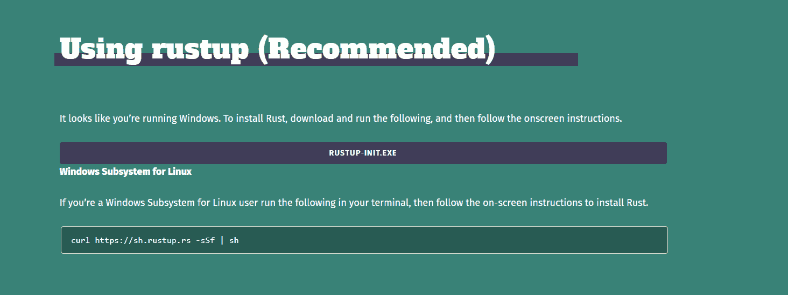
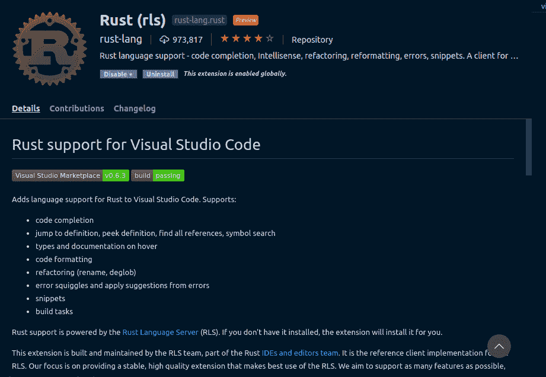
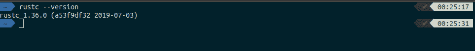
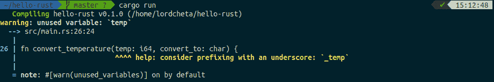

# rust for frontend developers-log rocket 博客

> 原文：<https://blog.logrocket.com/rust-for-front-end-developers/>

前端开发的世界是快节奏的，即使是最有经验的开发人员也可能会感到畏惧。

每一个新的框架、设计系统和架构模式都伴随着关于改变未来我们如何编写代码的大胆主张。

在本帖中，我们将看看[Rust](http://rustlang.com)——一种让每个人都能构建可靠高效软件的语言。

我知道你在想什么:“我以前听过这种说辞。”

你没有错。尽管如此，我可以向你保证，Rust 不负众望。

## TL；速度三角形定位法(dead reckoning)

本文的目标是向您介绍 Rust，并解释它为什么有用。

作为一名前端开发人员，您可能已经将 JavaScript 作为您的主要语言进行了大量的交互。它的动态、松散类型的本质使得快速学习其他不具备这些特征的语言有点困难。

然而，Rust 旨在使严格类型语言的学习曲线不那么陡峭，这意味着您不会经历学习 c++等语言的典型挫折。

Rust 和 JavaScript 之间有非常小的相似之处，比如使用`let`和`const`进行变量声明。

这没什么大不了的，但是我发现我使用 Rust 时感觉更轻松，因为我已经熟悉了这些关键词。

Rust 的另一个好处是语法不冗长——非常简单明了。

## 什么是铁锈？

根据[官方文档](https://www.rust-lang.org/learn)，“Rust 编程语言帮助你编写更快、更可靠的软件。高层次的人机工程学和低层次的控制在编程语言设计中往往是不协调的；Rust 挑战这种冲突。

通过平衡强大的技术能力和出色的开发人员体验，Rust 为您提供了控制底层细节(如内存使用)的选项，而没有传统上与此类控制相关的所有麻烦。"

## 铁锈是给谁的？

如果你完全是编程新手，Rust 可能不适合你。

包含的官方文档假设您已经用另一种编程语言编写了代码，但是它没有对哪一种语言做任何假设。

如果你通常关心节省内存的代码，Rust 将特别适合你。

有了 Rust，任何人都可以做系统级的工作，这些工作传统上只留给掌握了内存管理、数据表示和并发性等细节的精英程序员。

听起来很无聊？

这里有一些令人兴奋的事实:Rust 不局限于低级系统编程，它的表现力和人体工程学足以制作 CLI 应用程序、web 服务器和许多其他类型的有趣软件。

## 入门指南

不管你用什么操作系统，设置 Rust 都很容易。

我不想弄乱这篇文章，所以只需前往[安装指南页面](https://www.rust-lang.org/tools/install)，它将自动检测您的操作系统，并引导您完成为您的机器推荐的设置。

注意:如果您使用的是 Linux 或 Mac，您应该会看到如下图所示的内容:


出于本文的目的，我们将使用基于 UNIX 的系统(所有 Linux 发行版和 MAC)。在您的终端中运行下面的命令，并按照屏幕上的指示进行操作。

注意:如果您使用的是 Linux 的 Windows 子系统，该命令也适用于您。

```
curl https://ah.rustup.rs -sSf | sh`
```

如果你在一台 Windows 机器上，你的应该是这样的:



for windows and windows subsystem for Linux

像往常一样，单击链接下载可执行文件，并按照屏幕上的说明进行操作。

### 设置您的开发环境

在本文中，我们将使用[和代码](https://code.visualstudio.com/download)。

为了提高效率，我推荐使用 [Rust 扩展](https://code.visualstudio.com/download)，它有助于代码完成、错误检测等。



User-uploaded image:vscode-rust.png

值得注意的是，无论你选择什么样的代码编辑器，Rust 都会有扩展或插件。检查你的编辑器的扩展市场，你应该看到一个。

按照说明安装，你就可以开始了。

一旦解决了所有这些问题，运行下面的命令，看看您的机器上是否安装了 Rust。

```
rustc --version
```

如果一切顺利，您应该会看到如下内容:



如果您正确地完成了安装，但是无法在终端中运行该命令，最可能的原因是您没有正确配置 PATH 环境变量。

去看一下[安装指南](https://code.visualstudio.com/download)，看看你如何解决这个问题。

注意:在运行此命令之前，请记住在安装过程之后重新启动您的终端。

### 后续步骤

你不需要在互联网上搜寻书籍或资源来学习 Rust。

随着你的安装而来的是一本由 Steve Klabnik 和 Carol Nichols 所著的书《Rust 编程语言》,这本书是由 Rust 社区提供的。

它以实际操作的方式引导您完成设置、基础和高级主题。这是一流的资源。

你可以[在线阅读这本书](https://code.visualstudio.com/download)或者使用下面的命令进行离线阅读。如果您在初始 Rust 安装期间没有安装 rustup，请确保在您的机器上安装 Rust up。

```
rustup docs --book
```

或者，你可以选择参加[生锈课程](https://github.com/rust-lang/rustlings/)。它指导您下载和设置 Rust 工具链，并教您在命令行上读写 Rust 语法的基础知识。

如果阅读数百页关于一门语言的文章不是你的风格，你也可以通过例子查看 [Rust。](https://doc.rust-lang.org/stable/rust-by-example/)

虽然这本书用了大量的文字来谈论代码，但 RBE 展示了一堆代码，并保持了最少的对话。还包括趣味练习。

## 与前端的接口生锈

走到这一步，你可能想知道你的手怎么会被前端的铁锈弄脏。

通常，要在前端使用 Rust(或除 JavaScript 之外的任何其他语言)，您需要使用 WebAssembly。

### 什么是 WebAssembly？

如果您还不熟悉 WebAssembly(简称 wasm ),它是一种二进制指令格式，承诺接近本机性能，允许开发人员使用 rust、c++或您选择的任何语言(当然除了 JavaScript)在 web 上为客户端和服务器应用程序构建应用程序。

点击了解更多[。](https://webassembly.org/)

### 相对于 JavaScript 的性能优势

这里的一个关键优势是 Rust 被编译成机器代码，所以没有虚拟机。

在你的代码和机器之间也没有解释器，这使得它具有很高的性能。

正如这个[基准测试所建议的](https://medium.com/sean3z/rest-api-node-vs-rust-c75aa8c96343)，REST API 性能与 Rust 的 [Rocket](https://rocket.rs/) 和 Node.js 的 [Restify](http://restify.com/) 的直接比较显示，Rust 每秒处理 72，000 个请求，而 Node.js 每秒处理 8，000 个请求，空闲时使用 1 mb 多一点的内存，而 Node.js 每秒 19 mb。

这并不奇怪，因为 Rust 是一种系统编程语言。

Rust 响应请求的速度平均比 Node 快近 100 倍，而且你不会遇到 JavaScript 应用通常容易出现的编译时错误。

### 前端生锈的附加设置

一旦完成了标准 Rust 开发工具链的设置，前端开发的设置也很容易。

首先，您需要安装 wasm-pack。这是一个用于构建、测试和发布 Rust 生成的 WebAssembly 的综合包。

如果您使用的是 Mac 或 Linux 发行版，请在终端中运行以下命令:

```
curl https://rustwasm.github.io/wasm-pack/installer/init.sh -s Sf | sh
```

对于 Windows 机器，下载安装程序，运行它，并遵循屏幕上的指示。

您还可以通过使用现有的 git 存储库作为模板来安装 [cargo-generate](https://rocket.rs/) 。它帮助你快速开始一个新的 Rust 项目。

使用以下命令安装:

```
cargo install cargo-generate
```

如果您在机器上正确配置了 Rust 工具链，这应该可以正常工作。Cargo 是 Rust 的包管理器。

您还需要安装 npm。按照这些说明安装 npm 。

如果您已经安装了 npm，请确保您是最新的。使用以下命令执行此操作:

```
npm install [email protected] -g
```

[这里](https://rustwasm.github.io/docs/book/)是一本让你从前端的 Rust 开始的好书

## 生锈的好处

铁锈有很多优点和用途:

*   我几乎没有合适的词语来表达它有多快。平均下来，据说和 c++不相上下。要更深入地分析生锈的速度，请查看这篇文章。
*   它有很棒的文档和非常丰富的生态系统。它拥有开发人员所期望的现代化设施，比如强大的货物包装管理，以及富于表现力的(零成本)抽象。

*   接下来是我个人最喜欢的:它的错误消息是尽可能描述性的。它有一个友好的编译器，提供有用的错误消息和一流的工具。你真的不能要求更多了。

这里有一个例子:



Notice how it recommends a solution after pointing out the error. Super useful, don’t you think?

*   使用 Rust 可以让你建立从一个领域转移到另一个领域的技能；你可以通过编写一个 web 应用程序来学习 Rust，然后将这些技能应用到你的 Raspberry Pi 中。
*   铁锈是完全可靠的。它丰富的类型系统和所有权模型保证了内存安全和线程安全，并使您能够在编译时消除许多种类的错误。

*   我喜欢 rust 的另一点是:当你用 Rust 编写一个程序时，这个程序可以在任何没有安装 Rust 的机器上运行。

*   JavaScript web 应用程序努力获得并保持可靠的性能。JavaScript 的动态类型系统和垃圾收集暂停没有帮助。如果您不小心偏离了 JIT 的快乐之路，看似很小的代码更改可能会导致严重的性能退化。

*   Rust 给了程序员底层的控制和可靠的性能。它没有困扰 JavaScript 的不确定性垃圾收集暂停。程序员可以控制间接寻址、单态化和内存布局。

*   Rust 和 WebAssembly 与现有的 JavaScript 工具集成。它支持 ECMAScript 模块，您可以继续使用您已经喜欢的工具，如 npm 和 Webpack。

*   说到性能优势，代码大小非常重要，因为`.wasm`必须通过网络下载。Rust 缺少运行时间，支持小的`.wasm`大小，因为没有像垃圾收集器那样包含额外的膨胀。您只需为您实际使用的功能付费(代码大小)。

*   现有的代码库不需要扔掉。您可以从将对性能最敏感的 JavaScript 函数移植到 Rust 开始，以获得立竿见影的效果。

## 结论

从 web 应用到嵌入式系统和 CLI 应用，Rust 提供了一个可靠的工具集来创建高度可持续和可扩展的代码库。

有一句流行的话:“永远赌 JavaScript。”

你可以放心，这同样适用于铁锈。

几率惊人地对它有利。一些公司已经在生产中使用 Rust，包括 npm、Yelp、Dropbox 等。

你可以在这里了解更多关于这些公司如何使用 Rust 的信息。

无论你是一个开发团队、学生、公司、开源开发人员，还是任何重视速度和稳定性的人，Rust 都适合你。

## [log rocket](https://lp.logrocket.com/blg/rust-signup):Rust 应用的 web 前端的全面可见性

调试 Rust 应用程序可能很困难，尤其是当用户遇到难以重现的问题时。如果您对监控和跟踪 Rust 应用程序的性能、自动显示错误、跟踪缓慢的网络请求和加载时间感兴趣，

[try LogRocket](https://lp.logrocket.com/blg/rust-signup)

.

[](https://lp.logrocket.com/blg/rust-signup)

LogRocket 就像是网络和移动应用程序的 DVR，记录你的 Rust 应用程序上发生的一切。您可以汇总并报告问题发生时应用程序的状态，而不是猜测问题发生的原因。LogRocket 还可以监控应用的性能，报告客户端 CPU 负载、客户端内存使用等指标。

现代化调试 Rust 应用的方式— [开始免费监控](https://lp.logrocket.com/blg/rust-signup)。