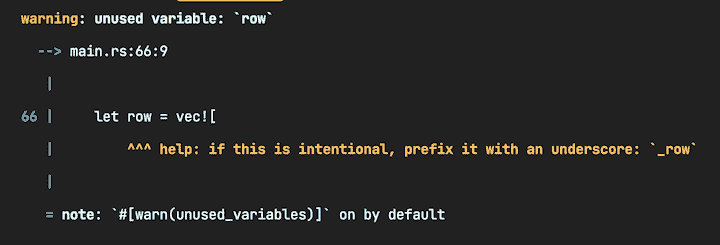
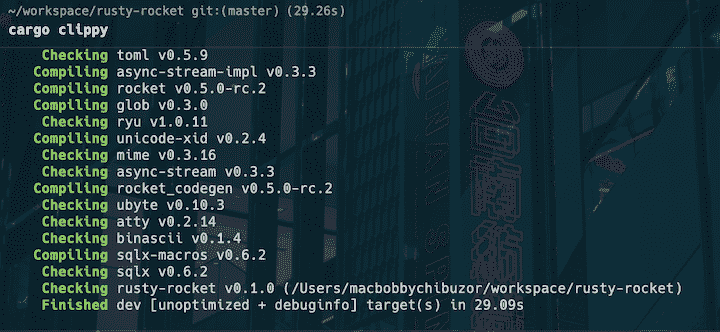
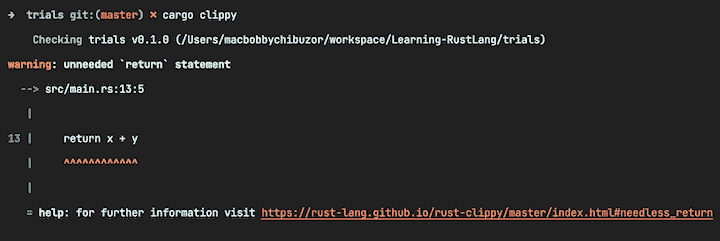

# 林挺在锈与 Clippy

> 原文：<https://blog.logrocket.com/rust-linting-clippy/>

如果你在一个经常与其他人的代码进行交互的开发团队中工作，那么你就会知道编写干净且符合习惯的代码有多重要。

有时候，开发人员仅仅通过学习语法就学会了一门新的编程语言。然后，他们用它来构建非常棒的系统，但并不关心如何用这种语言编写程序。林挺代码是检查惯用代码的最佳方式之一，所以让我们看看如何在 Rust 中做到这一点。

本文介绍了林挺，作为编写惯用代码的有用实践。我们将具体讨论 Rust 中林挺代码的重要性和结果，调查 Rust 代码库中林挺是如何完成的。然后，我们将安装 [Clippy](https://doc.rust-lang.org/clippy/) 并演示如何使用它来 lint Rust 代码。

*向前跳转:*

## 什么是林挺代码？

林挺是检查代码以发现潜在错误、缺陷和不遵循编程语言标准约定的风格的过程。

林挺在 Python 和 JavaScript 等动态语言中更受欢迎，因为静态类型语言的编译器执行大部分林挺操作。lints 编码的工具称为 linter，它执行以下操作:

*   检查潜在的错误
*   检查错误
*   检查代码复杂性
*   检查代码气味
*   检查程序是否遵循习惯的和干净的风格
*   检查不匹配的命名约定
*   提供安全警告
*   检查内存泄漏、索引溢出和空指针取消引用
*   检查非法的数据类型组合

在项目早期引入林挺很重要，因为很难(甚至不可能)抛弃旧的遗留代码库。我们将在下一节讨论关于 Rust 编译器的林挺。

## 林挺如何改进 Rust code？

Rust 编译器是在考虑静态代码分析的情况下构建的；它有自己内置的 lint 检查集合，可以在编译期间评估代码。

要查看这些内置 lint 的列表，称为[默认允许的 lint](https://doc.rust-lang.org/rustc/lints/listing/allowed-by-default.html)，运行以下命令:

```
rustc -W help

```

这些棉绒分为以下几组，称为棉绒等级:

*   `allow`:告诉 linter 忽略违反 lint 的情况
*   `warn`:告诉棉绒机，如果违反棉绒，则发出警告
*   `force-warn`:同`warn`，但不能覆盖
*   `deny`:如果棉绒被破坏，告知棉绒产生错误
*   `forbid`:同`deny`，但不能覆盖

要使用 Rust 编译器内置的林挺特性对 Rust 程序进行检查，请使用以下命令:

```
cargo check

```

在编译或检查期间抛出错误的 Rust 代码在警告中提供 lint 类别:


Here, the warning shows the `warn` category. We can prevent the lint from throwing a warning by adding lint level attributes to the top of the code like this:

```
#![allow(unused_variables)]

```

这允许 Rust 编译器用`(unused_variables)`警告覆盖机箱中的所有代码。如果我们运行检查或者再次尝试编译，这个特别的警告将会消失。

在测试应用程序或构建应用程序原型并且不需要遵循惯用标准的情况下，覆盖 lints 会很有用。当您想要运行通常会在编译时抛出林挺错误的代码块时，这一点特别有用。

现在我们对 Rust 的内置编译器有了更好的理解，让我们学习更多关于 Clippy 的知识。

## 什么是 Clippy？

Clippy 是一个包含 lint 列表的箱子，这些 lint 在内置的 Rust 编译器 lint 列表中不可用。Clippy 提供了[超过 550 个 lint](https://rust-lang.github.io/rust-clippy/master/index.html)来包含在您的程序中，所有这些 lint 被分成 10 个 lint 级别类别:

1.  `cargo`:帮助您改进`Cargo.toml`清单文件的 Lints
2.  `complexity`:对于可以简化的复杂代码
3.  `correctness`:检查代码是否正确的标志，不可包含`#![allow]`
4.  `deprecated`:针对已弃用的代码或库
5.  新的 lints 仍在开发中
6.  `pedantic`:严格的 lints
7.  给出如何提高代码速度和性能的建议
8.  `restriction`:适用于特定情况的有用信息
9.  强化惯用风格的 Lints
10.  `suspicious` : Lints 表示可疑代码，这些代码应该被修复，但如果是故意的，则可以保留

现在，让我们看看如何安装和运行 Clippy。

## 安装和运行 Clippy

Rust toolchain 的新版本预装了 Clippy。如果你想手动安装 Clippy，你可以使用`rustup`工具链安装程序:

```
rustup update
rustup component add clippy

```

Clippy 可以作为项目文件夹中的`cargo`子命令运行:

```
cargo clippy

```

Clippy 检查并编译项目文件夹中的依赖项和代码，如下:


We can also use Clippy without `cargo`, by using the `clippy-driver`. To use Clippy in a normal workspace, run the following `cargo` subcommand:

```
cargo clippy -p <workspace_name>

```

## 使用 Clippy 进行代码分析

一些 Rust 代码可以编译而没有错误或编译错误，但这并不意味着代码是干净的。Clippy 捕捉代码中您或 Rust 编译器无法检测到的次优实践。例如，下面的代码可以正常编译，但它实际上有一个问题:

```
fn add(x: i32, y: i32) -> i32 {
    return x + y
}

fn main() {
    println!("Summation result is: {}", add(3, 7));
}
// Returns: 10

```

点击[播放](https://play.rust-lang.org/?version=stable&mode=debug&edition=2021&gist=74b7eba2ef02879d031357d63bff4b27)快速确认这段代码编译成功。然后，检查代码，并尝试确定什么可能是错误的。

现在，让我们使用 Clippy 来检查并找出问题:

```
cargo clippy

```

检查的结果返回以下错误:


您可以继续从代码中删除`return`语句，只留下`x + y`。如果您再次检查，将不会发现任何问题。

虽然这是一个非常简单的例子，但是 Clippy 非常强大，能够捕捉非常严重的错误。Clippy 应该总是在 Rust 项目中使用。

## 配置剪辑链接

您不需要接受 Clippy 提供的每一个 lint。事实上，当您不同意 lint 时，您可以自由地在代码中添加几个`#![allow(...)]` lint 属性。您还可以使用特定的子命令自定义 Clippy，使其具有您喜欢的某些行为。

例如，您可以使用`-D`选项来启用或禁用特定的 lints，或者使用`-W`选项来控制 Clippy 生成的警告级别。此外，您可以使用`-A`选项对项目中的所有依赖项运行 Clippy，而不仅仅是您自己的代码。

要允许特定的 lint 运行，可以像这样使用`-A`选项:

```
cargo clippy -- -A clippy::lint_name

```

如果您想要一个关于特定 lint 的警告，使用如下的`-W`选项:

```
cargo clippy -- -W clippy::lint_name

```

您还可以使用 lint 类别尝试这些属性。例如，您可以在启用所有 lints 警告的情况下运行 Clippy:

```
cargo clippy --W clippy::correctness

```

## 林挺要不断整合

在生产中，建议在您的持续集成(CI)提供程序上运行 Clippy。如果您使用 [GitHub Actions](https://github.com/features/actions) ，那么将这段代码添加到您的配置脚本中:

```
on: push
name: Clippy check

# Make sure CI fails on all warnings, including Clippy lints
env:
  RUSTFLAGS: "-Dwarnings"

jobs:
  clippy_check:
    runs-on: ubuntu-latest
    steps:
      - uses: actions/[email protected]
      - name: Run Clippy
        run: cargo clippy --all-targets --all-features

```

`-Dwarnings`标志阻止配置项进行处理。环境变量`RUSTFLAGS` 被设置为`-Dwarnings`以使所有的货物命令服从夹警告。

如果您的配置项提供者是 Travis CI，您可以改为添加以下内容:

```
language: rust
rust:
  - stable
  - beta
before_script:
  - rustup component add clippy
script:
  - cargo clippy
  # if you want the build job to fail when encountering warnings, use
  - cargo clippy -- -D warnings
  # in order to also check tests and non-default crate features, use
  - cargo clippy --all-targets --all-features -- -D warnings
  - cargo test
  # etc.

```

## 进一步建议

在这篇文章中，我们调查了林挺，林挺水平，和类别，我们已经讨论了林挺如何改善 Rust 代码。我们演示了如何安装 Clippy 并使用它来检查代码是否符合习惯和正确。我们还演示了如何在持续集成中包含 Clippy。

使用 Clippy 时，有两件事你应该记住。首先，你可以时不时地不同意一些无关紧要的建议。其次，Clippy 不会以任何方式使内置编译器的安全和错误检查工具变得可替换或无用。相反，Clippy 提供了一个广泛的附加 lints 集合，可以用来提高 Rust 代码的性能。

## [log rocket](https://lp.logrocket.com/blg/rust-signup):Rust 应用的 web 前端的全面可见性

调试 Rust 应用程序可能很困难，尤其是当用户遇到难以重现的问题时。如果您对监控和跟踪 Rust 应用程序的性能、自动显示错误、跟踪缓慢的网络请求和加载时间感兴趣，

[try LogRocket](https://lp.logrocket.com/blg/rust-signup)

.

[](https://lp.logrocket.com/blg/rust-signup)

LogRocket 就像是网络和移动应用程序的 DVR，记录你的 Rust 应用程序上发生的一切。您可以汇总并报告问题发生时应用程序的状态，而不是猜测问题发生的原因。LogRocket 还可以监控应用的性能，报告客户端 CPU 负载、客户端内存使用等指标。

现代化调试 Rust 应用的方式— [开始免费监控](https://lp.logrocket.com/blg/rust-signup)。